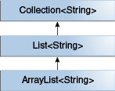

# 泛型，继承和子类型

> 原文： [https://docs.oracle.com/javase/tutorial/java/generics/inheritance.html](https://docs.oracle.com/javase/tutorial/java/generics/inheritance.html)

如您所知，只要类型兼容，就可以将一种类型的对象分配给另一种类型的对象。例如，您可以将`整数`分配给`对象`，因为`对象`是`整数`的超类型之一：

```java
Object someObject = new Object();
Integer someInteger = new Integer(10);
someObject = someInteger;   // OK

```

在面向对象的术语中，这被称为“是一种”关系。由于`整数` _ 是*种`对象`，因此允许分配。但是`Integer`也是一种`Number` ，所以下面的代码也是有效的：

```java
public void someMethod(Number n) { /* ... */ }

someMethod(new Integer(10));   // OK
someMethod(new Double(10.1));   // OK

```

仿制药也是如此。您可以执行泛型类型调用，将`Number`作为其类型参数传递，如果参数与`Number`兼容，则允许`add`的任何后续调用：

```java
Box<Number> box = new Box<Number>();
box.add(new Integer(10));   // OK
box.add(new Double(10.1));  // OK

```

现在考虑以下方法：

```java
public void boxTest(Box<Number> n) { /* ... */ }

```

它接受什么类型的论据？通过查看其签名，您可以看到它接受一个类型为`Box&lt; Number&gt;的参数。` 。但是，这是什么意思？您是否可以通过`Box&lt; Integer>`或`Box&lt; Double>` ，正如您所料？答案是“不”，因为`Box&lt; Integer>`和`Box&lt; Double>`不是`Box&lt; Number&gt;的亚型。` 。

在使用泛型编程时，这是一个常见的误解，但这是一个需要学习的重要概念。


`Box<Integer>` is not a subtype of `Box<Number>` even though `Integer` is a subtype of `Number`.

* * *

**Note:** Given two concrete types `A` and `B` (for example, `Number` and `Integer`), `MyClass<A>` has no relationship to `MyClass<B>`, regardless of whether or not `A` and `B` are related. The common parent of `MyClass<A>` and `MyClass<B>` is `Object`.

For information on how to create a subtype-like relationship between two generic classes when the type parameters are related, see [Wildcards and Subtyping](subtyping.html).

* * *

您可以通过扩展或实现泛型类或接口来对其进行子类型化。一个类或接口的类型参数与另一个类型参数的类型参数之间的关系由`extends`和`实现`子句确定。

使用`集合`类作为示例， `ArrayList&lt; E>`实现`List&lt; E>`和`列表&lt; E&gt; extends Collection&lt; E>` 。所以`ArrayList&lt; String>`是`List&lt; String&gt;的子类型。` ，它是`Collection&lt; String&gt;的子类型。` 。只要不改变类型参数，就会在类型之间保留子类型关系。



A sample `Collections` hierarchy

现在假设我们想要定义我们自己的列表接口， `PayloadList` ，它将泛型类型`P`的可选值与每个元素相关联。它的声明可能如下：

```java
interface PayloadList<E,P> extends List<E> {
  void setPayload(int index, P val);
  ...
}

```

`PayloadList`的以下参数化是`List&lt; String&gt;的子类型。` ：

*   `PayloadList&lt; String，String>`
*   `PayloadList&lt; String，Integer>`
*   `PayloadList&lt; String，Exception>`


A sample `PayloadList` hierarchy