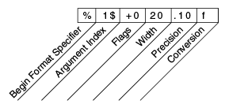

# 格式化

> 原文： [https://docs.oracle.com/javase/tutorial/essential/io/formatting.html](https://docs.oracle.com/javase/tutorial/essential/io/formatting.html)

实现格式化的流对象是 [`PrintWriter`](https://docs.oracle.com/javase/8/docs/api/java/io/PrintWriter.html) ，字符流类或 [`PrintStream`](https://docs.oracle.com/javase/8/docs/api/java/io/PrintStream.html) （字节流类）的实例。

* * *

**Note:** The only `PrintStream` objects you are likely to need are [`System.out`](https://docs.oracle.com/javase/8/docs/api/java/lang/System.html#out) and [`System.err`](https://docs.oracle.com/javase/8/docs/api/java/lang/System.html#err). (See [I/O from the Command Line](cl.html) for more on these objects.) When you need to create a formatted output stream, instantiate `PrintWriter`, not `PrintStream`.

* * *

与所有字节和字符流对象一样，`PrintStream`和`PrintWriter`的实例实现了一组标准的`write`方法，用于简单的字节和字符输出。此外，`PrintStream`和`PrintWriter`都实现了将内部数据转换为格式化输出的同一组方法。提供两个级别的格式：

*   `print`和`println`以标准方式格式化各个值。
*   `format`基于格式字符串格式化几乎任意数量的值，具有许多用于精确格式化的选项。

## `print`和`println`方法

使用适当的`toString`方法转换值后，调用`print`或`println`输出单个值。我们可以在 [`Root`](examples/Root.java) 示例中看到这一点：

```java
public class Root {
    public static void main(String[] args) {
        int i = 2;
        double r = Math.sqrt(i);

        System.out.print("The square root of ");
        System.out.print(i);
        System.out.print(" is ");
        System.out.print(r);
        System.out.println(".");

        i = 5;
        r = Math.sqrt(i);
        System.out.println("The square root of " + i + " is " + r + ".");
    }
}

```

这是`Root`的输出：

```java
The square root of 2 is 1.4142135623730951.
The square root of 5 is 2.23606797749979.

```

`i`和`r`变量被格式化两次：第一次在`print`的重载中使用代码，第二次由 Java 编译器自动生成的转换代码，也使用`toString`。您可以通过这种方式格式化任何值，但是您无法控制结果。

## `format`方法

`format`方法基于 _ 格式字符串 _ 格式化多个参数。格式字符串由嵌入 _ 格式说明符 _ 的静态文本组成;除格式说明符外，格式字符串输出不变。

格式字符串支持许多功能。在本教程中，我们将介绍一些基础知识。有关完整说明，请参阅 API 规范中的 [`format string syntax`](https://docs.oracle.com/javase/8/docs/api/java/util/Formatter.html#syntax) 。

[`Root2`](examples/Root2.java) 示例使用单个`format`调用格式化两个值：

```java
public class Root2 {
    public static void main(String[] args) {
        int i = 2;
        double r = Math.sqrt(i);

        System.out.format("The square root of %d is %f.%n", i, r);
    }
}

```

这是输出：

```java
The square root of 2 is 1.414214.

```

与本例中使用的三个一样，所有格式说明符都以`%`开头，以 1 或 2 字符 _ 转换 _ 结束，指定生成的格式化输出的种类。这里使用的三个转换是：

*   `d`将整数值格式化为十进制值。
*   `f`将浮点值格式化为十进制值。
*   `n`输出特定于平台的线路终结器。

以下是其他一些转换：

*   `x`将整数格式化为十六进制值。
*   `s`将任何值格式化为字符串。
*   `tB`将整数格式化为特定于语言环境的月份名称。

还有很多其他转换。

* * *

**Note:** 

除`%%`和`%n`外，所有格式说明符必须与参数匹配。如果他们不这样做，则会抛出异常。

在 Java 编程语言中，`\n`转义始终生成换行符（`\u000A`）。除非您特别需要换行符，否则请勿使用`\n`。要获取本地平台的正确行分隔符，请使用`%n`。

* * *

除了转换之外，格式说明符还可以包含几个其他元素，以进一步自定义格式化输出。这是一个例子， [`Format`](examples/Format.java) ，它使用了所有可能的元素。

```java
public class Format {
    public static void main(String[] args) {
        System.out.format("%f, %1$+020.10f %n", Math.PI);
    }
}

```

这是输出：

```java
3.141593, +00000003.1415926536

```

附加元素都是可选的。下图显示了较长的说明符如何分解为元素。



格式说明符的元素。


元素必须按所示顺序出现。从右侧开始，可选元素是：

*   **精度**。对于浮点值，这是格式化值的数学精度。对于`s`和其他常规转换，这是格式化值的最大宽度;如有必要，该值将被截断。
*   **宽度**。格式化值的最小宽度;必要时填充该值。默认情况下，该值使用空白填充。
*   **标志**指定其他格式选项。在`Format`示例中，`+`标志指定应始终使用符号格式化数字，`0`标志指定`0`是填充字符。其他标志包括`-`（右侧的 pad）和`,`（具有特定于语言环境的千位分隔符的格式号）。请注意，某些标志不能与某些其他标志一起使用或与某些转换一起使用。
*   **参数索引**允许您显式匹配指定的参数。您还可以指定`<`以匹配与前一个说明符相同的参数。因此，这个例子可以说：`System.out.format("%f, %&lt;+020.10f %n", Math.PI);`