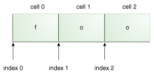

# 字符串文字

> 原文： [https://docs.oracle.com/javase/tutorial/essential/regex/literals.html](https://docs.oracle.com/javase/tutorial/essential/regex/literals.html)

此 API 支持的最基本的模式匹配形式是字符串文字的匹配。例如，如果正则表达式为`foo`且输入字符串为`foo`，则匹配将成功，因为字符串相同。尝试使用测试工具：

```java

Enter your regex: foo
Enter input string to search: foo
I found the text foo starting at index 0 and ending at index 3.

```

这场比赛很成功。请注意，虽然输入字符串长度为 3 个字符，但起始索引为 0，结束索引为 3.按照惯例，范围包括起始索引和排除结束索引，如下图所示：



字符串文字 foo，带有编号单元格和索引值。


字符串中的每个字符都驻留在自己的 _ 单元格 _ 中，索引位置指向每个单元格。字符串“foo”从索引 0 开始，到索引 3 结束，即使字符本身只占用单元格 0,1 和 2。

随后的比赛，你会发现一些重叠;下一个匹配的起始索引与上一个匹配的结束索引相同：

```java

Enter your regex: foo
Enter input string to search: foofoofoo
I found the text foo starting at index 0 and ending at index 3.
I found the text foo starting at index 3 and ending at index 6.
I found the text foo starting at index 6 and ending at index 9.

```

## 元字符

此 API 还支持许多影响模式匹配方式的特殊字符。将正则表达式更改为`cat.`，将输入字符串更改为`cats`。输出显示如下：

```java
Enter your regex: cat.
Enter input string to search: cats
I found the text cats starting at index 0 and ending at index 4.

```

即使输入字符串中不存在点“`.`”，匹配仍然成功。它成功是因为点是 _ 元字符 _ - 由匹配器解释的具有特殊含义的字符。元字符“。”表示“任何字符”，这就是本例中匹配成功的原因。

此 API 支持的元字符为：`<([{\^-=$!|]})?*+.>`

* * *

**Note:** In certain situations the special characters listed above will _not_ be treated as metacharacters. You'll encounter this as you learn more about how regular expressions are constructed. You can, however, use this list to check whether or not a specific character will ever be considered a metacharacter. For example, the characters `@` and `#` never carry a special meaning.

* * *

有两种方法可以强制将元字符视为普通字符：

*   在元字符前面加一个反斜杠，或者
*   将它包含在`\Q`（开始引用）和`\E`（结束它）中。

使用此技术时，`\Q`和`\E`可以放在表达式中的任何位置，前提是`\Q`首先出现。