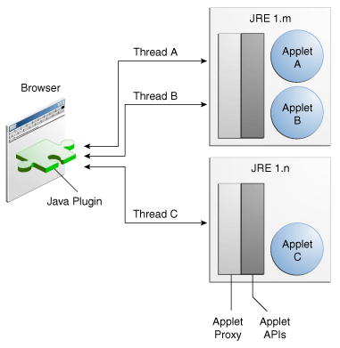

# Applet 的执行环境

> 原文： [https://docs.oracle.com/javase/tutorial/deployment/applet/appletExecutionEnv.html](https://docs.oracle.com/javase/tutorial/deployment/applet/appletExecutionEnv.html)

Java applet 在浏览器的上下文中运行。浏览器中的 Java Plug-in 软件控制 Java applet 的启动和执行。浏览器还有一个 JavaScript 解释器，它在网页上运行 JavaScript 代码。本主题描述了 Java Platform，Standard Edition 6 update 10 中发布的 Java Plug-in 软件的行为。

## Java 插件

Java Plug-in 软件为每个 Java applet 创建一个工作线程。它在 Java Runtime Environment（JRE）软件的实例中启动 applet。通常，所有 applet 都在 JRE 的同一个实例中运行。在以下情况下，Java Plug-in 软件启动 JRE 的新实例：

*   当 applet 请求在特定版本的 JRE 中执行时。
*   当 applet 指定自己的 JRE 启动参数时，例如堆大小。如果新 applet 的要求是现有 JRE 的子集，则新 applet 使用现有 JRE，否则，将启动新的 JRE 实例。

如果满足以下条件，applet 将在现有 JRE 中运行：

*   applet 所需的 JRE 版本与现有 JRE 匹配。
*   JRE 的启动参数满足 applet 的要求。

下图显示了如何在 JRE 中执行 applet。

## Java 插件和 JavaScript 解释器交互

Java applet 可以调用 Web 页面中存在的 JavaScript 函数。 JavaScript 函数也允许调用嵌入在同一网页上的 applet 的方法。 Java Plug-in 软件和 JavaScript 解释器协调从 Java 代码到 JavaScript 代码的调用以及从 JavaScript 代码到 Java 代码的调用。

Java Plug-in 软件是多线程的，而 JavaScript 解释器在单个线程上运行。因此，为了避免与线程相关的问题，特别是当多个 applet 同时运行时，保持 Java 代码和 JavaScript 代码之间的调用较短，并尽可能避免往返。请参阅以下主题以了解有关 Java 代码和 JavaScript 代码之间的交互的更多信息：

*   [从小程序调用 JavaScript 代码](../applet/invokingJavaScriptFromApplet.html)
*   [从 JavaScript 代码](../applet/invokingAppletMethodsFromJavaScript.html)调用 Applet 方法