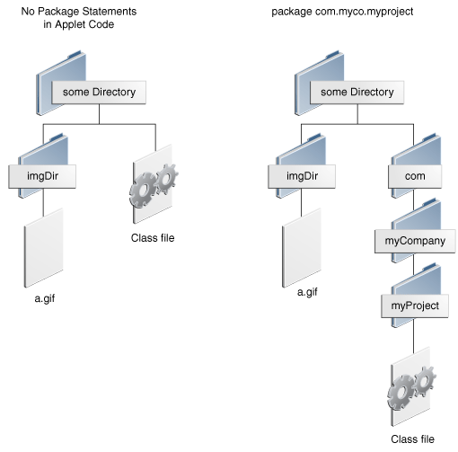

# 查找和加载数据文件

> 原文： [https://docs.oracle.com/javase/tutorial/deployment/applet/data.html](https://docs.oracle.com/javase/tutorial/deployment/applet/data.html)

每当 Java applet 需要从使用相对 URL（未完全指定文件位置的 URL）指定的文件加载数据时，applet 通常使用代码库或文档库来形成完整的 URL。

由`JApplet` `getCodeBase`方法返回的代码库是一个 URL，它指定从中加载 applet 类的目录。对于本地部署的 applet，`getCodeBase`方法返回 null。

由`JApplet` `getDocumentBase`方法返回的文档库指定包含 applet 的 HTML 页面的目录。对于本地部署的 applet，`getDocumentBase`方法返回 null。

除非`&lt;applet&gt;`标记指定代码库，否则代码库和文档库都指向同一服务器上的同一目录。

applet 可能需要或需要依赖的数据作为备份通常是相对于代码库指定的。 applet 开发人员通常使用参数指定的数据通常是相对于文档库指定的。

* * *

**Note:** For security reasons, browsers limit the URLs from which untrusted applets can read. For example, most browsers don't allow untrusted applets to use ".." to access directories above the code base or document base. Also, because untrusted applets cannot read files except for those files on the applet's originating host, the document base is generally not useful if the document and the untrusted applet reside on different servers.

* * *

`JApplet`类定义了方便的图像加载形式和声音加载方法，使您可以指定相对于基本 URL 的图像和声音。例如，假设使用下图所示的目录结构之一设置 applet。



要创建使用`imgDir`下的`a.gif`图像文件的`Image`对象，applet 可以使用以下代码：

```
Image image = getImage(getCodeBase(), "imgDir/a.gif");

```