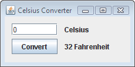

# 课程：使用 NetBeans IDE 学习 Swing

> 原文： [https://docs.oracle.com/javase/tutorial/uiswing/learn/index.html](https://docs.oracle.com/javase/tutorial/uiswing/learn/index.html)

[Examples Index](../examples/learn/index.html)

本课程介绍了使用 Swing 和 NetBeans IDE 进行的图形用户界面（GUI）编程。正如你在[“Hello World！”中学到的那样。](../../getStarted/cupojava/netbeans.html) 课程，NetBeans IDE 是一个免费的，开源的，跨平台的集成开发环境，内置了对 Java 编程语言的支持。与使用文本编辑器编码相比，它具有许多优点;我们建议尽可能使用它。如果您还没有阅读上述课程，请花一点时间来完成。它提供了有关下载和安装 JDK 和 NetBeans IDE 的重要信息。

本课程的目标是通过设计一个将温度从摄氏温度转换为华氏温度的简单应用程序来介绍 Swing API。它的 GUI 将是基本的，仅关注可用 Swing 组件的一部分。我们将使用 NetBeans IDE GUI 构建器，这使得用户界面创建变得简单，只需拖放即可。它的自动代码生成功能简化了 GUI 开发过程，让您专注于应用程序逻辑而不是底层基础架构。

由于本课程是要采取的特定操作的逐步检查表，因此我们建议您在阅读时运行 NetBeans IDE 并执行每个步骤。这将是开始使用 Swing 编程的最快捷，最简单的方法。如果您无法这样做，只需阅读它仍然有用，因为每个步骤都用截图说明。

如果您更喜欢手动编程每个组件的传统方法（无需 IDE 的帮助），请将本课程视为本教程其他地方已经提供的较低级别讨论的切入点。如果您希望了解这些较低级别的详细信息，每次讨论中的超链接将带您进入相关课程。

此应用程序的完成 GUI 将如下所示：

CelsiusConverter 应用程序。

单击“启动”按钮以使用 [Java™Web Start](http://www.oracle.com/technetwork/java/javase/javawebstart/index.html) （[下载 JDK 7 或更高版本](http://www.oracle.com/technetwork/java/javase/downloads/index.html)）运行 CelsiusConverter。或者，要自己编译并运行示例，请参考[示例索引](../examples/learn/index.html#CelsiusConverter)。

从最终用户的角度来看，使用很简单：在文本框中输入温度（以摄氏度为单位），单击“转换”按钮，然后在屏幕上显示转换后的温度（华氏温度）。最小化，最大化和关闭按钮将按预期运行，并且应用程序还将具有显示在窗口顶部的标题。

从程序员的角度来看，我们将在两个主要阶段编写应用程序。首先，我们将使用各种 Swing 组件填充 GUI，并如上所示进行排列。然后，我们将添加应用程序逻辑，以便程序在用户按下“转换”按钮时实际执行转换。

如果您对使用 JavaFX 创建 GUI 感兴趣，请参阅 [JavaFX 文档](https://docs.oracle.com/javase/8/javase-clienttechnologies.htm)和 [JavaFX - NetBeans Wiki](http://wiki.netbeans.org/JavaFX) 。