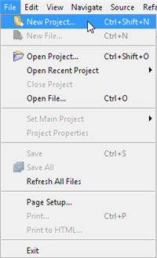
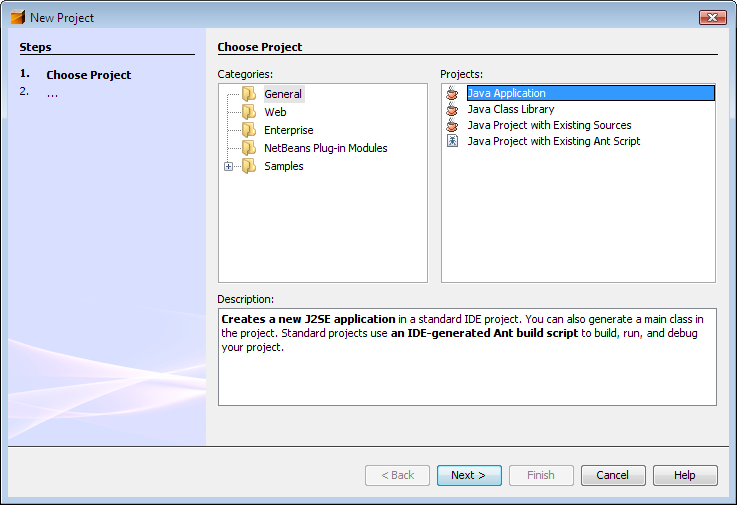
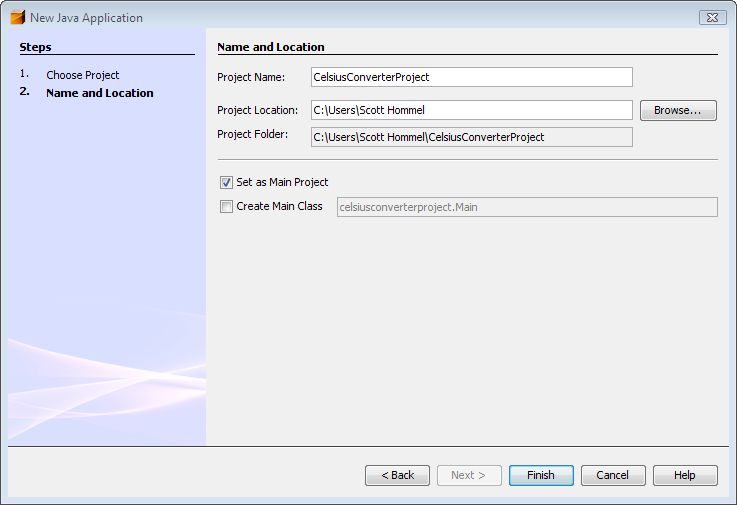
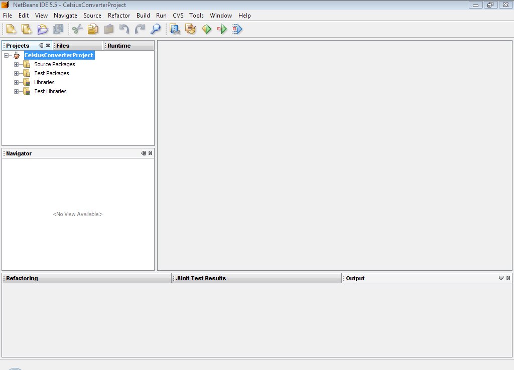
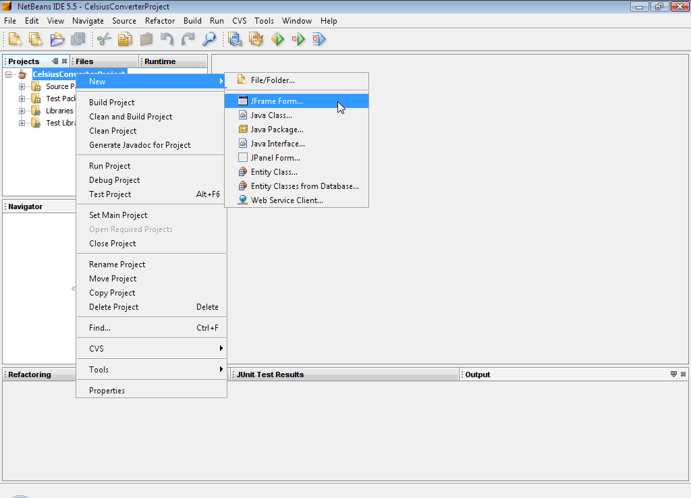
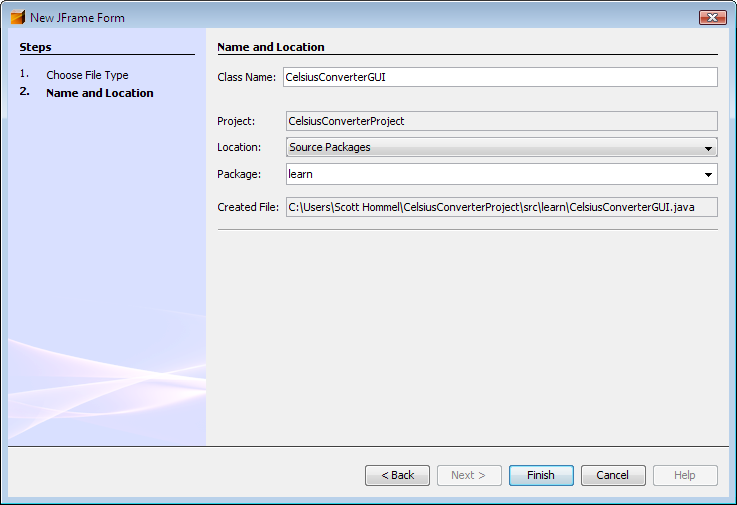
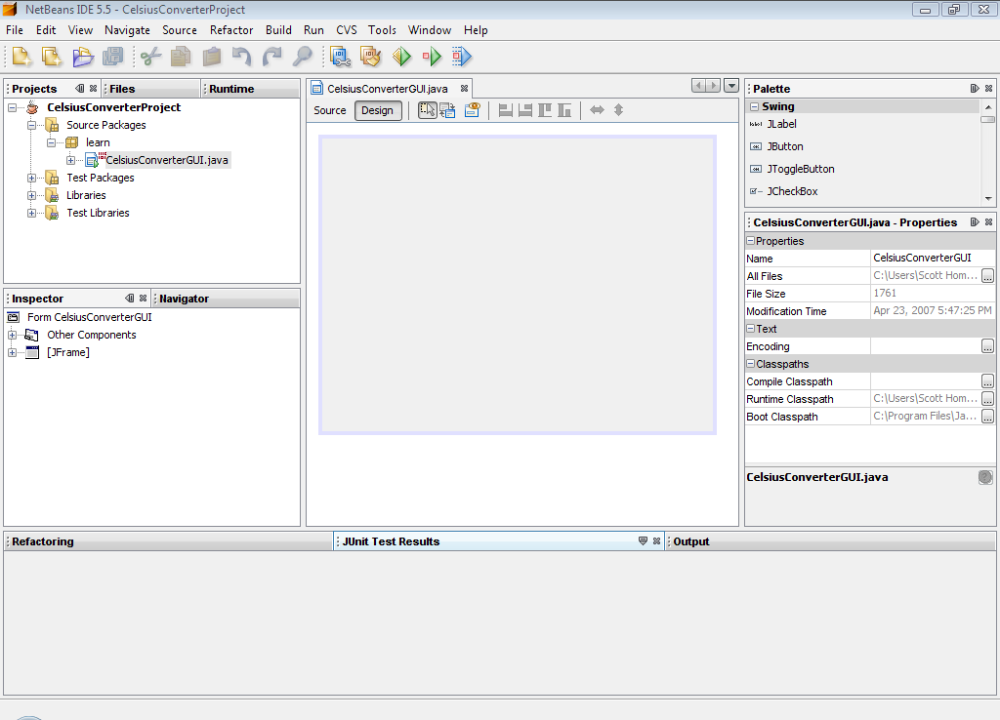

# 设置 CelsiusConverter 项目

> 原文： [https://docs.oracle.com/javase/tutorial/uiswing/learn/settingup.html](https://docs.oracle.com/javase/tutorial/uiswing/learn/settingup.html)

如果您以前使用过 NetBeans IDE，那么本节的大部分内容都会很熟悉，因为大多数项目的初始步骤都相似。但是，以下步骤描述了特定于此应用程序的设置，因此请务必密切关注它们。

## 第 1 步：创建一个新项目

要创建新项目，请启动 NetBeans IDE 并从“文件”菜单中选择“新建项目”：

创建一个新项目

每个命令的键盘快捷键显示在每个菜单项的最右侧。 NetBeans IDE 的外观可能因平台而异，但功能将保持不变。

## 第 2 步：选择常规 - &gt; Java 应用程序

接下来，从 Categories 列中选择 General，从 Projects 列中选择 Java Application：

_This figure has been reduced to fit on the page.
Click the image to view it at its natural size._

您可能会在说明窗格中注意到“J2SE”的提及;这就是现在所谓的“Java SE”平台的旧名称。按下标有“下一步”的按钮继续。

## 第 3 步：设置项目名称

现在输入“CelsiusConverterProject”作为项目名称。您可以将“项目位置”和“项目文件夹”字段设置为其默认值，或单击“浏览”按钮以选择系统上的备用位置。

_This figure has been reduced to fit on the page.
Click the image to view it at its natural size._

确保取消选中“创建主类”复选框;选中此选项会生成一个新类作为应用程序的主入口点，但是我们的主 GUI 窗口（在下一步中创建）将用于此目的，因此不必选中此框。完成后单击“完成”按钮。

_This figure has been reduced to fit on the page.
Click the image to view it at its natural size._

IDE 完成加载后，您将看到类似于上面的屏幕。除左上角的“项目”窗格（显示新创建的项目）外，所有窗格都将为空。

## 第 4 步：添加 JFrame 表单

_This figure has been reduced to fit on the page.
Click the image to view it at its natural size._

现在，右键单击 CelsiusConverterProject 名称，然后选择 New - &gt; JFrame 表单（`JFrame`是负责应用程序主框架的 Swing 类。）您将学习如何在本课程后面将此类指定为应用程序的入口点。

## 第 5 步：命名 GUI 类

接下来，键入`CelsiusConverterGUI`作为类名，并将`learn`作为包名称。您实际上可以将此包命名为您想要的任何名称，但在此我们遵循教程约定，即在其所在的课程之后命名该包。

_This figure has been reduced to fit on the page.
Click the image to view it at its natural size._

如上所示，其余字段应自动填写。完成后单击“完成”按钮。

_This figure has been reduced to fit on the page.
Click the image to view it at its natural size._

IDE 完成加载后，右侧窗格将显示`CelsiusConverterGUI`的设计时图形视图。在此屏幕上，您将可视地拖放，操作各种 Swing 组件。