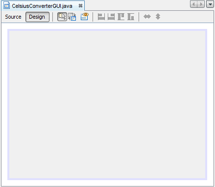
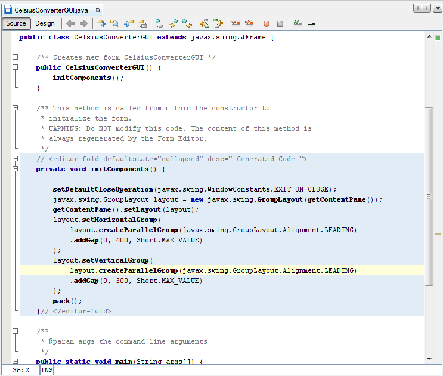
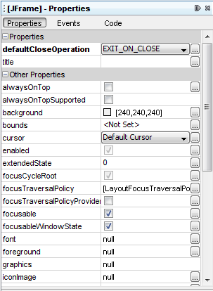
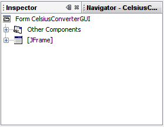

# NetBeans IDE 基础知识

> 原文： [https://docs.oracle.com/javase/tutorial/uiswing/learn/netbeansbasics.html](https://docs.oracle.com/javase/tutorial/uiswing/learn/netbeansbasics.html)

在探索其 GUI 创建功能之前，没有必要了解 NetBeans IDE 的每个功能。事实上，你真正需要了解的唯一功能是 _Palette_ ，_ 设计区 _，_ 属性编辑器 _ 和 _Inspector_ ]。我们将在下面讨论这些功能。

## 调色板

Palette 包含 Swing API 提供的所有组件。您可能已经猜到了许多这些组件的用途，即使这是您第一次使用它们（`JLabel`是文本标签，`JList`是下拉列表等）

_This figure has been reduced to fit on the page.
Click the image to view it at its natural size._

从该列表中，我们的应用程序将仅使用`JLabel`（基本文本标签），`JTextField`（用户输入温度）和`JButton`（将温度从摄氏温度转换为华氏温度。）

## 设计区域

设计区域是您可视化构建 GUI 的地方。它有两个视图：_ 源视图 _ 和 _ 设计视图 _。设计视图是默认设置，如下所示。您可以通过单击各自的选项卡随时在视图之间切换。

_This figure has been reduced to fit on the page.
Click the image to view it at its natural size._

上图显示了一个`JFrame`对象，由带有蓝色边框的大阴影矩形表示。通常预期的行为（例如当用户单击“关闭”按钮时退出）由 IDE 自动生成，并出现在源视图中，在不可编辑的蓝色代码块 _ 保护块 _ 之间。

_This figure has been reduced to fit on the page.
Click the image to view it at its natural size._

快速浏览源视图可以看出 IDE 已经创建了一个名为`initComponents`的私有方法，它初始化了 GUI 的各个组件。它还告诉应用程序“关闭时退出”，执行一些特定于布局的任务，然后将（即将添加的）组件打包在屏幕上。

不要觉得你需要详细了解这些代码;我们在这里提到它只是为了探索源选项卡。有关这些组件的更多信息，请参阅：

[如何制作帧（主窗口）](../components/frame.html)和[在容器中布置组件](../layout/index.html)。

## 属性编辑器

Property Editor 执行其名称所暗示的内容：它允许您编辑每个组件的属性。属性编辑器直观易用;在其中，您将看到一系列行 - 每个属性一行 - 您可以单击和编辑而无需直接输入源代码。下图显示了新添加的`JFrame`对象的属性编辑器：

_This figure has been reduced to fit on the page.
Click the image to view it at its natural size._

上面的屏幕截图显示了此对象的各种属性，例如背景颜色，前景色，字体和光标。

## 检查员

我们将在本课中使用的 NetBeans IDE 的最后一个组件是 Inspector：

检查员

Inspector 提供应用程序组件的图形表示。我们将仅使用 Inspector 一次，将一些变量名称更改为默认值以外的名称。