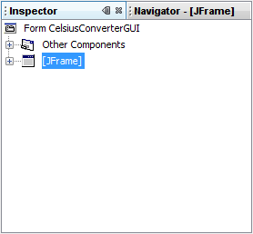
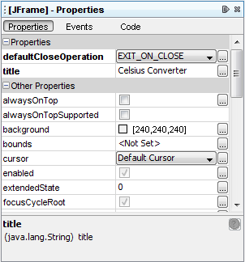
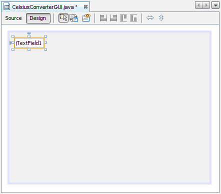
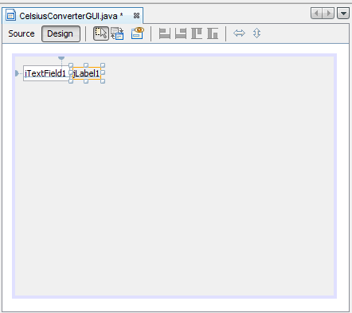
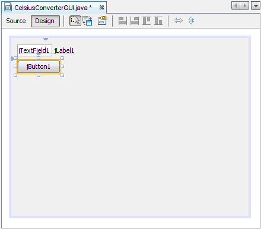
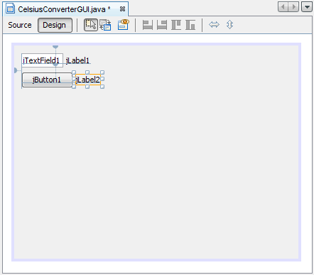

# 创建 CelsiusConverter GUI

> 原文： [https://docs.oracle.com/javase/tutorial/uiswing/learn/creatinggui.html](https://docs.oracle.com/javase/tutorial/uiswing/learn/creatinggui.html)

本节介绍如何使用 NetBeans IDE 创建应用程序的 GUI。将每个组件从 Palette 拖动到 Design Area 时，IDE 会自动生成相应的源代码。

## 第 1 步：设置标题

首先，通过单击检查器中的`JFrame`，将应用程序的`JFrame`标题设置为“Celsius Converter”：

选择 JFrame

然后，使用属性编辑器设置其标题：

设置标题

您可以通过双击 title 属性并直接输入新文本，或单击按钮并在提供的字段中输入标题来设置标题。或者，作为快捷方式，您可以单击检查器的`JFrame`并直接输入其新文本，而无需使用属性编辑器。 

## 第 2 步：添加 JTextField

接下来，将`JTextField`从 Palette 拖动到 Design Area 的左上角。当您接近左上角时，GUI 构建器提供暗示适当间距的视觉提示（虚线）。使用这些提示作为指导，将`JTextField`拖放到窗口的左上角，如下所示：

添加 JTextField

您可能想要删除默认文本“JTextField1”，但暂时将其保留到位。我们将在本课程后面更换它，因为我们对每个组件进行了最终调整。有关此组件的更多信息，请参见[如何使用文本字段](../components/textfield.html)。

## 第 3 步：添加 JLabel

接下来，将`JLabel`拖到设计区域上。将它放在`JTextField`的右侧，再次观察提示适当间距的视觉提示。确保此组件的文本库与`JTextField`的文本库对齐。 IDE 提供的视觉提示应该可以轻松确定。

添加 JLabel

有关此组件的更多信息，请参阅[如何使用标签](../components/label.html)。

## 第 4 步：添加 JButton

接下来，从调色板中拖动`JButton`并将其放置在`JTextField`下方的左侧和下方。同样，视觉提示有助于将其引导到位。

添加 JButton

您可能想要手动调整`JButton`和`JTextField`的宽度，但现在就保持原样。您将在本课程后面学习如何正确调整这些组件。有关此组件的更多信息，请参阅[如何使用按钮](../components/button.html)。

## 第 5 步：添加第二个 JLabel

添加第二个 JLabel

最后，添加第二个`JLabel`，重复步骤 2 中的过程。将第二个标签放在`JButton`的右侧，如上所示。