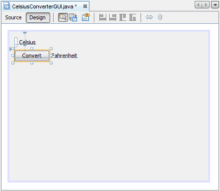
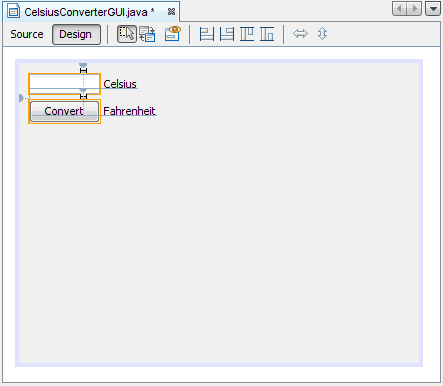
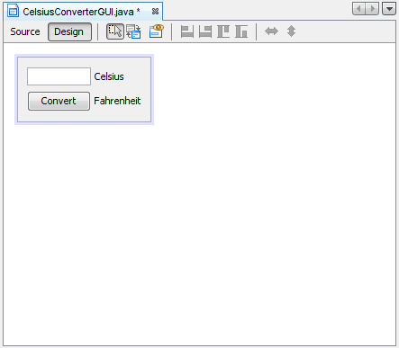
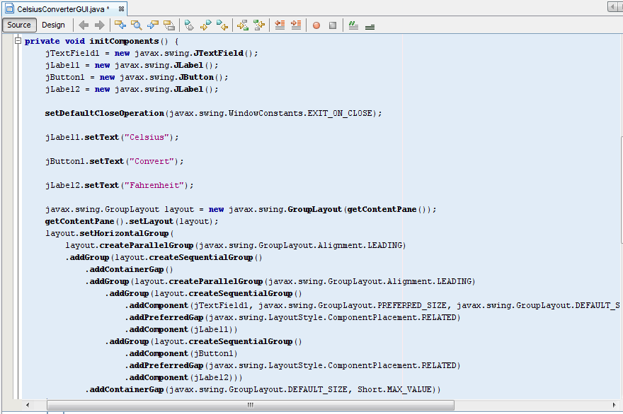

# 调整 CelsiusConverter GUI

> 原文： [https://docs.oracle.com/javase/tutorial/uiswing/learn/adjustinggui.html](https://docs.oracle.com/javase/tutorial/uiswing/learn/adjustinggui.html)

现在有 GUI 组件，是时候进行最后的调整了。有几种不同的方法可以做到这一点;这里建议的顺序只是一种可能的方法。

## 第 1 步：设置组件文本

首先，双击`JTextField`和`JButton`以更改 IDE 插入的默认文本。从`JTextField`中删除文本时，它将缩小尺寸，如下所示。将`JButton`的文本从“JButton1”更改为“转换”。同时将顶部`JLabel`文本更改为“Celsius”，将底部更改为“Fahrenheit”。

设置组件文本

## 第 2 步：设置组件大小

接下来，按住 Shift 键并单击`JTextField`和`JButton`组件。这将突出显示它们被选中的每一个。右键单击（对于 mac 用户，按住 Control 键并单击）相同大小 - &gt;相同的宽度。现在组件的宽度相同，如下所示。执行此步骤时，请确保未选择`JFrame`本身。如果是，则“相同大小”菜单将不会处于活动状态。

设置 JTextField 和 JButton 大小

## 第 3 步：删除额外空间

最后，抓住`JFrame`的右下角并调整其大小以消除任何额外的空白。请注意，如果消除所有额外空间（如下所示），标题（仅在运行时出现）可能无法完全显示。最终用户可以根据需要自由调整应用程序的大小，但您可能需要在右侧留出一些额外的空间以确保一切正确。进行实验，并使用完成的 GUI 的屏幕截图作为指导。

完成的 GUI

此应用程序的 GUI 部分现已完成！如果 NetBeans IDE 已完成其工作，您应该感觉创建此 GUI 是一项简单的（如果不是微不足道的）任务。但是花一点时间点击源选项卡;您可能会对生成的代码量感到惊讶。

_This figure has been reduced to fit on the page.
Click the image to view it at its natural size._

要完整查看代码，请根据需要在 IDE 中向上和向下滚动。您可以通过单击源编辑器左侧的+或 - 符号来展开或折叠某些代码块（例如方法体）。