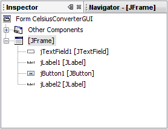
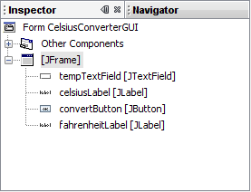
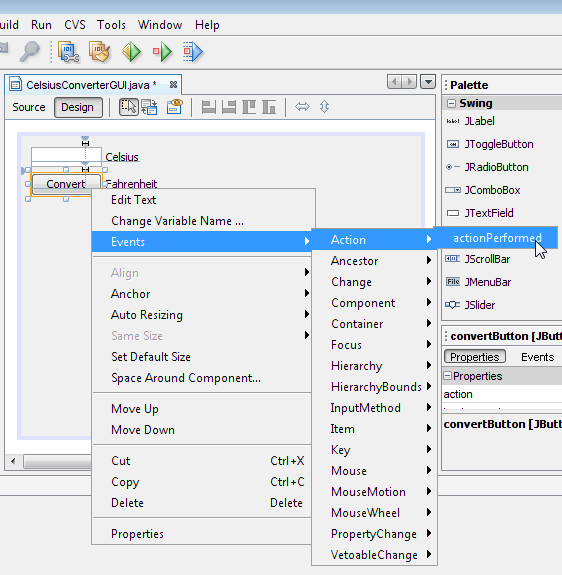
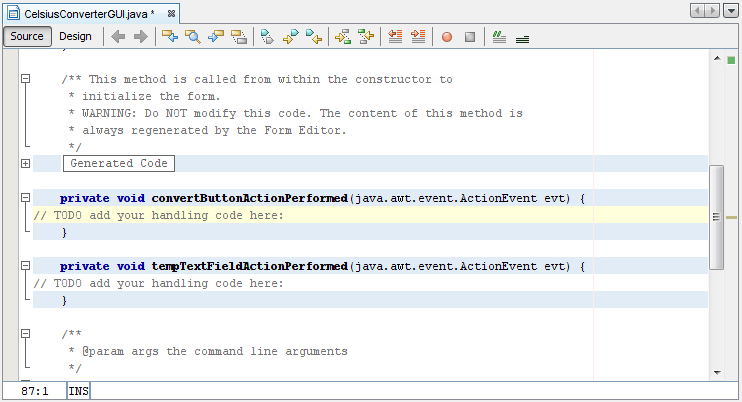
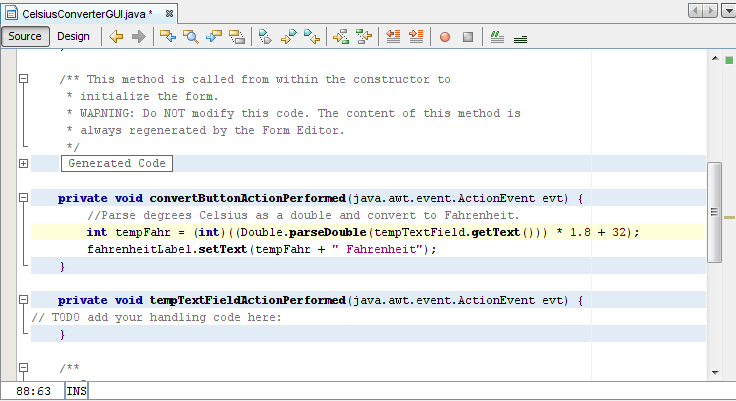

# 添加应用程序逻辑

> 原文： [https://docs.oracle.com/javase/tutorial/uiswing/learn/logic.html](https://docs.oracle.com/javase/tutorial/uiswing/learn/logic.html)

现在是时候添加应用程序逻辑了。

## 第 1 步：更改默认变量名称

下图显示了当前在 Inspector 中显示的默认变量名称。对于每个组件，首先显示变量名称，然后是方括号中对象的类型。例如，`jTextField1 [JTextField]`表示“jTextField1”是变量名称，“JTextField”是其类型。



默认变量名称


默认名称在此应用程序的上下文中不是非常相关，因此将它们从默认值更改为更有意义的内容是有意义的。右键单击每个变量名称，然后选择“更改变量名称”。完成后，变量名称应如下所示：



新变量名称


新的变量名称是“tempTextField”，“celsiusLabel”，“convertButton”和“fahrenheitLabel”。您在 Inspector 中进行的每项更改都将自动传播回源代码。你可以放心，由于这种性质的拼写错误或错误，编译不会失败 - 手工编辑时常见的错误。

## 第 2 步：注册事件监听器

当最终用户与 Swing GUI 组件交互时（例如单击 Convert 按钮），该组件将生成一种特殊类型的对象 - 称为 _ 事件对象 _ - 然后它将广播到任何其他对象以前已经为该事件注册为 _ 听众 _。 NetBeans IDE 使事件监听器注册变得非常简单：

[](https://docs.oracle.com/javase/tutorial/figures/uiswing/learn/nb-swing-22.png)
_This figure has been reduced to fit on the page.
Click the image to view it at its natural size._

在“设计区域”中，单击“转换”按钮将其选中。确保仅选择转换按钮（如果同时选择了 JFrame 本身，则此步骤将不起作用。）右键单击转换按钮并选择事件 - &gt;行动 - &gt;的 actionPerformed。这将生成所需的事件处理代码，为您提供空的方法体，在其中添加您自己的功能：

[](https://docs.oracle.com/javase/tutorial/figures/uiswing/learn/nb-swing-23.png)
_This figure has been reduced to fit on the page.
Click the image to view it at its natural size._

有许多不同的事件类型表示最终用户可以采取的各种操作（单击鼠标触发一种类型的事件，键盘键入触发另一种，将鼠标移动另一种，等等。）我们的应用程序是只关注 ActionEvent;有关事件处理的更多信息，请参阅[编写事件监听器](../events/index.html)。

## 第 3 步：添加温度转换代码

最后一步是简单地将温度转换代码粘贴到空方法体中。以下代码是将温度从摄氏温度转换为华氏温度所需的全部代码：

* * *

**Note:** 

此示例不可本地化，因为`parseDouble`方法不可本地化。此代码段仅供参考。更强大的实现将使用 [Scanner](https://docs.oracle.com/javase/8/docs/api/java/util/Scanner.html) 类来解析用户输入。

* * *

```
    //Parse degrees Celsius as a double and convert to Fahrenheit.
    int tempFahr = (int)((Double.parseDouble(tempTextField.getText()))
            * 1.8 + 32);
    fahrenheitLabel.setText(tempFahr + " Fahrenheit");

```

只需复制此代码并将其粘贴到 convertButtonActionPerformed 方法中，如下所示：

[](https://docs.oracle.com/javase/tutorial/figures/uiswing/learn/nb-swing-24.png)
_This figure has been reduced to fit on the page.
Click the image to view it at its natural size._

有了转换代码，应用程序现已完成。

## 第 4 步：运行应用程序

运行应用程序只需选择 Run - &gt;在 NetBeans IDE 中运行主项目。第一次运行此应用程序时，系统将提示您一个对话框，要求将`CelsiusConverterGUI`设置为此项目的主类。单击“确定”按钮，当程序完成编译时，您应该看到应用程序在其自己的窗口中运行。

恭喜！您已完成第一个 Swing 应用程序！