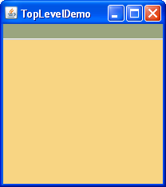
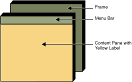
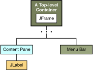
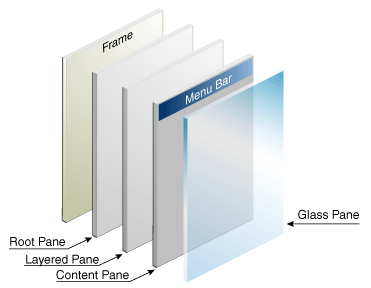

# 使用顶级容器

> 原文： [https://docs.oracle.com/javase/tutorial/uiswing/components/toplevel.html](https://docs.oracle.com/javase/tutorial/uiswing/components/toplevel.html)

正如我们之前提到的，Swing 提供了三种通常有用的顶级容器类： [`JFrame`](frame.html) ， [`JDialog`](dialog.html) 和 [`JApplet`](applet.html) 。使用这些类时，您应该牢记以下事实：

*   要在屏幕上显示，每个 GUI 组件必须是 _ 包含层次结构 _ 的一部分。包含层次结构是一个组件树，其顶层容器作为其根。我们会向您展示一个。
*   每个 GUI 组件只能包含一次。如果组件已经在容器中并且您尝试将其添加到另一个容器，则该组件将从第一个容器中删除，然后添加到第二个容器中。
*   每个顶级容器都有一个内容窗格，一般来说，它包含（直接或间接）该顶级容器 GUI 中的可见组件。
*   您可以选择将菜单栏添加到顶级容器。按照惯例，菜单栏位于顶级容器内，但位于内容窗格之外。一些外观和感觉，例如 Mac OS 的外观和感觉，让您可以选择将菜单栏放在更适合外观的另一个地方，例如屏幕顶部。

* * *

**Note:** Although [`JInternalFrame`](internalframe.html) mimics `JFrame`, internal frames aren't actually top-level containers.

* * *

这是应用程序创建的框架的图片。该框架包含一个绿色菜单栏（没有菜单），并在框架的内容窗格中包含一个大的空白黄色标签。








您可以在 [`TopLevelDemo.java`](../examples/components/TopLevelDemoProject/src/components/TopLevelDemo.java) 中找到此示例的完整源代码。虽然该示例在独立应用程序中使用`JFrame`，但相同的概念适用于`JApplet`和`JDialog`。

这是此示例的 GUI 的包含层次结构：



正如省略号所暗示的那样，我们在此图中留下了一些细节。我们稍后会透露缺失的细节。以下是本节讨论的主题：

*   [顶级容器和遏制层次结构](#general)
*   [向内容窗格添加组件](#contentpane)
*   [添加菜单栏](#menubar)
*   [根窗格（a.k.a. The Missing Details）](#rootpane)

使用 Swing 组件的每个程序至少有一个顶级容器。此顶级容器是包含层次结构的根 - 包含显示在顶级容器内的所有 Swing 组件的层次结构。

通常，具有基于 Swing 的 GUI 的独立应用程序至少有一个以`JFrame`为根的包含层次结构。例如，如果应用程序具有一个主窗口和两个对话框，则该应用程序具有三个包含层次结构，因此具有三个顶级容器。一个包含层次结构以`JFrame`为根，其他两个包含`JDialog`对象作为根。

基于 Swing 的 applet 至少有一个包含层次结构，其中一个包含`JApplet`对象。例如，调出对话框的 applet 有两个包含层次结构。浏览器窗口中的组件位于以`JApplet`对象为根的包含层次结构中。该对话框具有以`JDialog`对象为根的包含层次结构。

这是前面的示例用于获取框架内容窗格并向其添加黄色标签的代码：

```
frame.getContentPane().add(yellowLabel, BorderLayout.CENTER);

```

如代码所示，您可以通过调用`getContentPane`方法找到顶级容器的内容窗格。默认内容窗格是一个简单的中间容器，它继承自`JComponent`，并使用`BorderLayout`作为其布局管理器。

例如，可以轻松自定义内容窗格 - 设置布局管理器或添加边框。然而，有一个小问题。 `getContentPane`方法返回`Container`对象，而不是`JComponent`对象。这意味着如果要利用内容窗格的`JComponent`功能，则需要对返回值进行类型转换，或者创建自己的组件作为内容窗格。我们的例子通常采用第二种方法，因为它有点清洁。我们有时采用的另一种方法是简单地将自定义组件添加到内容窗格，完全覆盖内容窗格。

注意`JPanel`的默认布局管理器是`FlowLayout`;你可能想要改变它。

要使组件成为内容窗格，请使用顶级容器的`setContentPane`方法。例如：

```
//Create a panel and add components to it.
JPanel contentPane = new JPanel(new BorderLayout());
contentPane.setBorder(someBorder);
contentPane.add(someComponent, BorderLayout.CENTER);
contentPane.add(anotherComponent, BorderLayout.PAGE_END);

topLevelContainer.setContentPane(contentPane);

```

* * *

**Note:** 

为方便起见，`add`方法及其变体`remove`和`setLayout`已被覆盖，以便在必要时转发到`contentPane`。这意味着你可以写

```
frame.add(child);

```

并且孩子将被添加到`contentPane.`

注意，只有这三种方法才能这样做。这意味着`getLayout()`不会返回使用`setLayout()`设置的布局。

* * *

理论上，所有顶级容器都可以容纳菜单栏。但实际上，菜单栏通常只出现在框架和小程序中。要将菜单栏添加到顶级容器，请创建`JMenuBar`对象，使用菜单填充它，然后调用`setJMenuBar`。 `TopLevelDemo`使用以下代码在其框架中添加一个菜单栏：

```
frame.setJMenuBar(greenMenuBar);

```

有关实现菜单和菜单栏的更多信息，请参阅[如何使用菜单](menu.html)。

每个顶级容器都依赖于一个名为 _ 根窗格 _ 的隐藏中间容器。根窗格管理内容窗格和菜单栏以及其他几个容器。您通常不需要了解根窗格来使用 Swing 组件。但是，如果您需要拦截鼠标点击或绘制多个组件，您应该熟悉根窗格。

以下是根窗格为框架（以及每个其他顶级容器）提供的组件列表：



我们已经告诉过您内容窗格和可选菜单栏。根窗格添加的另外两个组件是分层窗格和玻璃窗格。分层窗格包含菜单栏和内容窗格，并启用其他组件的 Z 顺序。玻璃窗格通常用于拦截顶层容器上发生的输入事件，也可用于绘制多个组件。

有关更多详细信息，请参阅[如何使用根窗格](rootpane.html)。