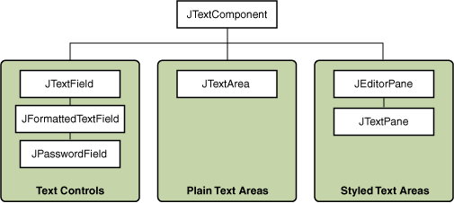
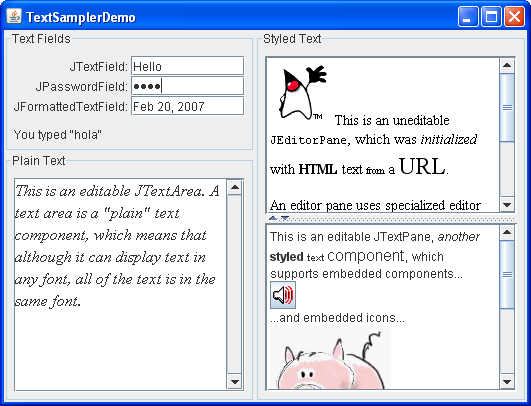

# 使用文本组件

> 原文： [https://docs.oracle.com/javase/tutorial/uiswing/components/text.html](https://docs.oracle.com/javase/tutorial/uiswing/components/text.html)

本节提供使用 Swing 文本组件时可能需要的背景信息。如果您打算使用无样式的文本组件 - [文本字段](textfield.html)，[密码字段](passwordfield.html)，[格式化文本字段](formattedtextfield.html)或[文本区域](textarea.html) - 去到其操作方法页面并仅在必要时返回此处。如果您打算使用样式化文本组件，请参阅[如何使用编辑器窗格和文本窗格](editorpane.html)，并阅读本节。如果您不知道需要哪个组件，请继续阅读。

Swing 文本组件显示文本，并可选择允许用户编辑文本。程序需要用于任务的文本组件，范围从简单（输入单词并按 Enter）到复杂（显示和编辑带有亚洲语言嵌入图像的样式文本）。

Swing 提供了六个文本组件，以及支持类和接口，甚至可以满足最复杂的文本要求。尽管它们的用途和功能各不相同，但所有 Swing 文本组件都继承自同一个超类 [`JTextComponent`](https://docs.oracle.com/javase/8/docs/api/javax/swing/text/JTextComponent.html) ，它为文本操作提供了高度可配置和强大的基础。

下图显示了`JTextComponent`层次结构。

下图显示了一个名为`TextSamplerDemo`的应用程序，它使用每个 Swing 文本组件。

* * *

**Try this:** 

1.  单击“启动”按钮以使用 [Java™Web Start](http://www.oracle.com/technetwork/java/javase/javawebstart/index.html) （[下载 JDK 7 或更高版本](http://www.oracle.com/technetwork/java/javase/downloads/index.html)）运行 TextSamplerDemo。或者，要自己编译并运行示例，请参考[示例索引](../examples/components/index.html#TextSamplerDemo)。  

2.  在文本字段中键入一些文本，然后按 Enter 键。在密码字段中执行相同操作。按 Enter 键时，字段下方的标签会更新。
3.  尝试在格式化文本字段中输入有效和无效日期。请注意，按 Enter 键时，仅当日期有效时，才会更新字段下方的标签。
4.  在文本区域和文本窗格中选择和编辑文本。使用键盘绑定，Ctrl-X，Ctrl-C 和 Ctrl-V 分别剪切，复制和粘贴文本。
5.  尝试编辑编辑器窗格中的文本，该文本已通过调用`setEditable`而无法编辑。
6.  查看文本窗格以查找嵌入式组件和嵌入式图标的示例。

* * *

`TextSamplerDemo`示例以非常基本的方式使用文本组件。下表详细介绍了您可以对每种文本组件执行的操作。

| 组 | 描述 | Swing Classes |
| --- | --- | --- |
| 文字控件 | 简称为文本字段，文本控件只能显示一行可编辑文本。像按钮一样，它们会生成动作事件。使用它们从用户处获取少量文本信息，并在文本输入完成后执行操作。 | [`JTextField`](https://docs.oracle.com/javase/8/docs/api/javax/swing/JTextField.html) 及其亚类 [`JPasswordField`](https://docs.oracle.com/javase/8/docs/api/javax/swing/JPasswordField.html) 和 [`JFormattedTextField`](https://docs.oracle.com/javase/8/docs/api/javax/swing/JFormattedTextField.html) |
| --- | --- | --- |
| 纯文本区域 | `JTextArea`可以显示多行可编辑文本。尽管文本区域可以以任何字体显示文本，但所有文本都使用相同的字体。使用文本区域允许用户输入任何长度的无格式文本或显示未格式化的帮助信息。 | [`JTextArea`](https://docs.oracle.com/javase/8/docs/api/javax/swing/JTextArea.html) |
| --- | --- | --- |
| 样式文本区域 | A styled text component can display editable text using more than one font. Some styled text components allow embedded images and even embedded components. Styled text components are powerful and multi-faceted components suitable for high-end needs, and offer more avenues for customization than the other text components.因为它们非常强大和灵活，所以样式化的文本组件通常需要更多的初始编程来设置和使用。一个例外是编辑器窗格可以轻松地从 URL 加载格式化文本，这使它们可用于显示不可编辑的帮助信息。 | [`JEditorPane`](https://docs.oracle.com/javase/8/docs/api/javax/swing/JEditorPane.html)
及其亚类
[`JTextPane`](https://docs.oracle.com/javase/8/docs/api/javax/swing/JTextPane.html) |
| --- | --- | --- |

本教程提供了有关`JTextComponent`类奠定的基础的信息，并告诉您如何完成一些常见的文本相关任务。

要了解有关 JavaFX 中文本组件的更多信息，请参阅[在 JavaFX 中使用文本和文本效果](https://docs.oracle.com/javase/8/javafx/user-interface-tutorial/text.htm)和[使用 JavaFX UI 控件：文本字段](https://docs.oracle.com/javase/8/javafx/user-interface-tutorial/text-field.htm)教程。