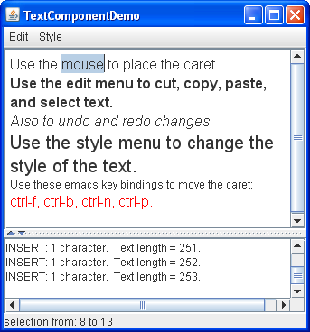
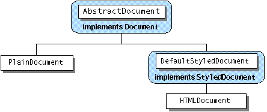

# 文本组件功能

> 原文： [https://docs.oracle.com/javase/tutorial/uiswing/components/generaltext.html](https://docs.oracle.com/javase/tutorial/uiswing/components/generaltext.html)

[`JTextComponent`](https://docs.oracle.com/javase/8/docs/api/javax/swing/text/JTextComponent.html) 类是 Swing 文本组件的基础。此类为其所有后代提供以下可自定义的功能：

*   一种称为 _ 文档 _ 的模型，用于管理组件的内容。
*   一个视图，在屏幕上显示组件。
*   一种称为 _ 编辑器套件 _ 的控制器，可以通过[动作](../misc/action.html)读取和写入文本并实现编辑功能。
*   支持无限撤消和重做。
*   可插入的插入符号和对插入符号的支持更改了监听器和导航过滤器。

请参阅名为`TextComponentDemo`的示例以探索这些功能。虽然`TextComponentDemo`示例包含`JTextPane`的自定义实例，但本节中讨论的功能由所有`JTextComponent`子类继承。



上部文本组件是自定义文本窗格。下部文本组件是`JTextArea`的实例，它用作报告对文本窗格内容所做的所有更改的日志。窗口底部的状态行报告选择的位置或插入符号的位置，具体取决于是否选择了文本。

* * *

**Try this:** 

1.  单击“启动”按钮以使用 [Java™Web Start](http://www.oracle.com/technetwork/java/javase/javawebstart/index.html) （[下载 JDK 7 或更高版本](http://www.oracle.com/technetwork/java/javase/downloads/index.html)）运行 TextComponentDemo。或者，要自己编译并运行示例，请参考[示例索引](../examples/components/index.html#TextComponentDemo)。 [](https://docs.oracle.com/javase/tutorialJWS/samples/uiswing/TextComponentDemoProject/TextComponentDemo.jnlp) 

2.  使用鼠标选择文本并将光标放在文本窗格中。有关选择和光标的信息显示在窗口的底部。
3.  通过在键盘上键入来输入文本。您可以使用键盘上的箭头键或四个 emacs 键绑定来移动插入符：Ctrl-B（向后一个字符），Ctrl-F（向前一个字符），Ctrl-N（向下一行）和 Ctrl- P（上行一行）。
4.  打开“编辑”菜单，然后使用其菜单项在文本窗格中编辑文本。在窗口底部的文本区域中进行选择。由于文本区域不可编辑，因此只有一些“编辑”菜单的命令（如“复制到剪贴板”）才有效。但值得注意的是，菜单对两个文本组件都有效。
5.  使用“样式”菜单中的项目可以将不同的样式应用于文本窗格中的文本。

* * *

使用`TextComponentDemo`示例作为参考点，本节包含以下主题：

*   [将文本操作与菜单和按钮相关联](#commands)
*   [将文本操作与键击关联](#bindingkeystrokes)
*   [实现撤销和重做](#undo)
*   [概念：关于文件](#document)
*   [实现文件过滤器](#filter)
*   [聆听文件的变更](#doclisteners)
*   [听取插入符号和选择更改](#caret)
*   [概念：关于编辑器套件](#editorkits)

所有 Swing 文本组件都支持标准编辑命令，如剪切，复制，粘贴和插入字符。每个编辑命令由`Action`对象表示和实现。 （要了解有关操作的更多信息，请参阅[如何使用操作](../misc/action.html)。）操作允许您将命令与 GUI 组件（例如菜单项或按钮）相关联，从而围绕文本组件构建 GUI。

您可以在任何文本组件上调用`getActions`方法以接收包含此组件支持的所有操作的数组。也可以将操作数组加载到`HashMap`中，以便程序可以按名称检索操作。以下是`TextComponentDemo`示例中的代码，该示例从文本窗格中获取操作并将其加载到`HashMap`中。

```java
private HashMap<Object, Action> createActionTable(JTextComponent textComponent) {
        HashMap<Object, Action> actions = new HashMap<Object, Action>();
        Action[] actionsArray = textComponent.getActions();
        for (int i = 0; i < actionsArray.length; i++) {
            Action a = actionsArray[i];
            actions.put(a.getValue(Action.NAME), a);
        }
        return actions;
    }

```

以下是从哈希映射中按名称检索操作的方法：

```java
private Action getActionByName(String name) {
    return actions.get(name);
}

```

您可以在程序中逐字使用这两种方法。

以下代码显示了如何创建剪切菜单项并将其与从文本组件中删除文本的操作相关联。

```java
protected JMenu createEditMenu() {
    JMenu menu = new JMenu("Edit");
    ...
    menu.add(getActionByName(DefaultEditorKit.cutAction));
    ...

```

此代码使用前面显示的方便方法按名称获取操作。然后它将操作添加到菜单中。这就是你需要做的。菜单和动作照顾其他一切。请注意，动作的名称来自 [`DefaultEditorKit`](https://docs.oracle.com/javase/8/docs/api/javax/swing/text/DefaultEditorKit.html) 。该工具包提供了基本文本编辑的操作，是 Swing 提供的所有编辑工具包的超类。因此，除非被自定义覆盖，否则它的功能可用于所有文本组件。

为了提高效率，文本组件共享操作。 `getActionByName(DefaultEditorKit.cutAction)`返回的`Action`对象由窗口底部的不可编辑`JTextArea`共享。这种共享特征有两个重要的后果：

*   通常，您不应修改从编辑器工具包中获得的`Action`对象。如果这样做，更改将影响程序中的所有文本组件。
*   `Action`对象可以在程序中的其他文本组件上运行，有时比您预期的更多。在此示例中，即使它不可编辑，`JTextArea`也与`JTextPane`共享操作。 （在文本区域中选择一些文本，然后选择剪切到剪贴板菜单项。您将听到蜂鸣声，因为文本区域不可编辑。）如果您不想共享，请自行实例化`Action`对象。 `DefaultEditorKit`定义了许多有用的`Action`子类。

以下是创建“样式”菜单并将“粗体”菜单项放入其中的代码：

```java
protected JMenu createStyleMenu() {
    JMenu menu = new JMenu("Style");

    Action action = new StyledEditorKit.BoldAction();
    action.putValue(Action.NAME, "Bold");
    menu.add(action);
    ...

```

`StyledEditorKit`提供`Action`子类来实现样式化文本的编辑命令。您将注意到，此代码不是从编辑器工具包中获取操作，而是创建`BoldAction`类的实例。因此，此操作不与任何其他文本组件共享，并且更改其名称不会影响任何其他文本组件。

除了将动作与 GUI 组件相关联之外，您还可以使用文本组件的输入映射将动作与键击关联。输入映射在[如何使用键绑定](../misc/keybinding.html)中描述。

`TextComponentDemo`示例中的文本窗格支持默认情况下未提供的四个键绑定。

*   Ctrl-B 将插入符向后移动一个字符
*   Ctrl-F 将插入符号向前移动一个字符
*   Ctrl-N 将插入符号向下移动一行
*   Ctrl-P 将插入符号向上移动一行

以下代码将 Ctrl-B 键绑定添加到文本窗格。添加上面列出的其他三个绑定的代码是类似的。

```java
InputMap inputMap = textPane.getInputMap();

KeyStroke key = KeyStroke.getKeyStroke(KeyEvent.VK_B,
                                       Event.CTRL_MASK);
inputMap.put(key, DefaultEditorKit.backwardAction);

```

首先，代码获取文本组件的输入映射。接下来，它找到表示 Ctrl-B 键序列的 [`KeyStroke`](https://docs.oracle.com/javase/8/docs/api/javax/swing/KeyStroke.html) 对象。最后，代码将键击绑定到向后移动光标的`Action`。

实现 undo 和 redo 有两个部分：

*   [记住可撤销编辑](#undoableedits)。
*   [实现撤消和重做命令](#undoredoactions)并为它们提供用户界面。

为了支持撤消和重做，文本组件必须记住每次发生的编辑，编辑顺序以及撤消每个编辑所需的内容。示例程序使用 [`UndoManager`](https://docs.oracle.com/javase/8/docs/api/javax/swing/undo/UndoManager.html) 类的实例来管理其可撤销编辑列表。创建撤消管理器，其中声明成员变量：

```java
protected UndoManager undo = new UndoManager();

```

现在，让我们看一下程序如何发现可撤销的编辑并将它们添加到撤消管理器中。

只要在文档内容上发生可撤销编辑，文档就会通知感兴趣的听众。实现撤消和重做的一个重要步骤是在文本组件的文档上注册可撤消的编辑监听器。以下代码将`MyUndoableEditListener`的实例添加到文本窗格的文档中：

```java
doc.addUndoableEditListener(new MyUndoableEditListener());

```

我们示例中使用的可撤消编辑监听器将编辑添加到撤消管理器列表中：

```java
protected class MyUndoableEditListener
          implements UndoableEditListener {
    public void undoableEditHappened(UndoableEditEvent e) {
        //Remember the edit and update the menus
        undo.addEdit(e.getEdit());
        undoAction.updateUndoState();
        redoAction.updateRedoState();
    }
}  

```

请注意，此方法更新两个对象：`undoAction`和`redoAction`。这些是分别附加到撤消和重做菜单项的操作对象。下一步将向您展示如何创建菜单项以及如何实现这两个操作。有关可撤消编辑监听器和可撤消编辑事件的一般信息，请参阅[如何编写可撤消编辑监听器](../events/undoableeditlistener.html)。

* * *

**Note:** 

默认情况下，每个可撤消编辑撤消单个字符条目。可以通过一些努力对编辑进行分组，以便将一系列击键组合成一个可撤消的编辑。以这种方式对编辑进行分组将要求您定义一个类，该类拦截文档中的可撤消编辑事件，并在适当时将它们组合并将结果转发给可撤消的编辑监听器。

* * *

实现撤消和重做的第一步是创建要放在“编辑”菜单中的操作。

```java
JMenu menu = new JMenu("Edit");

//Undo and redo are actions of our own creation
undoAction = new UndoAction();
menu.add(undoAction);

redoAction = new RedoAction();
menu.add(redoAction);
...

```

撤消和重做操作分别由自定义`AbstractAction`子类实现：`UndoAction`和`RedoAction`。这些类是示例主类的内部类。

当用户调用`undo`命令时，调用`UndoAction`类的`actionPerformed`方法：

```java
public void actionPerformed(ActionEvent e) {
    try {
        undo.undo();
    } catch (CannotUndoException ex) {
        System.out.println("Unable to undo: " + ex);
        ex.printStackTrace();
    }
    updateUndoState();
    redoAction.updateRedoState();
}

```

此方法调用撤消管理器的`undo`方法并更新菜单项以反映新的撤消/重做状态。

类似地，当用户调用`redo`命令时，`RedoAction`类的`actionPerformed`方法被调用：

```java
public void actionPerformed(ActionEvent e) {
    try {
        undo.redo();
    } catch (CannotRedoException ex) {
        System.out.println("Unable to redo: " + ex);
        ex.printStackTrace();
    }
    updateRedoState();
    undoAction.updateUndoState();
}

```

此方法与 undo 类似，只是它调用撤消管理器的`redo`方法。

`UndoAction`和`RedoAction`类中的大部分代码专用于根据当前状态启用和禁用操作，以及更改菜单项的名称以反映要撤消或重做的编辑。

* * *

**Note:** 

`TextComponentDemo`示例中的 undo 和 redo 的实现取自 JDK 软件附带的`NotePad`演示。许多程序员也可以无需修改即可复制此 undo / redo 实现。

* * *

与其他 Swing 组件一样，文本组件将其数据（称为 _ 模型 _）与其数据视图分开。如果您还不熟悉 Swing 组件使用的模型 - 视图分割，请参阅[使用模型](model.html)。

文本组件的模型称为 _ 文档 _，是实现 [`Document`](https://docs.oracle.com/javase/8/docs/api/javax/swing/text/Document.html) 接口的类的实例。文档为文本组件提供以下服务：

*   包含文字。文档将文本内容存储在`Element`对象中，这些对象可以表示任何逻辑文本结构，例如段落或共享样式的文本运行。我们这里没有描述`Element`对象。
*   支持通过`remove`和`insertString`方法编辑文本。
*   通知文档监听器和可撤消的编辑监听器对文本的更改。
*   管理`Position`对象，即使文本被修改，也会跟踪文本中的特定位置。
*   允许您以字符串形式获取有关文本的信息，例如文本的长度和文本段。

Swing 文本包包含`Document`， [`StyledDocument`](https://docs.oracle.com/javase/8/docs/api/javax/swing/text/StyledDocument.html) 的子接口，它增加了对使用样式标记文本的支持。一个`JTextComponent`子类`JTextPane`要求其文件为`StyledDocument`，而不仅仅是`Document`。

`javax.swing.text`包提供以下文档类层次结构，它们为各种`JTextComponent`子类实现专用文档：



`PlainDocument`是文本字段，密码字段和文本区域的默认文档。 `PlainDocument`为文本提供了一个基本容器，其中所有文本都以相同的字体显示。即使编辑器窗格是样式化文本组件，它默认使用`PlainDocument`的实例。标准`JTextPane`的默认文档是`DefaultStyledDocument`的实例 - 用于没有特定格式的样式文本的容器。但是，任何特定编辑器窗格或文本窗格使用的文档实例都取决于绑定到它的内容类型。如果使用`setPage`方法将文本加载到编辑器窗格或文本窗格中，则窗格使用的文档实例可能会更改。有关详细信息，请参阅[如何使用编辑器窗格和文本窗格](editorpane.html)。

虽然您可以设置文本组件的文档，但通常更容易自动设置它，如果需要，可以使用 _ 文档过滤器 _ 来更改文本组件数据的设置方式。您可以通过安装文档过滤器或将文本组件的文档替换为您自己的文档来实现某些自定义。例如，`TextComponentDemo`示例中的文本窗格有一个文档过滤器，用于限制文本窗格可以包含的字符数。

要实现文档过滤器，请创建 [`DocumentFilter`](https://docs.oracle.com/javase/8/docs/api/javax/swing/text/DocumentFilter.html) 的子类，然后使用`AbstractDocument`类中定义的`setDocumentFilter`方法将其附加到文档。尽管可以使文档不是来自`AbstractDocument`，但默认情况下，Swing 文本组件使用`AbstractDocument`子类作为其文档。

`TextComponentDemo`应用程序有一个文档过滤器 [`DocumentSizeFilter`](../examples/components/TextComponentDemoProject/src/components/DocumentSizeFilter.java) ，它限制文本窗格可以包含的字符数。以下是创建过滤器并将其附加到文本窗格文档的代码：

```java
...//Where member variables are declared:
JTextPane textPane;
AbstractDocument doc;
static final int MAX_CHARACTERS = 300;
...
textPane = new JTextPane();
...
StyledDocument styledDoc = textPane.getStyledDocument();
if (styledDoc instanceof AbstractDocument) {
    doc = (AbstractDocument)styledDoc;
    doc.setDocumentFilter(new DocumentSizeFilter(MAX_CHARACTERS));
} 

```

要限制文档中允许的字符，`DocumentSizeFilter`会覆盖`DocumentFilter`类的`insertString`方法，每次将文本插入文档时都会调用该方法。它还会覆盖`replace`方法，当用户粘贴新文本时，最有可能调用该方法。通常，当用户在新文本中键入或粘贴时，或者在调用`setText`方法时，可能会导致文本插入。这是`DocumentSizeFilter`类的`insertString`方法的实现：

```java
public void insertString(FilterBypass fb, int offs,
                         String str, AttributeSet a)
    throws BadLocationException {

    if ((fb.getDocument().getLength() + str.length()) <= maxCharacters)
        super.insertString(fb, offs, str, a);
    else
        Toolkit.getDefaultToolkit().beep();
}

```

`replace`的代码类似。 `DocumentFilter`类定义的方法的 [`FilterBypass`](https://docs.oracle.com/javase/8/docs/api/javax/swing/text/DocumentFilter.FilterBypass.html) 参数只是一个对象，它使文档能够以线程安全的方式更新。

由于前面的文档过滤器涉及文档数据的添加，因此它仅覆盖`insertString`和`replace`方法。大多数文档过滤器也会覆盖`DocumentFilter`的`remove`方法。

您可以在文档上注册两种不同类型的监听器：文档监听器和可撤消的编辑监听器。本小节描述了文档监听器。有关可撤消编辑监听器的信息，请参阅[实现撤消和重做](#undo)。

文档通知注册文档监听器文档的更改。使用文档监听器在文档插入或删除文本时或文本样式更改时创建反应。

每当对文本窗格进行更改时，`TextComponentDemo`程序都会使用文档监听器来更新更改日志。以下代码行在文本窗格的文档中将`MyDocumentListener`类的实例注册为监听器：

```java
doc.addDocumentListener(new MyDocumentListener());

```

这是`MyDocumentListener`类的实现：

```java
protected class MyDocumentListener implements DocumentListener {
    public void insertUpdate(DocumentEvent e) {
        displayEditInfo(e);
    }
    public void removeUpdate(DocumentEvent e) {
        displayEditInfo(e);
    }
    public void changedUpdate(DocumentEvent e) {
        displayEditInfo(e);
    }
    private void displayEditInfo(DocumentEvent e) {
            Document document = (Document)e.getDocument();
            int changeLength = e.getLength();
            changeLog.append(e.getType().toString() + ": "
                + changeLength + " character"
                + ((changeLength == 1) ? ". " : "s. ")
                + " Text length = " + document.getLength()
                + "." + newline);
    }
} 

```

监听器实现了三种处理三种不同类型文档事件的方法：插入，删除和样式更改。 `StyledDocument`实例可以触发所有三种类型的事件。 `PlainDocument`实例仅针对插入和移除触发事件。有关文档监听器和文档事件的一般信息，请参见[如何编写文档监听器](../events/documentlistener.html)。

请记住，此文本窗格的文档过滤器限制了文档中允许的字符数。如果您尝试添加的文本超出文档过滤器允许的范围，则文档过滤器会阻止更改，并且不会调用监听器的`insertUpdate`方法。仅当更改已发生时，才会通知文档监听器更改。

您可能希望在文档监听器中更改文档的文本。 **但是，不应该从文档监听器中修改文本组件的内容。** 如果你这样做，该程序可能会陷入僵局。相反，您可以使用带格式的文本字段或提供文档过滤器。

`TextComponentDemo`程序使用插入符听取器显示插入符的当前位置，或者，如果选择了文本，则显示选择的范围。

此示例中的插入符监听器类是`JLabel`子类。以下是创建插入符监听器标签并使其成为文本窗格的插入监听器的代码：

```java
//Create the status area
CaretListenerLabel caretListenerLabel = new CaretListenerLabel(
                                                "Caret Status");
...
textPane.addCaretListener(caretListenerLabel);

```

插入符号监听器必须实现一个方法`caretUpdate`，每次插入符号移动或选择更改时都会调用该方法。这是`caretUpdate`的`CaretListenerLabel`实现：

```java
public void caretUpdate(CaretEvent e) {
    //Get the location in the text
    int dot = e.getDot();
    int mark = e.getMark();
    if (dot == mark) {  // no selection
        try {
            Rectangle caretCoords = textPane.modelToView(dot);
            //Convert it to view coordinates
            setText("caret: text position: " + dot +
                    ", view location = [" +
                    caretCoords.x + ", " + caretCoords.y + "]" +
                    newline);
        } catch (BadLocationException ble) {
            setText("caret: text position: " + dot + newline);
        }
     } else if (dot < mark) {
        setText("selection from: " + dot + " to " + mark + newline);
     } else {
        setText("selection from: " + mark + " to " + dot + newline);
     }
}

```

如您所见，此监听器更新其文本标签以反映插入符号或选择的当前状态。监听器从插入事件对象获取要显示的信息。有关插入符号监听器和插入符事件的一般信息，请参阅[如何编写插入监听器](../events/caretlistener.html)。

与文档监听器一样，插入符听众是被动的。它会对插入符号或选择中的更改做出反应，但不会更改插入符号或选择本身。如果要更改插入符号或选择，请使用 _ 导航过滤器 _ 或自定义插入符号。

实现导航过滤器类似于实现文档过滤器。首先，编写 [`NavigationFilter`](https://docs.oracle.com/javase/8/docs/api/javax/swing/text/NavigationFilter.html) 的子类。然后使用`setNavigationFilter`方法将子类的实例附加到文本组件。

您可以创建自定义插入符来自定义插入符的外观。要创建自定义插入符，请编写一个实现 [`Caret`](https://docs.oracle.com/javase/8/docs/api/javax/swing/text/Caret.html) 接口的类 - 可能通过扩展 [`DefaultCaret`](https://docs.oracle.com/javase/8/docs/api/javax/swing/text/DefaultCaret.html) 类。然后提供类的实例作为文本组件上`setCaret`方法的参数。

文本组件使用`EditorKit`将文本组件的各个部分绑定在一起。编辑器工具包提供视图工厂，文档，插入符和操作。编辑器工具包还可以读取和写入特定格式的文档。虽然所有文本组件都使用编辑器套件，但某些组件隐藏了它们。您无法设置或获取文本字段或文本区域使用的编辑器工具包。编辑器窗格和文本窗格提供`getEditorKit`方法以获取当前编辑器工具包和`setEditorKit`方法来更改它。

对于所有组件，`JTextComponent`类为您提供间接调用或自定义某些编辑器工具包功能的 API。例如，`JTextComponent`提供`read`和`write`方法，它们调用编辑器工具包的`read`和`write`方法。 `JTextComponent`还提供了一种方法`getActions`，它返回组件支持的所有操作。

Swing 文本包提供以下编辑器包：

[`DefaultEditorKit`](https://docs.oracle.com/javase/8/docs/api/javax/swing/text/DefaultEditorKit.html)

Reads and writes plain text, and provides a basic set of editing commands. Details about how the text system treats newlines can be found in the `DefaultEditorKit` API documentation. Briefly, the '\n' character is used internally, but the document or platform line separators are used when writing files. All the other editor kits are descendants of the `DefaultEditorKit` class.

[`StyledEditorKit`](https://docs.oracle.com/javase/8/docs/api/javax/swing/text/StyledEditorKit.html)

Reads and writes styled text, and provides a minimal set of actions for styled text. This class is a subclass of `DefaultEditorKit` and is the editor kit used by `JTextPane` by default.

[`HTMLEditorKit`](https://docs.oracle.com/javase/8/docs/api/javax/swing/text/html/HTMLEditorKit.html)

Reads, writes, and edits HTML. This is a subclass of `StyledEditorKit`.

上面列出的每个编辑器套件都已在`JEditorPane`类中注册，并与套件读取，写入和编辑的文本格式相关联。将文件加载到编辑器窗格中时，窗格会根据其注册的工具包检查文件的格式。如果找到支持该文件格式的已注册工具包，则该窗格使用该工具包读取文件，显示并编辑它。因此，编辑器窗格有效地将其自身转换为该文本格式的编辑器。您可以通过为其创建编辑工具包来扩展`JEditorPane`以支持您自己的文本格式，然后使用`JEditorPane`的`registerEditorKitForContentType`将您的工具包与文本格式相关联。