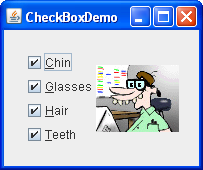
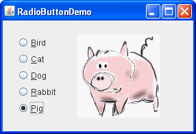

# 如何使用按钮，复选框和单选按钮

> 原文： [https://docs.oracle.com/javase/tutorial/uiswing/components/button.html](https://docs.oracle.com/javase/tutorial/uiswing/components/button.html)

要创建一个按钮，您可以实例化来自 [`AbstractButton`](https://docs.oracle.com/javase/8/docs/api/javax/swing/AbstractButton.html) 类的许多类之一。下表显示了您可能想要使用的 Swing 定义的`AbstractButton`子类：

| 类 | 小结 | 在哪里描述 |
| :-- | :-- | :-- |
| [`JButton`](https://docs.oracle.com/javase/8/docs/api/javax/swing/JButton.html) | 常用按钮。 | [如何使用 Common Button API](#abstractbutton) 和[如何使用 JButton 功能](#jbutton) |
| [`JCheckBox`](https://docs.oracle.com/javase/8/docs/api/javax/swing/JCheckBox.html) | 一个复选框按钮。 | [如何使用复选框](#checkbox) |
| [`JRadioButton`](https://docs.oracle.com/javase/8/docs/api/javax/swing/JRadioButton.html) | 一组单选按钮之一。 | [如何使用单选按钮](#radiobutton) |
| [`JMenuItem`](https://docs.oracle.com/javase/8/docs/api/javax/swing/JMenuItem.html) | 菜单中的项目。 | [如何使用菜单](menu.html) |
| [`JCheckBoxMenuItem`](https://docs.oracle.com/javase/8/docs/api/javax/swing/JCheckBoxMenuItem.html) | 具有复选框的菜单项。 | [如何使用菜单](menu.html)和[如何使用复选框](#checkbox) |
| [`JRadioButtonMenuItem`](https://docs.oracle.com/javase/8/docs/api/javax/swing/JRadioButtonMenuItem.html) | 带有单选按钮的菜单项。 | [如何使用菜单](menu.html)和[如何使用单选按钮](#radiobutton) |
| [`JToggleButton`](https://docs.oracle.com/javase/8/docs/api/javax/swing/JToggleButton.html) | 实现`JCheckBox`和`JRadioButton`继承的切换功能。可以实例化或子类化以创建双状态按钮。 | 用于某些[示例](#tbeg) |

* * *

**Note:** If you want to collect a group of buttons into a row or column, then you should check out [tool bars](toolbar.html).

* * *

首先，本节介绍`AbstractButton`定义的基本按钮 API - 因此所有 Swing 按钮都有共同点。接下来，它描述了`JButton`添加到`AbstractButton`的少量 API。之后，本节将向您展示如何使用专用 API 来实现复选框和单选按钮。

这是一个显示三个按钮的应用程序的图片：


* * *

**Try this:** 

1.  Click the Launch button to run the Button Demo using [Java™ Web Start](http://www.oracle.com/technetwork/java/javase/javawebstart/index.html) ([download JDK 7 or later](http://www.oracle.com/technetwork/java/javase/downloads/index.html)). Alternatively, to compile and run the example yourself, consult the [example index](../examples/components/index.html#ButtonDemo).[](https://docs.oracle.com/javase/tutorialJWS/samples/uiswing/ButtonDemoProject/ButtonDemo.jnlp)

2.  单击左键。
    它禁用中间按钮（和它本身，因为它不再有用）并启用右按钮。
3.  单击右键。
    启用中间按钮和左按钮，并禁用自身。

* * *

如`ButtonDemo`示例所示，Swing 按钮可以显示文本和图像。在`ButtonDemo`中，每个按钮的文本位于相对于其图像的不同位置。每个按钮文本中带下划线的字母显示每个按钮的 _ 助记符 _ - 键盘替代方案。在大多数外观中，用户可以通过按 Alt 键和助记符来单击按钮。例如，Alt-M 将单击 ButtonDemo 中的“中间”按钮。

禁用按钮时，外观会自动生成按钮的禁用外观。但是，您可以提供替换正常图像的图像。例如，您可以提供左右按钮中使用的图像的灰色版本。

如何实现事件处理取决于您使用的按钮类型以及如何使用它。通常，您实现[动作监听器](../events/actionlistener.html)，每次用户单击按钮时都会通知该动作监听器。对于[复选框](#checkbox)，您通常使用[项目监听器](../events/itemlistener.html)，当选中或取消选中复选框时会通知该项目。

下面是 [`ButtonDemo.java`](../examples/components/ButtonDemoProject/src/components/ButtonDemo.java) 中的代码，它创建上一个示例中的按钮并对按钮点击作出反应。粗体代码是按钮没有图像时将保留的代码。

```java
//In initialization code:
    ImageIcon leftButtonIcon = createImageIcon("images/right.gif");
    ImageIcon middleButtonIcon = createImageIcon("images/middle.gif");
    ImageIcon rightButtonIcon = createImageIcon("images/left.gif");

    b1 = new JButton("Disable middle button", leftButtonIcon);
    b1.setVerticalTextPosition(AbstractButton.CENTER);
    b1.setHorizontalTextPosition(AbstractButton.LEADING); //aka LEFT, for left-to-right locales
    b1.setMnemonic(KeyEvent.VK_D);
    b1.setActionCommand("disable");

    b2 = new JButton("Middle button", middleButtonIcon);
    b2.setVerticalTextPosition(AbstractButton.BOTTOM);
    b2.setHorizontalTextPosition(AbstractButton.CENTER);
    b2.setMnemonic(KeyEvent.VK_M);

    b3 = new JButton("Enable middle button", rightButtonIcon);
    //Use the default text position of CENTER, TRAILING (RIGHT).
    b3.setMnemonic(KeyEvent.VK_E);
    b3.setActionCommand("enable");
    b3.setEnabled(false);

    //Listen for actions on buttons 1 and 3.
    b1.addActionListener(this);
    b3.addActionListener(this);

    b1.setToolTipText("Click this button to disable "
                      + "the middle button.");
    b2.setToolTipText("This middle button does nothing "
                      + "when you click it.");
    b3.setToolTipText("Click this button to enable the "
                      + "middle button.");
    ...
}

public void actionPerformed(ActionEvent e) {
    if ("disable".equals(e.getActionCommand())) {
        b2.setEnabled(false);
        b1.setEnabled(false);
        b3.setEnabled(true);
    } else {
        b2.setEnabled(true);
        b1.setEnabled(true);
        b3.setEnabled(false);
    }
} 

protected static ImageIcon createImageIcon(String path) {
    java.net.URL imgURL = ButtonDemo.class.getResource(path);
    ...//error handling omitted for clarity...
    return new ImageIcon(imgURL);
}

```

普通按钮 - `JButton`对象 - 具有比`AbstractButton`类提供的功能更多的功能：您可以将`JButton`设置为默认按钮。

顶级容器中的最多一个按钮可以是默认按钮。默认按钮通常具有突出显示的外观，只要顶级容器具有键盘焦点并且用户按下 Return 或 Enter 键，就会单击该按钮。这是一个对话框的图片，在 [ListDialog](../examples/components/index.html#ListDialog) 示例中实现，其中 **Set** 按钮是默认按钮：


您可以通过在顶级容器的根窗格上调用`setDefaultButton`方法来设置默认按钮。以下是为`ListDialog`示例设置默认按钮的代码：

```java
//In the constructor for a JDialog subclass:
getRootPane().setDefaultButton(setButton);

```

默认按钮功能的确切实现取决于外观。例如，在 Windows 外观中，默认按钮更改为具有焦点的任何按钮，以便按 Enter 键单击聚焦按钮。当没有按钮具有焦点时，最初指定为默认按钮的按钮将再次成为默认按钮。

[`JCheckBox`](https://docs.oracle.com/javase/8/docs/api/javax/swing/JCheckBox.html) 类为复选框按钮提供支持。您也可以使用 [`JCheckBoxMenuItem`](https://docs.oracle.com/javase/8/docs/api/javax/swing/JCheckBoxMenuItem.html) 类在[菜单](menu.html)中放置复选框。因为`JCheckBox`和`JCheckBoxMenuItem`继承自`AbstractButton`，所以 Swing 复选框具有所有常用的按钮特征，如本节前面所述。例如，您可以指定要在复选框中使用的图像。

复选框类似于[单选按钮](#radiobutton)，但按照惯例，它们的选择模型不同。可以选择组中的任意数量的复选框 - 无，部分或全部。另一方面，一组单选按钮只能选择一个按钮。

这是一个应用程序的图片，它使用四个复选框来自定​​义卡通：



* * *

**Try this:** 

1.  Click the Launch button to run the CheckBox Demo using [Java™ Web Start](http://www.oracle.com/technetwork/java/javase/javawebstart/index.html) ([download JDK 7 or later](http://www.oracle.com/technetwork/java/javase/downloads/index.html)). Alternatively, to compile and run the example yourself, consult the [example index](../examples/components/index.html#CheckBoxDemo).[](https://docs.oracle.com/javase/tutorialJWS/samples/uiswing/CheckBoxDemoProject/CheckBoxDemo.jnlp)

2.  单击 **Chin** 按钮或按 Alt-c。
    **Chin** 复选框变为未选中，下巴从图片中消失。其他复选框保持选中状态。此应用程序有一个项监听器，侦听所有复选框。每次项监听器收到事件时，应用程序都会加载一个反映复选框当前状态的新图片。

* * *

复选框会为每次点击生成一个项目事件和一个操作事件。通常，您只收听项目事件，因为它们可以让您确定是单击选中还是取消选中复选框。下面是 [`CheckBoxDemo.java`](../examples/components/CheckBoxDemoProject/src/components/CheckBoxDemo.java) 中的代码，它创建上一个示例中的复选框并对点击作出反应。

```java
//In initialization code:
    chinButton = new JCheckBox("Chin");
    chinButton.setMnemonic(KeyEvent.VK_C); 
    chinButton.setSelected(true);

    glassesButton = new JCheckBox("Glasses");
    glassesButton.setMnemonic(KeyEvent.VK_G); 
    glassesButton.setSelected(true);

    hairButton = new JCheckBox("Hair");
    hairButton.setMnemonic(KeyEvent.VK_H); 
    hairButton.setSelected(true);

    teethButton = new JCheckBox("Teeth");
    teethButton.setMnemonic(KeyEvent.VK_T); 
    teethButton.setSelected(true);

    //Register a listener for the check boxes.
    chinButton.addItemListener(this);
    glassesButton.addItemListener(this);
    hairButton.addItemListener(this);
    teethButton.addItemListener(this);
...
public void itemStateChanged(ItemEvent e) {
    ...
    Object source = e.getItemSelectable();

    if (source == chinButton) {
        //...make a note of it...
    } else if (source == glassesButton) {
        //...make a note of it...
    } else if (source == hairButton) {
        //...make a note of it...
    } else if (source == teethButton) {
        //...make a note of it...
    }

    if (e.getStateChange() == ItemEvent.DESELECTED)
        //...make a note of it...
    ...
    updatePicture();
}

```

单选按钮是按钮组，按照惯例，一次只能选择一个按钮。 Swing 版本支持带有 [`JRadioButton`](https://docs.oracle.com/javase/8/docs/api/javax/swing/JRadioButton.html) 和 [`ButtonGroup`](https://docs.oracle.com/javase/8/docs/api/javax/swing/ButtonGroup.html) 类的单选按钮。要在[菜单](menu.html)中放置单选按钮，请使用 [`JRadioButtonMenuItem`](https://docs.oracle.com/javase/8/docs/api/javax/swing/JRadioButtonMenuItem.html) 类。显示一个多选项的其他方式是[组合框](combobox.html)和[列表](list.html)。单选按钮看起来类似于[复选框](#checkbox)，但按照惯例，复选框对一次可以选择的项目没有限制。

因为`JRadioButton`继承自`AbstractButton`，所以 Swing 单选按钮具有所有常用的按钮特征，如本节前面所述。例如，您可以指定单选按钮中显示的图像。

这是一个应用程序的图片，它使用五个单选按钮让您选择显示哪种宠物：



* * *

**Try this:** 

1.  Click the Launch button to run the RadioButton Demo using [Java™ Web Start](http://www.oracle.com/technetwork/java/javase/javawebstart/index.html) ([download JDK 7 or later](http://www.oracle.com/technetwork/java/javase/downloads/index.html)). Alternatively, to compile and run the example yourself, consult the [example index](../examples/components/index.html#RadioButtonDemo).[](https://docs.oracle.com/javase/tutorialJWS/samples/uiswing/RadioButtonDemoProject/RadioButtonDemo.jnlp)

2.  单击 **Dog** 按钮或按 Alt-d。
    **Dog** 按钮被选中，这使得 **Bird** 按钮变为未被选中状态。图片从鸟变为狗。此应用程序有一个侦听所有单选按钮的动作监听器。每次动作监听器收到事件时，应用程序都会显示刚刚单击的单选按钮的图片。

* * *

每次用户单击单选按钮（即使已经选中），该按钮将触发[动作事件](../events/actionlistener.html)。还会发生一个或两个[项目事件](../events/itemlistener.html) - 一个来自刚刚选择的按钮，另一个来自丢失选择的按钮（如果有的话）。通常，您使用动作监听器处理单选按钮单击。

以下是 [`RadioButtonDemo.java`](../examples/components/RadioButtonDemoProject/src/components/RadioButtonDemo.java) 中的代码，该代码在前一个示例中创建单选按钮并对点击作出反应。

```java
//In initialization code:
    //Create the radio buttons.
    JRadioButton birdButton = new JRadioButton(birdString);
    birdButton.setMnemonic(KeyEvent.VK_B);
    birdButton.setActionCommand(birdString);
    birdButton.setSelected(true);

    JRadioButton catButton = new JRadioButton(catString);
    catButton.setMnemonic(KeyEvent.VK_C);
    catButton.setActionCommand(catString);

    JRadioButton dogButton = new JRadioButton(dogString);
    dogButton.setMnemonic(KeyEvent.VK_D);
    dogButton.setActionCommand(dogString);

    JRadioButton rabbitButton = new JRadioButton(rabbitString);
    rabbitButton.setMnemonic(KeyEvent.VK_R);
    rabbitButton.setActionCommand(rabbitString);

    JRadioButton pigButton = new JRadioButton(pigString);
    pigButton.setMnemonic(KeyEvent.VK_P);
    pigButton.setActionCommand(pigString);

    //Group the radio buttons.
    ButtonGroup group = new ButtonGroup();
    group.add(birdButton);
    group.add(catButton);
    group.add(dogButton);
    group.add(rabbitButton);
    group.add(pigButton);

    //Register a listener for the radio buttons.
    birdButton.addActionListener(this);
    catButton.addActionListener(this);
    dogButton.addActionListener(this);
    rabbitButton.addActionListener(this);
    pigButton.addActionListener(this);
...
public void actionPerformed(ActionEvent e) {
    picture.setIcon(new ImageIcon("images/" 
                                  + e.getActionCommand() 
                                  + ".gif"));
}

```

对于每组单选按钮，您需要创建一个`ButtonGroup`实例并为其添加每个单选按钮。当用户选择组中的另一个按钮时，`ButtonGroup`负责取消选择先前选择的按钮。

您通常应该初始化一组单选按钮，以便选择一个。但是，API 不会强制执行此规则 - 一组单选按钮无法进行初始选择。一旦用户做出选择，从那时起只选择一个按钮。

下表列出了常用的与按钮相关的 API。您可能调用的其他方法，如`setFont`和`setForeground`，列在 [JComponent 类](jcomponent.html#api)的 API 表中。

使用按钮的 API 分为以下几类：

*   [设置或获取按钮的内容](#contents)
*   [微调按钮的外观](#looks)
*   [实现 Button 的功能](#acts)
*   [复选框构造器](#checkboxapi)
*   [单选按钮构造器](#radiobuttonapi)
*   [切换按钮构造器](#togglebuttonapi)
*   [常用按钮组构造器/方法](#buttongroup)


| 方法或构造器 | 目的 |
| --- | --- |
| [JButton（动作）](https://docs.oracle.com/javase/8/docs/api/javax/swing/JButton.html#JButton-javax.swing.Action-)
[JButton（字符串，图标）](https://docs.oracle.com/javase/8/docs/api/javax/swing/JButton.html#JButton-java.lang.String-javax.swing.Icon-)
[JButton（字符串）](https://docs.oracle.com/javase/8/docs/api/javax/swing/JButton.html#JButton-java.lang.String-)
[JButton（图标）](https://docs.oracle.com/javase/8/docs/api/javax/swing/JButton.html#JButton-javax.swing.Icon-)
[JButton（）](https://docs.oracle.com/javase/8/docs/api/javax/swing/JButton.html#JButton--) | 创建`JButton`实例，将其初始化为具有指定的文本/图像/操作。 |
| [void setAction（动作）](https://docs.oracle.com/javase/8/docs/api/javax/swing/AbstractButton.html#setAction-javax.swing.Action-)
[动作 getAction（）](https://docs.oracle.com/javase/8/docs/api/javax/swing/AbstractButton.html#getAction--)
 | 根据`Action`实例中的值设置或获取按钮的属性。 |
| [void setText（String）](https://docs.oracle.com/javase/8/docs/api/javax/swing/AbstractButton.html#setText-java.lang.String-)
[String getText（）](https://docs.oracle.com/javase/8/docs/api/javax/swing/AbstractButton.html#getText--)
 | 设置或获取按钮显示的文本。您可以使用 HTML 格式，如[在 Swing 组件中使用 HTML](html.html) 中所述。 |
| [void setIcon（Icon）](https://docs.oracle.com/javase/8/docs/api/javax/swing/AbstractButton.html#setIcon-javax.swing.Icon-)
[Icon getIcon（）](https://docs.oracle.com/javase/8/docs/api/javax/swing/AbstractButton.html#getIcon--)
 | 未选择或按下按钮时，设置或获取按钮显示的图像。 |
| [void setDisabledIcon（Icon）](https://docs.oracle.com/javase/8/docs/api/javax/swing/AbstractButton.html#setDisabledIcon-javax.swing.Icon-)
[Icon getDisabledIcon（）](https://docs.oracle.com/javase/8/docs/api/javax/swing/AbstractButton.html#getDisabledIcon--)
 | 禁用时，设置或获取按钮显示的图像。如果未指定禁用的图像，则外观会通过操作默认图像来创建一个。 |
| [void setPressedIcon（Icon）](https://docs.oracle.com/javase/8/docs/api/javax/swing/AbstractButton.html#setPressedIcon-javax.swing.Icon-)
[Icon getPressedIcon（）](https://docs.oracle.com/javase/8/docs/api/javax/swing/AbstractButton.html#getPressedIcon--)
 | 按下按钮时设置或获取按钮显示的图像。 |
| [void setSelectedIcon（Icon）](https://docs.oracle.com/javase/8/docs/api/javax/swing/AbstractButton.html#setSelectedIcon-javax.swing.Icon-)
[Icon getSelectedIcon（）](https://docs.oracle.com/javase/8/docs/api/javax/swing/AbstractButton.html#getSelectedIcon--)
[void setDisabledSelectedIcon（Icon）](https://docs.oracle.com/javase/8/docs/api/javax/swing/AbstractButton.html#setDisabledSelectedIcon-javax.swing.Icon-)
[Icon getDisabledSelectedIcon（）](https://docs.oracle.com/javase/8/docs/api/javax/swing/AbstractButton.html#getDisabledSelectedIcon--)
 | 选择时，设置或获取按钮显示的图像。如果未指定禁用的选定图像，则外观会通过操作所选图像来创建一个。 |
| [setRolloverEnabled（boolean）](https://docs.oracle.com/javase/8/docs/api/javax/swing/AbstractButton.html#setRolloverEnabled-boolean-)
[boolean isRolloverEnabled（）](https://docs.oracle.com/javase/8/docs/api/javax/swing/AbstractButton.html#isRolloverEnabled--)
[void setRolloverIcon（Icon）](https://docs.oracle.com/javase/8/docs/api/javax/swing/AbstractButton.html#setRolloverIcon-javax.swing.Icon-)
[Icon getRolloverIcon（）](https://docs.oracle.com/javase/8/docs/api/javax/swing/AbstractButton.html#getRolloverIcon--)
[void setRolloverSelectedIcon（Icon）](https://docs.oracle.com/javase/8/docs/api/javax/swing/AbstractButton.html#setRolloverSelectedIcon-javax.swing.Icon-)
[Icon getRolloverSelectedIcon（）](https://docs.oracle.com/javase/8/docs/api/javax/swing/AbstractButton.html#getRolloverSelectedIcon--)
 | 当光标经过时，使用`setRolloverIcon(someIcon)`使按钮显示指定的图标。 `setRolloverSelectedIcon`方法允许您在选择按钮时指定翻转图标 - 这对于双状态按钮（如切换按钮）非常有用。设置翻转图标会自动调用`setRollover(true)`，启用翻转。 |


| 方法或构造器 | 目的 |
| --- | --- |
| [void setHorizo​​ntalAlignment（int）](https://docs.oracle.com/javase/8/docs/api/javax/swing/AbstractButton.html#setHorizontalAlignment-int-)
[void setVerticalAlignment（int）](https://docs.oracle.com/javase/8/docs/api/javax/swing/AbstractButton.html#setVerticalAlignment-int-)
[int getHorizo​​ntalAlignment（）](https://docs.oracle.com/javase/8/docs/api/javax/swing/AbstractButton.html#getHorizontalAlignment--)
[int getVerticalAlignment（）](https://docs.oracle.com/javase/8/docs/api/javax/swing/AbstractButton.html#getVerticalAlignment--) | 设置或获取按钮的位置应放置其内容。 `AbstractButton`类允许以下任何一个值进行水平对齐：`RIGHT`，`LEFT`，`CENTER`（默认值），`LEADING`和`TRAILING`。对于垂直对齐：`TOP`，`CENTER`（默认值）和`BOTTOM`。 |
| [void setHorizo​​ntalTextPosition（int）](https://docs.oracle.com/javase/8/docs/api/javax/swing/AbstractButton.html#setHorizontalTextPosition-int-)
[void setVerticalTextPosition（int）](https://docs.oracle.com/javase/8/docs/api/javax/swing/AbstractButton.html#setVerticalTextPosition-int-)
[int getHorizo​​ntalTextPosition（）](https://docs.oracle.com/javase/8/docs/api/javax/swing/AbstractButton.html#getHorizontalTextPosition--)
[int getVerticalTextPosition（）](https://docs.oracle.com/javase/8/docs/api/javax/swing/AbstractButton.html#getVerticalTextPosition--) | 设置或获取按钮的文本相对于按钮图像的放置位置。 `AbstractButton`类允许水平位置的以下任何一个值：`LEFT`，`CENTER`，`RIGHT`，`LEADING`和`TRAILING`（默认值）。对于垂直位置：`TOP`，`CENTER`（默认值）和`BOTTOM`。 |
| [void setMargin（Insets）](https://docs.oracle.com/javase/8/docs/api/javax/swing/AbstractButton.html#setMargin-java.awt.Insets-)
[Insets getMargin（）](https://docs.oracle.com/javase/8/docs/api/javax/swing/AbstractButton.html#getMargin--) | 设置或获取按钮边框与其内容之间的像素数。 |
| [void setFocusPainted（boolean）](https://docs.oracle.com/javase/8/docs/api/javax/swing/AbstractButton.html#setFocusPainted-boolean-)
[boolean isFocusPainted（）](https://docs.oracle.com/javase/8/docs/api/javax/swing/AbstractButton.html#isFocusPainted--) | 设置或获取具有焦点时按钮是否应该看起来不同。 |
| [void setBorderPainted（boolean）](https://docs.oracle.com/javase/8/docs/api/javax/swing/AbstractButton.html#setBorderPainted-boolean-)
[boolean isBorderPainted（）](https://docs.oracle.com/javase/8/docs/api/javax/swing/AbstractButton.html#isBorderPainted--) | 设置或获取是否应绘制按钮的边框。 |
| [void setIconTextGap（int）](https://docs.oracle.com/javase/8/docs/api/javax/swing/AbstractButton.html#setIconTextGap-int-)
[int getIconTextGap（）](https://docs.oracle.com/javase/8/docs/api/javax/swing/AbstractButton.html#getIconTextGap--)
 | 设置或获取此按钮中显示的文本和图标之间的空间量。 |


| 方法或构造器 | 目的 |
| --- | --- |
| [void setMnemonic（int）](https://docs.oracle.com/javase/8/docs/api/javax/swing/AbstractButton.html#setMnemonic-int-)
[char getMnemonic（）](https://docs.oracle.com/javase/8/docs/api/javax/swing/AbstractButton.html#getMnemonic--)
 | 设置或获取键盘替代单击按钮。 `setMnemonic`方法的一种形式接受一个字符参数;但是，Swing 团队建议您使用`int`参数，指定 `KeyEvent.VK_ _X_`常量。 |
| [void setDisplayedMnemonicIndex（int）](https://docs.oracle.com/javase/8/docs/api/javax/swing/AbstractButton.html#setDisplayedMnemonicIndex-int-)
[int getDisplayedMnemonicIndex（）](https://docs.oracle.com/javase/8/docs/api/javax/swing/AbstractButton.html#getDisplayedMnemonicIndex--)
 | 设置或获取关于文本中哪个字符应该被装饰以表示助记符的提示。请注意，并非所有外观都支持此功能。 |
| [void setActionCommand（String）](https://docs.oracle.com/javase/8/docs/api/javax/swing/AbstractButton.html#setActionCommand-java.lang.String-)
[String getActionCommand（）](https://docs.oracle.com/javase/8/docs/api/javax/swing/AbstractButton.html#getActionCommand--)
 | 设置或获取按钮执行的操作的名称。 |
| [void addActionListener（ActionListener）](https://docs.oracle.com/javase/8/docs/api/javax/swing/AbstractButton.html#addActionListener-java.awt.event.ActionListener-)
[ActionListener removeActionListener（）](https://docs.oracle.com/javase/8/docs/api/javax/swing/AbstractButton.html#removeActionListener--)
 | 添加或删除侦听按钮触发的操作事件的对象。 |
| [void addItemListener（ItemListener）](https://docs.oracle.com/javase/8/docs/api/javax/swing/AbstractButton.html#addItemListener-java.awt.event.ItemListener-)
[ItemListener removeItemListener（）](https://docs.oracle.com/javase/8/docs/api/javax/swing/AbstractButton.html#removeItemListener--)
 | 添加或删除侦听按钮触发的项事件的对象。 |
| [void setSelected（boolean）](https://docs.oracle.com/javase/8/docs/api/javax/swing/AbstractButton.html#setSelected-boolean-)
[boolean isSelected（）](https://docs.oracle.com/javase/8/docs/api/javax/swing/AbstractButton.html#isSelected--)
 | 设置或获取是否选中该按钮。仅对具有开/关状态的按钮有意义，例如复选框。 |
| [void doClick（）](https://docs.oracle.com/javase/8/docs/api/javax/swing/AbstractButton.html#doClick--)
[void doClick（int）](https://docs.oracle.com/javase/8/docs/api/javax/swing/AbstractButton.html#doClick-int-)
 | 以编程方式执行“单击”。可选参数指定按钮应该按下的时间量（以毫秒为单位）。 |
| [void setMultiClickThreshhold（long）](https://docs.oracle.com/javase/8/docs/api/javax/swing/AbstractButton.html#setMultiClickThreshhold-long-)
[long getMultiClickThreshhold（）](https://docs.oracle.com/javase/8/docs/api/javax/swing/AbstractButton.html#getMultiClickThreshhold--) | 设置或获取按钮的鼠标按下事件之间所需的时间量（以毫秒为单位）以生成相应的操作事件。 |


| 构造器 | 目的 |
| --- | --- |
| [JCheckBox（动作）](https://docs.oracle.com/javase/8/docs/api/javax/swing/JCheckBox.html#JCheckBox-javax.swing.Action-)
[JCheckBox（字符串）](https://docs.oracle.com/javase/8/docs/api/javax/swing/JCheckBox.html#JCheckBox-java.lang.String-)
[JCheckBox（字符串，布尔）](https://docs.oracle.com/javase/8/docs/api/javax/swing/JCheckBox.html#JCheckBox-java.lang.String-boolean-)
[JCheckBox（图标）](https://docs.oracle.com/javase/8/docs/api/javax/swing/JCheckBox.html#JCheckBox-javax.swing.Icon-)
[JCheckBox（图标，布尔）](https://docs.oracle.com/javase/8/docs/api/javax/swing/JCheckBox.html#JCheckBox-javax.swing.Icon-boolean-)
[JCheckBox（字符串，图标）](https://docs.oracle.com/javase/8/docs/api/javax/swing/JCheckBox.html#JCheckBox-java.lang.String-javax.swing.Icon-)
[JCheckBox（字符串，图标，布尔）](https://docs.oracle.com/javase/8/docs/api/javax/swing/JCheckBox.html#JCheckBox-java.lang.String-javax.swing.Icon-boolean-)
[JCheckBox（）](https://docs.oracle.com/javase/8/docs/api/javax/swing/JCheckBox.html#JCheckBox--) | 创建`JCheckBox`实例。字符串参数指定复选框应显示的文本（如果有）。同样，`Icon`参数指定应使用的图像，而不是外观的默认复选框图像。将布尔参数指定为`true`会初始化要选中的复选框。如果缺少布尔参数或`false`，则最初取消选中复选框。 |
| [JCheckBoxMenuItem（动作）](https://docs.oracle.com/javase/8/docs/api/javax/swing/JCheckBoxMenuItem.html#JCheckBoxMenuItem-javax.swing.Action-)
[JCheckBoxMenuItem（String）](https://docs.oracle.com/javase/8/docs/api/javax/swing/JCheckBoxMenuItem.html#JCheckBoxMenuItem-java.lang.String-)
[JCheckBoxMenuItem（String，boolean）](https://docs.oracle.com/javase/8/docs/api/javax/swing/JCheckBoxMenuItem.html#JCheckBoxMenuItem-java.lang.String-boolean-)
[JCheckBoxMenuItem（Icon）](https://docs.oracle.com/javase/8/docs/api/javax/swing/JCheckBoxMenuItem.html#JCheckBoxMenuItem-javax.swing.Icon-)
[JCheckBoxMenuItem（String，Icon）](https://docs.oracle.com/javase/8/docs/api/javax/swing/JCheckBoxMenuItem.html#JCheckBoxMenuItem-java.lang.String-javax.swing.Icon-)
[JCheckBoxMenuItem（String，Icon，boolean）](https://docs.oracle.com/javase/8/docs/api/javax/swing/JCheckBoxMenuItem.html#JCheckBoxMenuItem-java.lang.String-javax.swing.Icon-boolean-)
[JCheckBoxMenuItem（）](https://docs.oracle.com/javase/8/docs/api/javax/swing/JCheckBoxMenuItem.html#JCheckBoxMenuItem--) | 创建`JCheckBoxMenuItem`实例。参数的解释方式与`JCheckBox`构造器的参数相同，只是除了普通复选框图标外还显示任何指定的图标。 |


| 构造器 | 目的 |
| --- | --- |
| [JRadioButton（动作）](https://docs.oracle.com/javase/8/docs/api/javax/swing/JRadioButton.html#JRadioButton-javax.swing.Action-)
[JRadioButton（String）](https://docs.oracle.com/javase/8/docs/api/javax/swing/JRadioButton.html#JRadioButton-java.lang.String-)
[JRadioButton（String，boolean）](https://docs.oracle.com/javase/8/docs/api/javax/swing/JRadioButton.html#JRadioButton-java.lang.String-boolean-)
[JRadioButton（Icon）](https://docs.oracle.com/javase/8/docs/api/javax/swing/JRadioButton.html#JRadioButton-javax.swing.Icon-)
[JRadioButton（图标，布尔）](https://docs.oracle.com/javase/8/docs/api/javax/swing/JRadioButton.html#JRadioButton-javax.swing.Icon-boolean-)
[JRadioButton（字符串，图标）](https://docs.oracle.com/javase/8/docs/api/javax/swing/JRadioButton.html#JRadioButton-java.lang.String-javax.swing.Icon-)
[JRadioButton（字符串，图标，布尔）](https://docs.oracle.com/javase/8/docs/api/javax/swing/JRadioButton.html#JRadioButton-java.lang.String-javax.swing.Icon-boolean-)
[JRadioButton（）](https://docs.oracle.com/javase/8/docs/api/javax/swing/JRadioButton.html#JRadioButton--) | 创建`JRadioButton`实例。字符串参数指定单选按钮应显示的文本（如果有）。同样，`Icon`参数指定应使用的图像，而不是外观的默认单选按钮图像。指定 boolean 参数为`true`初始化要选择的单选按钮，但需经`ButtonGroup`对象的批准。如果缺少布尔参数或`false`，则最初取消选择单选按钮。 |
| [JRadioButtonMenuItem（动作）](https://docs.oracle.com/javase/8/docs/api/javax/swing/JRadioButtonMenuItem.html#JRadioButtonMenuItem-javax.swing.Action-)
[JRadioButtonMenuItem（String）](https://docs.oracle.com/javase/8/docs/api/javax/swing/JRadioButtonMenuItem.html#JRadioButtonMenuItem-java.lang.String-)
[JRadioButtonMenuItem（Icon）](https://docs.oracle.com/javase/8/docs/api/javax/swing/JRadioButtonMenuItem.html#JRadioButtonMenuItem-javax.swing.Icon-)
[JRadioButtonMenuItem（String，Icon）](https://docs.oracle.com/javase/8/docs/api/javax/swing/JRadioButtonMenuItem.html#JRadioButtonMenuItem-java.lang.String-javax.swing.Icon-)
[JRadioButtonMenuItem（）](https://docs.oracle.com/javase/8/docs/api/javax/swing/JRadioButtonMenuItem.html#JRadioButtonMenuItem--) | 创建`JRadioButtonMenuItem`实例。参数的解释方式与`JRadioButton`构造器的参数相同，但除了普通的单选按钮图标外，还会显示任何指定的图标。 |


| 构造器 | 目的 |
| --- | --- |
| [JToggleButton（动作）](https://docs.oracle.com/javase/8/docs/api/javax/swing/JToggleButton.html#JToggleButton-javax.swing.Action-)
[JToggleButton（字符串）](https://docs.oracle.com/javase/8/docs/api/javax/swing/JToggleButton.html#JToggleButton-java.lang.String-)
[JToggleButton（字符串，布尔值）](https://docs.oracle.com/javase/8/docs/api/javax/swing/JToggleButton.html#JToggleButton-java.lang.String-boolean-)
[JToggleButton（图标）](https://docs.oracle.com/javase/8/docs/api/javax/swing/JToggleButton.html#JToggleButton-javax.swing.Icon-)
[JToggleButton（图标，布尔）](https://docs.oracle.com/javase/8/docs/api/javax/swing/JToggleButton.html#JToggleButton-javax.swing.Icon-boolean-)
[JToggleButton（字符串，图标）](https://docs.oracle.com/javase/8/docs/api/javax/swing/JToggleButton.html#JToggleButton-java.lang.String-javax.swing.Icon-)
[JToggleButton（字符串，图标，布尔值）](https://docs.oracle.com/javase/8/docs/api/javax/swing/JToggleButton.html#JToggleButton-java.lang.String-javax.swing.Icon-boolean-)
[JToggleButton（）](https://docs.oracle.com/javase/8/docs/api/javax/swing/JToggleButton.html#JToggleButton--) | 创建一个`JToggleButton`实例，类似于`JButton`，但有两个状态。通常，您使用`JRadioButton`或`JCheckBox`而不是直接实例化`JToggleButton`，但是当您不需要典型的单选按钮或复选框外观时，`JToggleButton`会很有用。字符串参数指定切换按钮应显示的文本（如果有）。同样，`Icon`参数指定应使用的图像。将布尔参数指定为`true`会初始化要选择的切换按钮。如果缺少布尔参数或`false`，则最初取消选择切换按钮。 |


| 构造器或方法 | 目的 |
| --- | --- |
| [ButtonGroup（）](https://docs.oracle.com/javase/8/docs/api/javax/swing/ButtonGroup.html#ButtonGroup--) | 创建`ButtonGroup`实例。 |
| [void add（AbstractButton）](https://docs.oracle.com/javase/8/docs/api/javax/swing/ButtonGroup.html#add-javax.swing.AbstractButton-)
[void remove（AbstractButton）](https://docs.oracle.com/javase/8/docs/api/javax/swing/ButtonGroup.html#remove-javax.swing.AbstractButton-) | 向组中添加按钮，或从组中删除按钮。 |
| [public ButtonGroup getGroup（）](https://docs.oracle.com/javase/8/docs/api/javax/swing/DefaultButtonModel.html#getGroup--)
_（在`DefaultButtonModel`中）_ | 获取控制按钮的`ButtonGroup`（如果有）。例如：
`ButtonGroup group = ((DefaultButtonModel)button.getModel()).getGroup();` |
| [public ButtonGroup clearSelection（）](https://docs.oracle.com/javase/8/docs/api/javax/swing/ButtonGroup.html#ButtonGroup--) | 清除 ButtonGroup 中所选按钮的状态。 ButtonGroup 中没有任何按钮被选中。 |

以下示例使用按钮。另请参见[使用工具栏](toolbar.html#eg)的示例，其中列出了将`JButton`对象添加到`JToolBar`的程序。

| 例 | 在哪里描述 | 笔记 |
| :-- | :-- | :-- |
| [`ButtonDemo`](../examples/components/index.html#ButtonDemo) | [如何使用 Common Button API](#abstractbutton) | 使用助记符和图标。指定相对于按钮图标的按钮文本位置。使用动作命令。 |
| [`ButtonHtmlDemo`](../examples/components/index.html#ButtonHtmlDemo) | [在 Swing 组件中使用 HTML](html.html) | ButtonDemo 的一个版本，在其按钮中使用 HTML 格式。 |
| [`ListDialog`](../examples/components/index.html#ListDialog) | [如何使用 JButton 功能](#jbutton) | 使用两个按钮实现一个对话框，其中一个按钮是默认按钮。 |
| [`DialogDemo`](../examples/components/index.html#DialogDemo) | [如何制作对话](dialog.html) | 有“显示”按钮，其行为与单选按钮的状态相关联。使用相当大的，虽然是匿名的内部类来实现动作监听器。 |
| [`ProgressBarDemo`](../examples/components/index.html#ProgressBarDemo) | [如何监控进度](progress.html) | 使用命名的内部类实现按钮的动作监听器。 |
| [`CheckBoxDemo`](../examples/components/index.html#CheckBoxDemo) | [如何使用复选框](#checkbox) | 使用复选框按钮确定应显示的 16 个图像中的哪一个。 |
| [`ActionDemo`](../examples/misc/index.html#ActionDemo) | [如何使用行动](../misc/action.html) | 使用复选框菜单项来设置程序的状态。 |
| [`RadioButtonDemo`](../examples/components/index.html#RadioButtonDemo) | [如何使用单选按钮](#radiobutton) | 使用单选按钮确定应显示的五个图像中的哪一个。 |
| [`DialogDemo`](../examples/components/index.html#DialogDemo) | [如何制作对话](dialog.html) | 包含几组单选按钮，用于确定要显示的对话框。 |
| [`MenuDemo`](../examples/components/index.html#MenuDemo) | [如何使用菜单](menu.html) | 包含单选按钮菜单项和复选框菜单项。 |
| [`ColorChooserDemo2`](../examples/components/index.html#ColorChooserDemo2) | [如何使用颜色选择器](colorchooser.html) | `CrayonPanel`中的蜡笔实现为切换按钮。 |
| [`ScrollDemo`](../examples/components/index.html#ScrollDemo) | [如何使用滚动窗格](scrollpane.html) | **cm** 按钮是一个切换按钮。 |

您可以从以下文档中了解有关 JavaFX 按钮组件的更多信息：

*   [使用 JavaFX UI 控件：按钮](https://docs.oracle.com/javase/8/javafx/user-interface-tutorial/button.htm)
*   [使用 JavaFX UI 控件：单选按钮](https://docs.oracle.com/javase/8/javafx/user-interface-tutorial/radio-button.htm)
*   [使用 JavaFX UI 控件：切换按钮](https://docs.oracle.com/javase/8/javafx/user-interface-tutorial/toggle-button.htm)
*   [使用 JavaFX UI 控件：复选框](https://docs.oracle.com/javase/8/javafx/user-interface-tutorial/checkbox.htm)