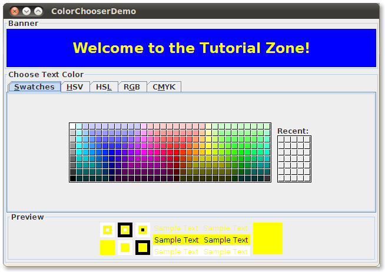
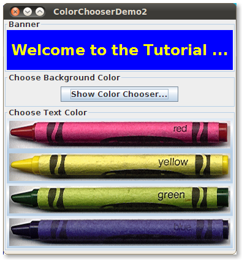

# 如何使用颜色选择器

> 原文： [https://docs.oracle.com/javase/tutorial/uiswing/components/colorchooser.html](https://docs.oracle.com/javase/tutorial/uiswing/components/colorchooser.html)

使用 [`JColorChooser`](https://docs.oracle.com/javase/8/docs/api/javax/swing/JColorChooser.html) 类使用户可以从颜色调色板中进行选择。颜色选择器是可以放置在程序 GUI 中的任何位置的组件。 `JColorChooser` API 还可以轻松调出包含颜色选择器的[对话框](dialog.html)（模态或非模态）。

以下是使用颜色选择器在横幅中设置文本颜色的应用程序的图片：

<center></center>

* * *

**Try this:** 

*   单击“启动”按钮以使用 [Java™Web Start](http://www.oracle.com/technetwork/java/javase/javawebstart/index.html) （[下载 JDK](http://www.oracle.com/technetwork/java/javase/downloads/index.html) ）运行 ColorChooser 演示。或者，要自己编译并运行示例，请参考[示例索引](../examples/components/index.html#ColorChooserDemo)。 [](https://docs.oracle.com/javase/tutorialJWS/samples/uiswing/ColorChooserDemoProject/ColorChooserDemo.jnlp) 

* * *

程序的源代码在 [`ColorChooserDemo.java`](../examples/components/ColorChooserDemoProject/src/components/ColorChooserDemo.java) 中。

颜色选择器由标有**选择文本颜色**的框内的所有内容组成。这就是 Java Look&amp; S 中标准颜色选择器的样子。感觉。它包含两个部分，选项卡式窗格和预览面板。选项卡式窗格中的三个选项卡选择 _ 选择器面板 _。选项卡式窗格下方的 _ 预览面板 _ 显示当前选定的颜色。

以下是创建`JColorChooser`实例并将其添加到容器的示例中的代码：

```
public class ColorChooserDemo extends JPanel ... {
    public ColorChooserDemo() {
        super(new BorderLayout());
        banner = new JLabel("Welcome to the Tutorial Zone!",
                            JLabel.CENTER);
        banner.setForeground(Color.yellow);
        . . .
        tcc = new JColorChooser(banner.getForeground());
        . . .
        add(tcc, BorderLayout.PAGE_END);
    }

```

前面代码片段中的`JColorChooser`构造函数采用`Color`参数，该参数指定选择器最初选择的颜色。如果未指定初始颜色，则颜色选择器显示`Color.white`。有关可以使用的颜色常数列表，请参阅 [`Color` API 文档](https://docs.oracle.com/javase/8/docs/api/java/awt/Color.html)。

 [`ColorSelectionModel`](https://docs.oracle.com/javase/8/docs/api/javax/swing/colorchooser/ColorSelectionModel.html) 的实例来包含和管理当前选择。每当用户更改颜色选择器中的颜色时，颜色选择模型就会触发更改事件。示例程序使用颜色选择模型注册更改侦听器，以便它可以更新窗口顶部的横幅。以下代码注册并实现更改侦听器：

```
tcc.getSelectionModel().addChangeListener(this);
. . .
public void stateChanged(ChangeEvent e) {
    Color newColor = tcc.getColor();
    banner.setForeground(newColor);
}

```

有关更改侦听器和更改事件的一般信息，请参见[如何编写更改侦听器](../events/changelistener.html)。

基本颜色选择器（如示例程序中使用的颜色选择器）对于许多程序来说已足够。但是，颜色选择器 API 允许您自定义颜色选择器，方法是为其提供自己设计的预览面板，向其添加自己的选择器面板，或从颜色选择器中删除现有的选择器面板。此外，`JColorChooser`类提供了两种方法，可以在对话框中轻松使用颜色选择器。

本节的其余部分讨论了以下主题：

*   [另一个例子：ColorChooserDemo2](#advancedexample)
*   [在对话框中显示颜色选择器](#dialog)
*   [删除或更换预览面板](#previewpanel)
*   [创建自定义选择器面板](#chooserpanel)
*   [Color Chooser API](#api)
*   [使用颜色选择器的例子](#eg)

现在让我们把注意力转向 [ColorChooserDemo2](../examples/components/index.html#ColorChooserDemo2) ，这是之前演示程序的修改版本，它使用了更多的`JColorChooser` API。

* * *

**Try this:** 

*   单击“启动”按钮以使用 [Java™Web Start](http://www.oracle.com/technetwork/java/javase/javawebstart/index.html) （[下载 JDK](http://www.oracle.com/technetwork/java/javase/downloads/index.html) ）运行 ColorChooser 演示。或者，要自己编译并运行示例，请参考[示例索引](../examples/components/index.html#ColorChooserDemo2)。 [](https://docs.oracle.com/javase/tutorialJWS/samples/uiswing/ColorChooserDemo2Project/ColorChooserDemo2.jnlp) 

* * *

这是 ColorChooserDemo2 的图片：

<center></center>

此程序以这些方式自定义横幅文本颜色选择器：

*   删除预览面板
*   删除所有默认选择器面板
*   添加自定义选择器面板

[删除或更换预览面板](#previewpanel)涵盖了第一次自定义。 [创建自定义选择器面板](#chooserpanel)讨论了最后两个。

此程序还添加了一个按钮，可在对话框中显示颜色选择器，您可以使用该按钮设置横幅背景颜色。

`JColorChooser`类提供了两种类方法，可以在对话框中轻松使用颜色选择器。当用户单击**显示颜色选择器...** 按钮时，ColorChooserDemo2 使用这些方法之一`showDialog`显示背景颜色选择器。以下是示例中的单行代码，它在对话框中显示背景颜色选择器：

```
Color newColor = JColorChooser.showDialog(
                     ColorChooserDemo2.this,
                     "Choose Background Color",
                     banner.getBackground());

```

第一个参数是对话框的父级，第二个参数是对话框标题，第三个参数是最初选择的颜色。

对话框在三种情况下消失：用户选择颜色并单击 **OK** 按钮，用户使用**取消**按钮取消操作，或者用户通过帧控制取消对话框。如果用户选择颜色，`showDialog`方法将返回新颜色。如果用户取消操作或取消窗口，则该方法返回`null`。以下是根据`showDialog`返回的值更新横幅背景颜色的示例中的代码：

```
if (newColor != null) {
    banner.setBackground(newColor);
}

```

`showDialog`创建的对话框是模态的。如果需要非模态对话框，可以使用`JColorChooser`的`createDialog`方法创建对话框。此方法还允许您在对话框窗口中为 **OK** 和**取消**按钮指定动作侦听器。使用`JDialog`的`show`方法显示此方法创建的对话框。有关使用此方法的示例，请参见[如何使用表格](table.html)部分中的[指定其他编辑器](table.html#editor)。

默认情况下，颜色选择器显示预览面板。 ColorChooserDemo2 使用以下代码行删除文本颜色选择器的预览面板：

```
tcc.setPreviewPanel(new JPanel());

```

这有效地删除了预览面板，因为普通`JPanel`没有大小而没有默认视图。要将预览面板设置回默认值，请使用`null`作为`setPreviewPanel`的参数。

要提供自定义预览面板，还可以使用`setPreviewPanel`。传递给方法的组件应继承自`JComponent`，指定合理的大小，并提供当前颜色的自定义视图。要在用户更改颜色选择器中的颜色时收到通知，预览面板必须在颜色选择器的颜色选择模型上注册为更改侦听器，如[之前](#changelistener)所述。

默认颜色选择器提供五个选择器面板：

*   色板 - 用于从一组色板中选择颜色。
*   [HSV](http://en.wikipedia.org/wiki/HSL_and_HSV) - 用于使用 Hue-Saturation-Value 颜色表示选择颜色。在 JDK 7 之前，这被称为 HSB，用于 Hue-Saturation-Brightness。
*   [HSL](http://en.wikipedia.org/wiki/HSL_and_HSV) - 用于使用色相饱和度 - 亮度颜色表示来选择颜色。这是 JDK 7 中的新功能。
*   [RGB](http://en.wikipedia.org/wiki/RGB_color_model) - 用于使用红 - 绿 - 蓝颜色模型选择颜色。
*   [CMYK](http://en.wikipedia.org/wiki/Cmyk) - 用于使用印刷色或四色模型选择颜色。这是 JDK 7 中的新功能。

您可以通过使用`addChooserPanel`添加自己设计的选择器面板来扩展默认颜色选择器，或者可以通过使用`removeChooserPanel`删除选择器面板来限制它。

如果要删除所有默认选择器面板并添加一个或多个自己的选择器面板，只需调用`setChooserPanels`即可完成此操作。 ColorChooserDemo2 使用此方法将默认选择器面板替换为 [`CrayonPanel`](../examples/components/ColorChooserDemo2Project/src/components/CrayonPanel.java) （自定义选择器面板）的实例。以下是该示例对`setChooserPanels`的调用：

```
//Override the chooser panels with our own.
AbstractColorChooserPanel panels[] = { new CrayonPanel() };
tcc.setChooserPanels(panels);

```

代码很简单：它创建一个包含`CrayonPanel`的数组。接下来，代码调用`setChooserPanels`将数组的内容设置为颜色选择器选择器面板。

`CrayonPanel`是 [`AbstractColorChooserPanel`](https://docs.oracle.com/javase/8/docs/api/javax/swing/colorchooser/AbstractColorChooserPanel.html) 的子类，并覆盖其超类中定义的五个抽象方法：

**`void buildChooser()`**

Creates the GUI that comprises the chooser panel. The example creates four toggle buttons — one for each crayon — and adds them to the chooser panel.

**`void updateChooser()`**

This method is called whenever the chooser panel is displayed. The implementation of this method selects the toggle button that represents the currently selected color.

```
public void updateChooser() {
    Color color = getColorFromModel();
    if (Color.red.equals(color)) {
        redCrayon.setSelected(true);
    } else if (Color.yellow.equals(color)) {
        yellowCrayon.setSelected(true);
    } else if (Color.green.equals(color)) {
        greenCrayon.setSelected(true);
    } else if (Color.blue.equals(color)) {
        blueCrayon.setSelected(true);
    }
}

```

**`String getDisplayName()`**

Returns the display name of the chooser panel. The name is used on the tab for the chooser panel. Here is the example `getDisplayName` method:

```
public String getDisplayName() {
    return "Crayons";
}

```

**`Icon getSmallDisplayIcon()`**

Returns a small icon to represent this chooser panel. This is currently unused. Future versions of the color chooser might use this icon or the large one to represent this chooser panel in the display. The example implementation of this method returns `null`.

**`Icon getLargeDisplayIcon()`**

Returns a large icon to represent this chooser panel. This is currently unused. Future versions of the color chooser might use this icon or the small one to represent this chooser panel in the display. The example implementation of this method returns `null`.

下表列出了常用的`JColorChooser`构造函数和方法。您可能调用的其他方法列在 [JComponent 类](jcomponent.html)的 API 表中。使用颜色选择器的 API 分为以下几类：

*   [创建和显示颜色选择器](#creating)
*   [自定义颜色选择器 GUI](#customizing)
*   [设置或获取当前颜色](#selection)

<caption></caption>
| 方法或构造函数 | 目的 |
| :-- | :-- |
| [JColorChooser（）](https://docs.oracle.com/javase/8/docs/api/javax/swing/JColorChooser.html#JColorChooser--)
[JColorChooser（颜色）](https://docs.oracle.com/javase/8/docs/api/javax/swing/JColorChooser.html#JColorChooser-java.awt.Color-)
[JColorChooser（ColorSelectionModel）](https://docs.oracle.com/javase/8/docs/api/javax/swing/JColorChooser.html#JColorChooser-javax.swing.colorchooser.ColorSelectionModel-) | 创建一个颜色选择器。默认构造函数创建一个颜色选择器，其初始颜色为`Color.white`。使用第二个构造函数指定不同的初始颜色。 `ColorSelectionModel`参数（如果存在）为颜色选择器提供颜色选择模型。 |
| [Color showDialog（组件，字符串，颜色）](https://docs.oracle.com/javase/8/docs/api/javax/swing/JColorChooser.html#showDialog-java.awt.Component-java.lang.String-java.awt.Color-) | 在模态对话框中创建并显示颜色选择器。 `Component`参数是对话框的父级，`String`参数指定对话框标题，`Color`参数指定选择器的初始颜色。 |
| [JDialog createDialog（Component，String，
boolean，JColorChooser，ActionListener，
ActionListener）](https://docs.oracle.com/javase/8/docs/api/javax/swing/JColorChooser.html#createDialog-java.awt.Component-java.lang.String-boolean-javax.swing.JColorChooser-java.awt.event.ActionListener-java.awt.event.ActionListener-) | 为指定的颜色选择器创建一个对话框。与`showDialog`一样，`Component`参数是对话框的父级，`String`参数指定对话框标题。其他参数如下：`boolean`指定对话框是否为模态，`JColorChooser`是在对话框中显示的颜色选择器，第一个`ActionListener`用于 **OK** 按钮，以及第二个是**取消**按钮。 |

<caption></caption>
| 方法 | 目的 |
| :-- | :-- |
| [void setPreviewPanel（JComponent）](https://docs.oracle.com/javase/8/docs/api/javax/swing/JColorChooser.html#setPreviewPanel-javax.swing.JComponent-)
[JComponent getPreviewPanel（）](https://docs.oracle.com/javase/8/docs/api/javax/swing/JColorChooser.html#getPreviewPanel--) | 设置或获取用于预览颜色选择的组件。要删除预览面板，请使用`new JPanel()`作为参数。要指定默认预览面板，请使用`null`。 |
| [void setChooserPanels（AbstractColorChooserPanel []）](https://docs.oracle.com/javase/8/docs/api/javax/swing/JColorChooser.html#setChooserPanels-javax.swing.colorchooser.AbstractColorChooserPanel:A-)
[AbstractColorChooserPanel [] getChooserPanels（）](https://docs.oracle.com/javase/8/docs/api/javax/swing/JColorChooser.html#getChooserPanels--) | 设置或获取颜色选择器中的选择器面板。 |
| [void addChooserPanel（AbstractColorChooserPanel）](https://docs.oracle.com/javase/8/docs/api/javax/swing/JColorChooser.html#addChooserPanel-javax.swing.colorchooser.AbstractColorChooserPanel-)
[AbstractColorChooserPanel removeChooserPanel（AbstractColorChooserPanel）](https://docs.oracle.com/javase/8/docs/api/javax/swing/JColorChooser.html#removeChooserPanel-javax.swing.colorchooser.AbstractColorChooserPanel-) | 将选择器面板添加到颜色选择器或从中移除选择器面板。 |
| [void setDragEnabled（boolean）](https://docs.oracle.com/javase/8/docs/api/javax/swing/JColorChooser.html#setDragEnabled-boolean-)
[boolean getDragEnabled（）](https://docs.oracle.com/javase/8/docs/api/javax/swing/JColorChooser.html#getDragEnabled--) | 设置或获取`dragEnabled`属性，该属性必须为 true 才能在此组件上启用拖动处理。默认值为 false。有关详细信息，请参阅[拖放和数据传输](../dnd/index.html)。 |

<caption></caption>
| 方法 | 目的 |
| :-- | :-- |
| [void setColor（Color）](https://docs.oracle.com/javase/8/docs/api/javax/swing/JColorChooser.html#setColor-java.awt.Color-)
[void setColor（int，int，int）](https://docs.oracle.com/javase/8/docs/api/javax/swing/JColorChooser.html#setColor-int-int-int-)
[void setColor（int）](https://docs.oracle.com/javase/8/docs/api/javax/swing/JColorChooser.html#setColor-int-)
[颜色 getColor（）](https://docs.oracle.com/javase/8/docs/api/javax/swing/JColorChooser.html#getColor--) | 设置或获取当前选定的颜色。 `setColor`方法的三个整数版本将三个整数一起解释为 RGB 颜色。 `setColor`方法的单个整数版本将整数分为四个 8 位字节，并将整数解释为 RGB 颜色，如下所示： |
| [void setSelectionModel（ColorSelectionModel）](https://docs.oracle.com/javase/8/docs/api/javax/swing/JColorChooser.html#setSelectionModel-javax.swing.colorchooser.ColorSelectionModel-)
[ColorSelectionModel getSelectionModel（）](https://docs.oracle.com/javase/8/docs/api/javax/swing/JColorChooser.html#getSelectionModel--) | 设置或获取颜色选择器的选择模型。每当选择更改时，此对象包含已注册侦听器的当前选择和触发更改事件。 |

此表显示了使用`JColorChooser`的示例以及描述这些示例的示例。

| 例 | 在哪里描述 | 笔记 |
| :-- | :-- | :-- |
| [ColorChooserDemo](../examples/components/index.html#ColorChooserDemo) | 这个部分 | 使用标准颜色选择器。 |
| [ColorChooserDemo2](../examples/components/index.html#ColorChooserDemo2) | 这个部分 | 在使用`showDialog`创建的对话框中使用一个自定义颜色选择器和一个标准颜色选择器。 |
| [TableDialogEditDemo](../examples/components/index.html#TableDialogEditDemo) | [如何使用表格](table.html) | 演示如何将颜色选择器用作表中的自定义单元格编辑器。此示例使用的颜色选择器是使用`createDialog`创建的。 |
| [BasicDnD](../misc/../examples/dnd/index.html#BasicDnD) | [DnD 简介](../dnd/intro.html) | 使用不在对话框中的颜色选择器;演示了 Swing 组件的默认拖放功能，包括颜色选择器。 |