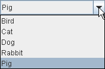
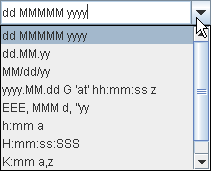
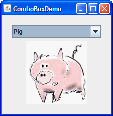
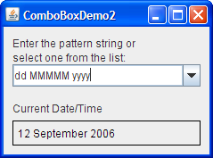
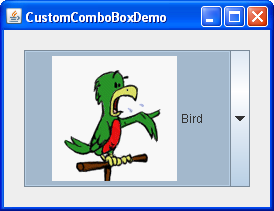

# 如何使用组合框

> 原文： [https://docs.oracle.com/javase/tutorial/uiswing/components/combobox.html](https://docs.oracle.com/javase/tutorial/uiswing/components/combobox.html)

[`JComboBox`](https://docs.oracle.com/javase/8/docs/api/javax/swing/JComboBox.html) 允许用户选择几种选择中的一种，可以有两种截然不同的形式。默认表单是不可编辑的组合框，其中包含一个按钮和一个值的下拉列表。第二种形式称为可编辑组合框，它具有一个文本字段，旁边有一个小按钮。用户可以在文本字段中键入值，或单击按钮以显示下拉列表。以下是 Java 外观中两种形式的组合框的外观：

不可编辑的组合框，在（顶部）之前和单击按钮之后




可编辑的组合框，在之前和之后单击箭头按钮




组合框需要很少的屏幕空间，它们的可编辑（文本字段）形式对于让用户快速选择值而不将用户限制为显示值非常有用。可以显示多种选择的其他组件是[单选按钮](button.html#radiobutton)和[列表](list.html)的组。单选按钮组通常是用户最容易理解的，但是当空间有限或有多个选项可用时，组合框可能更合适。列表不是非常有吸引力，但是当项目数量很大（例如，超过 20 个）或选择多个项目可能有效时，它们比组合框更合适。

由于可编辑和不可编辑的组合框非常不同，因此本节将单独处理它们。本节介绍以下主题：

*   [使用不可编辑的组合框](#uneditable)
*   [处理组合框上的事件](#listeners)
*   [使用可编辑的组合框](#editable)
*   [提供自定义渲染器](#renderer)
*   [组合框 API](#api)
*   [使用组合框的例子](#eg)

此处显示的应用程序使用不可编辑的组合框来选择宠物图片：



* * *

**Try this:** 

1.  Click the Launch button to run the ComboBox Demo using [Java™ Web Start](http://www.oracle.com/technetwork/java/javase/javawebstart/index.html) ([download JDK 7 or later](http://www.oracle.com/technetwork/java/javase/downloads/index.html)). Alternatively, to compile and run the example yourself, consult the [example index](../examples/components/index.html#ComboBoxDemo).[](https://docs.oracle.com/javase/tutorialJWS/samples/uiswing/ComboBoxDemoProject/ComboBoxDemo.jnlp)

2.  从组合框中选择动物名称以查看其图片。
3.  将该程序的操作和 GUI 与使用单选按钮的操作相比较：[运行 RadioButtonDemo](https://docs.oracle.com/javase/tutorialJWS/samples/uiswing/RadioButtonDemoProject/RadioButtonDemo.jnlp) （它需要发行版 6）。您可能还想比较源代码： [`ComboBoxDemo.java`](../examples/components/ComboBoxDemoProject/src/components/ComboBoxDemo.java) 与 [`RadioButtonDemo.java`](../examples/components/RadioButtonDemoProject/src/components/RadioButtonDemo.java ) 。

* * *

以下代码取自 [`ComboBoxDemo.java`](../examples/components/ComboBoxDemoProject/src/components/ComboBoxDemo.java ) ，创建一个不可编辑的组合框并进行设置：

```
String[] petStrings = { "Bird", "Cat", "Dog", "Rabbit", "Pig" };

//Create the combo box, select item at index 4.
//Indices start at 0, so 4 specifies the pig.
JComboBox petList = new JComboBox(petStrings);
petList.setSelectedIndex(4);
petList.addActionListener(this);

```

这个组合框包含一个字符串数组，但您可以轻松地使用图标。要将其他任何内容放入组合框或自定义组合框中的项目外观，您需要编写自定义渲染器。可编辑的组合框还需要自定义编辑器。有关信息和示例，请参阅[提供自定义渲染器](#renderer)。

上面的代码在组合框中注册了一个动作监听器。要查看动作监听器实现并了解组合框支持的其他类型的监听器，请参阅组合框上的[处理事件。](#listeners)

无论您使用哪种构造器，组合框都使用组合框模型来包含和管理其菜单中的项目。使用数组或向量初始化组合框时，组合框会为您创建默认模型对象。与其他 Swing 组件一样，您可以通过实现自定义模型（实现 [`ComboBoxModel`](https://docs.oracle.com/javase/8/docs/api/javax/swing/ComboBoxModel.html) 接口的对象）来部分自定义组合框。

* * *

**Note:** 

实现组合框的自定义模型时要小心。更改组合框菜单中项目的`JComboBox`方法，如`insertItemAt`，仅在数据模型实现 [`MutableComboBoxModel`](https://docs.oracle.com/javase/8/docs/api/javax/swing/MutableComboBoxModel.html) 接口（`ComboBoxModel`的子接口）时才有效。请参阅 [API](#api) 表以查看受影响的方法。

要注意的其他事项 - 即使是不可编辑的组合框 - 确保您的自定义模型在组合框的数据或状态发生变化时触发[列表数据事件](../events/listdatalistener.html)。即使是不可变的组合框模型，其数据永不改变，也必须在选择发生变化时触发列表数据事件（`CONTENTS_CHANGED`事件）。获取免费激活列表数据事件代码的一种方法是使您的组合框模型成为 [`AbstractListModel`](https://docs.oracle.com/javase/8/docs/api/javax/swing/AbstractListModel.html) 的子类。

* * *

这是来自`ComboBoxDemo.java`的代码，它在组合框上注册并实现了一个动作监听器：

```
public class ComboBoxDemo ... implements ActionListener {
    . . .
        petList.addActionListener(this) {
    . . .
    public void actionPerformed(ActionEvent e) {
        JComboBox cb = (JComboBox)e.getSource();
        String petName = (String)cb.getSelectedItem();
        updateLabel(petName);
    }
    . . .
}

```

此动作监听器从组合框中获取新选择的项目，使用它来计算图像文件的名称，并更新标签以显示图像。当用户从组合框的菜单中选择项目时，组合框将触发一个动作事件。有关实现动作监听器的一般信息，请参阅[如何编写动作监听器](../events/actionlistener.html)。

组合框还会生成项目事件，当任何项目的选择状态发生更改时会触发这些事件。在组合框中一次只能选择一个项目，因此当用户进行新选择时，先前选择的项目将被取消选中。因此，每次用户从菜单中选择不同的项目时，都会触发两个项目事件。如果用户选择相同的项目，则不会触发任何项目事件。使用`addItemListener`在组合框中注册项监听器。 [如何编写项目监听器](../events/itemlistener.html)提供有关实现项目监听器的一般信息。

虽然`JComboBox`继承了为低级事件注册监听器的方法 - 例如焦点，键和鼠标事件 - 但我们建议您不要在组合框上侦听低级事件。原因如下：组合框是 _ 化合物组分 _ - 它由两个或多个其他组分组成。组合框本身会触发高级事件，例如动作事件。它的子组件可以触发低级事件，如鼠标，键和焦点事件。低级事件和触发它们的子组件依赖于外观。为避免编写依赖于依赖于感觉的代码，您应该只监听复合组件（如组合框）上的高级事件。有关事件的信息，包括有关高级和低级事件的讨论，请参阅[写入事件监听器](../events/index.html)。

这是一个演示应用程序的图片，它使用可编辑的组合框输入用于格式化日期的模式。



* * *

**Try this:** 

1.  Click the Launch button to run the ComboBox2 Demo using [Java™ Web Start](http://www.oracle.com/technetwork/java/javase/javawebstart/index.html) ([download JDK 7 or later](http://www.oracle.com/technetwork/java/javase/downloads/index.html)). Alternatively, to compile and run the example yourself, consult the [example index](../examples/components/index.html#ComboBoxDemo2).[](https://docs.oracle.com/javase/tutorialJWS/samples/uiswing/ComboBoxDemo2Project/ComboBoxDemo2.jnlp)

2.  通过从组合框菜单中选择一个来输入新模式。该程序重新格式化当前日期和时间。
3.  输入一个新模式，然后按 Enter 键。程序再次重新格式化当前日期和时间。

* * *

以下代码取自 [`ComboBoxDemo2.java`](../examples/components/ComboBoxDemo2Project/src/components/ComboBoxDemo2.java) ，创建并设置组合框：

```
String[] patternExamples = {
         "dd MMMMM yyyy",
         "dd.MM.yy",
         "MM/dd/yy",
         "yyyy.MM.dd G 'at' hh:mm:ss z",
         "EEE, MMM d, ''yy",
         "h:mm a",
         "H:mm:ss:SSS",
         "K:mm a,z",
         "yyyy.MMMMM.dd GGG hh:mm aaa"
};
. . .
JComboBox patternList = new JComboBox(patternExamples);
patternList.setEditable(true);
patternList.addActionListener(this);

```

此代码与前面的示例非常相似，但需要一些解释。粗体代码行显式启用编辑以允许用户键入值。这是必要的，因为默认情况下，组合框不可编辑。此特定示例允许在组合框上进行编辑，因为其菜单不提供所有可能的日期格式设置模式，只是常用模式的快捷方式。

当用户从菜单中选择项目以及用户键入 Enter 时，可编辑的组合框将触发操作事件。请注意，当用户在组合框中输入值时，菜单保持不变。如果需要，您可以轻松编写一个动作监听器，每次用户键入唯一值时，都会在组合框的菜单中添加新项。

请参阅[国际化](../../i18n/index.html)以了解有关格式化日期和其他类型数据的更多信息。

 [`ListCellRenderer`](https://docs.oracle.com/javase/8/docs/api/javax/swing/ListCellRenderer.html) 接口。组合框的编辑器必须实现 [`ComboBoxEditor`](https://docs.oracle.com/javase/8/docs/api/javax/swing/ComboBoxEditor.html) 。本节介绍如何为不可编辑的组合框提供自定义渲染器。

默认渲染器知道如何渲染字符串和图标。如果将其他对象放在组合框中，则默认渲染器会调用`toString`方法以提供要显示的字符串。您可以通过实现自己的`ListCellRenderer`来自定义组合框呈现自身及其项目的方式。

这是一个使用带有自定义渲染器的组合框的应用程序的图片：



单击“启动”按钮以使用 [Java™Web Start](http://www.oracle.com/technetwork/java/javase/javawebstart/index.html) （[下载 JDK 7 或更高版本](http://www.oracle.com/technetwork/java/javase/downloads/index.html)）运行 CustomComboBox 演示。或者，要自己编译并运行示例，请参考[示例索引](../examples/components/index.html#CustomComboBoxDemo)。

[](https://docs.oracle.com/javase/tutorialJWS/samples/uiswing/CustomComboBoxDemoProject/CustomComboBoxDemo.jnlp)

此示例的完整源代码位于 [`CustomComboBoxDemo.java`](../examples/components/CustomComboBoxDemoProject/src/components/CustomComboBoxDemo.java) 中。要获取所需的图像文件，请参阅[示例索引](../examples/components/index.html#CustomComboBoxDemo)。

示例中的以下语句创建`ComboBoxRenderer`（自定义类）的实例，并将实例设置为组合框的渲染器：

```
JComboBox petList = new JComboBox(intArray);
. . .
ComboBoxRenderer renderer = new ComboBoxRenderer();
renderer.setPreferredSize(new Dimension(200, 130));
petList.setRenderer(renderer);
petList.setMaximumRowCount(3);

```

最后一行设置组合框的最大行数，它确定显示菜单时可见的项目数。如果组合框中的项目数大于其最大行数，则菜单具有滚动条。图标对于菜单来说非常大，所以我们的代码将行数限制为 3.这是`ComboBoxRenderer`的实现，这是一个并排放置图标和文本的渲染器：

```
class ComboBoxRenderer extends JLabel
                       implements ListCellRenderer {
    . . .
    public ComboBoxRenderer() {
        setOpaque(true);
        setHorizontalAlignment(CENTER);
        setVerticalAlignment(CENTER);
    }

    /*
     * This method finds the image and text corresponding
     * to the selected value and returns the label, set up
     * to display the text and image.
     */
    public Component getListCellRendererComponent(
                                       JList list,
                                       Object value,
                                       int index,
                                       boolean isSelected,
                                       boolean cellHasFocus) {
        //Get the selected index. (The index param isn't
        //always valid, so just use the value.)
        int selectedIndex = ((Integer)value).intValue();

        if (isSelected) {
            setBackground(list.getSelectionBackground());
            setForeground(list.getSelectionForeground());
        } else {
            setBackground(list.getBackground());
            setForeground(list.getForeground());
        }

        //Set the icon and text.  If icon was null, say so.
        ImageIcon icon = images[selectedIndex];
        String pet = petStrings[selectedIndex];
        setIcon(icon);
        if (icon != null) {
            setText(pet);
            setFont(list.getFont());
        } else {
            setUhOhText(pet + " (no image available)",
                        list.getFont());
        }

        return this;
    }
    . . .
}

```

作为`ListCellRenderer`，`ComboBoxRenderer`实现一个名为`getListCellRendererComponent`的方法，该方法返回一个组件，其`paintComponent`方法用于显示组合框及其每个项目。显示图像和图标的最简单方法是使用标签。所以`ComboBoxRenderer`是 label 的子类并返回自身。 `getListCellRendererComponent`的实现将渲染器配置为显示当前选定的图标及其描述。

这些参数传递给`getListCellRendererComponent`：

*   `JList list` - 在幕后使用的列表对象，用于显示项目。该示例使用此对象的颜色来设置前景色和背景色。
*   `Object value` - 要渲染的对象。此示例中为`Integer`。
*   `int index` - 要渲染的对象的索引。
*   `boolean isSelected` - 指示是否选择要渲染的对象。示例用于确定要使用的颜色。
*   `boolean cellHasFocus` - 指示要渲染的对象是否具有焦点。

请注意，组合框和[列表](list.html)使用相同类型的渲染器 - `ListCellRenderer`。如果对您的程序有意义，您可以通过在组合框和列表之间共享渲染器来节省一些时间。

下表列出了常用的`JComboBox`构造器和方法。您最有可能在`JComboBox`对象上调用的其他方法是从其超类继承的方法，例如`setPreferredSize`。有关常用继承方法的表，请参见 [JComponent API](jcomponent.html#api) 。

使用组合框的 API 分为两类：

*   [在组合框菜单中设置或获取项目](#list)
*   [自定义组合框的操作](#configuring)


| 方法 | 目的 |
| --- | --- |
| [JComboBox（）](https://docs.oracle.com/javase/8/docs/api/javax/swing/JComboBox.html#JComboBox--)
[JComboBox（ComboBoxModel）](https://docs.oracle.com/javase/8/docs/api/javax/swing/JComboBox.html#JComboBox-javax.swing.ComboBoxModel-)
[JComboBox（Object []）](https://docs.oracle.com/javase/8/docs/api/javax/swing/JComboBox.html#JComboBox-java.lang.Object:A-)
[JComboBox（Vector）](https://docs.oracle.com/javase/8/docs/api/javax/swing/JComboBox.html#JComboBox-java.util.Vector-) | 使用其菜单中的指定项创建一个组合框。使用默认构造器创建的组合框最初在菜单中没有项目。每个其他构造器都从其参数初始化菜单：模型对象，对象数组或对象的`Vector`。 |
| [void addItem（Object）](https://docs.oracle.com/javase/8/docs/api/javax/swing/JComboBox.html#addItem-java.lang.Object-)
[void insertItemAt（Object，int）](https://docs.oracle.com/javase/8/docs/api/javax/swing/JComboBox.html#insertItemAt-java.lang.Object-int-) | 将指定的对象添加或插入到组合框的菜单中。 insert 方法将指定对象 _ 置于 _ 指定的索引处，从而将其插入当前位于该索引处的对象之前。这些方法要求组合框的数据模型是`MutableComboBoxModel`的实例。 |
| [Object getItemAt（int）](https://docs.oracle.com/javase/8/docs/api/javax/swing/JComboBox.html#getItemAt-int-)
[Object getSelectedItem（）](https://docs.oracle.com/javase/8/docs/api/javax/swing/JComboBox.html#getSelectedItem--) | 从组合框的菜单中获取项目。 |
| [void removeAllItems（）](https://docs.oracle.com/javase/8/docs/api/javax/swing/JComboBox.html#removeAllItems--)
[void removeItemAt（int）](https://docs.oracle.com/javase/8/docs/api/javax/swing/JComboBox.html#removeItemAt-int-)
[void removeItem（Object）](https://docs.oracle.com/javase/8/docs/api/javax/swing/JComboBox.html#removeItem-java.lang.Object-) | 从组合框的菜单中删除一个或多个项目。这些方法要求组合框的数据模型是`MutableComboBoxModel`的实例。 |
| [int getItemCount（）](https://docs.oracle.com/javase/8/docs/api/javax/swing/JComboBox.html#getItemCount--) | 获取组合框菜单中的项目数。 |
| [void setModel（ComboBoxModel）](https://docs.oracle.com/javase/8/docs/api/javax/swing/JComboBox.html#setModel-javax.swing.ComboBoxModel-)
[ComboBoxModel getModel（）](https://docs.oracle.com/javase/8/docs/api/javax/swing/JComboBox.html#getModel--) | 设置或获取提供组合框菜单中项目的数据模型。 |
| [void setAction（动作）](https://docs.oracle.com/javase/8/docs/api/javax/swing/JComboBox.html#setAction-javax.swing.Action-)
[动作 getAction（）](https://docs.oracle.com/javase/8/docs/api/javax/swing/JComboBox.html#getAction--) | 设置或获取与组合框关联的`Action`。有关详细信息，请参阅[如何使用操作](../misc/action.html)。 |


| 方法或构造器 | 目的 |
| --- | --- |
| [void addActionListener（ActionListener）](https://docs.oracle.com/javase/8/docs/api/javax/swing/JComboBox.html#addActionListener-java.awt.event.ActionListener-) | 向组合框添加动作监听器。当用户从组合框的菜单中选择项目时，或者在可编辑的组合框中，当用户按 Enter 键时，将调用监听器的`actionPerformed`方法。 |
| [void addItemListener（ItemListener）](https://docs.oracle.com/javase/8/docs/api/javax/swing/JComboBox.html#addItemListener-java.awt.event.ItemListener-) | 将项监听器添加到组合框。当任何组合框项目的选择状态发生变化时，将调用监听器的`itemStateChanged`方法。 |
| [void setEditable（boolean）](https://docs.oracle.com/javase/8/docs/api/javax/swing/JComboBox.html#setEditable-boolean-)
[boolean isEditable（）](https://docs.oracle.com/javase/8/docs/api/javax/swing/JComboBox.html#isEditable--) | 设置或获取用户是否可以键入组合框。 |
| [void setRenderer（ListCellRenderer）](https://docs.oracle.com/javase/8/docs/api/javax/swing/JComboBox.html#setRenderer-javax.swing.ListCellRenderer-)
[ListCellRenderer getRenderer（）](https://docs.oracle.com/javase/8/docs/api/javax/swing/JComboBox.html#getRenderer--) | 设置或获取负责在组合框中绘制所选项目的对象。仅当组合框不可编辑时才使用渲染器。如果组合框是可编辑的，则编辑器用于绘制所选项目。 |
| [void setEditor（ComboBoxEditor）](https://docs.oracle.com/javase/8/docs/api/javax/swing/JComboBox.html#setEditor-javax.swing.ComboBoxEditor-)
[ComboBoxEditor getEditor（）](https://docs.oracle.com/javase/8/docs/api/javax/swing/JComboBox.html#getEditor--) | 设置或获取负责在组合框中绘制和编辑所选项目的对象。仅当组合框可编辑时才使用编辑器。如果组合框不可编辑，则渲染器将用于绘制所选项目。 |

此表显示了使用`JComboBox`的示例以及描述这些示例的示例。

| 例 | 在哪里描述 | 笔记 |
| :-- | :-- | :-- |
| [`ComboBoxDemo`](../examples/components/index.html#ComboBoxDemo) | 这个部分 | 使用不可编辑的组合框。 |
| [`ComboBoxDemo2`](../examples/components/index.html#ComboBoxDemo2) | 这个部分 | 使用可编辑的组合框。 |
| [`CustomComboBoxDemo`](../examples/components/index.html#CustomComboBoxDemo) | 这个部分 | 为组合框提供自定义渲染器。 |
| [`TableRenderDemo`](../examples/components/index.html#TableRenderDemo) | 如何使用表格（[使用组合框作为编辑器](table.html#combobox)） | 演示如何使用组合框作为表格单元格编辑器。 |