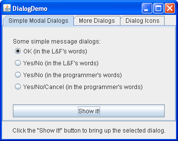
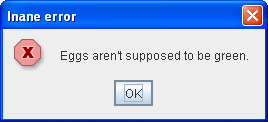
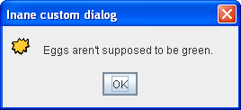
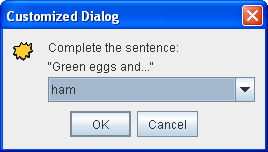
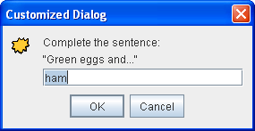

# 如何制作对话框

> 原文： [https://docs.oracle.com/javase/tutorial/uiswing/components/dialog.html](https://docs.oracle.com/javase/tutorial/uiswing/components/dialog.html)

对话窗口是一个独立的子窗口，用于在主 Swing 应用程序窗口之外进行临时通知。大多数对话框向用户显示错误消息或警告，但对话框可以显示图像，目录树或与管理它们的主 Swing 应用程序兼容的任何内容。

为方便起见，几个 Swing 组件类可以直接实例化并显示 _ 对话框 _。要创建简单的标准对话框，请使用 [`JOptionPane`](https://docs.oracle.com/javase/8/docs/api/javax/swing/JOptionPane.html) 类。 [`ProgressMonitor`](progress.html) 类可以显示一个对话框，显示操作的进度。另外两个类别 [`JColorChooser`](colorchooser.html) 和 [`JFileChooser`](filechooser.html) 也提供标准对话框。要打开打印对话框，您可以使用 [Printing](../../2d/printing/index.html) API。要创建自定义对话框，请直接使用 [`JDialog`](https://docs.oracle.com/javase/8/docs/api/javax/swing/JDialog.html) 类。

简单对话框的代码可以是最小的。例如，这是一个信息对话框：


以下是创建和显示它的代码：

```java
JOptionPane.showMessageDialog(frame, "Eggs are not supposed to be green.");

```

本节的其余部分包括以下主题：

*   [对话框概述](#overview)
*   [DialogDemo 示例](#dialogdemo)
*   [JOptionPane 功能](#features)
*   [创建和显示简单对话框](#create)
*   [自定义按钮文字](#button)
*   [从对话框](#input)获取用户输入
*   [停止自动对话关闭](#stayup)
*   [Dialog API](#api)
*   [使用对话框](#eg)的示例

每个对话框都依赖于 Frame 组件。当该帧被销毁时，其依赖对话框也被销毁。当帧被图标化时，其相关的对话框也会从屏幕上消失。当帧被去图标化时，其相关的对话框返回到屏幕。 swing JDialog 类从 AWT `Dialog`类继承此行为。

对话框可以是 _ 模态 _。当模态对话框可见时，它会阻止用户输入程序中的所有其他窗口。 JOptionPane 创建模态的`JDialog`。要创建非模态对话框，必须直接使用`JDialog`类。

从 JDK 7 开始，您可以使用新的 Modality API 修改对话框窗口模态行为。有关详细信息，请参阅[新模态 API](http://www.oracle.com/technetwork/articles/javase/modality-137604.html) 。

`JDialog`类是 AWT [`java.awt.Dialog`](https://docs.oracle.com/javase/8/docs/api/java/awt/Dialog.html) 类的子类。它添加了[根窗格](rootpane.html)容器，并支持对`Dialog`对象的默认关闭操作。这些与`JFrame`具有的功能相同，直接使用`JDialog`与使用`JFrame`非常相似。如果您要直接使用`JDialog`，那么您应该了解[使用顶级容器](toplevel.html)和[如何制作帧](frame.html)，特别是[响应窗口的材料 - 结束活动](frame.html#windowevents)。

即使使用`JOptionPane`实现对话框，您仍然在后台使用`JDialog`。原因是`JOptionPane`只是一个可以自动创建`JDialog`并将其自身添加到`JDialog`内容窗格的容器。

这是显示对话框的应用程序的图片。



* * *

**Try this::** 

1.  Click the Launch button to run the Dialog Demo using [Java™ Web Start](http://www.oracle.com/technetwork/java/javase/javawebstart/index.html) ([download JDK 7 or later](http://www.oracle.com/technetwork/java/javase/downloads/index.html)). Alternatively, to compile and run the example yourself, consult the [example index](../examples/components/index.html#DialogDemo).[](https://docs.oracle.com/javase/tutorialJWS/samples/uiswing/DialogDemoProject/DialogDemo.jnlp)

2.  单击显示它！按钮。
    将出现一个模态对话框。在您关闭它之前，应用程序将无法响应，但必要时它将自行重新绘制。您可以通过单击对话框中的按钮或显式关闭对话框，例如使用对话框窗口装饰。
3.  在“更多对话框”窗格中，单击底部单选按钮，然后单击“显示”！按钮。
    将出现非模态对话框。请注意，当非模态对话框启动时，DialogDemo 窗口仍然完全正常工作。
4.  显示非模态对话框时，图标化 DialogDemo 窗口。
    对话框将从屏幕上消失，直到您对 DialogDemo 窗口进行 deiconify。

* * *

使用`JOptionPane`，您可以快速创建和自定义几种不同类型的对话框。 `JOptionPane`支持布局标准对话框，提供图标，指定对话框标题和文本以及自定义按钮文本。其他功能允许您自定义对话框显示的组件并指定对话框在屏幕上的显示位置。您甚至可以指定选项窗格将自身置于[内部框架](internalframe.html)（`JInternalFrame`）而不是`JDialog`。

创建`JOptionPane`时，特定于外观的代码会将组件添加到`JOptionPane`并确定这些组件的布局。

`JOptionPane`的图标支持可让您轻松指定对话框显示的图标。您可以使用自定义图标，根本不使用图标，也可以使用四个标准`JOptionPane`图标中的任何一个（问题，信息，警告和错误）。每个外观都有自己的四个标准图标版本。下图显示了 Java（和 Windows）外观中使用的图标。

**Icons used by JOptionPane**
| 图标说明 | Java 的外观和感觉 | Windows 的外观和感觉 |
| --- | --- | --- |
| 题 |  |  |
| 信息 |  |  |
| 警告 |  |  |
| 错误 |  |  |

对于大多数简单的模态对话框，您可以使用`JOptionPane`的`show _Xxx_ Dialog`方法之一创建和显示对话框。如果您的对话框应该是[内部框架](internalframe.html)，则在`show`之后添加`Internal` - 例如，`showMessageDialog`更改为`showInternalMessageDialog`。如果您需要控制对话框窗口关闭行为或者您不希望对话框是模态的，那么您应该直接实例化`JOptionPane`并将其添加到`JDialog`实例。然后调用`JDialog`上的`setVisible(true)`使其显示。

两个最有用的`显示 _Xxx_ 对话`方法是`showMessageDialog`和`showOptionDialog`。 `showMessageDialog`方法显示简单的单键对话框。 `showOptionDialog`方法显示自定义对话框 - 它可以显示带有自定义按钮文本的各种按钮，并且可以包含标准文本消息或组件集合。

另外两个`显示 _Xxx_ Dialog`方法的使用频率较低。 `showConfirmDialog`方法要求用户确认某些内容，但会显示标准按钮文本（例如，是/否或本地化的等效文本），而不是根据用户情况自定义的按钮文本（例如，启动/取消）。第四种方法`showInputDialog`用于显示模式对话框，该对话框使用文本字段，不可编辑的组合框或列表从用户获取字符串。

以下是从 [`DialogDemo.java`](../examples/components/DialogDemoProject/src/components/DialogDemo.java) 中使用`showMessageDialog`，`showOptionDialog`和`JOptionPane`构造器的一些示例。有关更多示例代码，请参阅 [`DialogDemo.java`](../examples/components/DialogDemoProject/src/components/DialogDemo.java) 以及使用对话框的[示例中列出的其他程序。](#eg)

**`showMessageDialog`**

Displays a modal dialog with one button, which is labeled "OK" (or the localized equivalent). You can easily specify the message, icon, and title that the dialog displays. Here are some examples of using `showMessageDialog`:


```java
//default title and icon
JOptionPane.showMessageDialog(frame,
    "Eggs are not supposed to be green.");

```

 | 

```java
//custom title, warning icon
JOptionPane.showMessageDialog(frame,
    "Eggs are not supposed to be green.",
    "Inane warning",
    JOptionPane.WARNING_MESSAGE);

```

 | 

```java
//custom title, error icon
JOptionPane.showMessageDialog(frame,
    "Eggs are not supposed to be green.",
    "Inane error",
    JOptionPane.ERROR_MESSAGE);

```

 | 

```java
//custom title, no icon
JOptionPane.showMessageDialog(frame,
    "Eggs are not supposed to be green.",
    "A plain message",
    JOptionPane.PLAIN_MESSAGE);

```

 | 

```java
//custom title, custom icon
JOptionPane.showMessageDialog(frame,
    "Eggs are not supposed to be green.",
    "Inane custom dialog",
    JOptionPane.INFORMATION_MESSAGE,
    icon);

```


**`showOptionDialog`**

Displays a modal dialog with the specified buttons, icons, message, title, and so on. With this method, you can change the text that appears on the buttons of standard dialogs. You can also perform many other kinds of customization.


```java
//Custom button text
Object[] options = {"Yes, please",
                    "No, thanks",
                    "No eggs, no ham!"};
int n = JOptionPane.showOptionDialog(frame,
    "Would you like some green eggs to go "
    + "with that ham?",
    "A Silly Question",
    JOptionPane.YES_NO_CANCEL_OPTION,
    JOptionPane.QUESTION_MESSAGE,
    null,
    options,
    options[2]);

```


**`JOptionPane` (constructor)**

Creates a `JOptionPane` with the specified buttons, icons, message, title, and so on. You must then add the option pane to a `JDialog`, register a property-change listener on the option pane, and show the dialog. See [Stopping Automatic Dialog Closing](#stayup) for details.


```java
final JOptionPane optionPane = new JOptionPane(
    "The only way to close this dialog is by\n"
    + "pressing one of the following buttons.\n"
    + "Do you understand?",
    JOptionPane.QUESTION_MESSAGE,
    JOptionPane.YES_NO_OPTION);

```


尽管每个方法和构造器的参数数量各不相同，但所有`显示 _Xxx_ Dialog`方法和`JOptionPane`构造器的参数都是标准化的。以下列表描述了每个参数。要查看特定方法的确切参数列表，请参阅 [Dialog API](#api) 。

`Component _parentComponent_`

The first argument to each `show_Xxx_Dialog` method is always the parent component, which must be a Frame, a component inside a Frame, or null. If you specify a Frame or Dialog, then the Dialog will appear over the center of the Frame and follow the focus behavior of that Frame. If you specify a component inside a Frame, then the Dialog will appear over the center of that component and will follow the focus behavior of that component's Frame. If you specify _null,_ then the look and feel will pick an appropriate position for the dialog — generally the center of the screen — and the Dialog will not necessarily follow the focus behavior of any visible Frame or Dialog.

`JOptionPane`构造器不包含此参数。而是在创建包含`JOptionPane`的`JDialog`时指定父框架，并使用`JDialog` `setLocationRelativeTo`方法设置对话框位置。

`Object _message_`

This required argument specifies what the dialog should display in its main area. Generally, you specify a string, which results in the dialog displaying a label with the specified text. You can split the message over several lines by putting newline (`\n`) characters inside the message string. For example:

```java
"Complete the sentence:\n \"Green eggs and...\""

```

`String _title_`

The title of the dialog.

`int _optionType_`

Specifies the set of buttons that appear at the bottom of the dialog. Choose from one of the following standard sets: `DEFAULT_OPTION`, `YES_NO_OPTION`, `YES_NO_CANCEL_OPTION`, `OK_CANCEL_OPTION`.

`int _messageType_`

This argument determines the icon displayed in the dialog. Choose from one of the following values: `PLAIN_MESSAGE` (no icon), `ERROR_MESSAGE`, `INFORMATION_MESSAGE`, `WARNING_MESSAGE`, `QUESTION_MESSAGE`.

`Icon _icon_`

The icon to display in the dialog.

`Object[] _options_`

Generally used to specify the string displayed by each button at the bottom of the dialog. See [Customizing Button Text in a Standard Dialog](#button) for more information. Can also be used to specify icons to be displayed by the buttons or non-button components to be added to the button row.

`Object _initialValue_`

Specifies the default value to be selected.

您可以让选项窗格显示其默认图标，也可以使用消息类型或图标参数指定图标。默认情况下，使用`showMessageDialog`创建的选项窗格显示信息图标，使用`showConfirmDialog`或`showInputDialog`创建的选项窗格显示问题图标，使用`JOptionPane`构造器创建的选项窗格不显示图标。要指定对话框显示标准图标或不显示图标，请指定与所需图标对应的消息类型。要指定自定义图标，请使用 icon 参数。 icon 参数优先于消息类型;只要 icon 参数具有非 null 值，对话框就会显示指定的图标。

使用`JOptionPane`创建对话框时，可以使用标准按钮文本（可能因外观和区域设置而异）或指定不同的文本。默认情况下，选项窗格类型确定显示的按钮数。例如，`YES_NO_OPTION`对话框有两个按钮，`YES_NO_CANCEL_OPTION`对话框有三个按钮。

以下代码取自 [`DialogDemo.java`](../examples/components/DialogDemoProject/src/components/DialogDemo.java) ，创建两个是/否对话框。第一个对话框用`showConfirmDialog`实现，它使用两个按钮的外观措辞。第二个对话框使用`showOptionDialog`，因此它可以自定义措辞。除了措辞更改，对话框是相同的。

![A yes/no dialog, in those words [but perhaps translated]](img/6b161896a71ad68ce23a964338488f03.jpg)

```java
//default icon, custom title
int n = JOptionPane.showConfirmDialog(
    frame,
    "Would you like green eggs and ham?",
    "An Inane Question",
    JOptionPane.YES_NO_OPTION);

```

 | 

```java
Object[] options = {"Yes, please",
                    "No way!"};
int n = JOptionPane.showOptionDialog(frame,
    "Would you like green eggs and ham?",
    "A Silly Question",
    JOptionPane.YES_NO_OPTION,
    JOptionPane.QUESTION_MESSAGE,
    null,     //do not use a custom Icon
    options,  //the titles of buttons
    options[0]); //default button title

```


如前面的代码片段所示，`showMessageDialog`，`showConfirmDialog`和`showOptionDialog`方法返回一个表示用户选择的整数。该整数的值为`YES_OPTION`，`NO_OPTION`，`CANCEL_OPTION`，`OK_OPTION`和`CLOSED_OPTION`。除`CLOSED_OPTION`外，每个选项对应于用户按下的按钮。返回`CLOSED_OPTION`时，表示用户明确关闭了对话框窗口，而不是选择选项窗格内的按钮。

即使您更改标准对话框按钮显示的字符串，返回值仍然是预定义的整数之一。例如，`YES_NO_OPTION`对话框始终返回以下值之一：`YES_OPTION`，`NO_OPTION`或`CLOSED_OPTION`。

## 获取用户输入

`显示 _Xxx_ 对话`的唯一形式是不返回整数`showInputDialog`，而是返回`Object`。 `Object`通常是反映用户选择的`String`。下面是使用`showInputDialog`创建一个对话框的示例，该对话框允许用户选择三个字符串中的一个：



```java
Object[] possibilities = {"ham", "spam", "yam"};
String s = (String)JOptionPane.showInputDialog(
                    frame,
                    "Complete the sentence:\n"
                    + "\"Green eggs and...\"",
                    "Customized Dialog",
                    JOptionPane.PLAIN_MESSAGE,
                    icon,
                    possibilities,
                    "ham");

//If a string was returned, say so.
if ((s != null) && (s.length() > 0)) {
    setLabel("Green eggs and... " + s + "!");
    return;
}

//If you're here, the return value was null/empty.
setLabel("Come on, finish the sentence!");

```

如果您不想限制用户的选择，您可以使用`showInputDialog`方法的形式，该方法使用较少的参数或为对象数组指定`null`。在 Java 外观中，用`null`代替`possibilities`会产生一个带有文本字段的对话框，如下所示：



由于用户可以在文本字段中键入任何内容，因此您可能需要检查返回的值并要求用户在无效时再次尝试。另一种方法是创建一个自定义对话框，在返回之前验证用户输入的数据。有关验证数据的示例，请参见 [`CustomDialog.java`](../examples/components/DialogDemoProject/src/components/CustomDialog.java) 。

如果您正在设计自定义对话框，则需要设计对话框的 API，以便查询用户选择的对话框。例如，`CustomDialog`具有`getValidatedText`方法，该方法返回用户输入的文本。

默认情况下，当用户单击`JOptionPane`创建的按钮时，对话框将关闭。但是如果你想在关闭对话框之前检查用户的答案怎么办？在这种情况下，您必须实现自己的属性更改监听器，以便在用户单击按钮时，对话框不会自动关闭。

`DialogDemo`包含两个实现属性更改监听器的对话框。其中一个对话框是自定义模式对话框，在 [`CustomDialog`](../examples/components/DialogDemoProject/src/components/CustomDialog.java) 中实现，它使用`JOptionPane`来获取标准图标并获得布局帮助。另一个对话框，其代码如下，使用标准是/否`JOptionPane`。尽管此对话框在编写时相当无用，但其代码非常简单，您可以将其用作更复杂对话框的模板。

除了设置属性更改监听器之外，以下代码还调用`JDialog`的`setDefaultCloseOperation`方法并实现一个窗口监听器，该窗口监听器正确处理窗口关闭尝试。如果您不关心在用户明确关闭窗口时收到通知，则忽略粗体代码。

```java
final JOptionPane optionPane = new JOptionPane(
                "The only way to close this dialog is by\n"
                + "pressing one of the following buttons.\n"
                + "Do you understand?",
                JOptionPane.QUESTION_MESSAGE,
                JOptionPane.YES_NO_OPTION);

final JDialog dialog = new JDialog(frame, 
                             "Click a button",
                             true);
dialog.setContentPane(optionPane);
dialog.setDefaultCloseOperation(
    JDialog.DO_NOTHING_ON_CLOSE);
dialog.addWindowListener(new WindowAdapter() {
    public void windowClosing(WindowEvent we) {
        setLabel("Thwarted user attempt to close window.");
    }
});
optionPane.addPropertyChangeListener(
    new PropertyChangeListener() {
        public void propertyChange(PropertyChangeEvent e) {
            String prop = e.getPropertyName();

            if (dialog.isVisible() 
             && (e.getSource() == optionPane)
             && (prop.equals(JOptionPane.VALUE_PROPERTY))) {
                //If you were going to check something
                //before closing the window, you'd do
                //it here.
                dialog.setVisible(false);
            }
        }
    });
dialog.pack();
dialog.setVisible(true);

int value = ((Integer)optionPane.getValue()).intValue();
if (value == JOptionPane.YES_OPTION) {
    setLabel("Good.");
} else if (value == JOptionPane.NO_OPTION) {
    setLabel("Try using the window decorations "
             + "to close the non-auto-closing dialog. "
             + "You can't!");
}

```

下表列出了常用的`JOptionPane`和`JDialog`构造器和方法。您可能会调用的其他方法由 [`Dialog`](https://docs.oracle.com/javase/8/docs/api/java/awt/Dialog.html) ， [`Window`](https://docs.oracle.com/javase/8/docs/api/java/awt/Window.html) 和 [`Component`](https://docs.oracle.com/javase/8/docs/api/java/awt/Component.html) 类定义，包括`pack`，`setSize`和`setVisible`。

API 列出如下：

*   [显示标准模态对话框（使用`JOptionPane`类方法）](#showapi)
*   [直接使用`JOptionPane`的方法](#joptionpaneapi)
*   [常用`JDialog`构造器和方法](#jdialogapi)


| 方法 | 目的 |
| :-- | :-- |
| [static void showMessageDialog（Component，Object）](https://docs.oracle.com/javase/8/docs/api/javax/swing/JOptionPane.html#showMessageDialog-java.awt.Component-java.lang.Object-)
[static void showMessageDialog（Component，Object，String，int）](https://docs.oracle.com/javase/8/docs/api/javax/swing/JOptionPane.html#showMessageDialog-java.awt.Component-java.lang.Object-java.lang.String-int-)
[static void showMessageDialog（Component，Object，String ，int，Icon）](https://docs.oracle.com/javase/8/docs/api/javax/swing/JOptionPane.html#showMessageDialog-java.awt.Component-java.lang.Object-java.lang.String-int-javax.swing.Icon-) | 显示一键式模态对话框，为用户提供一些信息。参数指定（按顺序）对话框的父组件，消息，标题，消息类型和图标。有关参数及其效果的讨论，请参见[创建和显示简单对话框](#create)。 |
| [static int showOptionDialog（Component，Object，String，int，int，Icon，Object []，Object）](https://docs.oracle.com/javase/8/docs/api/javax/swing/JOptionPane.html#showOptionDialog-java.awt.Component-java.lang.Object-java.lang.String-int-int-javax.swing.Icon-java.lang.Object:A-java.lang.Object-) | 显示自定义模式对话框。参数指定（按顺序）父组件，消息，标题，选项类型，消息类型，图标，选项和对话框的初始值。有关参数及其效果的讨论，请参见[创建和显示简单对话框](#create)。 |
| [static int showConfirmDialog（Component，Object）](https://docs.oracle.com/javase/8/docs/api/javax/swing/JOptionPane.html#showConfirmDialog-java.awt.Component-java.lang.Object-)
[static int showConfirmDialog（Component，Object，String，int）](https://docs.oracle.com/javase/8/docs/api/javax/swing/JOptionPane.html#showConfirmDialog-java.awt.Component-java.lang.Object-java.lang.String-int-)
[static int showConfirmDialog（Component，Object，String） ，int，int）](https://docs.oracle.com/javase/8/docs/api/javax/swing/JOptionPane.html#showConfirmDialog-java.awt.Component-java.lang.Object-java.lang.String-int-int-)
[static int showConfirmDialog（Component，Object，String，int，int，Icon）](https://docs.oracle.com/javase/8/docs/api/javax/swing/JOptionPane.html#showConfirmDialog-java.awt.Component-java.lang.Object-java.lang.String-int-int-javax.swing.Icon-) | 显示一个模式对话框，询问用户一个问题。参数指定（按顺序）对话框的父组件，消息，标题，选项类型，消息类型和图标。有关参数及其效果的讨论，请参见[创建和显示简单对话框](#create)。 |
| [static String showInputDialog（Object）](https://docs.oracle.com/javase/8/docs/api/javax/swing/JOptionPane.html#showInputDialog-java.lang.Object-)
[static String showInputDialog（Component，Object）](https://docs.oracle.com/javase/8/docs/api/javax/swing/JOptionPane.html#showInputDialog-java.awt.Component-java.lang.Object-)
[static String showInputDialog（Component，Object，String，int）](https://docs.oracle.com/javase/8/docs/api/javax/swing/JOptionPane.html#showInputDialog-java.awt.Component-java.lang.Object-java.lang.String-int-)
[静态字符串 showInputDialog（Component，Object，String，int，Icon，Object []，Object）](https://docs.oracle.com/javase/8/docs/api/javax/swing/JOptionPane.html#showInputDialog-java.awt.Component-java.lang.Object-java.lang.String-int-javax.swing.Icon-java.lang.Object:A-java.lang.Object-) | 显示一个提示用户输入的模式对话框。单参数版本仅指定消息，假定父组件为空。其他版本的参数指定（按顺序）父组件，消息，标题，消息类型，图标，选项和对话框的初始值。有关参数及其效果的讨论，请参见[创建和显示简单对话框](#create)。 |
| [static void showInternalMessageDialog（...）](https://docs.oracle.com/javase/8/docs/api/javax/swing/JOptionPane.html#showInternalMessageDialog-java.awt.Component-java.lang.Object-)
[static void showInternalOptionDialog（...）](https://docs.oracle.com/javase/8/docs/api/javax/swing/JOptionPane.html#showInternalOptionDialog-java.awt.Component-java.lang.Object-java.lang.String-int-int-javax.swing.Icon-java.lang.Object:A-java.lang.Object-)
[static void showInternalConfirmDialog（...）](https://docs.oracle.com/javase/8/docs/api/javax/swing/JOptionPane.html#showInternalConfirmDialog-java.awt.Component-java.lang.Object-)
[静态字符串 showInternalInputDialog（...）](https://docs.oracle.com/javase/8/docs/api/javax/swing/JOptionPane.html#showInternalInputDialog-java.awt.Component-java.lang.Object-) | 将标准对话框实现为内部框架。有关参数的确切列表，请参见 [`JOptionPane` API 文档](https://docs.oracle.com/javase/8/docs/api/javax/swing/JOptionPane.html)。 |


| 方法或构造器 | 目的 |
| :-- | :-- |
| [JOptionPane（）](https://docs.oracle.com/javase/8/docs/api/javax/swing/JOptionPane.html#JOptionPane--)
[JOptionPane（对象）](https://docs.oracle.com/javase/8/docs/api/javax/swing/JOptionPane.html#JOptionPane-java.lang.Object-)
[JOptionPane（Object，int）](https://docs.oracle.com/javase/8/docs/api/javax/swing/JOptionPane.html#JOptionPane-java.lang.Object-int-)
[JOptionPane（Object，int，int ）](https://docs.oracle.com/javase/8/docs/api/javax/swing/JOptionPane.html#JOptionPane-java.lang.Object-int-int-)
[JOptionPane（Object，int，int，Icon）](https://docs.oracle.com/javase/8/docs/api/javax/swing/JOptionPane.html#JOptionPane-java.lang.Object-int-int-javax.swing.Icon-)
[JOptionPane（Object，int，int，Icon，Object []）](https://docs.oracle.com/javase/8/docs/api/javax/swing/JOptionPane.html#JOptionPane-java.lang.Object-int-int-javax.swing.Icon-java.lang.Object:A-)
[JOptionPane（Object，int，int，Icon，Object []，Object）](https://docs.oracle.com/javase/8/docs/api/javax/swing/JOptionPane.html#JOptionPane-java.lang.Object-int-int-javax.swing.Icon-java.lang.Object:A-java.lang.Object-) | 创建`JOptionPane`实例。有关参数及其效果的讨论，请参见[创建和显示简单对话框](#create)。 |
| [静态帧 getFrameForComponent（组件）](https://docs.oracle.com/javase/8/docs/api/javax/swing/JOptionPane.html#getFrameForComponent-java.awt.Component-)
[静态 JDesktopPane getDesktopPaneForComponent（组件）](https://docs.oracle.com/javase/8/docs/api/javax/swing/JOptionPane.html#getDesktopPaneForComponent-java.awt.Component-) | Handy `JOptionPane`类方法，分别找到指定组件所在的[帧](frame.html)或[桌面窗格](internalframe.html)。 |
| [int getMaxCharactersPerLineCount（）](https://docs.oracle.com/javase/8/docs/api/javax/swing/JOptionPane.html#getMaxCharactersPerLineCount--) | 确定在选项窗格文本中自动插入换行符的位置。 （默认值为`Integer.MAX_VALUE`。）要使用此方法，必须创建`JOptionPane`子类。例如，以下代码会生成一个选项窗格，每行一个单词，因为字符串中的每个单词都是 5 个字符或更少 |

```java
JOptionPane op = new JOptionPane("This is the text.") {
    public int getMaxCharactersPerLineCount() {
        return 5;
    }
};

```


| 方法或构造器 | 目的 |
| :-- | :-- |
| [JDialog（）](https://docs.oracle.com/javase/8/docs/api/javax/swing/JDialog.html#JDialog--)
[JDialog（Dialog）](https://docs.oracle.com/javase/8/docs/api/javax/swing/JDialog.html#JDialog-java.awt.Dialog-)
[JDialog（Dialog，boolean）](https://docs.oracle.com/javase/8/docs/api/javax/swing/JDialog.html#JDialog-java.awt.Dialog-boolean-)
[JDialog（Dialog，String）](https://docs.oracle.com/javase/8/docs/api/javax/swing/JDialog.html#JDialog-java.awt.Dialog-java.lang.String-)
[JDialog（对话框，字符串，布尔）](https://docs.oracle.com/javase/8/docs/api/javax/swing/JDialog.html#JDialog-java.awt.Dialog-java.lang.String-boolean-)
[JDialog（对话框，字符串，布尔，图形配置）](https://docs.oracle.com/javase/8/docs/api/javax/swing/JDialog.html#JDialog-java.awt.Dialog-java.lang.String-boolean-java.awt.GraphicsConfiguration-)
[JDialog（框架）](https://docs.oracle.com/javase/8/docs/api/javax/swing/JDialog.html#JDialog-java.awt.Frame-)
[JDialog（帧，布尔）](https://docs.oracle.com/javase/8/docs/api/javax/swing/JDialog.html#JDialog-java.awt.Frame-boolean-)
[JDialog（帧，字符串）](https://docs.oracle.com/javase/8/docs/api/javax/swing/JDialog.html#JDialog-java.awt.Frame-java.lang.String-)
[JDialog（帧，字符串，布尔）](https://docs.oracle.com/javase/8/docs/api/javax/swing/JDialog.html#JDialog-java.awt.Frame-java.lang.String-boolean-)
[JDialog（Frame，String，boolean，GraphicsConfiguration）](https://docs.oracle.com/javase/8/docs/api/javax/swing/JDialog.html#JDialog-java.awt.Frame-java.lang.String-boolean-java.awt.GraphicsConfiguration-)
[JDialog（Window owner）](https://docs.oracle.com/javase/8/docs/api/javax/swing/JDialog.html#JDialog-java.awt.Frame-java.lang.String-boolean-java.awt.GraphicsConfiguration-)
[JDialog（Window owner，Dialog.ModalityType modalityType）](https://docs.oracle.com/javase/8/docs/api/javax/swing/JDialog.html#JDialog-java.awt.Window-java.awt.Dialog.ModalityType-)
[JDialog（Window owner，String title）](https://docs.oracle.com/javase/8/docs/api/javax/swing/JDialog.html#JDialog-java.awt.Window-java.lang.String-)
[JDialog（Window owner，String title，Dialog.ModalityType modalityType）](https://docs.oracle.com/javase/8/docs/api/javax/swing/JDialog.html#JDialog-java.awt.Window-java.lang.String-java.awt.Dialog.ModalityType-)
[JDialog（Window owner，字符串标题，Dialog.ModalityType modalityType，GraphicsConfiguration gc）](https://docs.oracle.com/javase/8/docs/api/javax/swing/JDialog.html#JDialog-java.awt.Window-java.lang.String-java.awt.Dialog.ModalityType-java.awt.GraphicsConfiguration-) | 创建`JDialog`实例。 `Frame`参数（如果有）是对话框所依赖的帧（通常是`JFrame`对象）。使布尔参数`true`指定模态对话框，`false`或不存在以指定非模态对话框。您还可以使用字符串参数指定对话框的标题。 |
| [void setContentPane（Container）](https://docs.oracle.com/javase/8/docs/api/javax/swing/JDialog.html#setContentPane-java.awt.Container-)
[Container getContentPane（）](https://docs.oracle.com/javase/8/docs/api/javax/swing/JDialog.html#getContentPane--) | 获取并设置内容窗格，该窗格通常是所有对话框组件的容器。有关详细信息，请参阅[使用顶级容器](toplevel.html)。 |
| [void setDefaultCloseOperation（int）](https://docs.oracle.com/javase/8/docs/api/javax/swing/JDialog.html#setDefaultCloseOperation-int-)
[int getDefaultCloseOperation（）](https://docs.oracle.com/javase/8/docs/api/javax/swing/JDialog.html#getDefaultCloseOperation--) | 获取并设置用户尝试关闭对话框时发生的情况。可能的值：`DISPOSE_ON_CLOSE`，`DO_NOTHING_ON_CLOSE`，`HIDE_ON_CLOSE`（默认值）。有关详细信息，请参阅[响应窗口关闭事件](frame.html#windowevents)。 |
| [void setLocationRelativeTo（Component）](https://docs.oracle.com/javase/8/docs/api/javax/swing/JDialog.html#setLocationRelativeTo-java.awt.Component-) | 将对话框置于指定组件的中心。 |
| [static void setDefaultLookAndFeelDecorated（boolean）](https://docs.oracle.com/javase/8/docs/api/javax/swing/JDialog.html#setDefaultLookAndFeelDecorated-boolean-)
[static boolean isDefaultLookAndFeelDecorated（）](https://docs.oracle.com/javase/8/docs/api/javax/swing/JDialog.html#isDefaultLookAndFeelDecorated--) | 设置或获取关于对话框的窗口装饰（例如边框或关闭窗口的窗口小部件）是否应由当前外观提供的提示。否则，对话框的装饰将由当前窗口管理器提供。有关详细信息，请参阅[指定窗口装饰](frame.html#setDefaultLookAndFeelDecorated)。 |

## 示例

此表列出了使用`JOptionPane`或`JDialog`的示例。要查找使用对话框的其他示例，请参阅[进度条](progress.html#eg)，[颜色选择器](colorchooser.html#eg)和[文件选择器](filechooser.html#eg)的示例列表。

| 例 | 在哪里描述 | 笔记 |
| :-- | :-- | :-- |
| [`DialogDemo`](../examples/components/index.html#DialogDemo) ，
[`CustomDialog`](../examples/components/index.html#DialogDemo) | 这个部分 | 使用`JOptionPane`和`JDialog`创建多种对话框。 |
| [`Framework`](../examples/components/index.html#Framework) | - | 当用户选择退出菜单项时，显示确认对话框。 |
| [`ListDialog`](../examples/components/index.html#ListDialog) | [如何使用 BoxLayout](../layout/box.html) | 实现包含滚动列表和两个按钮的模式对话框。除实用方法`getFrameForComponent`外，不使用`JOptionPane`。 |