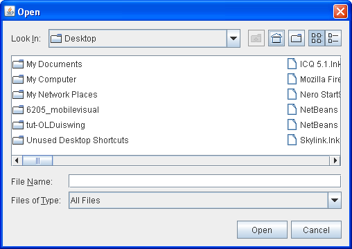
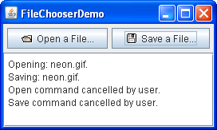
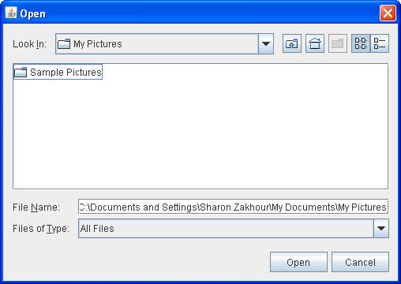

# 如何使用文件选择器

> 原文： [https://docs.oracle.com/javase/tutorial/uiswing/components/filechooser.html](https://docs.oracle.com/javase/tutorial/uiswing/components/filechooser.html)

文件选择器提供用于导航文件系统的 GUI，然后从列表中选择文件或目录，或输入文件或目录的名称。要显示文件选择器，通常使用`JFileChooser` API 显示包含文件选择器的模态[对话框](dialog.html)。呈现文件选择器的另一种方法是将 [`JFileChooser`](https://docs.oracle.com/javase/8/docs/api/javax/swing/JFileChooser.html) 的实例添加到容器中。

* * *

**Note:** 

如果您打算将程序作为沙箱 Java Web Start 应用程序分发，那么您应该使用 JNLP API 提供的文件服务，而不是使用`JFileChooser` API。这些服务 - `FileOpenService`和`FileSaveService` - 不仅支持在受限制的环境中选择文件，还可以实际打开和保存文件。使用这些服务的一个例子是 [JWSFileChooserDemo](../examples/components/index.html#JWSFileChooserDemo) 。有关使用 JNLP API 的文档可以在 [Java Web Start](../../deployment/webstart/index.html) 课程中找到。

* * *

单击“启动”按钮以使用 [Java™Web Start](http://www.oracle.com/technetwork/java/javase/javawebstart/index.html) （[下载 JDK 7 或更高版本](http://www.oracle.com/technetwork/java/javase/downloads/index.html)）运行 JWSFileChooserDemo。或者，要自己编译并运行示例，请参考[示例索引](../examples/components/index.html#JWSFileChooserDemo)。

[](https://docs.oracle.com/javase/tutorialJWS/samples/uiswing/JWSFileChooserDemoProject/JWSFileChooserDemo.jnlp)

使用`JWSFileChooserDemo`示例时，请注意不要丢失所需的文件。每当您单击“保存”按钮并选择现有文件时，此演示将显示“文件存在”对话框，其中包含替换文件的请求。接受请求会覆盖文件。

本节的其余部分讨论如何使用`JFileChooser` API。 `JFileChooser`对象仅显示用于选择文件的 GUI。您的程序负责对所选文件执行某些操作，例如打开或保存它。有关如何读取和写入文件的信息，请参阅[基本 I / O](../../essential/io/index.html) 。

`JFileChooser` API 可以轻松打开和保存对话框。外观类型决定了这些标准对话框的外观以及它们的区别。在 Java 外观中，保存对话框看起来与打开的对话框相同，除了对话框窗口上的标题和批准操作的按钮上的文本。下面是 Java 外观中标准打开对话框的图片：



这是一个名为`FileChooserDemo`的应用程序的图片，它显示一个打开的对话框和一个保存对话框。



* * *

**Try this:** 

1.  编译并运行该示例，请参考[示例索引](../examples/components/index.html#FileChooserDemo)。
2.  单击“打开文件”按钮。浏览文件选择器，选择一个文件，然后单击对话框的“打开”按钮。
3.  使用“保存文件”按钮打开保存对话框。尝试使用文件选择器上的所有控件。
4.  在源文件 [`FileChooserDemo.java`](../examples/components/FileChooserDemoProject/src/components/FileChooserDemo.java) 中，将文件选择模式更改为仅目录模式。 （搜索`DIRECTORIES_ONLY`并取消注释包含它的行。）然后再次编译并运行该示例。您将只能查看和选择目录，而不是普通文件。

* * *

打开标准的打开对话框只需要两行代码：

```java
//Create a file chooser
final JFileChooser fc = new JFileChooser();
...
//In response to a button click:
int returnVal = fc.showOpenDialog(aComponent);

```

`showOpenDialog`方法的参数指定对话框的父组件。父组件会影响对话框的位置以及对话框所依赖的框架。例如，Java 外观将对话框直接放在父组件上。如果父组件在框架中，则对话框取决于该框架。帧最小化时此对话框消失，帧最大化时再次出现。

默认情况下，之前未显示的文件选择器显示用户主目录中的所有文件。您可以使用`JFileChooser`的其他构造器之一指定文件选择器的初始目录，也可以使用`setCurrentDirectory`方法设置目录。

对`showOpenDialog`的调用出现在“打开文件”按钮的动作监听器的`actionPerformed`方法中：

```java
public void actionPerformed(ActionEvent e) {
    //Handle open button action.
    if (e.getSource() == openButton) {
        int returnVal = fc.showOpenDialog(FileChooserDemo.this);

        if (returnVal == JFileChooser.APPROVE_OPTION) {
            File file = fc.getSelectedFile();
            //This is where a real application would open the file.
            log.append("Opening: " + file.getName() + "." + newline);
        } else {
            log.append("Open command cancelled by user." + newline);
        }
   } ...
}

```

`show _Xxx_ Dialog`方法返回一个整数，指示用户是否选择了一个文件。根据您使用文件选择器的方式，通常可以检查返回值是否为`APPROVE_OPTION`，然后不更改任何其他值。要获取所选文件（或目录，如果设置文件选择器以允许目录选择），请调用文件选择器上的`getSelectedFile`方法。此方法返回 [`File`](https://docs.oracle.com/javase/8/docs/api/java/io/File.html) 的实例。

该示例获取文件的名称并在日志消息中使用它。您可以在`File`对象上调用其他方法，例如`getPath`，`isDirectory`或`exists`以获取有关该文件的信息。您还可以调用`delete`和`rename`等其他方法以某种方式更改文件。当然，您可能还希望使用 Java 平台提供的读取器或编写器类之一来打开或保存文件。有关使用读取器和写入器读取和写入文件系统数据的信息，请参见 [Basic I / O](../../essential/io/index.html) 。

示例程序使用`JFileChooser`类的相同实例来显示标准保存对话框。这次程序调用`showSaveDialog`：

```java
int returnVal = fc.showSaveDialog(FileChooserDemo.this);

```

通过使用相同的文件选择器实例来显示其打开和保存对话框，该程序获得了以下好处：

*   选择器会记住使用之间的当前目录，因此打开和保存版本会自动共享同一个当前目录。
*   您必须只自定义一个文件选择器，并且自定义应用于打开和保存版本。

最后，示例程序具有注释掉的代码行，可以让您更改文件选择模式。例如，以下代码行使文件选择器只能选择目录，而不能选择文件：

```java
fc.setFileSelectionMode(JFileChooser.DIRECTORIES_ONLY);

```

另一种可能的选择模式是`FILES_AND_DIRECTORIES`。默认值为`FILES_ONLY`。下图显示了文件选择模式设置为`DIRECTORIES_ONLY`的打开对话框。请注意，至少在 Java 外观中，只有目录可见 - 而不是文件。



如果要为打开或保存以外的任务创建文件选择器，或者如果要自定义文件选择器，请继续阅读。我们将讨论以下主题：

*   [另一个例子：FileChooserDemo2](#advancedexample)
*   [使用文件选择器进行自定义任务](#customtask)
*   [过滤文件列表](#filters)
*   [自定义文件视图](#fileview)
*   [提供附件](#accessory)
*   [文件选择器 API](#api)
*   [使用文件选择器的示例](#eg)

让我们看看 [`FileChooserDemo2`](../examples/components/index.html#FileChooserDemo2) 示例，它是使用更多`JFileChooser` API 的上一个演示程序的修改版本。此示例使用已以多种方式自定义的文件选择器。与原始示例一样，用户只需按一下按钮即可调用文件选择器。这是文件选择器的图片：


如图所示，此文件选择器已针对特殊任务（Attach）进行了自定义，提供了用户可选文件过滤器（Just Images），使用特殊文件视图查看图像文件，并具有显示缩略图草图的附件组件当前所选图像文件的。

本节的其余部分将向您展示创建和自定义此文件选择器的代码。有关此示例所需的所有文件的链接，请参见[示例索引](../examples/components/index.html#FileChooserDemo2)。

如您所见，`JFileChooser`类提供用于显示打开对话框的`showOpenDialog`方法和用于显示保存对话框的`showSaveDialog`方法。

该类有另一种方法`showDialog`，用于在对话框中显示自定义任务的文件选择器。在 Java 外观中，此对话框与其他文件选择器对话框之间的唯一区别是对话框窗口上的标题和批准按钮上的标签。以下是来自`FileChooserDemo2`的代码，它会显示 Attach 任务的文件选择器对话框：

```java
JFileChooser fc = new JFileChooser();
int returnVal = fc.showDialog(FileChooserDemo2.this, "Attach");

```

`showDialog`方法的第一个参数是对话框的父组件。第二个参数是`String`对象，它提供对话框窗口的标题和批准按钮的标签。

再次，文件选择器不会对所选文件执行任何操作。该程序负责实现为其创建文件选择器的自定义任务。

默认情况下，文件选择器显示它检测到的所有文件和目录，隐藏文件除外。程序可以将一个或多个 _ 文件过滤器 _ 应用于文件选择器，以便选择器仅显示一些文件。文件选择器为每个文件调用过滤器的`accept`方法以确定是否应该显示它。文件筛选器根据文件类型，大小，所有权等条件接受或拒绝文件。过滤器会影响文件选择器显示的文件列表。即使没有显示，用户也可以输入任何文件的名称。

`JFileChooser`支持三种不同的过滤。将按此处列出的顺序检查过滤器。例如，应用程序控制的过滤器只能看到内置过滤接受的那些文件。

**Built-in filtering**

Filtering is set up through specific method calls on a file chooser. Currently the only built-in filter available is for hidden files, such as those whose names begin with period (.) on UNIX systems. By default, hidden files are not shown. Call `setFileHidingEnabled(false)` to show hidden files.

**Application-controlled filtering**

The application determines which files are shown. Create a custom subclass of [`FileFilter`](https://docs.oracle.com/javase/8/docs/api/javax/swing/filechooser/FileFilter.html), instantiate it, and use the instance as an argument to the `setFileFilter` method. The installed filter is displayed on the list of user-choosable filters. The file chooser shows only those files that the filter accepts.

**User-choosable filtering**

The file chooser GUI provides a list of filters that the user can choose from. When the user chooses a filter, the file chooser shows only those files accepted by that filter. `FileChooserDemo2` adds a custom file filter to the list of user-choosable filters:

```java
fc.addChoosableFileFilter(new ImageFilter());

```

By default, the list of user-choosable filters includes the Accept All filter, which enables the user to see all non-hidden files. This example uses the following code to disable the Accept All filter:

```java
fc.setAcceptAllFileFilterUsed(false);

```

Our custom file filter is implemented in [`ImageFilter.java`](../examples/components/FileChooserDemo2Project/src/components/ImageFilter.java) and is a subclass of `FileFilter`. The `ImageFilter` class implements the `getDescription` method to return "Just Images" — a string to put in the list of user-choosable filters. `ImageFilter` also implements the `accept` method so that it accepts all directories and any file that has a `.png`, `.jpg`, `.jpeg`, `.gif`, `.tif`, or `.tiff` filename extension.

```java
public boolean accept(File f) {
    if (f.isDirectory()) {
        return true;
    }

    String extension = Utils.getExtension(f);
    if (extension != null) {
        if (extension.equals(Utils.tiff) ||
            extension.equals(Utils.tif) ||
            extension.equals(Utils.gif) ||
            extension.equals(Utils.jpeg) ||
            extension.equals(Utils.jpg) ||
            extension.equals(Utils.png)) {
                return true;
        } else {
            return false;
        }
    }

    return false;
}

```

By accepting all directories, this filter allows the user to navigate around the file system. If the bold lines were omitted from this method, the user would be limited to the directory with which the chooser was initialized.

上面的代码示例使用`getExtension`方法和 [`Utils.java`](../examples/components/FileChooserDemo2Project/src/components/Utils.java) 中的几个字符串常量，如下所示：

```java
public class Utils {

    public final static String jpeg = "jpeg";
    public final static String jpg = "jpg";
    public final static String gif = "gif";
    public final static String tiff = "tiff";
    public final static String tif = "tif";
    public final static String png = "png";

    /*
     * Get the extension of a file.
     */  
    public static String getExtension(File f) {
        String ext = null;
        String s = f.getName();
        int i = s.lastIndexOf('.');

        if (i &gt; 0 &&  i &lt; s.length() - 1) {
            ext = s.substring(i+1).toLowerCase();
        }
        return ext;
    }
}

```

在 Java 外观中，选择器列表显示每个文件的名称，并显示一个小图标，表示文件是真文件还是目录。您可以通过创建 [`FileView`](https://docs.oracle.com/javase/8/docs/api/javax/swing/filechooser/FileView.html) 的自定义子类并使用该类的实例作为`setFileView`方法的参数来自定义此 _ 文件视图 _。该示例使用在 [`ImageFileView.java`](../examples/components/FileChooserDemo2Project/src/components/ImageFileView.java) 中实现的自定义类的实例作为文件选择器的文件视图。

```java
fc.setFileView(new ImageFileView());

```

`ImageFileView`类为前面描述的图像滤镜接受的每种图像显示不同的图标。

`ImageFileView`类覆盖`FileView`中定义的五个抽象方法，如下所示。

**`String getTypeDescription(File f)`**

Returns a description of the file type. Here is `ImageFileView`'s implementation of this method:

```java
public String getTypeDescription(File f) {
    String extension = Utils.getExtension(f);
    String type = null;

    if (extension != null) {
        if (extension.equals(Utils.jpeg) ||
            extension.equals(Utils.jpg)) {
            type = "JPEG Image";
        } else if (extension.equals(Utils.gif)){
            type = "GIF Image";
        } else if (extension.equals(Utils.tiff) ||
                   extension.equals(Utils.tif)) {
            type = "TIFF Image";
        } else if (extension.equals(Utils.png)){
            type = "PNG Image";
        }
    }
    return type;
}

```

**`Icon getIcon(File f)`**

Returns an icon representing the file or its type. Here is `ImageFileView`'s implementation of this method:

```java
public Icon getIcon(File f) {
    String extension = Utils.getExtension(f);
    Icon icon = null;

    if (extension != null) {
        if (extension.equals(Utils.jpeg) ||
            extension.equals(Utils.jpg)) {
            icon = jpgIcon;
        } else if (extension.equals(Utils.gif)) {
            icon = gifIcon;
        } else if (extension.equals(Utils.tiff) ||
                   extension.equals(Utils.tif)) {
            icon = tiffIcon;
        } else if (extension.equals(Utils.png)) {
            icon = pngIcon;
        }
    }
    return icon;
}

```

**`String getName(File f)`**

Returns the name of the file. Most implementations of this method should return `null` to indicate that the look and feel should figure it out. Another common implementation returns `f.getName()`.

**`String getDescription(File f)`**

Returns a description of the file. The intent is to describe individual files more specifically. A common implementation of this method returns `null` to indicate that the look and feel should figure it out.

**`Boolean isTraversable(File f)`**

Returns whether a directory is traversable. Most implementations of this method should return `null` to indicate that the look and feel should figure it out. Some applications might want to prevent users from descending into a certain type of directory because it represents a compound document. The `isTraversable` method should never return `true` for a non-directory.

`FileChooserDemo2`中的自定义文件选择器具有附件组件。如果当前所选项目是 PNG，JPEG，TIFF 或 GIF 图像，则附件组件将显示图像的缩略图草图。否则，附件组件为空。除了预览器之外，附件组件最常见的用途可能是面板上有更多控件，例如在功能之间切换的复选框。

该示例调用`setAccessory`方法在 [`ImagePreview.java`](../examples/components/FileChooserDemo2Project/src/components/ImagePreview.java) 中实现`ImagePreview`类的实例，作为选择器的附件组件：

```java
fc.setAccessory(new ImagePreview(fc));

```

从`JComponent`类继承的任何对象都可以是附件组件。该组件应具有在文件选择器中看起来很好的首选大小。

当用户选择列表中的项目时，文件选择器将触发属性更改事件。具有附件组件的程序必须注册以接收这些事件以在选择改变时更新附件组件。在该示例中，`ImagePreview`对象本身为这些事件注册。这使得与附件组件相关的所有代码保持在一个类中。

下面是`propertyChange`方法的示例实现，它是触发属性更改事件时调用的方法：

```java
//where member variables are declared
File file = null;
...
public void propertyChange(PropertyChangeEvent e) {
    boolean update = false;
    String prop = e.getPropertyName();

    //If the directory changed, don't show an image.
    if (JFileChooser.DIRECTORY_CHANGED_PROPERTY.equals(prop)) {
        file = null;
        update = true;

    //If a file became selected, find out which one.
    } else if (JFileChooser.SELECTED_FILE_CHANGED_PROPERTY.equals(prop)) {
        file = (File) e.getNewValue();
        update = true;
    }

    //Update the preview accordingly.
    if (update) {
        thumbnail = null;
        if (isShowing()) {
            loadImage();
            repaint();
        }
    }
}

```

如果`SELECTED_FILE_CHANGED_PROPERTY`是更改的属性，则此方法从文件选择器获取`File`对象。 `loadImage`和`repaint`方法使用`File`对象加载图像并重新绘制附件组件。

使用文件选择器的 API 属于以下类别：

*   [创建和显示文件选择器](#show)
*   [选择文件和目录](#selection)
*   [导航文件选择器列表](#navigation)
*   [自定义文件选择器](#customization)


| 方法或构造器 | 目的 |
| :-- | :-- |
| [JFileChooser（）](https://docs.oracle.com/javase/8/docs/api/javax/swing/JFileChooser.html#JFileChooser--)
[JFileChooser（文件）](https://docs.oracle.com/javase/8/docs/api/javax/swing/JFileChooser.html#JFileChooser-java.io.File-)
[JFileChooser（String）](https://docs.oracle.com/javase/8/docs/api/javax/swing/JFileChooser.html#JFileChooser-java.lang.String-) | 创建文件选择器实例。 `File`和`String`参数（如果存在）提供初始目录。 |
| [int showOpenDialog（Component）](https://docs.oracle.com/javase/8/docs/api/javax/swing/JFileChooser.html#showOpenDialog-java.awt.Component-)
[int showSaveDialog（Component）](https://docs.oracle.com/javase/8/docs/api/javax/swing/JFileChooser.html#showSaveDialog-java.awt.Component-)
[int showDialog（Component，String）](https://docs.oracle.com/javase/8/docs/api/javax/swing/JFileChooser.html#showDialog-java.awt.Component-java.lang.String-) | 显示包含文件选择器的模式对话框。如果用户批准了操作，这些方法将返回`APPROVE_OPTION`，如果用户取消操作，则返回`CANCEL_OPTION`。另一个可能的返回值是`ERROR_OPTION`，这意味着发生了意外错误。 |


| 方法 | 目的 |
| :-- | :-- |
| [void setSelectedFile（File）](https://docs.oracle.com/javase/8/docs/api/javax/swing/JFileChooser.html#setSelectedFile-java.io.File-)
[File getSelectedFile（）](https://docs.oracle.com/javase/8/docs/api/javax/swing/JFileChooser.html#getSelectedFile--) | 设置或获取当前选定的文件或（如果已启用目录选择）目录。 |
| [void setSelectedFiles（File []）](https://docs.oracle.com/javase/8/docs/api/javax/swing/JFileChooser.html#setSelectedFiles-java.io.File:A-)
[File [] getSelectedFiles（）](https://docs.oracle.com/javase/8/docs/api/javax/swing/JFileChooser.html#getSelectedFiles--) | 如果文件选择器设置为允许多个选择，则设置或获取当前选定的文件。 |
| [void setFileSelectionMode（int）](https://docs.oracle.com/javase/8/docs/api/javax/swing/JFileChooser.html#setFileSelectionMode-int-)
[void getFileSelectionMode（）](https://docs.oracle.com/javase/8/docs/api/javax/swing/JFileChooser.html#getFileSelectionMode--)
[boolean isDirectorySelectionEnabled（）](https://docs.oracle.com/javase/8/docs/api/javax/swing/JFileChooser.html#isDirectorySelectionEnabled--)
[boolean isFileSelectionEnabled（）](https://docs.oracle.com/javase/8/docs/api/javax/swing/JFileChooser.html#isFileSelectionEnabled--) | 设置或获取文件选择模式。可接受的值为`FILES_ONLY`（默认值），`DIRECTORIES_ONLY`和`FILES_AND_DIRECTORIES`。
根据当前选择模式解释目录或文件是否可选。 |
| [void setMultiSelectionEnabled（boolean）](https://docs.oracle.com/javase/8/docs/api/javax/swing/JFileChooser.html#setMultiSelectionEnabled-boolean-)
[boolean isMultiSelectionEnabled（）](https://docs.oracle.com/javase/8/docs/api/javax/swing/JFileChooser.html#isMultiSelectionEnabled--) | 设置或解释是否可以一次选择多个文件。默认情况下，用户只能选择一个文件。 |
| [void setAcceptAllFileFilterUsed（boolean）](https://docs.oracle.com/javase/8/docs/api/javax/swing/JFileChooser.html#setAcceptAllFileFilterUsed-boolean-)
[boolean isAcceptAllFileFilterUsed（）](https://docs.oracle.com/javase/8/docs/api/javax/swing/JFileChooser.html#isAcceptAllFileFilterUsed--) | 设置或获取`AcceptAll`文件过滤器是否在可选择的过滤器列表中用作允许选择;默认值为`true`。 |
| [Dialog createDialog（Component）](https://docs.oracle.com/javase/8/docs/api/javax/swing/JFileChooser.html#createDialog-java.awt.Component-) | 给定父组件，创建并返回包含此文件选择器的新对话框，该对话框取决于父框架，并且以父组件为中心。 |


| 方法 | 目的 |
| :-- | :-- |
| [void ensureFileIsVisible（File）](https://docs.oracle.com/javase/8/docs/api/javax/swing/JFileChooser.html#ensureFileIsVisible-java.io.File-) | 滚动文件选择器列表，使指示的文件可见。 |
| [void setCurrentDirectory（File）](https://docs.oracle.com/javase/8/docs/api/javax/swing/JFileChooser.html#setCurrentDirectory-java.io.File-)
[File getCurrentDirectory（）](https://docs.oracle.com/javase/8/docs/api/javax/swing/JFileChooser.html#getCurrentDirectory--) | 设置或获取其文件显示在文件选择器列表中的目录。 |
| [void changeToParentDirectory（）](https://docs.oracle.com/javase/8/docs/api/javax/swing/JFileChooser.html#changeToParentDirectory--) | 更改列表以显示当前目录的父级。 |
| [void rescanCurrentDirectory（）](https://docs.oracle.com/javase/8/docs/api/javax/swing/JFileChooser.html#rescanCurrentDirectory--) | 检查文件系统并更新选择器列表。 |
| [void setDragEnabled（boolean）](https://docs.oracle.com/javase/8/docs/api/javax/swing/JFileChooser.html#setDragEnabled-boolean-)
[boolean getDragEnabled（）](https://docs.oracle.com/javase/8/docs/api/javax/swing/JFileChooser.html#getDragEnabled--) | 设置或获取确定是否启用自动拖动处理的属性。有关详细信息，请参阅[拖放和数据传输](../dnd/index.html)。 |


| 方法 | 目的 |
| :-- | :-- |
| [void setAccessory（javax.swing.JComponent）](https://docs.oracle.com/javase/8/docs/api/javax/swing/JFileChooser.html#setAccessory-javax.swing.JComponent-)
[JComponent getAccessory（）](https://docs.oracle.com/javase/8/docs/api/javax/swing/JFileChooser.html#getAccessory--) | 设置或获取文件选择器的附件组件。 |
| [void setFileFilter（FileFilter）](https://docs.oracle.com/javase/8/docs/api/javax/swing/JFileChooser.html#setFileFilter-javax.swing.filechooser.FileFilter-)
[FileFilter getFileFilter（）](https://docs.oracle.com/javase/8/docs/api/javax/swing/JFileChooser.html#getFileFilter--) | 设置或获取文件选择器的主文件筛选器。 |
| [void setFileView（FileView）](https://docs.oracle.com/javase/8/docs/api/javax/swing/JFileChooser.html#setFileView-javax.swing.filechooser.FileView-)
[FileView getFileView（）](https://docs.oracle.com/javase/8/docs/api/javax/swing/JFileChooser.html#getFileView--) | 设置或获取选择器的文件视图。 |
| [FileFilter [] getChoosableFileFilters（）](https://docs.oracle.com/javase/8/docs/api/javax/swing/JFileChooser.html#getChoosableFileFilters--)
[void addChoosableFileFilter（FileFilter）](https://docs.oracle.com/javase/8/docs/api/javax/swing/JFileChooser.html#addChoosableFileFilter-javax.swing.filechooser.FileFilter-)
[boolean removeChoosableFileFilter（FileFilter）](https://docs.oracle.com/javase/8/docs/api/javax/swing/JFileChooser.html#removeChoosableFileFilter-javax.swing.filechooser.FileFilter-)
[void resetChoosableFileFilters（）](https://docs.oracle.com/javase/8/docs/api/javax/swing/JFileChooser.html#resetChoosableFileFilters--)
[FileFilter getAcceptAllFileFilter（）](https://docs.oracle.com/javase/8/docs/api/javax/swing/JFileChooser.html#getAcceptAllFileFilter--) | 设置，获取或修改用户可选文件过滤器列表。 |
| [void setFileHidingEnabled（boolean）](https://docs.oracle.com/javase/8/docs/api/javax/swing/JFileChooser.html#setFileHidingEnabled-boolean-)
[boolean isFileHidingEnabled（）](https://docs.oracle.com/javase/8/docs/api/javax/swing/JFileChooser.html#isFileHidingEnabled--) | 设置或获取是否显示隐藏文件。 |
| [void setControlButtonsAreShown（boolean）](https://docs.oracle.com/javase/8/docs/api/javax/swing/JFileChooser.html#setControlButtonsAreShown-boolean-)
[boolean getControlButtonsAreShown（）](https://docs.oracle.com/javase/8/docs/api/javax/swing/JFileChooser.html#getControlButtonsAreShown--) | 设置或获取指示“文件选择器”中是否显示“批准”和“取消”按钮的属性。默认情况下，此属性为 true。 |

此表显示了使用文件选择器的示例，并指出了描述这些示例的位置。

| 例 | 在哪里描述 | 笔记 |
| :-- | :-- | :-- |
| [`FileChooserDemo`](../examples/components/index.html#FileChooserDemo) | 这个部分 | 显示打开的对话框和保存对话框。 |
| [`FileChooserDemo2`](../examples/components/index.html#FileChooserDemo2) | 这个部分 | 使用具有自定义过滤，自定义文件视图和附件组件的文件选择器。 |
| [`JWSFileChooserDemo`](../examples/components/index.html#JWSFileChooserDemo) | 这个部分 | 使用 JNLP API 打开并保存文件。 |