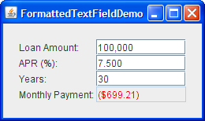
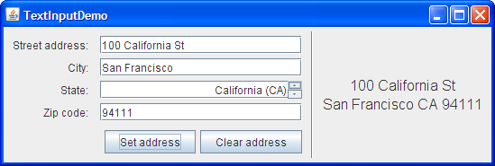
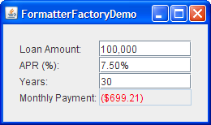
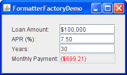

# 如何使用格式化文本字段

> 原文： [https://docs.oracle.com/javase/tutorial/uiswing/components/formattedtextfield.html](https://docs.oracle.com/javase/tutorial/uiswing/components/formattedtextfield.html)

格式化文本字段为开发人员提供了一种指定可在文本字段中键入的有效字符集的方法。具体来说， [`JFormattedTextField`](https://docs.oracle.com/javase/8/docs/api/javax/swing/JFormattedTextField.html) 类将 _ 格式化程序 _ 和对象 _ 值 _ 添加到从`JTextField`类继承的特征。格式化程序将字段的值转换为它显示的文本，将文本转换为字段的值。

使用 Swing 提供的格式化程序，您可以设置格式化文本字段，以本地化格式键入日期和数字。另一种格式化程序使您可以使用字符掩码来指定可在字段中的每个位置键入的字符集。例如，您可以指定用于以特定格式键入电话号码的掩码，例如（XX）X-XX-XX-XX-XX。

如果格式化文本字段的可能值具有明显的顺序，请改用[微调器](spinner.html)。微调器默认使用格式化文本字段，但添加了两个按钮，使用户可以选择序列中的值。

使用格式化文本字段的另一个替代或辅助是在字段上安装[输入验证程序](../misc/focus.html#inputVerification)。当组件几乎失去键盘焦点时，将调用组件的输入验证器。输入验证程序使您可以检查组件的值是否有效，并可选择更改它或停止传输焦点。

此 GUI 使用格式化文本字段以四种不同格式显示数字。



* * *

**Try this:** 

1.  单击“启动”按钮以使用 [Java™Web Start](http://www.oracle.com/technetwork/java/javase/javawebstart/index.html) （[下载 JDK 7 或更高版本](http://www.oracle.com/technetwork/java/javase/downloads/index.html)）运行 FormattedTextFieldDemo。或者，要自己编译并运行示例，请参考[示例索引](../examples/components/index.html#FormattedTextFieldDemo)。 [](https://docs.oracle.com/javase/tutorialJWS/samples/uiswing/FormattedTextFieldDemoProject/FormattedTextFieldDemo.jnlp) 

2.  尝试不同的贷款金额，年度百分比率（APR）和贷款期限。
    请注意，只要您输入的文本有效，当您按 Enter 键或将焦点移出您正在编辑的字段时，月份付款字段就会更新。
3.  在 Loan Amount 字段中键入无效文本，例如“abcd”，然后按 Enter 键。
    月付款字段保持不变。当您从“贷款金额”字段移动焦点时，文本将恢复为该字段的上一个有效值。
4.  在贷款金额字段中键入边际有效的文本，例如“2000abcd”，然后按 Enter 键。
    月度付款字段已更新，但贷款金额字段仍显示`2000abcd`。当您从“贷款金额”字段移动焦点时，它显示的文本将更新为其值的整齐格式版本，例如“2,000”。

* * *

您可以在 [``FormattedTextFieldDemo.java``](../examples/components/FormattedTextFieldDemoProject/src/components/FormattedTextFieldDemo.java)中找到该程序的完整代码。此代码创建第一个字段。

```
amountField = new JFormattedTextField(amountFormat);
amountField.setValue(new Double(amount));
amountField.setColumns(10);
amountField.addPropertyChangeListener("value", this);
...
amountFormat = NumberFormat.getNumberInstance();

```

用于创建`amountField`对象的构造器采用`java.text.Format`参数。字段的格式化程序使用`Format`对象将字段的值转换为文本，将文本转换为字段的值。

其余代码设置`amountField`对象。 `setValue`方法将字段的 value 属性设置为表示为`Double`对象的浮点数。从`JTextField`类继承的`setColumns`方法提示字段的首选大小。对`addPropertyChangeListener`方法的调用为该字段的 value 属性注册一个监听器，因此每当用户更改贷款金额时，程序都可以更新每月付款字段。

本节的其余部分包括以下主题：

*   [创建和初始化格式化文本字段](#constructors)
*   [设定并获得田地的价值](#value)
*   [指定格式](#format)
*   [使用 MaskFormatter](#maskformatter)
*   [指定格式化程序并使用 Formatter 工厂](#factory)

本节不解释从`JTextField`类继承的 API。该 API 在[如何使用文本字段](textfield.html)中描述。

以下代码创建并初始化`FormattedTextFieldDemo`示例中的其余三个字段。

```
rateField = new JFormattedTextField(percentFormat);
rateField.setValue(new Double(rate));
rateField.setColumns(10);
rateField.addPropertyChangeListener("value", this);

numPeriodsField = new JFormattedTextField();
numPeriodsField.setValue(new Integer(numPeriods));
numPeriodsField.setColumns(10);
numPeriodsField.addPropertyChangeListener("value", this);

paymentField = new JFormattedTextField(paymentFormat);
paymentField.setValue(new Double(payment));
paymentField.setColumns(10);
paymentField.setEditable(false);
paymentField.setForeground(Color.red);

...
percentFormat = NumberFormat.getNumberInstance();
percentFormat.setMinimumFractionDigits(2);

paymentFormat = NumberFormat.getCurrencyInstance();

```

设置`rateField`对象的代码几乎与之前为其他字段列出的代码相同。唯一的区别是，由于代码`percentFormat.setMinimumFractionDigits(2)`，格式略有不同。

创建`numPeriodsField`对象的代码未显式设置格式或格式化程序。相反，它将值设置为`Integer`并使该字段能够使用`Integer`对象的默认格式化程序。代码在前两个字段中没有执行此操作，因为默认格式化程序未用于`Double`对象。结果不是所需要的。本节后面将介绍如何指定格式和格式化程序。

付款字段与其他字段不同，因为它不可编辑，为其文本使用不同的颜色，并且没有属性更改侦听器。否则，它与其他字段相同。我们本可以选择使用[文本字段](textfield.html)或[标签](label.html)。无论组件是什么，我们仍然可以使用`paymentFormat`方法将付款金额解析为要显示的文本。

使用带格式的文本字段时，请记住以下几点：

* * *

**格式化文本字段的 _ 文本 _ 及其 _ 值 _ 是两个不同的属性，值通常落后于文本。**

* * *

_text_ 属性由`JTextField`类定义。此属性始终反映字段显示的内容。由`JFormattedTextField`类定义的 _ 值 _ 属性可能不会反映字段中显示的最新文本。当用户键入时，text 属性会更改，但 value 属性不会更改，直到更改为。

更准确地说，可以使用`setValue`方法或`commitEdit`方法设置格式化文本字段的值。 `setValue`方法将值设置为指定的参数。该参数在技术上可以是任何`Object`，但格式化程序需要能够将其转换为字符串。否则，文本字段不显示任何实质性信息。

`commitEdit`方法将值设置为格式化程序确定的任何对象，由字段的文本表示。发生以下任一情况时，将自动调用`commitEdit`方法：

*   当用户按下 Enter 键时，该字段具有焦点。
*   默认情况下，当字段失去焦点时，例如，当用户按 Tab 键将焦点更改为另一个组件时。当字段失去焦点时，您可以使用`setFocusLostBehavior`方法指定不同的结果。

* * *

**Note:** 

某些格式化程序可能会不断更新值，导致焦点丢失毫无意义，因为值始终与文本指定的值相同。

* * *

设置格式化文本字段的值时，将更新字段的文本以反映该值。具体如何将值表示为文本取决于字段的格式化程序。

请注意，虽然`JFormattedTextField`类继承了`JTextField`类的`setText`方法，但通常不会在格式化的文本字段上调用`setText`方法。如果这样做，字段的显示会相应更改但值不会更新（除非字段的格式化程序不断更新）。

要获取格式化文本字段的当前值，请使用`getValue`方法。如有必要，可以通过在`getValue`之前调用`commitEdit`方法来确保该值反映文本。因为`getValue`方法返回`Object`，所以需要将其强制转换为用于字段值的类型。例如：

```
Date enteredDate = (Date)dateField.getValue();

```

要检测格式化文本字段值的更改，可以在格式化文本字段上注册属性更改侦听器，以侦听对“value”属性的更改。属性更改侦听器取自`FormattedTextFieldDemo`示例：

```
//The property change listener is registered on each
//field using code like this:
//    someField.addPropertyChangeListener("value", this);

/** Called when a field's "value" property changes. */
public void propertyChange(PropertyChangeEvent e) {
    Object source = e.getSource();
    if (source == amountField) {
        amount = ((Number)amountField.getValue()).doubleValue();
    } else if (source == rateField) {
        rate = ((Number)rateField.getValue()).doubleValue();
    } else if (source == numPeriodsField) {
        numPeriods = ((Number)numPeriodsField.getValue()).intValue();
    }

    double payment = computePayment(amount, rate, numPeriods);
    paymentField.setValue(new Double(payment));
}

```

[`Format`](https://docs.oracle.com/javase/8/docs/api/java/text/Format.html) 类提供了一种格式化区域设置敏感信息（如日期和数字）的方法。来自 [`InternationalFormatter`](https://docs.oracle.com/javase/8/docs/api/javax/swing/text/InternationalFormatter.html) 类的格式化程序，例如 [`DateFormatter`](https://docs.oracle.com/javase/8/docs/api/javax/swing/text/DateFormatter.html) 和 [`NumberFormatter`](https://docs.oracle.com/javase/8/docs/api/javax/swing/text/NumberFormatter.html) 类，使用`Format`对象在字段之间进行转换文字和价值。您可以通过调用 [`DateFormat`](https://docs.oracle.com/javase/8/docs/api/java/text/DateFormat.html) 或 [`NumberFormat`](https://docs.oracle.com/javase/8/docs/api/java/text/NumberFormat.html) 类中的一种工厂方法，或使用 [`SimpleDateFormat`之一来获取`Format`对象](https://docs.oracle.com/javase/8/docs/api/java/text/SimpleDateFormat.html)构造器。

* * *

**Note:** 

第三种常用的格式化程序类`MaskFormatter`不是来自`InternationalFormatter`类而不使用格式。 `MaskFormatter`在[中使用 MaskFormatter](#maskformatter) 进行了讨论。

* * *

您可以在创建`Format`对象时自定义某些格式方面，而通过特定于格式的 API 自定义其他格式方面。例如， [`DecimalFormat`](https://docs.oracle.com/javase/8/docs/api/java/text/DecimalFormat.html) 对象继承自`NumberFormat`并且通常由其工厂方法返回，可以使用`setMaximumFractionDigits`和`setNegativePrefix`方法进行自定义。有关使用`Format`对象的信息，请参阅国际化路径的[格式化](../../i18n/format/index.html)课程。

将自定义格式与格式化文本字段相关联的最简单方法是使用以`Format`作为参数的`JFormattedTextField`构造器创建字段。您可以在之前的代码示例中看到创建`amountField`和`rateField`对象的关联。

[`MaskFormatter`](https://docs.oracle.com/javase/8/docs/api/javax/swing/text/MaskFormatter.html) 类实现了一个格式化程序，它准确指定字段文本的每个位置中哪些字符有效。例如，以下代码创建`MaskFormatter`，允许用户键入五位邮政编码：

```
zipField = new JFormattedTextField(
                    createFormatter("#####"));
...
protected MaskFormatter createFormatter(String s) {
    MaskFormatter formatter = null;
    try {
        formatter = new MaskFormatter(s);
    } catch (java.text.ParseException exc) {
        System.err.println("formatter is bad: " + exc.getMessage());
        System.exit(-1);
    }
    return formatter;
}

```

您可以通过运行`TextInputDemo`来尝试上述代码的结果。单击“启动”按钮以使用 [Java™Web Start](http://www.oracle.com/technetwork/java/javase/javawebstart/index.html) （[下载 JDK 7 或更高版本](http://www.oracle.com/technetwork/java/javase/downloads/index.html)）运行 TextInputDemo。或者，要自己编译并运行示例，请参考[示例索引](../examples/components/index.html#TextInputDemo)。

[](https://docs.oracle.com/javase/tutorialJWS/samples/uiswing/TextInputDemoProject/TextInputDemo.jnlp)

显示程序的 GUI。



下表显示了可以在格式设置掩码中使用的字符：

| 字符 | 描述 |
| :-: | :-- |
| ＃ | 任何有效数字（`Character.isDigit`）。 |
| '
_（单引号）_ | 转义字符，用于转义任何特殊格式字符。 |
| ü | 任何字符（`Character.isLetter`）。所有小写​​字母都映射为大写。 |
| 大号 | 任何字符（`Character.isLetter`）。所有大写字母都映射为小写。 |
| 一个 | 任何字符或数字（`Character.isLetter`或`Character.isDigit`）。 |
| ？ | 任何字符（`Character.isLetter`）。 |
| * | 任何东西。 |
| H | 任何十六进制字符（0-9，a-f 或 A-F）。 |

指定格式化程序时，请记住每个格式化程序对象最多只能由一个格式化文本字段使用。每个字段应至少有一个与之关联的格式化程序，其中任何一个都可以随时使用。

您可以通过多种方式指定格式化文本字段使用的格式化程序：

*   **使用带有`Format`参数的`JFormattedTextField`构造器。**
    自动创建使用指定格式的字段格式化程序。
*   **使用带有`JFormattedTextField.AbstractFormatter`参数的`JFormattedTextField`构造器。**
    指定的格式化程序用于该字段。
*   **设置未指定格式，格式化程序或格式化程序工厂的格式化文本字段的值。**
    默认格式化工厂将格式化程序分配给字段，使用字段值的类型作为指导。如果值为`Date`，则格式化程序为`DateFormatter`。如果值为`Number`，则格式化程序为`NumberFormatter`。其他类型导致`DefaultFormatter`的实例。
*   **使格式化文本字段使用返回自定义格式化程序对象的格式化程序工厂。**
    这是最灵活的方法。当您想要将多个格式化程序与字段关联或添加要用于多个字段的新格式化程序时，它非常有用。前一种用法的示例是解释用户以某种方式键入但以另一种方式显示值（当用户未键入时）的字段。后一种用法的一个例子是具有自定义类值的几个字段，例如`PhoneNumber`。您可以设置字段以使用格式化工厂返回电话号码的专用格式化程序。

您可以通过使用带有格式化程序工厂参数的构造器创建字段，或者通过在字段上调用`setFormatterFactory`方法来设置字段的格式化程序工厂。要创建格式化程序工厂，通常可以使用 [`DefaultFormatterFactory`](https://docs.oracle.com/javase/8/docs/api/javax/swing/text/DefaultFormatterFactory.html) 类的实例。使用`DefaultFormatterFactory`对象可以指定在编辑值，未编辑值或具有空值时返回的格式化程序。

下图显示了基于`FormattedTextFieldDemo`示例的应用程序，该示例使用 formatter 工厂为 Loan Amount 和 APR 字段设置多个编辑器。当用户正在编辑贷款金额时，不使用$字符，因此不会强制用户键入它。同样，在用户编辑 APR 字段时，不需要％字符。

单击“启动”按钮以使用 [Java™Web Start](http://www.oracle.com/technetwork/java/javase/javawebstart/index.html) （[下载 JDK 7 或更高版本](http://www.oracle.com/technetwork/java/javase/downloads/index.html)）运行 FormatterFactoryDe​​mo。或者，要自己编译并运行示例，请参考[示例索引](../examples/components/index.html#FormatterFactoryDemo)。

[](https://docs.oracle.com/javase/tutorialJWS/samples/uiswing/FormatterFactoryDemoProject/FormatterFactoryDemo.jnlp)

 

以下代码创建格式化程序并使用`DefaultFormatterFactory`类的实例进行设置：

```
private double rate = .075;  //7.5 %
...
amountField = new JFormattedTextField(
                    new DefaultFormatterFactory(
                        new NumberFormatter(amountDisplayFormat),
                        new NumberFormatter(amountDisplayFormat),
                        new NumberFormatter(amountEditFormat)));
...
NumberFormatter percentEditFormatter =
        new NumberFormatter(percentEditFormat) {
    public String valueToString(Object o)
          throws ParseException {
        Number number = (Number)o;
        if (number != null) {
            double d = number.doubleValue() * 100.0;
            number = new Double(d);
        }
        return super.valueToString(number);
    }
    public Object stringToValue(String s)
           throws ParseException {
        Number number = (Number)super.stringToValue(s);
        if (number != null) {
            double d = number.doubleValue() / 100.0;
            number = new Double(d);
        }
        return number;
    }
};
rateField = new JFormattedTextField(
                     new DefaultFormatterFactory(
                        new NumberFormatter(percentDisplayFormat),
                        new NumberFormatter(percentDisplayFormat),
                        percentEditFormatter));
...
amountDisplayFormat = NumberFormat.getCurrencyInstance();
amountDisplayFormat.setMinimumFractionDigits(0);
amountEditFormat = NumberFormat.getNumberInstance();

percentDisplayFormat = NumberFormat.getPercentInstance();
percentDisplayFormat.setMinimumFractionDigits(2);
percentEditFormat = NumberFormat.getNumberInstance();
percentEditFormat.setMinimumFractionDigits(2);

```

粗体代码突出显示对`DefaultFormatterFactory`构造器的调用。构造器的第一个参数指定用于格式化文本字段的默认格式化程序。第二个参数指定显示格式化程序，在字段没有焦点时使用。第三个参数指定编辑格式化程序，该字段具有焦点时使用。代码不使用第四个参数，但如果是，则第四个参数将指定 null 格式化程序，当字段的值为 null 时使用该格式化程序。由于未指定 null 格式化程序，因此在值为 null 时使用默认格式化程序。

该代码通过创建`NumberFormatter`类的子类来自定义使用`percentEditFormat`的格式化程序。此子类重写`NumberFormatter`的`valueToString`和`stringToValue`方法，以便将显示的数字转换为计算中实际使用的值，并将值转换为数字。具体而言，显示的数字是实际值的 100 倍。原因是显示格式化程序使用的百分比格式自动将文本显示为值的 100 倍，因此相应的编辑器格式化程序必须以相同的值显示文本。 `FormattedTextFieldDemo`示例不需要处理此转换，因为此演示仅使用一种格式进行显示和编辑。

您可以在 [``FormatterFactoryDemo.java``](../examples/components/FormatterFactoryDemoProject/src/components/FormatterFactoryDemo.java)中找到整个程序的代码。

下表列出了一些使用格式化文本字段的常用 API。

*   [与格式化文本字段相关的类](#newclassesapi)
*   [JFormattedTextField 方法](#formattedtextfieldapi)
*   [DefaultFormatter 选项](#defaultformatterapi)


| 类或接口 | 目的 |
| :-- | :-- |
| [JFormattedTextField](https://docs.oracle.com/javase/8/docs/api/javax/swing/JFormattedTextField.html) | `JTextField`的子类，支持格式化任意值。 |
| [JFormattedTextField.AbstractFormatter](https://docs.oracle.com/javase/8/docs/api/javax/swing/JFormattedTextField.AbstractFormatter.html) | `JFormattedTextField`的所有格式化程序的超类。格式化程序强制执行编辑策略和导航策略，处理字符串到对象的转换，并根据需要操作`JFormattedTextField`以强制执行所需的策略。 |
| [JFormattedTextField.AbstractFormatterFactory](https://docs.oracle.com/javase/8/docs/api/javax/swing/JFormattedTextField.AbstractFormatterFactory.html) | 所有格式化工厂的超类。每个`JFormattedTextField`使用格式化程序工厂来获取最符合文本字段状态的格式化程序。 |
| [DefaultFormatterFactory](https://docs.oracle.com/javase/8/docs/api/javax/swing/text/DefaultFormatterFactory.html) | 格式化工厂通常使用。提供基于细节的格式化程序，例如传入的参数和焦点状态。 |
| [DefaultFormatter](https://docs.oracle.com/javase/8/docs/api/javax/swing/text/DefaultFormatter.html) | `JFormattedTextField.AbstractFormatter`的子类，使用`toString`方法格式化任意对象。 |
| [MaskFormatter](https://docs.oracle.com/javase/8/docs/api/javax/swing/text/MaskFormatter.html) | `DefaultFormatter`的子类，使用指定的字符掩码格式化和编辑字符串。 （例如，可以使用“### - ####”指定七位数的电话号码。） |
| [国际格式](https://docs.oracle.com/javase/8/docs/api/javax/swing/text/InternationalFormatter.html) | `DefaultFormatter`的子类，它使用`java.text.Format`的实例来处理与`String`之间的转换。 |
| [NumberFormatter](https://docs.oracle.com/javase/8/docs/api/javax/swing/text/NumberFormatter.html) | `InternationalFormatter`的子类，通过使用`NumberFormat`的实例支持数字格式。 |
| [DateFormatter](https://docs.oracle.com/javase/8/docs/api/javax/swing/text/DateFormatter.html) | `InternationalFormatter`的子类，它使用`DateFormat`的实例支持日期格式。 |


| 方法或构造器 | 目的 |
| :-- | :-- |
| [JFormattedTextField（）](https://docs.oracle.com/javase/8/docs/api/javax/swing/JFormattedTextField.html#JFormattedTextField--)
[JFormattedTextField（Object）](https://docs.oracle.com/javase/8/docs/api/javax/swing/JFormattedTextField.html#JFormattedTextField-java.lang.Object-)
[JFormattedTextField（格式）](https://docs.oracle.com/javase/8/docs/api/javax/swing/JFormattedTextField.html#JFormattedTextField-java.text.Format-)
[JFormattedTextField（AbstractFormatter）](https://docs.oracle.com/javase/8/docs/api/javax/swing/JFormattedTextField.html#JFormattedTextField-javax.swing.JFormattedTextField.AbstractFormatter-)
[JFormattedTextField（AbstractFormatterFactory）](https://docs.oracle.com/javase/8/docs/api/javax/swing/JFormattedTextField.html#JFormattedTextField-javax.swing.JFormattedTextField.AbstractFormatterFactory-)
[JFormattedTextField（AbstractFormatterFactory，Object）](https://docs.oracle.com/javase/8/docs/api/javax/swing/JFormattedTextField.html#JFormattedTextField-javax.swing.JFormattedTextField.AbstractFormatterFactory-java.lang.Object-) | 创建新的格式化文本字段。 `Object`参数（如果存在）指定字段的初始值，并导致创建适当的格式化程序工厂。 `Format`或`AbstractFormatter`参数指定要用于字段的格式或格式化程序，并导致创建适当的格式化程序工厂。 `AbstractFormatterFactory`参数指定要使用的格式化程序工厂，它确定用于字段的格式化程序。 |
| [void setValue（Object）](https://docs.oracle.com/javase/8/docs/api/javax/swing/JFormattedTextField.html#setValue-java.lang.Object-)
[Object getValue（）](https://docs.oracle.com/javase/8/docs/api/javax/swing/JFormattedTextField.html#getValue--) | 设置或获取格式化文本字段的值。必须根据`JFormattedTextField`的配置方式强制转换返回类型。如果尚未设置格式化程序，则调用`setValue`会将格式化程序设置为字段格式化程序工厂返回的格式化程序。 |
| [void setFormatterFactory（AbstractFormatterFactory）](https://docs.oracle.com/javase/8/docs/api/javax/swing/JFormattedTextField.html#setFormatterFactory-javax.swing.JFormattedTextField.AbstractFormatterFactory-) | 设置确定用于格式化文本字段的格式化程序的对象。该对象通常是`DefaultFormatterFactory`类的实例。 |
| [AbstractFormatter getFormatter（）](https://docs.oracle.com/javase/8/docs/api/javax/swing/JFormattedTextField.html#getFormatter--) | 获取格式化文本字段的格式化程序。格式化程序通常是`DefaultFormatter`类的一个实例。 |
| [void setFocusLostBehavior（int）](https://docs.oracle.com/javase/8/docs/api/javax/swing/JFormattedTextField.html#setFocusLostBehavior-int-) | 指定失去焦点的字段的结果。可能的值在`JFormattedTextField`中定义为`COMMIT_OR_REVERT`（默认值），`COMMIT`（如果有效则提交，否则保持一切相同），`PERSIST`（不执行任何操作）和`REVERT`（更改文本以反映价值）。 |
| [void commitEdit（）](https://docs.oracle.com/javase/8/docs/api/javax/swing/JFormattedTextField.html#commitEdit--) | 将值设置为字段文本所表示的对象，由字段的格式化程序确定。如果文本无效，则值保持不变，并抛出 [`ParseException`](https://docs.oracle.com/javase/8/docs/api/java/text/ParseException.html) 。 |
| [boolean isEditValid（）](https://docs.oracle.com/javase/8/docs/api/javax/swing/JFormattedTextField.html#isEditValid--) | 如果格式化程序认为当前文本有效，则返回 true，由字段的格式化程序确定。 |


| 方法 | 目的 |
| :-- | :-- |
| [void setCommitsOnValidEdit（boolean）](https://docs.oracle.com/javase/8/docs/api/javax/swing/text/DefaultFormatter.html#setCommitsOnValidEdit-boolean-)
[boolean getCommitsOnValidEdit（）](https://docs.oracle.com/javase/8/docs/api/javax/swing/text/DefaultFormatter.html#getCommitsOnValidEdit--) | 将编辑推回`JFormattedTextField`时设置或获取值。如果在每次有效编辑后调用`true`，`commitEdit`。默认情况下，此属性为`false`。 |
| [void setOverwriteMode（boolean）](https://docs.oracle.com/javase/8/docs/api/javax/swing/text/DefaultFormatter.html#setOverwriteMode-boolean-)
[boolean getOverwriteMode（）](https://docs.oracle.com/javase/8/docs/api/javax/swing/text/DefaultFormatter.html#getOverwriteMode--) | 设置或获取插入字符时的行为。如果`true`，新字符会在插入模型时覆盖模型中的现有字符。该属性的默认值为`DefaultFormatter`中的`true`（因此在`MaskFormatter`中）和`InternationalFormatter`中的`false`（因此在`DateFormatter`和`NumberFormatter`中）。 |
| [void setAllowsInvalid（boolean）](https://docs.oracle.com/javase/8/docs/api/javax/swing/text/DefaultFormatter.html#setAllowsInvalid-boolean-)
[boolean getAllowsInvalid（）](https://docs.oracle.com/javase/8/docs/api/javax/swing/text/DefaultFormatter.html#getAllowsInvalid--) | 设置或解释正在编辑的值是否允许在一段时间内无效。在尝试`commitEdit`方法之前，通常可以方便地使用户键入无效值。 `DefaultFormatter`将此属性初始化为`true`。在标准 Swing 格式化程序中，只有`MaskFormatter`将此属性设置为`false`。 |

此表列出了使用格式化文本字段的示例，并指出了描述这些示例的位置。

| 例 | 在哪里描述 | 笔记 |
| :-- | :-- | :-- |
| [FormattedTextFieldDemo](../examples/components/index.html#FormattedTextFieldDemo) | 这个部分 | 使用四个格式化的文本字段。 |
| [SpinnerDemo](../examples/components/index.html#SpinnerDemo) | [如何使用旋转器](spinner.html) | 自定义两个微调器使用的格式化文本字段的外观。 |
| [转换器](../examples/components/index.html#Converter) | [使用型号](model.html) | 每个`ConversionPanel`将带格式的文本字段与滑块配对。 |
| [TextInputDemo](../examples/components/index.html#TextInputDemo) | 这个部分 | 显示如何一起使用文本字段，微调器和格式化文本字段，并演示如何使用`MaskFormatter`。包括用于选择刚刚获得焦点的字段文本的代码。 |
| [FormatterFactoryDe​​mo](../examples/components/index.html#FormatterFactoryDemo) | 这个部分 | FormattedTextFieldDemo 的一个变体，它使用格式化工厂为两个格式化的文本字段指定多个格式化程序。 |