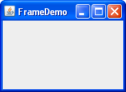
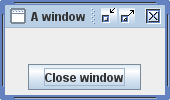

# 如何制作框架（主窗口）

> 原文： [https://docs.oracle.com/javase/tutorial/uiswing/components/frame.html](https://docs.oracle.com/javase/tutorial/uiswing/components/frame.html)

框架是具有标题和边框的顶级窗口。框架的大小包括为边界指定的任何区域。可以使用`getInsets`方法获得边界区域的尺寸。由于边框区域包含在框架的整体尺寸中，边框有效地遮挡了框架的一部分，约束了可用于渲染的区域和/或将子组件显示到具有`(insets.left`的左上角位置的矩形，`insets.top)`，`height - (insets.top + insets.bottom)`的大小为`width - (insets.left + insets.right)`。

作为 [`JFrame`](https://docs.oracle.com/javase/8/docs/api/javax/swing/JFrame.html) 类的实例实现的帧是具有诸如边框，标题和支持按钮组件的装饰的窗口，其关闭或图标化窗口。具有 GUI 的应用程序通常包括至少一个框架。小程序有时也使用框架。

要创建一个依赖于另一个窗口的窗口 - 例如，当另一个窗口被图标化时消失 - 使用 [`dialog`](dialog.html) 而不是`frame.`。要使窗口出现在另一个窗口中，请使用[内部框架](internalframe.html)。

这是`FrameDemo`演示应用程序创建的极其平坦窗口的图片。您可以在 [`FrameDemo.java`](../examples/components/FrameDemoProject/src/components/FrameDemo.java) 中找到源代码。您可以[运行 FrameDemo](https://docs.oracle.com/javase/tutorialJWS/samples/uiswing/FrameDemoProject/FrameDemo.jnlp) （[下载 JDK 7 或更高版本](http://www.oracle.com/technetwork/java/javase/downloads/index.html)）。



以下`FrameDemo`代码显示如何创建和设置框架。

```java

//1\. Create the frame.
JFrame frame = new JFrame("FrameDemo");

//2\. Optional: What happens when the frame closes?
frame.setDefaultCloseOperation(JFrame.EXIT_ON_CLOSE);

//3\. Create components and put them in the frame.
//...create emptyLabel...
frame.getContentPane().add(emptyLabel, BorderLayout.CENTER);

//4\. Size the frame.
frame.pack();

//5\. Show it.
frame.setVisible(true);

```

以下是有关代码的一些详细信息：

1.  第一行代码使用构造器创建一个框架，允许您设置框架标题。另一个经常使用的`JFrame`构造器是无参构造器。
2.  Next the code specifies what happens when your user closes the frame. The `EXIT_ON_CLOSE` operation exits the program when your user closes the frame. This behavior is appropriate for this program because the program has only one frame, and closing the frame makes the program useless.

    有关详细信息，请参阅[响应窗口关闭事件](#windowevents)。

3.  The next bit of code adds a blank label to the frame content pane. If you're not already familiar with content panes and how to add components to them, please read [Adding Components to the Content Pane](toplevel.html#contentpane).

    对于具有菜单的帧，通常使用`setJMenuBar`方法将菜单栏添加到此处。有关详细信息，请参见[如何使用菜单](menu.html)。

4.  The `pack` method sizes the frame so that all its contents are at or above their preferred sizes. An alternative to `pack` is to establish a frame size explicitly by calling `setSize` or `setBounds` (which also sets the frame location). In general, using `pack` is preferable to calling `setSize`, since `pack` leaves the frame layout manager in charge of the frame size, and layout managers are good at adjusting to platform dependencies and other factors that affect component size.

    此示例未设置帧位置，但使用`setLocationRelativeTo`或`setLocation`方法很容易。例如，以下代码在屏幕上居中显示框架：

    ```java
    frame.setLocationRelativeTo(null);

    ```

5.  调用`setVisible(true)`可使画面显示在屏幕上。有时您可能会看到使用`show`方法。这两种用法是等价的，但我们使用`setVisible(true)`来保持一致性。

默认情况下，窗口装饰由本机窗口系统提供。但是，您可以请求外观为框架提供装饰。您还可以指定框架根本没有窗口装饰，可以单独使用的功能，或提供自己的装饰，或者使用[全屏独占模式](../../extra/fullscreen/index.html)。

除了指定谁提供窗口装饰外，您还可以指定用于表示窗口的图标。具体如何使用此图标取决于窗口系统或提供窗口装饰的外观。如果窗口系统支持最小化，则该图标用于表示最小化窗口。大多数窗户系统或外观也会在窗户装饰中显示图标。典型的图标大小为 16x16 像素，但某些窗口系统使用其他大小。

以下快照显示三个框架，除了窗口装饰外，它们是相同的。正如您可以通过每个框架中按钮的外观来看，这三个都使用 Java 外观。第一个使用窗口系统提供的装饰，恰好是 Microsoft Windows，但可以很容易地运行 Java 平台的任何其他系统。第二个和第三个使用由 Java 外观提供的窗口装饰。第三帧使用 Java 外观和窗口装饰，但有一个自定义图标。

|  |  |  |
| 窗户装饰由外观和感觉提供 | 窗户系统提供的窗户装饰 | 自定义图标;窗户装饰由外观和感觉提供 |

以下是创建具有自定义图标的框架以及由外观提供的窗口装饰的示例：

```java
//Ask for window decorations provided by the look and feel.
JFrame.setDefaultLookAndFeelDecorated(true);

//Create the frame.
JFrame frame = new JFrame("A window");

//Set the frame icon to an image loaded from a file.
frame.setIconImage(new ImageIcon(imgURL).getImage());

```

如前面的代码片段所示，您必须在创建您希望影响其装饰的帧之前调用`setDefaultLookAndFeelDecorated`方法 _。使用`setDefaultLookAndFeelDecorated`设置的值用于随后创建的所有`JFrame`。您可以通过调用`JFrame.setDefaultLookAndFeelDecorated(false)`切换回使用窗口系统装饰。有些外观可能不支持窗户装饰;在这种情况下，使用窗户系统装饰。_

创建上图所示框架的应用程序的完整源代码位于 [`FrameDemo2.java`](../examples/components/FrameDemo2Project/src/components/FrameDemo2.java) 中。除了展示如何选择窗口装饰外，FrameDemo2 还展示了如何禁用所有窗口装饰并给出了定位窗口的示例。它包括两个创建用作图标的`Image`对象的方法 - 一个从文件加载，另一个从头开始绘制。

* * *

**Try this::** 

1.  Click the Launch button to run the Frame Demo using [Java™ Web Start](http://www.oracle.com/technetwork/java/javase/javawebstart/index.html) ([download JDK 7 or later](http://www.oracle.com/technetwork/java/javase/downloads/index.html)). Alternatively, to compile and run the example yourself, consult the [example index](../examples/components/index.html#FrameDemo2).[](https://docs.oracle.com/javase/tutorialJWS/samples/uiswing/FrameDemo2Project/FrameDemo2.jnlp)

2.  打开两个窗户，两个窗户都带有外观和装饰，但有不同的图标。
    Java 外观在其窗口装饰中显示图标。根据您的窗口系统，图标可能会在别处用于表示窗口，尤其是在窗口最小化时。
3.  用窗户系统装饰一个或多个窗户。
    查看您的窗口系统是否以不同方式处理这些图标。
4.  打开一个或多个没有窗户装饰的窗户。
    使用各种类型的窗口来查看窗口装饰，窗口系统和框架图标如何交互。

* * *

默认情况下，当用户在屏幕上关闭框架时，框架将被隐藏。虽然不可见，但框架仍然存在，程序可以使其再次可见。如果您需要不同的行为，则需要注册处理窗口关闭事件的窗口监听器，或者需要使用`setDefaultCloseOperation`方法指定默认关闭行为。你甚至可以做到这两点。

`setDefaultCloseOperation`的参数必须是以下值之一，前三个值在 [`WindowConstants`](https://docs.oracle.com/javase/8/docs/api/javax/swing/WindowConstants.html) 接口中定义（由`JFrame`，`JInternalPane`和`JDialog`实现）：

`DO_NOTHING_ON_CLOSE`

Do not do anything when the user requests that the window close. Instead, the program should probably use a window listener that performs some other action in its `windowClosing` method.

`HIDE_ON_CLOSE` (the default for `JDialog` and `JFrame`)

Hide the window when the user closes it. This removes the window from the screen but leaves it displayable.

`DISPOSE_ON_CLOSE` (the default for `JInternalFrame`)

Hide and dispose of the window when the user closes it. This removes the window from the screen and frees up any resources used by it.

`EXIT_ON_CLOSE` (defined in the [`JFrame`](https://docs.oracle.com/javase/8/docs/api/javax/swing/JFrame.html) class)

Exit the application, using `System.exit(0)`. This is recommended for applications only. If used within an applet, a `SecurityException` may be thrown.

* * *

**Note:** 

如果屏幕上只有一个窗口，`DISPOSE_ON_CLOSE`可以得到类似于`EXIT_ON_CLOSE`的结果。更确切地说，当处理 Java 虚拟机（VM）内的最后一个可显示窗口时，VM 可以终止。有关详细信息，请参见 [AWT 线程问题](https://docs.oracle.com/javase/8/docs/api/java/awt/doc-files/AWTThreadIssues.html)。

* * *

在任何窗口监听器处理窗口关闭事件之后执行默认关闭操作。因此，例如，假设您指定默认关闭操作是处置帧。您还实现了一个窗口监听器，用于测试帧是否是最后一个可见的帧，如果是，则保存一些数据并退出应用程序。在这些条件下，当用户关闭框架时，将首先调用窗口监听器。如果它没有退出应用程序，那么将执行默认关闭操作 - 处理帧。

有关处理窗口关闭事件的更多信息，请参见[如何编写窗口监听器](../events/windowlistener.html)。除了处理窗口关闭事件之外，窗口监听器还可以对其他窗口状态更改做出反应，例如图标化和激活。

下表列出了常用的`JFrame`构造器和方法。您可能想要调用的其他方法由 [`java.awt.Frame`](https://docs.oracle.com/javase/8/docs/api/java/awt/Frame.html) ， [`java.awt.Window`](https://docs.oracle.com/javase/8/docs/api/java/awt/Window.html) 和 [`java.awt.Component`](https://docs.oracle.com/javase/8/docs/api/java/awt/Component.html) 类定义，`JFrame`从这些类中下降。

因为每个`JFrame`对象都有一个根窗格，所以框架支持在框架子项前插入输入和绘制行为，将子项放在不同的“图层”上，以及用于 Swing 菜单栏。这些主题在[使用顶级容器](toplevel.html)中介绍，并在[如何使用根窗格](rootpane.html)中详细说明。

使用框架的 API 属于以下类别：

*   [创建和设置框架](#creating)
*   [设置窗口大小和位置](#sizeplace)
*   [与根窗相关的方法](#rootpane)


| 方法或构造器 | 目的 |
| :-- | :-- |
| [JFrame（）](https://docs.oracle.com/javase/8/docs/api/javax/swing/JFrame.html#JFrame--)
[JFrame（String）](https://docs.oracle.com/javase/8/docs/api/javax/swing/JFrame.html#JFrame-java.lang.String-) | 创建一个最初不可见的框架。 `String`参数提供框架的标题。要使框架可见，请在其上调用`setVisible(true)`。 |
| [void setDefaultCloseOperation（int）](https://docs.oracle.com/javase/8/docs/api/javax/swing/JFrame.html#setDefaultCloseOperation-int-)
[int getDefaultCloseOperation（）](https://docs.oracle.com/javase/8/docs/api/javax/swing/JFrame.html#getDefaultCloseOperation--) | 设置或获取用户按下此框架上的关闭按钮时发生的操作。可能的选择是：

*   `DO_NOTHING_ON_CLOSE`
*   `HIDE_ON_CLOSE`
*   `DISPOSE_ON_CLOSE`
*   `EXIT_ON_CLOSE`

前三个常数在 [`WindowConstants`](https://docs.oracle.com/javase/8/docs/api/javax/swing/WindowConstants.html) 接口中定义，`JFrame`实现。 `EXIT_ON_CLOSE`常数在 [`JFrame`](https://docs.oracle.com/javase/8/docs/api/javax/swing/JFrame.html) 类中定义。 |
| [void setIconImage（Image）](https://docs.oracle.com/javase/8/docs/api/java/awt/Frame.html#setIconImage-java.awt.Image-)
[Image getIconImage（）](https://docs.oracle.com/javase/8/docs/api/java/awt/Frame.html#getIconImage--)
_（在`Frame`中）_ | 设置或获取代表框架的图标。请注意，参数是 [java.awt.Image](https://docs.oracle.com/javase/8/docs/api/java/awt/Image.html) 对象，而不是`javax.swing.ImageIcon`（或任何其他`javax.swing.Icon`实现）。 |
| [void setTitle（String）](https://docs.oracle.com/javase/8/docs/api/java/awt/Frame.html#setTitle-java.lang.String-)
[String getTitle（）](https://docs.oracle.com/javase/8/docs/api/java/awt/Frame.html#getTitle--)
_（在`Frame`中）_ | 设置或获取框架标题。 |
| [void setUndecorated（boolean）](https://docs.oracle.com/javase/8/docs/api/java/awt/Frame.html#setUndecorated-boolean-)
[boolean isUndecorated（）](https://docs.oracle.com/javase/8/docs/api/java/awt/Frame.html#isUndecorated--)
_（在`Frame`中）_ | 设置或获取是否应该装饰此框架。仅在框架尚未显示（尚未打包或显示）时才有效。通常与[全屏独占模式](../../extra/fullscreen/index.html)一起使用或启用自定义窗口装饰。 |
| [static void setDefaultLookAndFeelDecorated（boolean）](https://docs.oracle.com/javase/8/docs/api/javax/swing/JFrame.html#setDefaultLookAndFeelDecorated-boolean-)
[static boolean isDefaultLookAndFeelDecorated（）](https://docs.oracle.com/javase/8/docs/api/javax/swing/JFrame.html#isDefaultLookAndFeelDecorated--) | 确定随后创建的`JFrame`是否应该具有由当前外观提供的 Window 装饰（例如用于关闭窗口的边框和小部件）。请注意，这只是一个提示，因为某些外观可能不支持此功能。 |


| 方法 | 目的 |
| :-- | :-- |
| [void pack（）](https://docs.oracle.com/javase/8/docs/api/java/awt/Window.html#pack--)
_（在`Window`中）_ | 调整窗口大小，使其所有内容都达到或超过其首选大小。 |
| [void setSize（int，int）](https://docs.oracle.com/javase/8/docs/api/java/awt/Component.html#setSize-int-int-)
[void setSize（Dimension）](https://docs.oracle.com/javase/8/docs/api/java/awt/Component.html#setSize-java.awt.Dimension-)
[Dimension getSize（）](https://docs.oracle.com/javase/8/docs/api/java/awt/Component.html#getSize--)
_（`Component` ]）_ | 设置或获取窗口的总大小。 `setSize`的整数参数分别指定宽度和高度。 |
| [void setBounds（int，int，int，int）](https://docs.oracle.com/javase/8/docs/api/java/awt/Component.html#setBounds-int-int-int-int-)
[void setBounds（Rectangle）](https://docs.oracle.com/javase/8/docs/api/java/awt/Component.html#setBounds-java.awt.Rectangle-)
[Rectangle getBounds（）](https://docs.oracle.com/javase/8/docs/api/java/awt/Component.html#getBounds--)
_（在`Component`中）_ | 设置或获取窗口的大小和位置。对于`setBounds`的整数版本，窗口左上角位于前两个参数指定的 _x，y_ 位置，并且具有最后两个参数指定的宽度和高度。 |
| [void setLocation（int，int）](https://docs.oracle.com/javase/8/docs/api/java/awt/Component.html#setLocation-int-int-)
[Point getLocation（）](https://docs.oracle.com/javase/8/docs/api/java/awt/Component.html#getLocation--)
_（在`Component`中）_ | 设置或获取窗口左上角的位置。参数分别是 _x_ 和 _y_ 值。 |
| [void setLocationRelativeTo（Component）](https://docs.oracle.com/javase/8/docs/api/java/awt/Window.html#setLocationRelativeTo-java.awt.Component-)
_（在`Window`中）_ | 定位窗口，使其位于指定组件的中心。如果参数为`null`，则窗口以屏幕为中心。要正确居中窗口，应在设置窗口大小后调用此方法。 |


| 方法 | 目的 |
| :-- | :-- |
| [void setContentPane（Container）](https://docs.oracle.com/javase/8/docs/api/javax/swing/JFrame.html#setContentPane-java.awt.Container-)
[Container getContentPane（）](https://docs.oracle.com/javase/8/docs/api/javax/swing/JFrame.html#getContentPane--) | 设置或获取框架内容窗格。内容窗格包含框架内的可见 GUI 组件。 |
| [JRootPane createRootPane（）](https://docs.oracle.com/javase/8/docs/api/javax/swing/JFrame.html#createRootPane--)
[void setRootPane（JRootPane）](https://docs.oracle.com/javase/8/docs/api/javax/swing/JFrame.html#setRootPane-javax.swing.JRootPane-)
[JRootPane getRootPane（）](https://docs.oracle.com/javase/8/docs/api/javax/swing/JFrame.html#getRootPane--) | 创建，设置或获取框架根窗格。根窗格管理框架的内部，包括内容窗格，玻璃窗格等。 |
| [void setJMenuBar（JMenuBar）](https://docs.oracle.com/javase/8/docs/api/javax/swing/JFrame.html#setJMenuBar-javax.swing.JMenuBar-)
[JMenuBar getJMenuBar（）](https://docs.oracle.com/javase/8/docs/api/javax/swing/JFrame.html#getJMenuBar--) | 设置或获取框架菜单栏以管理框架的一组菜单。 |
| [void setGlassPane（Component）](https://docs.oracle.com/javase/8/docs/api/javax/swing/JFrame.html#setGlassPane-java.awt.Component-)
[Component getGlassPane（）](https://docs.oracle.com/javase/8/docs/api/javax/swing/JFrame.html#getGlassPane--) | 设置或获取框架玻璃窗格。您可以使用玻璃窗格拦截鼠标事件或在程序 GUI 上绘制。 |
| [void setLayeredPane（JLayeredPane）](https://docs.oracle.com/javase/8/docs/api/javax/swing/JFrame.html#setLayeredPane-javax.swing.JLayeredPane-)
[JLayeredPane getLayeredPane（）](https://docs.oracle.com/javase/8/docs/api/javax/swing/JFrame.html#getLayeredPane--) | 设置或获取框架分层窗格。您可以使用框架分层窗格将组件放在其他组件的顶部或后面。 |

此跟踪中的所有独立应用程序都使用`JFrame`。下表列出了一些并告诉您每个讨论的位置。

| 例 | 在哪里描述 | 笔记 |
| :-- | :-- | :-- |
| [`FrameDemo`](../examples/components/index.html#FrameDemo) | [实例说明](#anexample) | 显示包含一个组件的基本框架。 |
| [`FrameDemo2`](../examples/components/index.html#FrameDemo2) | [指定窗饰](#setDefaultLookAndFeelDecorated) | 允许您创建具有各种窗口装饰的框架。 |
| [`Framework`](../examples/components/index.html#Framework) | - | 一项关于创建和销毁窗口，实现菜单栏以及退出应用程序的研究。 |
| [`LayeredPaneDemo`](../examples/components/index.html#LayeredPaneDemo) | [如何使用分层窗格](layeredpane.html) | 说明如何使用分层窗格（但不是框架分层窗格）。 |
| [`GlassPaneDemo`](../examples/components/index.html#GlassPaneDemo) | [玻璃窗](rootpane.html#glasspane) | 说明框架玻璃窗格的使用。 |
| [`MenuDemo`](../examples/components/index.html#MenuDemo) | [如何使用菜单](menu.html) | 显示如何将`JMenuBar`放入`JFrame`。 |