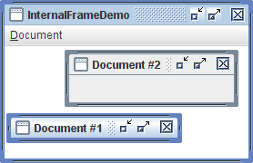

# 如何使用内部框架

> 原文： [https://docs.oracle.com/javase/tutorial/uiswing/components/internalframe.html](https://docs.oracle.com/javase/tutorial/uiswing/components/internalframe.html)

使用 [`JInternalFrame`](https://docs.oracle.com/javase/8/docs/api/javax/swing/JInternalFrame.html) 类，您可以在另一个窗口中显示 [`JFrame`](frame.html) 类似的窗口。通常，您将内部框架添加到桌面窗格。反过来，桌面窗格可以用作`JFrame`的内容窗格。桌面窗格是 [`JDesktopPane`](https://docs.oracle.com/javase/8/docs/api/javax/swing/JDesktopPane.html) 的一个实例，它是 [`JLayeredPane`](layeredpane.html) 的子类，添加了用于管理多个重叠内部帧的 API。

您应该仔细考虑是否将程序的 GUI 基于框架或内部框架。从内部帧切换到帧或反之亦然不一定是简单的任务。通过试验框架和内部框架，您可以了解选择一个框架和另一个框架所涉及的权衡。

这是一个应用程序的图片，在常规框架内有两个内部框架（其中一个图标化）：



* * *

**Try this:** 

1.  单击“启动”按钮以使用 [Java™Web Start](http://www.oracle.com/technetwork/java/javase/javawebstart/index.html) （[下载 JDK 7 或更高版本](http://www.oracle.com/technetwork/java/javase/downloads/index.html)）运行 InternalFrameDemo。或者，要自己编译并运行示例，请参考[示例索引](../examples/components/index.html#InternalFrameDemo)。 [](https://docs.oracle.com/javase/tutorialJWS/samples/uiswing/InternalFrameDemoProject/InternalFrameDemo.jnlp) 

2.  使用“文档”菜单中的“创建”项创建新的内部框架。
    每个内部框架低至 30 像素，位于前一个内部框架首次出现的位置的右​​侧。此功能在`MyInternalFrame`类中实现，该类是`JInternalFrame`的自定义子类。

* * *

以下代码取自 [`InternalFrameDemo.java`](../examples/components/InternalFrameDemoProject/src/components/InternalFrameDemo.java) ，在上一个示例中创建了桌面和内部帧。

```
...//In the constructor of InternalFrameDemo, a JFrame subclass:
    desktop = new JDesktopPane();
    createFrame(); //Create first window
    setContentPane(desktop);
    ...
    //Make dragging a little faster but perhaps uglier.
    desktop.setDragMode(JDesktopPane.OUTLINE_DRAG_MODE);
...
protected void createFrame() {
    MyInternalFrame frame = new MyInternalFrame();
    frame.setVisible(true);
    desktop.add(frame);
    try {
        frame.setSelected(true);
    } catch (java.beans.PropertyVetoException e) {}
}

...//In the constructor of MyInternalFrame, a JInternalFrame subclass:
static int openFrameCount = 0;
static final int xOffset = 30, yOffset = 30;

public MyInternalFrame() {
    super("Document #" + (++openFrameCount),
          true, //resizable
          true, //closable
          true, //maximizable
          true);//iconifiable
    //...Create the GUI and put it in the window...
    //...Then set the window size or call pack...
    ...
    //Set the window's location.
    setLocation(xOffset*openFrameCount, yOffset*openFrameCount);
}

```

使用内部帧的代码在很多方面类似于使用常规 Swing 帧的代码。由于内部框架具有根窗格，因此为`JInternalFrame`设置 GUI 与为`JFrame`设置 GUI 非常相似。 `JInternalFrame`还提供其他 API，例如`pack`，使其类似于`JFrame`。

* * *

**Note:** 

与常规帧一样，您必须在内部帧上调用`setVisible(true)`或`show()`来显示它。在您明确显示内部框架之前，内部框架不会出现。

* * *

但是，内部框架不是窗口或顶级容器，这使得它们与框架不同。例如，您必须将一个内部框架添加到容器（通常是`JDesktopPane`）;内部框架不能是包含层次结构的根。此外，内部帧不会生成窗口事件。相反，导致框架触发窗口事件的用户操作会导致内部框架触发内部框架事件。

由于内部框架是使用与平台无关的代码实现的，因此它们会添加一些框架无法提供的功能。其中一个特点是内部框架可以让您比帧更能控制其状态和功能。您可以以编程方式图标化或最大化内部框架。您还可以指定内部框架标题栏中的图标。您甚至可以指定内部框架是否具有窗口装饰以支持调整大小，图标化，关闭和最大化。

另一个特性是内部框架设计用于桌面窗格。 `JInternalFrame` API 包含`moveToFront`等方法，仅当内部框架的容器是`JDesktopPane`等分层窗格时才有效。

如果您使用`JFrame`和其他 Swing 组件构建了任何程序，那么您已经了解了很多关于如何使用内部框架的知识。以下列表总结了使用内部框架的规则。有关其他信息，请参见[如何制作帧](frame.html)和 [JComponent 类](jcomponent.html)。

**You must set the size of the internal frame.**

If you do not set the size of the internal frame, it will have zero size and thus never be visible. You can set the size using one of the following methods: `setSize`, `pack`, or `setBounds`.

**As a rule, you should set the location of the internal frame.**

If you do not set the location of the internal frame, it will come up at 0,0 (the upper left of its container). You can use the `setLocation` or `setBounds` method to specify the upper left point of the internal frame, relative to its container.

**To add components to an internal frame, you add them to the internal frame's content pane.**

This is exactly like the `JFrame` situation. See [Adding Components to the Content Pane](toplevel.html#contentpane) for details.

**Dialogs that are internal frames should be implemented using `JOptionPane` or `JInternalFrame`, not `JDialog`.**

To create a simple dialog, you can use the `JOptionPane` `showInternal_Xxx_Dialog` methods, as described in [How to Make Dialogs](dialog.html).

**You must add an internal frame to a container.**

If you do not add the internal frame to a container (usually a `JDesktopPane`), the internal frame will not appear.

**You need to call `show` or `setVisible` on internal frames.**

Internal frames are invisible by default. You must invoke `setVisible(true)` or `show()` to make them visible.

**Internal frames fire internal frame events, not window events.**

Handling internal frame events is almost identical to handling window events. See [How to Write an Internal Frame Listener](../events/internalframelistener.html) for more information.

* * *

**Performance tip:** 

当桌面有许多内部框架时，用户可能会注意到移动它们似乎很慢。大纲拖动是避免此问题的一种方法。使用轮廓拖动时，只有内部框架的轮廓在当前鼠标位置被绘制，同时内部框架被拖动。在拖动停止之前，内部框架的内部不会在新位置重新绘制。默认行为（称为 _live_ 拖动）是在移动时连续重新定位和重绘部分或全部内部帧;如果桌面有许多内部框架，这可能会很慢。

使用`JDesktopPane`方法`setDragMode` *指定轮廓拖动。例如：

```
desktop.setDragMode(JDesktopPane.OUTLINE_DRAG_MODE);

```

* * *

下表列出了常用的`JInternalFrame`构造函数和方法，以及`JDesktopPane`提供的一些方法。除了本节中列出的 API 之外，`JInternalFrame`还从其超类`JComponent`，`Component`和`Container`继承了有用的 API。有关这些类的方法列表，请参见 [JComponent 类](jcomponent.html)。

与`JInternalFrame`类似，`JDesktopPane`从`JComponent`下降，因此提供 [JComponent 类](jcomponent.html)中描述的方法。因为`JDesktopPane`扩展了`JLayeredPane`，它还支持[分层窗格 API](layeredpane.html#api) 中描述的方法。

使用内部框架的 API 属于以下类别：

*   [创建内部框架](#construct)
*   [将组件添加到内部框架](#add)
*   [指定内部框架的可见性，大小和位置](#layout)
*   [对内部框架执行窗口操作](#window)
*   [控制窗口装饰和功能](#decorate)
*   [使用 JDesktopPane API](#JDesktopPane)


| 构造函数或方法 | 目的 |
| :-- | :-- |
| [JInternalFrame（）](https://docs.oracle.com/javase/8/docs/api/javax/swing/JInternalFrame.html#JInternalFrame--)
[JInternalFrame（String）](https://docs.oracle.com/javase/8/docs/api/javax/swing/JInternalFrame.html#JInternalFrame-java.lang.String-)
[JInternalFrame（String，boolean）](https://docs.oracle.com/javase/8/docs/api/javax/swing/JInternalFrame.html#JInternalFrame-java.lang.String-boolean-)
[JInternalFrame（String，boolean，boolean ）](https://docs.oracle.com/javase/8/docs/api/javax/swing/JInternalFrame.html#JInternalFrame-java.lang.String-boolean-boolean-)
[JInternalFrame（String，boolean，boolean，boolean）](https://docs.oracle.com/javase/8/docs/api/javax/swing/JInternalFrame.html#JInternalFrame-java.lang.String-boolean-boolean-boolean-)
[JInternalFrame（String，boolean，boolean，boolean，boolean）](https://docs.oracle.com/javase/8/docs/api/javax/swing/JInternalFrame.html#JInternalFrame-java.lang.String-boolean-boolean-boolean-boolean-) | 创建`JInternalFrame`实例。第一个参数指定内部框架显示的标题（如果有）。其余参数指定内部框架是否应包含允许用户调整内部框架（按该顺序指定）的大小，关闭，最大化和图标化的装饰。每个布尔参数的默认值为`false`，这意味着不允许该操作。 |
| [static int showInternalConfirmDialog（Component，Object）](https://docs.oracle.com/javase/8/docs/api/javax/swing/JOptionPane.html#showInternalConfirmDialog-java.awt.Component-java.lang.Object-)
[static String showInternalInputDialog（Component，Object）](https://docs.oracle.com/javase/8/docs/api/javax/swing/JOptionPane.html#showInternalInputDialog-java.awt.Component-java.lang.Object-)
[static Object showInternalMessageDialog（Component，Object）](https://docs.oracle.com/javase/8/docs/api/javax/swing/JOptionPane.html#showInternalMessageDialog-java.awt.Component-java.lang.Object-)
[static int showInternalOptionDialog（Component，Object，String，int，int，Icon，Object []，Object）](https://docs.oracle.com/javase/8/docs/api/javax/swing/JOptionPane.html#showInternalOptionDialog-java.awt.Component-java.lang.Object-java.lang.String-int-int-javax.swing.Icon-java.lang.Object:A-java.lang.Object-) | 创建一个模拟对话框的`JInternalFrame`。有关详细信息，请参见[如何制作对话框](dialog.html)。 |


| 方法 | 目的 |
| :-- | :-- |
| [void setContentPane（Container）](https://docs.oracle.com/javase/8/docs/api/javax/swing/JInternalFrame.html#setContentPane-java.awt.Container-)
[Container getContentPane（）](https://docs.oracle.com/javase/8/docs/api/javax/swing/JInternalFrame.html#getContentPane--) | 设置或获取内部框架的内容窗格，该窗格通常包含所有内部框架的 GUI，但菜单栏和窗口装饰除外。 |
| [void setJMenuBar（JMenuBar）](https://docs.oracle.com/javase/8/docs/api/javax/swing/JInternalFrame.html#setJMenuBar-javax.swing.JMenuBar-)
[JMenuBar getJMenuBar（）](https://docs.oracle.com/javase/8/docs/api/javax/swing/JInternalFrame.html#getJMenuBar--) | 设置或获取内部框架的菜单栏。 |
| [void setLayeredPane（JLayeredPane）](https://docs.oracle.com/javase/8/docs/api/javax/swing/JInternalFrame.html#setLayeredPane-javax.swing.JLayeredPane-)
[JLayeredPane getLayeredPane（）](https://docs.oracle.com/javase/8/docs/api/javax/swing/JInternalFrame.html#getLayeredPane--) | 设置或获取内部框架的分层窗格。 |


| 方法 | 目的 |
| :-- | :-- |
| [void setVisible（boolean）](https://docs.oracle.com/javase/8/docs/api/javax/swing/JComponent.html#setVisible-boolean-) | 使内部框架可见（如果`true`）或不可见（如果`false`）。在将每个`JInternalFrame`添加到其容器之前，您应该调用`setVisible(true)`。 （继承自`Component`）。 |
| [void pack（）](https://docs.oracle.com/javase/8/docs/api/javax/swing/JInternalFrame.html#pack--) | 调整内部框架的尺寸，使其组件处于首选尺寸。 |
| [void setLocation（Point）](https://docs.oracle.com/javase/8/docs/api/java/awt/Component.html#setLocation-java.awt.Point-)
[void setLocation（int，int）](https://docs.oracle.com/javase/8/docs/api/java/awt/Component.html#setLocation-int-int-) | 设置内部框架的位置。 （继承自`Component`）。 |
| [void setBounds（Rectangle）](https://docs.oracle.com/javase/8/docs/api/java/awt/Component.html#setBounds-java.awt.Rectangle-)
[void setBounds（int，int，int，int）](https://docs.oracle.com/javase/8/docs/api/java/awt/Component.html#setBounds-int-int-int-int-) | 明确设置内部框架的大小和位置。 （继承自`Component`）。 |
| [void setSize（Dimension）](https://docs.oracle.com/javase/8/docs/api/java/awt/Component.html#setSize-java.awt.Dimension-)
[void setSize（int，int）](https://docs.oracle.com/javase/8/docs/api/java/awt/Component.html#setSize-int-int-) | 明确设置内部框架的大小。 （继承自`Component`）。 |


| 方法 | 目的 |
| :-- | :-- |
| [void setDefaultCloseOperation（int）](https://docs.oracle.com/javase/8/docs/api/javax/swing/JInternalFrame.html#setDefaultCloseOperation-int-)
[int getDefaultCloseOperation（）](https://docs.oracle.com/javase/8/docs/api/javax/swing/JInternalFrame.html#getDefaultCloseOperation--) | 设置或获取用户尝试“关闭”内部框架时内部框架的作用。默认值为`DISPOSE_ON_CLOSE`。其他可能的值是`DO_NOTHING_ON_CLOSE`和`HIDE_ON_CLOSE`有关详细信息，请参阅[响应窗口关闭事件](frame.html#windowevents)。 |
| [void addInternalFrameListener（InternalFrameListener）](https://docs.oracle.com/javase/8/docs/api/javax/swing/JInternalFrame.html#addInternalFrameListener-javax.swing.event.InternalFrameListener-)
[void removeInternalFrameListener（InternalFrameListener）](https://docs.oracle.com/javase/8/docs/api/javax/swing/JInternalFrame.html#removeInternalFrameListener-javax.swing.event.InternalFrameListener-) | 添加或删除内部框架侦听器（`JInternalFrame`相当于窗口侦听器）。有关详细信息，请参见[如何编写内部帧侦听器](../events/internalframelistener.html)。 |
| [void moveToFront（）](https://docs.oracle.com/javase/8/docs/api/javax/swing/JInternalFrame.html#moveToFront--)
[void moveToBack（）](https://docs.oracle.com/javase/8/docs/api/javax/swing/JInternalFrame.html#moveToBack--) | 如果内部框架的父级是分层窗格（如桌面窗格），则将内部框架移动到其图层的前面或后面（分别）。 |
| [void setClosed（boolean）](https://docs.oracle.com/javase/8/docs/api/javax/swing/JInternalFrame.html#setClosed-boolean-)
[boolean isClosed（）](https://docs.oracle.com/javase/8/docs/api/javax/swing/JInternalFrame.html#isClosed--) | 设置或获取内部框架当前是否已关闭。 `setClosed`的参数必须是`true`。重新打开关闭的内部框架时，可以将其显示并将其添加到容器（通常是最初添加到其中的桌面窗格）。 |
| [void setIcon（boolean）](https://docs.oracle.com/javase/8/docs/api/javax/swing/JInternalFrame.html#setIcon-boolean-)
[boolean isIcon（）](https://docs.oracle.com/javase/8/docs/api/javax/swing/JInternalFrame.html#isIcon--) | 对内部框架进行图标化或取消图标化，或确定其当前是否已图标化。 |
| [void setMaximum（boolean）](https://docs.oracle.com/javase/8/docs/api/javax/swing/JInternalFrame.html#setMaximum-boolean-)
[boolean isMaximum（）](https://docs.oracle.com/javase/8/docs/api/javax/swing/JInternalFrame.html#isMaximum--) | 最大化或恢复内部框架，或确定它是否已最大化。 |
| [void setSelected（boolean）](https://docs.oracle.com/javase/8/docs/api/javax/swing/JInternalFrame.html#setSelected-boolean-)
[boolean isSelected（）](https://docs.oracle.com/javase/8/docs/api/javax/swing/JInternalFrame.html#isSelected--) | 设置或获取内部框架是否为当前“选定”（激活）的内部框架。 |


| 方法 | 目的 |
| :-- | :-- |
| [void setFrameIcon（Icon）](https://docs.oracle.com/javase/8/docs/api/javax/swing/JInternalFrame.html#setFrameIcon-javax.swing.Icon-)
[Icon getFrameIcon（）](https://docs.oracle.com/javase/8/docs/api/javax/swing/JInternalFrame.html#getFrameIcon--) | 设置或获取内部框架标题栏中显示的图标（通常位于左上角）。 |
| [void setClosable（boolean）](https://docs.oracle.com/javase/8/docs/api/javax/swing/JInternalFrame.html#setClosable-boolean-)
[boolean isClosable（）](https://docs.oracle.com/javase/8/docs/api/javax/swing/JInternalFrame.html#isClosable--) | 设置或获取用户是否可以关闭内部框架。 |
| [void setIconifiable（boolean）](https://docs.oracle.com/javase/8/docs/api/javax/swing/JInternalFrame.html#setIconifiable-boolean-)
[boolean isIconifiable（）](https://docs.oracle.com/javase/8/docs/api/javax/swing/JInternalFrame.html#isIconifiable--) | 设置或获取内部框架是否可以图标化。 |
| [void setMaximizable（boolean）](https://docs.oracle.com/javase/8/docs/api/javax/swing/JInternalFrame.html#setMaximizable-boolean-)
[boolean isMaximizable（）](https://docs.oracle.com/javase/8/docs/api/javax/swing/JInternalFrame.html#isMaximizable--) | 设置或获取用户是否可以最大化此内部框架。 |
| [void setResizable（boolean）](https://docs.oracle.com/javase/8/docs/api/javax/swing/JInternalFrame.html#setResizable-boolean-)
[boolean isResizable（）](https://docs.oracle.com/javase/8/docs/api/javax/swing/JInternalFrame.html#isResizable--) | 设置或获取内部框架是否可以调整大小。 |
| [void setTitle（String）](https://docs.oracle.com/javase/8/docs/api/javax/swing/JInternalFrame.html#setTitle-java.lang.String-)
[String getTitle（）](https://docs.oracle.com/javase/8/docs/api/javax/swing/JInternalFrame.html#getTitle--) | 设置或获取窗口标题。 |


| 构造函数或方法 | 目的 |
| :-- | :-- |
| [JDesktopPane（）](https://docs.oracle.com/javase/8/docs/api/javax/swing/JDesktopPane.html#JDesktopPane--) | 创建`JDesktopPane`的新实例。 |
| [JInternalFrame [] getAllFrames（）](https://docs.oracle.com/javase/8/docs/api/javax/swing/JDesktopPane.html#getAllFrames--) | 返回桌面包含的所有`JInternalFrame`对象。 |
| [JInternalFrame [] getAllFramesInLayer（int）](https://docs.oracle.com/javase/8/docs/api/javax/swing/JDesktopPane.html#getAllFramesInLayer-int-) | 返回桌面包含的指定图层中的所有`JInternalFrame`对象。有关图层的信息，请参见[如何使用分层窗格](layeredpane.html)。 |
| [void setDragMode（int）](https://docs.oracle.com/javase/8/docs/api/javax/swing/JDesktopPane.html#setDragMode-int-)
[int getDragMode（）](https://docs.oracle.com/javase/8/docs/api/javax/swing/JDesktopPane.html#getDragMode--) | 设置或获取此桌面中用于内部帧的拖动模式。整数可以是`JDesktopPane.LIVE_DRAG_MODE`或`JDesktopPane.OUTLINE_DRAG_MODE`。 Java 外观的默认设置是实时拖动模式。 |

以下示例使用内部框架。因为内部帧与常规帧类似，所以您还应该查看[使用帧](frame.html#eg)的示例。

| 例 | 在哪里描述 | 笔记 |
| :-- | :-- | :-- |
| [`MyInternalFrame`](../examples/components/index.html#InternalFrameDemo) | 这一页。 | 实现一个内部框架，该框架出现在先前创建的内部框架的偏移处。 |
| [`InternalFrameDemo`](../examples/components/index.html#InternalFrameDemo) | 这一页。 | 允许您创建进入应用程序`JDesktopPane`的内部框架（`MyInternalFrame`的实例）。 |
| [`InternalFrameEventDemo`](../examples/events/index.html#InternalFrameEventDemo) | [如何编写内部帧监听器](../events/internalframelistener.html) | 演示侦听内部帧事件。还演示了在桌面窗格中定位内部框架。 |