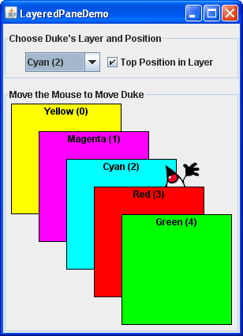
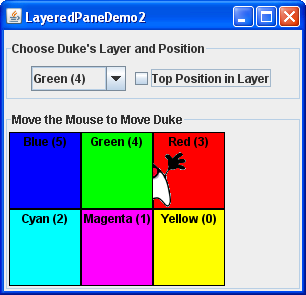

# 如何使用分层窗格

> 原文： [https://docs.oracle.com/javase/tutorial/uiswing/components/layeredpane.html](https://docs.oracle.com/javase/tutorial/uiswing/components/layeredpane.html)

分层窗格是 Swing 容器，为定位组件提供第三维：_ 深度 _，也称为 _Z 顺序 _。将组件添加到分层窗格时，将其深度指定为整数。数字越大，组件越接近容器内的“顶部”位置。如果组件重叠，则“更近”的组件在较低深度的组件顶部绘制。相同深度处的组件之间的关系由它们在深度内的位置确定。

* * *

**Note:** 

AWT 容器有一个 API，允许您操作组件 _Z 顺序 _。有关更多信息，请参阅 [AWT 焦点规范](https://docs.oracle.com/javase/8/docs/api/java/awt/doc-files/FocusSpec.html#ZOrder)。

* * *

每个具有[根窗格](rootpane.html)的 Swing 容器 - 例如 [`JFrame`](frame.html) ， [`JApplet`](applet.html) ， [`JDialog`](dialog.html) 或 [`JInternalFrame`](internalframe.html) - 自动有一个分层窗格。大多数程序没有明确使用根窗格的分层窗格，因此本节不讨论它。您可以在[根窗格](toplevel.html#rootpane)中找到相关信息，该窗格提供概述，[分层窗格](rootpane.html#layeredpane)，其中包含更多详细信息。本节介绍如何创建自己的分层窗格，并在可以使用常规 Swing 容器的任何位置使用它。

Swing 提供了两个分层的窗格类。第一个 [`JLayeredPane`](https://docs.oracle.com/javase/8/docs/api/javax/swing/JLayeredPane.html) 是根窗格使用的类，是本节中示例使用的类。第二个`JDesktopPane`是一个`JLayeredPane`子类，专门用于保存内部帧。有关使用`JDesktopPane`的示例，请参阅[如何使用内部框架](internalframe.html)。

下面是一个应用程序的图片，它创建了一个分层窗格，并在不同深度放置重叠的，有色[标签](label.html)：



* * *

**Try this::** 

1.  Click the Launch button to run the LayeredPane Demo using [Java™ Web Start](http://www.oracle.com/technetwork/java/javase/javawebstart/index.html) ([download JDK 7 or later](http://www.oracle.com/technetwork/java/javase/downloads/index.html)). Alternatively, to compile and run the example yourself, consult the [example index](../examples/components/index.html#LayeredPaneDemo).[](https://docs.oracle.com/javase/tutorialJWS/samples/uiswing/LayeredPaneDemoProject/LayeredPaneDemo.jnlp)

2.  在窗口下部移动鼠标。 Duke 的图像拖曳在绿色和红色标签后面，但在其他三个标签前面。
3.  使用窗口顶部的组合框更改 Duke 的深度。使用复选框设置 Duke 是否位于当前深度内的顶部位置 - 位置 0。

* * *

以下是 [`LayeredPaneDemo.java`](../examples/components/LayeredPaneDemoProject/src/components/LayeredPaneDemo.java) 中创建分层窗格的代码：

```
layeredPane = new JLayeredPane();
layeredPane.setPreferredSize(new Dimension(300, 310));
layeredPane.setBorder(BorderFactory.createTitledBorder(
                                    "Move the Mouse to Move Duke"));
layeredPane.addMouseMotionListener(new MouseMotionAdapter() {
    ...
});

```

代码使用`JLayeredPane`唯一的构造函数 - 无参数构造函数 - 来创建分层窗格。其余代码使用从超类继承的方法为分层窗格提供首选大小和边框，并为其添加鼠标移动侦听器。鼠标移动监听器只是移动 Duke 图像以响应鼠标移动。虽然我们不在此处显示代码，但该示例将分层窗格添加到框架的内容窗格中。

正如我们稍后将向您展示的那样，您可以使用`add`方法将组件添加到分层窗格中。将组件添加到分层窗格时，可以指定组件深度，也可以选择其在深度内的位置。演示程序中的分层窗格包含六个标签 - 五个彩色标签和第六个显示 Duke 图像的标签。正如程序所示，组件的深度及其在该深度内的位置都可以动态变化。

本节的其余部分将介绍以下主题：

*   [添加组件和设置组件深度](#depth)
*   [在深度范围内设置元件位置](#position)
*   [在分层窗格中布置组件](#layout)
*   [分层窗格 API](#api)
*   [使用分层窗格的示例](#eg)

以下是示例程序中的代码，它将彩色标签添加到分层窗格：

```
for (int i = 0; i < ...number of labels...; i++) {
    JLabel label = createColoredLabel(...);
    layeredPane.add(label, new Integer(i));
    ...
}

```

您可以在程序的源代码中找到`createColoredLabel`方法的实现。它只是创建一个不透明的`JLabel`，使用背景颜色，边框，一些文本和大小进行初始化。

示例程序使用`add`方法的双参数版本。第一个参数是要添加的组件，第二个参数是`Integer`对象，指定深度。该程序使用`for`循环迭代变量来指定深度。实际值并不重要。重要的是深度的相对值，并且您在程序中如何使用每个深度。

* * *

**Note:** 

如果使用根窗格的分层窗格，请确保使用其深度约定。有关详细信息，请参阅[分层窗格](rootpane.html#layeredpane)。该部分介绍如何修改`LayeredPaneDemo`以使用根窗格的分层窗格。通过修改，您可以看到拖动 Duke 图像与控制面板中的组合框的关系。

* * *

从示例程序中可以看出，如果组件重叠，则较高深度的组件位于较低深度的组件之上。要动态更改组件深度，请使用`setLayer`方法。在该示例中，用户可以通过从组合框中进行选择来更改 Duke 的图层。这是在组合框中注册的动作侦听器的`actionPerformed`方法：

```
public void actionPerformed(ActionEvent e) {
    int position = onTop.isSelected() ? 0 : 1;
    layeredPane.setLayer(dukeLabel,
                         layerList.getSelectedIndex(),
                         position);
}

```

这里使用的`setLayer`方法有三个参数：要设置深度的组件，新深度和深度内的位置。 `JLayeredPane`具有`setLayer`的双参数版本，仅采用组件和新深度。该方法将组件置于其深度的底部位置。

* * *

**A note of caution:** 

将组件添加到分层窗格时，可以使用`Integer`指定图层。使用`setLayer`更改组件的图层时，使用`int`。您可能会认为如果您使用`add`而不是`add`方法使用`Integer`，编译器会抱怨或您的程序会抛出非法参数异常。但是编译器没有说什么，导致[常见的分层窗格问题](problems.html#layeredpane)。您可以使用本节末尾的 API 表来检查参数的类型，并返回处理图层的方法的值。

* * *

以下代码创建显示 Duke 图像的标签，然后将标签添加到分层窗格。

```
final ImageIcon icon = createImageIcon("images/dukeWaveRed.gif");
...
dukeLabel = new JLabel(icon);
...
dukeLabel.setBounds(15, 225,
                    icon.getIconWidth(),
                    icon.getIconHeight());
...
layeredPane.add(dukeLabel, new Integer(2), 0);

```

此代码使用`add`方法的三参数版本。第三个参数指定 Duke 标签在其深度内的位置，该位置决定了组件与相同深度的其他组件的关系。

位置指定为`int`在-1 和（ _n_ -1）之间，其中 _n_ 是深度处的组件数。与层数不同，位置编号越小，其深度内的组件越高。使用-1 与使用 _n_ - 1 相同;它表示最底部的位置。使用 0 指定组件应位于其深度内的最顶部位置。如下图所示，除-1 外，较低的位置编号表示深度内的较高位置。


组件在其层中的位置可以动态更改。在该示例中，您可以使用复选框确定 Duke 标签是否位于其深度的顶部位置。这是在复选框中注册的动作侦听器的`actionPerformed`方法：

```
public void actionPerformed(ActionEvent e) {
    if (onTop.isSelected())
        layeredPane.moveToFront(dukeLabel);
    else
        layeredPane.moveToBack(dukeLabel);
}

```

当用户选中复选框时，`moveToFront`方法将 Duke 移动到前面（位置 0）。当用户取消选中复选框时，Duke 会使用`moveToBack`方法移动到后面。您也可以使用`setPosition`方法或`setLayer`的三参数版本来更改组件的位置。

默认情况下，分层窗格没有布局管理器。这意味着您通常必须编写用于定位和调整放置在分层窗格中的组件的代码。

该示例使用`setBounds`方法设置每个标签的大小和位置：

```
dukeLabel.setBounds(15, 225,
                    icon.getIconWidth(),
                    icon.getIconHeight());
...
label.setBounds(origin.x, origin.y, 140, 140);

```

当用户移动鼠标时，程序调用`setPosition`来改变 Duke 的位置：

```
dukeLabel.setLocation(e.getX()-XFUDGE, e.getY()-YFUDGE);

```

虽然默认情况下分层窗格没有布局管理器，但您仍可以将布局管理器分配给分层窗格。 Java 平台提供的所有布局管理器都将组件排列为一个层。以下是上一个演示版的一个版本，它将分层窗格的布局管理器设置为`GridLayout`的实例，使用该布局管理器布置六个彩色标签。



您可以在 [`LayeredPaneDemo2.java`](../examples/components/LayeredPaneDemo2Project/src/components/LayeredPaneDemo2.java) 中找到该程序的代码。你可以[运行 LayeredPaneDemo2](https://docs.oracle.com/javase/tutorialJWS/samples/uiswing/LayeredPaneDemo2Project/LayeredPaneDemo2.jnlp) （[下载 JDK 7 或更高版本](http://www.oracle.com/technetwork/java/javase/downloads/index.html)）。如果要编译示例，请参阅[示例索引](../examples/components/index.html#LayeredPaneDemo2)以获取所有必需文件的列表。

许多程序使用中间容器（例如面板）及其布局管理器在同一层上布置组件，但使用绝对定位在不同层上布置组件。有关绝对定位的更多信息，请参见[不使用布局管理器（绝对定位）](../layout/none.html)。

下表列出了常用的`JLayeredPane`构造函数和方法。您最有可能在`JLayeredPane`对象上调用的其他方法是从其超类继承的方法，例如`setBorder`，`setPreferredSize`等。有关常用继承方法的表，请参见 [JComponent API](jcomponent.html#api) 。

使用分层窗格的 API 分为以下几类：

*   [创建或获取分层窗格](#creating)
*   [分层组件](#layers)
*   [设置组件的层内位置](#positions)


| 方法或构造函数 | 目的 |
| :-- | :-- |
| [JLayeredPane（）](https://docs.oracle.com/javase/8/docs/api/javax/swing/JLayeredPane.html#JLayeredPane--) | 创建分层窗格。 |
| [JLayeredPane getLayeredPane（）](https://docs.oracle.com/javase/8/docs/api/javax/swing/JApplet.html#getLayeredPane--)
_（`JApplet`，`JDialog`，`JFrame`和`JInternalFrame`）_ | 在小程序，对话框，框架或内部框架中获取自动分层窗格。 |


| 方法 | 目的 |
| :-- | :-- |
| [void add（Component）](https://docs.oracle.com/javase/8/docs/api/java/awt/Container.html#add-java.awt.Component-)
[void add（Component，Object）](https://docs.oracle.com/javase/8/docs/api/java/awt/Container.html#add-java.awt.Component-java.lang.Object-)
[void add（Component，Object，int）](https://docs.oracle.com/javase/8/docs/api/java/awt/Container.html#add-java.awt.Component-java.lang.Object-int-) | 将指定的组件添加到分层窗格。第二个参数（如果存在）是指示图层的`Integer`。第三个参数（如果存在）表示组件在其图层中的位置。如果使用此方法的单参数版本，则组件将添加到第 0 层。如果使用此方法的单参数或双参数版本，则该组件将放置在当前位于同一图层中的所有其他组件的下方。 |
| [void setLayer（Component，int）](https://docs.oracle.com/javase/8/docs/api/javax/swing/JLayeredPane.html#setLayer-java.awt.Component-int-)
[void setLayer（Component，int，int）](https://docs.oracle.com/javase/8/docs/api/javax/swing/JLayeredPane.html#setLayer-java.awt.Component-int-int-) | 更改组件的图层。第二个参数表示图层。第三个参数（如果存在）表示组件在其图层中的位置。 |
| [int getLayer（Component）](https://docs.oracle.com/javase/8/docs/api/javax/swing/JLayeredPane.html#getLayer-java.awt.Component-)
[int getLayer（JComponent）](https://docs.oracle.com/javase/8/docs/api/javax/swing/JLayeredPane.html#getLayer-javax.swing.JComponent-) | 获取指定组件的图层。 |
| [int getComponentCountInLayer（int）](https://docs.oracle.com/javase/8/docs/api/javax/swing/JLayeredPane.html#getComponentCountInLayer-int-) | 获取指定图层中的组件数。此方法返回的值可用于计算位置值。 |
| [Component [] getComponents Layer（in）](https://docs.oracle.com/javase/8/docs/api/javax/swing/JLayeredPane.html#getComponentsInLayer-int-) | 获取指定图层中所有组件的数组。 |
| [int highestLayer（）](https://docs.oracle.com/javase/8/docs/api/javax/swing/JLayeredPane.html#highestLayer--)
[int lowestLayer（）](https://docs.oracle.com/javase/8/docs/api/javax/swing/JLayeredPane.html#lowestLayer--) | 计算当前使用的最高或最低层。 |


| 方法 | 目的 |
| :-- | :-- |
| [void setPosition（Component，int）](https://docs.oracle.com/javase/8/docs/api/javax/swing/JLayeredPane.html#setPosition-java.awt.Component-int-)
[int getPosition（Component）](https://docs.oracle.com/javase/8/docs/api/javax/swing/JLayeredPane.html#getPosition-java.awt.Component-) | 在其图层中设置或获取指定组件的位置。 |
| [void moveToFront（Component）](https://docs.oracle.com/javase/8/docs/api/javax/swing/JLayeredPane.html#moveToFront-java.awt.Component-)
[void moveToBack（Component）](https://docs.oracle.com/javase/8/docs/api/javax/swing/JLayeredPane.html#moveToBack-java.awt.Component-) | 将指定的组件移动到其图层的前面或后面。 |

此表显示了使用`JLayeredPane`的示例以及描述这些示例的示例。

| 例 | 在哪里描述 | 笔记 |
| :-- | :-- | :-- |
| [`LayeredPaneDemo`](../examples/components/index.html#LayeredPaneDemo) | 这个部分 | 说明`JLayeredPane`的层和层内位置。 |
| [`LayeredPaneDemo2`](../examples/components/index.html#LayeredPaneDemo2) | 这个部分 | 使用布局管理器帮助在分层窗格中布置组件。 |
| [`RootLayeredPaneDemo`](../examples/components/index.html#RootLayeredPaneDemo) | [分层窗格](rootpane.html#examplemods) | 修改了 [`LayeredPaneDemo`](../examples/components/index.html#LayeredPaneDemo) 的一个版本以使用根窗格的分层窗格。 |
| [`InternalFrameDemo`](../examples/components/index.html#InternalFrameDemo) | [如何使用内部框架](internalframe.html) | 使用`JDesktopFrame`管理内部帧。 |