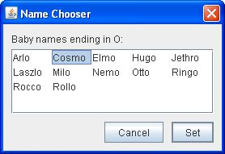

# 如何使用列表

> 原文： [https://docs.oracle.com/javase/tutorial/uiswing/components/list.html](https://docs.oracle.com/javase/tutorial/uiswing/components/list.html)

[`JList`](https://docs.oracle.com/javase/8/docs/api/javax/swing/JList.html) 向用户显示一组项目，显示在一列或多列中，供选择。列表可以包含许多项目，因此它们通常放在[滚动窗格](scrollpane.html)中。

除了列表，以下 Swing 组件向用户显示多个可选项：[组合框](combobox.html)，[菜单](menu.html)，[表](table.html)和[复选框组](button.html#checkbox)或[单选按钮](button.html#radiobutton)。要显示分层数据，请使用[树](tree.html)。

下图显示了两个使用列表的应用程序。本节使用这些示例作为后续讨论的基础。

|  |  |
| ListDialog
（由 ListDialogRunner 使用） | ListDemo |

* * *

**Try this:** 

1.  单击“启动”按钮以使用 [Java™Web Start](http://www.oracle.com/technetwork/java/javase/javawebstart/index.html) （[下载 JDK 7 或更高版本](http://www.oracle.com/technetwork/java/javase/downloads/index.html)）运行 ListDemo。或者，要自己编译并运行示例，请参考[示例索引](../examples/components/index.html#ListDemo)。 [](https://docs.oracle.com/javase/tutorialJWS/samples/uiswing/ListDemoProject/ListDemo.jnlp) 

2.  单击“启动”按钮以运行 ListDialogRunner。或者，要自己编译并运行示例，请参考[示例索引](../examples/components/index.html#ListDialog)。 [](https://docs.oracle.com/javase/tutorialJWS/samples/uiswing/ListDialogRunnerProject/ListDialogRunner.jnlp) 

3.  要调出 ListDialog，请在标题为 Name That Baby 的窗口中单击选择一个新名称...按钮。
    生成的对话框是一个 ListDialog 实例，它已被自定义为具有名称选择器的标题。
4.  在 ListDemo 中，尝试添加（招聘）和删除（触发）一些项目。

* * *

This rest of this section discusses the following topics:

*   [创建模型](#creating)
*   [初始化清单](#init)
*   [选择列表中的项目](#selection)
*   [向列表添加项目和从列表中删除项目](#mutable)
*   [编写自定义单元格渲染器](#renderer)
*   [List API](#api)
*   [使用列表的示例](#eg)

有三种方法可以创建列表模型：

*   [DefaultListModel](https://docs.oracle.com/javase/8/docs/api/javax/swing/DefaultListModel.html) - 一切都非常适合你。本页中的示例使用`DefaultListModel`。
*   [AbstractListModel](https://docs.oracle.com/javase/8/docs/api/javax/swing/AbstractListModel.html) - 您管理数据并调用“fire”方法。对于这种方法，您必须子类化`AbstractListModel`并实现从`ListModel`接口继承的`getSize`和`getElementAt`方法。
*   [ListModel](https://docs.oracle.com/javase/8/docs/api/javax/swing/ListModel.html) - 你管理一切。

以下是 [`ListDialog.java`](../examples/components/ListDialogRunnerProject/src/components/ListDialog.java) 的代码，用于创建和设置其列表：

```
list = new JList(data); //data has type Object[]
list.setSelectionMode(ListSelectionModel.SINGLE_INTERVAL_SELECTION);
list.setLayoutOrientation(JList.HORIZONTAL_WRAP);
list.setVisibleRowCount(-1);
...
JScrollPane listScroller = new JScrollPane(list);
listScroller.setPreferredSize(new Dimension(250, 80));

```

代码将数组传递给列表的构造器。该数组填充了从另一个对象传入的字符串。在我们的例子中，字符串碰巧是男孩的名字。

其他`JList`构造器允许您从`Vector`或从符合 [`ListModel`](https://docs.oracle.com/javase/8/docs/api/javax/swing/ListModel.html) 接口的对象初始化列表。如果使用数组或向量初始化列表，构造器将隐式创建默认列表模型。默认列表模型是不可变的 - 您无法添加，删除或替换列表中的项目。要创建可以单独更改项目的列表，请将列表的模型设置为可变列表模型类的实例，例如 [`DefaultListModel`](https://docs.oracle.com/javase/8/docs/api/javax/swing/DefaultListModel.html) 的实例。您可以在创建列表时或通过调用`setModel`方法设置列表的模型。有关示例，请参阅[向列表添加项目和从列表中删除项目](#mutable)。

对`setSelectionMode`的调用指定了用户可以选择的项目数，以及它们是否必须是连续的;下一节将向您介绍有关选择模式的更多信息。

对`setLayoutOrientation`的调用允许列表在多列中显示其数据。值`JList.HORIZONTAL_WRAP`指定列表应在包装到新行之前从左到右显示其项目。另一个可能的值是`JList.VERTICAL_WRAP`，它指定在包装到新列之前从上到下（照例）显示数据。下图显示了这两种包装可能性以及默认值`JList.VERTICAL`。

|  |  |  |
| `HORIZONTAL_WRAP` | `VERTICAL_WRAP` | `VERTICAL` |

结合对`setLayoutOrientation`的调用，调用`setVisibleRowCount(-1)`使列表显示屏幕上可用空间中可能的最大项目数。 `setVisibleRowCount`的另一个常见用途是在列表的滚动窗格中指定列表优先显示的行数。

列表使用 [`ListSelectionModel`](https://docs.oracle.com/javase/8/docs/api/javax/swing/ListSelectionModel.html) 的实例来管理其选择。默认情况下，列表选择模型允许一次选择任何项目组合。您可以通过调用列表中的`setSelectionMode`方法指定其他选择模式。例如，`ListDialog`和`ListDemo`都将选择模式设置为`SINGLE_SELECTION`（由`ListSelectionModel`定义的常量），以便只能选择列表中的一个项目。下表描述了三种列表选择模式：

| 模式 | 描述 |
| :-- | :-- |
| `SINGLE_SELECTION`


 | 一次只能选择一个项目。当用户选择项目时，首先取消选择任何先前选择的项目。 |
| `SINGLE_INTERVAL_SELECTION`


 | 可以选择多个连续的项目。当用户开始新的选择范围时，首先取消选择任何先前选择的项目。 |
| `MULTIPLE_INTERVAL_SELECTION `


 | 默认。可以选择任何项目组合。用户必须明确取消选择项目。 |

无论您的列表使用哪种选择模式，只要选择更改，列表就会触发列表选择事件。您可以通过使用`addListSelectionListener`方法将[列表选择监听器](../events/listselectionlistener.html)添加到列表来处理这些事件。列表选择监听器必须实现一个方法：`valueChanged`。这是`ListDemo`中监听器的`valueChanged`方法：

```
public void valueChanged(ListSelectionEvent e) {
    if (e.getValueIsAdjusting() == false) {

        if (list.getSelectedIndex() == -1) {
        //No selection, disable fire button.
            fireButton.setEnabled(false);

        } else {
        //Selection, enable the fire button.
            fireButton.setEnabled(true);
        }
    }
}

```

可以从单个用户操作（例如鼠标单击）生成许多列表选择事件。如果用户仍在操作选择，则`getValueIsAdjusting`方法返回`true`。此特定程序仅对用户操作的最终结果感兴趣，因此`valueChanged`方法仅在`getValueIsAdjusting`返回`false`时才执行某些操作。

由于列表处于单选模式，因此该代码可以使用`getSelectedIndex`来获取刚刚选择的项目的索引。当选择模式允许选择多个项目时，`JList`为[设置或获取选择](#selectionapi)提供其他方法。如果需要，您可以在列表的列表选择模型上而不是列表本身上侦听事件。 [ListSelectionDemo](../examples/events/index.html#ListSelectionDemo) 是一个示例，显示如何在列表选择模型上侦听列表选择事件，并允许您动态更改列表的选择模式。

我们之前显示的 ListDemo 示例具有一个列表，其内容可以更改。您可以在 [`ListDemo.java`](../examples/components/ListDemoProject/src/components/ListDemo.java) 中找到 ListDemo 的源代码。下面是 ListDemo 代码，它创建一个可变列表模型对象，将初始项放入其中，并使用列表模型创建列表：

```
listModel = new DefaultListModel();
listModel.addElement("Jane Doe");
listModel.addElement("John Smith");
listModel.addElement("Kathy Green");

list = new JList(listModel);

```

这个特殊程序使用`DefaultListModel`的实例，这是 Swing 提供的一个类。尽管有类名，但列表没有`DefaultListModel`，除非你的程序明确地这样做。如果`DefaultListModel`不符合您的需要，您可以编写自定义列表模型，该模型必须符合`ListModel`接口。

以下代码段显示了在 **Fire** 按钮上注册的动作监听器的`actionPerformed`方法。粗体代码行将删除列表中的选定项。如果列表现在为空，则方法中的其余行将禁用触发按钮，如果不是，则进行另一个选择。

```
public void actionPerformed(ActionEvent e) {
    int index = list.getSelectedIndex();
    listModel.remove(index);

    int size = listModel.getSize();

    if (size == 0) { //Nobody's left, disable firing.
        fireButton.setEnabled(false);

    } else { //Select an index.
        if (index == listModel.getSize()) {
            //removed item in last position
            index--;
        }

        list.setSelectedIndex(index);
        list.ensureIndexIsVisible(index);
    }
}

```

这是 **Hire** 按钮和文本字段共享的动作监听器的`actionPerformed`方法：

```
public void actionPerformed(ActionEvent e) {
    String name = employeeName.getText();

    //User did not type in a unique name...
    if (name.equals("") || alreadyInList(name)) {
        Toolkit.getDefaultToolkit().beep();
        employeeName.requestFocusInWindow();
        employeeName.selectAll();
        return;
    }

    int index = list.getSelectedIndex(); //get selected index
    if (index == -1) { //no selection, so insert at beginning
        index = 0;
    } else {           //add after the selected item
        index++;
    }

    listModel.insertElementAt(employeeName.getText(), index);

    //Reset the text field.
    employeeName.requestFocusInWindow();
    employeeName.setText("");

    //Select the new item and make it visible.
    list.setSelectedIndex(index);
    list.ensureIndexIsVisible(index);
}

```

此代码使用列表模型的`insertElementAt`方法在当前选择之后插入新名称，如果不存在选择，则在列表的开头插入。如果您只想添加到列表的末尾，则可以使用`DefaultListModel`的`addElement`方法。

每当在列表中添加，删除或修改项目时，列表模型都会触发列表数据事件。有关侦听这些事件的信息，请参阅[如何编写列表数据监听器](../events/listdatalistener.html)。该部分包含一个类似于`ListDemo`的示例，但添加了在列表中向上或向下移动项目的按钮。

列表使用称为单元格渲染器的对象来显示其每个项目。默认的单元格渲染器知道如何显示字符串和图标，并通过调用`toString`显示`Object`。如果要更改默认渲染器显示图标或字符串的方式，或者如果您希望行为与`toString`提供的行为不同，则可以实现自定义单元格渲染器。执行以下步骤为列表提供自定义单元格渲染器：

*   编写一个实现 [`ListCellRenderer`](https://docs.oracle.com/javase/8/docs/api/javax/swing/ListCellRenderer.html) 接口的类。
*   创建类的实例，并使用实例作为参数调用列表的`setCellRenderer`。

我们没有提供带有自定义单元格渲染器的列表示例，但我们确实有一个带有自定义渲染器的组合框示例 - 组合框使用与列表相同类型的渲染器。请参阅[提供自定义渲染器](combobox.html#renderer)中描述的示例。

下表列出了常用的`JList`构造器和方法。您最有可能在`JList`对象上调用的其他方法是其超类提供的`setPreferredSize`。有关常用继承方法的表，请参见 [JComponent API](jcomponent.html#api) 。

列表的大部分操作由其他对象管理。列表中的项目由列表模型对象管理，选择由列表选择模型对象管理，并且大多数程序将列表放在滚动窗格中以处理滚动。在大多数情况下，您无需担心模型，因为`JList`会根据需要创建模型，并使用`JList`的便捷方法隐式地与它们进行交互。

也就是说，使用列表的 API 属于以下类别：

*   [初始化列表数据](#itemsapi)
*   [显示列表](#scrollingapi)
*   [管理列表选择](#selectionapi)
*   [管理清单数据](#dataapi)


| 方法或构造器 | 目的 |
| --- | --- |
| [JList（ListModel）](https://docs.oracle.com/javase/8/docs/api/javax/swing/JList.html#JList-javax.swing.ListModel-)
[JList（Object []）](https://docs.oracle.com/javase/8/docs/api/javax/swing/JList.html#JList-java.lang.Object:A-)
[JList（Vector）](https://docs.oracle.com/javase/8/docs/api/javax/swing/JList.html#JList-java.util.Vector-)
[JList（）](https://docs.oracle.com/javase/8/docs/api/javax/swing/JList.html#JList--) | 创建一个包含指定的初始列表项的列表。第二个和第三个构造器隐式创建一个不可变的`ListModel`;你不应该随后修改传入的数组或`Vector`。 |
| [void setModel（ListModel）](https://docs.oracle.com/javase/8/docs/api/javax/swing/JList.html#setModel-javax.swing.ListModel-)
[ListModel getModel（）](https://docs.oracle.com/javase/8/docs/api/javax/swing/JList.html#getModel--) | 设置或获取包含列表内容的模型。 |
| [void setListData（Object []）](https://docs.oracle.com/javase/8/docs/api/javax/swing/JList.html#setListData-java.lang.Object:A-)
[void setListData（Vector）](https://docs.oracle.com/javase/8/docs/api/javax/swing/JList.html#setListData-java.util.Vector-) | 设置列表中的项目。这些方法隐式地创建了一个不可变的`ListModel`。 |


| 方法 | 目的 |
| --- | --- |
| [void setVisibleRowCount（int）](https://docs.oracle.com/javase/8/docs/api/javax/swing/JList.html#setVisibleRowCount-int-)
[int getVisibleRowCount（）](https://docs.oracle.com/javase/8/docs/api/javax/swing/JList.html#getVisibleRowCount--) | 设置或获取`visibleRowCount`属性。对于`VERTICAL`布局方向，这将设置或获取要显示的首选行数，而无需滚动。对于`HORIZONTAL_WRAP`或`VERTICAL_WRAP`布局方向，它定义了细胞如何包裹。有关更多信息，请参见 [setLayoutOrientation（int）](https://docs.oracle.com/javase/8/docs/api/javax/swing/JList.html#setLayoutOrientation-int-)。此属性的默认值为`VERTICAL`。 |
| [void setLayoutOrientation（int）](https://docs.oracle.com/javase/8/docs/api/javax/swing/JList.html#setLayoutOrientation-int-)
[int getLayoutOrientation（）](https://docs.oracle.com/javase/8/docs/api/javax/swing/JList.html#getLayoutOrientation--) | 设置或获取列表单元格的布局。可能的布局格式由`JList`定义的值`VERTICAL`（单个单元格列;默认值），`HORIZONTAL_WRAP`（“报纸”样式，内容水平然后垂直流动）和`VERTICAL_WRAP`（ “报纸”风格，内容垂直然后水平流动）。 |
| [int getFirstVisibleIndex（）](https://docs.oracle.com/javase/8/docs/api/javax/swing/JList.html#getFirstVisibleIndex--)
[int getLastVisibleIndex（）](https://docs.oracle.com/javase/8/docs/api/javax/swing/JList.html#getLastVisibleIndex--) | 获取第一个或最后一个可见项的索引。 |
| [void ensureIndexIsVisible（int）](https://docs.oracle.com/javase/8/docs/api/javax/swing/JList.html#ensureIndexIsVisible-int-) | 滚动以使指定的索引在此列表所在的视口中可见。 |


| 方法 | 目的 |
| --- | --- |
| [void addListSelectionListener（ListSelectionListener）](https://docs.oracle.com/javase/8/docs/api/javax/swing/JList.html#addListSelectionListener-javax.swing.event.ListSelectionListener-) | 注册以接收选择更改的通知。 |
| [void setSelectedIndex（int）](https://docs.oracle.com/javase/8/docs/api/javax/swing/JList.html#setSelectedIndex-int-)
[void setSelectedIndices（int []）](https://docs.oracle.com/javase/8/docs/api/javax/swing/JList.html#setSelectedIndices-int:A-)
[void setSelectedValue（Object，boolean）](https://docs.oracle.com/javase/8/docs/api/javax/swing/JList.html#setSelectedValue-java.lang.Object-boolean-)
[void setSelectionInterval（int，int）](https://docs.oracle.com/javase/8/docs/api/javax/swing/JList.html#setSelectionInterval-int-int-) | 如图所示设置当前选择。使用`setSelectionMode`设置可接受的选择范围。 boolean 参数指定列表是否应尝试滚动自身以使所选项目可见。 |
| [int getAnchorSelectionIndex（）](https://docs.oracle.com/javase/8/docs/api/javax/swing/JList.html#getAnchorSelectionIndex--)
[int getLeadSelectionIndex（）](https://docs.oracle.com/javase/8/docs/api/javax/swing/JList.html#getLeadSelectionIndex--)
[int getSelectedIndex（）](https://docs.oracle.com/javase/8/docs/api/javax/swing/JList.html#getSelectedIndex--)
[int getMinSelectionIndex（）](https://docs.oracle.com/javase/8/docs/api/javax/swing/JList.html#getMinSelectionIndex--)
[int getMaxSelectionIndex（）](https://docs.oracle.com/javase/8/docs/api/javax/swing/JList.html#getMaxSelectionIndex--)
[int [] getSelectedIndices（）](https://docs.oracle.com/javase/8/docs/api/javax/swing/JList.html#getSelectedIndices--)
[Object getSelectedValue（）](https://docs.oracle.com/javase/8/docs/api/javax/swing/JList.html#getSelectedValue--)
[Object [] getSelectedValues （）](https://docs.oracle.com/javase/8/docs/api/javax/swing/JList.html#getSelectedValues--) | 获取有关当前选择的信息，如图所示。 |
| [void setSelectionMode（int）](https://docs.oracle.com/javase/8/docs/api/javax/swing/JList.html#setSelectionMode-int-)
[int getSelectionMode（）](https://docs.oracle.com/javase/8/docs/api/javax/swing/JList.html#getSelectionMode--) | 设置或获取选择模式。可接受的值为：`SINGLE_SELECTION`，`SINGLE_INTERVAL_SELECTION`或`MULTIPLE_INTERVAL_SELECTION`（默认值），它们在`ListSelectionModel`中定义。 |
| [void clearSelection（）](https://docs.oracle.com/javase/8/docs/api/javax/swing/JList.html#clearSelection--)
[boolean isSelectionEmpty（）](https://docs.oracle.com/javase/8/docs/api/javax/swing/JList.html#isSelectionEmpty--) | 设置或获取是否选择了任何项目。 |
| [boolean isSelectedIndex（int）](https://docs.oracle.com/javase/8/docs/api/javax/swing/JList.html#isSelectedIndex-int-) | 确定是否选择了指定的索引。 |


| 类或方法 | 目的 |
| --- | --- |
| [int getNextMatch（String，int，javax.swing.text.Position.Bias）](https://docs.oracle.com/javase/8/docs/api/javax/swing/JList.html#getNextMatch-java.lang.String-int-javax.swing.text.Position.Bias-) | 给定起始索引，在列表中搜索以指定字符串开头并返回该索引的项（如果未找到该字符串，则返回-1）。指定搜索方向的第三个参数可以是`Position.Bias.Forward`或`Position.Bias.Backward`。例如，如果您有一个 6 项目列表，`getNextMatch("Matisse", 5, javax.swing.text.Position.Bias.Forward)`在索引 5 处的项目中搜索字符串“Matisse”，然后（如果需要）在索引 0，索引 1 处搜索，依此类推。 |
| [void setDragEnabled（boolean）](https://docs.oracle.com/javase/8/docs/api/javax/swing/JList.html#setDragEnabled-boolean-)
[boolean getDragEnabled（）](https://docs.oracle.com/javase/8/docs/api/javax/swing/JList.html#getDragEnabled--) | 设置或获取确定是否启用自动拖动处理的属性。有关详细信息，请参阅[拖放和数据传输](../dnd/index.html)。 |

此表显示了使用`JList`的示例以及描述这些示例的示例。

| 例 | 在哪里描述 | 笔记 |
| :-- | :-- | :-- |
| [`SplitPaneDemo`](../examples/components/index.html#SplitPaneDemo) | [如何使用分割窗格](splitpane.html) | 包含单选，不可变列表。 |
| [`ListDemo`](../examples/components/index.html#ListDemo) | 这个部分 | 演示如何在运行时从列表中添加和删除项目。 |
| [`ListDialog`](../examples/components/index.html#ListDialog) | 本节[如何使用 BoxLayout](../layout/box.html) | 使用单选列表实现模式对话框。 |
| [`ListDataEventDemo`](../examples/events/index.html#ListDataEventDemo) | [如何编写列表数据监听器](../events/listdatalistener.html) | 演示在列表模型上侦听列表数据事件。 |
| [`ListSelectionDemo`](../examples/events/index.html#ListSelectionDemo) | [如何编写列表选择监听器](../events/listselectionlistener.html) | 包含共享相同选择模型的列表和表。您可以动态选择选择模式。 |
| [`SharedModelDemo`](../examples/components/index.html#SharedModelDemo) | [使用型号](model.html) | 修改`ListSelectionDemo`，使列表和表共享相同的数据模型。 |
| [`CustomComboBoxDemo`](../examples/components/index.html#CustomComboBoxDemo) | [提供自定义渲染器](combobox.html#renderer) | 演示如何为组合框提供自定义渲染器。由于列表和组合框使用相同类型的渲染器，因此您可以使用您在其中学习的内容将其应用于列表。实际上，列表和组合框可以共享渲染器。 |

请参阅[使用 JavaFX UI 控件：列表视图](https://docs.oracle.com/javase/8/javafx/user-interface-tutorial/list-view.htm)教程，了解如何在 JavaFX 中创建列表。