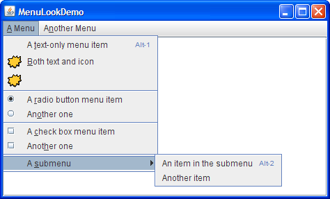
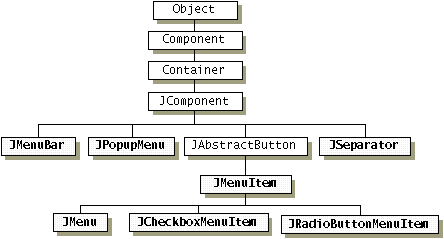
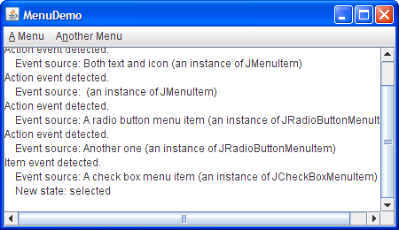

# 如何使用菜单

> 原文： [https://docs.oracle.com/javase/tutorial/uiswing/components/menu.html](https://docs.oracle.com/javase/tutorial/uiswing/components/menu.html)

菜单提供了一种节省空间的方式，让用户可以选择其中一个选项。用户可以做出多种选择的其他组件包括[组合框](combobox.html)，[列出](list.html)，[单选按钮](button.html#radiobutton)，[微调器](spinner.html)，和[工具栏](toolbar.html)。如果您的任何菜单项执行的操作被另一个菜单项或工具栏按钮复制，则除了本节之外，您还应阅读[如何使用操作](../misc/action.html)。

菜单的独特之处在于，按照惯例，菜单不会与 UI 中的其他组件放在一起。相反，菜单通常出现在*菜单栏*或*弹出菜单*中。菜单栏包含一个或多个菜单，并具有通常的平台相关位置 - 通常位于窗口顶部。弹出菜单是一个不可见的菜单，直到用户在启用弹出窗口的组件上进行特定于平台的鼠标操作（例如按下鼠标右键）。然后弹出菜单出现在光标下。

下图显示了许多与菜单相关的组件：菜单栏，菜单，菜单项，单选按钮菜单项，复选框菜单项和分隔符。如您所见，菜单项可以包含图像或文本，或两者都有。您还可以指定其他属性，例如字体和颜色。



本节的其余部分将向您介绍菜单组件，并告诉您如何使用各种菜单功能：

*   [菜单组件层次结构](#hierarchy)
*   [创建菜单](#create)
*   [处理菜单项中的事件](#event)
*   [启用键盘操作](#mnemonic)
*   [打开一个弹出菜单](#popup)
*   [自定义菜单布局](#custom)
*   [菜单 API](#api)
*   [使用菜单的例子](#eg)

以下是与菜单相关的类的继承层次结构的图片：



如图所示，菜单项（包括菜单）只是[按钮](button.html)。您可能想知道菜单（如果它只是一个按钮）如何显示其菜单项。答案是，当菜单被激活时，它会自动弹出一个显示菜单项的弹出菜单。

以下代码创建此菜单部分开头附近显示的菜单。粗体代码行创建并连接菜单对象;其他代码设置或自定义菜单对象。您可以在 [`MenuLookDemo.java`](../examples/components/MenuLookDemoProject/src/components/MenuLookDemo.java) 中找到整个程序。其他所需文件列在[示例索引](../examples/components/index.html#MenuLookDemo)中。

* * *

**Try this:** 

*   单击“启动”按钮以使用 [Java™Web Start](http://www.oracle.com/technetwork/java/javase/javawebstart/index.html) （[下载 JDK 7 或更高版本](http://www.oracle.com/technetwork/java/javase/downloads/index.html)）运行 MenuLook 演示。或者，要自己编译并运行示例，请参考[示例索引](../examples/components/index.html#MenuLookDemo)。 [](https://docs.oracle.com/javase/tutorialJWS/samples/uiswing/MenuLookDemoProject/MenuLookDemo.jnlp) 

* * *

因为此代码没有事件处理，所以菜单除了看起来应该没有任何用处。如果运行该示例，您会注意到尽管缺少自定义事件处理，菜单和子菜单应该出现，并且当用户选择它们时，复选框和单选按钮会做出相应的响应。

```java
//Where the GUI is created:
JMenuBar menuBar;
JMenu menu, submenu;
JMenuItem menuItem;
JRadioButtonMenuItem rbMenuItem;
JCheckBoxMenuItem cbMenuItem;

//Create the menu bar.
menuBar = new JMenuBar();

//Build the first menu.
menu = new JMenu("A Menu");
menu.setMnemonic(KeyEvent.VK_A);
menu.getAccessibleContext().setAccessibleDescription(
        "The only menu in this program that has menu items");
menuBar.add(menu);

//a group of JMenuItems
menuItem = new JMenuItem("A text-only menu item",
                         KeyEvent.VK_T);
menuItem.setAccelerator(KeyStroke.getKeyStroke(
        KeyEvent.VK_1, ActionEvent.ALT_MASK));
menuItem.getAccessibleContext().setAccessibleDescription(
        "This doesn't really do anything");
menu.add(menuItem);

menuItem = new JMenuItem("Both text and icon",
                         new ImageIcon("images/middle.gif"));
menuItem.setMnemonic(KeyEvent.VK_B);
menu.add(menuItem);

menuItem = new JMenuItem(new ImageIcon("images/middle.gif"));
menuItem.setMnemonic(KeyEvent.VK_D);
menu.add(menuItem);

//a group of radio button menu items
menu.addSeparator();
ButtonGroup group = new ButtonGroup();
rbMenuItem = new JRadioButtonMenuItem("A radio button menu item");
rbMenuItem.setSelected(true);
rbMenuItem.setMnemonic(KeyEvent.VK_R);
group.add(rbMenuItem);
menu.add(rbMenuItem);

rbMenuItem = new JRadioButtonMenuItem("Another one");
rbMenuItem.setMnemonic(KeyEvent.VK_O);
group.add(rbMenuItem);
menu.add(rbMenuItem);

//a group of check box menu items
menu.addSeparator();
cbMenuItem = new JCheckBoxMenuItem("A check box menu item");
cbMenuItem.setMnemonic(KeyEvent.VK_C);
menu.add(cbMenuItem);

cbMenuItem = new JCheckBoxMenuItem("Another one");
cbMenuItem.setMnemonic(KeyEvent.VK_H);
menu.add(cbMenuItem);

//a submenu
menu.addSeparator();
submenu = new JMenu("A submenu");
submenu.setMnemonic(KeyEvent.VK_S);

menuItem = new JMenuItem("An item in the submenu");
menuItem.setAccelerator(KeyStroke.getKeyStroke(
        KeyEvent.VK_2, ActionEvent.ALT_MASK));
submenu.add(menuItem);

menuItem = new JMenuItem("Another item");
submenu.add(menuItem);
menu.add(submenu);

//Build second menu in the menu bar.
menu = new JMenu("Another Menu");
menu.setMnemonic(KeyEvent.VK_N);
menu.getAccessibleContext().setAccessibleDescription(
        "This menu does nothing");
menuBar.add(menu);

...
frame.setJMenuBar(_theJMenuBar_);

```

如代码所示，要设置`JFrame`的菜单栏，请使用`setJMenuBar`方法。要将`JMenu`添加到`JMenuBar`，请使用`add(JMenu)`方法。要将菜单项和子菜单添加到`JMenu`，请使用`add(JMenuItem)`方法。

* * *

**Note:** 

菜单项与其他组件一样，最多可以包含一个容器。如果您尝试将菜单项添加到第二个菜单，则菜单项将从第一个菜单中删除，然后再添加到第二个菜单中。有关实现执行相同操作的多个组件的方法，请参阅[如何使用操作](../misc/action.html)。

* * *

上述代码中的其他方法包括`setAccelerator`和`setMnemonic`，稍后将在[启用键盘操作](#mnemonic)中讨论。 `setAccessibleDescription`方法在[如何支持辅助技术](../misc/access.html)中讨论。

要检测用户何时选择`JMenuItem`，您可以监听动作事件（就像 [`JButton`](button.html) 一样）。要检测用户何时选择`JRadioButtonMenuItem`，您可以侦听动作事件或项目事件，如[如何使用单选按钮](button.html#radiobutton)中所述。对于`JCheckBoxMenuItem`，您通常会听取项目事件，如[如何使用复选框](button.html#checkbox)中所述。

* * *

**Try this:** 

*   单击“启动”按钮以使用 [Java™Web Start](http://www.oracle.com/technetwork/java/javase/javawebstart/index.html) （[下载 JDK 7 或更高版本](http://www.oracle.com/technetwork/java/javase/downloads/index.html)）运行菜单演示。或者，要自己编译并运行示例，请参考[示例索引](../examples/components/index.html#MenuDemo)。 [](https://docs.oracle.com/javase/tutorialJWS/samples/uiswing/MenuDemoProject/MenuDemo.jnlp) 

* * *



以下是实现事件处理的代码：

```java
public class MenuDemo ... implements ActionListener,
                                     ItemListener {
    ...
    public MenuDemo() {
        //...for each JMenuItem instance:
        menuItem.addActionListener(this);
        ...
        //for each JRadioButtonMenuItem: 
        rbMenuItem.addActionListener(this);
        ...
        //for each JCheckBoxMenuItem: 
        cbMenuItem.addItemListener(this);
        ...
    }

    public void actionPerformed(ActionEvent e) {
        //...Get information from the action event...
        //...Display it in the text area...
    }

    public void itemStateChanged(ItemEvent e) {
        //...Get information from the item event...
        //...Display it in the text area...
    }

```

有关处理动作和项目事件的示例，请参阅[按钮](button.html)，[单选按钮](button.html#radiobutton)和[复选框](button.html#checkbox)部分，以及[示例列表](#eg)在本节末尾。

菜单支持两种键盘选择：助记符和加速器。*助记符*提供了一种使用键盘导航菜单层次结构的方法，增加了程序的可访问性。另一方面，*加速器*提供键盘快捷键到*旁路*导航菜单层次结构。助记符适用于所有用户;加速器适用于高级用户。

助记符是使得已经可见的菜单项被选择的关键。例如，在`MenuDemo`中，第一个菜单具有助记符 A，而其第二个菜单项具有助记符 B.这意味着，当您使用 Java 外观运行`MenuDemo`时，按 Alt 和 A 键可使第一个菜单出现。当第一个菜单可见时，按 B 键（带或不带 Alt）可选择第二个菜单项。菜单项通常通过在菜单项的文本中下划线第一次出现的助记符来显示其助记符，如下面的快照所示。


加速器是一种组合键，可以选择菜单项，无论它是否可见。例如，按`MenuDemo`中的 Alt 和 2 键可以选择第一个菜单子菜单中的第一个项目，而不会显示任何菜单。只有叶子菜单项 - 没有显示其他菜单的菜单 - 可以有加速器。以下快照显示 Java 外观如何显示具有加速器的菜单项。


您可以在构造菜单项时或使用`setMnemonic`方法指定助记符。要指定加速器，请使用`setAccelerator`方法。以下是设置助记符和加速器的示例：

```java
//Setting the mnemonic when constructing a menu item:
menuItem = new JMenuItem("A text-only menu item",
                         KeyEvent.VK_T);

//Setting the mnemonic after creation time:
menuItem.setMnemonic(KeyEvent.VK_T);

//Setting the accelerator:
menuItem.setAccelerator(KeyStroke.getKeyStroke(
        KeyEvent.VK_T, ActionEvent.ALT_MASK));

```

如您所见，通过指定与用户应按下的键对应的 [`KeyEvent`](https://docs.oracle.com/javase/8/docs/api/java/awt/event/KeyEvent.html) 常量来设置助记符。要指定加速器，必须使用 [`KeyStroke`](https://docs.oracle.com/javase/8/docs/api/javax/swing/KeyStroke.html) 对象，该对象组合了一个键（由`KeyEvent`常量指定）和一个修饰键掩码（由 [`ActionEvent` [HTG5 指定] ] 不变）。](https://docs.oracle.com/javase/8/docs/api/java/awt/event/ActionEvent.html)

* * *

**Note:** 

由于弹出菜单与常规菜单不同，并不总是由组件包含，因此弹出菜单项中的加速器不起作用，除非弹出菜单可见。

* * *

要调出弹出菜单（ [`JPopupMenu`](https://docs.oracle.com/javase/8/docs/api/javax/swing/JPopupMenu.html) ），您必须在弹出菜单应与之关联的每个组件上注册鼠标监听器。鼠标监听器必须检测弹出菜单的用户请求。

应该弹出弹出菜单的确切手势因外观而异。在 Microsoft Windows 中，按照惯例，用户通过释放鼠标右键来显示弹出菜单，同时光标位于启用弹出窗口的组件上。在 Java 外观中，惯常的触发器是按下鼠标右键（对于释放按钮时消失的弹出窗口）或单击它（对于弹出窗口保持不动）。

* * *

**Try this:** 

*   单击“启动”按钮以使用 [Java™Web Start](http://www.oracle.com/technetwork/java/javase/javawebstart/index.html) （[下载 JDK 7 或更高版本](http://www.oracle.com/technetwork/java/javase/downloads/index.html)）运行 PopupMenu 演示。或者，要自己编译并运行示例，请参考[示例索引](../examples/components/index.html#PopupMenuDemo)。 [](https://docs.oracle.com/javase/tutorialJWS/samples/uiswing/PopupMenuDemoProject/PopupMenuDemo.jnlp) 

* * *

```java
//...where instance variables are declared:
JPopupMenu popup;

    //...where the GUI is constructed:
    //Create the popup menu.
    popup = new JPopupMenu();
    menuItem = new JMenuItem("A popup menu item");
    menuItem.addActionListener(this);
    popup.add(menuItem);
    menuItem = new JMenuItem("Another popup menu item");
    menuItem.addActionListener(this);
    popup.add(menuItem);

    //Add listener to components that can bring up popup menus.
    MouseListener popupListener = new PopupListener();
    output.addMouseListener(popupListener);
    menuBar.addMouseListener(popupListener);
...
class PopupListener extends MouseAdapter {
    public void mousePressed(MouseEvent e) {
        maybeShowPopup(e);
    }

    public void mouseReleased(MouseEvent e) {
        maybeShowPopup(e);
    }

    private void maybeShowPopup(MouseEvent e) {
        if (e.isPopupTrigger()) {
            popup.show(e.getComponent(),
                       e.getX(), e.getY());
        }
    }
}

```

弹出菜单有一些有趣的实现细节。一个是每个菜单都有一个相关的弹出菜单。菜单激活后，它会使用其关联的弹出菜单显示其菜单项。

另一个细节是弹出菜单本身使用另一个组件来实现包含菜单项的窗口。根据弹出菜单显示的环境，弹出菜单可以使用轻量级组件（例如`JPanel`），“中等重量”组件（例如 [`Panel` []来实现其“窗口”。 HTG1]），或重量级窗口（继承自](https://docs.oracle.com/javase/8/docs/api/java/awt/Panel.html) [`Window`](https://docs.oracle.com/javase/8/docs/api/java/awt/Window.html) 的东西）。

轻量级弹出窗口比重量级窗口更有效，但在 Java SE Platform 6 Update 12 发布之前，如果 GUI 中有任何重量级组件，它们就无法正常工作。具体来说，当轻量级弹出窗口的显示区域与重量级组件的显示区域相交时，重量级组件被绘制在顶部。这是在 6u12 发布之前，我们建议不要混合重量级和轻量级组件的原因之一。如果您使用的是旧版本并且绝对需要在 GUI 中使用重量级组件，则可以调用`JPopupMenu.setLightWeightPopupEnabled(false)`来禁用轻量级弹出窗口。有关在 6u12 及更高版本中混合组件的信息，请参阅[混合重量级和轻量级组件](http://www.oracle.com/technetwork/articles/java/mixing-components-433992.html)。

由于菜单由普通的 Swing 组件组成，因此您可以轻松自定义它们。例如，您可以将任何轻量级组件添加到`JMenu`或`JMenuBar`。并且因为`JMenuBar`使用 [`BoxLayout`](../layout/box.html) ，您可以通过向其添加不可见组件来自定义菜单栏的布局。以下是将 [glue](../layout/box.html#filler) 组件添加到菜单栏的示例，以便最后一个菜单位于菜单栏的右边缘：

```java
//...create and add some menus...
menuBar.add(Box.createHorizontalGlue());
//...create the rightmost menu...
menuBar.add(rightMenu);

```

* * *

**Try this:** 

*   单击“启动”按钮以使用 [Java™Web Start](http://www.oracle.com/technetwork/java/javase/javawebstart/index.html) （[下载 JDK 7 或更高版本](http://www.oracle.com/technetwork/java/javase/downloads/index.html)）运行 MenuGlue 演示。或者，要自己编译并运行示例，请参考[示例索引](../examples/components/index.html#MenuGlueDemo)。 [](https://docs.oracle.com/javase/tutorialJWS/samples/uiswing/MenuGlueDemoProject/MenuGlueDemo.jnlp) 

* * *

这是 MenuGlueDemo 显示的修改后的菜单布局：


更改菜单外观的另一种方法是更改​​用于控制菜单的布局管理器。例如，您可以将菜单栏的布局管理器从默认的从左到右`BoxLayout`更改为`GridLayout`等。

* * *

**Try this:** 

*   单击“启动”按钮以使用 [Java™Web Start](http://www.oracle.com/technetwork/java/javase/javawebstart/index.html) （[下载 JDK 7 或更高版本](http://www.oracle.com/technetwork/java/javase/downloads/index.html)）运行 MenuLayout 演示。或者，要自己编译并运行示例，请参考[示例索引](../examples/components/index.html#MenuLayoutDemo)。 [](https://docs.oracle.com/javase/tutorialJWS/samples/uiswing/MenuLayoutDemoProject/MenuLayoutDemo.jnlp) 

* * *

这是`MenuLayoutDemo`创建的菜单布局图：


下表列出了常用的菜单构造器和方法。使用菜单的 API 分为以下几类：

*   [创建和设置菜单栏](#menubarapi)
*   [创建和填充菜单](#menuapi)
*   [创建，填充和控制弹出菜单](#popupapi)
*   [实现菜单项](#itemapi)


| 构造器或方法 | 目的 |
| :-- | :-- |
| [JMenuBar（）](https://docs.oracle.com/javase/8/docs/api/javax/swing/JMenuBar.html#JMenuBar--) | 创建一个菜单栏。 |
| [JMenu add（JMenu）](https://docs.oracle.com/javase/8/docs/api/javax/swing/JMenuBar.html#add-javax.swing.JMenu-) | 将菜单添加到菜单栏的末尾。 |
| [void setJMenuBar（JMenuBar）](https://docs.oracle.com/javase/8/docs/api/javax/swing/JFrame.html#setJMenuBar-javax.swing.JMenuBar-)
[JMenuBar getJMenuBar（）](https://docs.oracle.com/javase/8/docs/api/javax/swing/JFrame.html#getJMenuBar--)
_（`JApplet`，`JDialog`，`JFrame`，`JInternalFrame`，`JRootPane` ]）_ | 设置或获取[小程序](applet.html)，[对话框](dialog.html)，[框架](frame.html)，[内部框架](internalframe.html)或[根窗格](rootpane.html)的菜单栏。 |


| 构造器或方法 | 目的 |
| :-- | :-- |
| [JMenu（）](https://docs.oracle.com/javase/8/docs/api/javax/swing/JMenu.html#JMenu--)
[JMenu（String）](https://docs.oracle.com/javase/8/docs/api/javax/swing/JMenu.html#JMenu-java.lang.String-)
[JMenu（行动）](https://docs.oracle.com/javase/8/docs/api/javax/swing/JMenu.html#JMenu-javax.swing.Action-) | 创建一个菜单。该字符串指定要为菜单显示的文本。 `Action`指定菜单的文本和其他属性（参见[如何使用操作](../misc/action.html)）。 |
| [JMenuItem add（JMenuItem）](https://docs.oracle.com/javase/8/docs/api/javax/swing/JMenu.html#add-javax.swing.JMenuItem-)
[JMenuItem add（String）](https://docs.oracle.com/javase/8/docs/api/javax/swing/JMenu.html#add-java.lang.String-) | 将菜单项添加到菜单的当前末尾。如果参数是字符串，则菜单会自动创建一个显示指定文本的`JMenuItem`对象。 |
| [void addSeparator（）](https://docs.oracle.com/javase/8/docs/api/javax/swing/JMenu.html#addSeparator--) | 将分隔符添加到菜单的当前末尾。 |
| [JMenuItem 插入（JMenuItem，int）](https://docs.oracle.com/javase/8/docs/api/javax/swing/JMenu.html#insert-javax.swing.JMenuItem-int-)
[void 插入（String，int）](https://docs.oracle.com/javase/8/docs/api/javax/swing/JMenu.html#insert-java.lang.String-int-)
[void insertSeparator（int）](https://docs.oracle.com/javase/8/docs/api/javax/swing/JMenu.html#insertSeparator-int-) | 将菜单项或分隔符插入到指定位置的菜单中。第一个菜单项位于 0 位置，第二个菜单项位于位置 1，依此类推。 `JMenuItem`和`String`参数的处理方式与相应的`add`方法相同。 |
| [void remove（JMenuItem）](https://docs.oracle.com/javase/8/docs/api/javax/swing/JMenu.html#remove-javax.swing.JMenuItem-)
[void remove（int）](https://docs.oracle.com/javase/8/docs/api/javax/swing/JMenu.html#remove-int-)
[void removeAll（）](https://docs.oracle.com/javase/8/docs/api/javax/swing/JMenu.html#removeAll--) | 从菜单中删除指定的项目。如果参数是整数，则它指定要删除的菜单项的位置。 |


| 构造器或方法 | 目的 |
| :-- | :-- |
| [JPopupMenu（）](https://docs.oracle.com/javase/8/docs/api/javax/swing/JPopupMenu.html#JPopupMenu--)
[JPopupMenu（String）](https://docs.oracle.com/javase/8/docs/api/javax/swing/JPopupMenu.html#JPopupMenu-java.lang.String-) | 创建一个弹出菜单。可选的字符串参数指定外观可能显示为弹出窗口一部分的标题。 |
| [JMenuItem add（JMenuItem）](https://docs.oracle.com/javase/8/docs/api/javax/swing/JPopupMenu.html#add-javax.swing.JMenuItem-)
[JMenuItem add（String）](https://docs.oracle.com/javase/8/docs/api/javax/swing/JPopupMenu.html#add-java.lang.String-) | 将菜单项添加到弹出菜单的当前末尾。如果参数是字符串，则菜单会自动创建一个显示指定文本的`JMenuItem`对象。 |
| [void addSeparator（）](https://docs.oracle.com/javase/8/docs/api/javax/swing/JPopupMenu.html#addSeparator--) | 将分隔符添加到弹出菜单的当前末尾。 |
| [void insert（Component，int）](https://docs.oracle.com/javase/8/docs/api/javax/swing/JPopupMenu.html#insert-java.awt.Component-int-) | 将菜单项插入指定位置的菜单中。第一个菜单项位于 0 位置，第二个菜单项位于位置 1，依此类推。 `Component`参数指定要添加的菜单项。 |
| [void remove（int）](https://docs.oracle.com/javase/8/docs/api/javax/swing/JPopupMenu.html#remove-int-)
[void removeAll（）](https://docs.oracle.com/javase/8/docs/api/java/awt/Container.html#removeAll--) | 从菜单中删除指定的项目。如果参数是整数，则它指定要删除的菜单项的位置。 |
| [static void setLightWeightPopupEnabled（boolean）](https://docs.oracle.com/javase/8/docs/api/javax/swing/JPopupMenu.html#setLightWeightPopupEnabled-boolean-) | 默认情况下，Swing 使用轻量级组件实现菜单窗口。如果您在 Swing 程序中使用任何重量级组件，这可能会导致问题，如[打开弹出菜单](#popup)中所述。 （这是避免使用重量级组件的几个原因之一。）作为解决方法，请调用`JPopupMenu.setLightWeightPopupEnabled(false)`。 |
| [void show（Component，int，int）](https://docs.oracle.com/javase/8/docs/api/javax/swing/JPopupMenu.html#show-java.awt.Component-int-int-) | 在指定组件的坐标系中，在指定的 _x，y_ 位置（按整数参数的顺序指定）显示弹出菜单。 |


| 构造器或方法 | 目的 |
| :-- | :-- |
| [JMenuItem（）](https://docs.oracle.com/javase/8/docs/api/javax/swing/JMenuItem.html#JMenuItem--)
[JMenuItem（String）](https://docs.oracle.com/javase/8/docs/api/javax/swing/JMenuItem.html#JMenuItem-java.lang.String-)
[JMenuItem（Icon）](https://docs.oracle.com/javase/8/docs/api/javax/swing/JMenuItem.html#JMenuItem-javax.swing.Icon-)
[JMenuItem（String，Icon）](https://docs.oracle.com/javase/8/docs/api/javax/swing/JMenuItem.html#JMenuItem-java.lang.String-javax.swing.Icon-)
[JMenuItem（String，int）](https://docs.oracle.com/javase/8/docs/api/javax/swing/JMenuItem.html#JMenuItem-java.lang.String-int-)
[JMenuItem（动作）](https://docs.oracle.com/javase/8/docs/api/javax/swing/JMenuItem.html#JMenuItem-javax.swing.Action-) | Creates an ordinary menu item. The icon argument, if present, specifies the icon that the menu item should display. Similarly, the string argument specifies the text that the menu item should display. The integer argument specifies the keyboard mnemonic to use. You can specify any of the relevant VK constants defined in the [KeyEvent](https://docs.oracle.com/javase/8/docs/api/java/awt/event/KeyEvent.html) class. For example, to specify the A key, use `KeyEvent.VK_A`.带有`Action`参数的构造器设置菜单项的`Action`，从而使`Action`初始化菜单项的属性。有关详细信息，请参见[如何使用操作](../misc/action.html)。 |
| [JCheckBoxMenuItem（）](https://docs.oracle.com/javase/8/docs/api/javax/swing/JCheckBoxMenuItem.html#JCheckBoxMenuItem--)
[JCheckBoxMenuItem（String）](https://docs.oracle.com/javase/8/docs/api/javax/swing/JCheckBoxMenuItem.html#JCheckBoxMenuItem-java.lang.String-)
[JCheckBoxMenuItem（Icon）](https://docs.oracle.com/javase/8/docs/api/javax/swing/JCheckBoxMenuItem.html#JCheckBoxMenuItem-javax.swing.Icon-)
[JCheckBoxMenuItem（String，Icon）](https://docs.oracle.com/javase/8/docs/api/javax/swing/JCheckBoxMenuItem.html#JCheckBoxMenuItem-java.lang.String-javax.swing.Icon-)
[JCheckBoxMenuItem（String，boolean）](https://docs.oracle.com/javase/8/docs/api/javax/swing/JCheckBoxMenuItem.html#JCheckBoxMenuItem-java.lang.String-boolean-)
[JCheckBoxMenuItem（String，Icon，boolean）](https://docs.oracle.com/javase/8/docs/api/javax/swing/JCheckBoxMenuItem.html#JCheckBoxMenuItem-java.lang.String-javax.swing.Icon-boolean-) | 创建一个菜单项，其外观和行为类似于复选框。字符串参数（如果有）指定菜单项应显示的文本。如果为布尔参数指定`true`，则最初选择（选中）菜单项。否则，最初取消选择菜单项。 |
| [JRadioButtonMenuItem（）](https://docs.oracle.com/javase/8/docs/api/javax/swing/JRadioButtonMenuItem.html#JRadioButtonMenuItem--)
[JRadioButtonMenuItem（String）](https://docs.oracle.com/javase/8/docs/api/javax/swing/JRadioButtonMenuItem.html#JRadioButtonMenuItem-java.lang.String-)
[JRadioButtonMenuItem（Icon）](https://docs.oracle.com/javase/8/docs/api/javax/swing/JRadioButtonMenuItem.html#JRadioButtonMenuItem-javax.swing.Icon-)
[JRadioButtonMenuItem（String，Icon）](https://docs.oracle.com/javase/8/docs/api/javax/swing/JRadioButtonMenuItem.html#JRadioButtonMenuItem-java.lang.String-javax.swing.Icon-)
[JRadioButtonMenuItem（String，boolean）](https://docs.oracle.com/javase/8/docs/api/javax/swing/JRadioButtonMenuItem.html#JRadioButtonMenuItem-java.lang.String-boolean-)
[JRadioButtonMenuItem（Icon，boolean）](https://docs.oracle.com/javase/8/docs/api/javax/swing/JRadioButtonMenuItem.html#JRadioButtonMenuItem-javax.swing.Icon-boolean-)
[JRadioButtonMenuItem（String，Icon，boolean）](https://docs.oracle.com/javase/8/docs/api/javax/swing/JRadioButtonMenuItem.html#JRadioButtonMenuItem-java.lang.String-javax.swing.Icon-boolean-) | 创建一个看起来像单选按钮的菜单项。字符串参数（如果有）指定菜单项应显示的文本。如果为布尔参数指定`true`，则最初选择菜单项。否则，最初取消选择菜单项。 |
| [void setState（boolean）](https://docs.oracle.com/javase/8/docs/api/javax/swing/JCheckBoxMenuItem.html#setState-boolean-)
[boolean getState（）](https://docs.oracle.com/javase/8/docs/api/javax/swing/JCheckBoxMenuItem.html#getState--)
_（在`JCheckBoxMenuItem`中）_ | 设置或获取复选框菜单项的选择状态。 |
| [void setEnabled（boolean）](https://docs.oracle.com/javase/8/docs/api/javax/swing/AbstractButton.html#setEnabled-boolean-) | 如果参数为 true，则启用菜单项。否则，禁用菜单项。 |
| [void setMnemonic（int）](https://docs.oracle.com/javase/8/docs/api/javax/swing/AbstractButton.html#setMnemonic-int-) | 设置启用键盘导航到菜单或菜单项的助记符。使用`KeyEvent`类中定义的 VK 常量之一。 |
| [void setAccelerator（KeyStroke）](https://docs.oracle.com/javase/8/docs/api/javax/swing/JMenuItem.html#setAccelerator-javax.swing.KeyStroke-) | 设置激活菜单项的加速器。 |
| [void setActionCommand（String）](https://docs.oracle.com/javase/8/docs/api/javax/swing/AbstractButton.html#setActionCommand-java.lang.String-) | 设置菜单项执行的操作的名称。 |
| [void addActionListener（ActionListener）](https://docs.oracle.com/javase/8/docs/api/javax/swing/AbstractButton.html#addActionListener-java.awt.event.ActionListener-)
[void addItemListener（ItemListener）](https://docs.oracle.com/javase/8/docs/api/javax/swing/AbstractButton.html#addItemListener-java.awt.event.ItemListener-) | 向菜单项添加事件监听器。有关详细信息，请参阅[处理菜单项](#event)中的事件。 |
| [void setAction（Action）](https://docs.oracle.com/javase/8/docs/api/javax/swing/AbstractButton.html#setAction-javax.swing.Action-) | 设置与菜单项关联的`Action`。有关详细信息，请参见[如何使用操作](../misc/action.html)。 |
|  | 许多前面的方法都是从`AbstractButton`继承的。有关`AbstractButton`提供的其他有用方法的信息，请参见 [Button API](button.html#api) 。 |

我们的一些例子中使用了菜单。

| 例 | 在哪里描述 | 笔记 |
| :-- | :-- | :-- |
| [`MenuLookDemo`](../examples/components/index.html#MenuLookDemo) | 本节（[创建菜单](#create)） | 一个简单的示例，它创建除弹出菜单之外的所有类型的菜单，但不处理菜单项中的事件。 |
| [`MenuDemo`](../examples/components/index.html#MenuDemo) | 本节（[处理菜单项中的事件](#event)） | 将事件处理添加到`MenuLookDemo`。 |
| [`PopupMenuDemo`](../examples/components/index.html#PopupMenuDemo) | 本节（[打开一个弹出菜单](#popup)） | 将弹出菜单添加到`MenuDemo`。 |
| [`MenuGlueDemo`](../examples/components/index.html#MenuGlueDemo) | 本节（[自定义菜单布局](#custom)） | 通过向菜单栏添加不可见组件来演示影响菜单布局。 |
| [`MenuLayoutDemo`](../examples/components/index.html#MenuLayoutDemo) | 本节（[自定义菜单布局](#custom)） | 实现在垂直菜单栏中排列的侧面打开菜单。 |
| [`MenuSelectionManagerDemo`](../examples/components/index.html#MenuSelectionManagerDemo) | - | 将高亮度检测添加到 MenuDemo。要查看此功能，请单击菜单，然后将鼠标移到任何菜单项或子菜单上。每秒一次，文本区域将更新有关当前突出显示的菜单项的信息，不要与用户最终选择的菜单项混淆。此演示使用默认 [`MenuSelectionManager`](https://docs.oracle.com/javase/8/docs/api/javax/swing/MenuSelectionManager.html) ，它跟踪菜单层次结构的状态。 |
| [`ActionDemo`](../examples/misc/index.html#ActionDemo) | [如何使用行动](../misc/action.html) | 使用`Action`对象实现复制工具栏按钮提供的功能的菜单项。 |
| [`Framework`](../examples/components/index.html#Framework) | - | 打开多个相同的框架，每个框架的菜单栏都有一个菜单。 |
| [`InternalFrameDemo`](../examples/components/index.html#InternalFrameDemo) | [如何使用内部框架](internalframe.html) | 使用菜单项创建窗口。 |

请参阅[使用 JavaFX UI 控件：菜单](https://docs.oracle.com/javase/8/javafx/user-interface-tutorial/menu_controls.htm)教程，了解如何在 JavaFX 中创建菜单。