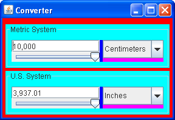

# 如何使用面板

> 原文： [https://docs.oracle.com/javase/tutorial/uiswing/components/panel.html](https://docs.oracle.com/javase/tutorial/uiswing/components/panel.html)

[`JPanel`](https://docs.oracle.com/javase/8/docs/api/javax/swing/JPanel.html) 类为轻量级组件提供通用容器。默认情况下，除了自己的背景外，面板不会添加任何颜色;但是，您可以轻松地为它们添加边框，也可以自定义它们的绘画。详细信息请参见[执行自定义绘画](../painting/index.html)。

在许多类型的外观中，面板默认是不透明的。不透明的面板可以作为内容窗格使用，并且可以有效地帮助绘画，如[使用顶级容器](toplevel.html)中所述。您可以通过调用`setOpaque`方法来更改面板的透明度。透明面板不会绘制背景，因此下方的任何组件都会显示出来。

下图显示了`Converter`应用程序的彩色版本，在[使用模型](model.html)中有更详细的讨论。

<center></center>

`Converter`示例以多种方式使用面板：

*   一个`JPanel`实例 - 前一个快照中的红色 - 用作应用程序框架的内容窗格。此内容窗格使用从上到下 [`BoxLayout`](../layout/box.html) 来布置其内容，并使用空边框在其周围放置 5 个像素的空间。有关内容窗格的信息，请参阅[使用顶级容器](toplevel.html)。
*   名为`ConversionPanel`的自定义`JPanel`子类的两个实例 - 彩色青色 - 用于包含组件并协调组件之间的通信。这些`ConversionPanel`面板还有标题边框，用于描述其内容并用线条包围内容。每个`ConversionPanel`面板使用从左到右`BoxLayout`对象来布置其内容。
*   在每个`ConversionPanel`中，`JPanel`实例 - 彩色洋红色 - 用于确保组合框的正确大小和位置。这些`JPanel`实例中的每一个都使用从上到下`BoxLayout`对象（由不可见的空间填充组件帮助）来布置组合框。
*   在每个`ConversionPanel`中，未命名的`JPanel`子类的实例 - 蓝色 - 将两个组件（文本字段和滑块）组合在一起并限制它们的大小。这些`JPanel`实例中的每一个都使用从上到下`BoxLayout`对象来布置其内容。

这是`Converter`应用程序通常的样子。

<center></center>

正如`Converter`示例所示，面板可用于对组件进行分组，简化组件布局以及围绕组件组放置边框。本节的其余部分提供了有关分组和布局组件的提示。有关使用边框的信息，请参阅[如何使用边框](../components/border.html)。

与其他容器一样，面板使用布局管理器来定位和调整其组件的大小。默认情况下，面板的布局管理器是 [`FlowLayout`](../layout/flow.html) 的实例，它将面板的内容放在一行中。通过调用`setLayout`方法或在创建面板时指定布局管理器，可以轻松地使面板使用任何其他布局管理器。出于性能原因，后一种方法是优选的，因为它避免了不必要的`FlowLayout`对象的创建。

以下是创建面板时如何设置布局管理器的示例。

```
JPanel p = new JPanel(new BorderLayout()); //PREFERRED!

```

这种方法不适用于`BoxLayout`，因为`BoxLayout`构造函数需要预先存在的容器。这是一个使用`BoxLayout`的例子。

```
JPanel p = new JPanel();
p.setLayout(new BoxLayout(p, BoxLayout.PAGE_AXIS));

```

向组件添加组件时，使用`add`方法。确切地说，您为`add`方法指定的参数取决于面板使用的布局管理器。当布局管理器是`FlowLayout`，`BoxLayout`，`GridLayout`或`SpringLayout`时，您通常会使用单参数`add`方法，如下所示：

```
aFlowPanel.add(aComponent);
aFlowPanel.add(anotherComponent);

```

当布局管理器为`BorderLayout`时，您需要提供一个参数，指定添加的组件在面板中的位置。例如：

```
aBorderPanel.add(aComponent, BorderLayout.CENTER);
aBorderPanel.add(anotherComponent, BorderLayout.PAGE_END);

```

使用`GridBagLayout`，您可以使用`add`方法，但必须以某种方式为每个组件指定[网格包约束](../layout/gridbag.html#gridbagConstraints)。

有关选择和使用标准布局管理器的信息，请参阅[使用布局管理器](../layout/using.html)。

`JPanel`类本身的 API 很小。您最有可能在`JPanel`对象上调用的方法是它从超类继承的方法 - [`JComponent`](https://docs.oracle.com/javase/8/docs/api/javax/swing/JComponent.html) ， [`Container`](https://docs.oracle.com/javase/8/docs/api/java/awt/Container.html) 和 [`Component`](https://docs.oracle.com/javase/8/docs/api/java/awt/Component.html) 。下表列出了您最有可能使用的 API，但与 [border](../components/border.html) 和[布局提示](jcomponent.html#layoutapi)相关的方法除外。有关所有`JComponent`对象可以使用的 API 的更多信息，请参阅 [JComponent 类](jcomponent.html)。

*   [创建`JPanel`](#creating)
*   [管理容器组件](#contents)
*   [设置或获取布局管理器](#layoutapi)

<caption></caption>
|  | 目的 |
| :-- | :-- |
| [JPanel（）](https://docs.oracle.com/javase/8/docs/api/javax/swing/JPanel.html#JPanel--)
[JPanel（LayoutManager）](https://docs.oracle.com/javase/8/docs/api/javax/swing/JPanel.html#JPanel-java.awt.LayoutManager-) | 创建一个面板。 `LayoutManager`参数为新面板提供布局管理器。默认情况下，面板使用`FlowLayout`布局其组件。 |

<caption></caption>
| 方法 | 目的 |
| :-- | :-- |
| [void add（组分）](https://docs.oracle.com/javase/8/docs/api/java/awt/Container.html#add-java.awt.Component-)
[void add（组分，int）](https://docs.oracle.com/javase/8/docs/api/java/awt/Container.html#add-java.awt.Component-int-)
[void add（组分，对象）](https://docs.oracle.com/javase/8/docs/api/java/awt/Container.html#add-java.awt.Component-java.lang.Object-)
[无效 add（Component，Object，int）](https://docs.oracle.com/javase/8/docs/api/java/awt/Container.html#add-java.awt.Component-java.lang.Object-int-)
[void add（String，Component）](https://docs.oracle.com/javase/8/docs/api/java/awt/Container.html#add-java.lang.String-java.awt.Component-) | 将指定的组件添加到面板。如果存在，`int`参数是容器内组件的索引。默认情况下，添加的第一个组件位于索引 0，第二个组件位于索引 1，依此类推。 `Object`参数取决于布局管理器，通常向布局管理器提供有关添加组件的定位和其他布局约束的信息。 `String`参数类似于`Object`参数。 |
| [int getComponentCount（）](https://docs.oracle.com/javase/8/docs/api/java/awt/Container.html#getComponentCount--) | 获取此面板中的组件数。 |
| [组件 getComponent（int）](https://docs.oracle.com/javase/8/docs/api/java/awt/Container.html#getComponent-int-)
[组件 getComponentAt（int，int）](https://docs.oracle.com/javase/8/docs/api/java/awt/Container.html#getComponentAt-int-int-)
[组件 getComponentAt（Point）](https://docs.oracle.com/javase/8/docs/api/java/awt/Container.html#getComponentAt-java.awt.Point-)
[组件[] getComponents（）](https://docs.oracle.com/javase/8/docs/api/java/awt/Container.html#getComponents--) | 获取指定的一个或多个组件。您可以根据其索引或 _x，y_ 位置获取组件。 |
| [void remove（Component）](https://docs.oracle.com/javase/8/docs/api/java/awt/Container.html#remove-java.awt.Component-)
[void remove（int）](https://docs.oracle.com/javase/8/docs/api/java/awt/Container.html#remove-int-)
[void removeAll（）](https://docs.oracle.com/javase/8/docs/api/java/awt/Container.html#removeAll--) | 删除指定的组件。 |

<caption></caption>
| 方法 | 目的 |
| :-- | :-- |
| [void setLayout（LayoutManager）](https://docs.oracle.com/javase/8/docs/api/java/awt/Container.html#setLayout-java.awt.LayoutManager-)
[LayoutManager getLayout（）](https://docs.oracle.com/javase/8/docs/api/java/awt/Container.html#getLayout--) | 设置或获取此面板的布局管理器。布局管理器负责根据一些原理将面板的组件定位在面板的范围内。 |

本课程中包含的许多示例都使用`JPanel`对象。下表列出了一些。

| 例 | 在哪里描述 | 笔记 |
| :-- | :-- | :-- |
| [`Converter`](../examples/components/index.html#Converter) | 这个部分 | 使用五个面板，其中四个使用`BoxLayout`，其中一个使用`GridLayout`。面板使用边框，并根据需要使用大小和对齐提示来影响布局。 |
| [`ListDemo`](../examples/components/index.html#ListDemo) | [如何使用列表](list.html) | 使用具有默认`FlowLayout`管理器的面板将一个组件连续居中。 |
| [`ToolBarDemo`](../examples/components/index.html#ToolBarDemo) | [如何使用工具栏](toolbar.html) | 使用面板作为内容窗格。该面板包含三个组件，由`BorderLayout`列出。 |
| [`BorderDemo`](../examples/components/index.html#BorderDemo) | [如何使用边框](border.html) | 包含许多具有各种边框的面板。几个面板使用`BoxLayout`。 |
| [`BoxLayoutDemo`](../examples/layout/index.html#BoxLayoutDemo) | [如何使用 BoxLayout](../layout/box.html) | 说明使用 Swing 的`BoxLayout`管理器的面板。 |