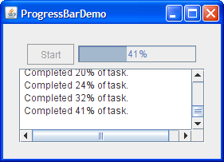
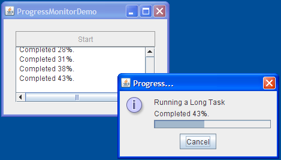

# 如何使用进度条

> 原文： [https://docs.oracle.com/javase/tutorial/uiswing/components/progress.html](https://docs.oracle.com/javase/tutorial/uiswing/components/progress.html)

有时，程序中运行的任务可能需要一段时间才能完成。用户友好的程序向用户提供一些指示，即任务正在发生，任务可能需要多长时间，以及已经完成了多少工作。指示工作的一种方式，也许是进展的量，是使用动画图像。

另一种指示工作的方法是使用 [`Cursor`](https://docs.oracle.com/javase/8/docs/api/java/awt/Cursor.html) 类和`Component`定义的 [`setCursor`](https://docs.oracle.com/javase/8/docs/api/java/awt/Component.html#setCursor-java.awt.Cursor-) 方法设置等待光标。例如，以下代码使光标结束时显示等待光标`container`（包括它包含的没有指定光标的任何组件）：

```java
container.setCursor(Cursor.getPredefinedCursor(Cursor.WAIT_CURSOR));

```

要传达任务的完整程度，您可以使用如下所示的进度条：


有时您无法立即确定长时间运行任务的长度，或者任务可能长时间保持在相同的完成状态。通过将进度条置于*不确定模式，您可以显示没有可测量进度的工作。*不确定模式下的进度条显示动画以指示正在进行工作。只要进度条可以显示更有意义的信息，您应该将其切换回默认的确定模式。在 Java 外观中，不确定的进度条看起来像这样：


Swing 提供了三个类来帮助您使用进度条：

[**`JProgressBar`**](https://docs.oracle.com/javase/8/docs/api/javax/swing/JProgressBar.html)

A visible component to graphically display how much of a total task has completed. See [Using Determinate Progress Bars](#bars) for information and an example of using a typical progress bar. The section [Using Indeterminate Mode](#indeterminate) tells you how to animate a progress bar to show activity before the task's scope is known.

[**`ProgressMonitor`**](https://docs.oracle.com/javase/8/docs/api/javax/swing/ProgressMonitor.html)

_Not_ a visible component. Instead, an instance of this class monitors the progress of a task and pops up a [dialog](dialog.html) if necessary. See [How to Use Progress Monitors](#monitors) for details and an example of using a progress monitor.

[**`ProgressMonitorInputStream`**](https://docs.oracle.com/javase/8/docs/api/javax/swing/ProgressMonitorInputStream.html)

An input stream with an attached progress monitor, which monitors reading from the stream. You use an instance of this stream like any of the other input streams described in [Basic I/O](../../essential/io/index.html). You can get the stream's progress monitor with a call to `getProgressMonitor` and configure it as described in [How to Use Progress Monitors](#monitors).

在看到进度条和进度监视器正在运行后，[决定是否使用进度条或进度监视器](#deciding)可以帮助您找出适合您的应用程序的进度条。

这是一个小型演示应用程序的图片，它使用进度条来衡量在自己的线程中运行的任务的进度：



* * *

**Try this:** 

*   单击“启动”按钮以使用 [Java™Web Start](http://www.oracle.com/technetwork/java/javase/javawebstart/index.html) （[下载 JDK 7 或更高版本](http://www.oracle.com/technetwork/java/javase/downloads/index.html)）运行 ProgressBar 演示。或者，要自己编译并运行示例，请参考[示例索引](../examples/components/index.html#ProgressBarDemo)。 [](https://docs.oracle.com/javase/tutorialJWS/samples/uiswing/ProgressBarDemoProject/ProgressBarDemo.jnlp) 

* * *

以下代码来自 [`ProgressBarDemo.java`](../examples/components/ProgressBarDemoProject/src/components/ProgressBarDemo.java) ，创建并设置进度条：

```java
//Where member variables are declared:
JProgressBar progressBar;
...
//Where the GUI is constructed:
progressBar = new JProgressBar(0, task.getLengthOfTask());
progressBar.setValue(0);
progressBar.setStringPainted(true);

```

创建进度条的构造器设置进度条的最小值和最大值。您也可以使用`setMinimum`和`setMaximum`设置这些值。此程序中使用的最小值和最大值为 0 以及任务的长度，这是许多程序和任务的典型值。但是，进度条的最小值和最大值可以是任何值，甚至是负值。代码段还将进度条的当前值设置为 0。

对`setStringPainted`的调用导致进度条在其范围内显示已完成任务百分比的文本指示。默认情况下，进度条显示其`getPercentComplete`方法返回的值，格式为百分比，例如 **33％**。或者，您可以通过调用`setString`将默认值替换为其他字符串。例如，

```java
if (/*...half way done...*/)
    progressBar.setString("Half way there!");

```

当用户单击 **Start** 时，将创建并执行内部类`Task`的实例。

```java
public void actionPerformed(ActionEvent evt) {
    startButton.setEnabled(false);
    setCursor(Cursor.getPredefinedCursor(Cursor.WAIT_CURSOR));
    done = false;
    task = new Task();
    task.addPropertyChangeListener(this);
    task.execute();
}

```

`Task`是 [`javax.swing.SwingWorker`](https://docs.oracle.com/javase/8/docs/api/javax/swing/SwingWorker.html) 的子类。 `Task`实例为`ProgressBarDemo`做了三件重要事情：

1.  该实例在单独的线程中调用`doInBackground`。这是长时间运行的任务实际执行的地方。使用后台线程而不是事件派发线程可防止用户界面在任务运行时冻结。
2.  后台任务完成后，实例将在事件派发线程中调用`done`方法。
3.  该实例维护一个绑定属性`progress`，该属性已更新以指示任务的进度。每次`progress`更改时都会调用`propertyChange`方法。

有关`SwingWorker`的更多信息，请参阅 Swing 中[并发中的](../concurrency/index.html)[工作线程和 SwingWorker](../concurrency/worker.html) 。

`ProgressBarDemo`中的后台任务通过以随机间隔报告随机进度量来模拟真实任务。 `propertyChange`方法通过更新进度条来响应任务的`progress`属性的更改：

```java
public void propertyChange(PropertyChangeEvent evt) {
    if (!done) {
        int progress = task.getProgress();
        progressBar.setValue(progress);
        taskOutput.append(String.format(
                "Completed %d%% of task.\n", progress));
    }

```

后台任务完成后，任务的`done`方法将重置进度条：

```java
public void done() {
    //Tell progress listener to stop updating progress bar.
    done = true;
    Toolkit.getDefaultToolkit().beep();
    startButton.setEnabled(true);
    setCursor(null); //turn off the wait cursor
    progressBar.setValue(progressBar.getMinimum());
    taskOutput.append("Done!\n");
}

```

请注意，`done`方法将`done`字段设置为`true`，防止`propertyChange`进一步更新进度条。这是必要的，因为在调用`done`后可能会发生`progress`属性的最终更新。

在`ProgressBarDemo2`中设置不确定模式，直到实际进度开始：

```java
public void propertyChange(PropertyChangeEvent evt) {
    if (!done) {
        int progress = task.getProgress();
        if (progress == 0) {
            progressBar.setIndeterminate(true);
            taskOutput.append("No progress yet\n");
        } else {
            progressBar.setIndeterminate(false); 
            progressBar.setString(null);
            progressBar.setValue(progress);
            taskOutput.append(String.format(
                    "Completed %d%% of task.\n", progress));
        }
    }
}

```

代码中的其他更改与字符串显示有关。显示字符串的进度条可能比没有显示字符串的进度条高，并且，作为演示设计者，我们已经任意决定此进度条仅在其处于默认的确定模式时才显示字符串。但是，我们希望避免在更改模式时进度条更改高度时可能导致的布局丑陋。因此，代码在`setStringPainted(true)`的调用中离开但添加了对`setString("")`的调用，因此不会显示任何文本。稍后，当进度条从不确定模式切换到确定模式时，调用`setString(null)`会使进度条显示其默认字符串。

我们做的一个改变*而不是 _ make 正在从`progress`事件处理器中删除对`progressBar.setValue`的调用。该调用不会造成任何伤害，因为不确定的进度条不使用其 value 属性，除非可能在状态字符串中显示它。事实上，尽可能保持进度条的数据是最新的，因为一些外观可能不支持不确定模式。

* * *

**Try this:** 

1.  单击“启动”按钮以使用 [Java™Web Start](http://www.oracle.com/technetwork/java/javase/javawebstart/index.html) （[下载 JDK 7 或更高版本](http://www.oracle.com/technetwork/java/javase/downloads/index.html)）运行 ProgressBar2 演示。或者，要自己编译并运行示例，请参考[示例索引](../examples/components/index.html#ProgressBarDemo2)。 [](https://docs.oracle.com/javase/tutorialJWS/samples/uiswing/ProgressBarDemo2Project/ProgressBarDemo2.jnlp) 

2.  按**开始**按钮。请注意，一旦按下按钮，进度条就会开始动画，然后切换回确定模式（如 ProgressBarDemo）。

* * *

现在让我们重写 ProgressBarDemo 以使用进度监视器而不是进度条。这是新演示程序 ProgressMonitorDemo 的图片：



* * *

**Try this:** 

1.  单击“启动”按钮以使用 [Java™Web Start](http://www.oracle.com/technetwork/java/javase/javawebstart/index.html) （[下载 JDK 7 或更高版本](http://www.oracle.com/technetwork/java/javase/downloads/index.html)）运行 ProgressMonitor 演示。或者，要自己编译并运行示例，请参考[示例索引](../examples/components/index.html#ProgressMonitorDemo)。 [](https://docs.oracle.com/javase/tutorialJWS/samples/uiswing/ProgressMonitorDemoProject/ProgressMonitorDemo.jnlp) 

2.  按**开始**按钮。经过一段时间后，程序会显示一个进度对话框。
3.  单击 **OK** 按钮。请注意，即使对话框消失，任务仍会继续。
4.  开始另一项任务。弹出对话框后，单击**取消**按钮。对话框消失，任务停止。

* * *

无法再次使用进度监视器，因此每次启动新任务时都必须创建一个新进度监视器。每次用户使用 **Start** 按钮开始新任务时，该程序都会创建一个进度监视器。

这是创建进度监视器的语句：

```java
progressMonitor = new ProgressMonitor(ProgressMonitorDemo.this,
                                      "Running a Long Task",
                                      "", 0, task.getLengthOfTask());

```

此代码使用`ProgressMonitor`唯一的构造器来创建监视器并初始化多个参数：

*   第一个参数将父组件提供给进度监视器弹出的对话框。
*   第二个参数是一个字符串，用于描述被监视任务的性质。该字符串显示在对话框中。有关此参数的详细信息，请参阅 [Progress Monitoring API](#api) 。
*   第三个参数是另一个提供可更改状态注释的字符串。该示例使用空字符串来指示对话框应为可更改的状态注释创建空间，但该注释最初为空。如果为此参数提供`null`，则会从对话框中省略该注释。每次`progress`属性更改时，该示例都会更新注释。它同时更新监视器的当前值：

    ```java
     int progress = task.getProgress（）; String message = String.format（“Completed％d %%。\ n”，progress）;  progressMonitor.setNote（message）; progressMonitor.setProgress（进展）;  taskOutput.append（message）; 
    ```

*   最后两个参数分别为对话框中显示的进度条提供最小值和最大值。

默认情况下，进度监视器会在决定是否弹出对话框之前等待 500 毫秒的最小值。它还等待进度超过最小值。如果计算任务完成时间超过 2000 毫秒，则会显示进度对话框。要调整最短等待时间，请调用`setMillisToDecidedToPopup`。要调整对话框显示所需的最短进度时间，请调用`setMillisToPopup`。

通过此示例使用进度监视器的简单事实，它添加了使用进度条的程序版本中不存在的功能：用户可以通过单击**取消**按钮取消任务在对话框上。以下是示例中的代码，用于检查用户是否取消了任务或者任务是否正常退出：

```java
if (progressMonitor.isCanceled() || task.isDone()) {
    progressMonitor.close();
    Toolkit.getDefaultToolkit().beep();
    if (progressMonitor.isCanceled()) {
        task.cancel(true);
        taskOutput.append("Task canceled.\n");
    } else {
        taskOutput.append("Task completed.\n");
    }
    startButton.setEnabled(true);
}

```

请注意，进度监视器本身不会取消该任务。它提供了 GUI 和 API，使程序可以轻松完成。

如果出现以下情况，请使用*进度条*：

*   您希望更多地控制进度条的配置。如果您直接使用进度条，可以将其设置为不确定，使其垂直显示，提供一个字符串供其显示，在其上注册更改监听器，并为其提供有界范围模型以控制进度条最小值，最大值和当前值。
*   程序需要显示其他组件以及进度条。
*   您需要多个进度条。对于某些任务，您需要监视多个参数。例如，除了已成功安装的文件数量之外，安装程序还可以监视磁盘空间使用情况。
*   您需要重用进度条。进度条可以重复使用;进度监视器不能。一旦进度监视器决定显示对话框（或不显示），进度监视器就不能再次进行。

如果出现以下情况，请使用*进度监视器*：

*   您想要一种在[对话框](dialog.html)中显示进度的简便方法。
*   正在运行的任务是次要的，用户可能对该任务的进度不感兴趣。进度监视器为用户在任务仍在运行时关闭对话框提供了一种方法。
*   您想要一种简单的方法来取消任务。进度监视器为用户提供了取消任务的 GUI。您所要做的就是调用进度监视器的`isCanceled`方法来确定用户是否按下了**取消**按钮。
*   您的任务在运行时会定期显示一条短消息。进度监视器对话框提供`setNote`方法，以便任务可以提供有关其正在执行的操作的更多信息。例如，安装任务可能会报告安装时每个文件的名称。
*   该任务可能不需要很长时间才能完成。您决定运行任务在什么时候花费足够长的时间来保证让用户了解它。如果任务在您设置的时间范围内完成，则进度监视器不会弹出对话框。

如果您决定使用进度监视器*和*，您正在监视的任务是从输入流中读取，请使用 [**`ProgressMonitorInputStream`**](https://docs.oracle.com/javase/8/docs/api/javax/swing/ProgressMonitorInputStream.html)类。

下表列出了使用进度条和进度监视器的常用 API。因为`JProgressBar`是`JComponent`的子类，所以您可能在`JProgressBar`上调用的其他方法列在 [JComponent 类](jcomponent.html)中。请注意，`ProgressMonitor`是`Object`的子类，不是可视组件。

用于监控进度的 API 分为以下几类：

*   [创建进度条](#progressbarapi)
*   [设置或获取进度条的约束/值](#contentsapi)
*   [控制进度条的外观](#looksapi)
*   [创建进度监视器](#progressmonapi)
*   [配置进度监视器](#monitorapi)
*   [终止进度监视器](#terminateapi)


| 构造器 | 目的 |
| --- | --- |
| [JProgressBar（）](https://docs.oracle.com/javase/8/docs/api/javax/swing/JProgressBar.html#JProgressBar--)
[JProgressBar（int，int）](https://docs.oracle.com/javase/8/docs/api/javax/swing/JProgressBar.html#JProgressBar-int-int-) | 创建一个水平进度条。无参数构造器初始化进度条，其最小值和初始值为 0，最大值为 100.具有两个整数参数的构造器指定最小值和最大值。 |
| [JProgressBar（int）](https://docs.oracle.com/javase/8/docs/api/javax/swing/JProgressBar.html#JProgressBar-int-)
[JProgressBar（int，int，int）](https://docs.oracle.com/javase/8/docs/api/javax/swing/JProgressBar.html#JProgressBar-int-int-int-) | 创建具有指定方向的进度条，可以是`JProgressBar.HORIZONTAL`或`JProgressBar.VERTICAL`。可选的第二个和第三个参数指定最小值和最大值。 |
| [JProgressBar（BoundedRangeModel）](https://docs.oracle.com/javase/8/docs/api/javax/swing/JProgressBar.html#JProgressBar-javax.swing.BoundedRangeModel-) | 使用指定的范围模型创建水平进度条。 |


| 方法 | 目的 |
| --- | --- |
| [void setValue（int）](https://docs.oracle.com/javase/8/docs/api/javax/swing/JProgressBar.html#setValue-int-)
[int getValue（）](https://docs.oracle.com/javase/8/docs/api/javax/swing/JProgressBar.html#getValue--) | 设置或获取进度条的当前值。该值受最小值和最大值的约束。 |
| [double getPercentComplete（）](https://docs.oracle.com/javase/8/docs/api/javax/swing/JProgressBar.html#getPercentComplete--) | 获取进度条的完成百分比。 |
| [void setMinimum（int）](https://docs.oracle.com/javase/8/docs/api/javax/swing/JProgressBar.html#setMinimum-int-)
[int getMinimum（）](https://docs.oracle.com/javase/8/docs/api/javax/swing/JProgressBar.html#getMinimum--) | 设置或获取进度条的最小值。 |
| [void setMaximum（int）](https://docs.oracle.com/javase/8/docs/api/javax/swing/JProgressBar.html#setMaximum-int-)
[int getMaximum（）](https://docs.oracle.com/javase/8/docs/api/javax/swing/JProgressBar.html#getMaximum--) | 设置或获取进度条的最大值。 |
| [void setModel（BoundedRangeModel）](https://docs.oracle.com/javase/8/docs/api/javax/swing/JProgressBar.html#setModel-javax.swing.BoundedRangeModel-)
[BoundedRangeModel getModel（）](https://docs.oracle.com/javase/8/docs/api/javax/swing/JProgressBar.html#getModel--) | 设置或获取进度条使用的模型。该模型建立了进度条的约束和值，因此您可以直接使用它作为使用上面列出的各个 set / get 方法的替代方法。 |


| 方法 | 目的 |
| --- | --- |
| [void setIndeterminate（boolean）](https://docs.oracle.com/javase/8/docs/api/javax/swing/JProgressBar.html#setIndeterminate-boolean-) | 通过指定`true`，将进度条置于不确定模式。指定`false`会将进度条恢复为默认的确定模式。 |
| [void setOrientation（int）](https://docs.oracle.com/javase/8/docs/api/javax/swing/JProgressBar.html#setOrientation-int-)
[int getOrientation（）](https://docs.oracle.com/javase/8/docs/api/javax/swing/JProgressBar.html#getOrientation--) | 设置或获取进度条是垂直还是水平。可接受的值为`JProgressBar.VERTICAL`或`JProgressBar.HORIZONTAL`。 |
| [void setBorderPainted（boolean）](https://docs.oracle.com/javase/8/docs/api/javax/swing/JProgressBar.html#setBorderPainted-boolean-)
[boolean isBorderPainted（）](https://docs.oracle.com/javase/8/docs/api/javax/swing/JProgressBar.html#isBorderPainted--) | 设置或获取进度条是否具有边框。 |
| [void setStringPainted（boolean）](https://docs.oracle.com/javase/8/docs/api/javax/swing/JProgressBar.html#setStringPainted-boolean-)
[boolean isStringPainted（）](https://docs.oracle.com/javase/8/docs/api/javax/swing/JProgressBar.html#isStringPainted--) | 设置或获取进度条是否显示百分比字符串。默认情况下，百分比字符串的值是`getPercentComplete`返回的值，格式为百分比。您可以使用`setString`设置要显示的字符串。 |
| [void setString（String）](https://docs.oracle.com/javase/8/docs/api/javax/swing/JProgressBar.html#setString-java.lang.String-)
[String getString（）](https://docs.oracle.com/javase/8/docs/api/javax/swing/JProgressBar.html#getString--) | 设置或获取百分比字符串。 |


| 方法或构造器 | 目的 |
| --- | --- |
| [ProgressMonitor（Component，Object，String，int，int）](https://docs.oracle.com/javase/8/docs/api/javax/swing/ProgressMonitor.html#ProgressMonitor-java.awt.Component-java.lang.Object-java.lang.String-int-int-) | 创建进度监视器。 `Component`参数是监视器对话框的父级。 `Object`参数是放在对话框中[选项窗格](dialog.html)上的消息。该对象的值通常为`String`。 `String`参数是一个可更改的状态注释。最后两个`int`参数分别为对话框中使用的进度条设置最小值和最大值。 |
| [ProgressMonitor getProgressMonitor（）](https://docs.oracle.com/javase/8/docs/api/javax/swing/ProgressMonitorInputStream.html#getProgressMonitor--)
_（在`ProgressMonitorInputStream`中）_ | 获取一个监视来自输入流的读取的进度监视器。 |


| 方法 | 目的 |
| --- | --- |
| [void setMinimum（int）](https://docs.oracle.com/javase/8/docs/api/javax/swing/JProgressBar.html#setMinimum-int-)
[int getMinimum（）](https://docs.oracle.com/javase/8/docs/api/javax/swing/JProgressBar.html#getMinimum--) | 设置或获取进度监视器的最小值。监视器使用此值在对话框中设置进度条。 |
| [void setMaximum（int）](https://docs.oracle.com/javase/8/docs/api/javax/swing/JProgressBar.html#setMaximum-int-)
[int getMaximum（）](https://docs.oracle.com/javase/8/docs/api/javax/swing/JProgressBar.html#getMaximum--) | 设置或获取进度监视器的最大值。监视器使用此值在对话框中设置进度条。 |
| [void setProgress（int）](https://docs.oracle.com/javase/8/docs/api/javax/swing/ProgressMonitor.html#setProgress-int-) | 更新监视器的进度。 |
| [`void setNote(String)`](https://docs.oracle.com/javase/8/docs/api/javax/swing/ProgressMonitor.html#setNote-java.lang.String-)
[`String getNote()`](https://docs.oracle.com/javase/8/docs/api/javax/swing/ProgressMonitor.html#getNote--) | 设置或获取状态注释。该注释显示在对话框中。要省略对话框中的状态注释，请提供`null`作为监视器构造器的第三个参数。 |
| [`void setMillisToDecideToPopup(int)`](https://docs.oracle.com/javase/8/docs/api/javax/swing/ProgressMonitor.html#setMillisToDecideToPopup-int-)
[`int getMillisToDecideToPopup()`](https://docs.oracle.com/javase/8/docs/api/javax/swing/ProgressMonitor.html#getMillisToDecideToPopup--) | 设置或获取监视器应决定是否弹出对话框的时间。 |


| 方法 | 目的 |
| --- | --- |
| [`void close()`](https://docs.oracle.com/javase/8/docs/api/javax/swing/ProgressMonitor.html#close--) | 关闭进度监视器。这将处理对话框。 |
| [`boolean isCanceled()`](https://docs.oracle.com/javase/8/docs/api/javax/swing/ProgressMonitor.html#isCanceled--) | 确定用户是否按下**取消**按钮。 |

以下示例使用`JProgressBar`或`ProgressMonitor`。

| 例 | 在哪里描述 | 笔记 |
| :-- | :-- | :-- |
| [`ProgressBarDemo`](../examples/components/index.html#ProgressBarDemo) | 这个部分 | 使用基本进度条显示在单独线程中运行的任务的进度。 |
| [`ProgressBarDemo2`](../examples/components/index.html#ProgressBarDemo2) | 这个部分 | 使用基本进度条显示在单独线程中运行的任务的进度。 |
| [`ProgressMonitorDemo`](../examples/components/index.html#ProgressMonitorDemo) | 这个部分 | 修改使用进度监视器而不是进度条的上一个示例。 |

如果您使用 JavaFX 进行编程，请参阅[进度条和进度指示器](https://docs.oracle.com/javase/8/javafx/user-interface-tutorial/progress.htm)。