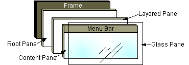
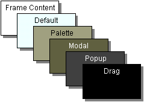
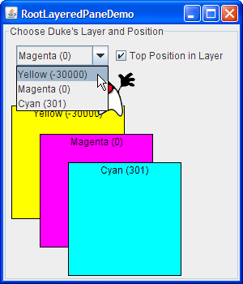

# 如何使用根窗格

> 原文： [https://docs.oracle.com/javase/tutorial/uiswing/components/rootpane.html](https://docs.oracle.com/javase/tutorial/uiswing/components/rootpane.html)

通常，您不直接创建 [`JRootPane`](https://docs.oracle.com/javase/8/docs/api/javax/swing/JRootPane.html) 对象。相反，当您实例化 [`JInternalFrame`](internalframe.html) 或其中一个顶级 Swing 容器（例如 [`JApplet`](applet.html) ）时，您会获得`JRootPane`（无论您是否想要！） ， [`JDialog`](dialog.html) 和 [`JFrame`](frame.html) 。

[使用顶级容器](toplevel.html)告诉您使用根窗格的基础知识 - 获取内容窗格，设置其布局管理器以及向其添加 Swing 组件。本节将详细介绍根窗格，包括组成根窗格的组件以及如何使用它们。



如上图所示，根窗格有四个部分：

**The glass pane**

Hidden, by default. If you make the glass pane visible, then it's like a sheet of glass over all the other parts of the root pane. It's completely transparent unless you implement the glass pane's `paintComponent` method so that it does something, and it can intercept input events for the root pane. In the [next section](#glasspane), you'll see an example of using a glass pane.

**The layered pane**

Serves to position its contents, which consist of the content pane and the optional menu bar. Can also hold other components in a specified Z order. For information, see [The Layered Pane](#layeredpane).

**The content pane**

The container of the root pane's visible components, excluding the menu bar. For information on using the content pane, see [Using Top-Level Containers](toplevel.html).

**The optional menu bar**

The home for the root pane's container's menus. If the container has a menu bar, you generally use the container's `setJMenuBar` method to put the menu bar in the appropriate place. For more information on using menus and menu bars, see [How to Use Menus](menu.html).

当您希望能够捕获事件或绘制已包含一个或多个组件的区域时，玻璃窗格非常有用。例如，您可以通过使玻璃窗格拦截事件来停用多组件区域的鼠标事件。或者，您可以使用玻璃窗格在多个组件上显示图像。

这是一个演示玻璃窗格功能的应用程序的图片。它包含一个复选框，可让您设置玻璃窗格是否“可见” - 是否可以获取事件并在屏幕上绘制自己。当玻璃窗格可见时，它会阻止所有输入事件到达内容窗格中的组件。它还会在上次检测到鼠标按下事件的位置绘制一个红点。


* * *

**Try this:** 

1.  单击“启动”按钮以使用 [Java™Web Start](http://www.oracle.com/technetwork/java/javase/javawebstart/index.html) （[下载 JDK 7 或更高版本](http://www.oracle.com/technetwork/java/javase/downloads/index.html)）运行 GlassPaneDemo。或者，要自己编译并运行示例，请参考[示例索引](../examples/components/index.html#GlassPaneDemo)。 [](https://docs.oracle.com/javase/tutorialJWS/samples/uiswing/GlassPaneDemoProject/GlassPaneDemo.jnlp) 

2.  单击按钮 1\.
    按钮的外观会更改以显示已单击按钮。
3.  单击复选框以使玻璃窗格变为“可见”，然后再次单击“按钮 1”。
    按钮不会单击，因为玻璃窗格会拦截所有鼠标事件。玻璃窗格绘制一个红色圆圈，释放鼠标。
4.  再次单击该复选框，以隐藏玻璃窗格。
    当玻璃窗格检测到复选框上的事件时，它会将其转发到复选框。否则，复选框不会响应点击。

* * *

来自 [`GlassPaneDemo.java`](../examples/components/GlassPaneDemoProject/src/components/GlassPaneDemo.java) 的以下代码显示并隐藏了玻璃窗格。该程序恰好创建了自己的玻璃窗格。但是，如果玻璃窗格没有进行任何绘制，程序可能只是将监听器附加到默认的玻璃窗格，如`getGlassPane`所返回。

```java
myGlassPane = new MyGlassPane(...);
changeButton.addItemListener(myGlassPane);
frame.setGlassPane(myGlassPane);
...
class MyGlassPane extends JComponent
                  implements ItemListener {
    ...
    //React to change button clicks.
    public void itemStateChanged(ItemEvent e) {
        setVisible(e.getStateChange() == ItemEvent.SELECTED);
    }
...
}

```

下一个代码段实现了玻璃窗格的鼠标事件处理。如果复选框上出现鼠标事件，则玻璃窗格会重新分配事件，以便复选框接收该事件。

```java
...//In the implementation of the glass pane's mouse listener:
public void mouseMoved(MouseEvent e) {
    redispatchMouseEvent(e, false);
}

.../* The mouseDragged, mouseClicked, mouseEntered,
    * mouseExited, and mousePressed methods have the same
    * implementation as mouseMoved. */...

public void mouseReleased(MouseEvent e) {
    redispatchMouseEvent(e, true);
}

private void redispatchMouseEvent(MouseEvent e,
                                  boolean repaint) {
    Point glassPanePoint = e.getPoint();
    Container container = contentPane;
    Point containerPoint = SwingUtilities.convertPoint(
                                    glassPane,
                                    glassPanePoint,
                                    contentPane);

    if (containerPoint.y < 0) { //we're not in the content pane
        //Could have special code to handle mouse events over
        //the menu bar or non-system window decorations, such as
        //the ones provided by the Java look and feel.
    } else {
        //The mouse event is probably over the content pane.
        //Find out exactly which component it's over.
        Component component =
            SwingUtilities.getDeepestComponentAt(
                                    container,
                                    containerPoint.x,
                                    containerPoint.y);

        if ((component != null)
            && (component.equals(liveButton))) {
            //Forward events over the check box.
            Point componentPoint = SwingUtilities.convertPoint(
                                        glassPane,
                                        glassPanePoint,
                                        component);
            component.dispatchEvent(new MouseEvent(component,
                                                 e.getID(),
                                                 e.getWhen(),
                                                 e.getModifiers(),
                                                 componentPoint.x,
                                                 componentPoint.y,
                                                 e.getClickCount(),
                                                 e.isPopupTrigger()));
        }
    }

    //Update the glass pane if requested.
    if (repaint) {
        glassPane.setPoint(glassPanePoint);
        glassPane.repaint();
    }
}

```

这是实现绘画的`MyGlassPane`中的代码。

```java
protected void paintComponent(Graphics g) {
    if (point != null) {
        g.setColor(Color.red);
        g.fillOval(point.x - 10, point.y - 10, 20, 20);
    }
}

```

分层窗格是具有深度的容器，使得重叠的组件可以一个在另一个上面。有关分层窗格的一般信息，请参见[如何使用分层窗格](layeredpane.html)。本节讨论根窗格如何使用分层窗格的详细信息。

每个根窗格都将其菜单栏和内容窗格放在`JLayeredPane`的实例中。分层窗格提供的 Z 排序启用了诸如在其他组件上方显示弹出菜单的行为。

您可以选择将组件放在根窗格的分层窗格中。如果这样做，那么您应该知道某些深度被定义为用于特定功能，您应该按预期使用深度。否则，您的组件可能无法与其他组件一起使用。这是一个显示功能层及其关系的图表：



下表描述了每个图层的预期用途，并列出了与每个图层对应的`JLayeredPane`常量：

| 图层名称 | 值 | 描述 |
| :-- | :-- | :-- |
| `FRAME_CONTENT_LAYER` | `new Integer(-30000)` | 根窗格将菜单栏和内容窗格添加到此深度的分层窗格。 |
| `DEFAULT_LAYER` | `new Integer(0)` | 如果在将组件添加到分层窗格时未指定组件的深度，则分层窗格会将其置于此深度。 |
| `PALETTE_LAYER` | `new Integer(100)` | 此图层对浮动工具栏和调色板很有用。 |
| `MODAL_LAYER` | `new Integer(200)` | 模态内部框架对话框将属于此图层。 |
| `POPUP_LAYER` | `new Integer(300)` | Popups 会进入这一层，因为它们需要出现在几乎所有内容之上。 |
| `DRAG_LAYER` | `new Integer(400)` | 用于拖动组件时使用。删除时，组件应返回其常规层。 |

 [LayeredPaneDemo](../examples/components/index.html#LayeredPaneDemo) 的一个版本，它使用根窗格的分层窗格，而不是创建新的分层窗格。



* * *

**Try this:** 

1.  单击“启动”按钮以使用 [Java™Web Start](http://www.oracle.com/technetwork/java/javase/javawebstart/index.html) （[下载 JDK 7 或更高版本](http://www.oracle.com/technetwork/java/javase/downloads/index.html)）运行 RootLayeredPaneDemo。或者，要自己编译并运行示例，请参考[示例索引](../examples/components/index.html#RootLayeredPaneDemo)。 [](https://docs.oracle.com/javase/tutorialJWS/samples/uiswing/RootLayeredPaneDemoProject/RootLayeredPaneDemo.jnlp) 

2.  在窗口中移动光标，以便 Duke 在其他组件的顶部移动。
    请注意，当光标位于非标签组件之上时 - 无论是在内容窗格中还是在 Java-look-and-feel 提供的标题栏中 - Duke 的移动都会暂时停止。这是因为鼠标移动事件会转到包含层次结构中最深的组件，并且对鼠标事件感兴趣。移动 Duke 的鼠标移动监听器在分层窗格中注册，该窗格中的大多数组件（标签除外）恰好具有鼠标移动监听器。当鼠标移动到分层窗格中感兴趣的组件上时，分层窗格不会获取事件，感兴趣的组件也会这样做。
3.  确保选中图层中的顶部位置复选框，将 Duke 的图层更改为黄色（-30000）。
    和以前一样，除了洋红色（0）和青色（301）矩形之外，他出现在其他组件之上。
4.  将 Duke 保留在黄色图层中，单击复选框将 Duke 发送到图层-30000 的背面。
    Duke 消失了，因为内容窗格及其中的所有组件现在都在他之上。
5.  将 Duke 的图层更改为 Cyan（301），将 Duke 向下移动一点，使其站在黄色矩形的上边缘，然后按空格键以显示组合框的下拉列表。
    如果外观将下拉列表实现为轻量级弹出窗口，则 Duke 会显示在下拉列表的顶部。

* * *

下面的表列出了使用根窗格，玻璃窗格和内容窗格的 API。有关使用内容窗格的更多信息，请转到[使用顶级容器](toplevel.html)。以下是本节中的表格：

*   [使用根窗格](#rootpaneapi)
*   [设置或获取根窗格的内容](#contentapi)

用于使用根窗格其他部分的 API 在别处描述：

*   [分层窗格 API](layeredpane.html#api)
*   [菜单 API](menu.html#api)


| 方法 | 目的 |
| :-- | :-- |
| [JRootPane getRootPane（）](https://docs.oracle.com/javase/8/docs/api/javax/swing/JFrame.html#getRootPane--)
_（`JApplet`，`JDialog`，`JFrame`，`JInternalFrame`和`JWindow`）_ | 获取小程序，对话框，框架，内部框架或窗口的根窗格。 |
| [静态 JRootPane getRootPane（组件）](https://docs.oracle.com/javase/8/docs/api/javax/swing/SwingUtilities.html#getRootPane-java.awt.Component-)
_（在`SwingUtilities`中）_ | 如果组件包含根窗格，请返回该根窗格。否则，返回包含该组件的根窗格（如果有）。 |
| [JRootPane getRootPane（）](https://docs.oracle.com/javase/8/docs/api/javax/swing/JComponent.html#getRootPane--)
_（在`JComponent`中）_ | 调用`JComponent`的`SwingUtilities` `getRootPane`方法。 |
| [void setDefaultButton（JButton）](https://docs.oracle.com/javase/8/docs/api/javax/swing/JRootPane.html#setDefaultButton-javax.swing.JButton-)
[JButton getDefaultButton（）](https://docs.oracle.com/javase/8/docs/api/javax/swing/JRootPane.html#getDefaultButton--) | 设置或获取哪个按钮（如果有）是根窗格中的默认按钮。特定于外观的操作（例如按 Enter 键）会导致执行按钮的操作。 |


_The following methods are defined in `JApplet`, `JDialog`, `JFrame`, `JInternalFrame`, `JRootPane`, and `JWindow`, unless noted otherwise._
| 方法 | 目的 |
| :-- | :-- |
| [void setGlassPane（Component）](https://docs.oracle.com/javase/8/docs/api/javax/swing/JFrame.html#setGlassPane-java.awt.Component-)
[Component getGlassPane（）](https://docs.oracle.com/javase/8/docs/api/javax/swing/JFrame.html#getGlassPane--) | 设置或获取玻璃窗格。 |
| [void setLayeredPane（JLayeredPane）](https://docs.oracle.com/javase/8/docs/api/javax/swing/JFrame.html#setLayeredPane-javax.swing.JLayeredPane-)
[Container getLayeredPane（）](https://docs.oracle.com/javase/8/docs/api/javax/swing/JFrame.html#getLayeredPane--) | 设置或获取分层窗格。 |
| [void setContentPane（Container）](https://docs.oracle.com/javase/8/docs/api/javax/swing/JFrame.html#setContentPane-java.awt.Container-)
[Container getContentPane（）](https://docs.oracle.com/javase/8/docs/api/javax/swing/JFrame.html#getContentPane--) | 设置或获取内容窗格。 |
| [void setJMenuBar（JMenuBar）](https://docs.oracle.com/javase/8/docs/api/javax/swing/JFrame.html#setJMenuBar-javax.swing.JMenuBar-)
[JMenuBar getJMenuBar（）](https://docs.oracle.com/javase/8/docs/api/javax/swing/JFrame.html#getJMenuBar--)
_（未在`JWindow`中定义）_ | 设置或获取菜单栏。 |

## 的示例

每个 Swing 程序都有一个根窗格，但很少有人直接引用它。以下列表中的示例说明了如何使用`JRootPane`或玻璃窗格的功能。另请参阅以下列表：

*   [使用分层窗格的示例](layeredpane.html#eg)
*   [使用菜单的例子](menu.html#eg)
*   [使用框架](frame.html#eg)的示例（使用内容窗格的示例）

| 例 | 在哪里描述 | 笔记 |
| :-- | :-- | :-- |
| [`GlassPaneDemo`](../examples/components/index.html#GlassPaneDemo) | 这个部分 | 使用绘制一点并重新分配事件的玻璃窗格。 |
| [`RootLayeredPaneDemo`](../examples/components/index.html#RootLayeredPaneDemo) | 这个部分 | 调整 LayeredPaneDemo 以使用根窗格的分层窗格。 |
| [`ListDialog`](../examples/components/index.html#ListDialog) | [如何使用列表](list.html) | 设置`JDialog`的默认按钮。 |
| [`FrameDemo2`](../examples/components/index.html#FrameDemo2) | [如何制作框架](frame.html) | 设置`JFrame`的默认按钮。 |