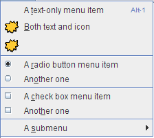
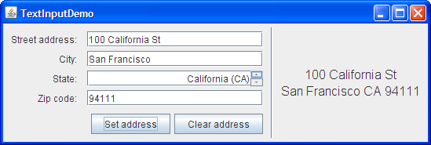

# 如何使用分隔符

> 原文： [https://docs.oracle.com/javase/tutorial/uiswing/components/separator.html](https://docs.oracle.com/javase/tutorial/uiswing/components/separator.html)

[`JSeparator`](https://docs.oracle.com/javase/8/docs/api/javax/swing/JSeparator.html) 类提供水平或垂直分界线或空白空间。它最常用于菜单和工具栏。实际上，您甚至不知道存在`JSeparator`类就可以使用分隔符，因为[菜单](menu.html)和[工具栏](toolbar.html)提供了方便的方法来创建和添加为其容器定制的分隔符。分隔符有点类似于[边框](../components/border.html)，除了它们是真正的组件，因此，它们被绘制在容器内，而不是在特定组件的边缘周围。

这是一个菜单的图片，它有三个分隔符，用于将菜单分成四组项目：



将菜单项和分隔符添加到菜单的代码非常简单，可以归结为以下内容：

```
menu.add(menuItem1);
menu.add(menuItem2);
menu.add(menuItem3);
menu.addSeparator();
menu.add(rbMenuItem1);
menu.add(rbMenuItem2);
menu.addSeparator();
menu.add(cbMenuItem1);
menu.add(cbMenuItem2);
menu.addSeparator();
menu.add(submenu);

```

将分隔符添加到工具栏是类似的。您可以在[菜单](menu.html)和[工具栏](toolbar.html)的操作方法部分找到完整的代码。如果您想要更多地控制菜单和工具栏中的分隔符，可以直接使用实现它们的`JSeparator`子类： [JPopupMenu.Separator](https://docs.oracle.com/javase/8/docs/api/javax/swing/JPopupMenu.Separator.html) 和 [JToolBar.Separator](https://docs.oracle.com/javase/8/docs/api/javax/swing/JToolBar.Separator.html) 。特别是，`JToolBar.Separator`具有用于指定分隔符大小的 API。

您可以直接使用`JSeparator`类在任何容器中提供分隔线。下图显示了一个 GUI，该按钮在标有 Fire 的按钮右侧有一个分隔符。


分隔符几乎没有 API，只要记住一件事就非常容易使用：在大多数实现中，垂直分隔符的首选高度为 0，水平分隔符的首选宽度为 0.这意味着分隔符**不可见**，除非您设置其首选大小或将其置于`BorderLayout`或`BoxLayout`等布局管理器的控制之下，该布局管理器将其拉伸以填充其可用显示区域。

垂直分隔符确实有一点宽度（水平位置有一点高度），因此您应该看到分隔符所在的空间。但是，除非宽度和高度均为非零，否则不绘制实际分割线。

以下代码段显示了 ListDemo 如何将包含垂直分隔符的面板放在一起。您可以在 [`ListDemo.java`](../examples/components/ListDemoProject/src/components/ListDemo.java) 中找到 ListDemo 的完整源代码。

```
JPanel buttonPane = new JPanel();
buttonPane.setLayout(new BoxLayout(buttonPane,
                                   BoxLayout.LINE_AXIS));
buttonPane.add(fireButton);
buttonPane.add(Box.createHorizontalStrut(5));
buttonPane.add(new JSeparator(SwingConstants.VERTICAL));
buttonPane.add(Box.createHorizontalStrut(5));
buttonPane.add(employeeName);
buttonPane.add(hireButton);
buttonPane.setBorder(BorderFactory.createEmptyBorder(5,5,5,5));

```

如代码所示，按钮，分隔符和文本字段都共享一个容器 - 一个使用从左到右[框布局](../layout/box.html)的`JPanel`实例。由于布局管理器（以及分隔符具有无限的最大尺寸），分隔符自动变为与其可用显示区域一样高。

在前面的代码中，水平支柱是用于在分隔符周围提供空间的不可见组件。 5 像素的空边框在面板周围提供缓冲，还用于防止分隔器一直延伸到其上方的组件和窗口下方的边缘。

这是另一个使用分隔符的 GUI 的图片，这次是在一组控件和显示区域之间放置一条分界线。



您可以在[示例索引](../examples/components/index.html#TextInputDemo)中找到代码。以下是设置分隔符容器的代码：

```
JPanel panel = new JPanel(new BorderLayout());
...
panel.setBorder(BorderFactory.createEmptyBorder(
                        GAP/2, //top
                        0,     //left
                        GAP/2, //bottom
                        0));   //right
panel.add(new JSeparator(JSeparator.VERTICAL),
          BorderLayout.LINE_START);
panel.add(addressDisplay,
          BorderLayout.CENTER);

```

与上一个示例一样，面板使用空边框，以便分隔符不会一直延伸到其容器的边缘。将分隔符放置在`BorderLayout`控制容器的最左侧区域中使分隔符与容器中心的地址显示组件一样高。有关边框布局如何工作的详细信息，请参见[如何使用 BorderLayout](../layout/border.html) 。

使用分隔符的 API 很少，因为它们没有内容，也不响应用户输入。


| 构造器或方法 | 目的 |
| :-- | :-- |
| [void addSeparator（）](https://docs.oracle.com/javase/8/docs/api/javax/swing/JToolBar.html#addSeparator--)
[void addSeparator（Dimension）](https://docs.oracle.com/javase/8/docs/api/javax/swing/JToolBar.html#addSeparator-java.awt.Dimension-)
_（在`JToolBar`中）_ | 将工具栏分隔符（在大多数情况下，如果不是全部，看起来和感觉都不可见）附加到工具栏的当前末尾。可选参数指定分隔符的大小。此方法的无参数版本使用具有默认大小的分隔符，由当前外观确定。 |
| [void addSeparator（）](https://docs.oracle.com/javase/8/docs/api/javax/swing/JMenu.html#addSeparator--)
[void insertSeparator（int）](https://docs.oracle.com/javase/8/docs/api/javax/swing/JMenu.html#insertSeparator-int-)
_（在`JMenu`中）_ | 在菜单中放置一个分隔符。 `addSeparator`方法将分隔符放在菜单的当前末尾。 `insertSeparator`方法将分隔符插入到指定位置的菜单中。 |
| [void addSeparator（）](https://docs.oracle.com/javase/8/docs/api/javax/swing/JPopupMenu.html#addSeparator--)
_（在`JPopupMenu`中）_ | 在弹出菜单的当前末尾放置一个分隔符。 |
| [JSeparator（）](https://docs.oracle.com/javase/8/docs/api/javax/swing/JSeparator.html#JSeparator--)
[JSeparator（int）](https://docs.oracle.com/javase/8/docs/api/javax/swing/JSeparator.html#JSeparator-int-) | 创建一个分隔符。如果未指定参数，则分隔符为水平。参数可以是`SwingConstants.HORIZONTAL`或`SwingConstants.VERTICAL`。 |
| [void setOrientation（int）](https://docs.oracle.com/javase/8/docs/api/javax/swing/JSeparator.html#setOrientation-int-)
[int getOrientation（）](https://docs.oracle.com/javase/8/docs/api/javax/swing/JSeparator.html#getOrientation--)
_（在`JSeparator`中）_ | 获取或设置分隔符的方向，可以是`SwingConstants.HORIZONTAL`或`SwingConstants.VERTICAL`。 |
| [JToolBar.Separator（）](https://docs.oracle.com/javase/8/docs/api/javax/swing/JToolBar.Separator.html#JToolBar.Separator--)
[JToolBar.Separator（Dimension）](https://docs.oracle.com/javase/8/docs/api/javax/swing/JToolBar.Separator.html#JToolBar.Separator-java.awt.Dimension-) | 创建一个分隔符以在工具栏中使用。可选参数指定分隔符的大小。 |
| [setSeparatorSize（Dimension）](https://docs.oracle.com/javase/8/docs/api/javax/swing/JToolBar.Separator.html#setSeparatorSize-java.awt.Dimension-)
_（在`JToolBar.Separator`中）_ | 指定分隔符的大小。更具体地说，指定的`Dimension`用作分隔符的最小，首选和最大尺寸。 |
| [JPopupMenu.Separator（）](https://docs.oracle.com/javase/8/docs/api/javax/swing/JPopupMenu.Separator.html#JPopupMenu.Separator--) | 创建一个在菜单中使用的分隔符。 |

本课程的一些示例使用分隔符，通常在菜单中。以下列出了一些更有趣的例子。

| 例 | 在哪里描述 | 笔记 |
| :-- | :-- | :-- |
| [`ListDemo`](../examples/components/index.html#ListDemo) | 本节和[如何使用列表](list.html) | 在由水平框布局控制的面板中使用垂直分隔符。 |
| [`TextInputDemo`](../examples/components/index.html#TextInputDemo) | 本节和[如何使用格式化文本字段](formattedtextfield.html) | 使用由边框布局控制的面板左侧的垂直分隔符。 |
| [`MenuDemo`](../examples/components/index.html#MenuDemo) | 本节和[如何使用菜单](menu.html) | 使用`JMenu`方法`addSeparator`将分隔符放入菜单中。 |
| [`ToolBarDemo2`](../examples/components/index.html#ToolBarDemo2) | [如何使用工具栏](toolbar.html) | 使用`JToolBar`方法`addSeparator`在两种按钮之间放置空格。 |

如果您使用 JavaFX 进行编程，请参阅[使用 JavaFX UI 控件](https://docs.oracle.com/javase/8/javafx/user-interface-tutorial/separator.htm)。