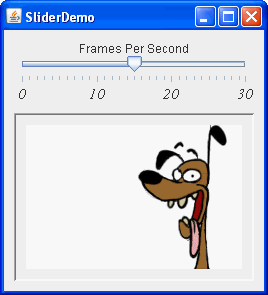
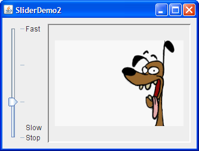

# 如何使用滑块

> 原文： [https://docs.oracle.com/javase/tutorial/uiswing/components/slider.html](https://docs.oracle.com/javase/tutorial/uiswing/components/slider.html)

[`JSlider`](https://docs.oracle.com/javase/8/docs/api/javax/swing/JSlider.html) 组件旨在让用户轻松输入由最小值和最大值限定的数值。如果空间有限，[微调器](spinner.html)可能是滑块的替代品。

下图显示了使用滑块控制动画速度的应用程序：

<center></center>

* * *

**Try this:** 

1.  单击“启动”按钮以使用 [Java™Web Start](http://www.oracle.com/technetwork/java/javase/javawebstart/index.html) （[下载 JDK 7 或更高版本](http://www.oracle.com/technetwork/java/javase/downloads/index.html)）运行 SliderDemo。或者，要自己编译并运行示例，请参考[示例索引](../examples/components/index.html#SliderDemo)。 [](https://docs.oracle.com/javase/tutorialJWS/samples/uiswing/SliderDemoProject/SliderDemo.jnlp) 

2.  使用滑块调整动画速度。
3.  将滑块推到 0 可停止动画。

* * *

下面是 [`SliderDemo.java`](../examples/components/SliderDemoProject/src/components/SliderDemo.java) 文件中的代码，该文件在上一个示例中创建了滑块。

```
static final int FPS_MIN = 0;
static final int FPS_MAX = 30;
static final int FPS_INIT = 15;    //initial frames per second
. . .
JSlider framesPerSecond = new JSlider(JSlider.HORIZONTAL,
                                      FPS_MIN, FPS_MAX, FPS_INIT);
framesPerSecond.addChangeListener(this);

//Turn on labels at major tick marks.
framesPerSecond.setMajorTickSpacing(10);
framesPerSecond.setMinorTickSpacing(1);
framesPerSecond.setPaintTicks(true);
framesPerSecond.setPaintLabels(true);

```

默认情况下，主刻度线和次刻度线的间距为零。要查看刻度线，必须将主刻度线或次刻度线（或两者）的间距显式设置为非零值，并调用`setPaintTicks(true)`方法。但是，您还需要标记符号。要在主要刻度标记位置显示标准数字标签，请设置主刻度线间距，然后调用`setPaintLabels(true)`方法。示例程序以这种方式为其滑块提供标签。但您不仅限于使用这些标签。 [在滑块上自定义标签](#labels)向您展示如何自定义滑块标签。此外，滑块功能允许您为`JSlider`组件设置字体。

```
Font font = new Font("Serif", Font.ITALIC, 15);
framesPerSecond.setFont(font);

```

移动滑块旋钮时，将调用滑块`ChangeListener`的`stateChanged`方法。有关更改侦听器的信息，请参阅[如何编写更改侦听器](../events/changelistener.html)。以下是对滑块值更改作出反应的更改侦听器代码：

```
public void stateChanged(ChangeEvent e) {
    JSlider source = (JSlider)e.getSource();
    if (!source.getValueIsAdjusting()) {
        int fps = (int)source.getValue();
        if (fps == 0) {
            if (!frozen) stopAnimation();
        } else {
            delay = 1000 / fps;
            timer.setDelay(delay);
            timer.setInitialDelay(delay * 10);
            if (frozen) startAnimation();
        }
    }
}

```

请注意，仅当`getValueIsAdjusting`方法返回`false`时，`stateChanged`方法才会更改动画速度。当用户移动滑块旋钮时，会触发许多更改事件。该程序仅对用户操作的最终结果感兴趣。

下面的演示是 SliderDemo 的修改版本，它使用带有自定义标签的滑块：

<center></center>

该程序的源代码可在 [`SliderDemo2.java`](../examples/components/SliderDemo2Project/src/components/SliderDemo2.java) 中找到。单击“启动”按钮以使用 [Java™Web Start](http://www.oracle.com/technetwork/java/javase/javawebstart/index.html) （[下载 JDK 7 或更高版本](http://www.oracle.com/technetwork/java/javase/downloads/index.html)）运行 SliderDemo2。或者，要自己编译并运行示例，请参考[示例索引](../examples/components/index.html#SliderDemo2)。

[](https://docs.oracle.com/javase/tutorialJWS/samples/uiswing/SliderDemo2Project/SliderDemo2.jnlp)

以下代码创建滑块并自定义其标签：

```
//Create the slider
JSlider framesPerSecond = new JSlider(JSlider.VERTICAL,
                                      FPS_MIN, FPS_MAX, FPS_INIT);
framesPerSecond.addChangeListener(this);
framesPerSecond.setMajorTickSpacing(10);
framesPerSecond.setPaintTicks(true);

//Create the label table
Hashtable labelTable = new Hashtable();
labelTable.put( new Integer( 0 ), new JLabel("Stop") );
labelTable.put( new Integer( FPS_MAX/10 ), new JLabel("Slow") );
labelTable.put( new Integer( FPS_MAX ), new JLabel("Fast") );
framesPerSecond.setLabelTable( labelTable );

framesPerSecond.setPaintLabels(true);

```

使用`setLabelTable`方法指定的哈希表中的每个键值对都给出一个标签的位置和值。哈希表键必须是`Integer`类型，并且必须具有滑块范围内的值才能放置标签。与每个键关联的哈希表值必须是`Component`对象。此演示仅使用带有文本的`JLabel`实例。一个有趣的修改是使用带有图标或按钮的`JLabel`实例将旋钮移动到标签的位置。

使用`JSlider`类的`createStandardLabels`方法创建一组以特定间隔定位的数字标签。您还可以修改`createStandardLabels`方法返回的表以进行自定义。

下表列出了常用的`JSlider`构造函数和方法。有关常用继承方法的表，请参见 [JComponent 类](jcomponent.html)。

使用滑块的 API 分为以下几类：

*   [创建滑块](#creating)
*   [微调滑块的外观](#looks)
*   [观看滑块操作](#operation)
*   [直接使用数据模型](#modelapi)

<caption></caption>
| 构造函数 | 目的 |
| --- | --- |
| [JSlider（）](https://docs.oracle.com/javase/8/docs/api/javax/swing/JSlider.html#JSlider--) | 创建一个水平滑块，范围为 0 到 100，初始值为 50。 |
| [JSlider（int min，int max）](https://docs.oracle.com/javase/8/docs/api/javax/swing/JSlider.html#JSlider-int-int-)
[JSlider（int min，int max，int value）](https://docs.oracle.com/javase/8/docs/api/javax/swing/JSlider.html#JSlider-int-int-int-) | 创建具有指定最小值和最大值的水平滑块。第三个`int`参数（如果存在）指定滑块的初始值。 |
| [JSlider（int orientation）](https://docs.oracle.com/javase/8/docs/api/javax/swing/JSlider.html#JSlider-int-)
[JSlider（int orientation，int min，int max，int value）](https://docs.oracle.com/javase/8/docs/api/javax/swing/JSlider.html#JSlider-int-int-int-int-) | 创建具有指定方向的滑块，该滑块必须是`JSlider.HORIZONTAL`或`JSlider.VERTICAL`。最后三个`int`参数（如果存在）分别指定滑块的最小值，最大值和初始值。 |
| [JSlider（BoundedRangeModel）](https://docs.oracle.com/javase/8/docs/api/javax/swing/JSlider.html#JSlider-javax.swing.BoundedRangeModel-) | 创建具有指定模型的水平滑块，该滑块管理滑块的最小值，最大值和当前值及其关系。 |

<caption></caption>
| 方法 | 目的 |
| --- | --- |
| [void setValue（int）](https://docs.oracle.com/javase/8/docs/api/javax/swing/JSlider.html#setValue-int-)
[int getValue（）](https://docs.oracle.com/javase/8/docs/api/javax/swing/JSlider.html#getValue--) | 设置或获取滑块的当前值。 set 方法还可以定位滑块的旋钮。 |
| [void setOrientation（int）](https://docs.oracle.com/javase/8/docs/api/javax/swing/JSlider.html#setOrientation-int-)
[int getOrientation（）](https://docs.oracle.com/javase/8/docs/api/javax/swing/JSlider.html#getOrientation--) | 设置或获取滑块的方向。可能的值为`JSlider.HORIZONTAL`或`JSlider.VERTICAL`。 |
| [void setInverted（boolean）](https://docs.oracle.com/javase/8/docs/api/javax/swing/JSlider.html#setInverted-boolean-)
[boolean getInverted（）](https://docs.oracle.com/javase/8/docs/api/javax/swing/JSlider.html#getInverted--) | 设置或获取最大值是显示在水平滑块的左侧还是显示在垂直滑块的底部，从而反转滑块的范围。 |
| [void setMinimum（int）](https://docs.oracle.com/javase/8/docs/api/javax/swing/JSlider.html#setMinimum-int-)
[int getMinimum（）](https://docs.oracle.com/javase/8/docs/api/javax/swing/JSlider.html#getMinimum--)
[void setMaximum（int）](https://docs.oracle.com/javase/8/docs/api/javax/swing/JSlider.html#setMaximum-int-)
[int getMaximum（）](https://docs.oracle.com/javase/8/docs/api/javax/swing/JSlider.html#getMaximum--) | 设置或获取滑块的最小值或最大值。这些方法一起设置或获取滑块的范围。 |
| [void setMajorTickSpacing（int）](https://docs.oracle.com/javase/8/docs/api/javax/swing/JSlider.html#setMajorTickSpacing-int-)
[int getMajorTickSpacing（）](https://docs.oracle.com/javase/8/docs/api/javax/swing/JSlider.html#getMajorTickSpacing--)
[void setMinorTickSpacing（int）](https://docs.oracle.com/javase/8/docs/api/javax/swing/JSlider.html#setMinorTickSpacing-int-)
[int getMinorTickSpacing（）](https://docs.oracle.com/javase/8/docs/api/javax/swing/JSlider.html#getMinorTickSpacing--) | 设置或获取主要和次要刻度之间的范围。您必须调用`setPaintTicks(true)`才能显示刻度线。 |
| [void setPaintTicks（boolean）](https://docs.oracle.com/javase/8/docs/api/javax/swing/JSlider.html#setPaintTicks-boolean-)
[boolean getPaintTicks（）](https://docs.oracle.com/javase/8/docs/api/javax/swing/JSlider.html#getPaintTicks--) | 设置或获取是否在滑块上绘制刻度线。 |
| [void setPaintLabels（boolean）](https://docs.oracle.com/javase/8/docs/api/javax/swing/JSlider.html#setPaintLabels-boolean-)
[boolean getPaintLabels（）](https://docs.oracle.com/javase/8/docs/api/javax/swing/JSlider.html#getPaintLabels--) | 设置或获取是否在滑块上绘制标签。您可以通过将主刻度线间距设置为非零值来提供带有`setLabelTable`的自定义标签或获取自动标签。 |
| [void setLabelTable（Dictionary）](https://docs.oracle.com/javase/8/docs/api/javax/swing/JSlider.html#setLabelTable-java.util.Dictionary-)
[Dictionary getLabelTable（）](https://docs.oracle.com/javase/8/docs/api/javax/swing/JSlider.html#getLabelTable--) | 设置或获取滑块的标签。您必须调用`setPaintLabels(true)`才能显示标签。 |
| [Hashtable createStandardLabels（int）](https://docs.oracle.com/javase/8/docs/api/javax/swing/JSlider.html#createStandardLabels-int-)
[Hashtable createStandardLabels（int，int）](https://docs.oracle.com/javase/8/docs/api/javax/swing/JSlider.html#createStandardLabels-int-int-) | 创建一组标准数字标签。第一个`int`参数指定增量，第二个`int`参数指定起始点。如果未指定，则将起点设置为滑块的最小数量。 |
| [setFont（java.awt.Font）](https://docs.oracle.com/javase/8/docs/api/javax/swing/JSlider.html#setFont-java.awt.Font-) | 设置滑块标签的字体。 |

<caption></caption>
| 方法 | 目的 |
| --- | --- |
| [void addChangeListener（ChangeListener）](https://docs.oracle.com/javase/8/docs/api/javax/swing/JSlider.html#addChangeListener-javax.swing.event.ChangeListener-) | 使用滑块注册更改侦听器。 |
| [boolean getValueIsAdjusting（）](https://docs.oracle.com/javase/8/docs/api/javax/swing/JSlider.html#getValueIsAdjusting--) | 确定用于移动滑块旋钮的用户手势是否完整。 |

<caption></caption>
| 类，接口或方法 | 目的 |
| --- | --- |
| [BoundedRangeModel](https://docs.oracle.com/javase/8/docs/api/javax/swing/BoundedRangeModel.html) | 滑块数据模型所需的接口。 |
| [DefaultBoundedRangeModel](https://docs.oracle.com/javase/8/docs/api/javax/swing/DefaultBoundedRangeModel.html) | `BoundedRangeModel`接口的实现。 |
| [void setModel（）](https://docs.oracle.com/javase/8/docs/api/javax/swing/JSlider.html#setModel-javax.swing.BoundedRangeModel-)
[getModel（）](https://docs.oracle.com/javase/8/docs/api/javax/swing/JSlider.html#getModel--)
_（在`JSlider`中）_ | 设置或获取滑块使用的数据模型。您还可以使用带有`BoundedRangeModel`类型的单个参数的构造函数来设置模型。 |

此表显示了使用`JSlider`的示例以及描述这些示例的示例。

| 例 | 在哪里描述 | 笔记 |
| :-- | :-- | :-- |
| [`SliderDemo`](../examples/components/index.html#SliderDemo) | 这个部分 | 显示带有主要刻度标记的滑块。 |
| [`SliderDemo2`](../examples/components/index.html#SliderDemo2) | 这个部分 | 显示带有自定义标签的垂直滑块。 |
| [`Converter`](../examples/components/index.html#Converter) | [使用型号](model.html)，[如何使用面板](panel.html) | 一种测量转换应用程序，具有两个共享数据并具有自定义`BoundedRangeModel`的滑块。 |

如果您使用 JavaFX 进行编程，请参阅 [Slider](https://docs.oracle.com/javase/8/javafx/user-interface-tutorial/slider.htm) 。