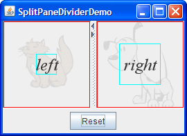
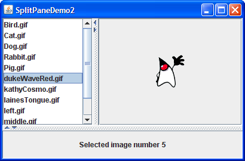

# 如何使用拆分窗格

> 原文： [https://docs.oracle.com/javase/tutorial/uiswing/components/splitpane.html](https://docs.oracle.com/javase/tutorial/uiswing/components/splitpane.html)

[`JSplitPane`](https://docs.oracle.com/javase/8/docs/api/javax/swing/JSplitPane.html) 显示两个组件，可以并排放置，也可以一个放在另一个上面。通过拖动组件之间出现的分隔符，用户可以指定拆分窗格的总区域到达每个组件的程度。您可以通过在分割窗格内放置拆分窗格来划分三个或更多组件之间的屏幕空间，如[嵌套拆分窗格](#nesting)中所述。

您经常将每个组件放入[滚动窗格](scrollpane.html)，而不是将感兴趣的组件直接添加到拆分窗格中。然后，将滚动窗格放入拆分窗格中。这允许用户查看感兴趣组件的任何部分，而不需要组件占用大量屏幕空间或适于在不同数量的屏幕空间中显示自身。

这是一个应用程序的图片，它使用拆分窗格并排显示列表和图像：


* * *

**Try this:** 

1.  单击“启动”按钮以使用 [Java™Web Start](http://www.oracle.com/technetwork/java/javase/javawebstart/index.html) （[下载 JDK 7 或更高版本](http://www.oracle.com/technetwork/java/javase/downloads/index.html)）运行 SplitPaneDemo。或者，要自己编译并运行示例，请参考[示例索引](../examples/components/index.html#SplitPaneDemo)。 [](https://docs.oracle.com/javase/tutorialJWS/samples/uiswing/SplitPaneDemoProject/SplitPaneDemo.jnlp) 

2.  拖动将列表和图像分成左侧或右侧的凹坑线。尝试将分隔线一直拖到窗口的边缘。
3.  单击分隔线上的小箭头以隐藏/展开左侧或右侧组件。

* * *

以下是`SplitPaneDemo`中用于创建和设置拆分窗格的代码。

```java
//Create a split pane with the two scroll panes in it.
splitPane = new JSplitPane(JSplitPane.HORIZONTAL_SPLIT,
                           listScrollPane, pictureScrollPane);
splitPane.setOneTouchExpandable(true);
splitPane.setDividerLocation(150);

//Provide minimum sizes for the two components in the split pane
Dimension minimumSize = new Dimension(100, 50);
listScrollPane.setMinimumSize(minimumSize);
pictureScrollPane.setMinimumSize(minimumSize);

```

此示例使用的构造器有三个参数。第一个表示分割方向。其他参数是放在拆分窗格中的两个组件。有关动态设置组件的`JSplitPane`方法的信息，请参阅[在拆分窗格](#adding)中设置组件。

此示例中的拆分窗格是水平拆分 - 两个组件并排显示 - 由构造器的`JSplitPane.HORIZONTAL_SPLIT`参数指定。拆分窗格提供另一个选项，使用`JSplitPane.VERTICAL_SPLIT`指定，将一个组件放在另一个组件之上。使用`setOrientation`方法创建拆分窗格后，可以更改拆分方向。

示例的拆分窗格中的分隔符顶部会出现两个小箭头。这些箭头允许用户通过单击折叠（然后展开）任一组件。当前外观确定默认情况下是否显示这些控件。在 Java 外观中，默认情况下它们处于关闭状态。 （请注意，并非所有外观都支持此功能。）示例使用`setOneTouchExpandable`方法打开它们。

拆分窗格的分隔符的范围部分取决于拆分窗格中组件的最小大小。有关详细信息，请参见[定位分频器并限制其范围](#divider)。

本节的其余部分将介绍以下主题：

*   [在拆分窗格中设置组件](#adding)
*   [定位分频器并限制其范围](#divider)
*   [嵌套分割窗格](#nesting)
*   [Split Pane API](#api)
*   [使用拆分窗格的示例](#eg)

程序可以使用以下四种方法动态设置拆分窗格的两个组件：

*   `setLeftComponent`
*   `setRightComponent`
*   `setTopComponent`
*   `setBottomComponent`

无论拆分窗格的当前拆分方向如何，您都可以随时使用这些方法中的任何一种。调用`setLeftComponent`和`setTopComponent`是等效的，并将指定的组件设置在顶部或左侧位置，具体取决于拆分窗格的当前拆分方向。同样，对`setRightComponent`和`setBottomComponent`的调用也是等效的。这些方法用新的方法替换该位置中已有的任何组件。

与其他容器一样，`JSplitPane`支持`add`方法。拆分窗格将第一个组件添加到左侧或顶部位置。使用`add`的危险在于，您可能无意中调用它太多次，在这种情况下，拆分窗格的布局管理器将抛出一个相当深奥的异常。如果使用`add`方法并且已填充拆分窗格，则首先需要使用`remove`删除现有组件。

如果仅在拆分窗格中放置一个组件，则分隔符将粘贴在拆分窗格的右侧或底部，具体取决于其拆分方向。

要使拆分窗格正常工作，通常需要在拆分窗格中设置组件的最小大小，以及拆分窗格或其包含的组件的首选大小。选择应设置的尺寸是一项艺术，需要了解如何确定分割窗格的首选大小和分隔符位置。在我们详细介绍之前，让我们再看一下 SplitPaneDemo。或者，如果您赶时间，可以跳到[规则列表](#rules)。

* * *

**Try this:** 

1.  单击“启动”按钮以使用 [Java™Web Start](http://www.oracle.com/technetwork/java/javase/javawebstart/index.html) （[下载 JDK 7 或更高版本](http://www.oracle.com/technetwork/java/javase/downloads/index.html)）运行 SplitPaneDemo。或者，要自己编译并运行示例，请参考[示例索引](../examples/components/index.html#SplitPaneDemo)。 [](https://docs.oracle.com/javase/tutorialJWS/samples/uiswing/SplitPaneDemoProject/SplitPaneDemo.jnlp) 

    因为演示帧的大小是使用`pack`方法设置的，所以拆分窗格处于首选大小，SplitPaneDemo 恰好设置为。自动放置分隔线，使左侧组件处于其首选宽度，所有剩余空间均位于右侧组件。
2.  使窗户更宽。
    分隔符保持原样，额外的空间到达右侧的组件。
3.  使窗口明显比首次出现时窄 - 可能是左侧组件的两倍宽。
    同样，左侧组件的大小和分隔符位置保持不变。只有正确组件的大小会发生变化。
4.  使窗口尽可能窄。
    假设窗口使用 Java 外观提供的装饰，则窗口的大小不能小于拆分窗格的最小大小，这是由拆分窗格包含的组件的最小大小决定的。 SplitPaneDemo 显式设置这些包含组件的最小大小。
5.  使窗口变宽，然后将分隔线拖到右边。
    分频器仅在右侧组件的最小尺寸允许的范围内。如果将分隔线向左拖动，您将看到它也尊重左侧组件的最小尺寸。

* * *

现在您已经看到了分割窗格的默认行为，我们可以告诉您幕后发生了什么以及如何影响它。在本讨论中，当我们引用组件的首选或最小大小时，如果拆分窗格是水平的，则通常表示组件的首选或最小宽度;如果拆分窗格是垂直的，则通常表示其首选或最小高度。

默认情况下，初始化拆分窗格的首选大小和分隔符位置，以便拆分窗格中的两个组件处于其首选大小。如果拆分窗格未以此首选大小显示且程序未明确设置分隔符的位置，则分隔符的初始位置（以及两个组件的大小）取决于分割窗格属性，称为*调整体重*。如果拆分窗格最初处于其首选大小或更大，则在调整调整大小权重之前，所包含的组件以其首选大小开始。如果拆分窗格最初太小而无法以其首选尺寸显示两个组件，则在调整调整大小权重之前，它们将以*最小*大小开始。

拆分窗格的调整大小权重介于 0.0 和 1.0 之间，并确定在设置拆分窗格大小时如何在两个包含的组件之间分配空间 - 无论是以编程方式还是由用户调整拆分窗格大小（例如，放大其包含窗口） 。默认情况下，拆分窗格的调整大小为 0.0，表示左侧或顶部组件的大小是固定的，右侧或底部组件调整其大小以适合剩余空间。将调整大小权重设置为 0.5 会在两个组件之间平均分配任何额外或缺失的空间。将调整大小权重设置为 1.0 会使右侧或底部组件的大小保持固定。但是，当用户拖动分隔符时，调整大小权重不起作用。

只要既不包含组件低于其最小尺寸，用户也可以将分隔线拖动到任何位置*。如果分隔器具有单触按钮，则用户可以使用它们使分隔器完全移动到一侧或另一侧 - 无论组件的最小尺寸是多少。_

现在您已了解影响拆分窗格大小和分隔符位置的因素，下面是一些使它们运行良好的规则：

*   要确保在拆分窗格处于其首选大小时可以拖动分隔符，请确保一个或两个包含的组件的最小大小小于包含的组件的首选大小。您可以通过调用组件上的`setMinimumSize`或覆盖其`getMinimumSize`方法来设置组件的最小大小。例如，如果您希望用户能够将分频器一直拖到两侧：

    ```java
    Dimension minimumSize = new Dimension(0, 0);
    leftComponent.setMinimumSize(minimumSize);
    rightComponent.setMinimumSize(minimumSize);

    ```

*   To guarantee that both contained components appear, make sure that either the split pane is initially at or above its preferred size, or the minimum sizes of the contained components are greater than zero.

    如果为 splitpane 指定了首选大小，通常会发生这种情况，这取决于包含拆分窗格的布局管理器。另一个选项是在拆分窗格上显式设置一个大于所包含组件大小的首选大小。

*   如果希望底部或右侧组件保持相同的大小，并且当拆分窗格变大时顶部或左侧组件变得灵活，请将调整大小权重设置为 1.0。您可以通过调用`setResizeWeight`来执行此操作：

    ```java
    splitPane.setResizeWeight(1.0);

    ```

*   如果您希望拆分窗格的两半在拆分窗格的额外或删除空间中共享，请将调整大小权重设置为 0.5：

    ```java
    splitPane.setResizeWeight(0.5);

    ```

*   确保拆分窗格包含的每个组件都具有合理的首选大小。如果组件是使用布局管理器的面板，通常只需使用它返回的值。如果组件是滚动窗格，则您有几个选择。您可以在滚动窗格上调用`setPreferredSize`方法，在滚动窗格中调用组件上的相应方法（例如`JList`或`JTree`的`setVisibleRowCount`方法）。
*   确保拆分窗格包含的每个组件都可以在不同的空间量内合理显示。例如，包含多个组件的面板应使用以合理方式使用额外空间的布局管理器。
*   If you want to set the size of contained components to something other than their preferred sizes, use the `setDividerLocation` method. For example, to make the left component 150 pixels wide:

    ```java
    splitPane.setDividerLocation(150 + splitPane.getInsets().left);

    ```

    Although the split pane does its best to honor the initial divider location (150 in this case), once the user drags the divider it may no longer be possible to drag to the programmatically specified size.

    要使正确的组件宽 150 像素：

    ```java
    splitPane.setDividerLocation(splitPane.getSize().width
                                 - splitPane.getInsets().right
                                 - splitPane.getDividerSize()
                                 - 150);

    ```

    If the split pane is already visible, you can set the divider location as a percentage of the split pane. For example, to make 25% of the space go to left/top:

    ```java
    splitPane.setDividerLocation(0.25);

    ```

    请注意，这是根据当前大小实现的，因此如果拆分窗格可见，则非常有用。

*   要将拆分窗格布置为刚刚出现，可能会在过程中重新定位分隔符，请在拆分窗格上调用`resetToPreferredSizes()`。

    * * *

    **Note:** Just changing the contained components' preferred sizes — even if you invoke `revalidate` afterwards — is not enough to cause the split pane to lay itself out again. You must invoke `resetToPreferredSizes` as well.

    * * *

以下快照显示了一个名为 SplitPaneDividerDemo 的示例，该示例演示了拆分窗格组件大小和分隔符放置。



与 SplitPaneDemo 一样，SplitPaneDividerDemo 具有带单触按钮的水平分割窗格。 SplitPaneDividerDemo 具有以下附加功能：

*   分割窗格的*调整大小权重*被明确设置（为 0.5）。
*   拆分窗格以其默认首选大小显示。
*   窗口底部的“重置”按钮调用拆分窗格上的`resetToPreferredSizes`。
*   拆分窗格中的组件是名为`SizeDisplayer`的自定义`JComponent`子类的实例。 `SizeDisplayer`在淡化（和可选）图像的背景下显示可选文本。更重要的是，它具有显示其首选和最小尺寸的矩形。
*   SplitPaneDividerDemo 将其`SizeDisplayer`设置为具有相同的首选大小（由于它们显示的图像同样大），但最小大小不相等。

* * *

**Try this:** 

1.  单击“启动”按钮以使用 [Java™Web Start](http://www.oracle.com/technetwork/java/javase/javawebstart/index.html) （[下载 JDK 7 或更高版本](http://www.oracle.com/technetwork/java/javase/downloads/index.html)）运行 SplitPaneDividerDemo。或者，要自己编译并运行示例，请参考[示例索引](../examples/components/index.html#SplitPaneDividerDemo)。 [](https://docs.oracle.com/javase/tutorialJWS/samples/uiswing/SplitPaneDividerDemoProject/SplitPaneDividerDemo.jnlp) 

    因为演示帧的大小是使用`pack`方法设置的，所以拆分窗格处于其首选大小，默认情况下大小足够`SizeDisplayer`是他们的首选尺寸。每个`SizeDisplayer`的优选尺寸由红色矩形表示。自动放置分隔线，使两个组件都处于其首选宽度。
2.  使窗户更宽。
    因为分割窗格的调整大小为 0.5，所以额外的空间在左右组件之间均匀分配。分频器相应地移动。
3.  使窗口尽可能窄。
    假设窗口使用 Java 外观提供的装饰，则不会让窗口的大小小于分割窗格的最小大小，这是由它包含的`SizeDisplayers`的最小大小决定的。每个`SizeDisplayer`的最小尺寸由亮蓝色矩形表示。
4.  使窗口稍微宽一点，然后将分隔线拖到右边。
    分频器仅在右侧组件的最小尺寸允许的范围内。
5.  确保拆分窗格小于其首选大小后，单击“重置”按钮。
    请注意，两个`SizeDisplayer`以不同的尺寸显示，即使应用程序出现时它们的尺寸相同。原因是尽管它们的首选尺寸相同，但它们的最小尺寸却不相同。由于拆分窗格无法以其首选大小或更大尺寸显示它们，因此使用最小尺寸将它们展开。由于拆分窗格的调整大小为 0.5，因此剩余空间在组件之间平均分配。
6.  加宽分割窗格，使其足够大，使`SizeDisplayer`以其首选大小显示，然后单击“重置”按钮。
    分隔符再次置于中间，因此两个组件的大小相同。

* * *

以下是为 SplitPaneDividerDemo 创建 GUI 的代码：

```java
public class SplitPaneDividerDemo extends JPanel ... {

    private JSplitPane splitPane;

    public SplitPaneDividerDemo() {
        super(new BorderLayout());

        Font font = new Font("Serif", Font.ITALIC, 24);

        ImageIcon icon = createImageIcon("images/Cat.gif");
        SizeDisplayer sd1 = new SizeDisplayer("left", icon);
        sd1.setMinimumSize(new Dimension(30,30));
        sd1.setFont(font);

        icon = createImageIcon("images/Dog.gif");
        SizeDisplayer sd2 = new SizeDisplayer("right", icon);
        sd2.setMinimumSize(new Dimension(60,60));
        sd2.setFont(font);

        splitPane = new JSplitPane(JSplitPane.HORIZONTAL_SPLIT,
                                   sd1, sd2);
        splitPane.setResizeWeight(0.5);
        splitPane.setOneTouchExpandable(true);
        splitPane.setContinuousLayout(true);

        add(splitPane, BorderLayout.CENTER);
        add(createControlPanel(), BorderLayout.PAGE_END);
    }
    ...
}

```

代码是相当自我解释的，除了调用`setContinuousLayout`。将 _continuousLayout_ 属性设置为 true 会在用户移动分隔符时连续绘制分割窗格的内容。默认情况下，连续布局未启用，因为它可能会对性能产生负面影响。但是，在此演示中使用它时，将分割窗格的组件尽可能更新可以改善用户体验是有意义的。

这是一个程序的图片，通过将一个拆分窗格嵌套在另一个内部来实现三向拆分：



如果拆分窗格的顶部看起来很熟悉，那是因为程序将`SplitPaneDemo`创建的拆分窗格放在第二个拆分窗格中。简单的`JLabel`是第二个拆分窗格中的另一个组件。这不是嵌套拆分窗格的最实际用途，但它得到了重点。

*   单击“启动”按钮以使用 [Java™Web Start](http://www.oracle.com/technetwork/java/javase/javawebstart/index.html) （[下载 JDK 7 或更高版本](http://www.oracle.com/technetwork/java/javase/downloads/index.html)）运行 SplitPaneDemo2。或者，要自己编译并运行示例，请参考[示例索引](../examples/components/index.html#SplitPaneDemo2)。

[](https://docs.oracle.com/javase/tutorialJWS/samples/uiswing/SplitPaneDemo2Project/SplitPaneDemo2.jnlp)

这是代码的有趣部分，您可以在 [`SplitPaneDemo2.java`](../examples/components/SplitPaneDemo2Project/src/components/SplitPaneDemo2.java) 中找到：

```java
//Create an instance of SplitPaneDemo
SplitPaneDemo splitPaneDemo = new SplitPaneDemo();
JSplitPane top = splitPaneDemo.getSplitPane();

...
//Create a regular old label
label = new JLabel("Click on an image name in the list.",
                   JLabel.CENTER);

//Create a split pane and put "top" (a split pane)
//and JLabel instance in it.
JSplitPane splitPane = new JSplitPane(JSplitPane.VERTICAL_SPLIT,
                                      top, label);

```

有关修复嵌套分割窗格时可能出现的边框问题的信息，请参阅[解决常见组件问题](problems.html#nestedborders)。

下表列出了常用的`JSplitPane`构造器和方法。您最有可能在`JSplitPane`对象上调用的其他方法是其超类提供的`setPreferredSize`。有关常用继承方法的表，请参见 [JComponent API](jcomponent.html#api) 。

使用列表的 API 分为以下几类：

*   [设置分割窗格](#settingupapi)
*   [管理拆分窗格的内容](#contentsapi)
*   [定位分频器](#dividerapi)


| 方法或构造器 | 目的 |
| --- | --- |
| [JSplitPane（）](https://docs.oracle.com/javase/8/docs/api/javax/swing/JSplitPane.html#JSplitPane--)
[JSplitPane（int）](https://docs.oracle.com/javase/8/docs/api/javax/swing/JSplitPane.html#JSplitPane-int-)
[JSplitPane（int，boolean）](https://docs.oracle.com/javase/8/docs/api/javax/swing/JSplitPane.html#JSplitPane-int-boolean-)
[JSplitPane（int，Component，Component ）](https://docs.oracle.com/javase/8/docs/api/javax/swing/JSplitPane.html#JSplitPane-int-java.awt.Component-java.awt.Component-)
[JSplitPane（int，boolean，Component，Component）](https://docs.oracle.com/javase/8/docs/api/javax/swing/JSplitPane.html#JSplitPane-int-boolean-java.awt.Component-java.awt.Component-) | 创建拆分窗格。如果存在，`int`参数指示分割窗格的方向，`HORIZONTAL_SPLIT`（默认值）或`VERTICAL_SPLIT`。 `boolean`参数（如果存在）设置组件是否在用户拖动拆分窗格时不断重新绘制。如果未指定，则关闭此选项（称为*连续布局*）。 `Component`参数分别设置初始左侧和右侧或顶部和底部组件。 |
| [void setOrientation（int）](https://docs.oracle.com/javase/8/docs/api/javax/swing/JSplitPane.html#setOrientation-int-)
[int getOrientation（）](https://docs.oracle.com/javase/8/docs/api/javax/swing/JSplitPane.html#getOrientation--) | 设置或获取拆分窗格的方向。使用`JSplitPane`中定义的`HORIZONTAL_SPLIT`或`VERTICAL_SPLIT`。如果未指定，则拆分窗格将水平拆分。 |
| [void setDividerSize（int）](https://docs.oracle.com/javase/8/docs/api/javax/swing/JSplitPane.html#setDividerSize-int-)
[int getDividerSize（）](https://docs.oracle.com/javase/8/docs/api/javax/swing/JSplitPane.html#getDividerSize--) | 设置或获取分隔符的大小（以像素为单位）。 |
| [void setContinuousLayout（boolean）](https://docs.oracle.com/javase/8/docs/api/javax/swing/JSplitPane.html#setContinuousLayout-boolean-)
[boolean isContinuousLayout（）](https://docs.oracle.com/javase/8/docs/api/javax/swing/JSplitPane.html#isContinuousLayout--) | 在用户拖动分隔符时设置或获取拆分窗格的组件是否连续布局和绘制。默认情况下，连续布局已关闭。 |
| [void setOneTouchExpandable（boolean）](https://docs.oracle.com/javase/8/docs/api/javax/swing/JSplitPane.html#setOneTouchExpandable-boolean-)
[boolean isOneTouchExpandable（）](https://docs.oracle.com/javase/8/docs/api/javax/swing/JSplitPane.html#isOneTouchExpandable--) | 设置或获取拆分窗格是否在分隔符上显示控件以展开/折叠分隔符。默认值取决于外观。在 Java 外观中，它默认是关闭的。 |


| 方法 | 目的 |
| --- | --- |
| [void setTopComponent（Component）](https://docs.oracle.com/javase/8/docs/api/javax/swing/JSplitPane.html#setTopComponent-java.awt.Component-)
[void setBottomComponent（Component）](https://docs.oracle.com/javase/8/docs/api/javax/swing/JSplitPane.html#setBottomComponent-java.awt.Component-)
[void setLeftComponent（Component）](https://docs.oracle.com/javase/8/docs/api/javax/swing/JSplitPane.html#setLeftComponent-java.awt.Component-)
[void setRightComponent（Component）](https://docs.oracle.com/javase/8/docs/api/javax/swing/JSplitPane.html#setRightComponent-java.awt.Component-)
[组件 getTopComponent（）](https://docs.oracle.com/javase/8/docs/api/javax/swing/JSplitPane.html#getTopComponent--)
[组件 getBottomComponent（）](https://docs.oracle.com/javase/8/docs/api/javax/swing/JSplitPane.html#getBottomComponent--)
[组件 getLeftComponent（）](https://docs.oracle.com/javase/8/docs/api/javax/swing/JSplitPane.html#getLeftComponent--)
[组件 getRightComponent （）](https://docs.oracle.com/javase/8/docs/api/javax/swing/JSplitPane.html#getRightComponent--) | 设置或获取指定的组件。无论拆分窗格的方向如何，每种方法都有效。顶部和左侧相同，底部和右侧相同。 |
| [void remove（Component）](https://docs.oracle.com/javase/8/docs/api/javax/swing/JSplitPane.html#remove-java.awt.Component-)
[void removeAll（）](https://docs.oracle.com/javase/8/docs/api/javax/swing/JSplitPane.html#removeAll--) | 从拆分窗格中删除指示的组件。 |
| [void add（Component）](https://docs.oracle.com/javase/8/docs/api/java/awt/Container.html#add-java.awt.Component-) | 将组件添加到拆分窗格。您只能将两个组件添加到拆分窗格。添加的第一个组件是顶部/左侧组件。添加的第二个组件是底部/右侧组件。任何添加更多组件的尝试都会导致异常。 |


| 方法 | 目的 |
| --- | --- |
| [void setDividerLocation（double）](https://docs.oracle.com/javase/8/docs/api/javax/swing/JSplitPane.html#setDividerLocation-double-)
[void setDividerLocation（int）](https://docs.oracle.com/javase/8/docs/api/javax/swing/JSplitPane.html#setDividerLocation-int-)
[int getDividerLocation（）](https://docs.oracle.com/javase/8/docs/api/javax/swing/JSplitPane.html#getDividerLocation--) | 设置或获取当前分隔符位置。设置分频器位置时，可以将新位置指定为百分比（`double`）或像素位置（`int`）。 |
| [void resetToPreferredSizes（）](https://docs.oracle.com/javase/8/docs/api/javax/swing/JSplitPane.html#resetToPreferredSizes--) | 移动分隔线，使两个组件都处于其首选大小。除非另有说明，否则这是拆分窗格在启动时分割自身的方式。 |
| [void setLastDividerLocation（int）](https://docs.oracle.com/javase/8/docs/api/javax/swing/JSplitPane.html#setLastDividerLocation-int-)
[int getLastDividerLocation（）](https://docs.oracle.com/javase/8/docs/api/javax/swing/JSplitPane.html#getLastDividerLocation--) | 设置或获取分隔符的先前位置。 |
| [int getMaximumDividerLocation（）](https://docs.oracle.com/javase/8/docs/api/javax/swing/JSplitPane.html#getMaximumDividerLocation--)
[int getMinimumDividerLocation（）](https://docs.oracle.com/javase/8/docs/api/javax/swing/JSplitPane.html#getMinimumDividerLocation--) | 获取分隔符的最小和最大位置。通过设置拆分窗格的两个组件的最小大小来隐式设置它们。 |
| [void setResizeWeight（float）](https://docs.oracle.com/javase/8/docs/api/javax/swing/JSplitPane.html#setResizeWeight-float-)
[float getResizeWeight（）](https://docs.oracle.com/javase/8/docs/api/javax/swing/JSplitPane.html#getResizeWeight--) | 设置或获取拆分窗格的调整大小权重，介于 0.0（默认值）和 1.0 之间的值。有关使用调整大小权重的说明和示例，请参阅[定位分频器和限制其范围](#divider)。 |

此表显示了一些使用`JSplitPane`的示例以及描述这些示例的示例。

| 例 | 在哪里描述 | 笔记 |
| :-- | :-- | :-- |
| [`SplitPaneDemo`](../examples/components/index.html#SplitPaneDemo) | 此页面和[如何使用列表](list.html) | 显示具有水平拆分的拆分窗格。 |
| [`SplitPaneDividerDemo`](../examples/components/index.html#SplitPaneDividerDemo) | 这一页 | 演示如何使用组件大小信息和调整大小来定位分隔符。 |
| [`SplitPaneDemo2`](../examples/components/index.html#SplitPaneDemo2) | 这一页 | 在拆分窗格中放置拆分窗格以创建三向拆分。 |
| [`TreeDemo`](../examples/components/index.html#TreeDemo) | [如何使用树木](tree.html) | 使用具有垂直拆分的拆分窗格将树（在滚动窗格中）与编辑器窗格（在滚动窗格中）分开。不使用一键式可扩展功能。 |
| [`TextComponentDemo`](../examples/components/index.html#TextComponentDemo) | [文本组件功能](generaltext.html) | 使用具有垂直拆分的拆分窗格，以在滚动窗格中分隔文本窗格和文本区域。 |
| [`TextSamplerDemo`](../examples/components/index.html#TextSamplerDemo) | [文本组件功能](generaltext.html) | 使用具有垂直拆分的拆分窗格并调整权重 0.5，以在滚动窗格中分隔文本窗格和编辑器窗格。拆分窗格位于容器的右半部分，该容器具有相当复杂的布局。使用`GridLayout`和`BorderLayout`等布局管理器以及拆分窗格的调整大小权重，以确保滚动窗格中的组件共享所有额外空间。 |
| [`ListSelectionDemo`](../examples/events/index.html#ListSelectionDemo) | [如何编写列表选择监听器](../events/listselectionlistener.html) | 使用具有垂直拆分的拆分窗格，从包含滚动窗格上方的组合框的下部窗格中分隔上部窗格，其中包含列表和表（均在滚动窗格中）。下部窗格使用边框布局来保持组合框小，滚动窗格贪婪的空间。 |