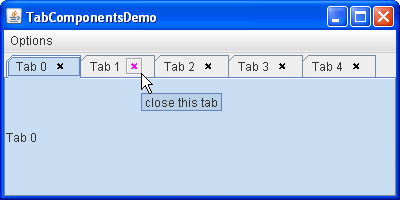

# 如何使用选项卡式窗格

> 原文： [https://docs.oracle.com/javase/tutorial/uiswing/components/tabbedpane.html](https://docs.oracle.com/javase/tutorial/uiswing/components/tabbedpane.html)

使用 [`JTabbedPane`](https://docs.oracle.com/javase/8/docs/api/javax/swing/JTabbedPane.html) 类，您可以拥有多个组件，例如[面板](panel.html)，共享相同的空间。用户通过选择与所需组件对应的选项卡来选择要查看的组件。如果您想要没有选项卡界面的类似功能，可以使用[卡布局](../layout/card.html)而不是选项卡式窗格。

## 创建选项卡式窗格

要创建选项卡式窗格，请实例化`JTabbedPane`，创建要显示的组件，然后使用`addTab`方法将组件添加到选项卡式窗格。

下图介绍了一个名为`TabbedPaneDemo`的应用程序，它有一个带有四个选项卡的选项卡式窗格。


* * *

**Try this:** 

1.  单击“启动”按钮以使用 [Java™Web Start](http://www.oracle.com/technetwork/java/javase/javawebstart/index.html) （[下载 JDK 7 或更高版本](http://www.oracle.com/technetwork/java/javase/downloads/index.html)）运行 TabbedPaneDemo。或者，要自己编译并运行示例，请参考[示例索引](../examples/components/index.html#TabbedPaneDemo)。 [](https://docs.oracle.com/javase/tutorialJWS/samples/uiswing/TabbedPaneDemoProject/TabbedPaneDemo.jnlp) 

2.  将光标放在选项卡上。
    出现与选项卡关联的工具提示。为方便起见，您可以在将组件添加到选项卡式窗格时指定工具提示文本。
3.  单击选项卡。
    选项卡式窗格显示与选项卡对应的组件。
4.  通过输入其助记符来选择选项卡。
    例如，在 Java 外观中，您可以通过键入 Alt-3 选择标记为“Tab 3”的选项卡。
5.  在可滚动选项卡之间导航。
    此示例提供可滚动选项卡。通过移动其左侧或右侧边界来调整对话框的大小，以使选项卡不适合对话框。选项卡旁边会显示滚动箭头。
    单击箭头可查看其中一个隐藏的选项卡。
    请注意，单击箭头只会显示隐藏的标签。它不会选择新选项卡。

* * *

正如`TabbedPaneDemo`示例所示，选项卡可以具有工具提示和助记符，并且它可以显示文本和图像。

### 标签放置

默认选项卡位置设置为`TOP`位置，如上所示。您可以使用`setTabPlacement`方法将标签位置更改为`LEFT`，`RIGHT`，`TOP`或`BOTTOM`。

### 选项卡窗格的代码

[`TabbedPaneDemo.java`](../examples/components/TabbedPaneDemoProject/src/components/TabbedPaneDemo.java) 中的以下代码在上一个示例中创建选项卡式窗格。请注意，不需要事件处理代码。 `JTabbedPane`对象为您处理鼠标和键盘事件。

```
JTabbedPane tabbedPane = new JTabbedPane();
ImageIcon icon = createImageIcon("images/middle.gif");

JComponent panel1 = makeTextPanel("Panel #1");
tabbedPane.addTab("Tab 1", icon, panel1,
                  "Does nothing");
tabbedPane.setMnemonicAt(0, KeyEvent.VK_1);

JComponent panel2 = makeTextPanel("Panel #2");
tabbedPane.addTab("Tab 2", icon, panel2,
                  "Does twice as much nothing");
tabbedPane.setMnemonicAt(1, KeyEvent.VK_2);

JComponent panel3 = makeTextPanel("Panel #3");
tabbedPane.addTab("Tab 3", icon, panel3,
                  "Still does nothing");
tabbedPane.setMnemonicAt(2, KeyEvent.VK_3);

JComponent panel4 = makeTextPanel(
        "Panel #4 (has a preferred size of 410 x 50).");
panel4.setPreferredSize(new Dimension(410, 50));
tabbedPane.addTab("Tab 4", icon, panel4,
                      "Does nothing at all");
tabbedPane.setMnemonicAt(3, KeyEvent.VK_4);

```

如前面的代码所示，`addTab`方法处理在选项卡式窗格中设置选项卡的大部分工作。 `addTab`方法有多种形式，但它们都使用字符串标题和选项卡显示的组件。或者，您可以指定图标和[工具提示](tooltip.html)字符串。文本或图标（或两者）可以为 null。创建选项卡的另一种方法是使用`insertTab`方法，该方法允许您指定要添加的选项卡的索引。请注意，`addTab`方法在此步骤中不允许索引指定。

## 切换到特定选项卡

使用 GUI 切换到特定选项卡有三种方法。

1.  **使用鼠标。** 要切换到特定选项卡，用户可以使用鼠标单击它。
2.  **使用键盘箭头。** 当`JTabbedPane`对象具有焦点时，可以使用键盘箭头从制表符切换到制表符。
3.  **使用关键助记符。** `setMnemonicAt`方法允许用户使用键盘切换到特定选项卡。例如，`setMnemonicAt(3, KeyEvent.VK_4)`使'4'成为第四个标签的助记符（在索引 3 处，因为索引从 0 开始）;按 Alt-4 可显示第四个选项卡的组件。通常，助记符使用选项卡标题中的字符，然后自动加下划线。

要以编程方式切换到特定选项卡，请使用 [`setSelectedIndex`](https://docs.oracle.com/javase/8/docs/api/javax/swing/JTabbedPane.html#setSelectedIndex-int-) 或 [`setSelectedComponent`](https://docs.oracle.com/javase/8/docs/api/javax/swing/JTabbedPane.html#setSelectedComponent-java.awt.Component-) 方法。

### 标签中的首选大小

构建要添加到选项卡式窗格的组件时，请记住，无论选项卡式窗格的哪个子项可见，每个子级都会获得相同数量的空间来显示自身。选项卡式窗格的首选大小足以将其最高的子项显示在其首选高度，并将其最宽的子项显示在其首选宽度。同样，选项卡式窗格的最小大小取决于其所有子级的最大最小宽度和高度。

在`TabbedPaneDemo`示例中，第四个面板的首选宽度和高度大于其他面板的宽度和高度。因此，标签窗格的优选尺寸刚好足以显示第四面板的优选尺寸。假设选项卡式窗格处于其首选大小，则每个面板都会获得完全相同的空间 - 410 像素宽和 50 高。如果您不了解首选尺寸的使用方法，请参阅[布局管理的工作原理](../layout/howLayoutWorks.html)。

### 带有自定义组件的选项卡

`TabComponentsDemo`示例引入了一个选项卡式窗格，其选项卡包含实际组件。自定义组件的使用为选项卡带来了按钮，组合框，标签和其他组件等新功能，并允许更复杂的用户交互。

这是一个选项卡式窗格，其选项卡上有关闭按钮。



* * *

**Try this:** 

1.  单击“启动”按钮以使用 [Java™Web Start](http://www.oracle.com/technetwork/java/javase/javawebstart/index.html) （[下载 JDK 7 或更高版本](http://www.oracle.com/technetwork/java/javase/downloads/index.html)）运行 TabComponentsDemo。或者，要自己编译并运行示例，请参考[示例索引](../examples/components/index.html#TabComponentsDemo)。 [](https://docs.oracle.com/javase/tutorialJWS/samples/uiswing/TabComponentsDemoProject/TabComponentsDemo.jnlp) 

2.  将光标放在选项卡上。
3.  通过单击选择一个选项卡（确保不要击中小十字架）。
4.  用一个小十字架将光标放在其中一个小部件上。
    十字架变成洋红色并被包围在一个正方形中。出现与关闭按钮关联的工具提示。
    用鼠标左键单击十字形以关闭选项卡。
5.  通过从“选项”菜单中选择“重置 JTabbedPane”项，恢复已删除的选项卡。
6.  请注意，带有自定义组件的选项卡显示在原始选项卡式窗格选项卡的顶部。
    要查看下面的选项卡，请打开“选项”菜单，然后清除“使用 TabComponents”复选框。
7.  通过再次选中“使用 TabComponents”复选框，显示包含组件的选项卡。
8.  关闭所有标签。现在选项卡式窗格为空。

* * *

## 删除标签

[`ButtonTabComponent.java`](../examples/components/TabComponentsDemoProject/src/components/ButtonTabComponent.java) 中的以下代码从选项卡式窗格中删除选项卡。请注意，事件处理代码是必需的。由于每个选项卡都包含一个真实的`JButton`对象，因此必须将`ActionListener`附加到关闭按钮。当用户单击该按钮时，`actionPerformed`方法确定其所属选项卡的索引并删除相应的选项卡。

```
public void actionPerformed(ActionEvent e) {
    int i = pane.indexOfTabComponent(ButtonTabComponent.this);
    if (i != -1) {
    pane.remove(i);
    }
}

```

## 将标题赋予自定义标签

以下代码取自 [`ButtonTabComponent.java`](../examples/components/TabComponentsDemoProject/src/components/ButtonTabComponent.java) ，显示自定义选项卡组件如何从原始选项卡式窗格选项卡获取标题。

```
JLabel label = new JLabel(title) {
    public String getText() {
        int i = pane.indexOfTabComponent(ButtonTabComponent.this);
        if (i != -1) {
            return pane.getTitleAt(i);
        }
        return null;
    }
};

```

下表列出了常用的`JTabbedPane`构造函数和方法。使用选项卡式窗格的 API 分为以下几类：

*   [创建和设置选项卡式窗格](#creating)
*   [插入，删除，查找和选择标签](#tabapi)
*   [更改标签外观](#appearanceapi)
*   [在选项卡中设置自定义组件&lt; /&gt;](#tabscomponents)

[](#tabscomponents)


| 方法或构造函数 | 目的 |
| :-- | :-- |
| [JTabbedPane（）](https://docs.oracle.com/javase/8/docs/api/javax/swing/JTabbedPane.html#JTabbedPane--)
[JTabbedPane（int）](https://docs.oracle.com/javase/8/docs/api/javax/swing/JTabbedPane.html#JTabbedPane-int-)
[JTabbedPane（int，int）](https://docs.oracle.com/javase/8/docs/api/javax/swing/JTabbedPane.html#JTabbedPane-int-int-) | 创建选项卡式窗格。第一个可选参数指定选项卡应显示的位置。默认情况下，选项卡显示在选项卡式窗格的顶部。您可以指定这些位置（在`JTabbedPane`接口中定义，`JTabbedPane`实现）：`TOP`，`BOTTOM`，`LEFT`，`RIGHT`。第二个可选参数指定选项卡布局策略。您可以指定其中一个策略（在`JTabbedPane`中定义）： [`WRAP_TAB_LAYOUT`](https://docs.oracle.com/javase/8/docs/api/javax/swing/JTabbedPane.html#WRAP_TAB_LAYOUT) 或 [`SCROLL_TAB_LAYOUT`](https://docs.oracle.com/javase/8/docs/api/javax/swing/JTabbedPane.html#SCROLL_TAB_LAYOUT) 。 |
| [addTab（String，Icon，Component，String）](https://docs.oracle.com/javase/8/docs/api/javax/swing/JTabbedPane.html#addTab-java.lang.String-javax.swing.Icon-java.awt.Component-java.lang.String-)
[addTab（String，Icon，Component）](https://docs.oracle.com/javase/8/docs/api/javax/swing/JTabbedPane.html#addTab-java.lang.String-javax.swing.Icon-java.awt.Component-)
[addTab（String，Component）](https://docs.oracle.com/javase/8/docs/api/javax/swing/JTabbedPane.html#addTab-java.lang.String-java.awt.Component-) | 在选项卡式窗格中添加新选项卡。第一个参数指定选项卡上的文本。可选的图标参数指定选项卡的图标。 component 参数指定选中选项卡时选项卡式窗格应显示的组件。第四个参数（如果存在）指定选项卡的工具提示文本。 |
| [void setTabLayoutPolicy（int）](https://docs.oracle.com/javase/8/docs/api/javax/swing/JTabbedPane.html#setTabLayoutPolicy-int-)
[int getTabLayoutPolicy（）](https://docs.oracle.com/javase/8/docs/api/javax/swing/JTabbedPane.html#getTabLayoutPolicy--) | 当所有选项卡不适合单次运行时，设置或获取选项卡式窗格在布置选项卡时使用的策略。可能的值为`WRAP_TAB_LAYOUT`和`SCROLL_TAB_LAYOUT`。默认策略为`WRAP_TAB_LAYOUT`。 |
| [void setTabPlacement（int）](https://docs.oracle.com/javase/8/docs/api/javax/swing/JTabbedPane.html#setTabPlacement-int-)
[int getTabPlacement（）](https://docs.oracle.com/javase/8/docs/api/javax/swing/JTabbedPane.html#getTabPlacement--) | 设置或获取选项卡相对于内容的显示位置。可能的值（在`SwingConstants`中定义，由`JTabbedPane`实现）是`TOP`，`BOTTOM`，`LEFT`和`RIGHT`。 |


| 方法 | 目的 |
| :-- | :-- |
| [insertTab（String，Icon，Component，String，int）](https://docs.oracle.com/javase/8/docs/api/javax/swing/JTabbedPane.html#insertTab-java.lang.String-javax.swing.Icon-java.awt.Component-java.lang.String-int-) | 在指定索引处插入选项卡，其中第一个选项卡位于索引 0 处。参数与`addTab`相同。 |
| [去除（组分）](https://docs.oracle.com/javase/8/docs/api/javax/swing/JTabbedPane.html#remove-java.awt.Component-)
[removeTabAt（int）](https://docs.oracle.com/javase/8/docs/api/javax/swing/JTabbedPane.html#removeTabAt-int-) | 删除与指定组件或索引对应的选项卡。 |
| [removeAll（）](https://docs.oracle.com/javase/8/docs/api/javax/swing/JTabbedPane.html#removeAll--) | 删除所有标签。 |
| [int index 组件（组件）](https://docs.oracle.com/javase/8/docs/api/javax/swing/JTabbedPane.html#indexOfComponent-java.awt.Component-)
[int indexOf（String）](https://docs.oracle.com/javase/8/docs/api/javax/swing/JTabbedPane.html#indexOfTab-java.lang.String-)
[int indexOfTab（Icon）](https://docs.oracle.com/javase/8/docs/api/javax/swing/JTabbedPane.html#indexOfTab-javax.swing.Icon-) | 返回具有指定组件，标题或图标的选项卡的索引。 |
| [void setSelectedIndex（int）](https://docs.oracle.com/javase/8/docs/api/javax/swing/JTabbedPane.html#setSelectedIndex-int-)
[void setSelectedComponent（Component）](https://docs.oracle.com/javase/8/docs/api/javax/swing/JTabbedPane.html#setSelectedComponent-java.awt.Component-) | 选择具有指定组件或索引的选项卡。选择选项卡具有显示其关联组件的效果。 |
| [int getSelectedIndex（）](https://docs.oracle.com/javase/8/docs/api/javax/swing/JTabbedPane.html#getSelectedIndex--)
[组件 getSelectedComponent（）](https://docs.oracle.com/javase/8/docs/api/javax/swing/JTabbedPane.html#getSelectedComponent--) | 返回所选选项卡的索引或组件。 |


| 方法 | 目的 |
| :-- | :-- |
| [void setComponentAt（int，Component）](https://docs.oracle.com/javase/8/docs/api/javax/swing/JTabbedPane.html#setComponentAt-int-java.awt.Component-)
[Component getComponentAt（int）](https://docs.oracle.com/javase/8/docs/api/javax/swing/JTabbedPane.html#getComponentAt-int-) | 设置或获取与指定索引处的选项卡关联的组件。第一个选项卡位于索引 0 处。 |
| [void setTitleAt（int，String）](https://docs.oracle.com/javase/8/docs/api/javax/swing/JTabbedPane.html#setTitleAt-int-java.lang.String-)
[String getTitleAt（int）](https://docs.oracle.com/javase/8/docs/api/javax/swing/JTabbedPane.html#getTitleAt-int-) | 设置或获取指定索引处的选项卡标题。 |
| [void setIconAt（int，Icon）](https://docs.oracle.com/javase/8/docs/api/javax/swing/JTabbedPane.html#setIconAt-int-javax.swing.Icon-)
[Icon getIconAt（int）](https://docs.oracle.com/javase/8/docs/api/javax/swing/JTabbedPane.html#getIconAt-int-)
[void setDisabledIconAt（int，Icon）](https://docs.oracle.com/javase/8/docs/api/javax/swing/JTabbedPane.html#setDisabledIconAt-int-javax.swing.Icon-)
[Icon getDisabledIconAt（int）](https://docs.oracle.com/javase/8/docs/api/javax/swing/JTabbedPane.html#getDisabledIconAt-int-) | 设置或获取指定索引处的选项卡显示的图标。 |
| [void setBackgroundAt（int，Color）](https://docs.oracle.com/javase/8/docs/api/javax/swing/JTabbedPane.html#setBackgroundAt-int-java.awt.Color-)
[Color getBackgroundAt（int）](https://docs.oracle.com/javase/8/docs/api/javax/swing/JTabbedPane.html#getBackgroundAt-int-)
[void setForegroundAt（int，Color）](https://docs.oracle.com/javase/8/docs/api/javax/swing/JTabbedPane.html#setForegroundAt-int-java.awt.Color-)
[颜色 getForegroundAt（int）](https://docs.oracle.com/javase/8/docs/api/javax/swing/JTabbedPane.html#getForegroundAt-int-) | 设置或获取指定索引处选项卡使用的背景或前景颜色。默认情况下，选项卡使用选项卡式窗格的背景和前景颜色。例如，如果选项卡式窗格的前景为黑色，则除了使用`setForegroundAt`指定其他颜色的任何选项卡外，每个选项卡的标题均为黑色。 |
| [void setEnabledAt（int，boolean）](https://docs.oracle.com/javase/8/docs/api/javax/swing/JTabbedPane.html#setEnabledAt-int-boolean-)
[boolean isEnabledAt（int）](https://docs.oracle.com/javase/8/docs/api/javax/swing/JTabbedPane.html#isEnabledAt-int-) | 设置或获取指定索引处选项卡的启用状态。 |
| [void setMnemonicAt（int，int）](https://docs.oracle.com/javase/8/docs/api/javax/swing/JTabbedPane.html#setMnemonicAt-int-int-)
[int getMnemonicAt（int）](https://docs.oracle.com/javase/8/docs/api/javax/swing/JTabbedPane.html#getMnemonicAt-int-) | 设置或获取用于访问指定选项卡的键盘助记符。 |
| [void setDisplayedMnemonicIndexAt（int，int）](https://docs.oracle.com/javase/8/docs/api/javax/swing/JTabbedPane.html#setDisplayedMnemonicIndexAt-int-int-)
[int getDisplayedMnemonicIndexAt（int）](https://docs.oracle.com/javase/8/docs/api/javax/swing/JTabbedPane.html#getDisplayedMnemonicIndexAt-int-) | 设置或获取应该装饰哪个字符来表示助记符。当助记符在标签的标题中多次出现并且您不希望第一个出现下划线时，这非常有用。 |
| [void setToolTipTextAt（int，String）](https://docs.oracle.com/javase/8/docs/api/javax/swing/JTabbedPane.html#setToolTipTextAt-int-java.lang.String-)
[String getToolTipTextAt（int）](https://docs.oracle.com/javase/8/docs/api/javax/swing/JTabbedPane.html#getToolTipTextAt-int-) | 设置或获取指定选项卡的工具提示上显示的文本。 |


| 方法 | 目的 |
| :-- | :-- |
| [void setTabComponentAt（int，Component）](https://docs.oracle.com/javase/8/docs/api/javax/swing/JTabbedPane.html#setTabComponentAt-int-java.awt.Component-) | 设置负责为第一个参数指定的选项卡呈现标题或图标（或两者）的组件。指定空值时，`JTabbedPane`将呈现标题或图标。相同的组件不能用于多个选项卡。 |
| [组件 getTabComponentAt（int）](https://docs.oracle.com/javase/8/docs/api/javax/swing/JTabbedPane.html#getTabComponentAt-int-) | 获取参数指定的索引处的选项卡的选项卡组件。如果指定的选项卡没有选项卡组件，则返回空值。 |
| [int indexOfTabComponent（Component）](https://docs.oracle.com/javase/8/docs/api/javax/swing/JTabbedPane.html#indexOfTabComponent-java.awt.Component-) | 检查指定的组件是否属于其中一个选项卡。返回相应选项卡的索引，如果没有这样的选项卡，则返回-1。 |

此表列出了使用`JTabbedPane`的示例，并指出了描述这些示例的位置。

| 例 | 在哪里描述 | 笔记 |
| :-- | :-- | :-- |
| [`TabbedPaneDemo`](../examples/components/index.html#TabbedPaneDemo) | 这一页 | 演示一些选项卡式窗格功能，例如工具提示，图标，可滚动布局和助记符。 |
| [`TabComponentsDemo`](../examples/components/index.html#TabComponentsDemo) | 这一页 | 在选项卡上演示自定义组件。使用带有关闭按钮的选项卡式窗格。 |
| [`BoxAlignmentDemo`](../examples/layout/index.html#BoxAlignmentDemo) | [如何使用 BoxLayout](../layout/box.html) | 使用`JTabbedPane`作为框架内容窗格的唯一子项。 |
| [`BorderDemo`](../examples/components/index.html#BorderDemo) | [如何使用边框](../components/border.html) | 以类似于`BoxAlignmentDemo`的方式使用其选项卡式窗格。 |
| [`DialogDemo`](../examples/components/index.html#DialogDemo) | [如何使用对话框](dialog.html) | 在框架的内容窗格的中心有一个选项卡式窗格，其下方有一个标签。 |