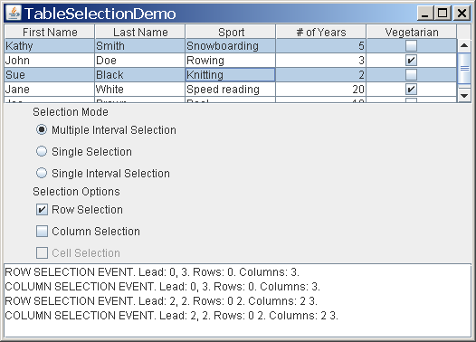
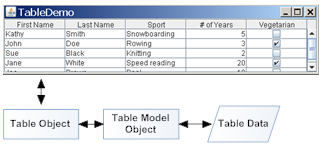
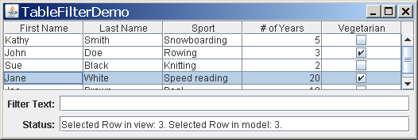
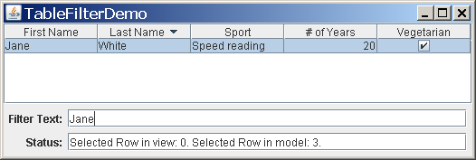
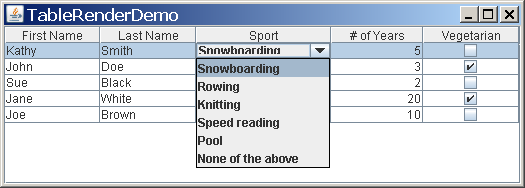
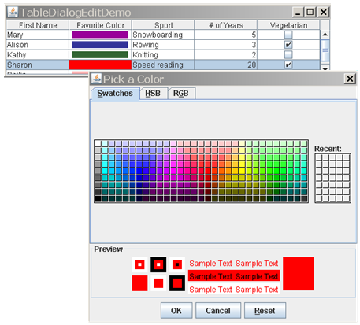

# 如何使用表格

> 原文： [https://docs.oracle.com/javase/tutorial/uiswing/components/table.html](https://docs.oracle.com/javase/tutorial/uiswing/components/table.html)

使用 [`JTable`](https://docs.oracle.com/javase/8/docs/api/javax/swing/JTable.html) 类，您可以显示数据表，也可以选择允许用户编辑数据。 `JTable`不包含或缓存数据;它只是一个数据视图。以下是滚动窗格中显示的典型表格的图片：


本节的其余部分将向您展示如何完成一些常见的表相关任务。以下是本节涉及的主题：

*   [创建简单表](#simple)
*   [将表添加到容器](#show)
*   [设置和更改列宽](#width)
*   [用户选择](#selection)
*   [创建表格模型](#data)
*   [听取数据变更](#modelchange)
*   [发射数据变更事件](#fire)
*   [概念：编辑和渲染器](#editrender)
*   [使用自定义渲染器](#renderer)
*   [指定细胞工具提示](#celltooltip)
*   [指定列标题的工具提示](#headertooltip)
*   [排序和过滤](#sorting)
*   [使用组合框作为编辑](#combobox)
*   [使用其他编辑](#editor)
*   [使用编辑器验证用户输入的文本](#validtext)
*   [打印](#printing)
*   [使用表格的例子](#eg)

* * *

**Try this:** 

1.  单击启动按钮以使用 [Java™Web Start](http://www.oracle.com/technetwork/java/javase/javawebstart/index.html) （[下载 JDK 7 或更高版本](http://www.oracle.com/technetwork/java/javase/downloads/index.html)）运行`SimpleTableDemo`。或者，要自己编译并运行示例，请参考[示例索引](../examples/components/index.html#SimpleTableDemo)。

    [](https://docs.oracle.com/javase/tutorialJWS/samples/uiswing/SimpleTableDemoProject/SimpleTableDemo.jnlp)

2.  单击包含“单板滑雪”的单元格。
    选择整个第一行，表示您已选择 Kathy Smith 的数据。一个特别的亮点表示“单板滑雪”单元格是可编辑的。通常，您可以通过双击来开始编辑文本单元格。

3.  将光标放在“名字”上。现在按下鼠标按钮并向右拖动。
    如您所见，用户可以重新排列表格中的列。

4.  将光标定位在列标题的右侧。现在按下鼠标按钮并向右或向左拖动。
    列更改大小，其他列调整以填充剩余空间。

5.  调整包含表格的窗口的大小，使其大于显示整个表格所需的大小。
    所有表格单元格变宽，扩展以填充额外的水平空间。

* * *

[`SimpleTableDemo.java`](../examples/components/SimpleTableDemoProject/src/components/SimpleTableDemo.java) 中的表声明 String 数组中的列名：

```
String[] columnNames = {"First Name",
                        "Last Name",
                        "Sport",
                        "# of Years",
                        "Vegetarian"};

```

它的数据被初始化并存储在一个二维 Object 数组中：

```
Object[][] data = {
    {"Kathy", "Smith",
     "Snowboarding", new Integer(5), new Boolean(false)},
    {"John", "Doe",
     "Rowing", new Integer(3), new Boolean(true)},
    {"Sue", "Black",
     "Knitting", new Integer(2), new Boolean(false)},
    {"Jane", "White",
     "Speed reading", new Integer(20), new Boolean(true)},
    {"Joe", "Brown",
     "Pool", new Integer(10), new Boolean(false)}
};

```

然后使用这些数据和 columnNames 构建表：

```
JTable table = new JTable(data, columnNames);

```

有两个`JTable`构造器直接接受数据（`SimpleTableDemo`使用第一个）：

*   `JTable(Object[][] rowData, Object[] columnNames)`
*   `JTable(Vector rowData, Vector columnNames)`

这些构造器的优点是它们易于使用。但是，这些构造器也有缺点：

*   它们会自动使每个单元格都可编辑。
*   它们将所有数据类型视为相同（作为字符串）。例如，如果表列具有`Boolean`数据，则表可以在复选框中显示数据。但是，如果使用前面列出的两个`JTable`构造器中的任何一个，则`Boolean`数据将显示为字符串。您可以在上图的`Vegetarian`列中看到这种差异。
*   它们要求您将所有表的数据放在数组或向量中，这可能不适合某些数据。例如，如果要从数据库中实例化一组对象，则可能需要直接查询对象的值，而不是将所有值复制到数组或向量中。

如果您想绕过这些限制，则需要实现自己的表模型，如[创建表模型](#data)中所述。

以下是创建[滚动窗格](scrollpane.html)的典型代码，该窗格用作表的容器：

```
JScrollPane scrollPane = new JScrollPane(table);
table.setFillsViewportHeight(true);

```

此代码段中的两行执行以下操作：

*   使用引用表对象的参数调用`JScrollPane`构造器。这会创建一个滚动窗格作为表的容器;该表自动添加到容器中。
*   调用`JTable.setFillsViewportHeight`来设置`fillsViewportHeight`属性。当此属性为`true`时，表使用容器的整个高度，即使表没有足够的行来使用整个垂直空间。这样可以更轻松地将表用作拖放目标。

滚动窗格自动将表头放置在视口的顶部。滚动表数据时，列名称在查看区域的顶部仍然可见。

如果您使用的是没有滚动窗格的表，则必须获取表头组件并自行放置。例如：

```
container.setLayout(new BorderLayout());
container.add(table.getTableHeader(), BorderLayout.PAGE_START);
container.add(table, BorderLayout.CENTER);

```

默认情况下，表中的所有列都以相等的宽度开始，列自动填充表的整个宽度。当表变得更宽或更窄时（可能在用户调整包含表的窗口的大小时发生），所有列宽都会相应地改变。

当用户通过拖动其右边框来调整列的大小时，其他列必须更改大小，或者表的大小必须更改。默认情况下，表的大小保持不变，并且拖动点右侧的所有列都会调整大小以适应添加到拖动点左侧列或从其中删除的空间。

要自定义初始列宽，可以在每个表的列上调用`setPreferredWidth`。这将设置列的首选宽度及其近似相对宽度。例如，将以下代码添加到`SimpleTableDemo`使其第三列比其他列更大：

```
TableColumn column = null;
for (int i = 0; i < 5; i++) {
    column = table.getColumnModel().getColumn(i);
    if (i == 2) {
        column.setPreferredWidth(100); //third column is bigger
    } else {
        column.setPreferredWidth(50);
    }
}

```

如前面的代码所示，表中的每一列都由 [`TableColumn`](https://docs.oracle.com/javase/8/docs/api/javax/swing/table/TableColumn.html) 对象表示。 `TableColumn`为列的最小宽度，首选宽度和最大宽度提供 getter 和 setter 方法，以及获取当前宽度的方法。有关基于绘制单元格内容所需空间的近似值来设置单元格宽度的示例，请参阅 [`TableRenderDemo.java`](../examples/components/TableRenderDemoProject/src/components/TableRenderDemo.java) 中的`initColumnSizes`方法。

当用户显式调整列的大小时，将设置列 _ 首选 _ 宽度，以便用户指定的大小成为列的新 _ 当前 _ 宽度。但是，当表本身被调整大小时 - 通常是因为窗口已调整大小 - ;列的首选宽度不会更改。相反，现有的首选宽度用于计算新的列宽以填充可用空间。

您可以通过调用 [`setAutoResizeMode`](https://docs.oracle.com/javase/8/docs/api/javax/swing/JTable.html#setAutoResizeMode-int-) 来更改表的调整大小行为。

在其默认配置中，表支持由一行或多行组成的选择。用户可以选择连续的行范围或任意行集。用户指示的最后一个单元格获得特殊指示;在金属外观和感觉中，细胞被勾勒出来。该细胞被称为 _ 导联选择 _;它有时被称为“具有焦点的细胞”或“当前细胞”。

用户使用鼠标和/或键盘进行选择，如下表所述：

| 手术 | 鼠标动作 | 键盘动作 |
| --- | --- | --- |
| 选择单行。 | 点击。 | 向上箭头或向下箭头。 |
| 扩展连续选择。 | 按住 Shift 键并单击或拖动行。 | 上移箭头或下移箭头。 |
| 添加行到选择/切换行选择。 | 按住 Control 键单击 | 使用“向上控制箭头”或“向下控制箭头”移动引线选择，然后使用空格键添加到选择或控制空间栏以切换行选择。 |

要查看选择的工作方式，请单击“启动”按钮以使用 [Java™Web Start](http://www.oracle.com/technetwork/java/javase/javawebstart/index.html) （[下载 JDK 7 或更高版本](http://www.oracle.com/technetwork/java/javase/downloads/index.html)）运行`TableSelectionDemo`。或者，要自己编译并运行示例，请参考[示例索引](../examples/components/index.html#TableSelectionDemo)。

[](https://docs.oracle.com/javase/tutorialJWS/samples/uiswing/TableSelectionDemoProject/TableSelectionDemo.jnlp)

此示例程序提供熟悉的表，并允许用户操作某些 JTable 选项。还有一个记录选择事件的文本窗格。

在下面的屏幕截图中，用户运行程序，单击第一行，然后在第三行中按住 Control 键单击。注意最后一个单元格周围的轮廓;这就是金属外观如何突出引线选择。



在“选择模式”下，有一组单选按钮。单击标记为“单选”的那个。现在，您一次只能选择一行。如果单击“单个间隔选择”单选按钮，则可以选择一组必须连续的行。

“选择模式”下的所有单选按钮都会调用 [`JTable.setSelectionMode`](https://docs.oracle.com/javase/8/docs/api/javax/swing/JTable.html#setSelectionMode-int-) 。此方法采用单个参数，该参数必须是`javax.swing.ListSelectionModel`中定义的以下常量之一：`MULTIPLE_INTERVAL_SELECTION`，`SINGLE_INTERVAL_SELECTION`和`SINGLE_SELECTION`。

返回`TableSelectionDemo`，请注意“选项选项”下的三个选项复选框。每个复选框控制由`JTable`定义的`boolean`绑定变量的状态：

*   “行选择”控制`rowSelectionAllowed`，其具有设定方法`setRowSelectionAllowed`和吸气剂方法`getRowSelectionAllowed`。当此绑定属性为`true`（并且`columnSelectionAllowed`属性为`false`）时，用户可以按行选择。
*   “列选择”控制`columnSelectionAllowed`，其具有设定方法`setColumnSelectionAllowed`和吸气剂方法`getColumnSelectionAllowed`。当此绑定属性为`true`（并且`rowSelectionAllowed`绑定属性为`false`）时，用户可以按列进行选择。
*   “细胞选择”控制`cellSelectionEnabled`，其具有设定方法`setCellSelectionEnabled`和吸气剂方法`getCellSelectionEnabled`。当此绑定属性为`true`时，用户可以选择单个单元格或矩形单元格块。

* * *

**NOTE:** `JTable` uses a very simple concept of selection, managed as an intersection of rows and columns. It was not designed to handle fully independent cell selections.

* * *

如果清除所有三个复选框（将所有三个绑定属性设置为`false`），则没有选择;仅显示前导选择。

您可能会注意到在多个间隔选择模式下禁用了“单元格选择”复选框。这是因为演示中此模式不支持单元格选择。您可以在多个间隔选择模式下按单元格指定选择，但结果是一个不会产生有用选择的表格。

您可能还注意到，更改三个选项中的任何一个都会影响其他选项。这是因为允许行选择和列选择与启用单元格选择完全相同。 `JTable`会根据需要自动更新三个绑定变量，以保持一致。

* * *

**NOTE:** Setting `cellSelectionEnabled` to a value has the side effect of also setting both `rowSelectionEnabled` and `columnSelectionEnabled` to that value. Setting both `rowSelectionEnabled` and `columnSelectionEnabled` to a value has the side effect of also setting `cellSelectionEnabled` to that value. Setting `rowSelectionEnabled` and `columnSelectionEnabled` to different values has the side effect of also setting `cellSelectionEnabled` to `false`.

* * *

要检索当前选择，请使用返回行索引数组的 [`JTable.getSelectedRows`](https://docs.oracle.com/javase/8/docs/api/javax/swing/JTable.html#getSelectedRows--) 和返回列索引数组的 [`JTable.getSelectedColumns`](https://docs.oracle.com/javase/8/docs/api/javax/swing/JTable.html#getSelectedColumns--) 。要检索前导选择的坐标，请参阅表本身和表的列模型的选择模型。以下代码格式化包含前导选择的行和列的字符串：

```
String.format("Lead Selection: %d, %d. ",
    table.getSelectionModel().getLeadSelectionIndex(),
    table.getColumnModel().getSelectionModel().getLeadSelectionIndex());

```

用户选择会生成许多事件。有关这些的信息，请参阅[如何在](../events/listselectionlistener.html)[写入事件监听器](../events/index.html)课程中编写列表选择监听器。

* * *

**NOTE:** Selection data actually describes selected cells in the "view" (table data as it appears after any sorting or filtering) rather than in the table model. This distinction does not matter unless your viewed data has been rearranged by sorting, filtering, or user manipulation of columns. In that case, you must convert selection coordinates using the conversion methods described in [Sorting and Filtering](#sorting).

* * *

每个表对象都使用 _ 表模型对象 _ 来管理实际的表数据。表模型对象必须实现 [`TableModel`](https://docs.oracle.com/javase/8/docs/api/javax/swing/table/TableModel.html) 接口。如果程序员没有提供表模型对象，`JTable`会自动创建 [`DefaultTableModel`](https://docs.oracle.com/javase/8/docs/api/javax/swing/table/DefaultTableModel.html) 的实例。这种关系如下所示。



`SimpleTableDemo`使用的`JTable`构造器使用如下代码创建其表模型：

```
new AbstractTableModel() {
    public String getColumnName(int col) {
        return columnNames[col].toString();
    }
    public int getRowCount() { return rowData.length; }
    public int getColumnCount() { return columnNames.length; }
    public Object getValueAt(int row, int col) {
        return rowData[row][col];
    }
    public boolean isCellEditable(int row, int col)
        { return true; }
    public void setValueAt(Object value, int row, int col) {
        rowData[row][col] = value;
        fireTableCellUpdated(row, col);
    }
}

```

如前面的代码所示，实现表模型可以很简单。通常，您在 [`AbstractTableModel`](https://docs.oracle.com/javase/8/docs/api/javax/swing/table/AbstractTableModel.html) 类的子类中实现表模型。

您的模型可能将其数据保存在数组，矢量或哈希映射中，或者它可能从外部源（如数据库）获取数据。它甚至可能在执行时生成数据。

该表与`SimpleTableDemo`表的不同之处如下：

*   `TableDemo`的自定义表模型，即使很简单，也可以轻松确定数据的类型，帮助`JTable`以最佳格式显示数据。另一方面，`SimpleTableDemo`自动创建的表模型不知道年列的**＃包含数字（通常应该是右对齐且具有特定格式）。它也不知道`Vegetarian`列包含布尔值，可以用复选框表示。**
*   在`TableDemo`中实现的自定义表模型不允许您编辑名称列;但是，它允许您编辑其他列。在`SimpleTableDemo`中，所有单元格都是可编辑的。

请参见下面 [`TableDemo.java`](../examples/components/TableDemoProject/src/components/TableDemo.java) 中与 [`SimpleTableDemo.java`](../examples/components/SimpleTableDemoProject/src/components/SimpleTableDemo.java) 不同的代码。粗体字表示使该表模型与`SimpleTableDemo`自动定义的表模型不同的代码。

```
public TableDemo() {
    ...
    JTable table = new JTable(new MyTableModel());
    ...
}

class MyTableModel extends AbstractTableModel {
    private String[] columnNames = ...//same as before...
    private Object[][] data = ...//same as before...

    public int getColumnCount() {
        return columnNames.length;
    }

    public int getRowCount() {
        return data.length;
    }

    public String getColumnName(int col) {
        return columnNames[col];
    }

    public Object getValueAt(int row, int col) {
        return data[row][col];
    }

    public Class getColumnClass(int c) {
        return getValueAt(0, c).getClass();
    }

    /*
     * Don't need to implement this method unless your table's
     * editable.
     */
    public boolean isCellEditable(int row, int col) {
        //Note that the data/cell address is constant,
        //no matter where the cell appears onscreen.
        if (col < 2) {
            return false;
        } else {
            return true;
        }
    }

    /*
     * Don't need to implement this method unless your table's
     * data can change.
     */
    public void setValueAt(Object value, int row, int col) {
        data[row][col] = value;
        fireTableCellUpdated(row, col);
    }
    ...
}

```

表模型可以具有一组侦听器，每当表数据发生更改时都会通知这些侦听器。听众是 [`TableModelListener`](https://docs.oracle.com/javase/8/docs/api/javax/swing/event/TableModelListener.html) 的实例。在以下示例代码中，扩展了`SimpleTableDemo`以包含此类侦听器。新代码以粗体显示。

```
import javax.swing.event.*;
import javax.swing.table.TableModel;

public class SimpleTableDemo ... implements TableModelListener {
    ...
    public SimpleTableDemo() {
        ...
        table.getModel().addTableModelListener(this);
        ...
    }

    public void tableChanged(TableModelEvent e) {
        int row = e.getFirstRow();
        int column = e.getColumn();
        TableModel model = (TableModel)e.getSource();
        String columnName = model.getColumnName(column);
        Object data = model.getValueAt(row, column);

        _...// Do something with the data..._
    }
    ...
}

```

为了触发数据更改事件，表模型必须知道如何构造 [`TableModelEvent`](https://docs.oracle.com/javase/8/docs/api/javax/swing/event/TableModelEvent.html) 对象。这可能是一个复杂的过程，但已在`DefaultTableModel`中实现。您可以允许`JTable`使用其`DefaultTableModel`的默认实例，也可以创建自己的`DefaultTableModel`自定义子类。

如果`DefaultTableModel`不是自定义表模型类的合适基类，请考虑子类化 [`AbstractTableModel`](https://docs.oracle.com/javase/8/docs/api/javax/swing/table/AbstractTableModel.html) 。该类实现了一个用于构造`TableModelEvent`对象的简单框架。每次外部源更改表数据时，您的自定义类只需要调用以下`AbstractTableModel`方法之一。

| 方法 | 更改 |
| :-- | :-- |
| `fireTableCellUpdated` | 更新指定的单元格。 |
| `fireTableRowsUpdated` | 更新指定的行 |
| `fireTableDataChanged` | 更新整个表（仅限数据）。 |
| `fireTableRowsInserted` | 插入新行。 |
| `fireTableRowsDeleted` | 已删除现有行 |
| `fireTableStructureChanged` | 使整个表无效，包括数据和结构。 |

在继续下面的几个任务之前，您需要了解表格如何绘制单元格。您可能希望表中的每个单元格都是一个组件。但是，出于性能原因，Swing 表的实现方式不同。

相反，单个 _ 单元格渲染器 _ 通常用于绘制包含相同类型数据的所有单元格。您可以将渲染器视为可配置的墨迹标记，该表用于将适当格式化的数据标记到每个单元格上。当用户开始编辑单元格的数据时，_ 单元格编辑器 _ 接管单元格，控制单元格的编辑行为。

例如，`TableDemo`中**＃Years** 列中的每个单元格包含`Number`数据 - 特别是`Integer`对象。默认情况下，包含`Number`的列的单元格渲染器使用单个`JLabel`实例在列的单元格上绘制右对齐的相应数字。如果用户开始编辑其中一个单元格，则默认单元格编辑器使用右对齐`JTextField`来控制单元格编辑。

要选择在列中显示单元格的渲染器，表格首先确定是否为该特定列指定了渲染器。如果没有，则表调用表模型的`getColumnClass`方法，该方法获取列单元格的数据类型。接下来，该表将列的数据类型与已注册单元格渲染器的数据类型列表进行比较。此列表由表初始化，但您可以添加或更改它。目前，表格将以下类型的数据放入列表中：

*   `Boolean` - 使用复选框呈现。
*   `Number` - 由右对齐标签呈现。
*   `Double`，`Float` - 与`Number`相同，但是对象到文本的转换由 [`NumberFormat`](https://docs.oracle.com/javase/8/docs/api/java/text/NumberFormat.html) 实例（使用当前语言环境的默认数字格式）执行。
*   `Date` - 由标签呈现，由 [`DateFormat`](https://docs.oracle.com/javase/8/docs/api/java/text/DateFormat.html) 实例执行对象到文本的转换（使用日期和时间的简短样式）。
*   `ImageIcon`，`Icon` - 由居中标签呈现。
*   `Object` - 由显示对象字符串值的标签呈现。

使用类似的算法选择单元编辑器。

请记住，如果让表创建自己的模型，它会使用`Object`作为每列的类型。要指定更精确的列类型，表模型必须正确定义`getColumnClass`方法，如 [`TableDemo.java`](../examples/components/TableDemoProject/src/components/TableDemo.java) 所示。

请记住，虽然渲染器确定每个单元格或列标题的外观并且可以指定其工具提示文本，但渲染器不会处理事件。如果您需要选择在表格中发生的事件，您使用的技术会因您感兴趣的事件类型而异：

| 情况 | 如何获取活动 |
| :-- | :-- |
| 要检测正在编辑的单元格中的事件... | 使用单元格编辑器（或在单元格编辑器上注册侦听器）。 |
| 检测行/列/单元格选择和取消选择... | 使用[检测用户选择](#selection)中所述的选择监听器。 |
| 检测列标题上的鼠标事件... | 在表的`JTableHeader`对象上注册适当类型的[鼠标监听器](../events/mouselistener.html )。 （参见 [`TableSorter.java`](../examples/components/TableSorterDemoProject/src/components/TableSorter.java) 的例子。） |
| 检测其他事件...... | 在`JTable`对象上注册相应的侦听器。 |

接下来的几节将介绍如何通过指定渲染器和编辑器来自定义显示和编辑。您可以按列或按数据类型指定单元格渲染器和编辑器。

本节介绍如何创建和指定单元格渲染器。您可以使用`JTable`方法`setDefaultRenderer`设置特定于类型的单元格渲染器。要指定特定列中的单元格应使用渲染器，请使用`TableColumn`方法`setCellRenderer`。您甚至可以通过创建`JTable`子类来指定特定于单元格的渲染器。

可以轻松自定义默认渲染器`DefaultTableCellRenderer`渲染的文本或图像。您只需创建一个子类并实现`setValue`方法，以便它使用适当的字符串或图像调用`setText`或`setIcon`。例如，以下是默认日期渲染器的实现方式：

```
static class DateRenderer extends DefaultTableCellRenderer {
    DateFormat formatter;
    public DateRenderer() { super(); }

    public void setValue(Object value) {
        if (formatter==null) {
            formatter = DateFormat.getDateInstance();
        }
        setText((value == null) ? "" : formatter.format(value));
    }
}

```

如果扩展`DefaultTableCellRenderer`不足，则可以使用另一个超类构建渲染器。最简单的方法是创建现有组件的子类，使您的子类实现 [`TableCellRenderer`](https://docs.oracle.com/javase/8/docs/api/javax/swing/table/TableCellRenderer.html) 接口。 `TableCellRenderer`只需要一种方法：`getTableCellRendererComponent`。您对此方法的实现应设置呈现组件以反映传入状态，然后返回该组件。

在`TableDialogEditDemo`的[快照](#colorRenderer)中，用于 **Favorite Color** 单元格的渲染器是`JLabel`的子类，称为`ColorRenderer`。以下是 [`ColorRenderer.java`](../examples/components/TableDialogEditDemoProject/src/components/ColorRenderer.java) 的摘录，展示了它是如何实现的。

```
public class ColorRenderer extends JLabel
                           implements TableCellRenderer {
    ...
    public ColorRenderer(boolean isBordered) {
        this.isBordered = isBordered;
        setOpaque(true); //MUST do this for background to show up.
    }

    public Component getTableCellRendererComponent(
                            JTable table, Object color,
                            boolean isSelected, boolean hasFocus,
                            int row, int column) {
        Color newColor = (Color)color;
        setBackground(newColor);
        if (isBordered) {
            if (isSelected) {
                ...
                //selectedBorder is a solid border in the color
                //table.getSelectionBackground().
                setBorder(selectedBorder);
            } else {
                ...
                //unselectedBorder is a solid border in the color
                //table.getBackground().
                setBorder(unselectedBorder);
            }
        }

        setToolTipText(...); //Discussed in the following section
        return this;
    }
}

```

以下是来自 [`TableDialogEditDemo.java`](../examples/components/TableDialogEditDemoProject/src/components/TableDialogEditDemo.java) 的代码，它将`ColorRenderer`实例注册为所有`Color`数据的默认渲染器：

```
table.setDefaultRenderer(Color.class, new ColorRenderer(true));

```

要指定特定于单元格的渲染器，需要定义覆盖`getCellRenderer`方法的`JTable`子类。例如，以下代码使表的第一列中的第一个单元格使用自定义渲染器：

```
TableCellRenderer weirdRenderer = new WeirdRenderer();
table = new JTable(...) {
    public TableCellRenderer getCellRenderer(int row, int column) {
        if ((row == 0) && (column == 0)) {
            return weirdRenderer;
        }
        // else...
        return super.getCellRenderer(row, column);
    }
};

```

默认情况下，为表格单元格显示的工具提示文本由单元格的渲染器确定。但是，有时通过覆盖`JTable`的`getToolTipText(MouseEvent)`方法实现来指定工具提示文本会更简单。本节介绍如何使用这两种技术。

要使用渲染器向单元格添加工具提示，首先需要获取或创建单元格渲染器。然后，在确保渲染组件是`JComponent`之后，在其上调用`setToolTipText`方法。

设置单元工具提示的示例在`TableRenderDemo`中。单击“启动”按钮以使用 [Java™Web Start](http://www.oracle.com/technetwork/java/javase/javawebstart/index.html) （[下载 JDK 7 或更高版本](http://www.oracle.com/technetwork/java/javase/downloads/index.html)）运行它。或者，要自己编译并运行示例，请参考[示例索引](../examples/components/index.html#TableRenderDemo)。

[](https://docs.oracle.com/javase/tutorialJWS/samples/uiswing/TableRenderDemoProject/TableRenderDemo.jnlp)

源代码在 [`TableRenderDemo.java`](../examples/components/TableRenderDemoProject/src/components/TableRenderDemo.java) 中。它使用以下代码为 **Sport** 列的单元格添加工具提示：

```
//Set up tool tips for the sport cells.
DefaultTableCellRenderer renderer =
        new DefaultTableCellRenderer();
renderer.setToolTipText("Click for combo box");
sportColumn.setCellRenderer(renderer);

```

虽然上一个示例中的工具提示文本是静态的，但您还可以实现其文本根据单元格或程序的状态而更改的工具提示。以下是几种方法：

*   在渲染器的`getTableCellRendererComponent`方法实现中添加一些代码。
*   覆盖`JTable`方法`getToolTipText(MouseEvent)`。

将代码添加到单元格渲染器的示例在`TableDialogEditDemo`中。单击“启动”按钮以使用 [Java™Web Start](http://www.oracle.com/technetwork/java/javase/javawebstart/index.html) （[下载 JDK 7 或更高版本](http://www.oracle.com/technetwork/java/javase/downloads/index.html)）运行它。或者，要自己编译并运行示例，请参考[示例索引](../examples/components/index.html#TableDialogEditDemo)。

[](https://docs.oracle.com/javase/tutorialJWS/samples/uiswing/TableDialogEditDemoProject/TableDialogEditDemo.jnlp)

`TableDialogEditDemo`使用颜色渲染器，在 [`ColorRenderer.java`](../examples/components/TableDialogEditDemoProject/src/components/ColorRenderer.java) 中实现，使用以下代码段中的粗体代码设置工具提示文本：

```
public class ColorRenderer extends JLabel 
                           implements TableCellRenderer {
    ...
    public Component getTableCellRendererComponent(
                            JTable table, Object color,
                            boolean isSelected, boolean hasFocus,
                            int row, int column) {
        Color newColor = (Color)color;
        ...
        setToolTipText("RGB value: " + newColor.getRed() + ", "
                                     + newColor.getGreen() + ", "
                                     + newColor.getBlue());
        return this;
    }
}

```

以下是工具提示的示例：


您可以通过覆盖`JTable`的`getToolTipText(MouseEvent)`方法来指定工具提示文本。程序`TableToolTipsDemo`显示了如何。单击“启动”按钮以使用 [Java™Web Start](http://www.oracle.com/technetwork/java/javase/javawebstart/index.html) （[下载 JDK 7 或更高版本](http://www.oracle.com/technetwork/java/javase/downloads/index.html)）运行它。或者，要自己编译并运行示例，请参考[示例索引](../examples/components/index.html#TableToolTipsDemo)。

[](https://docs.oracle.com/javase/tutorialJWS/samples/uiswing/TableToolTipsDemoProject/TableToolTipsDemo.jnlp)

带有工具尖端的细胞位于 **Sport** 和 **Vegetarian** 列中。这是其工具提示的图片：


以下是来自 [`TableToolTipsDemo.java`](../examples/components/TableToolTipsDemoProject/src/components/TableToolTipsDemo.java) 的代码，它实现了 **Sport** 和 **Vegetarian** 列中细胞的工具提示：

```
JTable table = new JTable(new MyTableModel()) {    
    //Implement table cell tool tips.
    public String getToolTipText(MouseEvent e) {
        String tip = null;
        java.awt.Point p = e.getPoint();
        int rowIndex = rowAtPoint(p);
        int colIndex = columnAtPoint(p);
        int realColumnIndex = convertColumnIndexToModel(colIndex);

        if (realColumnIndex == 2) { //Sport column
            tip = "This person's favorite sport to "
                   + "participate in is: "
                   + getValueAt(rowIndex, colIndex);

        } else if (realColumnIndex == 4) { //Veggie column
            TableModel model = getModel();
            String firstName = (String)model.getValueAt(rowIndex,0);
            String lastName = (String)model.getValueAt(rowIndex,1);
            Boolean veggie = (Boolean)model.getValueAt(rowIndex,4);
            if (Boolean.TRUE.equals(veggie)) {
                tip = firstName + " " + lastName
                      + " is a vegetarian";
            } else {
                tip = firstName + " " + lastName
                      + " is not a vegetarian";
            }

        } else { //another column
            //You can omit this part if you know you don't 
            //have any renderers that supply their own tool 
            //tips.
            tip = super.getToolTipText(e);
        }
        return tip;
    }
    ...
}

```

代码相当简单，除了调用`convertColumnIndexToModel`。该调用是必要的，因为如果用户移动列，则列的视图索引将与列的模型索引不匹配。例如，用户可能会拖动 **Vegetarian** 列（模型认为是索引 4），因此它显示为第一列 - 在视图索引 0 处。因为`prepareRenderer`提供了视图索引，您需要将视图索引转换为模型索引，以便确保已选择了预期的列。

您可以通过设置表的`JTableHeader`的工具提示文本，将工具提示添加到列标题。通常，不同的列标题需要不同的工具提示文本。您可以通过覆盖表头的`getToolTipText`方法来更改文本。或者，您可以调用`TableColumn.setHeaderRenderer`为标题提供自定义渲染器。

所有列标题使用相同工具提示文本的示例在 [`TableSorterDemo.java`](../examples/components/TableSorterDemoProject/src/components/TableSorterDemo.java) 中。以下是它如何设置工具提示文本：

```
table.getTableHeader().setToolTipText(
        "Click to sort; Shift-Click to sort in reverse order");

```

[`TableToolTipsDemo.java`](../examples/components/TableToolTipsDemoProject/src/components/TableToolTipsDemo.java) 有一个实现列标题工具提示的示例，这些提示因列而异。如果使用 [Java™Web Start](http://www.oracle.com/technetwork/java/javase/javawebstart/index.html) （[下载 JDK 7 或更高版本](http://www.oracle.com/technetwork/java/javase/downloads/index.html)）运行`TableToolTipsDemo`（单击“启动”按钮）。或者，要自己编译并运行示例，请参考[示例索引](../examples/components/index.html#TableToolTipsDemo)。

[](https://docs.oracle.com/javase/tutorialJWS/samples/uiswing/TableToolTipsDemoProject/TableToolTipsDemo.jnlp)

当鼠标悬停在除前两个之外的任何列标题上时，您将看到工具提示。名称列没有提供工具提示，因为它们似乎不言自明。以下是其中一个列标题工具提示的图片：


以下代码实现了工具提示。基本上，它创建`JTableHeader`的子类来覆盖`getToolTipText(MouseEvent)`方法，以便它返回当前列的文本。要将修改后的表头与表关联，将覆盖`JTable`方法`createDefaultTableHeader`，以便它返回`JTableHeader`子类的实例。

```
protected String[] columnToolTips = {
    null, // "First Name" assumed obvious
    null, // "Last Name" assumed obvious
    "The person's favorite sport to participate in",
    "The number of years the person has played the sport",
    "If checked, the person eats no meat"};
...

JTable table = new JTable(new MyTableModel()) {
    ...

    //Implement table header tool tips.
    protected JTableHeader createDefaultTableHeader() {
        return new JTableHeader(columnModel) {
            public String getToolTipText(MouseEvent e) {
                String tip = null;
                java.awt.Point p = e.getPoint();
                int index = columnModel.getColumnIndexAtX(p.x);
                int realIndex = 
                        columnModel.getColumn(index).getModelIndex();
                return columnToolTips[realIndex];
            }
        };
    }
};

```

表格排序和过滤由 _ 分拣机 _ 对象管理。提供分拣机对象的最简单方法是将`autoCreateRowSorter`绑定属性设置为`true`：

```
JTable table = new JTable();
table.setAutoCreateRowSorter(true);

```

此操作定义了一个行分类器，它是 [`javax.swing.table.TableRowSorter`](https://docs.oracle.com/javase/8/docs/api/javax/swing/table/TableRowSorter.html) 的一个实例。这提供了一个表，当用户单击列标题时，该表执行简单的特定于语言环境的排序。这在 [``TableSortDemo.java``](../examples/components/TableSortDemoProject/src/components/TableSortDemo.java)中得到证实，如此屏幕截图所示：


要更好地控制排序，可以构造`TableRowSorter`的实例并指定它是表的排序器对象。

```
TableRowSorter<TableModel> sorter 
    = new TableRowSorter<TableModel>(table.getModel());
table.setRowSorter(sorter);

```

`TableRowSorter`使用 [`java.util.Comparator`](https://docs.oracle.com/javase/8/docs/api/java/util/Comparator.html) 对象对其行进行排序。实现此接口的类必须提供名为`compare`的方法，该方法定义如何比较任何两个对象以进行排序。例如，以下代码创建一个`Comparator`，按每个字符串中的最后一个字对一组字符串进行排序：

```
Comparator<String> comparator = new Comparator<String>() {
    public int compare(String s1, String s2) {
        String[] strings1 = s1.split("\\s");
        String[] strings2 = s2.split("\\s");
        return strings1[strings1.length - 1]
            .compareTo(strings2[strings2.length - 1]);
    }
};

```

这个例子相当简单;更典型地，`Comparator`实现是 [`java.text.Collator`](https://docs.oracle.com/javase/8/docs/api/java/text/Collator.html) 的子类。您可以定义自己的子类，使用`Collator`中的工厂方法获取特定区域设置的`Comparator`，或使用 [`java.text.RuleBasedCollator`](https://docs.oracle.com/javase/8/docs/api/java/text/RuleBasedCollator.html) 。

要确定要用于列的`Comparator`，`TableRowSorter`会尝试依次应用以下每个规则。按照下面列出的顺序遵循规则;使用为分拣机提供`Comparator`的第一个规则，并忽略剩余规则。

1.  如果通过调用 [`setComparator`](https://docs.oracle.com/javase/8/docs/api/javax/swing/DefaultRowSorter.html#setComparator-int-java.util.Comparator-) 指定了比较器，请使用该比较器。
2.  如果表模型报告列数据由字符串组成（`TableModel.getColumnClass`返回该列的`String.class`），请使用比较器根据当前语言环境对字符串进行排序。
3.  如果`TableModel.getColumnClass`返回的列类实现`Comparable`，请使用比较器根据 [`Comparable.compareTo`](https://docs.oracle.com/javase/8/docs/api/java/lang/Comparable.html#compareTo-T-) 返回的值对字符串进行排序。
4.  如果通过调用 [`setStringConverter`](https://docs.oracle.com/javase/8/docs/api/javax/swing/table/TableRowSorter.html#setStringConverter-javax.swing.table.TableStringConverter-) 为表指定了字符串转换器，请使用比较器根据当前语言环境对生成的字符串表示进行排序。
5.  如果以前的规则均不适用，请使用比较器调用列数据上的`toString`，并根据当前区域设置对生成的字符串进行排序。

对于更复杂的排序类型，子类`TableRowSorter`或其父类 [`javax.swing.DefaultRowSorter`](https://docs.oracle.com/javase/8/docs/api/javax/swing/DefaultRowSorter.html) 。

要指定列的排序顺序和排序优先级，请调用 [`setSortKeys`](https://docs.oracle.com/javase/8/docs/api/javax/swing/DefaultRowSorter.html#setSortKeys-java.util.List-) 。下面是一个示例，它按前两列对示例中使用的表进行排序。排序中列的优先级由排序键列表中的排序键的顺序指示。在这种情况下，第二列具有第一个排序键，因此它们的行按名字排序，然后按姓氏排序。

```
List <RowSorter.SortKey> sortKeys 
    = new ArrayList<RowSorter.SortKey>();
sortKeys.add(new RowSorter.SortKey(1, SortOrder.ASCENDING));
sortKeys.add(new RowSorter.SortKey(0, SortOrder.ASCENDING));
sorter.setSortKeys(sortKeys); 

```

除了重新排序结果外，表格分类器还可以指定要显示的行。这被称为 _ 过滤 _。 `TableRowSorter`使用 [`javax.swing.RowFilter`](https://docs.oracle.com/javase/8/docs/api/javax/swing/RowFilter.html) 对象实现过滤。 `RowFilter`实现了几种创建常见过滤器的工厂方法。例如， [`regexFilter`](https://docs.oracle.com/javase/8/docs/api/javax/swing/RowFilter.html#regexFilter-java.lang.String-int...-) 返回基于[正则表达式](../../essential/regex/)过滤的`RowFilter`。

在以下示例代码中，您显式创建了一个分类器对象，以便稍后使用它来指定过滤器：

```
MyTableModel model = new MyTableModel();
sorter = new TableRowSorter<MyTableModel>(model);
table = new JTable(model);
table.setRowSorter(sorter);

```

然后根据文本字段的当前值进行过滤：

```
private void newFilter() {
    RowFilter<MyTableModel, Object> rf = null;
    //If current expression doesn't parse, don't update.
    try {
        rf = RowFilter.regexFilter(filterText.getText(), 0);
    } catch (java.util.regex.PatternSyntaxException e) {
        return;
    }
    sorter.setRowFilter(rf);
}

```

在随后的示例中，每次文本字段更改时都会调用`newFilter()`。当用户输入复杂的正则表达式时，`try...catch`可防止语法异常干扰输入。

当表使用分类器时，用户看到的数据的顺序可能与数据模型指定的顺序不同，并且可能不包括数据模型指定的所有行。用户实际看到的数据称为 _ 视图 _，并具有自己的坐标集。 `JTable`提供从模型坐标转换为视图坐标的方法 - [`convertColumnIndexToView`](https://docs.oracle.com/javase/8/docs/api/javax/swing/JTable.html#convertColumnIndexToView-int-) 和 [`convertRowIndexToView`](https://docs.oracle.com/javase/8/docs/api/javax/swing/JTable.html#convertRowIndexToView-int-) - 并且从视图坐标转换为模型坐标 - [`convertColumnIndexToModel`](https://docs.oracle.com/javase/8/docs/api/javax/swing/JTable.html#convertColumnIndexToModel-int-) 和 [`convertRowIndexToModel`](https://docs.oracle.com/javase/8/docs/api/javax/swing/JTable.html#convertRowIndexToModel-int-) 。

* * *

**NOTE:** When using a sorter, always remember to translate cell coordinates.

* * *

以下示例汇总了本节中讨论的想法。 [``TableFilterDemo.java`` ](../examples/components/TableFilterDemoProject/src/components/TableFilterDemo.java)为`TableDemo`添加少量变化。其中包括本节前面的代码片段，它为主表提供了一个分类器，并使用文本字段来提供过滤正则表达式。以下屏幕截图显示了在完成任何排序或过滤之前的`TableFilterDemo`。请注意，模型中的第 3 行仍与视图中的第 3 行相同：



如果用户在第二列上单击两次，则第四行将成为第一行 - 但仅在视图中：


如前所述，用户在“过滤文本”文本字段中输入的文本定义了一个过滤器，用于确定显示哪些行。与排序一样，过滤可能导致视图坐标偏离模型坐标：



以下是更新状态字段以反映当前选择的代码：

```
table.getSelectionModel().addListSelectionListener(
        new ListSelectionListener() {
            public void valueChanged(ListSelectionEvent event) {
                int viewRow = table.getSelectedRow();
                if (viewRow < 0) {
                    //Selection got filtered away.
                    statusText.setText("");
                } else {
                    int modelRow = 
                        table.convertRowIndexToModel(viewRow);
                    statusText.setText(
                        String.format("Selected Row in view: %d. " +
                            "Selected Row in model: %d.", 
                            viewRow, modelRow));
                }
            }
        }
);

```

将[组合框](combobox.html)设置为编辑器很简单，如下例所示。粗体代码行将组合框设置为特定列的编辑器。

```
TableColumn sportColumn = table.getColumnModel().getColumn(2);
...
JComboBox comboBox = new JComboBox();
comboBox.addItem("Snowboarding");
comboBox.addItem("Rowing");
comboBox.addItem("Chasing toddlers");
comboBox.addItem("Speed reading");
comboBox.addItem("Teaching high school");
comboBox.addItem("None");
sportColumn.setCellEditor(new DefaultCellEditor(comboBox));

```

这是使用的组合框编辑器的图片：



上述代码来自 [`TableRenderDemo.java`](../examples/components/TableRenderDemoProject/src/components/TableRenderDemo.java) 。您可以使用 [Java™Web Start](http://www.oracle.com/technetwork/java/javase/javawebstart/index.html) （[下载 JDK 7 或更高版本](http://www.oracle.com/technetwork/java/javase/downloads/index.html)）运行`TableRenderDemo`（单击“启动”按钮）。或者，要自己编译并运行示例，请参考[示例索引](../examples/components/index.html#TableRenderDemo)。

[](https://docs.oracle.com/javase/tutorialJWS/samples/uiswing/TableRenderDemoProject/TableRenderDemo.jnlp)

无论是为单个单元格列设置编辑器（使用`TableColumn` `setCellEditor`方法）还是为特定类型的数据设置（使用`JTable` `setDefaultEditor`方法），都可以使用参数指定编辑器坚持`TableCellEditor`界面。幸运的是，`DefaultCellEditor`类实现了这个接口并提供了构造器，让你可以指定一个`JTextField`，`JCheckBox`或`JComboBox`的编辑组件。通常，您不必将复选框显式指定为编辑器，因为具有`Boolean`数据的列会自动使用复选框渲染器和编辑器。

如果要指定除文本字段，复选框或组合框之外的编辑器，该怎么办？由于`DefaultCellEditor`不支持其他类型的组件，您必须做更多的工作。您需要创建一个实现 [`TableCellEditor`](https://docs.oracle.com/javase/8/docs/api/javax/swing/table/TableCellEditor.html) 接口的类。 [`AbstractCellEditor`](https://docs.oracle.com/javase/8/docs/api/javax/swing/AbstractCellEditor.html) 类是一个很好用的超类。它实现了`TableCellEditor`的超接口 [`CellEditor`](https://docs.oracle.com/javase/8/docs/api/javax/swing/CellEditor.html) ，省去了实现单元编辑器所需的事件触发代码的麻烦。

您的单元格编辑器类需要定义至少两个方法 - `getCellEditorValue`和`getTableCellEditorComponent`。 `CellEditor`所需的`getCellEditorValue`方法返回单元格的当前值。 `TableCellEditor`所需的`getTableCellEditorComponent`方法应配置并返回要用作编辑器的组件。

这是一张带有对话框的表格的图片，该对话框间接用作单元格编辑器。当用户开始编辑**收藏夹颜色**列中的单元格时，会出现一个按钮（真正的单元格编辑器）并显示该对话框，用户可以使用该对话框选择不同的颜色。



您可以使用 [Java™Web Start](http://www.oracle.com/technetwork/java/javase/javawebstart/index.html) （[下载 JDK 7 或更高版本](http://www.oracle.com/technetwork/java/javase/downloads/index.html)）运行`TableDialogEditDemo`（单击“启动”按钮）。或者，要自己编译并运行示例，请参考[示例索引](../examples/components/index.html#TableDialogEditDemo)。

[](https://docs.oracle.com/javase/tutorialJWS/samples/uiswing/TableDialogEditDemoProject/TableDialogEditDemo.jnlp)

以下是从 [`ColorEditor.java`](../examples/components/TableDialogEditDemoProject/src/components/ColorEditor.java) 中获取的代码，用于实现单元格编辑器。

```
public class ColorEditor extends AbstractCellEditor
                         implements TableCellEditor,
                                    ActionListener {
    Color currentColor;
    JButton button;
    JColorChooser colorChooser;
    JDialog dialog;
    protected static final String EDIT = "edit";

    public ColorEditor() {
        button = new JButton();
        button.setActionCommand(EDIT);
        button.addActionListener(this);
        button.setBorderPainted(false);

        //Set up the dialog that the button brings up.
        colorChooser = new JColorChooser();
        dialog = JColorChooser.createDialog(button,
                                        "Pick a Color",
                                        true,  //modal
                                        colorChooser,
                                        this,  //OK button handler
                                        null); //no CANCEL button handler
    }

    public void actionPerformed(ActionEvent e) {
        if (EDIT.equals(e.getActionCommand())) {
            //The user has clicked the cell, so
            //bring up the dialog.
            button.setBackground(currentColor);
            colorChooser.setColor(currentColor);
            dialog.setVisible(true);

            fireEditingStopped(); //Make the renderer reappear.

        } else { //User pressed dialog's "OK" button.
            currentColor = colorChooser.getColor();
        }
    }

    //Implement the one CellEditor method that AbstractCellEditor doesn't.
    public Object getCellEditorValue() {
        return currentColor;
    }

    //Implement the one method defined by TableCellEditor.
    public Component getTableCellEditorComponent(JTable table,
                                                 Object value,
                                                 boolean isSelected,
                                                 int row,
                                                 int column) {
        currentColor = (Color)value;
        return button;
    }
}

```

如您所见，代码非常简单。唯一有点棘手的部分是在编辑器按钮的动作处理器末尾调用`fireEditingStopped`。如果没有此调用，编辑器将保持活动状态，即使模式对话框不再可见。对`fireEditingStopped`的调用使表知道它可以取消激活编辑器，让渲染器再次处理单元格。

如果单元格的默认编辑器允许文本输入，则如果将单元格的类型指定为`String`或`Object`以外的其他类型，则会免费检查一些错误。错误检查是将输入的文本转换为适当类型的对象的副作用。

当默认编辑器尝试创建与单元格列关联的类的新实例时，将自动检查用户输入的字符串。默认编辑器使用以`String`作为参数的构造器创建此实例。例如，在单元格类型为`Integer`的列中，当用户键入“123”时，默认编辑器使用等同于`new Integer("123")`的代码创建相应的`Integer`。如果构造器抛出异常，则单元格的轮廓变为红色并拒绝让焦点移出单元格。如果实现了用作列数据类型的类，则可以使用默认编辑器，如果类提供的构造器采用`String`类型的单个参数。

如果您希望将文本字段作为单元格的编辑器，但想要自定义它 - 可能更严格地检查用户输入的文本或在文本无效时作出不同的反应 - 您可以更改单元格编辑器以使用[格式化文本字段](formattedtextfield.html)。格式化的文本字段可以在用户键入时或在用户指示键入结束后（例如按 Enter 键）连续检查值。

以下代码取自名为 [`TableFTFEditDemo.java`](../examples/components/TableFTFEditDemoProject/src/components/TableFTFEditDemo.java) 的演示，将格式化文本字段设置为编辑器，将所有整数值限制在 0 到 100 之间。您可以运行`TableFTFEditDemo`（单击启动按钮）使用 [Java™Web Start](http://www.oracle.com/technetwork/java/javase/javawebstart/index.html) （[下载 JDK 7 或更高版本](http://www.oracle.com/technetwork/java/javase/downloads/index.html)）。或者，要自己编译并运行示例，请参考[示例索引](../examples/components/index.html#TableFTFEditDemo)。

[](https://docs.oracle.com/javase/tutorialJWS/samples/uiswing/TableFTFEditDemoProject/TableFTFEditDemo.jnlp)

以下代码使格式化文本字段成为包含`Integer`类型数据的所有列的编辑器。

```
table.setDefaultEditor(Integer.class,
                       new IntegerEditor(0, 100));

```

`IntegerEditor`类作为 [`DefaultCellEditor`](https://docs.oracle.com/javase/8/docs/api/javax/swing/DefaultCellEditor.html) 的子类实现，它使用`JFormattedTextField`而不是`DefaultCellEditor`支持的`JTextField`。它通过首先使用[如何使用格式化文本字段](formattedtextfield.html)中描述的 API 设置格式化文本字段以使用整数格式并具有指定的最小值和最大值来实现此目的。然后它覆盖`getTableCellEditorComponent`，`getCellEditorValue`和`stopCellEditing`方法的`DefaultCellEditor`实现，添加格式化文本字段所需的操作。

在显示编辑器之前，`getTableCellEditorComponent`的覆盖设置格式化文本字段的 _ 值 _ 属性（而不仅仅是它从`JTextField`继承的 _ 文本 _ 属性）。 `getCellEditorValue`的覆盖将单元格值保持为`Integer`，而不是格式化文本字段的解析器倾向于返回的`Long`值。最后，覆盖`stopCellEditing`可以检查文本是否有效，可能会停止编辑器被解雇。如果文本无效，则`stopCellEditing`的实现会建立一个对话框，让用户可以选择继续编辑或恢复到最后一个好的值。这里包含的源代码有点太长了，但您可以在 [`IntegerEditor.java`](../examples/components/TableFTFEditDemoProject/src/components/IntegerEditor.java) 中找到它。

`JTable`为打印表提供了一个简单的 API。打印表的最简单方法是调用没有参数的 [`JTable.print`](https://docs.oracle.com/javase/8/docs/api/javax/swing/JTable.html#print--) ：

```
try {
    if (! table.print()) {
        System.err.println("User cancelled printing");
    }
} catch (java.awt.print.PrinterException e) {
    System.err.format("Cannot print %s%n", e.getMessage());
}

```

在普通 Swing 应用程序上调用`print`会打开一个标准打印对话框。 （在无头应用程序中，只需打印表格。）返回值表示用户是继续打印作业还是取消打印作业。 `JTable.print`可以抛出`java.awt.print.PrinterException`，这是[检查异常](../../essential/exceptions/catchOrDeclare.html);这就是上面的例子使用`try ... catch`的原因。

`JTable`通过各种选项提供`print`的多个重载。来自 [``TablePrintDemo.java``](../examples/components/TablePrintDemoProject/src/components/TablePrintDemo.java)的以下代码显示了如何定义页眉：

```
MessageFormat header = new MessageFormat("Page {0,number,integer}");
try {
    table.print(JTable.PrintMode.FIT_WIDTH, header, null);
} catch (java.awt.print.PrinterException e) {
    System.err.format("Cannot print %s%n", e.getMessage());
}

```

对于更复杂的打印应用程序，使用 [`JTable.getPrintable`](https://docs.oracle.com/javase/8/docs/api/javax/swing/JTable.html#getPrintable-javax.swing.JTable.PrintMode-java.text.MessageFormat-java.text.MessageFormat-) 获取表格的`Printable`对象。有关`Printable`的更多信息，请参阅 [2D 图形](../../2d/index.html)轨迹中的[打印](../../2d/printing/index.html)课程。

此表列出了使用`JTable`的示例以及描述这些示例的示例。

| 例 | 在哪里描述 | 笔记 |
| :-- | :-- | :-- |
| [`SimpleTableDemo`](../examples/components/index.html#SimpleTableDemo) | [创建简单表](#simple) | 带 _ 无 _ 自定义模型的基本表。不包括[指定列宽](#width)或[检测用户编辑](#modelchange)的代码。 |
| [`SimpleTable-
SelectionDemo`](../examples/components/index.html#SimpleTableSelectionDemo) | [检测用户选择](#selection) | 将单选和检测添加到`SimpleTableDemo`。通过修改程序的`ALLOW_COLUMN_SELECTION`和`ALLOW_ROW_SELECTION`常量，您可以尝试使用表的默认选项，只允许选择行。 |
| [`TableDemo`](../examples/components/index.html#TableDemo) | [创建表格模型](#data) | 带有自定义模型的基本表。 |
| [`TableFTFEditDemo`](../examples/components/index.html#TableFTFEditDemo) | [使用编辑器验证用户输入的文本](#validtext) | 修改`TableDemo`以对所有`Integer`数据使用自定义编辑器（格式化文本字段变体）。 |
| [`TableRenderDemo`](../examples/components/index.html#TableRenderDemo) | [使用组合框作为编辑](#combobox) | 修改`TableDemo`以对 **Sport** 列中的所有数据使用自定义编辑器（组合框）。还可以智能地选择列大小。使用渲染器显示运动细胞的工具提示。 |
| [`TableDialogEditDemo`](../examples/components/index.html#TableDialogEditDemo) | [使用其他编辑](#editor) | 修改`TableDemo`以使单元格渲染器和编辑器显示颜色，并使用颜色选择器对话框选择新颜色。 |
| [`TableToolTipsDemo`](../examples/components/index.html#TableToolTipsDemo) | [指定单元格的工具提示](#celltooltip)，[指定列标题的工具提示](#headertooltip)， | 演示如何使用多种技术为单元格和列标题设置工具提示文本。 |
| [`TableSortDemo`](../examples/components/index.html#TableSortDemo) | [排序和过滤](#sorting) | 演示默认排序器，允许用户通过单击标题对列进行排序。 |
| [`TableFilterDemo`](../examples/components/index.html#TableFilterDemo) | [排序和过滤](#sorting) | 演示排序和过滤，以及如何导致视图坐标偏离模型坐标。 |
| [`TablePrintDemo`](../examples/components/index.html#TablePrintDemo) | [打印](#printing) | 演示表格打印。 |
| [`ListSelectionDemo`](../examples/events/index.html#ListSelectionDemo) | [如何编写列表选择监听器](../events/listselectionlistener.html) | 显示如何使用在表和列表之间共享的列表选择侦听器来使用所有列表选择模式。 |
| [`SharedModelDemo`](../examples/components/index.html#SharedModelDemo) | 无处 | 在`ListSelectionDemo`上构建，使数据模型在表和列表之间共享。如果编辑表格第一列中的项目，则新值将反映在列表中。 |