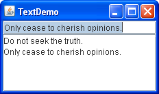
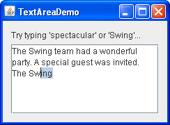

# 如何使用文本区域

> 原文： [https://docs.oracle.com/javase/tutorial/uiswing/components/textarea.html](https://docs.oracle.com/javase/tutorial/uiswing/components/textarea.html)

[`JTextArea`](https://docs.oracle.com/javase/8/docs/api/javax/swing/JTextArea.html) 类提供显示多行文本的组件，并可选择允许用户编辑文本。如果您只需要从用户那里获得一行输入，则应使用[文本字段](textfield.html)。如果希望文本区域使用多种字体或其他样式显示其文本，则应使用[编辑器窗格或文本窗格](editorpane.html)。如果显示的文本长度有限且用户从未编辑过，请使用[标签](label.html)。

许多教程的示例使用不可编辑的文本区域来显示程序输出。下面是一个名为`TextDemo`的示例图片，它允许您使用文本字段（在顶部）键入文本，然后将键入的文本附加到文本区域（下面）。



单击“启动”按钮以使用 [Java™Web Start](http://www.oracle.com/technetwork/java/javase/javawebstart/index.html) （[下载 JDK 7 或更高版本](http://www.oracle.com/technetwork/java/javase/downloads/index.html)）运行 TextDemo。或者，要自己编译并运行示例，请参考[示例索引](../examples/components/index.html#TextDemo)。

[](https://docs.oracle.com/javase/tutorialJWS/samples/uiswing/TextDemoProject/TextDemo.jnlp)

您可以在 [`TextDemo.java`](../examples/components/TextDemoProject/src/components/TextDemo.java) 中找到该程序的完整代码。以下代码创建并初始化文本区域：

```
textArea = new JTextArea(5, 20);
JScrollPane scrollPane = new JScrollPane(textArea); 
textArea.setEditable(false);

```

`JTextArea`构造器的两个参数分别是文本区域应显示的行数和列数的提示。在确定滚动窗格应该有多大时，包含文本区域的滚动窗格会注意这些提示。

如果没有创建滚动窗格，文本区域将不会自动滚动。前面代码段中显示的`JScrollPane`构造器设置了要在滚动窗格中查看的文本区域，并指定滚动窗格的滚动条应在需要时可见。如果需要更多信息，请参阅[如何使用滚动窗格](scrollpane.html)。

默认情况下，文本区域是可编辑的。代码`setEditable(false)`使文本区域不可编辑。它仍然是可选的，用户可以从中复制数据，但用户不能直接更改文本区域的内容。

以下代码将文本添加到文本区域。请注意，文本系统在内部使用'\ n'字符来表示换行符;有关详细信息，请参阅 [`DefaultEditorKit`](https://docs.oracle.com/javase/8/docs/api/javax/swing/text/DefaultEditorKit.html) 的 API 文档。

```
private final static String newline = "\n";
...
textArea.append(text + newline);

```

除非用户通过在文本区域中单击或拖动来移动插入符（插入点），否则文本区域会自动滚动以使附加文本可见。通过在调用`append`后将插入符移动到文本区域的末尾，可以强制文本区域滚动到底部：

```
textArea.setCaretPosition(textArea.getDocument().getLength());

```

您可以通过多种方式自定义文本区域。例如，虽然给定的文本区域只能以一种字体和颜色显示文本，但您可以设置它使用的字体和颜色。可以在任何组件上执行此自定义选项。您还可以确定文本区域如何包装行以及每个选项卡的字符数。最后，您可以使用`JTextArea`类从`JTextComponent`类继承的方法来设置插入符号，支持拖动或颜色选择等属性。

以下代码取自 [`TextSamplerDemo.java`](../examples/components/TextSamplerDemoProject/src/components/TextSamplerDemo.java) ，演示了如何初始化可编辑的文本区域。文本区域使用指定的斜体字体，并在单词之间包装线条。

```
JTextArea textArea = new JTextArea(
    "This is an editable JTextArea. " +
    "A text area is a \"plain\" text component, " +
    "which means that although it can display text " +
    "in any font, all of the text is in the same font."
);
textArea.setFont(new Font("Serif", Font.ITALIC, 16));
textArea.setLineWrap(true);
textArea.setWrapStyleWord(true);

```

默认情况下，文本区域不会换行显示区域太长的行。相反，它对换行符之间的所有文本使用一行 - 如果文本区域在[滚动窗格](scrollpane.html)内 - 允许自己水平滚动。此示例通过调用`setLineWrap`方法打开换行，然后调用`setWrapStyleWord`方法指示文本区域应在字边界而不是字符边界处换行。

为了提供滚动功能，该示例将文本区域放在滚动窗格中。

```
JScrollPane areaScrollPane = new JScrollPane(textArea);
areaScrollPane.setVerticalScrollBarPolicy(
                JScrollPane.VERTICAL_SCROLLBAR_ALWAYS);
areaScrollPane.setPreferredSize(new Dimension(250, 250));

```

您可能已经注意到此示例中使用的`JTextArea`构造器未指定行数或列数。相反，代码通过设置滚动窗格的首选大小来限制文本区域的大小。

`TextAreaDemo`示例引入了一个具有特殊功能的可编辑文本区域 - 单词完成功能。当用户输入单词时，只要程序的词汇表包含以键入内容开头的单词，程序就会建议完成单词的提示。这是`TextAreaDemo`应用程序的图片。



单击“启动”按钮以使用 [Java™Web Start](http://www.oracle.com/technetwork/java/javase/javawebstart/index.html) （[下载 JDK 7 或更高版本](http://www.oracle.com/technetwork/java/javase/downloads/index.html)）运行 TextAreaDemo。或者，要自己编译并运行示例，请参考[示例索引](../examples/components/index.html#TextAreaDemo)。

[](https://docs.oracle.com/javase/tutorialJWS/samples/uiswing/TextAreaDemoProject/TextAreaDemo.jnlp)

您可以在 [`TextAreaDemo.java`](../examples/components/TextAreaDemoProject/src/components/TextAreaDemo.java) 中找到该程序的完整代码。

此示例使用默认滚动条策略为文本区域提供滚动容量。默认情况下，仅当显示区域完全填充文本且没有空间添加新单词时，才会显示垂直滚动条。您可以使用以下代码提供此类型的滚动窗格：

```
  textArea.setWrapStyleWord(true);
  jScrollPane1 = new JScrollPane(textArea);

```

如上所述，文本区域是可编辑的。您可以通过键入和粘贴文本，或删除文本的某些部分或整个内容来播放文本区域。还可以尝试使用标准键绑定来编辑文本区域中的文本。

现在探讨如何实现单词完成功能。输入“Swing”或“special”之类的单词。只要输入“sw”，程序就会以浅蓝色突出显示可能的完成情况。按 Enter 键接受完成或继续键入。

以下代码将文档监听器添加到文本区域的文档中：

```
  textArea.getDocument().addDocumentListener(this);

```

当您开始键入单词时，`insertUpdate`方法会检查程序的词汇表是否包含键入的前缀。找到前缀的完成后，对`invokeLater`方法的调用将提交稍后更改文档的任务。请务必记住，您无法在文档事件通知中修改文档，否则您将获得异常。检查下面的代码。

```
String prefix = content.substring(w + 1).toLowerCase();
int n = Collections.binarySearch(words, prefix);
if (n < 0 && -n <= words.size()) {
    String match = words.get(-n - 1);
    if (match.startsWith(prefix)) {
        // A completion is found
        String completion = match.substring(pos - w);
        // We cannot modify Document from within notification,
        // so we submit a task that does the change later
        SwingUtilities.invokeLater(
            new CompletionTask(completion, pos + 1));
    }
} else {
    // Nothing found
    mode = Mode.INSERT;
}

```

以粗体显示的代码说明了如何创建选择。插入符号首先设置为完整单词的结尾，然后移回到输入最后一个字符后的位置。 `moveCaretPosition`方法不仅将插入符移动到新位置，还选择两个位置之间的文本。使用以下代码实现完成任务：

```
  private class CompletionTask implements Runnable {
        String completion;
        int position;

        CompletionTask(String completion, int position) {
            this.completion = completion;
            this.position = position;
        }

        public void run() {
            textArea.insert(completion, position);
            textArea.setCaretPosition(position + completion.length());
            textArea.moveCaretPosition(position);
            mode = Mode.COMPLETION;
        }
    }

```

下表列出了常用的`JTextArea`构造器和方法。您可能调用的其他方法在`JTextComponent`中定义，并在[文本组件 API](textapi.html) 中列出。

您也可以在文本区域上调用它从其他祖先继承的方法，例如`setPreferredSize`，`setForeground`，`setBackground`，`setFont`等。有关常用继承方法的表，请参见 [JComponent 类](jcomponent.html)。

使用文本区域的 API 包括以下类别：

*   [设置或获取内容](#contents)
*   [微调外观](#looks)
*   [实现功能](#function)


| 方法或构造器 | 目的 |
| --- | --- |
| [JTextArea（）](https://docs.oracle.com/javase/8/docs/api/javax/swing/JTextArea.html#JTextArea--)
[JTextArea（String）](https://docs.oracle.com/javase/8/docs/api/javax/swing/JTextArea.html#JTextArea-java.lang.String-)
[JTextArea（String，int，int）](https://docs.oracle.com/javase/8/docs/api/javax/swing/JTextArea.html#JTextArea-java.lang.String-int-int-)
[JTextArea（int，int ）](https://docs.oracle.com/javase/8/docs/api/javax/swing/JTextArea.html#JTextArea-int-int-) | 创建文本区域。如果存在，`String`参数包含初始文本。 `int`参数分别指定列中所需的宽度和行中的高度。 |
| [void setText（String）](https://docs.oracle.com/javase/8/docs/api/javax/swing/text/JTextComponent.html#setText-java.lang.String-)
[String getText（）](https://docs.oracle.com/javase/8/docs/api/javax/swing/text/JTextComponent.html#getText--)
_（在`JTextComponent`中定义）_ | 设置或获取文本区域显示的文本。 |


| 方法 | 目的 |
| --- | --- |
| [void setEditable（boolean）](https://docs.oracle.com/javase/8/docs/api/javax/swing/text/JTextComponent.html#setEditable-boolean-)
[boolean isEditable（）](https://docs.oracle.com/javase/8/docs/api/javax/swing/text/JTextComponent.html#isEditable--)
_（在`JTextComponent`中定义）_ | 设置或指示用户是否可以编辑文本区域中的文本。 |
| [void setColumns（int）;](https://docs.oracle.com/javase/8/docs/api/javax/swing/JTextArea.html#setColumns-int-)
[int getColumns（）](https://docs.oracle.com/javase/8/docs/api/javax/swing/JTextArea.html#getColumns--) | 设置或获取文本区域显示的列数。这实际上只是计算区域首选宽度的一个提示。 |
| [void setRows（int）;](https://docs.oracle.com/javase/8/docs/api/javax/swing/JTextArea.html#setRows-int-)
[int getRows（）](https://docs.oracle.com/javase/8/docs/api/javax/swing/JTextArea.html#getRows--) | 设置或获取文本区域显示的行数。这是计算该区域首选高度的提示。 |
| [int setTabSize（int）](https://docs.oracle.com/javase/8/docs/api/javax/swing/JTextArea.html#setTabSize-int-) | 设置制表符等效的字符数。 |
| [int setLineWrap（boolean）](https://docs.oracle.com/javase/8/docs/api/javax/swing/JTextArea.html#setLineWrap-boolean-) | 设置是否包含行太长以至于不适合分配的宽度。默认情况下，此属性为 false，并且不包装行。 |
| [int setWrapStyleWord（boolean）](https://docs.oracle.com/javase/8/docs/api/javax/swing/JTextArea.html#setWrapStyleWord-boolean-) | 设置是否可以在白色空间（单词边界）或任何字符处包装行。默认情况下，此属性为 false，并且可以在任何字符处包装行（如果打开换行）。 |


| 方法 | 目的 |
| --- | --- |
| [void selectAll（）](https://docs.oracle.com/javase/8/docs/api/javax/swing/text/JTextComponent.html#selectAll--)
_（在`JTextComponent`中定义）_ | 选择文本区域中的所有字符。 |
| [void append（String）](https://docs.oracle.com/javase/8/docs/api/javax/swing/JTextArea.html#append-java.lang.String-) | 将指定的文本添加到文本区域的末尾。 |
| [void insert（String，int）](https://docs.oracle.com/javase/8/docs/api/javax/swing/JTextArea.html#insert-java.lang.String-int-) | 在指定位置插入指定的文本。 |
| [void replaceRange（String，int，int）](https://docs.oracle.com/javase/8/docs/api/javax/swing/JTextArea.html#replaceRange-java.lang.String-int-int-) | 用指定的字符串替换指示位置之间的文本。 |
| [int getLineCount（）](https://docs.oracle.com/javase/8/docs/api/javax/swing/JTextArea.html#getLineCount--)
[int getLineOfOffset（int）](https://docs.oracle.com/javase/8/docs/api/javax/swing/JTextArea.html#getLineOfOffset-int-)
[int getLineStartOffset（int）](https://docs.oracle.com/javase/8/docs/api/javax/swing/JTextArea.html#getLineStartOffset-int-)
[int getLineEndOffset（int）](https://docs.oracle.com/javase/8/docs/api/javax/swing/JTextArea.html#getLineEndOffset-int-) | 用于查找行号或指定行开头或结尾位置的实用程序。 |

此表列出了使用文本区域的示例，并指出了描述这些示例的位置。

| 例 | 在哪里描述 | 笔记 |
| :-- | :-- | :-- |
| [TextDemo](../examples/components/index.html#TextDemo) | 这个部分 | 将用户输入的文本附加到文本区域的应用程序。 |
| [TextAreaDemo](../examples/components/index.html#TextAreaDemo) | 这个部分 | 具有带单词完成功能的文本区域的应用程序。 |
| [TextSamplerDemo](../examples/components/index.html#TextSamplerDemo) | [使用文本组件](text.html) | 使用每个 Swing 文本组件之一。 |
| [HtmlDemo](../examples/components/index.html#HtmlDemo) | [如何在 Swing 组件中使用 HTML](html.html) | 一个文本区域，使用户能够键入要在标签中显示的 HTML 代码。 |
| [BasicDnD](../examples/dnd/index.html#BasicDnD) | [DnD 简介](../dnd/intro.html) | 演示几个 Swing 组件的内置拖放功能，包括文本区域。 |
| [FocusConceptsDemo](../examples/misc/index.html#FocusConceptsDemo) | [如何使用焦点子系统](../misc/focus.html) | 使用包含文本区域的一些组件演示焦点的工作原理。 |