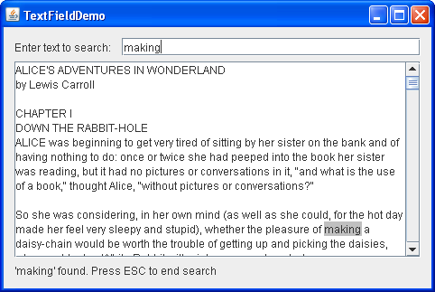

# 如何使用文本字段

> 原文： [https://docs.oracle.com/javase/tutorial/uiswing/components/textfield.html](https://docs.oracle.com/javase/tutorial/uiswing/components/textfield.html)

文本字段是一种基本文本控件，使用户可以键入少量文本。当用户指示文本输入完成时（通常按 Enter 键），文本字段将触发[动作事件](../events/actionlistener.html)。如果您需要从用户获得多行输入，请使用[文本区域](textarea.html)。

| [`JTextField`](https://docs.oracle.com/javase/8/docs/api/javax/swing/JTextField.html) | 本节内容包括：基本文本字段。 |
| `JFormattedTextField` | 一个`JTextField`子类，允许您指定用户可以输入的合法字符集。请参见[如何使用格式化文本字段](formattedtextfield.html)。 |
| `JPasswordField` | 一个`JTextField`子类，不显示用户键入的字符。参见[如何使用密码字段](passwordfield.html)。 |
| `JComboBox` | 可以编辑，并提供可供选择的字符串菜单。参见[如何使用组合框](combobox.html)。 |
| `JSpinner` | 将带格式的文本字段与几个小按钮组合在一起，使用户可以选择上一个或下一个可用值。参见[如何使用旋转器](spinner.html)。 |

以下示例显示基本文本字段和文本区域。文本字段是可编辑的。文本区域不可编辑。当用户在文本字段中按 Enter 键时，程序将文本字段的内容复制到文本区域，然后选择文本字段中的所有文本。


单击“启动”按钮以使用 [Java™Web Start](http://www.oracle.com/technetwork/java/javase/javawebstart/index.html) （[下载 JDK 7 或更高版本](http://www.oracle.com/technetwork/java/javase/downloads/index.html)）运行 TextDemo。或者，要自己编译并运行示例，请参考[示例索引](../examples/components/index.html#TextDemo)。

[](https://docs.oracle.com/javase/tutorialJWS/samples/uiswing/TextDemoProject/TextDemo.jnlp)

您可以在 [`TextDemo.java`](../examples/components/TextDemoProject/src/components/TextDemo.java) 中找到该程序的完整代码。以下代码创建并设置文本字段：

```
textField = new JTextField(20);

```

传递给`JTextField`构造函数的整数参数，示例中的`20`表示字段中的列数。此数字与字段当前字体提供的度量一起使用，以计算字段的首选宽度。它不限制用户可以输入的字符数。为此，您可以使用[格式的文本字段](formattedtextfield.html)或文档侦听器，如[文本组件功能](generaltext.html)中所述。

* * *

**Note:** 

我们建议您为每个文本字段指定列数。如果未指定列数或首选大小，则只要文本更改，字段的首选大小就会更改，这可能会导致不必要的布局更新。

* * *

下一行代码将`TextDemo`对象注册为文本字段的动作侦听器。

```
textField.addActionListener(this);

```

`actionPerformed`方法处理文本字段中的动作事件：

```
private final static String newline = "\n";
...
public void actionPerformed(ActionEvent evt) {
    String text = textField.getText();
    textArea.append(text + newline);
    textField.selectAll();
}

```

注意使用`JTextField`的`getText`方法来检索文本字段当前包含的文本。此方法返回的文本 _ 而不是 _ 包含触发操作事件的 Enter 键的换行符。

您已经了解了如何使用基本文本字段。因为`JTextField`类继承自`JTextComponent`类，所以文本字段非常灵活，几乎可以按照您喜欢的方式进行自定义。例如，您可以添加文档侦听器或文档过滤器以在文本更改时收到通知，并且在过滤器情况下，您可以相应地修改文本字段。有关文本组件的信息可在[文本组件功能](generaltext.html)中找到。但是，在自定义`JTextField`之前，请确保基于文本字段的其他[组件之一不会为您完成此任务。](#varieties)

通常，文本字段与描述文本字段的标签配对。有关创建这些对的指示，请参见[使用文本字段](#eg)的示例。

`TextFieldDemo`示例引入了文本字段和文本区域。您可以在 [`TextFieldDemo.java`](../examples/components/TextFieldDemoProject/src/components/TextFieldDemo.java) 中找到该程序的完整代码。

当您在文本字段中键入字符时，程序将在文本区域中搜索键入的文本。如果找到该条目，则会突出显示该条目。如果程序找不到该条目，则文本字段的背景变为粉红色。文本区域下方的状态栏显示是否找到文本的消息。 Escape 键用于开始新搜索或完成当​​前搜索。这是`TextFieldDemo`应用程序的图片。



单击启动按钮运行 TextFieldDemo，使用 [Java™Web Start](http://www.oracle.com/technetwork/java/javase/javawebstart/index.html) （[下载 JDK 7 或更高版本](http://www.oracle.com/technetwork/java/javase/downloads/index.html)）。或者，要自己编译并运行示例，请参考[示例索引](../examples/components/index.html#TextFieldDemo)。

[](https://docs.oracle.com/javase/tutorialJWS/samples/uiswing/TextFieldDemoProject/TextFieldDemo.jnlp)

为突出显示文本，此示例使用荧光笔和画家。下面的代码创建并设置文本区域的荧光笔和画家。

```
final Highlighter hilit;
final Highlighter.HighlightPainter painter;
...
hilit = new DefaultHighlighter();
painter = new DefaultHighlighter.DefaultHighlightPainter(HILIT_COLOR);
textArea.setHighlighter(hilit);

```

此代码将文档侦听器添加到文本字段的文档中。

```
entry.getDocument().addDocumentListener(this);

```

文档侦听器的`insertUpdate`和`removeUpdate`方法调用`search`方法，该方法不仅在文本区域中执行搜索，还处理突出显示。以下代码突出显示找到的文本，将插入符号设置为找到的匹配项的末尾，设置文本字段的默认背景，并在状态栏中显示消息。

```
hilit.addHighlight(index, end, painter);
textArea.setCaretPosition(end);
entry.setBackground(entryBg);
message("'" + s + "' found. Press ESC to end search");

```

状态栏是`JLabel`对象。下面的代码显示了如何实现`message`方法。

```
private JLabel status;
...
void message(String msg) {
    status.setText(msg);
}

```

如果文本区域中没有匹配项，则以下代码将文本字段的背景更改为粉红色并显示正确的信息消息。

```
entry.setBackground(ERROR_COLOR);
message("'" + s + "' not found. Press ESC to start a new search");

```

`CancelAction`类负责处理 Escape 键，如下所示。

```
   class CancelAction extends AbstractAction {
       public void actionPerformed(ActionEvent ev) {
               hilit.removeAllHighlights();
               entry.setText("");
               entry.setBackground(entryBg);
           }
   }

```

下表列出了常用的`JTextField`构造函数和方法。您可能调用的其他方法在`JTextComponent`类中定义。请参阅[文本组件 API](textapi.html) 。

您也可以在从文本字段的其他祖先继承的文本字段上调用方法，例如`setPreferredSize`，`setForeground`，`setBackground`，`setFont`等。有关常用继承方法的表，请参见 [JComponent 类](jcomponent.html)。

使用文本字段的 API 属于以下类别：

*   [设置或获取字段的内容](#contents)
*   [微调场的外观](#looks)
*   [实现 Field 的功能](#function)


| 方法或构造函数 | 目的 |
| --- | --- |
| [JTextField（）](https://docs.oracle.com/javase/8/docs/api/javax/swing/JTextField.html#JTextField--)
[JTextField（String）](https://docs.oracle.com/javase/8/docs/api/javax/swing/JTextField.html#JTextField-java.lang.String-)
[JTextField（String，int）](https://docs.oracle.com/javase/8/docs/api/javax/swing/JTextField.html#JTextField-java.lang.String-int-)
[JTextField（int）](https://docs.oracle.com/javase/8/docs/api/javax/swing/JTextField.html#JTextField-int-) | 创建一个文本字段。如果存在，`int`参数指定列中所需的宽度。 `String`参数包含字段的初始文本。 |
| [void setText（String）](https://docs.oracle.com/javase/8/docs/api/javax/swing/text/JTextComponent.html#setText-java.lang.String-)
[String getText（）](https://docs.oracle.com/javase/8/docs/api/javax/swing/text/JTextComponent.html#getText--)
_（在`JTextComponent`中定义）_ | 设置或获取文本字段显示的文本。 |


| 方法 | 目的 |
| --- | --- |
| [void setEditable（boolean）](https://docs.oracle.com/javase/8/docs/api/javax/swing/text/JTextComponent.html#setEditable-boolean-)
[boolean isEditable（）](https://docs.oracle.com/javase/8/docs/api/javax/swing/text/JTextComponent.html#isEditable--)
_（在`JTextComponent`中定义）_ | 设置或指示用户是否可以编辑文本字段中的文本。 |
| [void setColumns（int）;](https://docs.oracle.com/javase/8/docs/api/javax/swing/JTextField.html#setColumns-int-)
[int getColumns（）](https://docs.oracle.com/javase/8/docs/api/javax/swing/JTextField.html#getColumns--) | 设置或获取文本字段显示的列数。这实际上只是计算字段首选宽度的一个提示。 |
| [void setHorizo​​ntalAlignment（int）;](https://docs.oracle.com/javase/8/docs/api/javax/swing/JTextField.html#setHorizontalAlignment-int-)
[int getHorizo​​ntalAlignment（）](https://docs.oracle.com/javase/8/docs/api/javax/swing/JTextField.html#getHorizontalAlignment--) | 设置或获取文本在其区域内水平对齐的方式。您可以使用`JTextField.LEADING`，`JTextField.CENTER`和`JTextField.TRAILING`作为参数。 |


| 方法 | 目的 |
| --- | --- |
| [void addActionListener（ActionListener）](https://docs.oracle.com/javase/8/docs/api/javax/swing/JTextField.html#addActionListener-java.awt.event.ActionListener-)
[void removeActionListener（ActionListener）](https://docs.oracle.com/javase/8/docs/api/javax/swing/JTextField.html#removeActionListener-java.awt.event.ActionListener-) | 添加或删除动作侦听器。 |
| [void selectAll（）](https://docs.oracle.com/javase/8/docs/api/javax/swing/text/JTextComponent.html#selectAll--)
_（在`JTextComponent`中定义）_ | 选择文本字段中的所有字符。 |

此表显示了一些使用文本字段的示例，并指出了描述这些示例的位置。有关各种文本字段（如处理布局）的代码示例，请查看相关组件的示例列表，例如[格式的文本字段](formattedtextfield.html#eg)和[微调器](spinner.html#eg)。

| 例 | 在哪里描述 | 笔记 |
| :-- | :-- | :-- |
| [TextDemo](../examples/components/index.html#TextDemo) | 这个部分 | 将基本文本字段与动作侦听器一起使用的应用程序。 |
| [TextFieldDemo](../examples/components/index.html#TextFieldDemo) | 这个部分 | 使用文本字段和文本区域的应用程序。在文本区域中进行搜索以从文本字段中查找条目。 |
| [DialogDemo](../examples/components/index.html#DialogDemo) | [如何制作对话](dialog.html) | `CustomDialog.java`包括其值被检查的文本字段。您可以通过单击“更多对话框”选项卡，选择“输入验证”对话框选项，然后单击“显示”来调出对话框！按钮。 |
| [TextSamplerDemo](../examples/components/index.html#TextSamplerDemo) | [使用文本组件](text.html) | 使用`GridBagLayout`和便捷方法布置标签文本字段对：

```
 addLabelTextRows（JLabel [] 标签，JTextField [] textFields ，GridBagLayout  ]格子袋，容器容器）
```

 |
| [TextInputDemo](../examples/components/index.html#TextInputDemo) | [如何使用格式化文本字段](formattedtextfield.html) | 使用`SpringLayout`和`SpringUtilities`便捷方法布置标签文本字段对：

```
 makeCompactGrid（容器父，int 行，int cols ，int initialX ，int initialY ，int xPad ，int yPad ）
```

 |

如果您使用 JavaFX 进行编程，请参阅[文本字段](https://docs.oracle.com/javase/8/javafx/user-interface-tutorial/text-field.htm)。