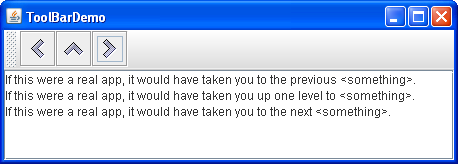
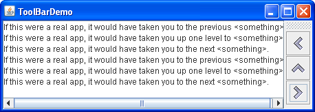
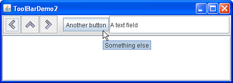

# 如何使用工具栏

> 原文： [https://docs.oracle.com/javase/tutorial/uiswing/components/toolbar.html](https://docs.oracle.com/javase/tutorial/uiswing/components/toolbar.html)

[`JToolBar`](https://docs.oracle.com/javase/8/docs/api/javax/swing/JToolBar.html) 是一个容器，它将几个组件 - 通常是[按钮](button.html)与图标 - 组合成一行或一列。通常，工具栏可以轻松访问[菜单](menu.html)中的功能。 [如何使用动作](../misc/action.html)描述了如何在菜单项和工具栏按钮中提供相同的功能。

以下图像显示名为`ToolBarDemo`的应用程序，其中包含文本区域上方的工具栏。单击“启动”按钮以使用 [Java™Web Start](http://www.oracle.com/technetwork/java/javase/javawebstart/index.html) （[下载 JDK 7 或更高版本](http://www.oracle.com/technetwork/java/javase/downloads/index.html)）运行 ToolBarDemo。或者，要自己编译并运行它，请参考[示例索引](../examples/components/index.html#ToolBarDemo)。

[](https://docs.oracle.com/javase/tutorialJWS/samples/uiswing/ToolBarDemoProject/ToolBarDemo.jnlp)

<center></center>

默认情况下，用户可以将工具栏拖动到其容器的另一边，或者拖到自己的窗口中。下图显示了用户将工具栏拖动到其容器的右边缘后应用程序的外观。

<center></center>

要使拖动行为正常工作，工具栏必须位于使用 [`BorderLayout`](../layout/border.html) 布局管理器的容器中。工具栏影响的组件通常位于容器的中心。工具栏必须是容器中唯一的其他组件，并且不得位于中心。

下图显示了用户在其窗口外拖动工具栏后应用程序的外观。

<center></center>

以下代码创建工具栏并将其添加到容器中。您可以在 [`ToolBarDemo.java`](../examples/components/ToolBarDemoProject/src/components/ToolBarDemo.java) 中找到整个程序。

```
public class ToolBarDemo extends JPanel
                         implements ActionListener {
    ...
    public ToolBarDemo() {
        super(new BorderLayout());
        ...
        JToolBar toolBar = new JToolBar("Still draggable");
        addButtons(toolBar);
        ...
        setPreferredSize(new Dimension(450, 130));
        add(toolBar, BorderLayout.PAGE_START);
        add(scrollPane, BorderLayout.CENTER);
    }
    ...
}

```

此代码将工具栏放置在滚动窗格上方，方法是将两个组件放在由边框布局控制的面板中，工具栏位于`PAGE_START`位置，滚动窗格位于`CENTER`位置。由于滚动窗格位于中心，并且除工具栏之外没有其他组件位于容器中，因此默认情况下可以将工具栏拖动到容器的其他边缘。工具栏也可以拖出到自己的窗口中，在这种情况下，窗口的标题为“Still draggable”，由`JToolBar`构造函数指定。

工具栏中的按钮是普通的`JButton`实例，它们使用来自 Java 外观和感觉图形存储库的图像。如果您的工具栏具有 Java 外观，请使用 [Java 外观图形库](http://www.oracle.com/technetwork/java/index-138612.html)中的图像。

以下是创建按钮并将其添加到工具栏的代码。

```
protected void addButtons(JToolBar toolBar) {
    JButton button = null;

    //first button
    button = makeNavigationButton("Back24", PREVIOUS,
                                  "Back to previous something-or-other",
                                  "Previous");
    toolBar.add(button);

    //second button
    button = makeNavigationButton("Up24", UP,
                                  "Up to something-or-other",
                                  "Up");
    toolBar.add(button);

    ...//similar code for creating and adding the third button...
}

protected JButton makeNavigationButton(String imageName,
                                       String actionCommand,
                                       String toolTipText,
                                       String altText) {
    //Look for the image.
    String imgLocation = "images/"
                         + imageName
                         + ".gif";
    URL imageURL = ToolBarDemo.class.getResource(imgLocation);

    //Create and initialize the button.
    JButton button = new JButton();
    button.setActionCommand(actionCommand);
    button.setToolTipText(toolTipText);
    button.addActionListener(this);

    if (imageURL != null) {                      //image found
        button.setIcon(new ImageIcon(imageURL, altText));
    } else {                                     //no image found
        button.setText(altText);
        System.err.println("Resource not found: " + imgLocation);
    }

    return button;
}

```

第一次调用`makeNavigationButton`会使用图形库中的 24x24“Back”导航图像为第一个按钮创建图像。

除了查找按钮的图像外，`makeNavigationButton`方法还会创建按钮，为其动作命令和工具提示文本设置字符串，并为按钮添加动作侦听器。如果图像丢失，该方法将输出错误消息并向按钮添加文本，以便按钮仍然可用。

* * *

**Note:** 

如果工具栏中的任何按钮复制了其他组件的功能，例如菜单项，则应该按照[如何使用操作](../misc/action.html)中的说明创建和添加工具栏按钮。

* * *

通过在前面的示例中添加几行代码，我们可以演示更多工具栏功能：

*   使用`setFloatable(false)`使工具栏不可移动。
*   当用户使用光标越过工具栏按钮时，使用`setRollover(true)`可视地指示工具栏按钮。
*   将分隔符添加到工具栏。
*   将非按钮组件添加到工具栏。

您可以通过运行 ToolBarDemo2 来查看这些功能。单击“启动”按钮以使用 [Java™Web Start](http://www.oracle.com/technetwork/java/javase/javawebstart/index.html) （[下载 JDK 7 或更高版本](http://www.oracle.com/technetwork/java/javase/downloads/index.html)）运行 ToolBarDemo2。或者，要自己编译并运行它，请参考[示例索引](../examples/components/index.html#ToolBarDemo2)。

[](https://docs.oracle.com/javase/tutorialJWS/samples/uiswing/ToolBarDemo2Project/ToolBarDemo2.jnlp)

您可以在 [`ToolBarDemo2.java`](../examples/components/ToolBarDemo2Project/src/components/ToolBarDemo2.java) 中找到该程序的完整代码。您可以在下面看到使用这些自定义功能的新 UI 图片。

<center></center>

由于工具栏无法再拖动，因此其左边缘不再有凸起。这是关闭拖动的代码：

```
toolBar.setFloatable(false);

```

工具栏处于翻转模式，因此光标下的按钮具有可视指示器。视觉指示器的类型取决于外观和感觉。例如，Metal 外观使用渐变效果来指示光标下的按钮，而其他类型的外观则使用边框来实现此目的。以下是设置翻转模式的代码：

```
toolBar.setRollover(true);

```

上例中的另一个明显区别是工具栏包含两个新组件，前面有一个名为[分隔符](separator.html)的空格。以下是添加分隔符的代码：

```
toolBar.addSeparator();

```

以下是添加新组件的代码：

```
//fourth button
button = new JButton("Another button");
...
toolBar.add(button);

//fifth component is NOT a button!
JTextField textField = new JTextField("A text field");
...
toolBar.add(textField);

```

通过调用`setAlignmentY`方法，可以轻松地使工具栏组件顶部对齐或底部对齐，而不是居中。例如，要对齐工具栏中所有组件的顶部，请在每个组件上调用`setAlignmentY(TOP_ALIGNMENT)`。同样，您可以使用`setAlignmentX`方法在工具栏垂直时指定组件的对齐方式。这种布局灵活性是可能的，因为工具栏使用`BoxLayout`来定位它们的组件。有关更多信息，请参阅[如何使用 BoxLayout](../layout/box.html) 。

下表列出了常用的 [`JToolBar`](https://docs.oracle.com/javase/8/docs/api/javax/swing/JToolBar.html) 构造函数和方法。您可能调用的其他方法列在 [JComponent 类](jcomponent.html)的 API 表中。

| 方法或构造函数 | 目的 |
| --- | --- |
| [JToolBar（）](https://docs.oracle.com/javase/8/docs/api/javax/swing/JToolBar.html#JToolBar--)
[JToolBar（int）](https://docs.oracle.com/javase/8/docs/api/javax/swing/JToolBar.html#JToolBar-int-)
[JToolBar（String）](https://docs.oracle.com/javase/8/docs/api/javax/swing/JToolBar.html#JToolBar-java.lang.String-)
[JToolBar（String，int）](https://docs.oracle.com/javase/8/docs/api/javax/swing/JToolBar.html#JToolBar-java.lang.String-int-) | 创建工具栏。可选的 int 参数允许您指定方向;默认值为`HORIZONTAL`。可选的`String`参数允许您指定工具栏窗口的标题，如果它被拖动到其容器之外。 |
| [组件添加（组件）](https://docs.oracle.com/javase/8/docs/api/java/awt/Container.html#add-java.awt.Component-) | Adds a component to the tool bar.您可以使用`AbstractButton`定义的`setAction(Action)`方法将按钮与`Action`关联。 |
| [void addSeparator（）](https://docs.oracle.com/javase/8/docs/api/javax/swing/JToolBar.html#addSeparator--) | 在工具栏的末尾添加一个分隔符。 |
| [void setFloatable（boolean）](https://docs.oracle.com/javase/8/docs/api/javax/swing/JToolBar.html#setFloatable-boolean-)
[boolean isFloatable（）](https://docs.oracle.com/javase/8/docs/api/javax/swing/JToolBar.html#isFloatable--) | 默认情况下，floatable 属性为 true，表示用户可以将工具栏拖到单独的窗口中。要关闭工具栏拖动，请使用`toolBar.setFloatable(false)`。某些类型的外观可能会忽略此属性。 |
| [void setRollover（boolean）](https://docs.oracle.com/javase/8/docs/api/javax/swing/JToolBar.html#setRollover-boolean-)
[boolean isRollover（）](https://docs.oracle.com/javase/8/docs/api/javax/swing/JToolBar.html#isRollover--) | 默认情况下，rollover 属性为 false。要在用户使用光标移过工具栏按钮时，可以直观地指示工具栏按钮，请将此属性设置为 true。某些类型的外观可能会忽略此属性。 |

此表列出了使用`JToolBar`的示例，并指出了描述这些示例的位置。

| 例 | 在哪里描述 | 笔记 |
| :-- | :-- | :-- |
| [`ToolBarDemo`](../examples/components/index.html#ToolBarDemo) | 这一页 | 带有图标按钮的基本工具栏。 |
| [`ToolBarDemo2`](../examples/components/index.html#ToolBarDemo2) | 这一页 | 演示翻转模式下的不可浮动工具栏，其中包含分隔符和非按钮组件。 |
| [`ActionDemo`](../examples/misc/index.html#ActionDemo) | [如何使用行动](../misc/action.html) | 使用`Action`对象实现工具栏。 |