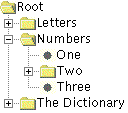
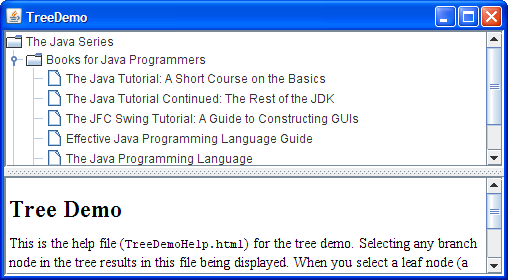
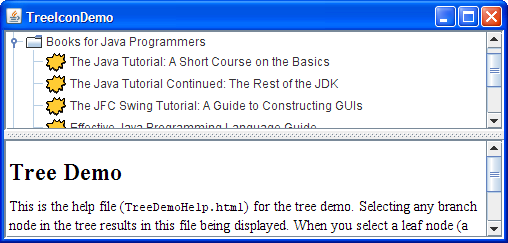
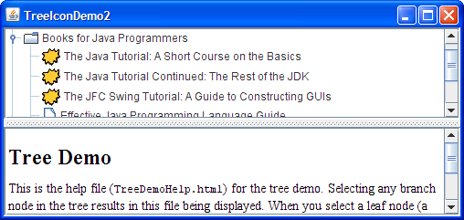
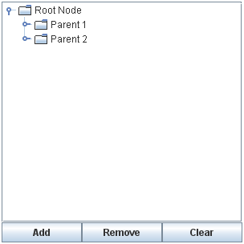
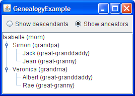

# 如何使用树木

> 原文： [https://docs.oracle.com/javase/tutorial/uiswing/components/tree.html](https://docs.oracle.com/javase/tutorial/uiswing/components/tree.html)

使用 [`JTree`](https://docs.oracle.com/javase/8/docs/api/javax/swing/JTree.html) 类，可以显示分层数据。 `JTree`对象实际上不包含您的数据;它只是提供数据视图。与任何非平凡的 Swing 组件一样，树通过查询其数据模型来获取数据。这是一张树的图片：



如上图所示，`JTree`垂直显示其数据。树显示的每一行只包含一项数据，称为 _ 节点 _。每棵树都有一个 _ 根 _ 节点，所有节点都从该节点下降。默认情况下，树显示根节点，但您可以另行决定。节点可以有子节点。我们指的是可以生孩子的节点 - 无论他们当前 _ 是否有 _ 孩子 - 作为 _ 分支 _ 节点。不能生孩子的节点是 _leaf_ 节点。

分支节点可以包含任意数量的子节点。通常，用户可以通过单击来展开和折叠分支节点 - 使其子项可见或不可见。默认情况下，除根节点以外的所有分支节点都会开始折叠。程序可以通过监听树扩展或树将扩展事件来检测分支节点的扩展状态的变化，如[如何编写树扩展监听器](../events/treeexpansionlistener.html)和[如何写树 - Will-Expand Listener](../events/treewillexpandlistener.html) 。

树中的特定节点可以通过 TreePath，封装节点及其所有祖先的对象，或通过其显示行来标识，其中显示区域中的每一行显示一个节点。

*   展开的节点是非叶节点，在展开其所有祖先时将显示其子节点。
*   折叠节点是隐藏它们的节点。
*   隐藏节点是折叠祖先下的节点。

本节的其余部分讨论以下主题：

*   [创建树](#create)
*   [响应节点选择](#select)
*   [自定义树的显示](#display)
*   [动态更改树](#dynamic)
*   [创建数据模型](#data)
*   [树 API](#api)
*   [使用树木的例子](#eg)

这是一个应用程序的图片，其上半部分在滚动窗格中显示一棵树。



* * *

**Try this:** 

1.  Click the Launch button to run the Tree Demo using [Java™ Web Start](http://www.oracle.com/technetwork/java/javase/javawebstart/index.html) ([download JDK 7 or later](http://www.oracle.com/technetwork/java/javase/downloads/index.html)). Alternatively, to compile and run the example yourself, consult the [example index](../examples/components/index.html#TreeDemo).[](https://docs.oracle.com/javase/tutorialJWS/samples/uiswing/TreeDemoProject/TreeDemo.jnlp)

2.  展开一个或多个节点。
    您可以通过单击项目左侧的圆圈来完成此操作。
3.  折叠节点。
    您可以通过单击展开节点左侧的圆圈来执行此操作。

* * *

以下代码取自 [`TreeDemo.java`](../examples/components/TreeDemoProject/src/components/TreeDemo.java) ，创建`JTree`对象并将其放在滚动窗格中：

```
//Where instance variables are declared:
private JTree tree;
...
public TreeDemo() {
    ...
    DefaultMutableTreeNode top =
        new DefaultMutableTreeNode("The Java Series");
    createNodes(top);
    tree = new JTree(top);
    ...
    JScrollPane treeView = new JScrollPane(tree);
    ...
}

```

代码创建 [`DefaultMutableTreeNode`](https://docs.oracle.com/javase/8/docs/api/javax/swing/tree/DefaultMutableTreeNode.html) 的实例作为树的根节点。然后它创建树中的其余节点。之后，它创建树，将根节点指定为`JTree`构造器的参数。最后，它将树放在滚动窗格中，这是一种常见的策略，因为显示完整的扩展树将需要太多空间。

以下是在根节点下创建节点的代码：

```
private void createNodes(DefaultMutableTreeNode top) {
    DefaultMutableTreeNode category = null;
    DefaultMutableTreeNode book = null;

    category = new DefaultMutableTreeNode("Books for Java Programmers");
    top.add(category);

    //original Tutorial
    book = new DefaultMutableTreeNode(new BookInfo
        ("The Java Tutorial: A Short Course on the Basics",
        "tutorial.html"));
    category.add(book);

    //Tutorial Continued
    book = new DefaultMutableTreeNode(new BookInfo
        ("The Java Tutorial Continued: The Rest of the JDK",
        "tutorialcont.html"));
    category.add(book);

    //Swing Tutorial
    book = new DefaultMutableTreeNode(new BookInfo
        ("The Swing Tutorial: A Guide to Constructing GUIs",
        "swingtutorial.html"));
    category.add(book);

    //...add more books for programmers...

    category = new DefaultMutableTreeNode("Books for Java Implementers");
    top.add(category);

    //VM
    book = new DefaultMutableTreeNode(new BookInfo
        ("The Java Virtual Machine Specification",
         "vm.html"));
    category.add(book);

    //Language Spec
    book = new DefaultMutableTreeNode(new BookInfo
        ("The Java Language Specification",
         "jls.html"));
    category.add(book);
}

```

`DefaultMutableTreeNode`构造器的参数是 _ 用户对象 _，它是包含或指向与树节点关联的数据的对象。用户对象可以是字符串，也可以是自定义对象。如果实现自定义对象，则应实现其`toString`方法，以便返回要为该节点显示的字符串。默认情况下，JTree 使用从 toString 返回的值呈现每个节点，因此`toString`返回有意义的内容非常重要。有时，覆盖`toString`是不可行的;在这种情况下，您可以覆盖 JTree 的 convertValueToText，以将模型中的对象映射到显示的字符串中。

例如，前面的代码片段中使用的`BookInfo`类是一个包含两个数据的自定义类：书的名称，以及描述该书的 HTML 文件的 URL。实现`toString`方法以返回书名。因此，与`BookInfo`对象相关联的每个节点显示书名。

* * *

**Note:** You can specify text formatting in a tree node by putting HTML tags in the string for the node. See [Using HTML in Swing Components](html.html) for details.

* * *

总而言之，您可以通过调用`JTree`构造器来创建树，并将实现 TreeNode 的类指定为参数。您应该将树放在滚动窗格中，这样树就不会占用太多空间。您无需执行任何操作即可使树节点扩展和折叠以响应用户单击。但是，您必须添加一些代码，以便在用户选择节点时使树响应 - 例如，通过单击节点。

响应树节点选择很简单。您实现树选择侦听器并在树上注册它。以下代码显示`TreeDemo`程序中与选择相关的代码：

```
//Where the tree is initialized:
    tree.getSelectionModel().setSelectionMode
            (TreeSelectionModel.SINGLE_TREE_SELECTION);

    //Listen for when the selection changes.
    tree.addTreeSelectionListener(this);
...
public void valueChanged(TreeSelectionEvent e) {
//Returns the last path element of the selection.
//This method is useful only when the selection model allows a single selection.
    DefaultMutableTreeNode node = (DefaultMutableTreeNode)
                       tree.getLastSelectedPathComponent();

    if (node == null)
    //Nothing is selected.     
    return;

    Object nodeInfo = node.getUserObject();
    if (node.isLeaf()) {
        BookInfo book = (BookInfo)nodeInfo;
        displayURL(book.bookURL);
    } else {
        displayURL(helpURL); 
    }
}

```

上述代码执行以下任务：

*   获取树的默认 [`TreeSelectionModel`](https://docs.oracle.com/javase/8/docs/api/javax/swing/tree/TreeSelectionModel.html) ，然后将其设置为一次最多可以选择一个树节点。
*   在树上注册事件处理器。事件处理器是实现 [`TreeSelectionListener`](https://docs.oracle.com/javase/8/docs/api/javax/swing/event/TreeSelectionListener.html) 接口的对象。
*   在事件处理器中，通过调用树的`getLastSelectedPathComponent`方法确定选择了哪个节点。
*   使用`getUserObject`方法获取与节点关联的数据。

有关处理树选择事件的更多详细信息，请参见[如何编写树选择侦听器](../events/treeselectionlistener.html)。

下面是一些树节点的图片，由 Java，Windows 和 Mac OS 外观实现绘制。

|  |  |  |
| Java 的外观和感觉 | Windows 的外观和感觉 | Mac OS 的外观和感觉 |

如前面的图所示，树通常为每个节点显示图标和一些文本。您可以自定义这些，我们将很快展示。

树通常还执行一些特定于外观的绘画以指示节点之间的关系。您可以以有限的方式自定义此绘画。首先，您可以使用`tree.setRootVisible(true)`显示根节点，或使用`tree.setRootVisible(false)`隐藏它。其次，您可以使用`tree.setShowsRootHandles(true)`请求树的顶级节点 - 根节点（如果可见）或其子节点（如果不可见） - 具有允许它们展开或折叠的句柄。

如果您使用 Java 外观，则可以自定义是否绘制线条以显示树节点之间的关系。默认情况下，Java 外观在节点之间绘制有角度的线条。通过设置树的`JTree.lineStyle`客户端属性，可以指定其他约定。例如，要请求 Java 外观仅使用水平线来分组节点，请使用以下代码：

```
tree.putClientProperty("JTree.lineStyle", "Horizontal");

```

要指定 Java 外观应该不绘制任何行，请使用以下代码：

```
tree.putClientProperty("JTree.lineStyle", "None");

```

以下快照显示了使用 Java 外观时设置`JTree.lineStyle`属性的结果。

`"Angled"`（默认） 


`"Horizontal"`


`"None"`


无论外观如何，节点显示的默认图标都取决于节点是否为叶子，如果不是，则是否展开。例如，在 Windows 和 Motif 外观实现中，每个叶节点的默认图标是一个点;在 Java 外观中，默认的叶子图标是类似纸张的符号。在我们展示的所有外观实现中，分支节点都标有类似文件夹的符号。对于扩展分支与折叠分支，某些外观可能具有不同的图标。

您可以轻松更改用于叶，扩展分支或折叠分支节点的默认图标。为此，首先要创建 [`DefaultTreeCellRenderer`](https://docs.oracle.com/javase/8/docs/api/javax/swing/tree/DefaultTreeCellRenderer.html) 的实例。您始终可以从头开始创建自己的 TreeCellRenderer 实现，重用您喜欢的任何组件。接下来，通过在渲染器上调用以下一种或多种方法来指定要使用的图标：`setLeafIcon`（对于叶节点），`setOpenIcon`（对于扩展的分支节点），`setClosedIcon`（对于折叠的分支节点）。如果希望树不显示某种节点的图标，请为图标指定`null`。设置图标后，使用树的`setCellRenderer`方法指定`DefaultTreeCellRenderer`绘制其节点。这是一个例子，取自 [`TreeIconDemo.java`](../examples/components/TreeIconDemoProject/src/components/TreeIconDemo.java) ：

```
ImageIcon leafIcon = createImageIcon("images/middle.gif");
if (leafIcon != null) {
    DefaultTreeCellRenderer renderer = 
        new DefaultTreeCellRenderer();
    renderer.setLeafIcon(leafIcon);
    tree.setCellRenderer(renderer);
}

```

以下是 TreeIconDemo 的屏幕截图：



* * *

**Try this:** 

*   Click the Launch button to run the TreeIconDemo using [Java™ Web Start](http://www.oracle.com/technetwork/java/javase/javawebstart/index.html) ([download JDK 7 or later](http://www.oracle.com/technetwork/java/javase/downloads/index.html)). Alternatively, to compile and run the example yourself, consult the [example index](../examples/components/index.html#TreeIconDemo).[](https://docs.oracle.com/javase/tutorialJWS/samples/uiswing/TreeIconDemoProject/TreeIconDemo.jnlp)

* * *

如果想要更好地控制节点图标或者想要提供工具提示，可以通过创建`DefaultTreeCellRenderer`的子类并覆盖`getTreeCellRendererComponent`方法来实现。因为`DefaultTreeCellRenderer`是`JLabel`的子类，所以可以使用任何`JLabel`方法 - 例如`setIcon` - 来自定义`DefaultTreeCellRenderer`。

以下代码来自 [`TreeIconDemo2.java`](../examples/components/TreeIconDemo2Project/src/components/TreeIconDemo2.java) ，创建一个单元格渲染器，根据单词“Tutorial”是否在节点的文本数据中，改变叶子图标。渲染器还指定工具提示文本，如粗线所示。

* * *

**Try this:** 

*   Click the Launch button to run the TreeIconDemo2 using [Java™ Web Start](http://www.oracle.com/technetwork/java/javase/javawebstart/index.html) ([download JDK 7 or later](http://www.oracle.com/technetwork/java/javase/downloads/index.html)). Alternatively, to compile and run the example yourself, consult the [example index](../examples/components/index.html#TreeIconDemo2).[](https://docs.oracle.com/javase/tutorialJWS/samples/uiswing/TreeIconDemo2Project/TreeIconDemo2.jnlp)

* * *

```
//...where the tree is initialized:
    //Enable tool tips.
    ToolTipManager.sharedInstance().registerComponent(tree);

    ImageIcon tutorialIcon = createImageIcon("images/middle.gif");
    if (tutorialIcon != null) {
        tree.setCellRenderer(new MyRenderer(tutorialIcon));
    }
...
class MyRenderer extends DefaultTreeCellRenderer {
    Icon tutorialIcon;

    public MyRenderer(Icon icon) {
        tutorialIcon = icon;
    }

    public Component getTreeCellRendererComponent(
                        JTree tree,
                        Object value,
                        boolean sel,
                        boolean expanded,
                        boolean leaf,
                        int row,
                        boolean hasFocus) {

        super.getTreeCellRendererComponent(
                        tree, value, sel,
                        expanded, leaf, row,
                        hasFocus);
        if (leaf && isTutorialBook(value)) {
            setIcon(tutorialIcon);
            setToolTipText("This book is in the Tutorial series.");
        } else {
            setToolTipText(null); //no tool tip
        } 

        return this;
    }

    protected boolean isTutorialBook(Object value) {
        DefaultMutableTreeNode node =
                (DefaultMutableTreeNode)value;
        BookInfo nodeInfo =
                (BookInfo)(node.getUserObject());
        String title = nodeInfo.bookName;
        if (title.indexOf("Tutorial") >= 0) {
            return true;
        }

        return false;
    }
}

```

结果如下：



您可能想知道单元格渲染器的工作原理。当树绘制每个节点时，`JTree`及其特定于外观的实现实际上都不包含绘制节点的代码。相反，树使用单元格渲染器的绘制代码来绘制节点。例如，要绘制具有字符串“The Java Programming Language”的叶节点，树会要求其单元格渲染器返回可以使用该字符串绘制叶节点的组件。如果单元格渲染器是`DefaultTreeCellRenderer`，则它返回一个标签，该标签绘制默认的叶子图标，后跟字符串。

单元格渲染器仅绘制;它无法处理事件。如果要将事件处理添加到树中，则需要在树上注册处理器，或者，如果仅在选择节点时进行处理，则需要树的 _ 单元格编辑器 _。有关单元格编辑器的信息，请参阅[概念：编辑器和渲染器](table.html#editrender)。该部分讨论了表格单元格编辑器和渲染器，它们类似于树单元格编辑器和渲染器。

下图显示了一个名为 DynamicTreeDemo 的应用程序，它允许您向可见树添加节点和从中删除节点。您还可以编辑每个节点中的文本。



该应用程序基于教程读者 Richard Stanford 提供的示例。

* * *

**Try this:** 

*   Click the Launch button to run the DynamicTreeDemo using [Java™ Web Start](http://www.oracle.com/technetwork/java/javase/javawebstart/index.html) ([download JDK 7 or later](http://www.oracle.com/technetwork/java/javase/downloads/index.html)). Alternatively, to compile and run the example yourself, consult the [example index](../examples/components/index.html#DynamicTreeDemo).[](https://docs.oracle.com/javase/tutorialJWS/samples/uiswing/DynamicTreeDemoProject/DynamicTreeDemo.jnlp)

* * *

以下是初始化树的代码：

```
rootNode = new DefaultMutableTreeNode("Root Node");
treeModel = new DefaultTreeModel(rootNode);
treeModel.addTreeModelListener(new MyTreeModelListener());

tree = new JTree(treeModel);
tree.setEditable(true);
tree.getSelectionModel().setSelectionMode
        (TreeSelectionModel.SINGLE_TREE_SELECTION);
tree.setShowsRootHandles(true);

```

通过显式创建树的模型，代码保证树的模型是 [`DefaultTreeModel`](https://docs.oracle.com/javase/8/docs/api/javax/swing/tree/DefaultTreeModel.html) 的实例。这样，我们就知道了树模型支持的所有方法。例如，我们知道我们可以调用模型的`insertNodeInto`方法，即使`TreeModel`接口不需要该方法。

为了使树的节点中的文本可编辑，我们在树上调用`setEditable(true)`。当用户完成编辑节点时，模型会生成一个树模型事件，告诉任何侦听器 - 包括`JTree` - 树节点已更改。请注意，虽然`DefaultMutableTreeNode`具有更改节点内容的方法，但更改应通过`DefaultTreeModel`封面方法。否则，将不会生成树模型事件，并且诸如树之类的侦听器将不知道更新。

要通知节点更改，我们可以实现 [`TreeModelListener`](https://docs.oracle.com/javase/8/docs/api/javax/swing/event/TreeModelListener.html) 。下面是一个树模型侦听器的示例，它检测用户何时键入了树节点的新名称：

```
class MyTreeModelListener implements TreeModelListener {
    public void treeNodesChanged(TreeModelEvent e) {
        DefaultMutableTreeNode node;
        node = (DefaultMutableTreeNode)
                 (e.getTreePath().getLastPathComponent());

        /*
         * If the event lists children, then the changed
         * node is the child of the node we have already
         * gotten.  Otherwise, the changed node and the
         * specified node are the same.
         */
        try {
            int index = e.getChildIndices()[0];
            node = (DefaultMutableTreeNode)
                   (node.getChildAt(index));
        } catch (NullPointerException exc) {}

        System.out.println("The user has finished editing the node.");
        System.out.println("New value: " + node.getUserObject());
    }
    public void treeNodesInserted(TreeModelEvent e) {
    }
    public void treeNodesRemoved(TreeModelEvent e) {
    }
    public void treeStructureChanged(TreeModelEvent e) {
    }
}

```

以下是**添加**按钮的事件处理器用于向树添加新节点的代码：

```
treePanel.addObject("New Node " + newNodeSuffix++);
...
public DefaultMutableTreeNode addObject(Object child) {
    DefaultMutableTreeNode parentNode = null;
    TreePath parentPath = tree.getSelectionPath();

    if (parentPath == null) {
        //There is no selection. Default to the root node.
        parentNode = rootNode;
    } else {
        parentNode = (DefaultMutableTreeNode)
                     (parentPath.getLastPathComponent());
    }

    return addObject(parentNode, child, true);
}
...
public DefaultMutableTreeNode addObject(DefaultMutableTreeNode parent,
                                        Object child,
                                        boolean shouldBeVisible) {
    DefaultMutableTreeNode childNode =
            new DefaultMutableTreeNode(child);
    ...
    treeModel.insertNodeInto(childNode, parent,
                             parent.getChildCount());

    //Make sure the user can see the lovely new node.
    if (shouldBeVisible) {
        tree.scrollPathToVisible(new TreePath(childNode.getPath()));
    }
    return childNode;
}

```

代码创建一个节点，将其插入到树模型中，然后，如果合适，请求扩展它上面的节点并滚动树，以便新节点可见。要将节点插入模型，代码使用`DefaultTreeModel`类提供的`insertNodeInto`方法。

如果`DefaultTreeModel`不符合您的需求，那么您需要编写自定义数据模型。您的数据模型必须实现 [`TreeModel`](https://docs.oracle.com/javase/8/docs/api/javax/swing/tree/TreeModel.html) 接口。 `TreeModel`指定获取树的特定节点，获取特定节点的子节点数，确定节点是否为叶子，通知模型树中的更改以及添加和移除树模型侦听器的方法。

有趣的是，`TreeModel`接口接受任何类型的对象作为树节点。它不要求`DefaultMutableTreeNode`对象表示节点，甚至不要求节点实现 [`TreeNode`](https://docs.oracle.com/javase/8/docs/api/javax/swing/tree/TreeNode.html) 接口。因此，如果`TreeNode`接口不适合您的树模型，请随意为树节点设计自己的表示。例如，如果您有预先存在的分层数据结构，则无需复制或强制进入`TreeNode`模具。您只需要实现树模型，以便它使用现有数据结构中的信息。

下图显示了一个名为 GenealogyExample 的应用程序，它显示特定人员的后代或祖先。 （感谢教程读者 Olivier Berlanger 提供此示例。）

* * *

**Try this:** 

*   Click the Launch button to run the Genealogy Example using [Java™ Web Start](http://www.oracle.com/technetwork/java/javase/javawebstart/index.html) ([download JDK 7 or later](http://www.oracle.com/technetwork/java/javase/downloads/index.html)). Alternatively, to compile and run the example yourself, consult the [example index](../examples/components/index.html#GenealogyExample).[](https://docs.oracle.com/javase/tutorialJWS/samples/uiswing/GenealogyExampleProject/GenealogyExample.jnlp)

* * *



您可以在 [`GenealogyModel.java`](../examples/components/GenealogyExampleProject/src/components/GenealogyModel.java) 中找到自定义树模型实现。因为模型是作为`Object`子类实现的，而不是`DefaultTreeModel`的子类，所以它必须直接实现`TreeModel`接口。这需要实现获取节点信息的方法，例如哪个节点是根节点以及特定节点的子节点。在`GenealogyModel`的情况下，每个节点由`Person`类型的对象表示，这是一个不实现`TreeNode`的自定义类。

树模型还必须实现添加和删除树模型侦听器的方法，并且必须在树的结构或数据更改时将`TreeModelEvent`发送到这些侦听器。例如，当用户指示 GenealogyExample 从显示祖先切换到显示后代时，树模型进行更改，然后触发事件以通知其侦听器（例如树组件）。

当类的实际加载和实例化被延迟到实际使用实例之前的点时，延迟加载是应用程序的特征。

我们懒洋洋地加载它们能获得什么吗？是的，这肯定会增加应用程序的性能。通过延迟加载，您可以将内存资源专用于仅在实际使用时加载和实例化对象。您还可以加快应用程序的初始加载时间。

懒惰地加载树的子项的方法之一是使用 TreeWillExpandListener 接口。例如，您可以声明并加载树的 root，grandparent 和 parent 以及应用程序，如以下代码所示：

让我们声明 root，grandparent 和 parent，如下所示：

```
class DemoArea extends JScrollPane
                   implements TreeWillExpandListener {
        .......
        .......

        private TreeNode createNodes() {
            DefaultMutableTreeNode root;
            DefaultMutableTreeNode grandparent;
            DefaultMutableTreeNode parent;

            root = new DefaultMutableTreeNode("San Francisco");

            grandparent = new DefaultMutableTreeNode("Potrero Hill");
            root.add(grandparent);

            parent = new DefaultMutableTreeNode("Restaurants");
            grandparent.add(parent);

            dummyParent = parent;
            return root;
        }

```

您可以将上面声明的节点加载到树中，如以下代码所示：

```
TreeNode rootNode = createNodes();
tree = new JTree(rootNode);
tree.addTreeExpansionListener(this);
tree.addTreeWillExpandListener(this);
.......
.......
setViewportView(tree);

```

现在，只要父节点`Restaurants`在应用程序中可见，您就可以懒惰地将子项加载到应用程序中。为此，让我们在一个单独的方法中声明两个子节点并调用该方法，如下面的代码所示：

```
private void LoadLazyChildren(){
            DefaultMutableTreeNode child;
            child = new DefaultMutableTreeNode("Thai Barbeque");
            dummyParent.add(child);
            child = new DefaultMutableTreeNode("Goat Hill Pizza");
            dummyParent.add(child);
            textArea.append(" Thai Barbeque and Goat Hill Pizza are loaded lazily");
        }

        .......
        .......

public void treeWillExpand(TreeExpansionEvent e) 
                    throws ExpandVetoException {
            saySomething("You are about to expand node ", e);
            int n = JOptionPane.showOptionDialog(
                this, willExpandText, willExpandTitle,
                JOptionPane.YES_NO_OPTION,
                JOptionPane.QUESTION_MESSAGE,
                null,
                willExpandOptions,
                willExpandOptions[1]);

        LoadLazyChildren();
        }

```

有关 Tree-Will-Expand 监听器的说明，请参见[如何编写树将扩展监听器](../events/treewillexpandlistener.html)。

树 API 非常广泛。下表仅列出了一些 API，主要关注以下类别：

*   [与树相关的类和接口](#overviewapi)
*   [创建和设置树](#creatingapi)
*   [实现选择](#selectionapi)
*   [显示和隐藏节点](#expandapi)

有关树 API 的更多信息，请参阅 [`JTree`](https://docs.oracle.com/javase/8/docs/api/javax/swing/JTree.html) 的 API 文档以及[树包](https://docs.oracle.com/javase/8/docs/api/javax/swing/tree/package-summary.html)中的各种类和接口。另请参阅[有关 API `JTree`的信息，JComponent 类](jcomponent.html)继承自其超类。


| 类或接口 | 目的 |
| :-- | :-- |
| [JTree](https://docs.oracle.com/javase/8/docs/api/javax/swing/JTree.html) | 将树呈现给用户的组件。 |
| [TreePath](https://docs.oracle.com/javase/8/docs/api/javax/swing/tree/TreePath.html) | 表示节点的路径。 |
| [TreeNode](https://docs.oracle.com/javase/8/docs/api/javax/swing/tree/TreeNode.html)
[MutableTreeNode](https://docs.oracle.com/javase/8/docs/api/javax/swing/tree/MutableTreeNode.html)
[DefaultMutableTreeNode](https://docs.oracle.com/javase/8/docs/api/javax/swing/tree/DefaultMutableTreeNode.html) | 默认树模型期望其树节点实现的接口，以及默认树模型使用的实现。 |
| [TreeModel](https://docs.oracle.com/javase/8/docs/api/javax/swing/tree/TreeModel.html)
[DefaultTreeModel](https://docs.oracle.com/javase/8/docs/api/javax/swing/tree/DefaultTreeModel.html) | 分别是树模型必须实现的接口和使用的常规实现。 |
| [TreeCellRenderer](https://docs.oracle.com/javase/8/docs/api/javax/swing/tree/TreeCellRenderer.html)
[DefaultTreeCellRenderer](https://docs.oracle.com/javase/8/docs/api/javax/swing/tree/DefaultTreeCellRenderer.html) | 分别是树单元格渲染器必须实现的接口和使用的常规实现。 |
| [TreeCellEditor](https://docs.oracle.com/javase/8/docs/api/javax/swing/tree/TreeCellEditor.html)
[DefaultTreeCellEditor](https://docs.oracle.com/javase/8/docs/api/javax/swing/tree/DefaultTreeCellEditor.html) | 分别是树单元编辑器必须实现的接口和使用的常规实现。 |
| [TreeSelectionModel](https://docs.oracle.com/javase/8/docs/api/javax/swing/tree/TreeSelectionModel.html)
[DefaultTreeSelectionModel](https://docs.oracle.com/javase/8/docs/api/javax/swing/tree/DefaultTreeSelectionModel.html) | 分别是树的选择模型必须实现的接口和使用的常规实现。 |
| [TreeSelectionListener](https://docs.oracle.com/javase/8/docs/api/javax/swing/event/TreeSelectionListener.html)
[TreeSelectionEvent](https://docs.oracle.com/javase/8/docs/api/javax/swing/event/TreeSelectionEvent.html) | 用于检测树选择更改的接口和事件类型。有关更多信息，请参阅[入门](../events/treeselectionlistener.html )。 |
| [TreeModelListener](https://docs.oracle.com/javase/8/docs/api/javax/swing/event/TreeModelListener.html)
[TreeModelEvent](https://docs.oracle.com/javase/8/docs/api/javax/swing/event/TreeModelEvent.html) | 用于检测树模型更改的接口和事件类型。有关更多信息，请参见[如何编写树模型侦听器](../events/treemodellistener.html)。 |
| [TreeExpansionListener](https://docs.oracle.com/javase/8/docs/api/javax/swing/event/TreeExpansionListener.html)
[TreeWillExpandListener](https://docs.oracle.com/javase/8/docs/api/javax/swing/event/TreeWillExpandListener.html)
[TreeExpansionEvent](https://docs.oracle.com/javase/8/docs/api/javax/swing/event/TreeExpansionEvent.html) | 用于检测树扩展和折叠的接口和事件类型。有关详细信息，请参阅[如何编写树扩展侦听器](../events/treeexpansionlistener.html)和[如何编写树将扩展侦听器](../events/treewillexpandlistener.html)。 |
| [ExpandVetoException](https://docs.oracle.com/javase/8/docs/api/javax/swing/tree/ExpandVetoException.html) | `TreeWillExpandListener`可以抛出的异常表示不应发生即将发生的扩展/崩溃。有关更多信息，请参阅[如何编写树将扩展侦听器](../events/treewillexpandlistener.html)。 |


| 构造器或方法 | 目的 |
| :-- | :-- |
| [JTree（TreeNode）](https://docs.oracle.com/javase/8/docs/api/javax/swing/JTree.html#JTree-javax.swing.tree.TreeNode-)
[JTree（TreeNode，布尔）](https://docs.oracle.com/javase/8/docs/api/javax/swing/JTree.html#JTree-javax.swing.tree.TreeNode-boolean-)
[JTree（TreeModel）](https://docs.oracle.com/javase/8/docs/api/javax/swing/JTree.html#JTree-javax.swing.tree.TreeModel-)
[JTree（）](https://docs.oracle.com/javase/8/docs/api/javax/swing/JTree.html#JTree--)
[JTree（Hashtable）](https://docs.oracle.com/javase/8/docs/api/javax/swing/JTree.html#JTree-java.util.Hashtable-)
[JTree（对象[]）](https://docs.oracle.com/javase/8/docs/api/javax/swing/JTree.html#JTree-java.lang.Object:A-)
[JTree（载体）](https://docs.oracle.com/javase/8/docs/api/javax/swing/JTree.html#JTree-java.util.Vector-) | Create a tree. The `TreeNode` argument specifies the root node, to be managed by the default tree model. The `TreeModel` argument specifies the model that provides the data to the table. The no-argument version of this constructor is for use in builders; it creates a tree that contains some sample data. If you specify a `Hashtable`, array of objects, or `Vector` as an argument, then the argument is treated as a list of nodes under the root node (which is not displayed), and a model and tree nodes are constructed accordingly.`boolean`参数（如果存在）指定树应如何确定节点是否应显示为叶。如果参数为 false（默认值），则任何没有子节点的节点都显示为叶子。如果参数为 true，则只有当 [`getAllowsChildren`](https://docs.oracle.com/javase/8/docs/api/javax/swing/tree/TreeNode.html#getAllowsChildren--) 方法返回 false 时，节点才是叶子。 |
| [void setCellRenderer（TreeCellRenderer）](https://docs.oracle.com/javase/8/docs/api/javax/swing/JTree.html#setCellRenderer-javax.swing.tree.TreeCellRenderer-) | 设置绘制每个节点的渲染器。 |
| [void setEditable（boolean）](https://docs.oracle.com/javase/8/docs/api/javax/swing/JTree.html#setEditable-boolean-)
[void setCellEditor（TreeCellEditor）](https://docs.oracle.com/javase/8/docs/api/javax/swing/JTree.html#setCellEditor-javax.swing.tree.TreeCellEditor-) | 第一种方法设置用户是否可以编辑树节点。默认情况下，树节点不可编辑。第二个设置使用哪个自定义编辑器。 |
| [void setRootVisible（boolean）](https://docs.oracle.com/javase/8/docs/api/javax/swing/JTree.html#setRootVisible-boolean-) | 设置树是否显示根节点。如果使用其中一个采用数据结构的构造器创建树，则默认值为 false，否则为 true。 |
| [void setShowsRootHandles（boolean）](https://docs.oracle.com/javase/8/docs/api/javax/swing/JTree.html#setShowsRootHandles-boolean-) | 设置树是否显示其最左侧节点的句柄，以便您展开和折叠节点。默认值为 false。如果树没有显示根节点，那么您应该调用`setShowsRootHandles(true)`。 |
| [void setDragEnabled（boolean）](https://docs.oracle.com/javase/8/docs/api/javax/swing/JTree.html#setDragEnabled-boolean-)
[boolean getDragEnabled（）](https://docs.oracle.com/javase/8/docs/api/javax/swing/JTree.html#getDragEnabled--) | 设置或获取`dragEnabled`属性，该属性必须为 true 才能在此组件上启用拖动处理。默认值为 false。有关详细信息，请参阅[拖放和数据传输](../dnd/index.html)。 |


| 方法 | 目的 |
| :-- | :-- |
| [void addTreeSelectionListener（TreeSelectionListener）](https://docs.oracle.com/javase/8/docs/api/javax/swing/JTree.html#addTreeSelectionListener-javax.swing.event.TreeSelectionListener-) | 注册侦听器以检测何时选择或取消选择节点。 |
| [void setSelectionModel（TreeSelectionModel）](https://docs.oracle.com/javase/8/docs/api/javax/swing/JTree.html#setSelectionModel-javax.swing.tree.TreeSelectionModel-)
[TreeSelectionModel getSelectionModel（）](https://docs.oracle.com/javase/8/docs/api/javax/swing/JTree.html#getSelectionModel--) | 设置或获取用于控制节点选择的模型。您可以使用`setSelectionModel(null)`完全关闭节点选择。 |
| [void setSelectionMode（int）](https://docs.oracle.com/javase/8/docs/api/javax/swing/tree/TreeSelectionModel.html#setSelectionMode-int-)
[int getSelectionMode（）](https://docs.oracle.com/javase/8/docs/api/javax/swing/tree/TreeSelectionModel.html#getSelectionMode--)
_（在`TreeSelectionModel`中）_ | 设置或获取选择模式。该值可以是`CONTIGUOUS_TREE_SELECTION`，`DISCONTIGUOUS_TREE_SELECTION`或`SINGLE_TREE_SELECTION`（均在`TreeSelectionModel`中定义）。 |
| [Object getLastSelectedPathComponent（）](https://docs.oracle.com/javase/8/docs/api/javax/swing/JTree.html#getLastSelectedPathComponent--) | 获取表示当前所选节点的对象。这相当于在`tree.getSelectionPath()`返回的值上调用`getLastPathComponent`。 |
| [void setSelectionPath（TreePath）](https://docs.oracle.com/javase/8/docs/api/javax/swing/JTree.html#setSelectionPath-javax.swing.tree.TreePath-)
[TreePath getSelectionPath（）](https://docs.oracle.com/javase/8/docs/api/javax/swing/JTree.html#getSelectionPath--) | 设置或获取当前所选节点的路径。 |
| [void setSelectionPaths（TreePath []）](https://docs.oracle.com/javase/8/docs/api/javax/swing/JTree.html#setSelectionPaths-javax.swing.tree.TreePath:A-)
[TreePath [] getSelectionPaths（）](https://docs.oracle.com/javase/8/docs/api/javax/swing/JTree.html#getSelectionPaths--) | 设置或获取当前所选节点的路径。 |
| [void setSelectionPath（TreePath）](https://docs.oracle.com/javase/8/docs/api/javax/swing/JTree.html#setSelectionPath-javax.swing.tree.TreePath-)
[TreePath getSelectionPath（）](https://docs.oracle.com/javase/8/docs/api/javax/swing/JTree.html#getSelectionPath--) | 设置或获取当前所选节点的路径。 |


| 方法 | 目的 |
| :-- | :-- |
| [void addTreeExpansionListener（TreeExpansionListener）](https://docs.oracle.com/javase/8/docs/api/javax/swing/JTree.html#addTreeExpansionListener-javax.swing.event.TreeExpansionListener-)
[void addTreeWillExpandListener（TreeWillExpandListener）](https://docs.oracle.com/javase/8/docs/api/javax/swing/JTree.html#addTreeWillExpandListener-javax.swing.event.TreeWillExpandListener-) | 注册监听器以检测树节点 _ 何时 _ 展开或折叠，或 _ 将 _ 分别展开或折叠。要否决即将发生的扩张或崩溃，`TreeWillExpandListener`可以抛出`ExpandVetoException`。 |
| [void expandPath（TreePath）](https://docs.oracle.com/javase/8/docs/api/javax/swing/JTree.html#expandPath-javax.swing.tree.TreePath-)
[void collapsePath（TreePath）](https://docs.oracle.com/javase/8/docs/api/javax/swing/JTree.html#collapsePath-javax.swing.tree.TreePath-) | 展开或折叠指定的树路径。 |
| [void scrollPathToVisible（TreePath）](https://docs.oracle.com/javase/8/docs/api/javax/swing/JTree.html#scrollPathToVisible-javax.swing.tree.TreePath-) | 确保路径指定的节点可见 - 引导它的路径已展开，节点位于滚动窗格的查看区域中。 |
| [void makeVisible（TreePath）](https://docs.oracle.com/javase/8/docs/api/javax/swing/JTree.html#makeVisible-javax.swing.tree.TreePath-) | 确保路径指定的节点是可见的 - 扩展到它的路径。节点可能不会在查看区域内结束。 |
| [void setScrollsOnExpand（boolean）](https://docs.oracle.com/javase/8/docs/api/javax/swing/JTree.html#setScrollsOnExpand-boolean-)
[boolean getScrollsOnExpand（）](https://docs.oracle.com/javase/8/docs/api/javax/swing/JTree.html#getScrollsOnExpand--) | 设置或获取树是否尝试滚动以显示先前隐藏的节点。默认值是 true。 |
| [void setToggleClickCount（int）](https://docs.oracle.com/javase/8/docs/api/javax/swing/JTree.html#setToggleClickCount-int-)
[int getToggleClickCount（）](https://docs.oracle.com/javase/8/docs/api/javax/swing/JTree.html#getToggleClickCount--) | 在节点展开或关闭之前设置或获取鼠标单击次数。默认值为 2。 |
| [TreePath getNextMatch（String，int，Position.Bias）](https://docs.oracle.com/javase/8/docs/api/javax/swing/JTree.html#getNextMatch-java.lang.String-int-javax.swing.text.Position.Bias-) | 将`TreePath`返回到以特定前缀开头的下一个树元素。 |

此表列出了使用`JTree`的示例以及描述这些示例的示例。

| 例 | 在哪里描述 | 笔记 |
| :-- | :-- | :-- |
| [TreeDemo](../examples/components/index.html#TreeDemo) | [创建树](#create)，[响应节点选择](#select)，[自定义树的显示](#display) | 创建响应用户选择的树。它还具有用于自定义 Java 外观的线条样式的代码。 |
| [TreeIconDemo](../examples/components/index.html#TreeIconDemo) | [自定义树的显示](#display) | 向 TreeDemo 添加自定义叶图标。 |
| [TreeIconDemo2](../examples/components/index.html#TreeIconDemo2) | [自定义树的显示](#display) | 自定义某些叶子图标，并提供某些树节点的工具提示。 |
| [DynamicTreeDemo](../examples/components/index.html#DynamicTreeDemo) | [动态更改树](#dynamic) | 说明从树中添加和删除节点。还允许编辑节点文本。 |
| [GenealogyExample](../examples/components/index.html#GenealogyExample) | [创建数据模型](#data) | 实现自定义树模型和自定义节点类型。 |
| [TreeExpandEventDemo](../examples/events/index.html#TreeExpandEventDemo) | [如何编写树扩展侦听器](../events/treeexpansionlistener.html) | 演示如何检测节点扩展和折叠。 |
| [TreeExpandEventDemo2](../examples/events/index.html#TreeExpandEventDemo2) | [如何编写树将扩展监听器](../events/treewillexpandlistener.html) | 显示如何否决节点扩展。 |

如果您使用 JavaFX 进行编程，请参阅[树视图](https://docs.oracle.com/javase/8/javafx/user-interface-tutorial/tree-view.htm)。