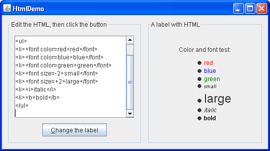

# 如何在 Swing 组件中使用 HTML

> 原文： [https://docs.oracle.com/javase/tutorial/uiswing/components/html.html](https://docs.oracle.com/javase/tutorial/uiswing/components/html.html)

许多 Swing 组件显示文本字符串作为其 GUI 的一部分。默认情况下，组件的文本以单一字体和颜色显示，全部在一行上。您可以分别通过调用组件的`setFont`和`setForeground`方法来确定组件文本的字体和颜色。例如，以下代码创建一个标签，然后设置其字体和颜色：

```
label = new JLabel("A label");
label.setFont(new Font("Serif", Font.PLAIN, 14));
label.setForeground(new Color(0xffffdd));

```

如果要在文本中混合字体或颜色，或者如果要进行多行格式化，则可以使用 HTML。 HTML 格式可用于所有 Swing 按钮，菜单项，标签，工具提示和选项卡式窗格，以及使用标签呈现文本的树和表等组件。

要指定组件的文本具有 HTML 格式，只需将`&lt;html&gt;`标记放在文本的开头，然后在其余部分中使用任何有效的 HTML。以下是在按钮文本中使用 HTML 的示例：

```
button = new JButton("<html><b><u>T</u>wo</b><br>lines</html>");

```

这是结果按钮。 

## 示例：HtmlDemo

名为`HtmlDemo`的应用程序允许您通过在标签上设置文本来播放 HTML 格式。您可以在 [`HtmlDemo.java`](../examples/components/HtmlDemoProject/src/components/HtmlDemo.java) 中找到该程序的完整代码。这是`HtmlDemo`示例的图片。



* * *

**Try This:** 

1.  单击“启动”按钮以使用 [Java™Web Start](http://www.oracle.com/technetwork/java/javase/javawebstart/index.html) （[下载 JDK 7 或更高版本](http://www.oracle.com/technetwork/java/javase/downloads/index.html)）运行 HtmlDemo。或者，要自己编译并运行示例，请参考[示例索引](../examples/components/index.html#HtmlDemo)。 [](https://docs.oracle.com/javase/tutorialJWS/samples/uiswing/HtmlDemoProject/HtmlDemo.jnlp) 

2.  编辑左侧文本区域中的 HTML 格式，然后单击“更改标签”按钮。右侧的标签显示结果。
3.  删除&lt; html&gt;标签来自左侧的文本区域。标签的文本不再被解析为 HTML。

* * *

## 示例 2：ButtonHtmlDemo

让我们看一下使用 HTML 的另一个例子。 `ButtonHtmlDemo`将字体，颜色和其他文本格式添加到三个按钮。您可以在 [`ButtonHtmlDemo.java`](../examples/components/ButtonHtmlDemoProject/src/components/ButtonHtmlDemo.java) 中找到该程序的完整代码。这是`ButtonHtmlDemo`示例的图片。


单击“启动”按钮以使用 [Java™Web Start](http://www.oracle.com/technetwork/java/javase/javawebstart/index.html) （[下载 JDK 7 或更高版本](http://www.oracle.com/technetwork/java/javase/downloads/index.html)）运行 ButtonHtmlDemo。或者，要自己编译并运行示例，请参考[示例索引](../examples/components/index.html#ButtonHtmlDemo)。

[](https://docs.oracle.com/javase/tutorialJWS/samples/uiswing/ButtonHtmlDemoProject/ButtonHtmlDemo.jnlp)

左右按钮具有多行和文本样式，并使用 HTML 实现。另一方面，中间按钮只使用一行，字体和颜色，因此它不需要 HTML。以下是指定这三个按钮的文本格式的代码：

```
b1 = new JButton("<html><b><u>D</u>isable</b><br>"
                 + "<font color=#ffffdd>middle button</font>",
                 leftButtonIcon);
Font font = b1.getFont().deriveFont(Font.PLAIN);
b1.setFont(font);
...
b2 = new JButton("middle button", middleButtonIcon);
b2.setFont(font);
b2.setForeground(new Color(0xffffdd));
...
b3 = new JButton("<html><b><u>E</u>nable</b><br>"
                 + "<font color=#ffffdd>middle button</font>",
                 rightButtonIcon);
b3.setFont(font);

```

请注意，我们必须使用`&lt;u&gt;`标记使助记符“D”和“E”在使用 HTML 的按钮中加下划线。另请注意，当禁用某个按钮时，其 HTML 文本仍然是黑色，而不是变为灰色。 （请参阅 [bug＃4783068](http://bugs.java.com/bugdatabase/view_bug.do?bug_id=4783068) 以查看此情况是否发生变化。）

本节讨论了如何在普通的非文本组件中使用 HTML。有关主要用于格式化文本的组件的信息，请参阅[使用文本组件](text.html)。

如果您使用 JavaFX 进行编程，请参阅 [HTML 编辑器](https://docs.oracle.com/javase/8/javafx/user-interface-tutorial/editor.htm)。