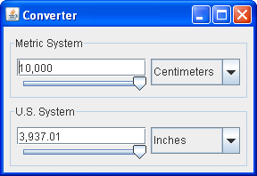

# 如何使用模型

> 原文： [https://docs.oracle.com/javase/tutorial/uiswing/components/model.html](https://docs.oracle.com/javase/tutorial/uiswing/components/model.html)

大多数 Swing 组件都有模型。例如，按钮（`JButton`）有一个模型（`ButtonModel`对象），用于存储按钮的状态 - 键盘助记符是什么，是否启用，选择或按下，等等。一些组件具有多个模型。例如，列表（`JList`）使用`ListModel`来保存列表的内容，使用`ListSelectionModel`来跟踪列表的当前选择。

您通常不需要了解组件使用的模型。例如，使用按钮的程序通常直接处理`JButton`对象，而不处理`ButtonModel`对象。

为什么模型存在？最大的原因是它们可以灵活地确定数据的存储和检索方式。例如，如果您正在设计一个在稀疏填充表中显示数据的电子表格应用程序，则可以创建自己的表模型，该表模型已针对此类用途进行了优化。

模型也有其他好处。它们意味着不会在程序的数据结构和 Swing 组件的数据结构之间复制数据。此外，模型会自动将更改传播到所有感兴趣的侦听器，从而使 GUI 可以轻松地与数据保持同步。例如，要将项添加到列表，您可以调用列表模型上的方法。当模型的数据发生变化时，模型会将事件激发到`JList`和任何其他已注册的侦听器，并相应地更新 GUI。

虽然 Swing 的模型架构有时被称为模型 - 视图 - 控制器（MVC）设计，但实际上并非如此。通常实现 Swing 组件，使得视图和控制器是不可分割的，由外观提供的单个 UI 对象实现。 Swing 模型架构更准确地描述为 _ 可分离模型架构 _。如果您有兴趣了解有关 Swing 模型架构的更多信息，请参阅 [Swing 架构概述](http://www.oracle.com/technetwork/java/architecture-142923.html)， _The Swing Connection_ 中的文章。

本节介绍一个名为 Converter 的示例，该应用程序可连续转换公制和美制单位之间的距离测量值。你可以[运行转换器](https://docs.oracle.com/javase/tutorialJWS/samples/uiswing/ConverterProject/Converter.jnlp)（[下载 JDK 7 或更高版本](http://www.oracle.com/technetwork/java/javase/downloads/index.html)）。或者，要自己编译并运行示例，请参考[示例索引](../examples/components/index.html#Converter)。

如下图所示，Converter 具有两个滑块，每个滑块都绑定到文本字段。滑块和文本字段都显示相同的数据 - 距离 - 但使用两种不同的度量单位。

这个程序的重点是确保只有一个模型控制数据的价值。有多种方法可以实现这一目标;我们通过推迟到顶部滑块的模型来做到这一点。底部滑块的模型（称为`FollowerRangeModel`的自定义类的实例）将所有数据查询转发到顶部滑块的模型（称为`ConverterRangeModel`的自定义类的实例）。每个文本字段与其滑块保持同步，反之亦然，由侦听值变化的事件处理程序保持同步。注意确保顶部滑块的模型具有关于显示距离的最终说法。

当我们开始实现自定义滑块模型时，我们首先查看[如何使用滑块](../components/slider.html)的 API 部分。它通知我们所有滑块数据模型必须实现`BoundedRangeModel`接口。 [`BoundedRangeModel` API 文档](https://docs.oracle.com/javase/8/docs/api/javax/swing/BoundedRangeModel.html)告诉我们该接口有一个名为`DefaultBoundedRangeModel`的实现类。 `DefaultBoundedRangeModel` 的 [API 文档显示它是`BoundedRangeModel`的通用实现。](https://docs.oracle.com/javase/8/docs/api/javax/swing/DefaultBoundedRangeModel.html)

我们没有直接使用`DefaultBoundedRangeModel`，因为它将数据存储为整数，而 Converter 使用浮点数据。因此，我们将`ConverterRangeModel`实现为`Object`的子类。然后我们将`FollowerRangeModel`实现为`ConverterRangeModel`的子类。

## 了解更多信息

要了解各个组件的模型，请参见[“如何”](componentlist.html)页面和各个组件的 API 文档。以下是我们直接使用模型的一些示例：

*   除了最简单的[表示例](table.html#eg)之外，所有这些都实现了自定义表数据模型。
*   [颜色选择器演示](colorchooser.html#eg)在颜色选择器的选择模型上更改了侦听器，以便在用户选择新颜色时通知他们。在 ColorChooserDemo2 中，`CrayonPanel`类直接使用颜色选择模型来设置当前颜色。
*   [DynamicTreeDemo](../examples/components/index.html#DynamicTreeDemo) 示例设置树模型（到`DefaultTreeModel`的实例），直接与它进行交互，并侦听对它的更改。
*   [ListDemo](../examples/components/index.html#ListDemo) 设置列表数据模型（到`DefaultListModel`的实例）并直接与它进行交互。
*   [SharedModelDemo](../examples/components/index.html#SharedModelDemo) 定义`SharedDataModel`类，扩展`DefaultListModel`并实现`TableModel`。 `JList`和`JTable`共享`SharedDataModel`的实例，提供模型数据的不同视图。
*   在事件监听器示例中， [ListDataEventDemo](../events/../examples/events/index.html#ListDataEventDemo) 直接创建并使用`DefaultListModel`。
*   我们的[微调器示例](spinner.html#eg)创建微调器模型。
*   正如您所见， [Converter](../examples/components/index.html#Converter) 示例定义了两个自定义滑块模型。