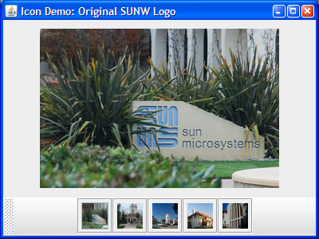
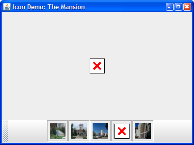

# 如何使用图标

> 原文： [https://docs.oracle.com/javase/tutorial/uiswing/components/icon.html](https://docs.oracle.com/javase/tutorial/uiswing/components/icon.html)

许多 Swing 组件，例如标签，按钮和标签窗格，都可以使用 _ 图标 _ 进行装饰 - 一个固定大小的图片。图标是符合 [`Icon`](https://docs.oracle.com/javase/8/docs/api/javax/swing/Icon.html) 接口的对象。 Swing 提供了`Icon`接口特别有用的实现： [`ImageIcon`](https://docs.oracle.com/javase/8/docs/api/javax/swing/ImageIcon.html) ，它从 GIF，JPEG 或 PNG 图像绘制图标。

这是一个带有三个标签的应用程序的快照，其中两个用图标装饰：


该程序使用一个图像图标来包含和绘制黄色 splats。一个语句创建图像图标，另外两个语句包括两个标签中每个标签上的图像图标：

```java
ImageIcon icon = createImageIcon("images/middle.gif",
                                 "a pretty but meaningless splat");
label1 = new JLabel("Image and Text", icon, JLabel.CENTER);
...
label3 = new JLabel(icon);

```

`createImageIcon`方法（在前面的代码片段中使用）是我们在许多代码示例中使用的方法。它找到指定的文件并返回该文件的`ImageIcon`，如果找不到该文件，则返回`null`。这是一个典型的实现：

```java
/** Returns an ImageIcon, or null if the path was invalid. */
protected ImageIcon createImageIcon(String path,
                                           String description) {
    java.net.URL imgURL = getClass().getResource(path);
    if (imgURL != null) {
        return new ImageIcon(imgURL, description);
    } else {
        System.err.println("Couldn't find file: " + path);
        return null;
    }
}

```

在前面的代码片段中，`ImageIcon`构造器的第一个参数是相对于当前类的位置，并将被解析为绝对 URL。 `description`参数是一个字符串，允许[辅助技术](../misc/access.html)帮助视障用户了解图标传达的信息。

通常，应用程序提供自己的一组图像作为应用程序的一部分，就像我们的许多演示所使用的图像一样。您应该使用`Class` `getResource`方法获取图像的路径。这允许应用程序验证图像是否可用，如果不是，则提供合理的错误处理。当图像不是应用程序的一部分时，不应使用`getResource`并直接使用`ImageIcon`构造器。例如：

```java
ImageIcon icon = new ImageIcon("images/middle.gif",
                               "a pretty but meaningless splat");

```

为`ImageIcon`构造器指定文件名或 URL 时，处理将被阻止，直到图像数据完全加载或数据位置被证明无效为止。如果数据位置无效（但非空），则仍会成功创建`ImageIcon`;它没有任何尺寸，因此不会涂漆。如`createImageIcon`方法所示，建议首先验证 URL 是否指向现有文件，然后再将其传递给`ImageIcon`构造器。这样可以在文件不存在时进行正常的错误处理。如果在加载图像时需要更多信息，可以通过调用`setImageObserver`方法在图像图标上注册观察者。

在封面下，每个图像图标使用 [`Image`](https://docs.oracle.com/javase/8/docs/api/java/awt/Image.html) 对象来保存图像数据。

本节的其余部分包括以下主题：

*   [更复杂的图像图标示例](#example)
*   [使用 getResource 加载图像](#getresource)
*   [将图像加载到 Applet 中](#applet)
*   [加载图像图标时提高感知性能](#efficiency)
*   [创建自定义图标实现](#custom)
*   [图像图标 API](#api)
*   [使用图标的示例](#eg)

这是一个使用六个图像图标的应用程序。其中五个显示缩略图图像，第六个显示全尺寸照片。



* * *

**Try this:** 

1.  单击“启动”按钮以使用 [Java™Web Start](http://www.oracle.com/technetwork/java/javase/javawebstart/index.html) （[下载 JDK 7 或更高版本](http://www.oracle.com/technetwork/java/javase/downloads/index.html)）运行 IconDemo。或者，要自己编译并运行示例，请参考[示例索引](../examples/components/index.html#IconDemo)。

    [](https://docs.oracle.com/javase/tutorialJWS/samples/uiswing/IconDemoProject/IconDemo.jnlp)

2.  单击任何缩略图图像以查看完整尺寸的照片。

3.  将鼠标悬停在照片上。出现一个工具提示，显示照片标题。

* * *

**IconDemoApp** 演示以下方式使用的图标：

*   作为附加到按钮的 GUI 元素（按钮上的缩略图图像）。
*   显示图像（五张照片）。

照片由`loadimages.execute`单独加载。 `loadimages`代码将在本节稍后显示。

`ThumbnailAction`类是 [`IconDemoApp.java`](../examples/components/IconDemoProject/src/components/IconDemoApp.java) 中的内部类，是`AbstractAction`的后代，它管理我们的全尺寸图像图标，缩略图版本及其描述。调用`actionPerformed`方法时，将全尺寸图像加载到主显示区域。每个按钮都有自己的`ThumbnailAction`实例，指定要显示的不同图像。

```java
/**
 * Action class that shows the image specified in it's constructor.
 */
private class ThumbnailAction extends AbstractAction{

    /**
     *The icon if the full image we want to display.
     */
    private Icon displayPhoto;

    /**
     * @param Icon - The full size photo to show in the button.
     * @param Icon - The thumbnail to show in the button.
     * @param String - The descriptioon of the icon.
     */
    public ThumbnailAction(Icon photo, Icon thumb, String desc){
        displayPhoto = photo;

        // The short description becomes the tooltip of a button.
        putValue(SHORT_DESCRIPTION, desc);

        // The LARGE_ICON_KEY is actually the key for setting the
        // icon when an Action is applied to a button.
        putValue(LARGE_ICON_KEY, thumb);
    }

    /**
     * Shows the full image in the main area and sets the application title.
     */
    public void actionPerformed(ActionEvent e) {
        photographLabel.setIcon(displayPhoto);
        setTitle("Icon Demo: " + getValue(SHORT_DESCRIPTION).toString());
    }
}

```

大多数情况下，图像图标的数据来自图像文件。您可以在文件服务器上配置应用程序的类和图像文件，这有许多有效的方法。您可能将类文件放在 JAR 文件中，或将图像文件放在 JAR 文件中;它们可能位于同一个 JAR 文件中，也可能位于不同的 JAR 文件中。下图说明了可以配置这些文件的一些方法：

|  |  |
| 包含图像文件的图像目录旁边的类文件，采用 PNG 格式。 | 与 JAR 文件位于同一目录中的类文件。使用`images`目录中的所有图像创建 JAR 文件。 |
|  |  |
| 一个 JAR 文件中的类文件和另一个 JAR 文件中的图像。 | 同一 JAR 文件中的类和图像文件。 |

如果您正在编写实际应用程序，则可能（并建议）将文件放入包中。有关包的更多信息，请参阅[学习 Java 语言](../../java/)跟踪中的[创建和使用包](../../java/package/packages.html)。以下是一些使用名为“omega”的包的可能配置：

|  |  |
| 名为`omega`的目录中的类文件。 `omega/images`目录中的图像。 | `omega`目录中的类文件。 JAR 文件中的图像不在`omega`目录内，但是使用`omega/images`层次结构创建。 |
|  |
| 一个大的 JAR 文件，其中包含`omega`目录下的类文件和`omega/images`目录下的图像文件。 |

显示的所有七个配置都是有效的，相同的代码读取图像：

```java
java.net.URL imageURL = myDemo.class.getResource("images/myImage.gif");
...
if (imageURL != null) {
    ImageIcon icon = new ImageIcon(imageURL);
}

```

`getResource`方法使类加载器查看程序类路径中的目录和 JAR 文件，并在找到所需文件后立即返回 URL。在示例中，MyDemo 程序尝试从`omega`类加载`images/myImage.png`文件。类加载器查看程序的`/omehttps://docs.oracle.com/javase/tutorial/images/myImage.png`类路径中的目录和 JAR 文件。如果类加载器找到该文件，它将返回包含该文件的 JAR 文件或目录的 URL。如果类路径中的另一个 JAR 文件或目录包含`images/myImage.png`文件，则类加载器将返回包含该文件的第一个实例。

以下是指定类路径的三种方法：

*   使用`-cp`或`-classpath`命令行参数。例如，如果图像位于名为`images.jar`的 JAR 文件中，并且类文件位于当前目录中：

    ```java
    java -cp  .;images.jar  MyDemo  [Microsoft Windows]
    java -cp ".;images.jar" MyDemo  [UNIX-emulating shell on Microsoft
                                    Windows — you must quote the path]
    java -cp  .:images.jar  MyDemo  [UNIX]

    ```

    如果您的图像和类文件位于单独的 JAR 文件中，则命令行将类似于：

    ```java
    java -cp .;MyDemo.jar;images.jar MyDemo  [Microsoft Windows]

    ```

    在所有文件都在一个 JAR 文件中的情况下，您可以使用以下任一命令：

    ```java
    java -jar MyAppPlusImages.jar
    java -cp .;MyAppPlusImages.jar MyApp  [Microsoft Windows]

    ```

    有关更多信息，请参阅 [JAR 文件](../../deployment/jar/)跟踪。

*   在程序的 JNLP 文件中（由 Java Web Start 使用）。例如，这是`DragPictureDemo`使用的 JNLP 文件：

    ```java
    &lt;?xml version="1.0" encoding="utf-8"?&gt;
    &lt;!-- JNLP File for DragPictureDemo --&gt;
    &lt;jnlp
      spec="1.0+"
      codebase="https://docs.oracle.com/javase/tutorialJWS/src/uiswing/misc/examples"
      href="DragPictureDemo.jnlp"&gt;
      &lt;information&gt;
        &lt;title&gt;DragPictureDemo&lt;/title&gt;
        &lt;vendor&gt;The Java(tm) Tutorial: Sun Microsystems, Inc.&lt;/vendor&gt;
        &lt;homepage href="https://docs.oracle.com/javase/tutorial/uiswing/misc/examples/index.html#DragPictureDemo"/&gt;
        &lt;description&gt;DragPictureDemo&lt;/description&gt;
        &lt;description kind="short"&gt;A demo showing how to install
            data transfer on a custom component.&lt;/description&gt;
        &lt;offline-allowed/&gt;
      &lt;/information&gt;
      &lt;resources&gt;
        &lt;j2se version="1.6+"/&gt;
        &lt;jar href="allClasses.jar"/&gt;
        &lt;jar href="images.jar"/&gt;
      &lt;/resources&gt;
      &lt;application-desc main-class="DragPictureDemo"/&gt;
    &lt;/jnlp&gt;

    ```

    在此示例中，类文件和图像文件位于单独的 JAR 文件中。使用 XML `jar`标记指定 JAR 文件。

*   设置`CLASSPATH`环境变量。最后一种方法是 _ 不推荐 _。如果未设置`CLASSPATH`，则默认使用当前目录（“。”）后跟 JRE 附带的系统类的位置。

大多数 Swing Tutorial 示例将图像放在包含示例的类文件的目录下的`images`目录中。当我们为示例创建 JAR 文件时，我们保持相同的相对位置，尽管我们经常将类文件放在与图像 JAR 文件不同的 JAR 文件中。无论文件系统中的类和图像文件位于何处 - 在一个 JAR 文件中，在多个 JAR 文件中，在命名包中，还是在默认包中 - 相同的代码都使用`getResource`查找图像文件。

有关更多信息，请参阅[以位置无关方式访问资源](https://docs.oracle.com/javase/8/docs/technotes/guides/lang/resources.html)和[应用程序开发注意事项](https://docs.oracle.com/javase/8/docs/technotes/guides/javaws/developersguide/development.html)。

Applet 通常从提供 applet 的计算机加载图像数据。您可以在`APPLET`标签中指定有关 applet 中使用的图像的信息。有关`APPLET`标签的更多信息，请参阅[使用 APPLET 标签](../../deployment/applet/html.html)

由于照片图像访问速度较慢， [`IconDemoApp.java`](../examples/components/IconDemoProject/src/components/IconDemoApp.java) 使用`SwingWorker`来改善用户所感知的节目性能。

**背景图片加载** - 程序使用 [javax.swing.SwingWorker](https://docs.oracle.com/javase/8/docs/api/javax/swing/SwingWorker.html) 对象加载每张照片图像并在后台线程中计算它的缩略图。使用`SwingWorker`可防止程序在加载和缩放图像时出现冻结现象。

这是处理每个图像的代码：

```java
/**
 * SwingWorker class that loads the images a background thread and calls publish
 * when a new one is ready to be displayed.
 *
 * We use Void as the first SwingWorker param as we do not need to return
 * anything from doInBackground().
 */
private SwingWorker<Void, ThumbnailAction> loadimages = new SwingWorker<Void, ThumbnailAction>() {

    /**
     * Creates full size and thumbnail versions of the target image files.
     */
    @Override
    protected Void doInBackground() throws Exception {
        for (int i = 0; i < imageCaptions.length; i++) {
            ImageIcon icon;
            icon = createImageIcon(imagedir + imageFileNames[i], imageCaptions[i]);

            ThumbnailAction thumbAction;
            if(icon != null){

                ImageIcon thumbnailIcon = new
                     ImageIcon(getScaledImage(icon.getImage(), 32, 32));

                thumbAction = new ThumbnailAction(icon, thumbnailIcon, imageCaptions[i]);

            } else {
                // the image failed to load for some reason
                // so load a placeholder instead
                thumbAction = new ThumbnailAction(placeholderIcon, placeholderIcon, imageCaptions[i]);
            }
            publish(thumbAction);
        }
        // unfortunately we must return something, and only null is valid to
        // return when the return type is void.
        return null;
    }

    /**
     * Process all loaded images.
     */
    @Override
    protected void process(List<ThumbnailAction> chunks) {
        for (ThumbnailAction thumbAction : chunks) {
            JButton thumbButton = new JButton(thumbAction);
            // add the new button BEFORE the last glue
            // this centers the buttons in the toolbar
            buttonBar.add(thumbButton, buttonBar.getComponentCount() - 1);
        }
    }
};

```

SwingWorker 在后台线程中调用`doInBackground`方法。该方法将全尺寸图像，缩略图大小图像和标题放入`ThumbnailAction`对象。然后，SwingWorker 将`ThumbnailAction`传递给`process`方法。 `process`方法在事件分派线程上执行，并通过向工具栏添加按钮来更新 GUI。 `JButton`有一个构造器，它接受一个动作对象。操作对象确定按钮属性的数量。在我们的例子中，按下按钮图标，标题和按下按钮时要执行的操作都由`ThumbnailAction`确定。

**Overhead** - 该程序最终将所有源图像加载到内存中。在所有情况下这可能都不可取。加载一些非常大的文件可能会导致程序分配非常大的数量或内存。应注意管理加载的图像的数量和大小。

与所有与性能相关的问题一样，此技术适用于某些情况，而不适用于其他情况。此处描述的技术旨在提高程序的感知性能，但不一定会影响其实际性能。

`createImageIcon`方法在找不到图像时返回 null，但程序应该做什么呢？一种可能性是忽略该图像并继续前进。另一种选择是提供某种默认图标，以便在无法加载真实图标时显示。再次调用`createImageIcon`可能会导致另一个 null，因此使用它不是一个好主意。而是让我们创建一个自定义`Icon`实现。



您可以在 [`MissingIcon.java`](../examples/components/IconDemoProject/src/components/MissingIcon.java) 中找到自定义图标类的实现。以下是其代码的有趣部分：

```java
/**
 * The "missing icon" is a white box with a black border and a red x.
 * It's used to display something when there are issues loading an
 * icon from an external location.
 *
 * @author Collin Fagan
 */
public class MissingIcon implements Icon{

    private int width = 32;
    private int height = 32;

    private BasicStroke stroke = new BasicStroke(4);

    public void paintIcon(Component c, Graphics g, int x, int y) {
        Graphics2D g2d = (Graphics2D) g.create();

        g2d.setColor(Color.WHITE);
        g2d.fillRect(x +1 ,y + 1,width -2 ,height -2);

        g2d.setColor(Color.BLACK);
        g2d.drawRect(x +1 ,y + 1,width -2 ,height -2);

        g2d.setColor(Color.RED);

        g2d.setStroke(stroke);
        g2d.drawLine(x +10, y + 10, x + width -10, y + height -10);
        g2d.drawLine(x +10, y + height -10, x + width -10, y + 10);

        g2d.dispose();
    }

    public int getIconWidth() {
        return width;
    }

    public int getIconHeight() {
        return height;
    }
}

```

`paintIcon`方法传递`Graphics`对象。 `Graphics`对象为`paintIcon`方法提供对整个 Java2D API 的访问。有关绘画和 Java2D 的更多信息，请参阅[执行自定义绘画](../painting/index.html)。

以下代码演示了如何在`SwingWorker` `doInBackground`方法中使用`MissingIcon`类。

```java
private MissingIcon placeholderIcon = new MissingIcon();

...
if(icon != null) {
    ...

} else {
    // the image failed to load for some reason
    // so load a placeholder instead
    thumbAction = new ThumbnailAction(placeholderIcon, placeholderIcon, imageCaptions[i]);
}

```

使用自定义图标有一些含义：

*   由于图标的外观是动态确定的，因此图标绘制代码可以使用任何信息（例如组件和应用程序状态）来确定要绘制的内容。

*   根据平台和图像类型，您可以通过自定义图标获得性能提升，因为绘制简单形状有时比复制图像更快。
*   因为`MissingIcon`不执行任何文件 I / O，所以不需要单独的线程来加载图像。

下表列出了常用的`ImageIcon`构造器和方法。请注意，`ImageIcon`不是`JComponent`的后代，甚至不是`Component`的后代。

使用图片图标的 API 分为以下几类：

*   [设置，获取和绘制图像图标的图像](#contents)
*   [设置或获取有关图像图标的信息](#info)
*   [观看图像图标的图像加载](#loadstatus)


| 方法或构造器 | 目的 |
| --- | --- |
| [ImageIcon（）](https://docs.oracle.com/javase/8/docs/api/javax/swing/ImageIcon.html#ImageIcon--)
[ImageIcon（byte []）](https://docs.oracle.com/javase/8/docs/api/javax/swing/ImageIcon.html#ImageIcon-byte:A-)
[ImageIcon（byte []，String）](https://docs.oracle.com/javase/8/docs/api/javax/swing/ImageIcon.html#ImageIcon-byte:A-java.lang.String-)
[ImageIcon（Image ）](https://docs.oracle.com/javase/8/docs/api/javax/swing/ImageIcon.html#ImageIcon-java.awt.Image-)
[ImageIcon（图像，字符串）](https://docs.oracle.com/javase/8/docs/api/javax/swing/ImageIcon.html#ImageIcon-java.awt.Image-java.lang.String-)
[ImageIcon（字符串）](https://docs.oracle.com/javase/8/docs/api/javax/swing/ImageIcon.html#ImageIcon-java.lang.String-)
[ImageIcon（字符串，字符串）](https://docs.oracle.com/javase/8/docs/api/javax/swing/ImageIcon.html#ImageIcon-java.lang.String-java.lang.String-)
[ImageIcon（URL）](https://docs.oracle.com/javase/8/docs/api/javax/swing/ImageIcon.html#ImageIcon-java.net.URL-)
[ImageIcon（URL，String）](https://docs.oracle.com/javase/8/docs/api/javax/swing/ImageIcon.html#ImageIcon-java.net.URL-java.lang.String-) | 创建`ImageIcon`实例，将其初始化为包含指定的图像。第一个参数表示源 - 图像，字节数组，文件名或 URL - 应从中加载图像图标的图像。源必须采用`java.awt.Image`类支持的格式：即 GIF，JPEG 或 PNG。第二个参数（如果存在）提供图像的描述。描述也可以通过`setDescription`设置，并为[辅助技术](../misc/access.html)提供有用的文本信息。 |
| [void setImage（Image）](https://docs.oracle.com/javase/8/docs/api/javax/swing/ImageIcon.html#setImage-java.awt.Image-)
[Image getImage（）](https://docs.oracle.com/javase/8/docs/api/javax/swing/ImageIcon.html#getImage--) | 设置或获取图像图标显示的图像。 |
| [void paintIcon（Component，Graphics，int，int）](https://docs.oracle.com/javase/8/docs/api/javax/swing/ImageIcon.html#paintIcon-java.awt.Component-java.awt.Graphics-int-int-) | 在指定的图形上下文中绘制图像图标的图像。只有在实现执行自己绘制的自定义图标时，才会覆盖此选项。 `Component`对象用作图像观察者。您可以依赖`Component`类提供的默认行为，并传入任何组件。两个`int`参数指定绘制图标的左上角。 |
| [URL getResource（String）](https://docs.oracle.com/javase/8/docs/api/java/lang/ClassLoader.html#getResource-java.lang.String-)
in（ _java.lang.ClassLoader_ ） | 找到具有给定名称的资源。有关更多信息，请参阅[使用 getResource](#getresource) 加载图像。 |
| [InputStream getResourceAsStream（String）](https://docs.oracle.com/javase/8/docs/api/java/lang/ClassLoader.html#getResourceAsStream-java.lang.String-)
in（ _java.lang.ClassLoader_ ） | 查找具有给定名称的资源并返回用于读取资源的输入流。有关更多信息，请参阅[将图像加载到 Applet](#applet) 讨论。 |


| 方法 | 目的 |
| --- | --- |
| [void setDescription（String）](https://docs.oracle.com/javase/8/docs/api/javax/swing/ImageIcon.html#setDescription-java.lang.String-)
[String getDescription（）](https://docs.oracle.com/javase/8/docs/api/javax/swing/ImageIcon.html#getDescription--) | 设置或获取图像的描述。该描述旨在供[辅助技术](../misc/access.html)使用。 |
| [int getIconWidth（）](https://docs.oracle.com/javase/8/docs/api/javax/swing/ImageIcon.html#getIconWidth--)
[int getIconHeight（）](https://docs.oracle.com/javase/8/docs/api/javax/swing/ImageIcon.html#getIconHeight--) | 获取图像图标的宽度或高度（以像素为单位）。 |


| 方法 | 目的 |
| --- | --- |
| [void setImageObserver（ImageObserver）](https://docs.oracle.com/javase/8/docs/api/javax/swing/ImageIcon.html#setImageObserver-java.awt.image.ImageObserver-)
[ImageObserver getImageObserver（）](https://docs.oracle.com/javase/8/docs/api/javax/swing/ImageIcon.html#getImageObserver--) | 设置或获取图像图标的图像观察者。 |
| [int getImageLoadStatus（）](https://docs.oracle.com/javase/8/docs/api/javax/swing/ImageIcon.html#getImageLoadStatus--) | 获取图像图标图像的加载状态。此方法返回的值由`MediaTracker`定义。 |

下表仅列出了使用`ImageIcon`的许多示例中的一些示例。

| 例 | 在哪里描述 | 笔记 |
| :-- | :-- | :-- |
| [`LabelDemo`](../examples/components/index.html#LabelDemo) | 本节和
[如何使用标签](../components/label.html) | 演示在应用程序标签中使用图标，包括和不包含文本。 |
| [`IconDemo`](../examples/components/index.html#IconDemo) | 这个部分 | 使用标签显示大图像;使用同时具有图像和文本的按钮。 |
| [`CustomIconDemo`](../examples/components/index.html#CustomIconDemo) | 这个部分 | 使用由 [`ArrowIcon.java`](../examples/components/CustomIconDemoProject/src/components/ArrowIcon.java) 实现的自定义图标类。 |
| [`TumbleItem`](../examples/components/index.html#TumbleItem) | [如何制作小程序](../components/applet.html) | 小程序。在动画中使用图像图标。演示如何调用`ImageIcon`的`paintIcon`方法。 |
| [`ButtonDemo`](../examples/components/index.html#ButtonDemo) | [如何使用按钮，复选框和单选按钮](../components/button.html) | 演示如何在应用程序按钮中使用图标。 |
| [`CheckBoxDemo`](../examples/components/index.html#CheckBoxDemo) | [如何使用复选框](../components/button.html#checkbox) | 使用多个 GIF 图像。 |
| [`TabbedPaneDemo`](../examples/components/index.html#TabbedPaneDemo) | [如何使用选项卡式窗格](../components/tabbedpane.html) | 演示在选项卡式窗格中向选项卡添加图标。 |
| [`DialogDemo`](../examples/components/index.html#DialogDemo) | [如何制作对话](../components/dialog.html) | 显示如何在对话框中使用标准图标。 |
| [`TreeIconDemo`](../examples/components/index.html#TreeIconDemo) | [如何使用树木](../components/tree.html) | 显示如何更改树节点显示的图标。 |
| [`ActionDemo`](../examples/misc/index.html#ActionDemo) | [如何使用行动](../misc/action.html) | 显示如何使用`Action`在工具栏按钮或菜单项中指定图标。 |
| [`FileChooserDemo2`](../examples/components/index.html#FileChooserDemo2) | [如何使用文件选择器](../components/filechooser.html) | 使用`PNG`图像。演示如何在文件选择器中实现图像预览器和图像过滤器。 |

* * *

**Note:** The photographs used in the [`IconDemo`](../examples/components/index.html#IconDemo) are copyright ©2006 [spriggs.net](http://photos.spriggs.net/) and licenced under a [Creative Commons Licence](http://creativecommons.org/licenses/by-sa/3.0/).

* * *