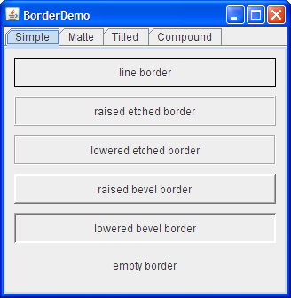
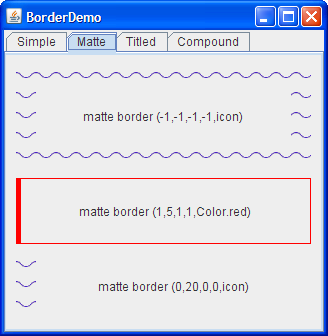
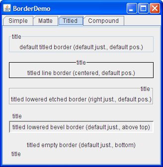
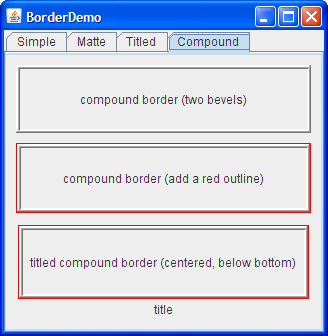

# 如何使用边框

> 原文： [https://docs.oracle.com/javase/tutorial/uiswing/components/border.html](https://docs.oracle.com/javase/tutorial/uiswing/components/border.html)

每个`JComponent`都可以有一个或多个边框。边框是非常有用的对象，虽然不是它们自己的组件，但却知道如何绘制 Swing 组件的边缘。边框不仅可用于绘制线条和花边，还可用于提供组件周围的标题和空白空间。

* * *

**Note:** 

我们的示例设置了`JPanel`，`JLabel`和`JComponent`的自定义子类的边界。虽然从技术上讲，您可以在从`JComponent`继承的任何对象上设置边框，但许多标准 Swing 组件的外观实现与用户设置的边框不兼容。通常，如果要在`JPanel`或`JLabel`以外的标准 Swing 组件上设置边框，我们建议您将组件放在`JPanel`中并在`JPanel`上设置边框。

* * *

要在`JComponent`周围放置边框，可以使用其`setBorder`方法。您可以使用 [`BorderFactory`](https://docs.oracle.com/javase/8/docs/api/javax/swing/BorderFactory.html) 类创建 Swing 提供的大多数边框。如果你需要一个边框的引用 - 比如说，因为你想在多个组件中使用它 - 你可以将它保存在 [`Border`](https://docs.oracle.com/javase/8/docs/api/javax/swing/border/Border.html) 类型的变量中。以下是创建边框容器的代码示例：

```
JPanel pane = new JPanel();
pane.setBorder(BorderFactory.createLineBorder(Color.black));

```

这是容器的图片，其中包含标签组件。边框绘制的黑线标记容器的边缘。


本页的其余部分讨论以下主题：

*   [BorderDemo 示例](#demo)
*   [使用 Swing 提供的边框](#code)
*   [创建自定义边框](#custom)
*   [Border API](#api)
*   [使用边框的例子](#eg)

下图显示了一个名为`BorderDemo`的应用程序，它显示了 Swing 提供的边框。我们在[使用 Swing 提供的边框](#code)中显示稍后创建这些边框的代码。

单击“启动”按钮以使用 [Java™Web Start](http://www.oracle.com/technetwork/java/javase/javawebstart/index.html) （[下载 JDK 7 或更高版本](http://www.oracle.com/technetwork/java/javase/downloads/index.html)）运行 BorderDemo 示例。或者，要自己编译并运行示例，请参考[示例索引](../examples/components/index.html#BorderDemo)。

[](https://docs.oracle.com/javase/tutorialJWS/samples/uiswing/BorderDemoProject/BorderDemo.jnlp)



下图显示了一些遮罩边框。创建遮罩边框时，可以指定它在组件的顶部，左侧，底部和右侧占据的像素数。然后指定要绘制的遮罩边框的颜色或图标。选择图标并确定组件尺寸时需要小心;否则，图标可能会被切断或在组件的角落处不匹配。



下一张图片显示标题为边​​框。使用标题边框，您可以将任何边框转换为显示文本说明的边框。如果未指定边框，则使用特定于外观的边框。例如，Java 外观中的默认标题边框使用灰色线条，Windows 外观中的默认标题边框使用蚀刻边框。默认情况下，标题横跨边框的左上角，如下图顶部所示。



下图显示了复合边框。使用复合边框，您可以组合任意两个边框，这些边框本身可以是复合边框。



下面的代码显示了如何创建和设置您在前面的图中看到的边框。您可以在 [`BorderDemo.java`](../examples/components/BorderDemoProject/src/components/BorderDemo.java) 中找到程序代码。

```
//Keep references to the next few borders,
//for use in titles and compound borders.
Border blackline, raisedetched, loweredetched,
       raisedbevel, loweredbevel, empty;

blackline = BorderFactory.createLineBorder(Color.black);
raisedetched = BorderFactory.createEtchedBorder(EtchedBorder.RAISED);
loweredetched = BorderFactory.createEtchedBorder(EtchedBorder.LOWERED);
raisedbevel = BorderFactory.createRaisedBevelBorder();
loweredbevel = BorderFactory.createLoweredBevelBorder();
empty = BorderFactory.createEmptyBorder();

//Simple borders
jComp1.setBorder(blackline);
jComp2.setBorder(raisedbevel);
jComp3.setBorder(loweredbevel);
jComp4.setBorder(empty);

//Matte borders
ImageIcon icon = createImageIcon("images/wavy.gif",
                                 "wavy-line border icon"); //20x22

jComp5.setBorder(BorderFactory.createMatteBorder(
                                   -1, -1, -1, -1, icon));
jComp6.setBorder(BorderFactory.createMatteBorder(
                                    1, 5, 1, 1, Color.red));
jComp7.setBorder(BorderFactory.createMatteBorder(
                                    0, 20, 0, 0, icon));

//Titled borders
TitledBorder title;
title = BorderFactory.createTitledBorder("title");
jComp8.setBorder(title);

title = BorderFactory.createTitledBorder(
                       blackline, "title");
title.setTitleJustification(TitledBorder.CENTER);
jComp9.setBorder(title);

title = BorderFactory.createTitledBorder(
                       loweredetched, "title");
title.setTitleJustification(TitledBorder.RIGHT);
jComp10.setBorder(title);

title = BorderFactory.createTitledBorder(
                       loweredbevel, "title");
title.setTitlePosition(TitledBorder.ABOVE_TOP);
jComp11.setBorder(title);

title = BorderFactory.createTitledBorder(
                       empty, "title");
title.setTitlePosition(TitledBorder.BOTTOM);
jComp12.setBorder(title);

//Compound borders
Border compound;
Border redline = BorderFactory.createLineBorder(Color.red);

//This creates a nice frame.
compound = BorderFactory.createCompoundBorder(
                          raisedbevel, loweredbevel);
jComp13.setBorder(compound);

//Add a red outline to the frame.
compound = BorderFactory.createCompoundBorder(
                          redline, compound);
jComp14.setBorder(compound);

//Add a title to the red-outlined frame.
compound = BorderFactory.createTitledBorder(
                          compound, "title",
                          TitledBorder.CENTER,
                          TitledBorder.BELOW_BOTTOM);
jComp15.setBorder(compound);

```

您可能已经注意到，代码使用`BorderFactory`类来创建每个边框。 `javax.swing`包中的`BorderFactory`类返回实现 [`Border`](https://docs.oracle.com/javase/8/docs/api/javax/swing/border/Border.html) 接口的对象。

`Border`接口及其 Swing 提供的实现位于 [`javax.swing.border`](https://docs.oracle.com/javase/8/docs/api/javax/swing/border/package-summary.html) 包中。除非在指定特定边界类特定的常量或引用`Border`类型时，否则通常不需要在 border 包中直接使用任何内容。

如果`BorderFactory`无法提供对边框表单的足够控制，那么您可能需要直接在边框包中使用 API​​ - 甚至可以定义自己的边框。除了包含`Border`接口外，border 包还包含实现您已经看到的边界的类： [`LineBorder`](https://docs.oracle.com/javase/8/docs/api/javax/swing/border/LineBorder.html) ， [`EtchedBorder`](https://docs.oracle.com/javase/8/docs/api/javax/swing/border/EtchedBorder.html) ， [`BevelBorder`](https://docs.oracle.com/javase/8/docs/api/javax/swing/border/BevelBorder.html) ， [`EmptyBorder`](https://docs.oracle.com/javase/8/docs/api/javax/swing/border/EmptyBorder.html) ， [`MatteBorder`](https://docs.oracle.com/javase/8/docs/api/javax/swing/border/MatteBorder.html) ， [`TitledBorder`](https://docs.oracle.com/javase/8/docs/api/javax/swing/border/TitledBorder.html) 和 [`CompoundBorder`](https://docs.oracle.com/javase/8/docs/api/javax/swing/border/CompoundBorder.html) 。 border 包还包含一个名为 [`SoftBevelBorder`](https://docs.oracle.com/javase/8/docs/api/javax/swing/border/SoftBevelBorder.html) 的类，它产生类似于`BevelBorder`的结果，但边缘更柔和。

如果没有 Swing 边框适合，您可以实现自己的边框。通常，您可以通过创建 [`AbstractBorder`](https://docs.oracle.com/javase/8/docs/api/javax/swing/border/AbstractBorder.html) 类的子类来完成此操作。在您的子类中，您必须实现至少一个构造器和以下两个方法：

*   `paintBorder`，包含`JComponent`执行绘制边框的绘图代码。
*   `getBorderInsets`，指定边框绘制自身所需的空间量。

如果自定义边框具有插入（并且它们通常具有插入），则需要覆盖 [`AbstractBorder.getBorderInsets(Component c)`](https://docs.oracle.com/javase/8/docs/api/javax/swing/border/AbstractBorder.html#getBorderInsets-java.awt.Component-) 和 [`AbstractBorder.getBorderInsets(Component c, Insets insets)`](https://docs.oracle.com/javase/8/docs/api/javax/swing/border/AbstractBorder.html#getBorderInsets-java.awt.Component-java.awt.Insets-) 以提供正确的插入。

有关实现边框的示例，请参阅`javax.swing.border`包中的类的源代码。

下表列出了常用的边框方法。使用边框的 API 分为两类：

*   [使用 BorderFactory 创建边框](#createapi)
*   [设置或获取组件的边框](#setgetapi)


| 方法 | 目的 |
| :-- | :-- |
| [Border createLineBorder（Color）](https://docs.oracle.com/javase/8/docs/api/javax/swing/BorderFactory.html#createLineBorder-java.awt.Color-)
[Border createLineBorder（Color，int）](https://docs.oracle.com/javase/8/docs/api/javax/swing/BorderFactory.html#createLineBorder-java.awt.Color-int-) | 创建线条边框。第一个参数是`java.awt.Color`对象，它指定行的颜色。可选的第二个参数指定行的宽度（以像素为单位）。 |
| [Border createEtchedBorder（）](https://docs.oracle.com/javase/8/docs/api/javax/swing/BorderFactory.html#createEtchedBorder--)
[Border createEtchedBorder（Color，Color）](https://docs.oracle.com/javase/8/docs/api/javax/swing/BorderFactory.html#createEtchedBorder-java.awt.Color-java.awt.Color-)
[Border createEtchedBorder（int）](https://docs.oracle.com/javase/8/docs/api/javax/swing/BorderFactory.html#createEtchedBorder-int-)
[Border createEtchedBorder（int ，颜色，颜色）](https://docs.oracle.com/javase/8/docs/api/javax/swing/BorderFactory.html#createEtchedBorder-int-java.awt.Color-java.awt.Color-) | 创建蚀刻边框。可选的`Color`参数指定要使用的高光和阴影颜色。具有`int`参数的方法允许将 border 方法指定为`EtchedBorder.RAISED`或`EtchedBorder.LOWERED`。没有`int`参数的方法会产生较低的蚀刻边界。 |
| [Border createLoweredBevelBorder（）](https://docs.oracle.com/javase/8/docs/api/javax/swing/BorderFactory.html#createLoweredBevelBorder--) | 创建一个边框，使组件的幻觉低于周围区域。 |
| [Border createRaisedBevelBorder（）](https://docs.oracle.com/javase/8/docs/api/javax/swing/BorderFactory.html#createRaisedBevelBorder--) | 创建一个边框，使组件的幻觉高于周围区域。 |
| [Border createBevelBorder（int，Color，Color）](https://docs.oracle.com/javase/8/docs/api/javax/swing/BorderFactory.html#createBevelBorder-int-java.awt.Color-java.awt.Color-)
[Border createBevelBorder（int，Color，Color，Color，Color）](https://docs.oracle.com/javase/8/docs/api/javax/swing/BorderFactory.html#createBevelBorder-int-java.awt.Color-java.awt.Color-java.awt.Color-java.awt.Color-) | 创建凸起或降低的斜面边框，指定要使用的颜色。整数参数可以是`BevelBorder.RAISED`或`BevelBorder.LOWERED`。使用三参数构造器，可以指定高光颜色和阴影颜色。使用五参数构造器，您可以按顺序指定外部高光，内部高光，外部阴影和内部阴影颜色。 |
| [Border createEmptyBorder（）](https://docs.oracle.com/javase/8/docs/api/javax/swing/BorderFactory.html#createEmptyBorder--)
[Border createEmptyBorder（int，int，int，int）](https://docs.oracle.com/javase/8/docs/api/javax/swing/BorderFactory.html#createEmptyBorder-int-int-int-int-) | 创建一个不可见的边框。如果未指定参数，则边框不占用空间，这在创建没有可见边界的标题边框时很有用。可选参数指定边框在任何组件使用它的顶部，左侧，底部和右侧（按此顺序）占据的像素数。此方法对于在组件周围放置空白空间很有用。 |
| [MatteBorder createMatteBorder（int，int，int，int，Color）](https://docs.oracle.com/javase/8/docs/api/javax/swing/BorderFactory.html#createMatteBorder-int-int-int-int-java.awt.Color-)
[MatteBorder createMatteBorder（int，int，int，int，Icon）](https://docs.oracle.com/javase/8/docs/api/javax/swing/BorderFactory.html#createMatteBorder-int-int-int-int-javax.swing.Icon-) | 创建遮罩边框。整数参数指定边框在任何组件使用它的顶部，左侧，底部和右侧（按此顺序）占据的像素数。 color 参数指定边框应填充其区域的颜色。 icon 参数指定带边框的图标应该平铺其区域。 |
| [TitledBorder createTitledBorder（String）](https://docs.oracle.com/javase/8/docs/api/javax/swing/BorderFactory.html#createTitledBorder-java.lang.String-)
[TitledBorder createTitledBorder（Border）](https://docs.oracle.com/javase/8/docs/api/javax/swing/BorderFactory.html#createTitledBorder-javax.swing.border.Border-)
[TitledBorder createTitledBorder（Border，String）](https://docs.oracle.com/javase/8/docs/api/javax/swing/BorderFactory.html#createTitledBorder-javax.swing.border.Border-java.lang.String-)
[TitledBorder createTitledBorder（ Border，String，int，int）](https://docs.oracle.com/javase/8/docs/api/javax/swing/BorderFactory.html#createTitledBorder-javax.swing.border.Border-java.lang.String-int-int-)
[TitledBorder createTitledBorder（Border，String，int，int，Font）](https://docs.oracle.com/javase/8/docs/api/javax/swing/BorderFactory.html#createTitledBorder-javax.swing.border.Border-java.lang.String-int-int-java.awt.Font-)
[TitledBorder createTitledBorder（Border，String，int，int，字体，颜色）](https://docs.oracle.com/javase/8/docs/api/javax/swing/BorderFactory.html#createTitledBorder-javax.swing.border.Border-java.lang.String-int-int-java.awt.Font-java.awt.Color-) | Create a titled border. The string argument specifies the title to be displayed. The optional font and color arguments specify the font and color to be used for the title's text. The border argument specifies the border that should be displayed along with the title. If no border is specified, then a look-and-feel-specific default border is used.默认情况下，标题跨越其伴随边框的顶部并且左对齐。可选的整数参数按顺序指定标题的位置和对齐方式。 [`TitledBorder`](https://docs.oracle.com/javase/8/docs/api/javax/swing/border/TitledBorder.html) 定义了这些可能的位置：`ABOVE_TOP`，`TOP`（默认值），`BELOW_TOP`，`ABOVE_BOTTOM`，`BOTTOM`和`BELOW_BOTTOM`。您可以将对齐指定为`LEADING`（默认值），`CENTER`或`TRAILING`。在具有西方字母的区域设置中`LEADING`相当于`LEFT`，`TRAILING`相当于`RIGHT`。 |
| [CompoundBorder createCompoundBorder（Border，Border）](https://docs.oracle.com/javase/8/docs/api/javax/swing/BorderFactory.html#createCompoundBorder-javax.swing.border.Border-javax.swing.border.Border-) | 将两个边框合并为一个。第一个参数指定外边界;第二，内部边界。 |


| 方法 | 目的 |
| :-- | :-- |
| [void setBorder（Border）](https://docs.oracle.com/javase/8/docs/api/javax/swing/JComponent.html#setBorder-javax.swing.border.Border-)
[Border getBorder（）](https://docs.oracle.com/javase/8/docs/api/javax/swing/JComponent.html#getBorder--) | 设置或获取接收`JComponent`的边框。 |
| [void setBorderPainted（boolean）](https://docs.oracle.com/javase/8/docs/api/javax/swing/AbstractButton.html#setBorderPainted-boolean-)
[boolean isBorderPainted（）](https://docs.oracle.com/javase/8/docs/api/javax/swing/AbstractButton.html#isBorderPainted--)
（在`AbstractButton`，`JMenuBar`，`JPopupMenu`，`JProgressBar`和`JToolBar`中） | 设置或获取是否应显示组件的边框。 |

本课中的许多示例都使用边框。下表列出了一些有趣的案例。

| 例 | 在哪里描述 | 笔记 |
| :-- | :-- | :-- |
| [`BorderDemo`](../examples/components/index.html#BorderDemo) | 这个部分 | 显示`BorderFactory`可以创建的每种边框类型的示例。还使用空边框在每个窗格及其内容之间添加呼吸空间。 |
| [`BoxAlignmentDemo`](../examples/layout/index.html#BoxAlignmentDemo) | [如何使用 BoxLayout](../layout/box.html) | 使用标题边框。 |
| [`BoxLayoutDemo`](../examples/layout/index.html#BoxLayoutDemo) | [如何使用 BoxLayout](../layout/box.html) | 使用红线显示容器边缘的位置，以便您可以看到框布局中的额外空间是如何分布的。 |
| [`ComboBoxDemo2`](../examples/components/index.html#ComboBoxDemo2) | [如何使用组合框](../components/combobox.html) | 使用复合边框将线条边框与空边框组合在一起。空边框在线条和组件内部之间提供空间。 |