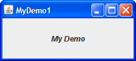

# 问题和练习：使用 Swing 组件

> 原文： [https://docs.oracle.com/javase/tutorial/uiswing/QandE/questions-ch3.html](https://docs.oracle.com/javase/tutorial/uiswing/QandE/questions-ch3.html)

使用本课程中的信息和组件[操作方法部分](../components/componentlist.html)来帮助您完成这些问题和练习。

## 问题

1.找到最适合以下每种需求的组件。记下组件的通用名称（例如“框架”）并在线查找组件的操作方法页面。

一个。允许用户选择颜色的组件。

b。显示图标但不响应用户点击的组件。

c。一个看起来像按钮的组件，当按下该组件时，会显示一个项目菜单供用户选择。

d。一个看起来像框架但在真实框架内出现（通常与其他类似容器一起）的容器。

e。一个容器，允许用户确定两个组件如何共享有限的空间量。

2.您使用哪种方法将菜单栏添加到顶级容器，例如`JFrame`？

3.您使用哪种方法为顶级容器指定默认按钮，例如`JFrame`或`JDialog`？

4.您使用哪种方法来启用和禁用`JButton`等组件？它定义的是什么类？

5\. a。哪些 Swing 组件使用`ListSelectionModel`？ [_ 提示：*每个接口和类的规范顶部的“使用”链接将您带到一个页面，显示 API 中引用该接口或类的位置。

湾这些组件是否使用任何其他模型来处理组件状态的其他方面？如果是，请列出其他模型的类型。

6.哪种类型的模型包含文本组件的内容？

## 演习

1.使用如下所示的 GUI 实现程序。将 main 方法放在名为`MyDemo1`的类中。

2.制作名为`MyDemo2.java`的`MyDemo1.java`副本。将菜单栏添加到`MyDemo2`。

3.将`MyDemo1.java`复制到`MyDemo3.java`。添加一个按钮（`JButton`）到`MyDemo3.java`。将其设为默认按钮。

[检查你的答案。](answers-ch3.html)