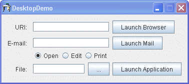
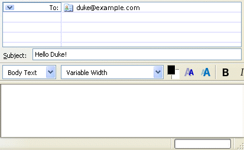

# 如何与桌面类集成

> 原文： [https://docs.oracle.com/javase/tutorial/uiswing/misc/desktop.html](https://docs.oracle.com/javase/tutorial/uiswing/misc/desktop.html)

Java™标准版第 6 版缩小了本机应用程序和 Java 应用程序的性能和集成之间的差距。除了新的[系统托盘](../../uiswing/misc/systemtray.html)功能，[启动画面](../../uiswing/misc/splashscreen.html)支持以及 JTables 的增强[打印外，Java SE 版本 6 还提供了 Desktop API（`java.awt.Desktop`）API ，允许 Java 应用程序与主机平台上与特定文件类型关联的默认应用程序进行交互。](../../uiswing/misc/printtable.html)

新功能由 [`Desktop`](https://docs.oracle.com/javase/8/docs/api/java/awt/Desktop.html) 类提供。 API 源自 JDesktop Integration Components（JDIC）项目。 JDIC 项目的目标是使桌面的“基于 Java 技术的应用程序成为一等公民”，实现无缝集成。 JDIC 为 Java 应用程序提供对本机桌面提供的功能和工具的访问。关于新的 Desktop API，这意味着 Java 应用程序可以执行以下操作：

*   使用特定的统一资源标识符（URI）启动主机系统的默认浏览器
*   启动主机系统的默认电子邮件客户端
*   启动应用程序以打开，编辑或打印与这些应用程序关联的文件

* * *

**Note:** 

Desktop API 使用主机操作系统的文件关联来启动与特定文件类型关联的应用程序。例如，如果 OpenDocument 文本（.odt）文件扩展名与 OpenOffice Writer 应用程序相关联，则 Java 应用程序可以启动 OpenOffice Writer 以打开，编辑甚至打印具有该关联的文件。根据主机系统，不同的应用程序可能与不同的操作相关联。例如，如果无法打印特定文件，请首先检查其扩展名是否在给定操作系统上具有打印关联。

* * *

使用 [`isDesktopSupported()`](https://docs.oracle.com/javase/8/docs/api/java/awt/Desktop.html#isDesktopSupported--) 方法确定 Desktop API 是否可用。在 Solaris 操作系统和 Linux 平台上，此 API 依赖于 Gnome 库。如果这些库不可用，则此方法将返回 false。在确定支持 Desktop API 之后，即`isDesktopSupported()`返回 true，应用程序可以使用静态方法 [`getDesktop()`](https://docs.oracle.com/javase/8/docs/api/java/awt/Desktop.html#getDesktop--) 检索`Desktop`实例。

如果应用程序在没有键盘，鼠标或监视器（“无头”环境）的环境中运行，`getDesktop()`方法将抛出`java.awt.HeadlessException`。

检索后，`Desktop`实例允许应用程序浏览，邮寄，打开，编辑甚至打印文件或 URI，但前提是检索到的`Desktop`实例支持这些活动。这些活动中的每一个都称为操作，每个活动都表示为`Desktop.Action`枚举实例：

*   `BROWSE` - 表示主机默认浏览器执行的浏览操作。
*   `MAIL` - 表示主机的默认电子邮件客户端执行的邮件操作。
*   `OPEN` - 表示与打开特定文件类型相关联的应用程序执行的打开操作。
*   `EDIT` - 表示与编辑特定文件类型相关联的应用程序执行的编辑操作
*   `PRINT` - 表示与打印特定文件类型相关联的应用程序执行的打印操作。

即使在相同的文件类型上，也可以针对这些不同的动作注册不同的应用。例如，可以为 OPEN 操作启动 Firefox 浏览器，为 EDIT 操作启动 Emacs，为 PRINT 操作启动不同的应用程序。主机桌面的关联用于确定应调用哪个应用程序。使用 JDK 6 中当前版本的 Desktop API 无法操作桌面文件关联，并且此时只能使用与平台相关的工具创建或更改这些关联。

以下示例显示了上述功能。

* * *

**Try this:** 

1.  编译并运行该示例，请参考[示例索引](../examples/misc/index.html#DesktopDemo)。
2.  将出现 DesktopDemo 对话框。

    

3.  在 URI 文本字段中输入 URI 值，例如 - `https://docs.oracle.com/javase/tutorial`。
4.  按“启动浏览器”按钮。
5.  确保打开默认浏览器窗口并加载 Tutorial 主页面。
6.  将 URI 更改为任意值，按“启动浏览器”按钮，并确保成功加载您请求的网页。
7.  切换回 DesktopDemo 对话框，并在电子邮件文本字段中输入邮件收件人名称。您也可以使用支持 CC，BCC，SUBJECT 和 BODY 字段的`mailto`方案，例如 - `duke@example.com?SUBJECT=Hello Duke!`。
8.  按“启动邮件”按钮。
9.  将出现默认电子邮件客户端的合成对话框。确保“收件人”和“主题”字段如下所示。

    

10.  您可以继续撰写邮件或尝试在电子邮件字段中输入邮件架构的不同组合。
11.  切换回 DesktopDemo 对话框，然后按省略号按钮选择任何文本文件。
12.  选择“打开”，“编辑”或“打印”以设置操作类型，然后按“启动应用程序”按钮。
13.  确保操作正确完成。尝试其他文件格式，例如`.odt`，`.html`，`.pdf`。注意：如果您尝试编辑`.pdf`文件，DesktopDemo 将返回以下消息：`Cannot perform the given operation to the &lt;file name&gt; file`

以下代码片段提供了有关 DeskDemo 应用程序实现的更多详细信息。 DesktopDemo 构造器在实例化 UI 后立即禁用少数组件，并检查 Desktop API 是否可用。

```java
 public DesktopDemo() {
        // init all gui components
        initComponents();
        // disable buttons that launch browser, email client,
        // disable buttons that open, edit, print files
        disableActions();
        // before any Desktop APIs are used, first check whether the API is
        // supported by this particular VM on this particular host
        if (Desktop.isDesktopSupported()) {
            desktop = Desktop.getDesktop();
            // now enable buttons for actions that are supported.
            enableSupportedActions();
        }
        ...

    /**
     * Disable all graphical components until we know
     * whether their functionality is supported.
     */
    private void disableActions() {
        txtBrowserURI.setEnabled(false);
        btnLaunchBrowser.setEnabled(false);

        txtMailTo.setEnabled(false);
        btnLaunchEmail.setEnabled(false);

        rbEdit.setEnabled(false);
        rbOpen.setEnabled(false);
        rbPrint.setEnabled(false);

        txtFile.setEnabled(false);
        btnLaunchApplication.setEnabled(false);        
    }

   ...

```

获取 Desktop 对象后，您可以查询对象以找出支持的特定操作。如果 Desktop 对象不支持特定操作，或者 Desktop API 本身不受支持，则 DesktopDemo 只会禁用受影响的图形组件。

```java
/**
     * Enable actions that are supported on this host.
     * The actions are the following: open browser, 
     * open email client, and open, edit, and print
     * files using their associated application.
     */
    private void enableSupportedActions() {
        if (desktop.isSupported(Desktop.Action.BROWSE)) {
            txtBrowserURI.setEnabled(true);
            btnLaunchBrowser.setEnabled(true);
        }

        if (desktop.isSupported(Desktop.Action.MAIL)) {
            txtMailTo.setEnabled(true);
            btnLaunchEmail.setEnabled(true);
        }

        if (desktop.isSupported(Desktop.Action.OPEN)) {
            rbOpen.setEnabled(true);
        }
        if (desktop.isSupported(Desktop.Action.EDIT)) {
            rbEdit.setEnabled(true);
        }
        if (desktop.isSupported(Desktop.Action.PRINT)) {
            rbPrint.setEnabled(true);
        }

        if (rbEdit.isEnabled() || rbOpen.isEnabled() || rbPrint.isEnabled()) {
            txtFile.setEnabled(true);
            btnLaunchApplication.setEnabled(true);
        }
    }

```

`browse(uri)`方法可以抛出各种异常，包括如果 URI 为 null 则为 NullPointerException;如果不支持 BROWSE 操作，则为 UnsupportedOperationException。如果无法找到或启动默认浏览器或应用程序，则此方法可能抛出 IOException;如果安全管理器拒绝调用，则抛出 SecurityException。

```java
private void onLaunchBrowser(ActionEvent evt) {
        URI uri = null;
        try {
            uri = new URI(txtBrowserURI.getText());
            desktop.browse(uri);
        } catch(IOException ioe) {
            System.out.println("The system cannot find the " + uri + 
                " file specified");
            //ioe.printStackTrace();
        } catch(URISyntaxException use) {
            System.out.println("Illegal character in path");
            //use.printStackTrace();
        }
    }

```

如果支持该操作，应用程序可以通过调用此 Desktop 实例的`mail(uriMailTo)`方法来启动主机的默认电子邮件客户端。

```java
private void onLaunchMail(ActionEvent evt) {
        String mailTo = txtMailTo.getText();
        URI uriMailTo = null;
        try {
            if (mailTo.length() > 0) {
                uriMailTo = new URI("mailto", mailTo, null);
                desktop.mail(uriMailTo);
            } else {
                desktop.mail();
            }
        } catch(IOException ioe) {
            ioe.printStackTrace();
        } catch(URISyntaxException use) {
            use.printStackTrace();
        }
    }

```

Java 应用程序可以分别使用`Desktop`类的`open()`，`edit()`和`print()`方法打开，编辑和打印其关联应用程序中的文件。

```java
private void onLaunchDefaultApplication(ActionEvent evt) {
        String fileName = txtFile.getText();
        File file = new File(fileName);

        try {
            switch(action) {
                case OPEN:
                    desktop.open(file);
                    break;
                case EDIT:
                    desktop.edit(file);
                    break;
                case PRINT:
                    desktop.print(file);
                    break;
            }
        } catch (IOException ioe) {
            //ioe.printStackTrace();
            System.out.println("Cannot perform the given operation 
                to the " + file + " file");
        }
    }

```

该演示的完整代码可在 [`DesktopDemo.java`](../examples/misc/DesktopDemoProject/src/misc/DesktopDemo.java) 文件中找到。

`Desktop`类允许 Java 应用程序启动处理 URI 或文件的本机桌面应用程序。

| 方法 | 目的 |
| :-- | :-- |
| [isDesktopSupported（）](https://docs.oracle.com/javase/8/docs/api/java/awt/Desktop.html#isDesktopSupported--) | 测试当前平台是否支持此类。如果支持，请使用`getDesktop()`检索实例。 |
| [getDesktop（）](https://docs.oracle.com/javase/8/docs/api/java/awt/Desktop.html#getDesktop--) | 返回当前浏览器上下文的`Desktop`实例。在某些平台上，可能不支持 Desktop API。使用`isDesktopSupported()`方法确定是否支持当前桌面。 |
| [isSupported（Desktop.Action）](https://docs.oracle.com/javase/8/docs/api/java/awt/Desktop.html#isSupported-java.awt.Desktop.Action-) | 测试当前平台是否支持某个操作。使用`Desktop.Action`枚举的以下常数：`BROWSE`，`EDIT`，`MAIL`，`OPEN`，`PRINT`。 |
| [浏览（URI）](https://docs.oracle.com/javase/8/docs/api/java/awt/Desktop.html#browse-java.net.URI-) | 启动默认浏览器以显示 URI。如果默认浏览器无法处理指定的 URI，则调用为处理指定类型的 URI 而注册的应用程序。应用程序由 URI 的协议和路径确定，由`URI`类定义。 |
| [邮件（URI）](https://docs.oracle.com/javase/8/docs/api/java/awt/Desktop.html#mail-java.net.URI-) | 启动用户默认邮件客户端的邮件撰写窗口，填写`mailto: URI`指定的邮件字段。 |
| [打开（文件）](https://docs.oracle.com/javase/8/docs/api/java/awt/Desktop.html#open-java.io.File-) | 启动关联的应用程序以打开文件。 |
| [编辑（文件）](https://docs.oracle.com/javase/8/docs/api/java/awt/Desktop.html#edit-java.io.File-) | 启动关联的编辑器应用程序并打开文件进行编辑。 |
| [打印（文件）](https://docs.oracle.com/javase/8/docs/api/java/awt/Desktop.html#print-java.io.File-) | 使用关联应用程序的 print 命令，使用本机桌面打印工具打印文件。 |

## 使用 Desktop API 的示例

下表列出了使用 Desktop 类集成的示例。

| 例 | 在哪里描述 | 笔记 |
| :-- | :-- | :-- |
| [`DesktopDemo`](../examples/misc/index.html#DesktopDemo) | 这个部分 | 使用指定的 URI 和默认电子邮件客户端启动主机系统的默认浏览器;启动应用程序以打开，编辑或打印文件。 |

[« Previous](index.html) • [Trail](../TOC.html) • [Next »](trans_shaped_windows.html)