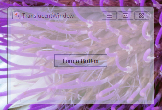
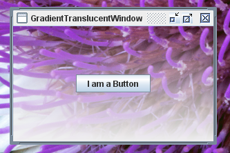
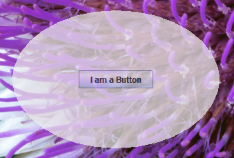

# 如何创建半透明和形状的 Windows

> 原文： [https://docs.oracle.com/javase/tutorial/uiswing/misc/trans_shaped_windows.html](https://docs.oracle.com/javase/tutorial/uiswing/misc/trans_shaped_windows.html)

从 Java 平台标准版 6（Java SE 6）更新版本 10 开始，您可以为 Swing 应用程序添加半透明和整形窗口。此页面包含以下主题：

*   [支持的功能](#supported)
*   [确定平台的能力](#capability)
*   [如何实现统一半透明](#uniform)
*   [如何实现每像素半透明](#per-pixel)
*   [如何实现形状窗口](#shaped)
*   [Java SE Release 6 Update 10 API](#6u10)

此功能是 JDK 7 发行版中公共 AWT 包的一部分，有三种形式，如下所示：

*   You can create a window with _uniform_ translucency, where each pixel has the same translucency (or alpha) value. The following screen capture shows a window with 45 percent translucency.

    

    * * *

    **Try this:** 

    单击“启动”按钮以使用 [Java™Web Start](http://www.oracle.com/technetwork/java/javase/javawebstart/index.html) 运行 TranslucentWindowDemo 示例。此示例需要 [JDK 7](http://www.oracle.com/technetwork/java/javase/downloads/index.html) 或更高版本。或者，要自己编译并运行示例，请参考[示例索引](../examples/misc/index.html#TranslucentWindowDemo)。

    [](https://docs.oracle.com/javase/tutorialJWS/samples/uiswing/TranslucentWindowDemoProject/TranslucentWindowDemo.jnlp)

    * * *

*   You can create a window with _per-pixel_ translucency, where each pixel has its own alpha value. With this feature you can, for example, create a window that fades away to nothing by defining a gradient in the alpha values. The following screen capture shows a window with gradient translucency from the top (fully translucent) to the bottom (fully opaque).

    

    * * *

    **Try this:** 

    单击“启动”按钮以使用 [Java™Web Start](http://www.oracle.com/technetwork/java/javase/javawebstart/index.html) 运行 GradientTranslucentWindowDemo 示例。此示例需要 [JDK 7](http://www.oracle.com/technetwork/java/javase/downloads/index.html) 或更高版本。或者，要自己编译并运行示例，请参考[示例索引](../examples/misc/index.html#GradientTranslucentWindowDemo)。

    [](https://docs.oracle.com/javase/tutorialJWS/samples/uiswing/GradientTranslucentWindowDemoProject/GradientTranslucentWindowDemo.jnlp)

    * * *

*   You can create a window with any `Shape` object that you can define. Shaped windows can be opaque, or they can use uniform, or per-pixel, translucency. The following screen capture shows an oval-shaped window with 30 percent translucency.

    

    * * *

    **Try this:** 

    单击“启动”按钮以使用 [Java™Web Start](http://www.oracle.com/technetwork/java/javase/javawebstart/index.html) 运行 ShapedWindowDemo 示例。此示例需要 [JDK 7](http://www.oracle.com/technetwork/java/javase/downloads/index.html) 或更高版本。或者，要自己编译并运行示例，请参考[示例索引](../examples/misc/index.html#ShapedWindowDemo)。

    [](https://docs.oracle.com/javase/tutorialJWS/samples/uiswing/TranslucentWindowDemoProject/TranslucentWindowDemo.jnlp)

    * * *

Not all platforms support all of these capabilities. An `UnsupportedOperationException` exception is thrown when code attempts to invoke the `setShape` or `setOpacity` methods on a platform that does not support these capabilities. Therefore, it is best practice to first check that the platform supports the capability that you want to implement. The `GraphicsDevice` class provides the [`isWindowTranslucencySupported(GraphicsDevice.WindowTranslucency)`](https://docs.oracle.com/javase/8/docs/api/java/awt/GraphicsDevice.html#isWindowTranslucencySupported-java.awt.GraphicsDevice.WindowTranslucency-) method that you can use for this purpose. You pass one of three enum values, defined in [`GraphicsDevice.WindowTranslucency`](https://docs.oracle.com/javase/8/docs/api/java/awt/GraphicsDevice.WindowTranslucency.html), to this method:

*   `TRANSLUCENT` - 底层平台支持具有统一半透明度的窗口，其中每个像素具有相同的 alpha 值。
*   `PERPIXEL_TRANSLUCENT` - 底层平台支持每像素半透明的窗口。实现消失的窗口需要此功能。
*   `PERPIXEL_TRANSPARENT` - 底层平台支持异形窗口。

The `GraphicsConfiguration` class also provides the [`isTranslucencyCapable`](https://docs.oracle.com/javase/8/docs/api/java/awt/GraphicsConfiguration.html#isTranslucencyCapable--) method to determine if `PERPIXEL_TRANSLUCENT` translucency is supported by the given `GraphicsConfiguration` object.

* * *

**Version note:** The translucent and shaped window API was first added to the Java SE 6 Update 10 release as a private API. This functionality was moved to the public AWT package in the JDK 7 release. This tutorial describes the API that is available in the JDK 7 release. See [Java SE 6 Update 10 API](#6u10) for a mapping of the private API in the Java SE 6 Update 10 release to the public API in the JDK 7 release.

* * *

The following code shows how to check for all three capabilities:

```
import static java.awt.GraphicsDevice.WindowTranslucency.*;

// Determine what the default GraphicsDevice can support.
GraphicsEnvironment ge =
    GraphicsEnvironment.getLocalGraphicsEnvironment();
GraphicsDevice gd = ge.getDefaultScreenDevice();

boolean isUniformTranslucencySupported =
    gd.isWindowTranslucencySupported(TRANSLUCENT);
boolean isPerPixelTranslucencySupported =
    gd.isWindowTranslucencySupported(PERPIXEL_TRANSLUCENT);
boolean isShapedWindowSupported =
    gd.isWindowTranslucencySupported(PERPIXEL_TRANSPARENT);

```

* * *

**Note:** None of these capabilities work on windows in full-screen mode. Invoking any of the relevant methods while in full-screen mode causes an `IllegalComponentStateException` exception to be thrown.

* * *

You can create a window where each pixel has the same translucency by invoking the [`setOpacity(float)`](https://docs.oracle.com/javase/8/docs/api/java/awt/Window.html#setOpacity-float-) method in the `Window` class. The `float` argument passed to this method represents the translucency of the window and should be a value between 0 and 1, inclusive. The smaller the number, the more transparent the window. There is also a corresponding [`getOpacity`](https://docs.oracle.com/javase/8/docs/api/java/awt/Window.html#getOpacity--) method.

[``TranslucentWindowDemo.java`` ](../examples/misc/TranslucentWindowDemoProject/src/misc/TranslucentWindowDemo.java)示例创建一个 55％不透明（45％半透明）的窗口。如果底层平台不支持半透明窗口，则示例退出。与不透明度相关的代码以粗体显示。

```
import java.awt.*;
import javax.swing.*;
import static java.awt.GraphicsDevice.WindowTranslucency.*;

public class TranslucentWindowDemo extends JFrame {
    public TranslucentWindowDemo() {
        super("TranslucentWindow");
        setLayout(new GridBagLayout());

        setSize(300,200);
        setLocationRelativeTo(null);
        setDefaultCloseOperation(JFrame.EXIT_ON_CLOSE);

        //Add a sample button.
        add(new JButton("I am a Button"));
    }

    public static void main(String[] args) {
        // Determine if the GraphicsDevice supports translucency.
        GraphicsEnvironment ge = 
            GraphicsEnvironment.getLocalGraphicsEnvironment();
        GraphicsDevice gd = ge.getDefaultScreenDevice();

        //If translucent windows aren't supported, exit.
        if (!gd.isWindowTranslucencySupported(TRANSLUCENT)) {
            System.err.println(
                "Translucency is not supported");
                System.exit(0);
        }

        JFrame.setDefaultLookAndFeelDecorated(true);

        // Create the GUI on the event-dispatching thread
        SwingUtilities.invokeLater(new Runnable() {
            @Override
            public void run() {
                TranslucentWindowDemo tw = new TranslucentWindowDemo();

                // Set the window to 55% opaque (45% translucent).
                tw.setOpacity(0.55f);

                // Display the window.
                tw.setVisible(true);
            }
        });
    }
}

```

请注意，该按钮也受均匀半透明度的影响。设置不透明度会影响整个窗口，包括窗口包含的任何组件。

Creating a window that uses per-pixel translucency involves defining alpha values over the rectangular area that the window occupies. When a pixel's alpha value is zero, that pixel is fully transparent. When a pixel's alpha value is 255, that pixel is fully opaque. When a pixel's alpha value is 128, that pixel is 50 percent translucent, and so on. An easy way to create a smooth interpolation between alpha values is to use the [`GradientPaint`](https://docs.oracle.com/javase/8/docs/api/java/awt/GradientPaint.html) class. The included example uses this approach.

在窗口上调用 [`setBackground(new Color(0,0,0,0))`](https://docs.oracle.com/javase/8/docs/api/java/awt/Window.html#setBackground-java.awt.Color-) 会导致软件使用 alpha 值来渲染每像素半透明度。实际上，调用`setBackground(new Color(0,0,0,alpha)`，其中`alpha`小于 255，安装每像素透明度。因此，如果您调用`setBackground(new Color(0,0,0,128))`而不执行任何其他操作，则会为每个背景像素渲染 50％半透明度的窗口。但是，如果要创建自己的 alpha 值范围，则很可能需要 alpha 值为 0。

虽然公共 API 不禁止，但您通常希望在未修饰的窗口上启用每像素半透明。在大多数情况下，在装饰窗口上使用每像素半透明度是没有意义的。这样做可以禁用装饰，或导致其他平台相关的副作用。

要确定窗口是否使用每像素半透明，可以使用 [`isOpaque`](https://docs.oracle.com/javase/8/docs/api/java/awt/Window.html#isOpaque--) 方法。

一个例子如下。首先，以下是实现示例所需的步骤：

1.  在窗口上调用`setBackground(new Color(0,0,0,0))`。
2.  创建覆盖`paintComponent`方法的`JPanel`实例。
3.  在`paintComponent`方法中，创建`GradientPaint`实例。
4.  在该示例中，矩形的顶部的 alpha 值为 0（最透明），底部的 alpha 值为 255（最不透明）。 `GradientPaint`类平滑地插入矩形顶部到底部的 alpha 值。
5.  将`GradientPaint`实例设置为面板的绘制方法。

这是 [``GradientTranslucentWindowDemo.java``](../examples/misc/GradientTranslucentWindowDemoProject/src/misc/GradientTranslucentWindowDemo.java)示例的代码。如果底层平台不支持每像素半透明，则此示例退出。与创建渐变窗口有关的代码以粗体显示。

```
import java.awt.*;
import javax.swing.*;
import static java.awt.GraphicsDevice.WindowTranslucency.*;

public class GradientTranslucentWindowDemo extends JFrame {
    public GradientTranslucentWindowDemo() {
        super("GradientTranslucentWindow");

        setBackground(new Color(0,0,0,0));
        setSize(new Dimension(300,200));
        setLocationRelativeTo(null);
        setDefaultCloseOperation(JFrame.EXIT_ON_CLOSE);

        JPanel panel = new JPanel() {
            @Override
            protected void paintComponent(Graphics g) {
                if (g instanceof Graphics2D) {
                    final int R = 240;
                    final int G = 240;
                    final int B = 240;

                    Paint p =
                        new GradientPaint(0.0f, 0.0f, new Color(R, G, B, 0),
                            0.0f, getHeight(), new Color(R, G, B, 255), true);
                    Graphics2D g2d = (Graphics2D)g;
                    g2d.setPaint(p);
                    g2d.fillRect(0, 0, getWidth(), getHeight());
                }
            }
        };
        setContentPane(panel);
        setLayout(new GridBagLayout());
        add(new JButton("I am a Button"));
    }

    public static void main(String[] args) {
        // Determine what the GraphicsDevice can support.
        GraphicsEnvironment ge = 
            GraphicsEnvironment.getLocalGraphicsEnvironment();
        GraphicsDevice gd = ge.getDefaultScreenDevice();
        boolean isPerPixelTranslucencySupported = 
            gd.isWindowTranslucencySupported(PERPIXEL_TRANSLUCENT);

        //If translucent windows aren't supported, exit.
        if (!isPerPixelTranslucencySupported) {
            System.out.println(
                "Per-pixel translucency is not supported");
                System.exit(0);
        }

        JFrame.setDefaultLookAndFeelDecorated(true);

        // Create the GUI on the event-dispatching thread
        SwingUtilities.invokeLater(new Runnable() {
            @Override
            public void run() {
                GradientTranslucentWindowDemo gtw = new
                    GradientTranslucentWindowDemo();

                // Display the window.
                gtw.setVisible(true);
            }
        });
    }
}

```

请注意，该按钮不受每像素半透明度的影响。设置每像素半透明度仅影响背景像素。如果您想要一个仅对背景像素具有均匀半透明效果的窗口，则可以调用`setBackground(new Color(0,0,0,alpha))`，其中`alpha`指定所需的半透明度。

You can create a shaped window by invoking the [`setShape(Shape)`](https://docs.oracle.com/javase/8/docs/api/java/awt/Window.html#setShape-java.awt.Shape-) method in the `Window` class. The `Shape` argument that is passed to the method determines how the window is clipped. When a shape is set on a window, the window decorations are not re-formed to the new shape, so setting a shape works best on undecorated windows.

设置窗口形状的最佳做法是在组件事件侦听器的`componentResized`方法中调用`setShape`。此练习将确保根据窗口的实际大小正确计算形状。以下示例使用此方法。

[``ShapedWindowDemo.java`` ](../examples/misc/ShapedWindowDemoProject/src/misc/ShapedWindowDemo.java)示例创建一个椭圆形窗口，不透明度为 70％。如果底层平台不支持异形窗口，则示例退出。如果底层平台不支持半透明，则该示例使用标准的不透明窗口。您可以修改此示例以创建也使用每像素半透明度的整形窗口。

与窗口整形相关的代码以粗体显示。

```
import java.awt.*;
import java.awt.event.*;
import javax.swing.*;
import java.awt.geom.Ellipse2D;
import static java.awt.GraphicsDevice.WindowTranslucency.*;

public class ShapedWindowDemo extends JFrame {
    public ShapedWindowDemo() {
        super("ShapedWindow");
        setLayout(new GridBagLayout());

        // It is best practice to set the window's shape in
        // the componentResized method.  Then, if the window
        // changes size, the shape will be correctly recalculated.
        addComponentListener(new ComponentAdapter() {
            // Give the window an elliptical shape.
            // If the window is resized, the shape is recalculated here.
            @Override
            public void componentResized(ComponentEvent e) {
                setShape(new Ellipse2D.Double(0,0,getWidth(),getHeight()));
            }
        });

        setUndecorated(true);
        setSize(300,200);
        setLocationRelativeTo(null);
        setDefaultCloseOperation(JFrame.EXIT_ON_CLOSE);

        add(new JButton("I am a Button"));
    }

    public static void main(String[] args) {
        // Determine what the GraphicsDevice can support.
        GraphicsEnvironment ge = 
            GraphicsEnvironment.getLocalGraphicsEnvironment();
        GraphicsDevice gd = ge.getDefaultScreenDevice();
        final boolean isTranslucencySupported = 
            gd.isWindowTranslucencySupported(TRANSLUCENT);

        //If shaped windows aren't supported, exit.
        if (!gd.isWindowTranslucencySupported(PERPIXEL_TRANSPARENT)) {
            System.err.println("Shaped windows are not supported");
            System.exit(0);
        }

        //If translucent windows aren't supported, 
        //create an opaque window.
        if (!isTranslucencySupported) {
            System.out.println(
                "Translucency is not supported, creating an opaque window");
        }

        // Create the GUI on the event-dispatching thread
        SwingUtilities.invokeLater(new Runnable() {
            @Override
            public void run() {
                ShapedWindowDemo sw = new ShapedWindowDemo();

                // Set the window to 70% translucency, if supported.
                if (isTranslucencySupported) {
                    sw.setOpacity(0.7f);
                }

                // Display the window.
                sw.setVisible(true);
            }
        });
    }
}

```

Changing the public API in an update release is not allowed, so when the translucent and shaped windows capability was added to the Java SE 6 Update 10 release, it was implemented in the private `com.sun.awt.AWTUtilities` class. For the JDK 7 release, this functionality was moved to the public AWT package. The following table shows how the private methods map to the public methods.

| Java SE 6 Update 10 中的方法 | JDK 7 等效 |
| --- | --- |
| `AWTUtilities.isTranslucencySupported(Translucency)` | `GraphicsDevice.isWindowTranslucencySupported(WindowTranslucency)` |
| `AWTUtilities.isTranslucencyCapable(GraphicsConfiguration)` | `GraphicsConfiguration.isTranslucencyCapable()` |
| `AWTUtilities.setWindowOpacity(Window, float)` | `Window.setOpacity(float)` |
| `AWTUtilities.setWindowShape(Window, Shape)` | `Window.setShape(Shape)` |
| `AWTUtilities.setWindowOpaque(boolean)` | `Window.setBackground(Color)`将`new Color(0,0,0,alpha)`传递给此方法，其中`alpha`小于 255，安装每像素半透明度。 |