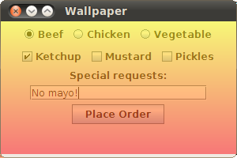
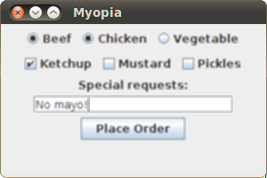
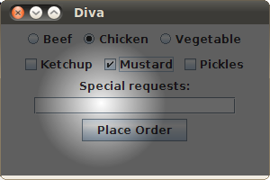
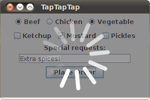
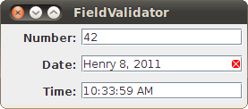

# 如何使用 JLayer 类装饰组件

> 原文： [https://docs.oracle.com/javase/tutorial/uiswing/misc/jlayer.html](https://docs.oracle.com/javase/tutorial/uiswing/misc/jlayer.html)

`JLayer`类是 Swing 组件的灵活且强大的*装饰器*。它使您能够在不修改底层组件的情况下绘制组件并响应组件事件。

本文档描述了显示`JLayer`类功能的示例。完整的源代码可用。

*   [使用`JLayer`类](#using)
*   [使用`LayerUI`类](#layerui)
*   [借鉴组件](#drawing)
*   [回应事件](#events)
*   [动画指示灯](#animating)
*   [验证文本字段](#validation)

有关此页面上材料的简要介绍，请观看以下视频。

&lt;iframe frameborder="1" height="349" longdesc="a video on youtube that demonstrates the capabilities of the jlayer component" src="http://www.youtube.com/embed/6mQYsWCkx4g" title="Using JLayer in Swing Applications" width="560"&gt;&lt;/iframe&gt;

视频需要支持 JavaScript 的 Web 浏览器和 Internet 连接。如果您看不到该视频，请尝试[在 YouTube](http://www.youtube.com/watch?v=6mQYsWCkx4g) 上观看。

`javax.swing.JLayer`级是团队的一半。另一半是`javax.swing.plaf.LayerUI`级。假设你想在`JButton`对象上做一些自定义绘图（*装饰 _ `JButton`对象）。您要装饰的组件是*目标*。

*   创建目标组件。
*   创建`LayerUI`子类的实例以进行绘制。
*   创建一个包裹目标和`LayerUI`对象的`JLayer`对象。
*   使用用户界面中的`JLayer`对象就像使用目标组件一样。

例如，要将`JPanel`子类的实例添加到`JFrame`对象，您可以执行与此类似的操作：

```java
JFrame f = new JFrame();

JPanel panel = createPanel();

f.add (panel);

```

要装饰`JPanel`对象，请执行与此类似的操作：

```java
JFrame f = new JFrame();

JPanel panel = createPanel();
LayerUI<JPanel> layerUI = new MyLayerUISubclass();
JLayer<JPanel> jlayer = new JLayer<JPanel>(panel, layerUI);

f.add (jlayer);

```

使用泛型可确保`JPanel`对象和`LayerUI`对象用于兼容类型。在前面的示例中，`JLayer`对象和`LayerUI`对象都与`JPanel`类一起使用。

`JLayer`类通常使用其视图组件的确切类型进行生成，而`LayerUI`类旨在与其通用参数或其任何祖先的`JLayer`类一起使用。

例如，`LayerUI&lt;JComponent>`对象可以与`JLayer&lt;AbstractButton>`对象一起使用。

`LayerUI`对象负责`JLayer`对象的自定义装饰和事件处理。当您创建`LayerUI`子类的实例时，您的自定义行为可适用于具有适当泛型类型的每个`JLayer`对象。这就是`JLayer`类是`final`的原因;所有自定义行为都封装在`LayerUI`子类中，因此不需要创建`JLayer`子类。

`LayerUI`类从`ComponentUI`类继承其大部分行为。以下是最常被覆盖的方法：

*   需要绘制目标组件时调用`paint(Graphics g, JComponent c)`方法。要以与 Swing 呈现它相同的方式呈现组件，请调用`super.paint(g, c)`方法。
*   当`LayerUI`子类的实例与组件关联时，将调用`installUI(JComponent c)`方法。在此执行任何必要的初始化。传入的组件是相应的`JLayer`对象。使用`JLayer`类'`getView()`方法检索目标组件。
*   当`LayerUI`子类的实例不再与给定组件关联时，将调用`uninstallUI(JComponent c)`方法。如有必要，请在这里清理。

要使用`JLayer`类，需要一个好的`LayerUI`子类。最简单的`LayerUI`类改变了组件的绘制方式。例如，这是一个在组件上绘制透明颜色渐变的图形。

```java
class WallpaperLayerUI extends LayerUI<JComponent> {
  @Override
  public void paint(Graphics g, JComponent c) {
    super.paint(g, c);

    Graphics2D g2 = (Graphics2D) g.create();

    int w = c.getWidth();
    int h = c.getHeight();
    g2.setComposite(AlphaComposite.getInstance(
            AlphaComposite.SRC_OVER, .5f));
    g2.setPaint(new GradientPaint(0, 0, Color.yellow, 0, h, Color.red));
    g2.fillRect(0, 0, w, h);

    g2.dispose();
  }
}

```

`paint()`方法是进行自定义绘图的地方。对`super.paint()`方法的调用绘制了`JPanel`对象的内容。设置 50％透明复合材料后，绘制颜色渐变。

在定义`LayerUI`子类之后，使用它很简单。以下是一些使用`WallpaperLayerUI`类的源代码：

```java
import java.awt.*;
import javax.swing.*;
import javax.swing.plaf.LayerUI;

public class Wallpaper {
  public static void main(String[] args) {
    javax.swing.SwingUtilities.invokeLater(new Runnable() {
      public void run() {
        createUI();
      }
    });
  }

  public static void createUI() {
    JFrame f = new JFrame("Wallpaper");

    JPanel panel = createPanel();
    LayerUI<JComponent> layerUI = new WallpaperLayerUI();
    JLayer<JComponent> jlayer = new JLayer<JComponent>(panel, layerUI);

    f.add (jlayer);

    f.setSize(300, 200);
    f.setDefaultCloseOperation (JFrame.EXIT_ON_CLOSE);
    f.setLocationRelativeTo (null);
    f.setVisible (true);
  }

  private static JPanel createPanel() {
    JPanel p = new JPanel();

    ButtonGroup entreeGroup = new ButtonGroup();
    JRadioButton radioButton;
    p.add(radioButton = new JRadioButton("Beef", true));
    entreeGroup.add(radioButton);
    p.add(radioButton = new JRadioButton("Chicken"));
    entreeGroup.add(radioButton);
    p.add(radioButton = new JRadioButton("Vegetable"));
    entreeGroup.add(radioButton);

    p.add(new JCheckBox("Ketchup"));
    p.add(new JCheckBox("Mustard"));
    p.add(new JCheckBox("Pickles"));

    p.add(new JLabel("Special requests:"));
    p.add(new JTextField(20));

    JButton orderButton = new JButton("Place Order");
    p.add(orderButton);

    return p;
  }
}

```

结果如下：



源代码：

[`Wallpaper NetBeans Project`](../examples/zipfiles/misc-WallpaperProject.zip)

[`Wallpaper.java`](../examples/misc/WallpaperProject/src/Wallpaper.java)

使用 [Java Web Start](http://www.oracle.com/technetwork/java/javase/javawebstart/index.html) 运行：

[](https://docs.oracle.com/javase/tutorialJWS/samples/uiswing/WallpaperProject/Wallpaper.jnlp)

`LayerUI`类'`paint()`方法使您可以完全控制如何绘制组件。这是另一个`LayerUI`子类，它显示了如何使用 Java 2D 图像处理修改面板的整个内容：

```java
class BlurLayerUI extends LayerUI<JComponent> {
  private BufferedImage mOffscreenImage;
  private BufferedImageOp mOperation;

  public BlurLayerUI() {
    float ninth = 1.0f / 9.0f;
    float[] blurKernel = {
      ninth, ninth, ninth,
      ninth, ninth, ninth,
      ninth, ninth, ninth
    };
    mOperation = new ConvolveOp(
            new Kernel(3, 3, blurKernel),
            ConvolveOp.EDGE_NO_OP, null);
  }

  @Override
  public void paint (Graphics g, JComponent c) {
    int w = c.getWidth();
    int h = c.getHeight();

    if (w == 0 || h == 0) {
      return;
    }

    // Only create the offscreen image if the one we have
    // is the wrong size.
    if (mOffscreenImage == null ||
            mOffscreenImage.getWidth() != w ||
            mOffscreenImage.getHeight() != h) {
      mOffscreenImage = new BufferedImage(w, h, BufferedImage.TYPE_INT_RGB);
    }

    Graphics2D ig2 = mOffscreenImage.createGraphics();
    ig2.setClip(g.getClip());
    super.paint(ig2, c);
    ig2.dispose();

    Graphics2D g2 = (Graphics2D)g;
    g2.drawImage(mOffscreenImage, mOperation, 0, 0);
  }
}

```

在`paint()`方法中，面板渲染为屏幕外图像。使用卷积运算符处理屏幕外图像，然后将其绘制到屏幕上。

整个用户界面仍然有效，只是模糊：



源代码：

[`Myopia NetBeans Project`](../examples/zipfiles/misc-MyopiaProject.zip)

[`Myopia.java`](../examples/misc/MyopiaProject/src/Myopia.java)

使用 [Java Web Start](http://www.oracle.com/technetwork/java/javase/javawebstart/index.html) 运行：

[](https://docs.oracle.com/javase/tutorialJWS/samples/uiswing/MyopiaProject/Myopia.jnlp)

您的`LayerUI`子类也可以接收其相应组件的所有事件。但是，`JLayer`实例必须注册其对特定类型事件的兴趣。这种情况发生在`JLayer`类'`setLayerEventMask()`方法中。但是，通常，此调用是在`LayerUI`类'`installUI()`方法中执行的初始化。

例如，以下摘录显示了`LayerUI`子类的一部分，它注册接收鼠标和鼠标运动事件。

```java
public void installUI(JComponent c) {
  super.installUI(c);
  JLayer jlayer = (JLayer)c;
  jlayer.setLayerEventMask(
    AWTEvent.MOUSE_EVENT_MASK |
    AWTEvent.MOUSE_MOTION_EVENT_MASK
  );
}

```

进入`JLayer`子类的所有事件都将路由到名称与事件类型匹配的事件处理器方法。例如，您可以通过覆盖相应的方法来响应鼠标和鼠标运动事件：

```java
protected void processMouseEvent(MouseEvent e, JLayer l) {
  // ...
}

protected void processMouseMotionEvent(MouseEvent e, JLayer l) {
  // ...
}

```

以下是`LayerUI`子类，在鼠标在面板内移动的任何地方绘制半透明圆。

```java
class SpotlightLayerUI extends LayerUI<JPanel> {
  private boolean mActive;
  private int mX, mY;

  @Override
  public void installUI(JComponent c) {
    super.installUI(c);
    JLayer jlayer = (JLayer)c;
    jlayer.setLayerEventMask(
      AWTEvent.MOUSE_EVENT_MASK |
      AWTEvent.MOUSE_MOTION_EVENT_MASK
    );
  }

  @Override
  public void uninstallUI(JComponent c) {
    JLayer jlayer = (JLayer)c;
    jlayer.setLayerEventMask(0);
    super.uninstallUI(c);
  }

  @Override
  public void paint (Graphics g, JComponent c) {
    Graphics2D g2 = (Graphics2D)g.create();

    // Paint the view.
    super.paint (g2, c);

    if (mActive) {
      // Create a radial gradient, transparent in the middle.
      java.awt.geom.Point2D center = new java.awt.geom.Point2D.Float(mX, mY);
      float radius = 72;
      float[] dist = {0.0f, 1.0f};
      Color[] colors = {new Color(0.0f, 0.0f, 0.0f, 0.0f), Color.BLACK};
      RadialGradientPaint p =
          new RadialGradientPaint(center, radius, dist, colors);
      g2.setPaint(p);
      g2.setComposite(AlphaComposite.getInstance(
          AlphaComposite.SRC_OVER, .6f));
      g2.fillRect(0, 0, c.getWidth(), c.getHeight());
    }

    g2.dispose();
  }

  @Override
  protected void processMouseEvent(MouseEvent e, JLayer l) {
    if (e.getID() == MouseEvent.MOUSE_ENTERED) mActive = true;
    if (e.getID() == MouseEvent.MOUSE_EXITED) mActive = false;
    l.repaint();
  }

  @Override
  protected void processMouseMotionEvent(MouseEvent e, JLayer l) {
    Point p = SwingUtilities.convertPoint(e.getComponent(), e.getPoint(), l);
    mX = p.x;
    mY = p.y;
    l.repaint();
  }
}

```

`mActive`变量指示鼠标是否在面板坐标内。在`installUI()`方法中，调用`setLayerEventMask()`方法以指示`LayerUI`子类对接收鼠标和鼠标运动事件的兴趣。

在`processMouseEvent()`方法中，根据鼠标的位置设置`mActive`标志。在`processMouseMotionEvent()`方法中，鼠标移动的坐标存储在`mX`和`mY`成员变量中，以便稍后可以在`paint()`方法中使用它们。

`paint()`方法显示面板的默认外观，然后覆盖聚光灯效果的径向渐变：



源代码：

[`Diva NetBeans Project`](../examples/zipfiles/misc-DivaProject.zip)

[`Diva.java`](../examples/misc/DivaProject/src/Diva.java)

使用 [Java Web Start](http://www.oracle.com/technetwork/java/javase/javawebstart/index.html) 运行：

[](https://docs.oracle.com/javase/tutorialJWS/samples/uiswing/DivaProject/Diva.jnlp)

此示例是动画繁忙指示符。它演示了`LayerUI`子类中的动画，并具有淡入和淡出功能。前面的例子比较复杂，但它基于定义自定义绘图的`paint()`方法的相同原理。

单击**下订单**按钮，查看忙碌指示 4 秒钟。注意面板是如何变灰并且指示器旋转。指标的要素具有不同的透明度。

`LayerUI`子类`WaitLayerUI`类显示了如何触发属性更改事件以更新组件。 `WaitLayerUI`类使用`Timer`对象每秒 24 次更新其状态。这发生在计时器的目标方法`actionPerformed()`方法中。

`actionPerformed()`方法使用`firePropertyChange()`方法指示内部状态已更新。这会触发对`applyPropertyChange()`方法的调用，该方法重新绘制`JLayer`对象：



源代码：

[`TapTapTap NetBeans Project`](../examples/zipfiles/misc-TapTapTapProject.zip)

[`TapTapTap.java`](../examples/misc/TapTapTapProject/src/TapTapTap.java)

使用 [Java Web Start](http://www.oracle.com/technetwork/java/javase/javawebstart/index.html) 运行：

[](https://docs.oracle.com/javase/tutorialJWS/samples/uiswing/TapTapTapProject/TapTapTap.jnlp)

本文档的最后一个示例显示了如何使用`JLayer`类来装饰文本字段以显示它们是否包含有效数据。虽然其他示例使用`JLayer`类来包装面板或常规组件，但此示例显示了如何专门包装`JFormattedTextField`组件。它还演示了单个`LayerUI`子类实现可用于多个`JLayer`实例。

`JLayer`类用于为具有无效数据的字段提供可视指示。当`ValidationLayerUI`类绘制文本字段时，如果无法解析字段内容，则会绘制红色 X.这是一个例子：



源代码：

[`FieldValidator NetBeans Project`](../examples/zipfiles/misc-FieldValidatorProject.zip)

[`FieldValidator.java`](../examples/misc/FieldValidatorProject/src/FieldValidator.java)

使用 [Java Web Start](http://www.oracle.com/technetwork/java/javase/javawebstart/index.html) 运行：

[](https://docs.oracle.com/javase/tutorialJWS/samples/uiswing/FieldValidatorProject/FieldValidator.jnlp)