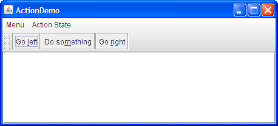
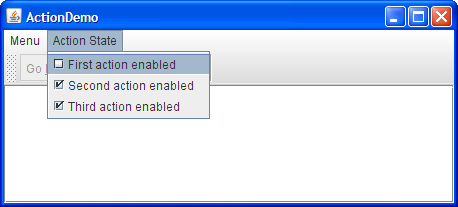
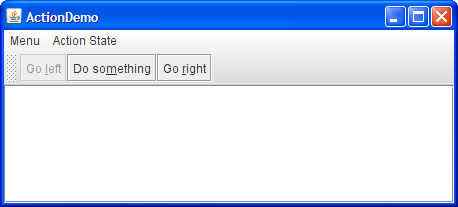

# 如何使用动作

> 原文： [https://docs.oracle.com/javase/tutorial/uiswing/misc/action.html](https://docs.oracle.com/javase/tutorial/uiswing/misc/action.html)

[`Action`](https://docs.oracle.com/javase/8/docs/api/javax/swing/Action.html) 可用于将功能和状态与组件分开。例如，如果您有两个或多个执行相同功能的组件，请考虑使用`Action`对象来实现该功能。 `Action`对象是[动作监听器](../events/actionlistener.html)，它不仅提供动作事件处理，还集中处理动作状态 - 事件触发组件，如[工具栏按钮](../components/toolbar.html)， [菜单项](../components/menu.html)，[常用按钮](../components/button.html)和[文本字段](../components/textfield.html)。操作可以处理的状态包括文本，图标，助记符，已启用和已选择状态。

您通常使用`setAction`方法将操作附加到组件。以下是在组件上调用`setAction`时发生的情况：

*   更新组件的状态以匹配`Action`的状态。例如，如果设置了`Action`的文本和图标值，则组件的文本和图标将设置为这些值。
*   `Action`对象在组件上注册为动作侦听器。
*   如果`Action`的状态发生变化，则更新组件的状态以匹配`Action`。例如，如果更改操作的启用状态，则其附加的所有组件将更改其启用状态以匹配操作。

以下是创建执行相同功能的工具栏按钮和菜单项的示例：

```
Action leftAction = new LeftAction(); //LeftAction code is shown later
...
button = new JButton(leftAction)
...
menuItem = new JMenuItem(leftAction);

```

要创建`Action`对象，通常要创建 [`AbstractAction`](https://docs.oracle.com/javase/8/docs/api/javax/swing/AbstractAction.html) 的子类，然后实例化它。在子类中，必须实现`actionPerformed`方法，以便在发生操作事件时作出适当的反应。这是创建和实例化`AbstractAction`子类的示例：

```
leftAction = new LeftAction("Go left", anIcon,
             "This is the left button.",
             new Integer(KeyEvent.VK_L));
...
class LeftAction extends AbstractAction {
    public LeftAction(String text, ImageIcon icon,
                      String desc, Integer mnemonic) {
        super(text, icon);
        putValue(SHORT_DESCRIPTION, desc);
        putValue(MNEMONIC_KEY, mnemonic);
    }
    public void actionPerformed(ActionEvent e) {
        displayResult("Action for first button/menu item", e);
    }
}

```

当前面代码创建的操作附加到按钮和菜单项时，按钮和菜单项显示与操作关联的文本和图标。 `L`字符用于按钮和菜单项上的助记符，其工具提示文本设置为`SHORT_DESCRIPTION`字符串，后跟助记键的表示。

例如，我们提供了一个简单的例子， [`ActionDemo.java`](../examples/misc/ActionDemoProject/src/misc/ActionDemo.java) ，它定义了三个动作。每个操作都附加到按钮和菜单项。由于为每个按钮的动作设置了助记符值，按键顺序`Alt-L`激活左按钮，`Alt-M`激活中间按钮，`Alt-R`激活右按钮。左按钮的工具提示显示 _ 这是左按钮。 ALT-L。_ 所有这些配置都会自动发生，而程序不会显式调用来设置助记符或工具提示文本。正如我们稍后将要展示的那样，程序 _ 会 _ 调用来设置按钮文本，但只是为了避免使用已经由动作设置的值。



* * *

**Try this:** 

1.  单击“启动”按钮以使用 [Java™Web Start](http://www.oracle.com/technetwork/java/javase/javawebstart/index.html) （[下载 JDK 7 或更高版本](http://www.oracle.com/technetwork/java/javase/downloads/index.html)）运行 ActionDemo。或者，要自己编译并运行示例，请参考[示例索引](../examples/misc/index.html#ActionDemo)。

    [](https://docs.oracle.com/javase/tutorialJWS/samples/uiswing/ActionDemoProject/ActionDemo.jnlp)

2.  从左侧菜单中选择顶部项目（**菜单&gt;向左移动**）。
    文本区域显示一些文本，用于标识事件源和接收事件的动作侦听器。

3.  单击工具栏中最左侧的按钮。
    文本区域再次显示有关该事件的信息。请注意，尽管事件的来源不同，但两个事件都由同一个动作侦听器检测到：附加到组件的`Action`对象。

4.  从**动作状态**菜单中选择最上面的项目。
    这将禁用“左转”`Action`对象，该对象将禁用其关联的菜单项和按钮。

* * *

以下是用户在禁用“离开”操作时看到的内容：








这是禁用“左转”操作的代码：

```
boolean selected = ...//true if the action should be enabled;
                      //false, otherwise
leftAction.setEnabled(selected);

```

使用`Action`创建组件后，您可能需要自定义它们。例如，您可能希望通过添加或删除图标或文本来自定义其中一个组件的外观。例如， [`ActionDemo.java`](../examples/misc/ActionDemoProject/src/misc/ActionDemo.java) 的菜单中没有图标，按钮中没有文字。这是完成此任务的代码：

```
menuItem = new JMenuItem();
menuItem.setAction(leftAction);
menuItem.setIcon(null); //arbitrarily chose not to use icon in menu
...
button = new JButton();
button.setAction(leftAction);
button.setText(""); //an icon-only button

```

我们选择通过将 icon 属性设置为`null`并将文本设置为空字符串，从同一操作创建仅图标按钮和纯文本菜单项。但是，如果`Action`的属性发生更改，则窗口小部件可能会尝试再次从`Action`重置图标和文本。

下表列出了常用的`Action`构造函数和方法。使用`Action`对象的 API 分为三类：

*   [支持 set / getAction 的组件](#actioncomponents)
*   [创建和使用 AbstractAction](#actionapi)
*   [动作属性](#properties)


| 类 | 目的 |
| :-- | :-- |
| [AbstractButton](https://docs.oracle.com/javase/8/docs/api/javax/swing/AbstractButton.html#setAction-javax.swing.Action-)
[JComboBox](https://docs.oracle.com/javase/8/docs/api/javax/swing/JComboBox.html#setAction-javax.swing.Action-)
[JTextField](https://docs.oracle.com/javase/8/docs/api/javax/swing/JTextField.html#setAction-javax.swing.Action-) | 这些组件及其子类可以通过`setAction`直接分配给它们。有关通常与操作相关的组件的更多信息，请参阅[工具栏按钮](../components/toolbar.html)，[菜单项](../components/menu.html)，[常用按钮](../components/button.html)和[文本字段部分](../components/textfield.html)。有关每个组件从`Action`中获取哪些属性的详细信息，请参阅相关类 [`configurePropertiesFromAction`](https://docs.oracle.com/javase/8/docs/api/javax/swing/JMenuItem.html#configurePropertiesFromAction-javax.swing.Action-) 方法的 API 文档。另请参阅 [`buttonActions`](https://docs.oracle.com/javase/8/docs/api/javax/swing/Action.html#buttonActions) 表。 |


| 构造函数或方法 | 目的 |
| :-- | :-- |
| [AbstractAction（）](https://docs.oracle.com/javase/8/docs/api/javax/swing/AbstractAction.html#AbstractAction--)
[AbstractAction（String）](https://docs.oracle.com/javase/8/docs/api/javax/swing/AbstractAction.html#AbstractAction-java.lang.String-)
[AbstractAction（String，Icon）](https://docs.oracle.com/javase/8/docs/api/javax/swing/AbstractAction.html#AbstractAction-java.lang.String-javax.swing.Icon-) | 创建`Action`对象。通过参数，您可以指定要在操作附加到的组件中使用的文本和图标。 |
| [void setEnabled（boolean）](https://docs.oracle.com/javase/8/docs/api/javax/swing/AbstractAction.html#setEnabled-boolean-)
[boolean isEnabled（）](https://docs.oracle.com/javase/8/docs/api/javax/swing/AbstractAction.html#isEnabled--) | 设置或获取是否启用了操作控件的组件。调用`setEnabled(false)`会禁用操作控制的所有组件。同样，调用`setEnabled(true)`可启用操作的组件。 |
| [void putValue（String，Object）](https://docs.oracle.com/javase/8/docs/api/javax/swing/AbstractAction.html#putValue-java.lang.String-java.lang.Object-)
[Object getValue（String）](https://docs.oracle.com/javase/8/docs/api/javax/swing/AbstractAction.html#getValue-java.lang.String-) | 设置或获取与指定键关联的对象。用于设置和获取与操作关联的属性。 |

此表定义可以在操作上设置的属性。第二列列出了哪些组件自动使用这些属性（以及具体调用的方法）。例如，在随后附加到菜单项的操作上设置`ACCELERATOR_KEY`意味着自动调用`JMenuItem.setAccelerator(KeyStroke)`。

| 属性 | 自动应用于：
类
_（方法调用）_ | 目的 |
| :-- | :-- | :-- |
| [ACCELERATOR_KEY](https://docs.oracle.com/javase/8/docs/api/javax/swing/Action.html#ACCELERATOR_KEY) | `JMenuItem`
（ _setAccelerator_ ） | `KeyStroke`用作动作的加速器。有关加速器与助记符的讨论，请参阅[启用键盘操作。](../components/menu.html#mnemonic) |
| [ACTION_COMMAND_KEY](https://docs.oracle.com/javase/8/docs/api/javax/swing/Action.html#ACTION_COMMAND_KEY) | `AbstractButton`，`JCheckBox`，`JRadioButton`
（ _setActionCommand_ ） | 与`ActionEvent`关联的命令字符串。 |
| [LONG_DESCRIPTION](https://docs.oracle.com/javase/8/docs/api/javax/swing/Action.html#LONG_DESCRIPTION) | 没有 | 行动的描述时间越长。可用于上下文相关帮助。 |
| [MNEMONIC_KEY](https://docs.oracle.com/javase/8/docs/api/javax/swing/Action.html#MNEMONIC_KEY) | `AbstractButton`，`JMenuItem`，`JCheckBox`，`JRadioButton`
（ _setMnemonic_ ） | 行动的助记符。有关加速器与助记符的讨论，请参阅[启用键盘操作。](../components/menu.html#mnemonic) |
| [NAME](https://docs.oracle.com/javase/8/docs/api/javax/swing/Action.html#NAME) | `AbstractButton`，`JMenuItem`，`JCheckBox`，`JRadioButton`
（ _setText_ ） | 行动的名称。使用`AbstractAction(String)`或`AbstractAction(String, Icon)`构造函数创建操作时，可以设置此属性。 |
| [SHORT_DESCRIPTION](https://docs.oracle.com/javase/8/docs/api/javax/swing/Action.html#SHORT_DESCRIPTION) | `AbstractButton`，`JCheckBox`，`JRadioButton`
（ _setToolTipText_ ） | 行动的简短描述。 |
| [SMALL_ICON](https://docs.oracle.com/javase/8/docs/api/javax/swing/Action.html#SMALL_ICON) | `AbstractButton`，`JMenuItem`
（ _setIcon_ ） | 工具栏或按钮中使用的操作的图标。使用`AbstractAction(name, icon)`构造函数创建操作时，可以设置此属性。 |

以下示例使用`Action`对象。

| 例 | 在哪里描述 | 笔记 |
| :-- | :-- | :-- |
| [`ActionDemo`](../examples/misc/index.html#ActionDemo) | 这个部分 | 使用操作将按钮和菜单项绑定到同一个函数。 |
| [`TextComponentDemo`](../examples/components/index.html#TextComponentDemo) | [文本组件功能](../components/generaltext.html) | 使用文本操作为文本编辑命令创建菜单项，例如剪切，复制和粘贴，以及将键击绑定到插入符号移动。还实现自定义`AbstractAction`子类以实现撤消和重做。文本行动讨论开始于[概念：关于编辑器套件](../components/generaltext.html#editorkits)。 |