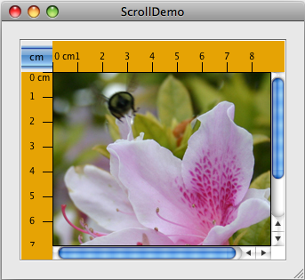
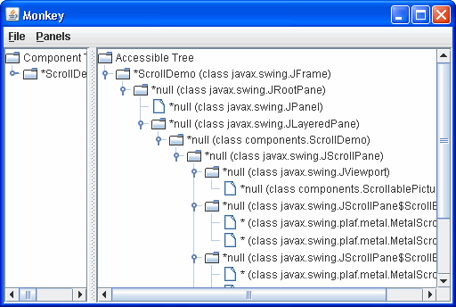
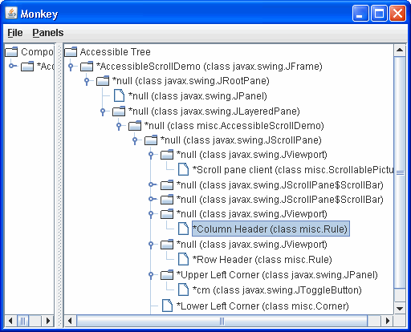
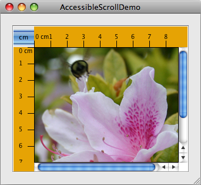
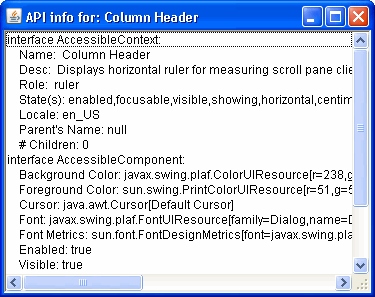
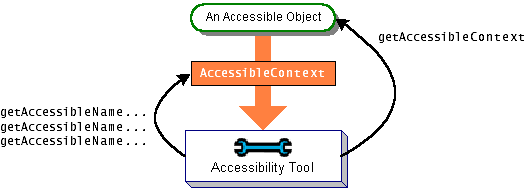

# 如何支持辅助技术

> 原文： [https://docs.oracle.com/javase/tutorial/uiswing/misc/access.html](https://docs.oracle.com/javase/tutorial/uiswing/misc/access.html)

您可能想知道究竟什么是辅助技术，以及您应该关注的原因。主要是，存在辅助技术以使具有永久或暂时残疾的人能够使用计算机。例如，如果您患有腕管综合症，您可以使用辅助技术来完成您的工作，而无需使用您的双手。

辅助技术 - 语音接口，屏幕阅读器，备用输入设备等 - 不仅适用于残障人士，也适用于在非办公环境中使用计算机的人员。例如，如果您遇到交通拥堵，您可以使用辅助技术来检查您的电子邮件，仅使用语音输入和输出。支持辅助技术的信息也可用于其他工具，例如自动 GUI 测试仪和输入设备（如触摸屏）。辅助技术使用辅助功能 API 从组件获取信息，辅助功能 API 在 [`javax.accessibility`](https://docs.oracle.com/javase/8/docs/api/javax/accessibility/package-summary.html) 包中定义。

因为可以在 Swing 组件中内置对 Accessibility API 的支持，所以即使您没有做任何特殊的事情，您的 Swing 程序也可以与辅助技术一起使用。例如，辅助技术可以自动获取由以下代码行设置的文本信息：

```java
JButton button = new JButton("I'm a Swing button!");
label = new JLabel(labelPrefix + "0    ");
label.setText(labelPrefix + numClicks);
JFrame frame = new JFrame("SwingApplication");

```

辅助技术还可以获取与组件关联的工具提示文本（如果有），并使用它来向用户描述组件。

使用辅助技术使您的程序顺利运行很容易，而在美国，联邦法律可能要求您这样做。

本节的其余部分将介绍以下主题：

*   [支持无障碍规则](#supporting)
*   [无障碍测试](#testing)
*   [在组件上设置可访问的名称和描述](#namesdescriptions)
*   [概念：可访问性的工作原理](#developing)
*   [使自定义组件可访问](#accessiblecomponents)
*   [辅助功能 API](#api)
*   [使用辅助功能 API](#eg) 的示例

您可以通过以下一些方法使您的程序尽可能地与辅助技术一起工作：

*   如果组件未显示短字符串（用作其默认名称），请使用`setAccessibleName`方法指定名称。您可能希望对仅图像按钮，提供逻辑分组的面板，文本区域等执行此操作。
*   只要有意义，就可以为组件设置[工具提示](../components/tooltip.html)文本。例如：

    ```java
    aJComponent.setToolTipText(
         "Clicking this component causes XYZ to happen.");

    ```

*   如果您不想为组件提供工具提示，请使用`setAccessibleDescription`方法提供辅助技术可以为用户提供的说明。例如：

    ```java
    aJComponent.getAccessibleContext().
        setAccessibleDescription(
        "Clicking this component causes XYZ to happen.");

    ```

*   Specify keyboard alternatives wherever possible. Make sure you can use your program with only the keyboard. Try hiding your mouse! Note that if the focus is in an editable text component, you can use Shift-Tab to move focus to the next component.

    对键盘替代方案的支持因组件而异。 [按钮](../components/button.html)支持`setMnemonic`方法的键盘选择。菜单继承按钮助记符支持并且还支持加速器，如[启用键盘操作](../components/menu.html#mnemonic)中所述。其他组件可以使用[键绑定](../components/jcomponent.html#keyboardAction)将用户键入与程序操作相关联。

*   为文件中的所有 [`ImageIcon`](../components/icon.html) 对象分配文本描述。您可以使用`setDescription`方法或`ImageIcon`构造器的`String`形式之一来设置此属性。
*   如果一堆组件形成一个逻辑组，请尝试将它们放入一个容器中。例如，使用 [`JPanel`](../components/panel.html) 包含单选按钮组中的所有单选按钮。
*   每当您有[标签](../components/label.html)描述另一个组件时，请使用`setLabelFor`方法，以便辅助技术可以找到与该标签相关联的组件。当标签显示另一个组件（例如文本字段）的助记符时，这一点尤为重要。
*   如果您创建自定义组件，请确保它支持可访问性。特别要注意，`JComponent`的子类不能自动访问。作为其他 Swing 组件后代的自定义组件应根据需要覆盖继承的辅助功能信息。有关详细信息，请参阅[概念：可访问性如何工作](#developing)和[使自定义组件可访问](#accessiblecomponents)。
*   使用随辅助功能实用程序提供的示例来测试您的程序。虽然这些示例的主要目的是向程序员展示如何在实现辅助技术时使用 Accessibility API，但这些示例对于测试应用程序的可访问性非常有用。 [可访问性测试](#testing)显示了使用 Monkey 运行的`ScrollDemo`，这是一个可访问性实用程序示例。 Monkey 在程序中显示可访问组件的树，并允许您与这些组件进行交互。
*   最后，不要打破你免费获得的东西！如果您的 GUI 具有无法访问的容器 - 例如，您自己的`Container`或`JComponent`的子类或任何其他未实现`Accessible`接口的容器 - 该容器内的任何组件都将无法访问。

辅助功能实用程序附带的示例可以让您了解程序的可访问性。有关获取这些实用程序的说明，请参见 [Java SE 桌面辅助功能主页](http://www.oracle.com/technetwork/java/javase/tech/index-jsp-140174.html)。按照辅助功能实用程序文档中的说明设置 Java 虚拟机（VM）以自动运行一个或多个实用程序。

让我们使用辅助功能实用程序将我们其中一个演示的原始版本与已应用支持辅助功能的规则的版本进行比较。这是一个名为`ScrollDemo`的程序的图片。



* * *

**Try this:** 

1.  单击启动按钮以使用 [Java™Web Start](http://www.oracle.com/technetwork/java/javase/javawebstart/index.html) （[下载 JDK 7 或更高版本](http://www.oracle.com/technetwork/java/javase/downloads/index.html)）运行`ScrollDemo`。或者，要自己编译并运行示例，请参考[示例索引](../examples/components/index.html#ScrollDemo)。

    [](https://docs.oracle.com/javase/tutorialJWS/samples/uiswing/ScrollDemoProject/ScrollDemo.jnlp)

2.  接下来，单击启动按钮以使用 [Java™Web Start](http://www.oracle.com/technetwork/java/javase/javawebstart/index.html) （[下载 JDK 7 或更高版本](http://www.oracle.com/technetwork/java/javase/downloads/index.html)）运行`AccessibleScrollDemo`。或者，要自己编译并运行示例，请参考[示例索引](../examples/misc/index.html#AccessibleScrollDemo)。 [](https://docs.oracle.com/javase/tutorialJWS/samples/uiswing/AccessibleScrollDemoProject/AccessibleScrollDemo.jnlp) 

3.  并排比较两个版本。唯一明显的区别是 **cm** 切换按钮和照片在可访问版本中有工具提示。

4.  现在在名为 Monkey 的辅助功能实用程序下运行这两个版本。请注意，当在`accessibility.properties`文件中下载并配置了辅助功能工具时，单击 Run ScrollDemo 和 AccessibleScrollDemo 链接时会自动启动 Monkey 窗口（在步骤 1 和 2 中）。

    如果启动时没有出现 Monkey 窗口，则问题可能是 Java Web Start 正在使用的 VM 版本中不存在`accessibility.properties`文件。您可以通过运行 Java Web Start [应用程序管理器](../../information/player.jnlp)并选择**文件&gt;来更改您使用的 VM。偏好&gt; Java** 。

5.  请注意，当 Monkey 窗口出现时，您需要选择**文件&gt;刷新树**以查看`Accessible Tree`下的信息。然后，您可以通过连续单击每个文件夹图标显示的水平图标来展开树。展开树后，您可以查看各种组件的详细信息。可以在修改后的版本中访问原始版本中无法访问的自定义组件（规则和角落）。这对辅助技术有很大影响。

* * *

这是在`ScrollDemo`上运行的 Monkey 的快照：



拆分窗格的左侧显示程序的实际组件层次结构。右侧显示了层次结构中的可访问组件，这是我们感兴趣的。

首先要注意的是，即使没有`ScrollDemo`中的明确支持，Monkey 也能够发现有关程序中各种组件的大量信息。大多数组件及其子组件出现在树中。但是，大多数组件的名称都是空的（null），这是无用的。描述也是空的。

该程序的自定义组件带来了更多麻烦。这两个标尺是不可访问的，因此它们不包含在可访问的树中。包含标尺的视口显示为叶节点，因为它们没有可访问的子节点。可访问树中也缺少自定义角。

现在这是`AccessibleScrollDemo`的 Monkey 窗口的图片：



规则现在被列为视口的子项，并且角被列为滚动窗格的子项。此外，许多组件现在具有非空名称。

在 Monkey 的上一个快照中，选择了列标题项。 Monkey 突出显示`ScrollDemo`程序中的相应组件。



选择项目后，您可以使用 Monkey 的**面板**菜单调出四个不同面板中的一个，以便与所选组件进行交互。选择**面板&gt;辅助功能 API 面板**会显示如下图所示的面板。此面板显示通过`AccessibleContext`基类和`AccessibleComponent`接口中定义的方法提供的信息。



Monkey 有另外三个面板：

*   **AccessibleAction** ：显示可访问组件支持的操作，并允许您调用操作。仅适用于其上下文实现`AccessibleAction`接口的可访问组件。
*   **AccessibleSelection** ：显示可访问组件的当前选择，并允许您操作选择。仅适用于其上下文实现`AccessibleSelection`接口的可访问组件。
*   **AccessibleHypertext** ：显示可访问组件中包含的所有超链接，并允许您遍历它们。仅适用于其上下文实现`AccessibleHypertext`接口的可访问组件。

辅助功能实用程序示例作为测试工具非常方便，可以让您了解程序中组件的可访问性。但是，即使您的组件在 Monkey 或其他示例中表现良好，它们仍然可能无法完全访问，因为 Monkey 和其他示例仅执行 Accessibility API 的某些部分。

唯一真正的可访问性测试是使用真实世界的辅助技术运行您的程序，但是，您可能会发现以下免费和开源屏幕阅读器非常有用： [NonVisual Desktop Access（NVDA）](http://www.nvda-project.org/)。

为程序的组件提供可访问的名称和描述是使程序可访问的最简单，最重要的步骤之一。以下是`AccessibleScrollDemo`构造器的完整列表，该构造器用于创建滚动窗格及其使用的自定义组件。粗体语句提供了辅助技术可以使用的组件名称和描述。

```java
public AccessibleScrollDemo() {
    // Get the image to use.
    ImageIcon bee = createImageIcon("images/flyingBee.jpg",
                      "Photograph of a flying bee.");

    // Create the row and column headers.
    columnView = new Rule(Rule.HORIZONTAL, true);
    if (bee != null) {
        columnView.setPreferredWidth(bee.getIconWidth());
    } else {
        columnView.setPreferredWidth(320);
    }
    columnView.getAccessibleContext().setAccessibleName("Column Header");
    columnView.getAccessibleContext().
            setAccessibleDescription("Displays horizontal ruler for " +
                                     "measuring scroll pane client.");
    rowView = new Rule(Rule.VERTICAL, true);
    if (bee != null) {
        rowView.setPreferredHeight(bee.getIconHeight());
    } else {
        rowView.setPreferredHeight(480);
    }
    rowView.getAccessibleContext().setAccessibleName("Row Header");
    rowView.getAccessibleContext().
            setAccessibleDescription("Displays vertical ruler for " +
                                     "measuring scroll pane client.");

    // Create the corners.
    JPanel buttonCorner = new JPanel();
    isMetric = new JToggleButton("cm", true);
    isMetric.setFont(new Font("SansSerif", Font.PLAIN, 11));
    isMetric.setMargin(new Insets(2,2,2,2));
    isMetric.addItemListener(this);
    isMetric.setToolTipText("Toggles rulers' unit of measure " +
                            "between inches and centimeters.");
    buttonCorner.add(isMetric); //Use the default FlowLayout
    buttonCorner.getAccessibleContext().
                 setAccessibleName("Upper Left Corner");

    String desc = "Fills the corner of a scroll pane " +
                  "with color for aesthetic reasons.";
    Corner lowerLeft = new Corner();
    lowerLeft.getAccessibleContext().
              setAccessibleName("Lower Left Corner");
    lowerLeft.getAccessibleContext().setAccessibleDescription(desc);

    Corner upperRight = new Corner();
    upperRight.getAccessibleContext().
               setAccessibleName("Upper Right Corner");
    upperRight.getAccessibleContext().setAccessibleDescription(desc);

    // Set up the scroll pane.
    picture = new ScrollablePicture(bee,
                                    columnView.getIncrement());
    picture.setToolTipText(bee.getDescription());
    picture.getAccessibleContext().setAccessibleName(
                                     "Scroll pane client");

    JScrollPane pictureScrollPane = new JScrollPane(picture);
    pictureScrollPane.setPreferredSize(new Dimension(300, 250));
    pictureScrollPane.setViewportBorder(
            BorderFactory.createLineBorder(Color.black));

    pictureScrollPane.setColumnHeaderView(columnView);
    pictureScrollPane.setRowHeaderView(rowView);

    // In theory, to support internationalization you would change
    // UPPER_LEFT_CORNER to UPPER_LEADING_CORNER,
    // LOWER_LEFT_CORNER to LOWER_LEADING_CORNER, and
    // UPPER_RIGHT_CORNER to UPPER_TRAILING_CORNER.  In practice,
    // bug #4467063 makes that impossible (at least in 1.4.0).
    pictureScrollPane.setCorner(JScrollPane.UPPER_LEFT_CORNER,
                                buttonCorner);
    pictureScrollPane.setCorner(JScrollPane.LOWER_LEFT_CORNER,
                                lowerLeft);
    pictureScrollPane.setCorner(JScrollPane.UPPER_RIGHT_CORNER,
                                upperRight);

    // Put it in this panel.
    setLayout(new BoxLayout(this, BoxLayout.X_AXIS));
    add(pictureScrollPane);
    setBorder(BorderFactory.createEmptyBorder(20,20,20,20));
}

```

通常，程序直接通过组件的可访问上下文设置组件的名称和描述。其他时候，程序通过工具提示间接设置可访问的描述。在 **cm** 切换按钮的情况下，描述自动设置为按钮上的文本。

如果对象实现 [`Accessible`](https://docs.oracle.com/javase/8/docs/api/javax/accessibility/Accessible.html) 接口，则可以访问该对象。 `Accessible`接口只定义一个方法`getAccessibleContext`，它返回 [`AccessibleContext`](https://docs.oracle.com/javase/8/docs/api/javax/accessibility/AccessibleContext.html) 对象。 `AccessibleContext`对象是包含可访问对象的可访问信息的中介。下图显示了辅助技术如何从可访问对象获取可访问上下文并查询它以获取信息：



`AccessibleContext`是一个抽象类，它定义了可访问对象必须提供的有关其自身的最小信息集。最小集包括名称，描述，字符，状态集等。为了将其可访问对象标识为具有特定功能，可访问上下文可以实现一个或多个接口，如[可访问接口](#interfaceList)表中所示。例如，`JButton`实现`AccessibleAction`，`AccessibleValue`，`AccessibleText`和`AccessibleExtendedComponent`。 `JButton`没有必要实现`AccessibleIcon`，因为它是由连接到按钮的`ImageIcon`实现的。

由于`JComponent`类本身不实现`Accessible`接口，因此无法访问其直接子类的实例。如果编写直接从`JComponent`继承的自定义组件，则需要明确使其实现`Accessible`接口。 `JComponent`确实有一个可访问的上下文，称为`AccessibleJComponent`，它实现了`AccessibleComponent`接口并提供了最少量的可访问信息。您可以通过创建`AccessibleJComponent`的子类并覆盖重要方法，为自定义组件提供可访问的上下文。 [使自定义组件可访问](#accessiblecomponents)显示了两个这样做的例子。

所有其他标准 Swing 组件实现`Accessible`接口，并具有可访问的上下文，该上下文适当地实现一个或多个前面的接口。 Swing 组件的可访问上下文实现为内部类，并具有此样式的名称：

```java
Component.AccessibleComponent

```

如果您创建标准 Swing 组件的子类并且您的子类与其超类显着不同，那么您应该为它提供自定义的可访问上下文。最简单的方法是创建超类的可访问上下文类的子类，并根据需要覆盖方法。例如，如果您创建一个与`JLabel`显着不同的`JLabel`子类，那么您的`JLabel`子类应该包含一个扩展`AccessibleJLabel`的内部类。下一节将展示如何使用`JComponent`子类扩展`AccessibleJComponent`的示例。

滚动演示程序使用三个自定义组件类。 `ScrollablePicture`是`JLabel`的子类，`Corner`和`Rule`都是`JComponent`的子类。

`ScrollablePicture`类完全依赖于从`JLabel`到 [`JLabel.AccessibleJLabel`](https://docs.oracle.com/javase/8/docs/api/javax/swing/JLabel.AccessibleJLabel.html) 继承的可访问性。创建`ScrollablePicture`实例的代码设置可滚动图片的工具提示文本。上下文使用工具提示文本作为组件的可访问描述。此行为由`AccessibleJLabel`提供。

`Corner`类的可访问版本包含足以使其实例可访问的代码。我们通过将粗体显示的代码添加到`Corner`的原始版本来实现可访问性支持。

```java
public class Corner extends JComponent implements Accessible {

    protected void paintComponent(Graphics g) {
        //Fill me with dirty brown/orange.
        g.setColor(new Color(230, 163, 4));
        g.fillRect(0, 0, getWidth(), getHeight());
    }

    public AccessibleContext getAccessibleContext() {
        if (accessibleContext == null) {
            accessibleContext = new AccessibleCorner();
        }
        return accessibleContext;
    }

    protected class AccessibleCorner extends AccessibleJComponent {
        //Inherit everything, override nothing.
    }
}

```

此类提供的所有可访问性都继承自 [`AccessibleJComponent`](https://docs.oracle.com/javase/8/docs/api/javax/swing/JComponent.AccessibleJComponent.html) 。这种方法适用于`Corner`，因为`AccessibleJComponent`提供了合理数量的默认辅助功能信息，并且因为角落无趣：它们仅存在于屏幕上占用一点空间。其他类，如`Rule`，需要提供定制信息。

`Rule`以与`Corner`相同的方式为自身提供可访问的上下文，但上下文覆盖两种方法以提供有关组件字符和状态的详细信息：

```java
protected class AccessibleRuler extends AccessibleJComponent {

    public AccessibleRole getAccessibleRole() {
        return AccessibleRuleRole.RULER;
    }

    public AccessibleStateSet getAccessibleStateSet() {
        AccessibleStateSet states =
            super.getAccessibleStateSet();
        if (orientation == VERTICAL) {
            states.add(AccessibleState.VERTICAL);
        } else {
            states.add(AccessibleState.HORIZONTAL);
        }
        if (isMetric) {
            states.add(AccessibleRulerState.CENTIMETERS);
        } else {
            states.add(AccessibleRulerState.INCHES);
        }
        return states;
    }
}

```

[`AccessibleRole`](https://docs.oracle.com/javase/8/docs/api/javax/accessibility/AccessibleRole.html) 是一个对象的枚举，用于标识 Swing 组件可以扮演的字符。它包含预定义的字符，例如标签，按钮等。我们示例中的标尺不适合任何预定义字符，因此程序在`AccessibleRole`的子类中发明了一个新标尺：

```java
class AccessibleRuleRole extends AccessibleRole {
    public static final AccessibleRuleRole RULER
        = new AccessibleRuleRole("ruler");

    protected AccessibleRuleRole(String key) {
        super(key);
    }

    //Should really provide localizable versions of these names.
    public String toDisplayString(String resourceBundleName,
                                  Locale locale) {
        return key;
    }
}

```

任何具有州的组件都可以通过覆盖`getAccessibleStateSet`方法向辅助技术提供状态信息。规则有两组状态：其方向可以是垂直或水平，其度量单位可以是厘米或英寸。 [`AccessibleState`](https://docs.oracle.com/javase/8/docs/api/javax/accessibility/AccessibleState.html) 是预定义状态的枚举。该程序使用其预定义的状态进行垂直和水平方向。因为`AccessibleState`不包含厘米和英寸，程序使子类提供适当的状态：

```java
class AccessibleRulerState extends AccessibleState {
    public static final AccessibleRulerState INCHES
        = new AccessibleRulerState("inches");
    public static final AccessibleRulerState CENTIMETERS
        = new AccessibleRulerState("centimeters");

    protected AccessibleRulerState(String key) {
        super(key);
    }

    //Should really provide localizable versions of these names.
    public String toDisplayString(String resourceBundleName,
                                  Locale locale) {
        return key;
    }
}

```

您已经了解了如何实现两个简单组件的可访问性，这两个组件仅用于在屏幕上绘制自己。执行更多操作的组件（例如响应鼠标或键盘事件）需要提供更精细的可访问上下文。您可以通过深入研究 Swing 组件的源代码来找到实现可访问上下文的示例。

本节中的表仅涵盖可访问性 API 的一部分。有关辅助功能 API 的更多信息，请参阅[辅助功能包](https://docs.oracle.com/javase/8/docs/api/javax/accessibility/package-summary.html)中的类和包的 API 文档。另外，请参阅 API 文档以获取各个 Swing 组件的可访问上下文。

支持可访问性的 API 分为以下几类：

*   [命名和链接组件](#settingnamesapi)
*   [使自定义组件可访问](#accessibleapi)
*   [可访问接口](#interfaceList)


| 方法 | 目的 |
| :-- | :-- |
| [getAccessibleContext（）。setAccessibleName（String）](https://docs.oracle.com/javase/8/docs/api/javax/accessibility/AccessibleContext.html#setAccessibleName-java.lang.String-)
[getAccessibleContext（）。setAccessibleDescription（String）](https://docs.oracle.com/javase/8/docs/api/javax/accessibility/AccessibleContext.html#setAccessibleDescription-java.lang.String-)
（`JComponent`或`Accessible`对象上的]） | 提供可访问对象的名称或描述。 |
| [void setToolTipText（String）](https://docs.oracle.com/javase/8/docs/api/javax/swing/JComponent.html#setToolTipText-java.lang.String-)
（`JComponent` 中的 _）_ | 设置组件的工具提示。如果未设置描述，则许多可访问的上下文使用工具提示文本作为可访问的描述。 |
| [void setLabelFor（Component）](https://docs.oracle.com/javase/8/docs/api/javax/swing/JLabel.html#setLabelFor-java.awt.Component-)
（`JLabel` 中的 _）_ | 将标签与组件相关联。这告诉辅助技术标签描述另一个组件。 |
| [void setDescription（String）](https://docs.oracle.com/javase/8/docs/api/javax/swing/ImageIcon.html#setDescription-java.lang.String-)
（`ImageIcon` 中的 _）_ | 提供图像图标的说明。 |


| 接口或类 | 目的 |
| :-- | :-- |
| [可访问](https://docs.oracle.com/javase/8/docs/api/javax/accessibility/Accessible.html)
（_ 接口 _） | 可以访问实现此接口的组件。 `JComponent`的子类必须明确地实现它。 |
| [AccessibleContext](https://docs.oracle.com/javase/8/docs/api/javax/accessibility/AccessibleContext.html)
[_JComponent_ .Accessible _JComponent_](https://docs.oracle.com/javase/8/docs/api/javax/swing/JComponent.AccessibleJComponent.html)
（_ 一个抽象类及其子类 _） | `AccessibleContext`定义可访问对象所需的最小信息集。每个 Swing 组件的可访问上下文是 this 的子类，并如图所示命名。例如，`JTree`的可访问上下文是`JTree.AccessibleJTree`。要提供自定义可访问的上下文，自定义组件应包含一个内部类，它是`AccessibleContext`的子类。有关更多信息，请参阅[使自定义组件可访问](#accessiblecomponents)。 |
| [AccessibleRole](https://docs.oracle.com/javase/8/docs/api/javax/accessibility/AccessibleRole.html)
[AccessibleStateSet](https://docs.oracle.com/javase/8/docs/api/javax/accessibility/AccessibleStateSet.html)
（_ 类 _） | 分别定义`AccessibleContext`对象的`getAccessibleRole`和`getAccessibleStateSet`方法返回的对象。 |
| [AccessibleRelation](https://docs.oracle.com/javase/8/docs/api/javax/accessibility/AccessibleRelation.html)
[AccessibleRelationSet](https://docs.oracle.com/javase/8/docs/api/javax/accessibility/AccessibleRelationSet.html)
 | 定义实现此接口的组件与一个或多个其他对象之间的关系。 |


| 接口 | 目的 |
| :-- | :-- |
| [AccessibleAction](https://docs.oracle.com/javase/8/docs/api/javax/accessibility/AccessibleAction.html) | 表示对象可以执行操作。通过实现此接口，可访问上下文可以提供有关可访问对象可以执行的操作的信息，并可以告知可访问对象执行它们。 |
| [AccessibleComponent](https://docs.oracle.com/javase/8/docs/api/javax/accessibility/AccessibleComponent.html) | 表示可访问对象具有屏幕存在。通过此接口，可访问对象可以提供有关其大小，位置，可见性等的信息。所有标准 Swing 组件的可访问上下文直接或间接地实现此接口。自定义组件的可访问上下文应该这样做。 `AccessibleExtendedComponent`方法是首选。 |
| [AccessibleEditableText](https://docs.oracle.com/javase/8/docs/api/javax/accessibility/AccessibleEditableText.html)
 | 表示可访问对象显示可编辑文本。除了可从其超接口`AccessibleText`获得的信息之外，还提供了用于剪切，粘贴，删除，选择和插入文本的方法。 |
| [AccessibleExtendedComponent](https://docs.oracle.com/javase/8/docs/api/javax/accessibility/AccessibleExtendedComponent.html)
 | 除了可从其超接口`AccessibleComponent`获得的信息之外，还提供了用于获取键绑定，边框文本和工具提示文本的方法。 |
| [AccessibleExtendedTable](https://docs.oracle.com/javase/8/docs/api/javax/accessibility/AccessibleExtendedTable.html)
 | 除了可从其超接口`AccessibleTable`获得的信息之外，还提供了在索引及其行或列之间进行转换的方法。 |
| [AccessibleHypertext](https://docs.oracle.com/javase/8/docs/api/javax/accessibility/AccessibleHypertext.html) | 表示可访问对象包含超链接。通过此接口，可访问对象可以提供有关其链接的信息并允许遍历它们。 |
| [AccessibleIcon](https://docs.oracle.com/javase/8/docs/api/javax/accessibility/AccessibleIcon.html) | 表示可访问对象具有关联图标。提供了返回有关图标的信息的方法，例如大小和描述。 |
| [AccessibleKeyBinding](https://docs.oracle.com/javase/8/docs/api/javax/accessibility/AccessibleKeyBinding.html)
 | 表示可访问对象支持可用于选择对象的一个​​或多个键盘快捷键。提供了返回给定对象的键绑定的方法。 |
| [AccessibleSelection](https://docs.oracle.com/javase/8/docs/api/javax/accessibility/AccessibleSelection.html) | 表示可访问对象可以包含选择。实现此接口的可访问上下文可以报告有关当前选择的信息，并可以修改选择。 |
| [AccessibleTable](https://docs.oracle.com/javase/8/docs/api/javax/accessibility/AccessibleTable.html) | 表示可访问对象在二维数据对象中显示数据。通过此接口，提供了有关表的信息，例如表格标题，行和列大小，描述和名称。 `AccessibleExtendedTable`方法是首选。 |
| [AccessibleText](https://docs.oracle.com/javase/8/docs/api/javax/accessibility/AccessibleText.html) | 表示可访问对象显示文本。此接口提供了返回全部或部分文本，应用于其的属性以及有关文本的其他信息（如长度）的方法。 |
| [AccessibleValue](https://docs.oracle.com/javase/8/docs/api/javax/accessibility/AccessibleValue.html) | 表示该对象具有数值。通过此接口，可访问对象提供有关其当前值及其最小值和最大值的信息。 |

##  的示例

下表列出了一些对辅助技术有很好支持的示例。

| 例 | 在哪里描述 | 笔记 |
| :-- | :-- | :-- |
| [`AccessibleScrollDemo`](../examples/misc/index.html#AccessibleScrollDemo) | 这个部分 | 包含两个实现`Accessible`接口的自定义组件。要查看此程序的不太容易访问的版本，请参阅[如何使用滚动窗格](../components/scrollpane.html)。 |
| [`ButtonDemo`](../examples/components/index.html#ButtonDemo) | [如何使用 Common Button API](../components/button.html#abstractbutton) | 使用三个按钮。通过按钮文本，助记符和工具提示支持可访问性。 |