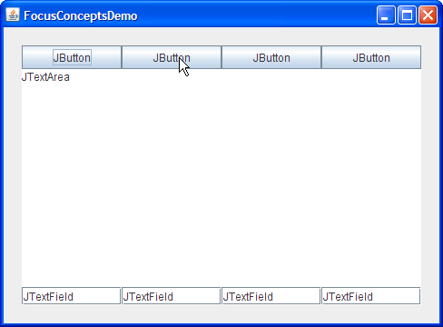
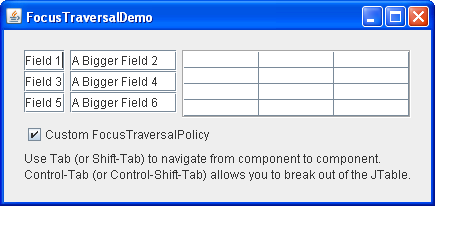
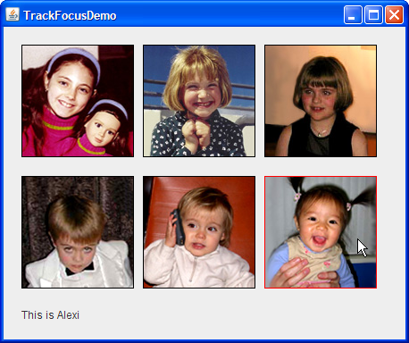

# 如何使用焦点子系统

> 原文： [https://docs.oracle.com/javase/tutorial/uiswing/misc/focus.html](https://docs.oracle.com/javase/tutorial/uiswing/misc/focus.html)

许多组件 - 甚至那些主要使用鼠标操作的组件，如按钮 - 都可以通过键盘操作。要使按键影响组件，组件必须具有键盘焦点。

从用户的角度来看，具有键盘焦点的组件通常是突出的 - 例如，带有点状或黑色边框。包含该组件的窗口也比屏幕上的其他窗口更突出。这些视觉提示让用户知道任何打字将与哪个组件相关。窗口系统中一次只有一个组件可以具有键盘焦点。

窗口获得焦点的确切方式取决于窗口系统。在所有平台上都没有万无一失的方法来确保窗口获得焦点。在某些操作系统（如 Microsoft Windows）上，前窗通常会成为焦点窗口。在这些情况下， [`Window.toFront`](https://docs.oracle.com/javase/8/docs/api/java/awt/Window.html#toFront--) 方法将窗口移动到前面，从而使其成为焦点。但是，在其他操作系统（如 Solaris™Operating System）上，窗口管理器可以根据光标位置选择聚焦窗口，在这些情况下，`Window.toFront`方法的行为是不同的。

组件通常在用户单击它时，或当用户在组件之间进行选项卡或以其他方式与组件交互时获得焦点。组件也可以以编程方式给予焦点，例如当其包含框架或对话框可见时。此代码段显示了每次窗口获得焦点时如何为特定组件提供焦点：

```java
//Make textField get the focus whenever frame is activated.
frame.addWindowFocusListener(new WindowAdapter() {
    public void windowGainedFocus(WindowEvent e) {
        textField.requestFocusInWindow();
    }
});

```

如果要在第一次激活窗口时确保特定组件获得焦点，则可以在组件实现后，但在显示帧之前调用组件上的 [`requestFocusInWindow`](https://docs.oracle.com/javase/8/docs/api/java/awt/Component.html#requestFocusInWindow--) 方法。以下示例代码显示了如何执行此操作：

```java
    //...Where initialization occurs...
    JFrame frame = new JFrame("Test");
    JPanel panel = new JPanel(new BorderLayout());

    //...Create a variety of components here...

    //Create the component that will have the initial focus.
    JButton button = new JButton("I am first");
    panel.add(button);
    frame.getContentPane().add(panel);  //Add it to the panel

    frame.pack();  //Realize the components.
    //This button will have the initial focus.
    button.requestFocusInWindow(); 
    frame.setVisible(true); //Display the window.

```

或者，您可以将自定义`FocusTraversalPolicy`应用于帧并调用`getDefaultComponent`方法以确定哪个组件将获得焦点。

本节的其余部分包括以下主题：

*   [焦点子系统简介](#intro)
*   [验证输入](#inputVerification)
*   [使自定义组件可聚焦](#focusable)
*   [自定义焦点遍历](#customFocusTraversal)
*   [跟踪焦点变化到多个组件](#trackingFocus)
*   [计时焦点转移](#transferTiming)
*   [Focus API](#api)
*   [焦点案例](#eg)

焦点子系统旨在尽可能无形地做正确的事情。在大多数情况下，它的行为方式合理，如果不合理，您可以通过各种方式调整其行为。一些常见情况可能包括：

*   排序是正确的，但没有设置具有焦点的第一个组件。如上一节中的代码片段所示，当窗口变为可见时，您可以使用`requestFocusInWindow`方法在组件上设置焦点。
*   订购错了。要解决此问题，您可以更改包含层次结构，可以更改组件添加到其容器的顺序，也可以创建自定义焦点遍历策略。有关详细信息，请参阅[自定义焦点遍历](#customFocusTraversal)。
*   必须防止组件失去焦点，或者需要在组件失去焦点之前检查组件中的值。 [输入验证](#inputVerification)是此问题的解决方案。
*   自定义组件没有得到关注。要解决此问题，您需要确保它满足[使自定义组件可聚焦](#focusable)中列出的所有要求。

`FocusConceptsDemo`示例说明了一些概念。



* * *

**Try this:** 

1.  单击“启动”按钮以使用 [Java™Web Start](http://www.oracle.com/technetwork/java/javase/javawebstart/index.html) （[下载 JDK 7 或更高版本](http://www.oracle.com/technetwork/java/javase/downloads/index.html)）运行 FocusConceptsDemo。或者，要自己编译并运行示例，请参考[示例索引](../examples/misc/index.html#FocusConceptsDemo)。 [](https://docs.oracle.com/javase/tutorialJWS/samples/uiswing/FocusConceptsDemoProject/FocusConceptsDemo.jnlp) 

2.  如有必要，请单击窗口以获得焦点。
3.  使用 Tab 键将焦点从组件移动到组件。
    您会注意到当焦点移动到文本区域时，它会停留在文本区域中。
4.  使用 Control-Tab 将焦点移出文本区域。
5.  使用 Shift-Tab 将焦点向相反方向移动。
6.  使用 Control-Shift-Tab 将焦点从相反方向移出文本区域。

* * *

`KeyboardFocusManager`是焦点子系统的关键元素。它管理状态并启动更改。键盘管理器跟踪 _ 焦点所有者 _ - 从键盘接收键入的组件。 _ 聚焦窗口 _ 是包含焦点所有者的窗口。

* * *

**JWindow and focus:** To use a `JWindow` component in your GUI, you should know that the `JWindow` component's owning frame must be visible in order for any components in the window to get the focus. By default, if you do not specify an owning frame for a `JWindow` component, an invisible owning frame is created for it. The result is that components in the `JWindow` component might not be able to get the focus. The solution is either to specify a visible owning frame when creating the [`JWindow`](https://docs.oracle.com/javase/8/docs/api/javax/swing/JWindow.html) component, or to use an undecorated [`JFrame`](../components/frame.html) component instead.

* * *

_ 焦点循环 _（或 _ 焦点遍历循环 _）是一组在包含层次结构中共享共同祖先的组件。 _ 焦点循环根 _ 是作为特定焦点遍历循环的根的容器。默认情况下，每个`JWindow`和`JInternalFrame`组件都可以是焦点循环根。焦点循环根本身可以包含一个或多个焦点循环根。以下 Swing 对象可以是焦点循环根：`JApplet`，`JDesktopPane`，`JDialog`，`JEditorPane`，`JFrame`，`JInternalFrame`和`JWindow`。虽然可能看起来`JTable`和`JTree`对象是焦点循环根，但它们不是。

_ 焦点遍历策略 _ 确定一组组件的导航顺序。 Swing 提供 [``LayoutFocusTraversalPolicy``](https://docs.oracle.com/javase/8/docs/api/javax/swing/LayoutFocusTraversalPolicy.html)类，它根据布局管理器相关因素（如大小，位置和组件方向）决定导航顺序。在聚焦周期内，可以向前或向后导航组件。在焦点循环根的层次结构中，向上遍历将焦点从当前循环中移出到父循环中。

在大多数外观和感觉模型中，使用 Tab 和 Shift-Tab 键导航组件。这些键是默认的 _ 焦点遍历键 _，可以通过编程方式进行更改。例如，您可以使用以下四行代码添加 Enter 作为前向焦点遍历键：

```java
Set forwardKeys = getFocusTraversalKeys(
    KeyboardFocusManager.FORWARD_TRAVERSAL_KEYS);
Set newForwardKeys = new HashSet(forwardKeys);
newForwardKeys.add(KeyStroke.getKeyStroke(KeyEvent.VK_ENTER, 0));
setFocusTraversalKeys(KeyboardFocusManager.FORWARD_TRAVERSAL_KEYS,
    newForwardKeys);

```

Tab 将焦点向前移动。 Shift-Tab 向后移动焦点。例如，在 FocusConceptsDemo 中，第一个按钮具有初始焦点。 Tabbing 将焦点通过按钮移动到文本区域。附加标签将光标移动到文本区域内，但不会移出文本区域，因为在文本区域内，Tab 是 _ 而不是 _ 焦点遍历键。但是，Control-Tab 将焦点移出文本区域并移动到第一个文本字段中。同样，Control-Shift-Tab 将焦点移出文本区域并移动到上一个组件中。约定使用 Control 键将焦点移出任何以特殊方式处理 Tab 的组件，例如`JTable`。

您刚刚收到了焦点架构的简要介绍。如果您需要更多详细信息，请参阅[焦点子系统](https://docs.oracle.com/javase/8/docs/api/java/awt/doc-files/FocusSpec.html)的规格。

GUI 设计的一个常见要求是限制用户输入的组件 - 例如，仅允许以十进制格式（例如金钱）输入数字的文本字段或仅允许 5 位数字输入邮政编码的文本字段。易于使用的[格式化文本字段](../components/formattedtextfield.html)组件，允许输入限制为各种可本地化的格式。您还可以为文本字段指定[自定义格式化程序](../components/formattedtextfield.html)，它可以执行特殊检查，例如确定值是否不仅格式正确，而且合理。

您可以使用输入验证程序替代自定义格式化程序，或者当您拥有不是文本字段的组件时。输入验证程序允许您拒绝特定值，例如格式正确但无效的邮政编码，或超出所需范围的值，例如体温高于 110°F。要使用输入验证程序，请创建 [``InputVerifier``](https://docs.oracle.com/javase/8/docs/api/javax/swing/InputVerifier.html)的子类，创建子类的实例，并将实例设置为一个或多个组件的输入验证程序。

只要组件即将失去焦点，就会查询组件的输入验证程序。如果组件的值不可接受，则输入验证器可以采取适当的操作，例如拒绝在组件上产生焦点或用最后一个有效值替换用户的输入，然后允许焦点转移到下一个组件。但是，当焦点转移到另一个顶层组件时，不会调用`InputVerifier`。

以下两个例子显示了抵押贷款计算器。一个使用格式化文本字段，另一个使用输入验证和标准文本字段。


* * *

**Try this:** 

1.  单击“启动”按钮以使用 [Java™Web Start](http://www.oracle.com/technetwork/java/javase/javawebstart/index.html) （[下载 JDK 7 或更高版本](http://www.oracle.com/technetwork/java/javase/downloads/index.html)）运行 FormattedTextFieldDemo。或者，要自己编译并运行示例，请参考[示例索引](../examples/components/index.html#FormattedTextFieldDemo)。 [](https://docs.oracle.com/javase/tutorialJWS/samples/uiswing/FormattedTextFieldDemoProject/FormattedTextFieldDemo.jnlp) 

2.  单击“启动”按钮以使用 [Java™Web Start](http://www.oracle.com/technetwork/java/javase/javawebstart/index.html) （[下载 JDK 7 或更高版本](http://www.oracle.com/technetwork/java/javase/downloads/index.html)）运行 InputVerificationDemo。或者，要自己编译并运行示例，请参考[示例索引](../examples/misc/index.html#InputVerificationDemo)。 [](https://docs.oracle.com/javase/tutorialJWS/samples/uiswing/InputVerificationDemoProject/InputVerificationDemo.jnlp) 

3.  比较两个抵押贷款计算器并排。您将看到输入验证演示在每个可编辑文本字段的相关标签中指定有效输入值。尝试在两个示例中输入格式错误的值以观察行为。然后尝试输入格式正确但不可接受的值。

* * *

您可以在 [`InputVerificationDemo.java`](../examples/misc/InputVerificationDemoProject/src/misc/InputVerificationDemo.java) 中找到输入验证演示的代码。这是`InputVerifier`子类的代码，`MyVerifier`：

```java
class MyVerifier extends InputVerifier
                 implements ActionListener {
    double MIN_AMOUNT = 10000.0;
    double MAX_AMOUNT = 10000000.0;
    double MIN_RATE = 0.0;
    int MIN_PERIOD = 1;
    int MAX_PERIOD = 40;

   public boolean shouldYieldFocus(JComponent input) {
        boolean inputOK = verify(input);
        makeItPretty(input);
        updatePayment();

        if (inputOK) {
            return true;
        } else {
            Toolkit.getDefaultToolkit().beep();
            return false;
        }
    }

    protected void updatePayment() {
        double amount = DEFAULT_AMOUNT;
        double rate = DEFAULT_RATE;
        int numPeriods = DEFAULT_PERIOD;
        double payment = 0.0;

        //Parse the values.
        try {
            amount = moneyFormat.parse(amountField.getText()).
                              doubleValue();
        } catch (ParseException pe) {pe.printStackTrace();}
        try {
            rate = percentFormat.parse(rateField.getText()).
                                 doubleValue();
        } catch (ParseException pe) {pe.printStackTrace();}
        try {
            numPeriods = decimalFormat.parse(numPeriodsField.getText()).
                              intValue();
        } catch (ParseException pe) {pe.printStackTrace();}

        //Calculate the result and update the GUI.
        payment = computePayment(amount, rate, numPeriods);
        paymentField.setText(paymentFormat.format(payment));
    }

    //This method checks input, but should cause no side effects.
    public boolean verify(JComponent input) {
        return checkField(input, false);
    }

    protected void makeItPretty(JComponent input) {
        checkField(input, true);
    }

    protected boolean checkField(JComponent input, boolean changeIt) {
        if (input == amountField) {
            return checkAmountField(changeIt);
        } else if (input == rateField) {
            return checkRateField(changeIt);
        } else if (input == numPeriodsField) {
            return checkNumPeriodsField(changeIt);
        } else {
            return true; //should not happen
        }
    }

    //Checks that the amount field is valid.  If it is valid,
    //it returns true; otherwise, returns false.  If the
    //change argument is true, this method sets the
    //value to the minimum or maximum value if necessary and
    // (even if not) sets it to the parsed number so that it
    // looks good -- no letters, for example.
    protected boolean checkAmountField(boolean change) {
        boolean wasValid = true;
        double amount = DEFAULT_AMOUNT;

        //Parse the value.
        try {
            amount = moneyFormat.parse(amountField.getText()).
                              doubleValue();
        } catch (ParseException pe) {
            pe.printStackTrace();
            wasValid = false;
        }

        //Value was invalid.
        if ((amount < MIN_AMOUNT) || (amount > MAX_AMOUNT)) {
            wasValid = false;
            if (change) {
                if (amount < MIN_AMOUNT) {
                    amount = MIN_AMOUNT;
                } else { // amount is greater than MAX_AMOUNT
                    amount = MAX_AMOUNT;
                }
            }
        }

        //Whether value was valid or not, format it nicely.
        if (change) {
            amountField.setText(moneyFormat.format(amount));
            amountField.selectAll();
        }

        return wasValid;
    }

    //Checks that the rate field is valid.  If it is valid,
    //it returns true; otherwise, returns false.  If the
    //change argument is true, this method reigns in the
    //value if necessary and (even if not) sets it to the
    //parsed number so that it looks good -- no letters,
    //for example.
    protected boolean checkRateField(boolean change) {
        ...//Similar to checkAmountField...
    }

    //Checks that the numPeriods field is valid.  If it is valid,
    //it returns true; otherwise, returns false.  If the
    //change argument is true, this method reigns in the
    //value if necessary and (even if not) sets it to the
    //parsed number so that it looks good -- no letters,
    //for example.
    protected boolean checkNumPeriodsField(boolean change) {
        ...//Similar to checkAmountField...
    }

    public void actionPerformed(ActionEvent e) {
        JTextField source = (JTextField)e.getSource();
        shouldYieldFocus(source); //ignore return value
        source.selectAll();
    }
}

```

请注意，`verify`方法用于检测无效值，但不执行任何其他操作。 `verify`方法仅用于确定输入是否有效 - 它应该永远不会显示对话框或导致任何其他副作用。 `shouldYieldFocus`方法调用`verify`，如果值无效，则将其设置为最小值或最大值。允许`shouldYieldFocus`方法产生副作用，在这种情况下，它始终格式化文本字段并且还可以更改其值。在我们的示例中，`shouldYieldFocus`方法始终返回 true，因此实际上永远不会阻止焦点的传输。这只是可以实现验证的一种方式。找到这个名为 [`InputVerificationDialogDemo`](../examples/misc/index.html#InputVerificationDialogDemo) 的演示版本的另一个版本，当用户输入无效并要求用户输入合法值时，该版本会显示一个对话框。

输入验证程序使用`JComponent`类的`setInputVerifier`方法安装。例如，`InputVerificationDemo`具有以下代码：

```java
private MyVerifier verifier = new MyVerifier();
...
amountField.setInputVerifier(verifier);

```

要使组件获得焦点，它必须满足三个要求：它必须是可见的，启用的和可聚焦的。还可以给出输入映射。有关输入映射的更多信息，请阅读[如何使用键绑定](../misc/keybinding.html)。

[TrackFocusDemo](#trackfocusdemo) 示例定义了简单组件`Picture`。它的构造器如下所示：

```java
public Picture(Image image) {
    this.image = image;
    setFocusable(true);
    addMouseListener(this);
    addFocusListener(this);
}

```

对`setFocusable(true)`方法的调用使组件可以聚焦。如果在`WHEN_FOCUSED`输入映射中明确指定组件键绑定，则无需调用`setFocusable`方法。

若要直观地显示焦点的变化（仅在组件具有焦点时绘制红色边框），`Picture`具有[焦点监听器](../events/focuslistener.html)。

为了在用户点击图片时获得焦点，该组件具有[鼠标监听器](../events/mouselistener.html)。监听器的`mouseClicked`方法请求将焦点转移到图片。这是代码：

```java
public void mouseClicked(MouseEvent e) {
    //Since the user clicked on us, let us get focus!
    requestFocusInWindow();
}

```

有关 TrackFocusDemo 示例的更多讨论，请参见[跟踪焦点对多个组件的更改](#trackingFocus)。

焦点子系统确定使用焦点遍历键（例如 Tab）进行导航时应用的默认顺序。 Swing 应用程序的策略由 [`LayoutFocusTraversalPolicy`](https://docs.oracle.com/javase/8/docs/api/javax/swing/LayoutFocusTraversalPolicy.html) 确定。您可以使用 [`setFocusCycleRoot`](https://docs.oracle.com/javase/8/docs/api/java/awt/Container.html#setFocusCycleRoot-boolean-) 方法在任何`Container`上设置焦点遍历策略。但是，如果容器不是焦点循环根，则可能没有明显效果。或者，您可以将焦点遍历策略供应器传递给`FocusTraversalPolicy`方法而不是焦点循环根。使用 [`isFocusTraversalPolicyProvider()`](https://docs.oracle.com/javase/8/docs/api/java/awt/Container.html#isFocusTraversalPolicyProvider--) 方法确定`Container`是否是焦点遍历策略提供者。使用 [`setFocusTraversalPolicyProvider()`](https://docs.oracle.com/javase/8/docs/api/java/awt/Container.html#setFocusTraversalPolicyProvider-boolean-) 方法设置容器以提供焦点遍历策略。

`FocusTraversalDemo`示例演示了如何自定义焦点行为。



* * *

**Try this:** 

1.  单击“启动”按钮以使用 [Java™Web Start](http://www.oracle.com/technetwork/java/javase/javawebstart/index.html) （[下载 JDK 7 或更高版本](http://www.oracle.com/technetwork/java/javase/downloads/index.html)）运行 FocusTraversalDemo。或者，要自己编译并运行示例，请参考[示例索引](../examples/misc/index.html#FocusTraversalDemo)。 [](https://docs.oracle.com/javase/tutorialJWS/samples/uiswing/FocusTraversalDemoProject/FocusTraversalDemo.jnlp) 

2.  如有必要，单击窗口以使其成为焦点。
3.  在选择组件时注意焦点顺序。焦点顺序由组件添加到内容窗格的顺序决定。另请注意，复选框永远不会得到焦点;我们从焦点周期中删除了它。
4.  要将焦点移出表格，请使用 Control-Tab 或 Ctrl-Shift-Tab。
5.  单击**自定义 FocusTraversalPolicy** 复选框。此框在框架上安装自定义焦点遍历策略。
6.  尝试再次浏览组件。请注意，焦点顺序现在是从左到右，从上到下的顺序。

* * *

您可以在 [`FocusTraversalDemo.java`](../examples/misc/FocusTraversalDemoProject/src/misc/FocusTraversalDemo.java) 中找到演示代码。

使用以下代码行从复选周期中删除了复选框：

```java
togglePolicy.setFocusable(false);

```

这是应用程序的自定义`FocusTraversalPolicy`：

```java
...
JTextField tf1 = new JTextField("Field 1");
JTextField tf2 = new JTextField("A Bigger Field 2");
JTextField tf3 = new JTextField("Field 3");
JTextField tf4 = new JTextField("A Bigger Field 4");
JTextField tf5 = new JTextField("Field 5");
JTextField tf6 = new JTextField("A Bigger Field 6");
JTable table = new JTable(4,3);
...
public FocusTraversalDemo() {
    super(new BorderLayout());

    JTextField tf1 = new JTextField("Field 1");
    JTextField tf2 = new JTextField("A Bigger Field 2");
    JTextField tf3 = new JTextField("Field 3");
    JTextField tf4 = new JTextField("A Bigger Field 4");
    JTextField tf5 = new JTextField("Field 5");
    JTextField tf6 = new JTextField("A Bigger Field 6");
    JTable table = new JTable(4,3);
    togglePolicy = new JCheckBox("Custom FocusTraversalPolicy");
    togglePolicy.setActionCommand("toggle");
    togglePolicy.addActionListener(this);
    togglePolicy.setFocusable(false);  //Remove it from the focus cycle.
    //Note that HTML is allowed and will break this run of text
    //across two lines.
    label = new JLabel("<html>Use Tab (or Shift-Tab) to navigate from component to component.<p>Control-Tab 
    (or Control-Shift-Tab) allows you to break out of the JTable.</html>");

    JPanel leftTextPanel = new JPanel(new GridLayout(3,2));
    leftTextPanel.add(tf1, BorderLayout.PAGE_START);
    leftTextPanel.add(tf3, BorderLayout.CENTER);
    leftTextPanel.add(tf5, BorderLayout.PAGE_END);
    leftTextPanel.setBorder(BorderFactory.createEmptyBorder(0,0,5,5));
    JPanel rightTextPanel = new JPanel(new GridLayout(3,2));
    rightTextPanel.add(tf2, BorderLayout.PAGE_START);
    rightTextPanel.add(tf4, BorderLayout.CENTER);
    rightTextPanel.add(tf6, BorderLayout.PAGE_END);
    rightTextPanel.setBorder(BorderFactory.createEmptyBorder(0,0,5,5));
    JPanel tablePanel = new JPanel(new GridLayout(0,1));
    tablePanel.add(table, BorderLayout.CENTER);
    tablePanel.setBorder(BorderFactory.createEtchedBorder());
    JPanel bottomPanel = new JPanel(new GridLayout(2,1));
    bottomPanel.add(togglePolicy, BorderLayout.PAGE_START);
    bottomPanel.add(label, BorderLayout.PAGE_END);

    add(leftTextPanel, BorderLayout.LINE_START);
    add(rightTextPanel, BorderLayout.CENTER);
    add(tablePanel, BorderLayout.LINE_END);
    add(bottomPanel, BorderLayout.PAGE_END);
    setBorder(BorderFactory.createEmptyBorder(20,20,20,20));
    Vector<Component> order = new Vector<Component>(7);
    order.add(tf1);
    order.add(tf2);
    order.add(tf3);
    order.add(tf4);
    order.add(tf5);
    order.add(tf6);
    order.add(table);
    newPolicy = new MyOwnFocusTraversalPolicy(order);
}

```

要使用自定义`FocusTraversalPolicy`，请在任何焦点循环根上实现以下代码。

```java
    MyOwnFocusTraversalPolicy newPolicy = new MyOwnFocusTraversalPolicy();
    frame.setFocusTraversalPolicy(newPolicy);

```

您可以通过将`FocusTraversalPolicy`设置为`null`来删除自定义焦点遍历策略，这将恢复默认策略。

在某些情况下，应用程序可能需要跟踪哪个组件具有焦点。此信息可用于动态更新菜单或状态栏。如果您只需要跟踪特定组件的焦点，那么实现[焦点事件监听器](../events/focuslistener.html)可能是有意义的。

如果焦点监听器不合适，您可以在`KeyboardFocusManager`上注册`PropertyChangeListener`。向属性更改监听器通知涉及焦点的每个更改，包括对焦点所有者，焦点窗口和默认焦点遍历策略的更改。有关完整列表，请参见 [KeyboardFocusManager 属性](#properties)表。

演示了如何通过在键盘焦点管理器上安装属性更改监听器来跟踪焦点所有者。



* * *

**Try this:** 

1.  单击“启动”按钮以使用 [Java™Web Start](http://www.oracle.com/technetwork/java/javase/javawebstart/index.html) （[下载 JDK 7 或更高版本](http://www.oracle.com/technetwork/java/javase/downloads/index.html)）运行 TrackFocusDemo。或者，要自己编译并运行示例，请参考[示例索引](../examples/misc/index.html#TrackFocusDemo)。 [](https://docs.oracle.com/javase/tutorialJWS/samples/uiswing/TrackFocusDemoProject/TrackFocusDemo.jnlp) 

2.  如有必要，请单击窗口以获得焦点。
3.  该窗口显示六个图像，每个图像由`Picture`组件显示。具有焦点的`Picture`用红色边框表示。窗口底部的标签描述了具有焦点的`Picture`。
4.  使用 Tab 或 Shift-Tab 或单击图像将焦点移动到另一个`Picture`。由于已在键盘焦点管理器上注册了属性更改监听器，因此会检测焦点更改并正确更新标签。

* * *

您可以在 [`TrackFocusDemo.java`](../examples/misc/TrackFocusDemoProject/src/misc/TrackFocusDemo.java) 中查看演示代码。用于绘制图像的自定义组件可在 [`Picture.java`](../examples/misc/TrackFocusDemoProject/src/misc/Picture.java) 中找到。以下是定义和安装属性更改监听器的代码：

```java
KeyboardFocusManager focusManager =
    KeyboardFocusManager.getCurrentKeyboardFocusManager();
focusManager.addPropertyChangeListener(
    new PropertyChangeListener() {
        public void propertyChange(PropertyChangeEvent e) {
            String prop = e.getPropertyName();
            if (("focusOwner".equals(prop)) &&
                  ((e.getNewValue()) instanceof Picture)) {
                Component comp = (Component)e.getNewValue();
                String name = comp.getName();
                Integer num = new Integer(name);
                int index = num.intValue();
                if (index < 0 || index > comments.length) {
                    index = 0;
                }
                info.setText(comments[index]);
            }
        }
    }
);

```

自定义组件`Picture`负责绘制图像。所有六个组件都以这种方式定义：

```java
pic1 = new Picture(createImageIcon("images/" +
            mayaString + ".gif", mayaString).getImage());
pic1.setName("1");

```

焦点转移是异步的。这种质量可能导致一些奇怪的与时间相关的问题和假设，特别是在焦点的自动转移期间。例如，想象一个带有包含“开始”按钮，“取消”按钮和文本字段的窗口的应用程序。组件按此顺序添加：

1.  开始按钮
2.  文本域
3.  取消按钮

启动应用程序时，`LayoutFocusTraversalPolicy`确定焦点遍历策略 - 在这种情况下，它是组件添加到其容器的顺序。在此示例中，所需的行为是“开始”按钮具有初始焦点，单击“开始”按钮时，它将被禁用，然后“取消”按钮将获得焦点。实现此行为的正确方法是按所需顺序将组件添加到容器或创建自定义焦点遍历策略。如果出于某种原因，这是不可能的，那么您可以使用以下代码段实现此行为：

```java
public void actionPerformed(ActionEvent e) {
    //This works.
    start.setEnabled(false);
    cancel.requestFocusInWindow();
}

```

根据需要，焦点从“开始”按钮转到“取消”按钮，而不是文本字段。但如果以相反的顺序调用相同的方法，则会出现不同的结果，如下所示：

```java
public void actionPerformed(ActionEvent e) {
    //This does not work.
    cancel.requestFocusInWindow();
    start.setEnabled(false);
}

```

在这种情况下，在离开“开始”按钮之前，请在“取消”按钮上请求焦点。对`requestFocusInWindow`方法的调用会启动焦点传输，但不会立即将焦点移动到“取消”按钮。当禁用“开始”按钮时，焦点将转移到下一个组件（因此始终有一个具有焦点的组件），在这种情况下，它会将焦点移动到文本字段，_ 而不是 _ 到取消按钮。

在可能影响焦点的所有其他更改适用于以下情况之后，您需要在几种情况下进行焦点请求：

*   隐藏焦点所有者。
*   使焦点所有者不可聚焦。
*   在焦点所有者上调用`removeNotify`方法。
*   对焦点所有者的容器执行上述任何操作，或者更改焦点策略，以便容器不再接受该组件作为焦点所有者。
*   处理包含焦点所有者的顶级窗口。

下表列出了与焦点相关的常用构造器和方法。焦点 API 分为四类：

*   [组分有用的方法](#focusMethods)
*   [创建和使用自定义 FocusTraversalPolicy](#focustraversal)
*   [输入验证 API](#inputverificationapi)
*   [KeyboardFocusManager 属性](#properties)

有关焦点架构的更多详细信息，请参阅[焦点子系统](https://docs.oracle.com/javase/8/docs/api/java/awt/doc-files/FocusSpec.html)的规范。您也可以找到[如何编写焦点监听器](../events/focuslistener.html)有用。

| 方法（在`Component`中） | 目的 |
| :-- | :-- |
| [isFocusOwner（）](https://docs.oracle.com/javase/8/docs/api/java/awt/Component.html#isFocusOwner--) | 如果组件是焦点所有者，则返回`true`。 |
| [setRequestFocusEnabled（boolean）](https://docs.oracle.com/javase/8/docs/api/javax/swing/JComponent.html#setRequestFocusEnabled-boolean-)
[isRequestFocusEnabled（）](https://docs.oracle.com/javase/8/docs/api/javax/swing/JComponent.html#isRequestFocusEnabled--)
（`JComponent`中的 _）_ | 设置或检查此组件是否应该获得焦点。将`setRequestFocusEnabled`设置为`false`通常可以防止鼠标单击为组件提供焦点，同时仍允许键盘导航为组件提供焦点。此方法仅适用于接收鼠标事件的组件。例如，您可以在`JButton`上使用此方法，但不能在`JPanel`上使用此方法。如果您编写自定义组件，则由您来尊重此属性。建议使用`setFocusable`方法，这种方法可以让您的程序更好地适用于使用[辅助技术](access.html)的用户。 |
| [setFocusable（boolean）](https://docs.oracle.com/javase/8/docs/api/java/awt/Component.html#setFocusable-boolean-)
[isFocusable（）](https://docs.oracle.com/javase/8/docs/api/java/awt/Component.html#isFocusable--) | 设置或获取组件的可聚焦状态。组件必须是可聚焦的才能获得焦点。使用`setFocusable(false)`从焦点循环中删除组件时，无法再使用键盘导航组件。建议使用`setRequestFocusEnabled`方法，以便您的程序可以由使用[辅助技术](access.html)的用户运行。 |
| [requestFocusInWindow（）](https://docs.oracle.com/javase/8/docs/api/java/awt/Component.html#requestFocusInWindow--) | 请求此组件应获得焦点。组件的窗口必须是当前聚焦的窗口。对于此请求，`JComponent`的子类必须是可见的，启用的和可聚焦的，并且具有要授予此请求的输入映射。在发生`FOCUS_GAINED`事件之前，不应该假设组件具有焦点。该方法优于`requestFocus`方法，该方法是平台相关的。 |
| [setFocusTraversalKeys（int，Set）](https://docs.oracle.com/javase/8/docs/api/java/awt/Container.html#setFocusTraversalKeys-int-java.util.Set-)
[getFocusTraversalKeys（int）](https://docs.oracle.com/javase/8/docs/api/java/awt/Container.html#getFocusTraversalKeys-int-)
[areFocusTraversalKeysSet（int）](https://docs.oracle.com/javase/8/docs/api/java/awt/Container.html#areFocusTraversalKeysSet-int-)
（`java.awt.Container`中的） | 设置或获取特定方向的焦点遍历键，或确定是否已在此容器上显式设置任何焦点遍历键。如果未设置焦点遍历键，则它们将继承自祖先或键盘焦点管理器。可以按以下方向设置焦点遍历键：`KeyboardFocusManager.FORWARD_TRAVERSAL_KEYS`，`KeyboardFocusManager.BACKWARD_TRAVERSAL_KEYS` `KeyboardFocusManager.UP_CYCLE_TRAVERSAL_KEYS`或`KeyboardFocusManager.DOWN_CYCLE_TRAVERSAL_KEYS`。如果设置`UP_CYCLE_TRAVERSAL_KEYS`或`DOWN_CYCLE_TRAVERSAL_KEYS`，则还必须在焦点遍历策略上调用 [`setImplicitDownCycleTraversal(false)`](https://docs.oracle.com/javase/8/docs/api/javax/swing/SortingFocusTraversalPolicy.html#setImplicitDownCycleTraversal-boolean-) 。 |

| 类或方法 | 目的 |
| :-- | :-- |
| [LayoutFocusTraversalPolicy](https://docs.oracle.com/javase/8/docs/api/javax/swing/LayoutFocusTraversalPolicy.html) | 默认情况下，该类确定 Swing 组件的焦点遍历策略。 |
| [getComponentAfter（Container，Component）](https://docs.oracle.com/javase/8/docs/api/javax/swing/LayoutFocusTraversalPolicy.html#getComponentAfter-java.awt.Container-java.awt.Component-) | 给定作为输入传递的组件，返回下一个应该具有焦点的组件。 |
| [getComponentBefore（Container，Component）](https://docs.oracle.com/javase/8/docs/api/javax/swing/LayoutFocusTraversalPolicy.html#getComponentBefore-java.awt.Container-java.awt.Component-) | 给定作为输入传递的组件，返回应该在此组件之前具有焦点的组件。该方法用于反向标签。 |
| [getDefaultComponent（Container）](https://docs.oracle.com/javase/8/docs/api/javax/swing/SortingFocusTraversalPolicy.html#getDefaultComponent-java.awt.Container-)
（`javax.swing.SortingFocusTraversalPolicy`中的 _）_ | 返回应具有默认焦点的组件。 |
| [getFirstComponent（Container）](https://docs.oracle.com/javase/8/docs/api/javax/swing/LayoutFocusTraversalPolicy.html#getFirstComponent-java.awt.Container-) | 返回遍历循环中的第一个组件。 |
| [getInitialComponent（Container）](https://docs.oracle.com/javase/8/docs/api/javax/swing/InternalFrameFocusTraversalPolicy.html#getInitialComponent-java.awt.Container-) | 当窗口第一次可见时，返回应该接收焦点的组件。 |
| [getLastComponent（Container）](https://docs.oracle.com/javase/8/docs/api/javax/swing/LayoutFocusTraversalPolicy.html#getLastComponent-java.awt.Container-) | 返回遍历循环中的最后一个组件。 |
| [setFocusTraversalPolicy（FocusTraversalPolicy）](https://docs.oracle.com/javase/8/docs/api/java/awt/Container.html#setFocusTraversalPolicy-java.awt.FocusTraversalPolicy-)
[getFocusTraversalPolicy（FocusTraversalPolicy）](https://docs.oracle.com/javase/8/docs/api/java/awt/Container.html#getFocusTraversalPolicy--)
（`java.awt.Container` 中的 _）_ | 设置或获取焦点遍历策略或确定是否已设置策略。请注意，在不是焦点循环根的容器上设置焦点遍历策略可能没有明显的效果。值`null`表示尚未明确设置策略。如果未设置策略，则从父焦点循环根继承策略。 |
| [isFocusCycleRoot（）](https://docs.oracle.com/javase/8/docs/api/java/awt/Container.html#isFocusCycleRoot--)
[setFocusCycleRoot（boolean）](https://docs.oracle.com/javase/8/docs/api/java/awt/Container.html#setFocusCycleRoot-boolean-)
（`java.awt.Container` 中的 _）_ | 检查或设置容器是否是焦点遍历循环的根。 |
| [isFocusTraversalPolicyProvider（）](https://docs.oracle.com/javase/8/docs/api/java/awt/Container.html#isFocusTraversalPolicyProvider--)
[setFocusTraversalPolicyProvider（boolean）](https://docs.oracle.com/javase/8/docs/api/java/awt/Container.html#setFocusTraversalPolicyProvider-boolean-)
（`java.awt.Container` 中的 _）_ | 检查或设置是否将使用容器来提供焦点遍历策略。 |

| 类或方法 | 目的 |
| :-- | :-- |
| [InputVerifier](https://docs.oracle.com/javase/8/docs/api/javax/swing/InputVerifier.html) | 允许通过焦点机制进行输入验证的抽象类。当尝试将焦点从包含输入验证器的组件移位时，在验证器满足之前不会放弃焦点。 |
| [shouldYieldFocus（JComponent）](https://docs.oracle.com/javase/8/docs/api/javax/swing/InputVerifier.html#shouldYieldFocus-javax.swing.JComponent-)
_（在`InputVerifier`中）_ | 当组件具有输入验证程序时，系统会调用此方法以确定焦点是否可以离开此组件。此方法可能会导致副作用，例如打开对话框。如果此方法返回`false`，则焦点将保留在传递给方法的组件上。 |
| [验证（JComponent）](https://docs.oracle.com/javase/8/docs/api/javax/swing/InputVerifier.html#verify-javax.swing.JComponent-)
_（在`InputVerifier`中）_ | 您需要覆盖此方法以检查组件的输入是否有效。如果有效则应返回`true`，否则返回`false`。此方法不应导致任何副作用，例如打开对话框。该方法由`shouldYieldFocus`调用。 |
| [setInputVerifier（inputVerifier）](https://docs.oracle.com/javase/8/docs/api/javax/swing/JComponent.html#setInputVerifier-javax.swing.InputVerifier-)
[getInputVerifier（）](https://docs.oracle.com/javase/8/docs/api/javax/swing/JComponent.html#getInputVerifier--)
_（在`JComponent`中）_ | 设置或获取分配给组件的输入验证程序。默认情况下，组件没有输入验证程序。 |
| [setVerifyInputWhenFocusTarget（boolean）](https://docs.oracle.com/javase/8/docs/api/javax/swing/JComponent.html#setVerifyInputWhenFocusTarget-boolean-)
[getVerifyInputWhenFocusTarget（）](https://docs.oracle.com/javase/8/docs/api/javax/swing/JComponent.html#getVerifyInputWhenFocusTarget--)
_（在`JComponent`中）_ | 设置或获取在此组件请求焦点之前是否调用当前焦点所有者的输入验证程序。默认值为`true`。对于即使输入无效也应该接收焦点的组件，例如取消按钮或滚动条，此方法应设置为`false`。 |

该表定义了 [`KeyboardFocusManager`](https://docs.oracle.com/javase/8/docs/api/java/awt/KeyboardFocusManager.html) 的绑定属性。可以通过调用 [`addPropertyChangeListener`](https://docs.oracle.com/javase/8/docs/api/java/awt/KeyboardFocusManager.html#addPropertyChangeListener-java.beans.PropertyChangeListener-) 为这些属性注册监听器。

| 属性 | 目的 |
| :-- | :-- |
| focusOwner | 当前接收关键事件的组件。 |
| permanentFocusOwner | 最近收到永久`FOCUS_GAINED`事件的组件。通常与`focusOwner`相同，除非临时焦点更改当前有效。 |
| focusedWindow | 包含焦点所有者的窗口。 |
| 则 activeWindow | 组件必须始终为`Frame`或`Dialog`。活动窗口是聚焦窗口，或者是聚焦窗口所有者的第一帧或对话框。 |
| 默认的 FocusTraversalPolicy | 默认的焦点遍历策略，可以通过`Container`类的`setFocusTraversalPolicy`方法设置。 |
| forwardDefaultFocusTraversalKeys | 用于向前遍历的一组默认焦点键。对于多行文本组件，这些键默认为 Control-Tab。对于所有其他组件，这些键默认为 Tab 和 Control-Tab。 |
| backwardDefaultFocusTraversalKeys | 用于向后遍历的一组默认焦点键。对于多行文本组件，这些键默认为 Control-Shift-Tab。对于所有其他组件，这些键默认为 Shift-Tab 和 Control-Shift-Tab。 |
| upCycleDefaultFocusTraversalKeys | 上升循环的一组默认焦点键。默认情况下，这些键对于 Swing 组件为 null。如果在`KeyboardFocusManager`上设置这些键，或者在焦点循环根上设置`downCycleFocusTraversalKeys`，则还必须在焦点遍历策略上调用 [`setImplicitDownCycleTraversal(false)`](https://docs.oracle.com/javase/8/docs/api/javax/swing/SortingFocusTraversalPolicy.html#setImplicitDownCycleTraversal-boolean-) 方法。 |
| downCycleDefaultFocusTraversalKeys | 向下循环的一组默认焦点键。默认情况下，这些键对于 Swing 组件为 null。如果在`KeyboardFocusManager`上设置这些键，或者在焦点循环根上设置`upCycleFocusTraversalKeys`，则还必须在焦点遍历策略上调用 [`setImplicitDownCycleTraversal(false)`](https://docs.oracle.com/javase/8/docs/api/javax/swing/SortingFocusTraversalPolicy.html#setImplicitDownCycleTraversal-boolean-) 方法。 |
| currentFocusCycleRoot | 作为当前焦点循环根的容器。 |

下表列出了操作焦点的示例：

| 例 | 在哪里描述 | 笔记 |
| :-- | :-- | :-- |
| [`FocusConceptsDemo`](../examples/misc/index.html#FocusConceptsDemo) | 这个部分 | 演示基本的默认焦点行为。 |
| [`FocusTraversalDemo`](../examples/misc/index.html#FocusTraversalDemo) | 这个部分 | 演示如何覆盖默认焦点顺序。 |
| [`TrackFocusDemo`](../examples/misc/index.html#TrackFocusDemo) | 这个部分 | 演示如何使用`PropertyChangeListener`跟踪焦点所有者。还实现了自定义可聚焦组件。 |
| [`InputVerificationDemo`](../examples/misc/index.html#InputVerificationDemo) | 这个部分 | 演示如何实现`InputVerifier`来验证用户输入。 |
| [`InputVerificationDialogDemo`](../examples/misc/index.html#InputVerificationDialogDemo) | 这个部分 | 演示如何实现在用户输入无效时放置对话框的`InputVerifier`。 |
| [`FocusEventDemo`](../examples/events/index.html#FocusEventDemo) | [如何编写焦点监听器](../events/focuslistener.html) | 报告在几个组件上发生的所有焦点事件，以演示触发焦点事件的情况。 |