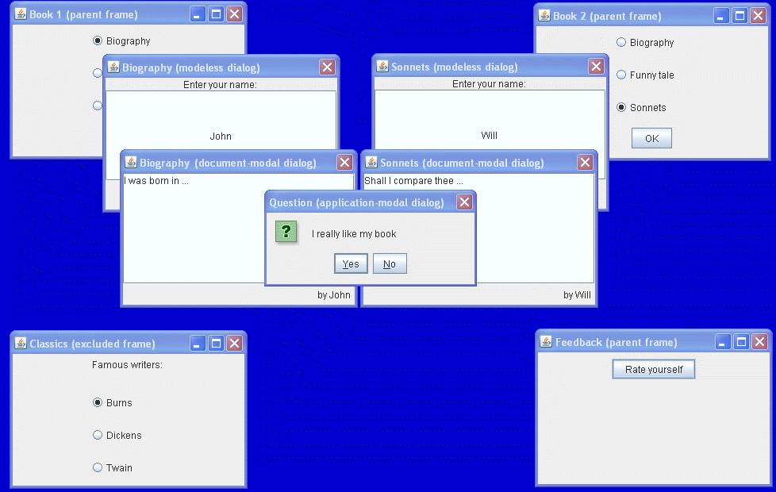

# 如何在对话框中使用模态

> 原文： [https://docs.oracle.com/javase/tutorial/uiswing/misc/modality.html](https://docs.oracle.com/javase/tutorial/uiswing/misc/modality.html)

Java™SE 6 解决了早期版本平台中出现的模态问题。新的模态模型使开发人员能够限制或限制对话框的模态阻塞。

在继续使用新模态模型之前，请查看以下术语：

*   对话框 - 带有标题和边框的顶级弹出窗口，通常从用户那里获取某种形式的输入。对话框可以是模态的或无模式的。有关对话框的更多信息，请参见[如何制作对话框](../components/dialog.html)页面中的[对话框概述](../components/dialog.html#overview)。
*   “模态”对话框 - 一个对话框，用于阻止对应用程序中某些其他顶级窗口的输入，但使用对话框作为其所有者创建的窗口除外。模态对话框捕获窗口焦点，直到它关闭，通常是按下按钮。
*   无模式对话框 - 一个对话框，使您可以在显示此对话框时与其他窗口一起操作。

在 Java SE 6 中，模态和无模式对话框的行为已经改变，因此它们总是出现在它们的父窗口和所有被阻止的窗口之上。

Java SE 6 支持以下模态类型：

*   **无模式类型** - 无模式对话框在可见时不会阻挡任何其他窗口。
*   **文档模式类型** - 文档模式对话框阻止来自同一文档的所有窗口，但子窗口中的窗口除外。在此上下文中，文档是共享共同祖先的窗口的层次结构，称为文档根，它是没有所有者的最近的祖先窗口。
*   **应用程序模式类型** - 应用程序模式对话框阻止来自同一应用程序的所有窗口，除了来自其子层次结构的窗口。如果在浏览器环境中启动多个小程序，则允许浏览器将它们视为单独的应用程序或单个应用程序。此行为与实现有关。
*   **Toolkit-modal type** - 工具箱模式对话框阻止在同一工具箱中运行的所有窗口，除了来自其子层次结构的窗口。如果启动了几个 applet，它们都使用相同的工具包运行。因此，从 applet 显示的工具包模式对话框可能会影响嵌入此工具包的 Java 运行时环境的浏览器实例的其他 applet 和所有窗口。

此外，您可以设置模态排除模式：

*   **排除模式** - 任何顶级窗口都可以标记为不被模态对话框阻止。此属性使您可以设置 _ 模态排除 _ 模式。 `Dialog.ModalExclusionType`枚举指定了可能的模态排除类型。

* * *

**Note :** The new modality model does not implement a system modality, which blocks all applications (including Java applications) that are displayed on the desktop while a modal dialog box is active.

* * *

ModalityDemo 示例演示了上面提到的四种模态类型中的前三种。

<center>[](https://docs.oracle.com/javase/tutorial/figures/uiswing/misc/modalityDemo.png)
_This figure has been reduced to fit on the page.
Click the image to view it at its natural size._</center>

* * *

**Try this:** 

1.  单击“启动”按钮以使用 [Java™Web Start](http://www.oracle.com/technetwork/java/javase/javawebstart/index.html) （[下载 JDK 7 或更高版本](http://www.oracle.com/technetwork/java/javase/downloads/index.html)）运行 ModalityDemo。或者，要自己编译并运行示例，请参考[示例索引](../examples/misc/index.html#ModalityDemo)。 [](https://docs.oracle.com/javase/tutorialJWS/samples/uiswing/ModalityDemoProject/ModalityDemo.jnlp) 

2.  将出现以下对话框：
    *   第 1 册（父框架）
    *   第 2 册（父框架）
    *   反馈（父框架）
    *   经典（排除框架）
3.  切换到 Book 1 框架并选择书籍的传记标题，然后选择确定。
4.  传记标题将显示在对话框的标题中。在文本字段中输入名称，例如“John”。
5.  切换到 Book 1 框架并将标题更改为 Funny Tale，然后选择 OK。由于输入名称的对话框是 _ 无模式 _，因此您可以轻松切换到其 _ 父 _ 帧。

    * * *

    **注意：**无模式对话框标题已更改为 Funny Tale。

    * * *

6.  在无模式对话框中选择确定。
7.  出现 Funny tale 文档模式对话框。
8.  在文本字段中键入一些文本。请注意，它是由您在无模式对话框中输入的名称签名的。
9.  切换到无模式对话框并尝试更改您的名称。您将无法这样做，因为文档模式对话框会阻止其父层次结构中的所有窗口。
10.  对 Book 2 父帧执行相同的操作序列（步骤 3 - 9）。
11.  尝试切换到不同的对话框。您会注意到，您可以切换到 Classics 框架或 Feedback 框架以及 Book 1 框架或 Book 2 框架的对话框。
12.  切换到反馈父框架。选择率自己。
13.  将出现确认对话框。尝试切换到不同的对话框。您只能切换到“经典”对话框，因为标准确认对话框是应用程序模式对话框，它会阻止来自同一应用程序的所有窗口。但是，您会注意到您可以在经典框架中选择您最喜欢的古典作家。此框架是使用`APPLICATION_EXCLUDE`模态排除类型创建的，该类型可防止所有顶级窗口被任何应用程序模式对话框阻止。

* * *

以下代码段显示了如何创建不同模态类型的对话框：

```
//The Book 1 parent frame
f1 = new JFrame("Book 1 (parent frame)");

...

//The modeless dialog box
d2 = new JDialog(f1);

...

//The document-modal dialog box
d3 = new JDialog(d2, "", Dialog.ModalityType.DOCUMENT_MODAL);

...

        //The Book2 parent frame
f4 = new JFrame("Book 2 (parent frame)");

...

//The modeless dialog box
d5 = new JDialog(f4);

...

//The document-modality dialog box
d6 = new JDialog(d5, "", Dialog.ModalityType.DOCUMENT_MODAL);

...

//The excluded frame
f7 = new JFrame("Classics (excluded frame)");
f7.setModalityExclusionType(Dialog.ModalExclusionType.APPLICATION_EXCLUDED);

...

//The Feedback parent frame and Confirm Dialog box
f8 = new JFrame("Feedback (parent frame)");
...

JButton b8 = new JButton("Rate yourself");
b8.addActionListener(new ActionListener() {
    public void actionPerformed(ActionEvent e) {
        JOptionPane.showConfirmationDialog(null,
                                           "I really like my book",
                                           "Question (application-modal dialog)", 
                                           JOptionPane.Yes_NO_OPTION,
                                           JOptionPane.QUESTION_MESSAGE); 
    }
});

```

在 [`ModalityDemo.java`](../examples/misc/ModalityDemoProject/src/misc/ModalityDemo.java) 文件中找到演示的完整代码。

在 Java SE 6 中，您可以创建没有父级的文档模式对话框。因为`Dialog`类是`Window`类的子类，所以如果`Dialog`实例没有所有者，它会自动成为文档的根。因此，如果这样的对话框是文档模式的，则其阻塞范围为空，并且其行为就像它是无模式对话框一样。

`JDialog`类构造函数使您可以创建各种模态类型的对话框。

| 构造函数 | 目的 |
| :-- | :-- |
| [JDialog（对话主人）](https://docs.oracle.com/javase/8/docs/api/javax/swing/JDialog.html#JDialog-java.awt.Dialog-) | 使用指定的`Dialog`所有者创建无模式对话框但没有标题。 |
| [JDialog（Dialog 所有者，布尔模态）](https://docs.oracle.com/javase/8/docs/api/javax/swing/JDialog.html#JDialog-java.awt.Dialog-boolean-) | 使用指定的`Dialog`所有者和模态创建一个对话框。 |
| [JDialog（对话框所有者，字符串标题）](https://docs.oracle.com/javase/8/docs/api/javax/swing/JDialog.html#JDialog-java.awt.Dialog-java.lang.String-) | 使用指定的`Dialog`所有者和标题创建无模式对话框。 |
| [JDialog（对话框所有者，字符串标题，布尔模态）](https://docs.oracle.com/javase/8/docs/api/javax/swing/JDialog.html#JDialog-java.awt.Dialog-java.lang.String-boolean-) | 创建一个包含指定`Dialog`所有者，标题和模态的对话框。 |
| [JDialog（Dialog owner，String title，boolean modal，GraphicsConfiguration gc）](https://docs.oracle.com/javase/8/docs/api/javax/swing/JDialog.html#JDialog-java.awt.Dialog-java.lang.String-boolean-java.awt.GraphicsConfiguration-) | 使用指定的`Dialog`所有者，标题，模态和图形配置创建一个对话框。 |
| [JDialog（帧所有者）](https://docs.oracle.com/javase/8/docs/api/javax/swing/JDialog.html#JDialog-java.awt.Frame-) | 使用指定的`Frame`所有者创建没有标题的无模式对话框。如果所有者的值为 null，则将共享的隐藏框架设置为对话框的所有者。 |
| [JDialog（Window owner，String title，Dialog.ModalityType modalityType）](https://docs.oracle.com/javase/8/docs/api/javax/swing/JDialog.html#JDialog-java.awt.Window-java.lang.String-java.awt.Dialog.ModalityType-) | 创建一个包含指定`Window`所有者，标题和模态的对话框。 |

下表列出了从 [`java.awt.Dialog`](https://docs.oracle.com/javase/8/docs/api/java/awt/Dialog.html) 类继承的方法。

| 方法 | 目的 |
| :-- | :-- |
| [getModalityType](https://docs.oracle.com/javase/8/docs/api/java/awt/Dialog.html#getModalityType--) | 返回此对话框的模态类型。 |
| [setModalityType](https://docs.oracle.com/javase/8/docs/api/java/awt/Dialog.html#setModalityType-java.awt.Dialog.ModalityType-) | 设置此对话框的模态类型。有关可能的模态类型，请参见 [ModalityType](https://docs.oracle.com/javase/8/docs/api/java/awt/Dialog.ModalityType.html) 。如果不支持给定的模态类型，则使用`MODELESS`类型。要确保已设置模态类型，请在调用此方法后调用`getModalityType()`方法。 |

下表列出了在对话框中使用模态的示例。

| 例 | 在哪里描述 | 笔记 |
| :-- | :-- | :-- |
| [`ModalityDemo`](../examples/misc/index.html#ModalityDemo) | 这个部分 | 创建不同模态类型的对话框，演示这些类型的范围阻止。 |