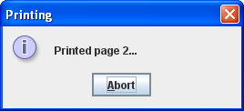
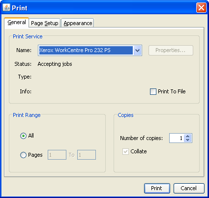
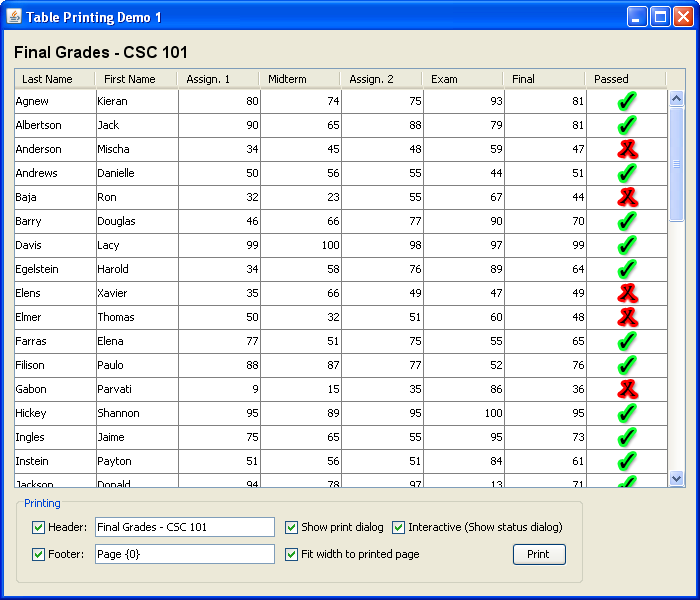
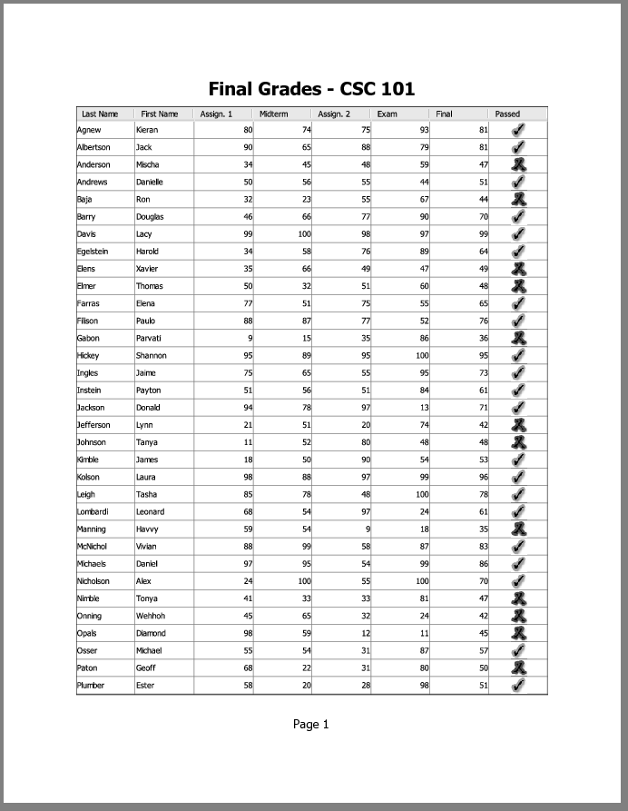
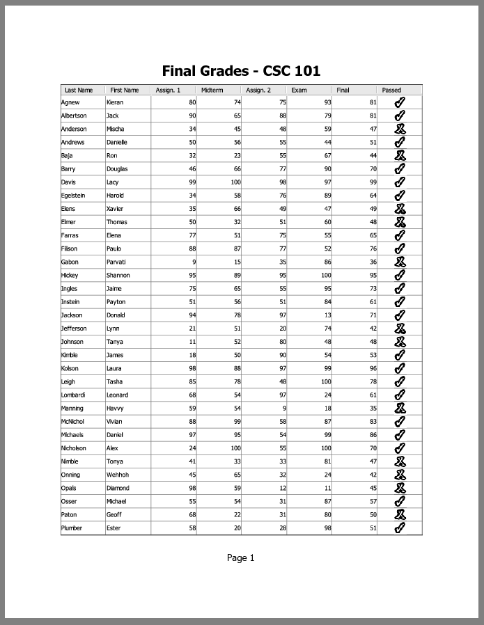
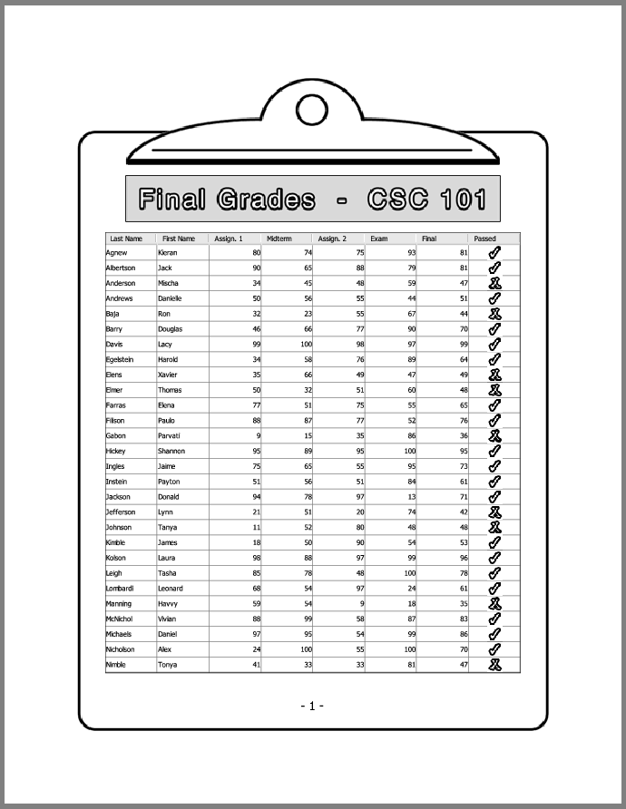
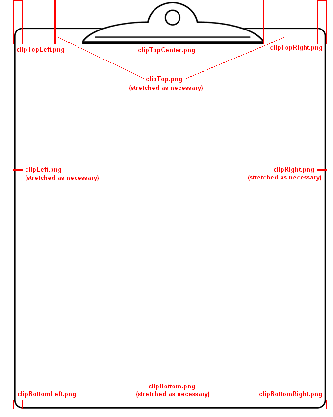

# 如何打印表格

> 原文： [https://docs.oracle.com/javase/tutorial/uiswing/misc/printtable.html](https://docs.oracle.com/javase/tutorial/uiswing/misc/printtable.html)

`JTable`类为打印表提供支持。 `JTable`打印 API 包含允许您实现基本和高级打印任务的方法。对于常见的打印任务，当您只需打印表格时，请直接使用`print`方法。 `print`方法有多种形式，带有各种参数集。此方法准备您的表，获取相应的`Printable`对象，并将其发送到打印机。

如果`Printable`对象的默认实现不符合您的需要，您可以通过覆盖`getPrintable`方法来自定义打印布局以包装默认`Printable`，甚至完全替换它。

打印表的最简单方法是调用不带参数的`print`方法。请参阅下面的代码示例。

```
try {
    boolean complete = table.print();
    if (complete) {
        /* show a success message  */
        ...
    } else {
        /*show a message indicating that printing was cancelled */
        ...
    }
} catch (PrinterException pe) {
    /* Printing failed, report to the user */
    ...
}

```

当您在没有参数的情况下调用`print`方法时，会显示一个打印对话框，然后在没有页眉或页脚的情况下以`FIT_WIDTH`模式交互式打印您的表格。下面的代码示例显示了带有完整参数集的`print`方法签名。

```
boolean complete = table.print(JTable.PrintMode printMode,
                               MessageFormat headerFormat,
                               MessageFormat footerFormat, 
                               boolean showPrintDialog,
                               PrintRequestAttributeSet attr,
                               boolean interactive,
                               PrintService service);

```

当您使用所有参数调用`print`方法时，您明确选择打印功能，如打印模式，页眉和页脚文本，打印属性，目标打印服务，以及是否显示打印对话框，以及是以交互方式还是以非交互方式打印。要确定哪种参数最适合您的需求，请参阅下面的可用功能说明。

`JTable`打印 API 提供以下功能：

*   [交互式或非交互式打印](#interactively)
*   [显示打印对话框](#dialog)
*   [将页眉或页脚（或两者）添加到打印版面](#header)
*   [选择打印模式](#mode)
*   [自动布局和分页](#layout)

在交互模式下，在打印期间会显示带有中止选项的进度对话框。以下是进度对话框的示例。



该对话框使用户可以跟踪打印进度。进度对话框是模态的，这意味着当它显示在屏幕上时，用户无法与表进行交互。重要的是，您的表在打印时保持不变，否则打印行为将不确定。然而，交互式打印不会阻止其他开发人员的代码更改表。例如，有另一个使用`SwingUtilities.invokeLater`方法发布更新的线程。因此，为确保正确的打印行为，您应确保自己的代码在打印过程中不会修改表格。

或者，您可以非交互式打印表格。在此模式下，立即在事件分派线程上开始打印，并完全阻止要处理的任何事件。一方面，这种模式可以安全地保持表格不受任何变化，直到打印完成。另一方面，该模式完全剥夺了用户与 GUI 的任何交互。这就是为什么只能在从具有不可见 GUI 的应用程序打印时建议非交互式打印。

您可以显示标准打印对话框，允许用户执行以下操作：

*   选择一台打印机
*   指定份数
*   更改打印属性
*   在开始之前取消打印
*   开始打印



您可能会注意到打印对话框未指定打印输出中的总页数。这是因为表打印实现使用`Printable` API，并且在打印时间之前不知道总页数。

页眉和页脚由 [`MessageFormat`](https://docs.oracle.com/javase/8/docs/api/java/text/MessageFormat.html) 参数提供。这些参数允许页眉和页脚本地化。阅读 [`MessageFormat`](https://docs.oracle.com/javase/8/docs/api/java/text/MessageFormat.html) 类的文档，因为某些字符（如单引号）是特殊的，需要避免。页眉和页脚都居中。您可以使用{0}插入页码。

`MessageFormat footer = new MessageFormat("Page - {0}");`

由于在打印时间之前未知输出中的总页数，因此无法指定“第 1 页，共 5 页”之类的编号格式。

打印模式负责缩放输出并将其分布在页面上。您可以使用以下模式之一打印表格：

*   `PrintMode.NORMAL`
*   `PrintMode.FIT_WIDTH`

在`NORMAL`模式下，以当前尺寸打印表格。如果列不适合页面，则它们会根据表的`ComponentOrientation`分布在其他页面上。在`FIT_WIDTH`模式下，如果需要，表格具有较小的尺寸以适合每页上的所有列。请注意，缩放宽度和高度都可以提供相同宽高比的输出。在两种模式中，行按顺序分布在多个页面上，页面上的行数尽可能多。

使用`JTable`打印 API，您无需处理布局和分页。您只需要为`print`方法指定适当的参数，例如打印模式和页脚文本格式（如果要在页脚中插入页码）。如前所述，您可以通过在`MessageFormat`页脚参数的字符串中包含`"{0}"`来指定页脚中的页码。在打印输出中，{0}将替换为当前页码。

## 表打印示例

让我们看一个名为`TablePrintDemo1`的例子。该程序的整个代码可以在 [`TablePrintDemo1.java`](../examples/misc/TablePrintDemo1Project/src/misc/TablePrintDemo1.java) 中找到。该演示的丰富 GUI 由 [NetBeans IDE GUI 构建器](http://netbeans.org/kb/docs/java/quickstart-gui.html)自动构建。这是`TablePrintDemo1`应用程序的图片。



* * *

**Try this:** 

1.  单击“启动”按钮以使用 [Java™Web Start](http://www.oracle.com/technetwork/java/javase/javawebstart/index.html) （[下载 JDK 7 或更高版本](http://www.oracle.com/technetwork/java/javase/downloads/index.html)）运行 TablePrintDemo1。或者，要自己编译并运行示例，请参考[示例索引](../examples/misc/index.html#TablePrintDemo1)。 [](https://docs.oracle.com/javase/tutorialJWS/samples/uiswing/TablePrintDemo1Project/TablePrintDemo1.jnlp) 

2.  应用程序窗口底部的每个复选框都有一个工具提示。将光标悬停在复选框上以查明其用途。
3.  编辑页眉或页脚复选框中的文本或两者以提供不同的页眉或页脚。
4.  清除页眉或页脚复选框或两者都可以关闭页眉或页脚。
5.  清除“显示打印”对话框复选框以关闭打印对话框。
6.  清除“适合打印页面宽度”复选框以选择`NORMAL`模式下的打印。
7.  清除交互（显示状态对话框）复选框以关闭打印对话框。
8.  单击“打印”按钮，根据所选选项打印表格。

每当 Web 启动的应用程序尝试打印时，Java Web Start 都会弹出一个安全对话框，询问用户是否允许打印。要继续打印，用户必须接受请求。

请注意，清除“交互”复选框时，会显示一条消息，警告用户非交互式打印的缺点。您可以在`PrintGradesTable`方法中找到打印代码。调用时，此方法首先从 GUI 组件中获取所选选项集，然后按如下方式调用`print`方法。

```
boolean complete = gradesTable.print(mode, header, footer,
                                     showPrintDialog, null,
                                     interactive, null);

```

然后，`print`方法返回的值用于显示成功消息或表示用户取消打印的消息。

另一个重要特性是表格打印 API 使用表格渲染器。通过使用表格的渲染器，API 提供的打印输出看起来像屏幕上的表格。查看屏幕上表格的最后一列。它包含表示每个学生的通过或失败状态的自定义图像。现在看看打印结果。您可以看到检查和 X 标记看起来相同。

以下是`FIT_WIDTH`模式下 TablePrintDemo1 打印结果的图片。

[](https://docs.oracle.com/javase/tutorial/figures/uiswing/misc/TablePrintDemo1_out.png)
_This figure has been reduced to fit on the page.
Click the image to view it at its natural size._

### TablePrintDemo2 示例

`TablePrintDemo2`示例基于之前的演示，并具有相同的界面。唯一的区别在于打印输出。如果更仔细地查看 TablePrintDemo1 的打印结果，您可能会注意到检查和 X 标记是模糊的。 `TablePrintDemo2`示例显示如何自定义表格以使图像在表格打印输出中更具可辨别性。在此演示中，重写的`getTableCellRendererComponent`方法可以确定是否正在打印表格并返回更清晰的黑白图像。如果未打印表格，则会返回您可以在屏幕上看到的彩色图像。

单击“启动”按钮以使用 [Java™Web Start](http://www.oracle.com/technetwork/java/javase/javawebstart/index.html) （[下载 JDK 7 或更高版本](http://www.oracle.com/technetwork/java/javase/downloads/index.html)）运行 TablePrintDemo2。或者，要自己编译并运行示例，请参考[示例索引](../examples/misc/index.html#TablePrintDemo2)。

[](https://docs.oracle.com/javase/tutorialJWS/samples/uiswing/TablePrintDemo2Project/TablePrintDemo2.jnlp)

`JComponent`类中定义的 [`isPaintingForPrint`](https://docs.oracle.com/javase/8/docs/api/javax/swing/JComponent.html#isPaintingForPrint--) 方法允许我们自定义我们打印的内容与屏幕上显示的内容。自 [`TablePrintDemo2.java`](../examples/misc/TablePrintDemo2Project/src/misc/TablePrintDemo2.java) 的自定义单元格渲染器的代码如下所示。此代码根据`isPaintingForPrint`方法返回的值选择要使用的图像。

```
    /**
     * A custom cell renderer that extends TablePrinteDemo1's renderer, to instead
     * use clearer black and white versions of the icons when printing.
     */
    protected static class BWPassedColumnRenderer extends PassedColumnRenderer {
            public Component getTableCellRendererComponent(JTable table,
                                                           Object value,
                                                           boolean isSelected,
                                                           boolean hasFocus,
                                                           int row,
                                                           int column) {

            super.getTableCellRendererComponent(table, value, isSelected,
                                                hasFocus, row, column);

            /* if we're currently printing, use the black and white icons */
            if (table.isPaintingForPrint()) {
                boolean status = (Boolean)value;
                setIcon(status ? passedIconBW : failedIconBW);
            } /* otherwise, the superclass (colored) icons are used */

            return this;
        }
    }

```

下面是`FIT_WIDTH`模式下 TablePrintDemo2 打印结果的图片。

[](https://docs.oracle.com/javase/tutorial/figures/uiswing/misc/TablePrintDemo2_out.png)
_This figure has been reduced to fit on the page.
Click the image to view it at its natural size._

### TablePrintDemo3 示例

`TablePrintDemo3`示例基于前两个演示。此示例显示如何通过使用额外修饰包装默认`Printable`来提供自定义`Printable`实现。此演示具有类似的界面，但页眉和页脚复选框被禁用，因为自定义的可打印对象将提供自己的页眉和页脚。

单击“启动”按钮以使用 [Java™Web Start](http://www.oracle.com/technetwork/java/javase/javawebstart/index.html) （[下载 JDK 7 或更高版本](http://www.oracle.com/technetwork/java/javase/downloads/index.html)）运行 TablePrintDemo3。或者，要自己编译并运行示例，请参考[示例索引](../examples/misc/index.html#TablePrintDemo3)。

[](https://docs.oracle.com/javase/tutorialJWS/samples/uiswing/TablePrintDemo3Project/TablePrintDemo3.jnlp)

此示例将表打印在剪贴板的图像中。这是`FIT_WIDTH`模式下打印结果的图片。

[](https://docs.oracle.com/javase/tutorial/figures/uiswing/misc/TablePrintDemo3_out.png)
_This figure has been reduced to fit on the page.
Click the image to view it at its natural size._

该程序的整个代码可以在 [`TablePrintDemo3.java`](../examples/misc/TablePrintDemo3Project/src/misc/TablePrintDemo3.java) 中找到。在本演示中，`JTable`类的自定义子类称为`FancyPrintingJTable`。此`FancyPrintingJTable`类重写`getPrintable`方法以返回自定义可打印对象，该对象使用自己的装饰和页眉和页脚包装默认可打印对象。这是`getPrintable`方法的实现。

```
public Printable getPrintable(PrintMode printMode,
                              MessageFormat headerFormat,
                              MessageFormat footerFormat) {

     MessageFormat pageNumber = new MessageFormat("- {0} -");

     /* Fetch the default printable */
     Printable delegate = super.getPrintable(printMode, null, pageNumber);

     /* Return a fancy printable that wraps the default */
     return new FancyPrintable(delegate);
}

```

`FancyPrintable`类负责将默认的可打印对象包装到另一个可打印对象中并设置剪贴板图像。当实例化此类的实例时，它会加载组装剪贴板图像所需的图像，计算剪贴板图像所需的区域，计算表的缩小区域，将表打印到较小的区域，然后组装并打印剪贴板图像。

注意相对于页面大小组装剪贴板图像的代码的灵活性。代码考虑了实际的页面尺寸，并将辅助图像放在一起，根据需要拉伸其中一些，以便最终的剪贴板图像适合实际的页面大小。下图显示了辅助图像，并指示这些图像如何构成最终输出。

[](https://docs.oracle.com/javase/tutorial/figures/uiswing/misc/TablePrintDemo3_clipboard.png)
_This figure has been reduced to fit on the page.
Click the image to view it at its natural size._

## 表打印 API

本节列出了`JTable`类中定义的允许您打印表的方法。

| 方法 | 目的 |
| :-: | :-: |
| [boolean print（）](https://docs.oracle.com/javase/8/docs/api/javax/swing/JTable.html#print--)
[boolean print（printMode）](https://docs.oracle.com/javase/8/docs/api/javax/swing/JTable.html#print-javax.swing.JTable.PrintMode-)
[boolean print（printMode，MessageFormat，MessageFormat）](https://docs.oracle.com/javase/8/docs/api/javax/swing/JTable.html#print-javax.swing.JTable.PrintMode-java.text.MessageFormat-java.text.MessageFormat-)
[boolean print （printMode，MessageFormat，MessageFormat，boolean，PrintRequestAttributeSet，boolean）](https://docs.oracle.com/javase/8/docs/api/javax/swing/JTable.html#print-javax.swing.JTable.PrintMode-java.text.MessageFormat-java.text.MessageFormat-boolean-javax.print.attribute.PrintRequestAttributeSet-boolean-)
[boolean print（printMode，MessageFormat，MessageFormat，boolean，PrintRequestAttributeSet，boolean，PrintService）](https://docs.oracle.com/javase/8/docs/api/javax/swing/JTable.html#print-javax.swing.JTable.PrintMode-java.text.MessageFormat-java.text.MessageFormat-boolean-javax.print.attribute.PrintRequestAttributeSet-boolean-javax.print.PrintService-) | 在不带参数的情况下调用时，显示打印对话框，然后以`FIT_WIDTH`模式以交互方式打印此表，而不显示页眉或页脚文本。如果用户继续打印，则返回`true`;如果用户取消打印，则返回`false`。
使用完整的参数集调用时，根据指定的参数打印此表。第一个参数指定打印模式。两个`MessageFormat`参数指定页眉和页脚文本。第一个布尔参数定义是否显示打印对话框。另一个布尔参数指定是否以交互方式打印。使用另外两个参数，您可以指定打印属性和打印服务。
每当省略`PrintService`参数时，将使用默认打印机。 |
| [可打印的 getPrintable（PrintMode，MessageFormat，MessageFormat）](https://docs.oracle.com/javase/8/docs/api/javax/swing/JTable.html#getPrintable-javax.swing.JTable.PrintMode-java.text.MessageFormat-java.text.MessageFormat-) | 返回用于打印表的`Printable`。重写此方法以获取自定义的`Printable`对象。您可以将一个`Printable`对象包装到另一个中以获得各种布局。 |

此表列出了使用表打印的示例，并指出了描述这些示例的位置。

| 例 | 在哪里描述 | 笔记 |
| :-- | :-- | :-- |
| [`TablePrintDemo`](../examples/components/index.html#TablePrintDemo) | [如何使用表格](../components/table.html#printing) | 演示表格打印的基本功能，例如显示打印对话框，然后以`FIT_WIDTH`模式以页码作为标题以交互方式打印。 |
| [`TablePrintDemo1`](../examples/misc/index.html#TablePrintDemo1) | 这一页 | 详细介绍了表打印的基础知识，并提供了丰富的 GUI。允许用户指定页眉或页脚文本，选择打印模式，打开或关闭打印对话框，以及以交互方式或非交互方式选择打印。 |
| [`TablePrintDemo2`](../examples/misc/index.html#TablePrintDemo2) | 这一页 | 基于 TablePrintDemo1，此示例具有相同的接口。此演示演示如何自定义表格，以使打印结果与屏幕上显示的表格不同。 |
| [`TablePrintDemo3`](../examples/misc/index.html#TablePrintDemo3) | 这一页 | 此演示显示了高级表格打印功能，例如将默认表格打印到另一个可打印的格式以获得不同的布局。 |

[« Previous](modality.html) • [Trail](../TOC.html) • [Next »](printtext.html)